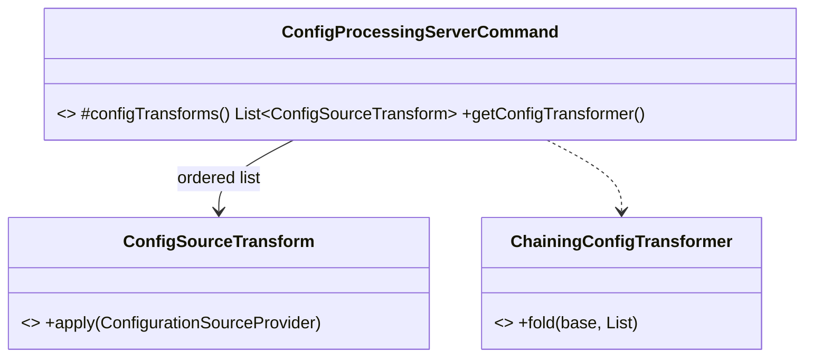

# cloud-sdk Enhancement Design — G6: Composable Config-Transform Chain (commons)

| | |
|---|---|
| **Gap ID** | G6 |
| **Jira** | ION-12310 |
| **Feature branch** | `feature/ION-12310-cloudsdk-g6-composable-config-chain` (off `feature/ION-12310-commons-cloudsdk-refactoring`) |
| **Modules touched** | `commons` (`ConfigProcessingServerCommand`) |
| **Compatibility** | Additive only — default chain unchanged; new injectable overload |
| **Date** | 2026-06-01 |

## 1. Gap reference & sources

- appianway master gap list: `shared/docs/2026-05-31-shared-aws2x-upgrade-plan-copilot.md` §11 (G6) and §10 (config-composition model).
- Full spec: `shared/docs/2026-05-31-shared-aws2x-upgrade-DESIGN.md` §1A.5–§1A.6 (G6).

## 2. Problem statement

commons `ConfigProcessingServerCommand.getConfigTransformer()` **hardcodes** the transform chain (`trim.andThen(awsps)`). appianway needs to compose its own `.properties` / `${PROFILE}` / `${ENV}` resolution and a `ValidatingLookup` fail-fast transform **around** the commons SSM (`${awsps:...}`) transform. Today appianway would have to subclass/replace the whole command; the clean end state is a pluggable, ordered transform chain.

## 3. Current state

- `ConfigProcessingServerCommand` (commons) builds a fixed `ConfigurationSourceProvider` decorator chain via `getConfigTransformer()`.
- Per `git_log` (commit `8497efa67eee`), **commons was deliberately decoupled from cloud-sdk-aws** — the SSM lookup now flows through a `ParameterStoreLookup` SPI. G6 must stay within commons and respect that SPI boundary (do **not** reintroduce a cloud-sdk-aws compile dependency in commons).

> **Read before coding:** `commons/docs/2026-05-29-ParameterStoreLookup-refactor.md` and the current `ConfigProcessingServerCommand` source to confirm exact types/signatures.

## 4. Proposed design

Make the chain injectable while keeping the current default behaviour:

```java
// New: an ordered, composable transform abstraction (commons)
@FunctionalInterface
public interface ConfigSourceTransform {
    ConfigurationSourceProvider apply(ConfigurationSourceProvider delegate);
}

// ConfigProcessingServerCommand changes (additive):
// - keep the existing zero-arg behaviour: getConfigTransformer() returns trim.andThen(awsps) (UNCHANGED default)
// - add a protected, overridable hook + a constructor/setter accepting an ordered List<ConfigSourceTransform>
protected List<ConfigSourceTransform> configTransforms() {
    return List.of(trimTransform(), awspsTransform()); // current default, preserved
}
// final chain = fold transforms over the base provider in order
```

- appianway supplies its own ordered list (`PropertiesLookup` → `EnvironmentVariableLookup` → `awsps` → `ValidatingLookup`) by overriding `configTransforms()` or passing the list in — **without** forking the whole command.
- The default (no override) is byte-for-byte the current chain, so every existing `mercury-services` consumer is unaffected.
- A small `ChainingConfigTransformer` builder helper folds the list (`transforms.stream().reduce(...)`).



## 5. API-compatibility analysis

- `getConfigTransformer()` default output is unchanged (`trim.andThen(awsps)`).
- New `protected configTransforms()` hook + new `ConfigSourceTransform` type + optional constructor/setter — additive. Existing subclasses and callers compile and behave identically.
- No cloud-sdk-aws dependency added to commons (respects the ParameterStoreLookup SPI decoupling).

## 6. Maven / dependency changes

None. Pure commons refactor within existing Dropwizard config APIs. No OWASP impact.

## 7. Test plan (JUnit 5 + AssertJ)

- `ConfigProcessingServerCommandTest`: default chain still applies `trim` then `awsps` (order asserted); a custom ordered list composes in the given order; fail-fast `ValidatingLookup`-style transform surfaces unresolved placeholders. Use an in-memory `ConfigurationSourceProvider` stub — no AWS.

## 8. Rollout / back-out

- Additive. appianway injects its transform set; until adopted, appianway can still subclass (current fallback).
- Back-out: remove the hook/type; default chain untouched.
