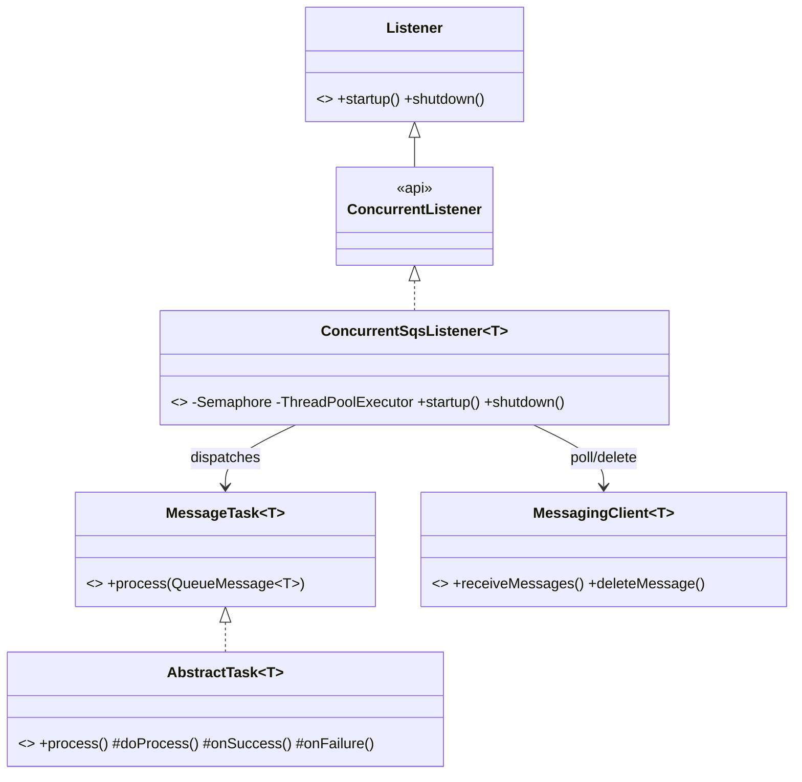
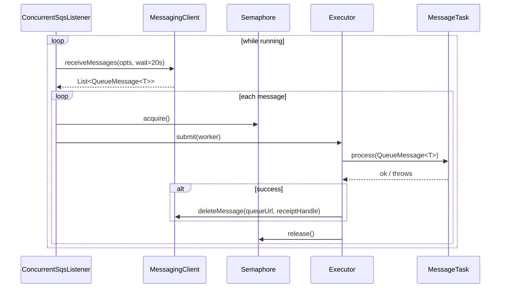

# cloud-sdk Enhancement Design — G1: Concurrent, Semaphore-Bounded SQS Listener + Task Base

| | |
|---|---|
| **Gap ID** | G1 |
| **Jira** | ION-12310 |
| **Feature branch** | `feature/ION-12310-cloudsdk-g1-concurrent-sqs-listener` (off `feature/ION-12310-commons-cloudsdk-refactoring`) |
| **Modules touched** | `cloud-sdk-api` (new interfaces/base), `cloud-sdk-aws` (new impl) |
| **Compatibility** | Additive only — no existing public signature changes |
| **Date** | 2026-06-01 |

## 1. Gap reference & sources

- appianway master gap list: `shared/docs/2026-05-31-shared-aws2x-upgrade-plan-copilot.md` §11 (G1).
- Full technical spec: `shared/docs/2026-05-31-shared-aws2x-upgrade-DESIGN.md` §1A.6 (G1).
- Consuming modules: `dispatcher`, `distributor`, `distributor-rest`, `transformer`, `event-writer`, `error-processor`, `splitter`, `ingestor`, `email-sender` (every SQS consumer), plus a test fake in `functional-testing`.

## 2. Problem statement

appianway services run a long-poll SQS consumer with **bounded concurrency**: a thread pool gated by a `Semaphore` sized to `maxNumberOfMessages`, each message handed to a `Task` that consumes a typed payload. This is appianway's `SQSListener` + `AsyncDispatcher` model.

The current cloud-sdk `SqsListener` ([cloud-sdk-aws/.../messaging/aws/impl/SqsListener.java](../../cloud-sdk-aws/src/main/java/com/inttra/mercury/cloudsdk/messaging/aws/impl/SqsListener.java)) is:

1. **Single-threaded** — a synchronous `while` poll loop calling `pollAndExecute` inline; no concurrency.
2. **Leaks the v2 SDK type** — its `taskProcessor` is a `BiConsumer<List<software.amazon.awssdk.services.sqs.model.Message>, Consumer<Message>>`, exposing the raw AWS SDK `Message` to callers instead of the abstraction's `QueueMessage<T>`.

appianway therefore cannot adopt cloud-sdk for its consumers without re-implementing concurrency itself, and would be coupled back to the v2 SDK type the abstraction is meant to hide.

## 3. Current state in cloud-sdk

| Element | Location | Notes |
|---|---|---|
| `Listener` | [cloud-sdk-api/.../messaging/api/Listener.java](../../cloud-sdk-api/src/main/java/com/inttra/mercury/cloudsdk/messaging/api/Listener.java) | `startup()` / `shutdown()` lifecycle. |
| `MessagingClient<T>` | [cloud-sdk-api/.../messaging/api/MessagingClient.java](../../cloud-sdk-api/src/main/java/com/inttra/mercury/cloudsdk/messaging/api/MessagingClient.java) | `receiveMessages(ReceiveMessageOptions)` returns `List<QueueMessage<T>>`; `deleteMessage(queueUrl, receiptHandle)`. |
| `QueueMessage<T>` | [cloud-sdk-api/.../messaging/api/QueueMessage.java](../../cloud-sdk-api/src/main/java/com/inttra/mercury/cloudsdk/messaging/api/QueueMessage.java) | `getMessageId/getReceiptHandle/getPayload/getAttributes/getSentTimestamp`. |
| `ReceiveMessageOptions` | [cloud-sdk-api/.../messaging/model/ReceiveMessageOptions.java](../../cloud-sdk-api/src/main/java/com/inttra/mercury/cloudsdk/messaging/model/ReceiveMessageOptions.java) | builder: queueUrl, maxMessages, waitTimeSeconds, (visibilityTimeout). |
| `SqsListener<T>` | [cloud-sdk-aws/.../messaging/aws/impl/SqsListener.java](../../cloud-sdk-aws/src/main/java/com/inttra/mercury/cloudsdk/messaging/aws/impl/SqsListener.java) | single-threaded; `BiConsumer<List<Message>, Consumer<Message>>` taskProcessor. **Kept as-is.** |
| `SqsMessage<T>` | [cloud-sdk-aws/.../messaging/aws/impl/SqsMessage.java](../../cloud-sdk-aws/src/main/java/com/inttra/mercury/cloudsdk/messaging/aws/impl/SqsMessage.java) | wraps v2 `Message`; already implements `QueueMessage<T>`. |
| `MessagingClientFactory` | [cloud-sdk-aws/.../messaging/factory/MessagingClientFactory.java](../../cloud-sdk-aws/src/main/java/com/inttra/mercury/cloudsdk/messaging/factory/MessagingClientFactory.java) | factory pattern for clients. |

**Missing:** a typed `Task` contract over `QueueMessage<T>`, a concurrent listener, and a `FAILED_ATTEMPTS`-aware attribute surface.

## 4. Proposed design

Additive: the existing `SqsListener` and its `taskProcessor` contract are untouched. We add a new typed Task contract in `cloud-sdk-api` and a new concurrent listener in `cloud-sdk-aws`.

### 4.1 `cloud-sdk-api` additions (package `messaging.api`)

```java
// MessageTask.java
public interface MessageTask<T> {
    void process(QueueMessage<T> message) throws Exception;
}

// AbstractTask.java — lifecycle hooks; subclasses implement doProcess
public abstract class AbstractTask<T> implements MessageTask<T> {
    @Override
    public final void process(QueueMessage<T> message) throws Exception {
        try {
            doProcess(message);
            onSuccess(message);
        } catch (Exception e) {
            onFailure(message, e);
            throw e;
        }
    }
    protected abstract void doProcess(QueueMessage<T> message) throws Exception;
    protected void onSuccess(QueueMessage<T> message) { /* no-op */ }
    protected void onFailure(QueueMessage<T> message, Exception e) { /* no-op */ }
}

// ConcurrentListener.java — marker extension of Listener for bounded-concurrency listeners
public interface ConcurrentListener extends Listener { }
```

`QueueMessage.getAttributes()` already exposes SQS attributes; the `FAILED_ATTEMPTS`/`ApproximateReceiveCount` value is read by consumers from that map (documented, no signature change). An optional convenience constant is added (`QueueMessageAttributes.APPROXIMATE_RECEIVE_COUNT = "ApproximateReceiveCount"`).

### 4.2 `cloud-sdk-aws` additions (package `messaging.aws.impl`)

```java
public class ConcurrentSqsListener<T> implements ConcurrentListener {
    private final MessagingClient<T> messagingClient;
    private final MessageTask<T> task;
    private final ReceiveMessageOptions options; // queueUrl, maxMessages, waitTimeSeconds(=20), visibilityTimeout
    private final int concurrency;               // = maxMessages by default
    private final Semaphore semaphore;
    private final ThreadPoolExecutor executor;
    private volatile boolean running;
    // startup(): long-poll loop -> for each QueueMessage<T>: semaphore.acquire(),
    //            executor.submit(() -> { try { task.process(m);
    //            messagingClient.deleteMessage(queueUrl, m.getReceiptHandle()); }
    //            finally { semaphore.release(); } })
    // shutdown(): running=false; executor graceful shutdown + awaitTermination
}
```

- Long-poll via `messagingClient.receiveMessages(options)` (`waitTimeSeconds=20`).
- `Semaphore(concurrency)` bounds in-flight messages; pool size = `concurrency`.
- The task receives `QueueMessage<T>` (via the existing `SqsMessage<T>`), **never** the raw v2 `Message`.
- Delete-on-success only (no poison-pill loops); failures leave the message for SQS redelivery / DLQ.
- A builder + a `MessagingClientFactory.concurrentListener(...)` factory method mirror existing factory conventions.

### 4.3 Class diagram



### 4.4 Sequence diagram



## 5. API-compatibility analysis

- All additions are **new types** (`MessageTask`, `AbstractTask`, `ConcurrentListener`, `ConcurrentSqsListener`) — no change to `Listener`, `SqsListener`, `MessagingClient`, or `QueueMessage`.
- `SqsListener` and its `taskProcessor` contract remain for current callers (none in `mercury-services` adopt the concurrent model yet — confirmed via `kb_search`). Binary- and source-compatible.
- New optional constant class adds no obligations.

## 6. Maven / dependency changes

None. Uses `java.util.concurrent` only; no new third-party dependency. No OWASP impact.

## 7. Test plan (JUnit 5 + Mockito + AssertJ)

- `ConcurrentSqsListenerTest`: mock `MessagingClient`; assert bounded concurrency (semaphore never exceeds `concurrency`), delete-on-success, no-delete-on-failure, graceful `shutdown()` drains in-flight, interruption handling.
- `AbstractTaskTest`: `onSuccess` on normal path, `onFailure` + rethrow on exception.
- Concurrency assertions via `CountDownLatch`/`CyclicBarrier`; deterministic, no real AWS.

## 8. Rollout / back-out

- Purely additive; ship in `1.0.26-SNAPSHOT` line. appianway adopts by replacing its `SQSListener`/`AsyncDispatcher` with `ConcurrentSqsListener` + `AbstractTask`.
- Back-out: remove the new classes; no consumer of the old API is affected.
