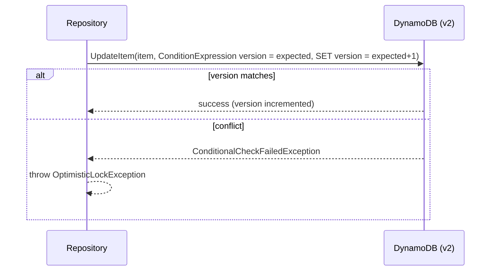

# cloud-sdk Enhancement Design — G4: DynamoDB Optimistic-Lock / Version Attribute + Atomic Counter

| | |
|---|---|
| **Gap ID** | G4 |
| **Jira** | ION-12310 |
| **Feature branch** | `feature/ION-12310-cloudsdk-g4-dynamo-version-attribute` (off `feature/ION-12310-commons-cloudsdk-refactoring`) |
| **Modules touched** | `cloud-sdk-api` (annotation, exception, repo default), `cloud-sdk-aws` (`EnhancedDynamoRepository`/`StandardDynamoRepository`), `dynamo-integration-test` (IT) |
| **Compatibility** | Additive only — new annotation/exception/default method |
| **Date** | 2026-06-01 |

## 1. Gap reference & sources

- appianway master gap list: `shared/docs/2026-05-31-shared-aws2x-upgrade-plan-copilot.md` §11 (G4).
- Full spec: `shared/docs/2026-05-31-shared-aws2x-upgrade-DESIGN.md` §1A.6 (G4).
- Owning module design: transformer DESIGN §6 — `ControlNumberSequence` uses `@DynamoDBVersionAttribute` (v1) with CONSISTENT reads for control-number generation under concurrency.

## 2. Problem statement

transformer's `ControlNumberSequence` relies on DynamoDB **optimistic locking** (a version attribute) plus an **atomic counter / sequence** to generate gap-free control numbers under concurrency. The cloud-sdk `database/annotation` package has only `@Table`, `@DynamoDbField`, `@TTL` — **no** version/optimistic-lock annotation, and `DatabaseRepository` exposes no atomic-counter helper or optimistic-lock failure signal.

## 3. Current state in cloud-sdk

| Element | Location | Notes |
|---|---|---|
| `@Table`, `@DynamoDbField`, `@TTL` | [cloud-sdk-api/.../database/annotation/](../../cloud-sdk-api/src/main/java/com/inttra/mercury/cloudsdk/database/annotation) | No version annotation. |
| `DatabaseRepository<T,ID>` | [cloud-sdk-api/.../database/api/DatabaseRepository.java](../../cloud-sdk-api/src/main/java/com/inttra/mercury/cloudsdk/database/api/DatabaseRepository.java) | `save`/`update`/`findById(consistentRead)`; no `incrementAndGet`, no optimistic-lock exception. |
| `EnhancedDynamoRepository` | [cloud-sdk-aws/.../database/impl/EnhancedDynamoRepository.java](../../cloud-sdk-aws/src/main/java/com/inttra/mercury/cloudsdk/database/impl/EnhancedDynamoRepository.java) | v2 Enhanced Client based. |
| `StandardDynamoRepository` | [cloud-sdk-aws/.../database/impl/StandardDynamoRepository.java](../../cloud-sdk-aws/src/main/java/com/inttra/mercury/cloudsdk/database/impl/StandardDynamoRepository.java) | low-level client based. |
| `ReflectionEntityMapper` | [cloud-sdk-aws/.../database/model/ReflectionEntityMapper.java](../../cloud-sdk-aws/src/main/java/com/inttra/mercury/cloudsdk/database/model/ReflectionEntityMapper.java) | processes the cloud-sdk annotations. |

> **Investigation note (do during implementation):** confirm whether `EnhancedDynamoRepository` already wires the v2 Enhanced Client `VersionedRecordExtension`. If it does, G4 reduces to **exposing** the api-level annotation + `OptimisticLockException` and mapping them; if not, add the extension.

## 4. Proposed design

### 4.1 `cloud-sdk-api` additions

```java
// database/annotation/DynamoDbVersionAttribute.java
@Retention(RetentionPolicy.RUNTIME)
@Target(ElementType.FIELD)
public @interface DynamoDbVersionAttribute { String value() default ""; }

// database/exception/OptimisticLockException.java
public class OptimisticLockException extends DynamoSupportException { ... }

// DatabaseRepository — atomic counter helper as default (throws UnsupportedOperationException
// until overridden, so existing impls compile unchanged)
default long incrementAndGet(ID key, String counterAttribute) {
    throw new UnsupportedOperationException("incrementAndGet not supported by this repository");
}
```

### 4.2 `cloud-sdk-aws` implementation

- **`EnhancedDynamoRepository`**: register the v2 `VersionedRecordExtension` on the `DynamoDbEnhancedClient`; map the api `@DynamoDbVersionAttribute` field to the SDK's `@DynamoDbVersionAttribute` via the schema/`ReflectionEntityMapper`. `save`/`update` then perform conditional writes on the version; a `ConditionalCheckFailedException` is translated to `OptimisticLockException`.
- **`StandardDynamoRepository`**: implement `incrementAndGet` as a single `UpdateItem` with `UpdateExpression = "ADD #c :one"`, `ReturnValues=UPDATED_NEW`, returning the new value — an atomic counter for control-number sequences. For versioned `update`, issue `ConditionExpression` on the version attribute and translate `ConditionalCheckFailedException` → `OptimisticLockException`.
- `ReflectionEntityMapper`/`EntityTableMetadata` recognize the new annotation when building table metadata.

### 4.3 Sequence diagram (versioned update)



## 5. API-compatibility analysis

- New annotation + new exception (extends existing `DynamoSupportException`) + `default` `incrementAndGet` → existing `DatabaseRepository` implementors compile unchanged.
- No existing method signature changes. Entities without `@DynamoDbVersionAttribute` behave exactly as today.
- `kb_search` confirms no current consumer calls `incrementAndGet` (new) and none defines a version field yet.

## 6. Maven / dependency changes

None new — uses AWS SDK v2 `dynamodb-enhanced` (already a dependency). No OWASP impact.

## 7. Test plan (JUnit 5 + `dynamo-integration-test`)

- Unit: annotation processing in `ReflectionEntityMapper`; `ConditionalCheckFailedException` → `OptimisticLockException` mapping (mocked client).
- Integration (`dynamo-integration-test`, `@Category(IntegrationTests.class)`): concurrent `incrementAndGet` yields a gap-free, unique sequence; concurrent versioned `update` → exactly one wins, loser gets `OptimisticLockException`; round-trip of a versioned entity.

## 8. Rollout / back-out

- Additive. transformer adopts the annotation + `incrementAndGet` for `ControlNumberSequence`.
- Back-out: remove annotation/exception/extension registration; entities without the annotation are unaffected.
