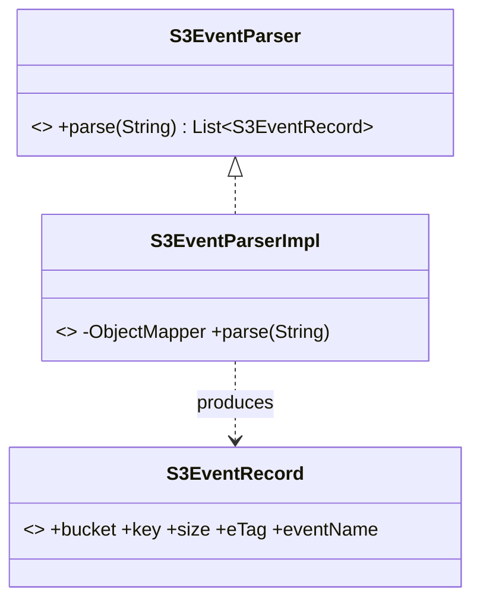
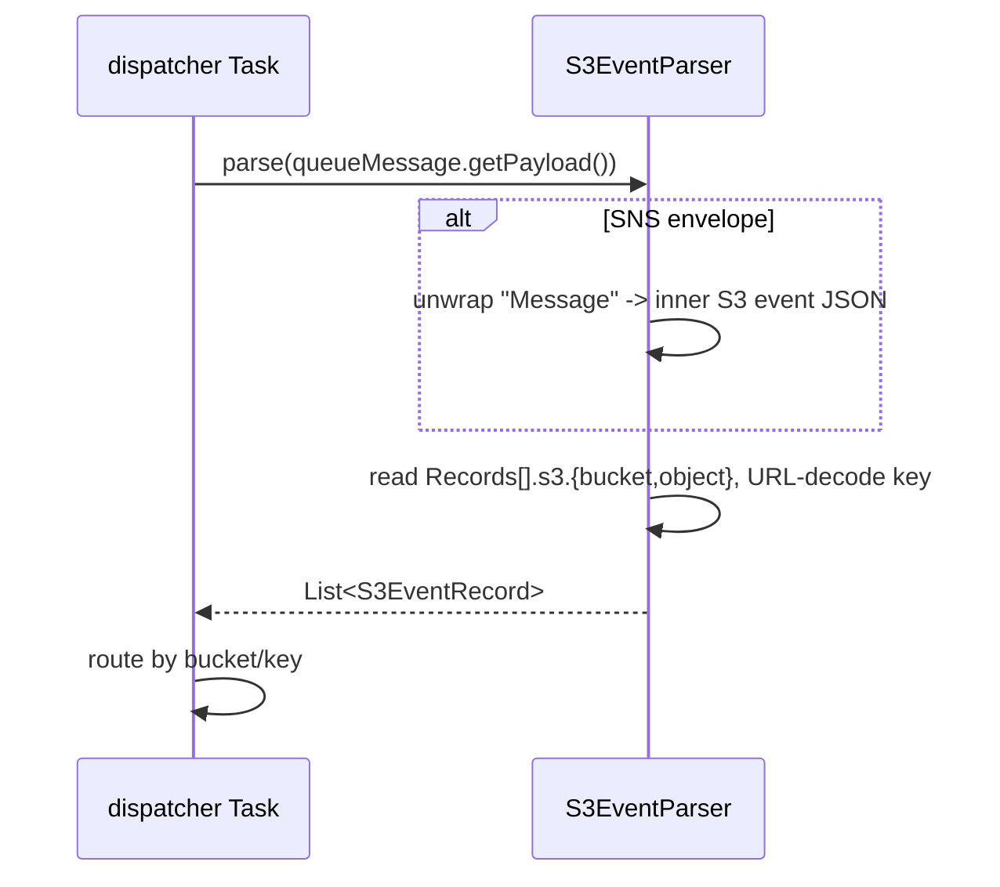

# cloud-sdk Enhancement Design — G3: S3 Event-Notification Parsing

| | |
|---|---|
| **Gap ID** | G3 |
| **Jira** | ION-12310 |
| **Feature branch** | `feature/ION-12310-cloudsdk-g3-s3-event-notification` (off `feature/ION-12310-commons-cloudsdk-refactoring`) |
| **Modules touched** | `cloud-sdk-api` (model + parser interface), `cloud-sdk-aws` (parser impl) |
| **Compatibility** | Additive only — all new types |
| **Date** | 2026-06-01 |

## 1. Gap reference & sources

- appianway master gap list: `shared/docs/2026-05-31-shared-aws2x-upgrade-plan-copilot.md` §11 (G3).
- Full spec: `shared/docs/2026-05-31-shared-aws2x-upgrade-DESIGN.md` §1A.6 (G3).
- Owning module design: dispatcher DESIGN §6 (`dispatcher` is the S3→SQS routing gate).

## 2. Problem statement

`dispatcher` consumes **S3 event notifications** delivered to SQS (directly, or fanned out via SNS→SQS) and must extract `bucket` and `key` (plus size/eTag/eventName) from the notification JSON. cloud-sdk has **no** S3-event model or parser, so dispatcher would otherwise hand-roll JSON parsing against the AWS event shape and re-handle URL-decoding of keys.

## 3. Current state in cloud-sdk

- `messaging` package surfaces `QueueMessage<T>` payloads as `String` bodies; there is no S3-event abstraction anywhere in `cloud-sdk-api`/`cloud-sdk-aws`.
- Jackson is already on the cloud-sdk classpath (used across email/model serialization), so no new parser dependency is required.

## 4. Proposed design

### 4.1 `cloud-sdk-api` — new package `storage.event`

```java
// S3EventRecord.java — immutable record
public record S3EventRecord(String bucket, String key, long size, String eTag, String eventName) {}

// S3EventParser.java
public interface S3EventParser {
    /**
     * Parse an S3 event-notification body delivered via SQS (raw S3->SQS) or
     * SNS->SQS (S3 notification wrapped in an SNS envelope). Returns one record
     * per S3 object event; empty list if the body is not an S3 event.
     */
    List<S3EventRecord> parse(String snsOrSqsBody);
}
```

### 4.2 `cloud-sdk-aws` — `S3EventParserImpl`

- Uses an `ObjectMapper` to parse the body.
- **Envelope detection:** if the JSON has a top-level `"Type":"Notification"` + `"Message"` (SNS envelope), unwrap `Message` (a JSON string) first, then parse the inner S3 event; otherwise parse the body directly as an S3 event (`"Records"` array with `"eventSource":"aws:s3"`).
- For each record extract `s3.bucket.name`, `s3.object.key`, `s3.object.size`, `s3.object.eTag`, `eventName`.
- **URL-decode** the key (`URLDecoder.decode(key, StandardCharsets.UTF_8)`) — S3 encodes spaces as `+` and special chars `%XX`.
- Tolerant: non-S3 / test/`s3:TestEvent` bodies → empty list (not an exception).
- Provided via a factory method `StorageClientFactory.s3EventParser()` consistent with existing factory conventions; also DI-friendly (stateless, thread-safe).

### 4.3 Class diagram



### 4.4 Sequence diagram



## 5. API-compatibility analysis

- All new types in a new package; nothing existing changes. Binary- and source-compatible.

## 6. Maven / dependency changes

None — Jackson already present. No OWASP impact.

## 7. Test plan (JUnit 5 + AssertJ)

- `S3EventParserImplTest` with fixtures: raw S3→SQS event, SNS→SQS wrapped event, multi-record event, URL-encoded key (`my%20file+name.xml` → `my file name.xml`), `s3:TestEvent` → empty, malformed JSON → empty (logged). Parameterized over fixtures.

## 8. Rollout / back-out

- Additive. dispatcher adopts via the parser in its routing Task.
- Back-out: remove the new package; no consumer break.
