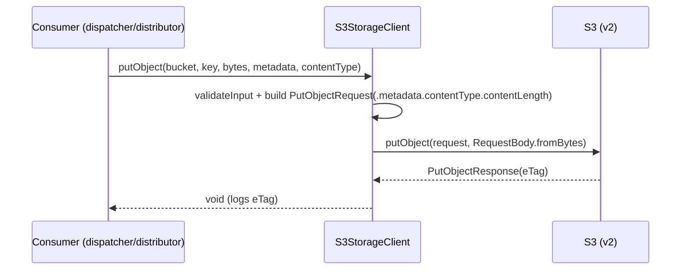

# cloud-sdk Enhancement Design — G2: `StorageClient.putObject` with User Metadata + Content-Type

| | |
|---|---|
| **Gap ID** | G2 |
| **Jira** | ION-12310 |
| **Feature branch** | `feature/ION-12310-cloudsdk-g2-putobject-metadata` (off `feature/ION-12310-commons-cloudsdk-refactoring`) |
| **Modules touched** | `cloud-sdk-api` (interface overloads), `cloud-sdk-aws` (`S3StorageClient`) |
| **Compatibility** | Additive only — new overloads via `default` methods |
| **Date** | 2026-06-01 |

## 1. Gap reference & sources

- appianway master gap list: `shared/docs/2026-05-31-shared-aws2x-upgrade-plan-copilot.md` §11 (G2).
- Full spec: `shared/docs/2026-05-31-shared-aws2x-upgrade-DESIGN.md` §1A.6 (G2).
- Consuming modules: `dispatcher`, `distributor`, `distributor-rest`, `event-writer`, `error-processor`, `splitter`, `transformer`.

## 2. Problem statement

appianway writes S3 objects with **user metadata** (content-type, content-length, and custom keys such as workflow ids). The cloud-sdk `StorageClient.putObject` overloads currently accept only the content; there is no way to set `ObjectMetadata` (content-type + custom keys) on write. Reads already expose metadata via `StorageObject.getMetadata()`/`getContentType()` — only the write path is missing.

## 3. Current state in cloud-sdk

`StorageClient` ([cloud-sdk-api/.../storage/api/StorageClient.java](../../cloud-sdk-api/src/main/java/com/inttra/mercury/cloudsdk/storage/api/StorageClient.java)) `putObject` overloads:

```java
void putObject(String bucketName, String key, byte[] content);
void putObject(String bucketName, String key, InputStream content, long contentLength);
void putObject(String bucketName, String key, File file);
void putObject(String bucket, String fileName, String content);
```

`S3StorageClient.uploadToS3` ([cloud-sdk-aws/.../storage/impl/S3StorageClient.java](../../cloud-sdk-aws/src/main/java/com/inttra/mercury/cloudsdk/storage/impl/S3StorageClient.java)) builds `PutObjectRequest.builder().bucket(b).key(k).build()` — **no** `.metadata(...)`/`.contentType(...)`. `StorageObject` ([cloud-sdk-api/.../storage/api/StorageObject.java](../../cloud-sdk-api/src/main/java/com/inttra/mercury/cloudsdk/storage/api/StorageObject.java)) already exposes `getMetadata()` + `getContentType()` for reads.

## 4. Proposed design

### 4.1 `cloud-sdk-api` — new overloads as `default` methods (zero-break)

Add to `StorageClient`, defaulting to the existing no-metadata path so **no existing implementation must change to compile**:

```java
default void putObject(String bucketName, String key, byte[] content,
                       Map<String,String> metadata, String contentType) {
    putObject(bucketName, key, content); // overridden by S3StorageClient with metadata support
}

default void putObject(String bucketName, String key, InputStream content, long contentLength,
                       Map<String,String> metadata, String contentType) {
    putObject(bucketName, key, content, contentLength);
}
```

`S3StorageClient` overrides both with true metadata support (the defaults exist only so other `StorageClient` impls — e.g. functional-testing fakes — stay source-compatible until updated).

### 4.2 `cloud-sdk-aws` — `S3StorageClient` real implementation

```java
@Override
public void putObject(String bucket, String key, byte[] content,
                      Map<String,String> metadata, String contentType) {
    validateInput(bucket, key, content);
    PutObjectRequest.Builder b = PutObjectRequest.builder().bucket(bucket).key(key)
        .contentLength((long) content.length);
    if (metadata != null && !metadata.isEmpty()) b.metadata(metadata);
    if (contentType != null && !contentType.isBlank()) b.contentType(contentType);
    // same try/catch mapping (S3Exception/SdkClientException) as existing putObject
    s3Client.putObject(b.build(), RequestBody.fromBytes(content));
}
```

- InputStream variant sets `.contentLength(len)` plus metadata/content-type and uses `RequestBody.fromInputStream(content, len)`.
- Reuses the existing `validateInput`, `getAwsErrorDetails`, `handleS3Exception`, `handleSdkException`, `handleUnexpectedException` helpers — identical error semantics to current `putObject`.
- Preserve metadata-replace semantics for any `copyObject`/`copyObjectWithMetaData` path (documented; `copyObject` unchanged here).

### 4.3 Sequence diagram



## 5. API-compatibility analysis

- New methods are `default` on `StorageClient` → existing implementors (including functional-testing fakes and any `mercury-services` impl) **compile unchanged**.
- No existing signature changed. Binary- and source-compatible.
- `kb_search` confirms current `putObject` call sites pass no metadata; they remain valid.

## 6. Maven / dependency changes

None. Uses existing AWS SDK v2 `s3` `PutObjectRequest`. No OWASP impact.

## 7. Test plan (JUnit 5 + Mockito + AssertJ)

- `S3StorageClientTest`: capture `PutObjectRequest` via Mockito `ArgumentCaptor`; assert `metadata`, `contentType`, `contentLength` set correctly; null/empty metadata → omitted; error-mapping paths (`S3Exception`, `SdkClientException`) behave like existing overloads.
- Optional integration test against S3 mock/localstack pattern if present in module (`@Category(IntegrationTests.class)`); otherwise unit coverage with mocked `S3Client`.

## 8. Rollout / back-out

- Additive. Functional-testing fakes pick up the `default` automatically; they should override to record metadata for consumer assertions (tracked under the functional-testing adoption work).
- Back-out: remove the two overrides + the two default methods; no consumer break.
