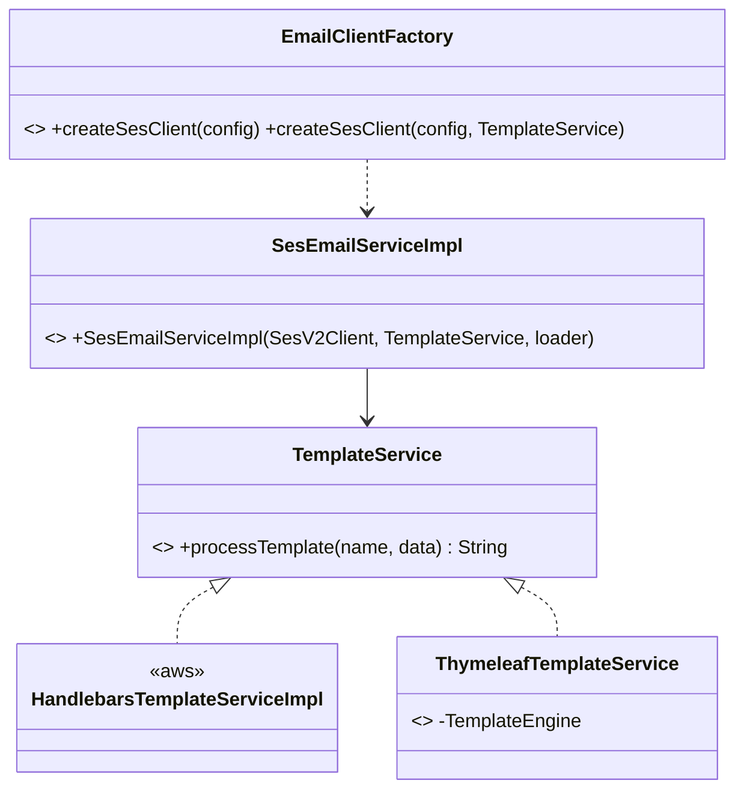

# cloud-sdk Enhancement Design — G5: Thymeleaf Email Template Engine

| | |
|---|---|
| **Gap ID** | G5 |
| **Jira** | ION-12310 |
| **Feature branch** | `feature/ION-12310-cloudsdk-g5-thymeleaf-template-service` (off `feature/ION-12310-commons-cloudsdk-refactoring`) |
| **Modules touched** | `cloud-sdk-aws` (new `TemplateService` impl + factory wiring) |
| **Compatibility** | Additive only — no `cloud-sdk-api` change; new impl + factory overloads |
| **Date** | 2026-06-01 |

## 1. Gap reference & sources

- appianway master gap list: `shared/docs/2026-05-31-shared-aws2x-upgrade-plan-copilot.md` §11 (G5).
- Full spec: `shared/docs/2026-05-31-shared-aws2x-upgrade-DESIGN.md` §1A.6 (G5).
- Owning module design: email-sender DESIGN §6 — email-sender renders **Thymeleaf** templates; cloud-sdk `EmailService` currently uses **Handlebars**.

## 2. Problem statement

email-sender renders SES emails from **Thymeleaf** templates. cloud-sdk's `EmailService` is wired to `HandlebarsTemplateServiceImpl`. To adopt cloud-sdk without rewriting every existing Thymeleaf template, cloud-sdk needs a `TemplateService` implementation backed by Thymeleaf, selectable via the factory/config alongside Handlebars. (SES classic→SES v2 is already handled by `SesEmailServiceImpl`; rate-limiting stays appianway-local.)

## 3. Current state in cloud-sdk

| Element | Location | Notes |
|---|---|---|
| `TemplateService` | [cloud-sdk-api/.../email/api/TemplateService.java](../../cloud-sdk-api/src/main/java/com/inttra/mercury/cloudsdk/email/api/TemplateService.java) | `String processTemplate(String templateName, Map<String,String> data)` — engine-agnostic. **No change needed.** |
| `HandlebarsTemplateServiceImpl` | [cloud-sdk-aws/.../email/impl/HandlebarsTemplateServiceImpl.java](../../cloud-sdk-aws/src/main/java/com/inttra/mercury/cloudsdk/email/impl/HandlebarsTemplateServiceImpl.java) | current default. |
| `EmailClientFactory` | [cloud-sdk-aws/.../email/factory/EmailClientFactory.java](../../cloud-sdk-aws/src/main/java/com/inttra/mercury/cloudsdk/email/factory/EmailClientFactory.java) | `createSesClient(config)` hardcodes `new HandlebarsTemplateServiceImpl()`. |
| `SesEmailServiceImpl` | [cloud-sdk-aws/.../email/impl/SesEmailServiceImpl.java](../../cloud-sdk-aws/src/main/java/com/inttra/mercury/cloudsdk/email/impl/SesEmailServiceImpl.java) | takes a `TemplateService` in its constructor — already engine-agnostic. |

The abstraction is clean: `SesEmailServiceImpl` already accepts any `TemplateService`. Only a Thymeleaf impl + factory selection are missing.

## 4. Proposed design

### 4.1 `cloud-sdk-aws` — `ThymeleafTemplateService implements TemplateService`

```java
public class ThymeleafTemplateService implements TemplateService {
    private final TemplateEngine engine; // org.thymeleaf.TemplateEngine (standalone)
    public ThymeleafTemplateService() { this(defaultClasspathEngine()); }
    public ThymeleafTemplateService(TemplateEngine engine) { this.engine = engine; }

    @Override
    public String processTemplate(String templateName, Map<String,String> data) {
        Context ctx = new Context();
        if (data != null) data.forEach(ctx::setVariable);
        try { return engine.process(templateName, ctx); }
        catch (RuntimeException e) { throw new TemplateProcessingException(...); }
    }
    // defaultClasspathEngine(): ClassLoaderTemplateResolver (HTML, UTF-8, suffix .html)
}
```

- Standalone Thymeleaf (`org.thymeleaf:thymeleaf`, **not** spring) to avoid pulling Spring into cloud-sdk-aws.
- Classpath `ITemplateResolver` by default; a constructor accepts a custom `TemplateEngine`/resolver for file-based templates.
- Maps engine failures to the existing `TemplateProcessingException`.

### 4.2 Engine selection via factory/config

- Add `EmailTemplateEngine` enum (`HANDLEBARS` default, `THYMELEAF`) to `AwsSesEmailConfig` (defaulted, backward-compatible).
- Add `EmailClientFactory.createSesClient(config)` branch + an explicit overload `createSesClient(config, TemplateService templateService)` so callers can inject either engine. Existing `createSesClient(config)` keeps Handlebars as default.



## 5. API-compatibility analysis

- `cloud-sdk-api` unchanged. New impl class + new factory overload + a defaulted config enum.
- `createSesClient(config)` default behaviour (Handlebars) is preserved → existing `mercury-services` callers unaffected. Additive and binary-compatible.

## 6. Maven / dependency changes

- Add `org.thymeleaf:thymeleaf` (standalone) to `cloud-sdk-aws`. Pin via root `dependency.version`/BOM. Run OWASP dependency-check; Thymeleaf standalone has a small, well-maintained graph (attoparser, unbel-ri/slf4j) — verify no new HIGH/CRITICAL and that it does not reintroduce removed transitive risk. **Do not** regress the documented Netty/Handlebars/OWASP fixes in `cloud-sdk-aws/docs/`.

## 7. Test plan (JUnit 5 + AssertJ)

- `ThymeleafTemplateServiceTest`: classpath template renders with variable substitution; missing template → `TemplateProcessingException`; null/empty data handled; UTF-8 content.
- `EmailClientFactoryTest`: `THYMELEAF` selection yields a `SesEmailServiceImpl` backed by `ThymeleafTemplateService`; default stays Handlebars.

## 8. Rollout / back-out

- Additive. email-sender adopts via `EmailTemplateEngine.THYMELEAF` (keeps its existing templates).
- Back-out: remove the impl + factory branch + dependency; Handlebars default unaffected.

## 9. Alternative (documented)

Migrate email-sender's Thymeleaf templates to Handlebars and drop the new dependency (see email-sender DESIGN §6). Chosen approach above keeps existing templates and adds an isolated, optional engine.
