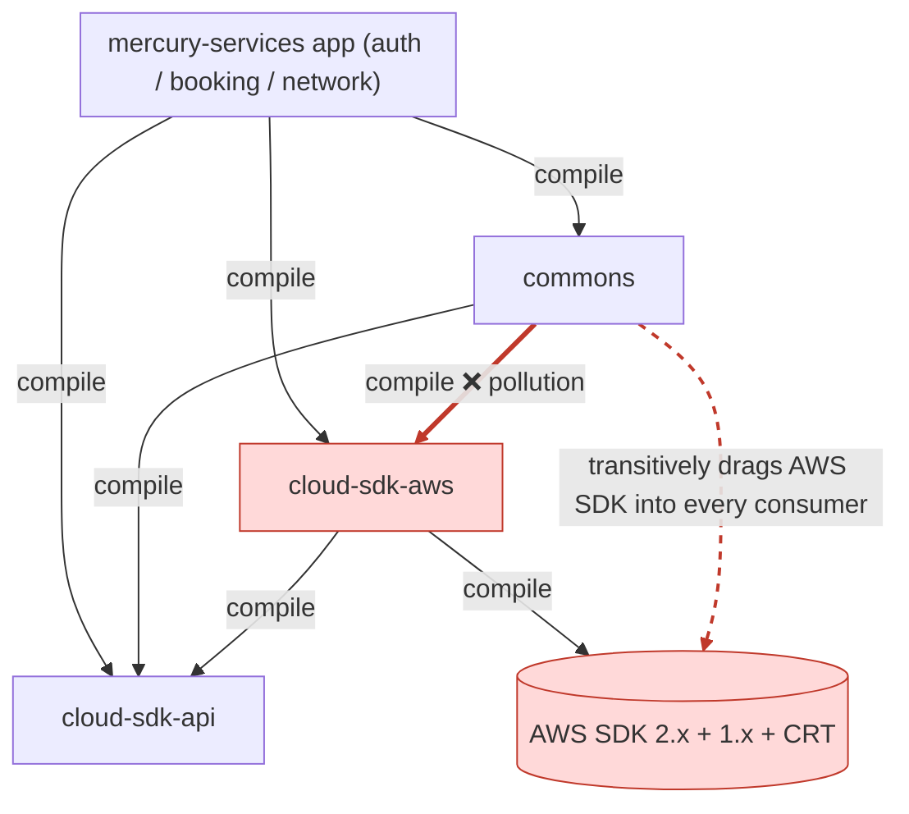
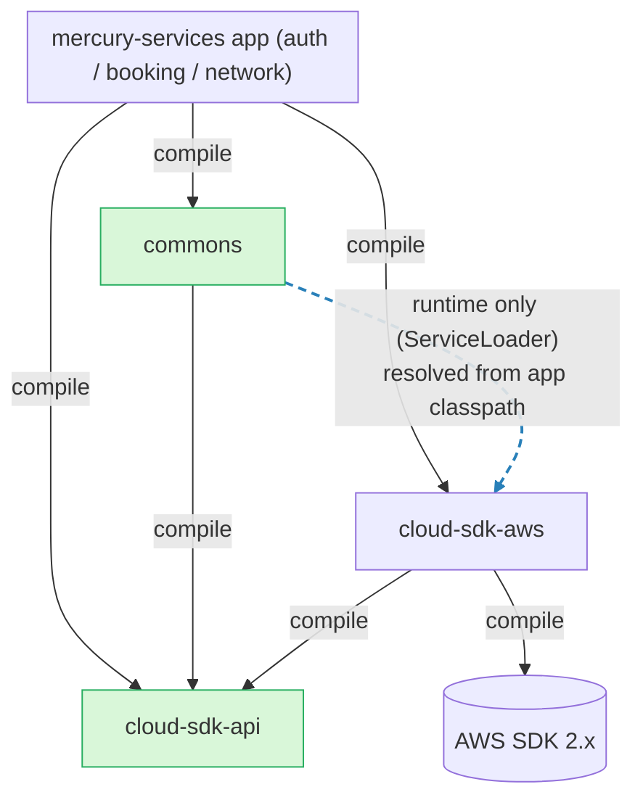
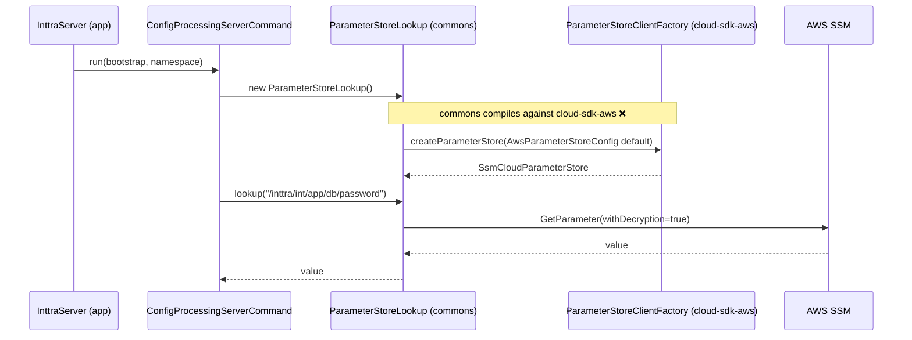
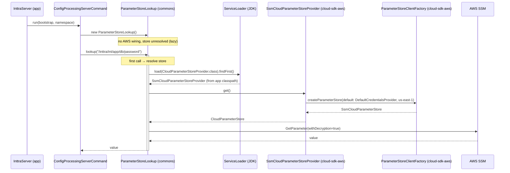

# ParameterStoreLookup Refactor — Removing `commons` → `cloud-sdk-aws` Coupling

- **Ticket:** ION-12310
- **Date:** 2026-05-29
- **Author:** Arijit Kundu
- **Status:** Implemented (Option A) — all unit + integration tests green (see §14)
- **Target branch (to be created after approval):** `feature/ION-12310-parameterstorelookup-refactor` (from `feature/ION-12310-commons-cloudsdk-refactoring`)

---

## 1. Problem Statement

`commons` is meant to be a **low-level utility library**. Today it has a hard,
compile-time dependency on **both** cloud-sdk modules:

| Module | Role | Should `commons` depend on it? |
|--------|------|--------------------------------|
| `cloud-sdk-api` | Pure interface/API definitions for cloud services (no AWS SDK, no Netty) | Tolerable |
| `cloud-sdk-aws` | AWS SDK 2.x implementations (SSM, S3, SNS, SQS, DynamoDB…), AWS SDK 1.x, CRT | **No — this is the pollution source** |

The coupling exists solely because of
[`ParameterStoreLookup`](../src/main/java/com/inttra/mercury/config/ParameterStoreLookup.java)
and its test
[`ParameterStoreLookupTest`](../src/test/java/com/inttra/mercury/config/ParameterStoreLookupTest.java).

### 1.1 Why this is harmful

`ParameterStoreLookup`'s **default constructor** reaches directly into `cloud-sdk-aws`
and the AWS SDK 2.x:

```java
// commons/.../config/ParameterStoreLookup.java  (current)
import com.inttra.mercury.cloudsdk.aws.config.AwsCredentialsProviderWrapper;     // cloud-sdk-aws
import com.inttra.mercury.cloudsdk.aws.config.AwsRegionWrapper;                  // cloud-sdk-aws
import com.inttra.mercury.cloudsdk.paramstore.config.AwsParameterStoreConfig;    // cloud-sdk-aws
import com.inttra.mercury.cloudsdk.paramstore.factory.ParameterStoreClientFactory; // cloud-sdk-aws
import software.amazon.awssdk.auth.credentials.DefaultCredentialsProvider;       // AWS SDK 2.x
import software.amazon.awssdk.regions.Region;                                    // AWS SDK 2.x

private static final AwsCredentialsProviderWrapper DEFAULT_CREDENTIALS =
        AwsCredentialsProviderWrapper.of(DefaultCredentialsProvider.create());
private static final AwsRegionWrapper DEFAULT_REGION =
        new AwsRegionWrapper(Region.US_EAST_1);

public ParameterStoreLookup() {
    this.parameterStore = ParameterStoreClientFactory.createParameterStore(
        AwsParameterStoreConfig.builder()
            .region(DEFAULT_REGION)
            .credentialsProvider(DEFAULT_CREDENTIALS)
            .build());
}
```

Consequences:

1. **Transitive dependency pollution.** Through `cloud-sdk-aws`, `commons`
   transitively pulls in AWS SDK 2.x (`ssm`, `s3`, `sns`, `sqs`, `dynamodb`,
   `dynamodb-enhanced`, `aws-crt-client`…), AWS SDK 1.x, and previously Netty.
   Every consumer of `commons` inherits that graph even if it never touches SSM.
   This is precisely the kind of bloat that the `cloud-sdk-aws` POM goes to great
   lengths to contain (see the Netty-exclusion comments in
   [`cloud-sdk-aws/pom.xml`](../../cloud-sdk-aws/pom.xml) and
   `cloud-sdk-aws/docs/2026-04-23-netty-removal.md`).
2. **Layering violation.** A low-level utility library compiling against a
   concrete AWS implementation inverts the intended dependency direction
   (`utility ← implementation`).
3. **Hidden global state.** The default credentials/region are baked into
   `static final` fields inside `commons`, so the AWS wiring is not overridable
   without code changes.

### 1.2 What actually uses it

`ParameterStoreLookup` is consumed in **exactly one place** and is **never
referenced directly by any `mercury-services` application**:

```
commons/.../config/ConfigProcessingServerCommand.java
   └── new ParameterStoreConfigTransform(new ParameterStoreLookup())   // default ctor
```

`ConfigProcessingServerCommand` is the Dropwizard `ServerCommand` registered by
`InttraServer.addDefaultCommands(...)`. At service boot it resolves
`${awsps:/inttra/<env>/<app>/<key>}` placeholders in `config.yaml` against AWS SSM
Parameter Store. (Verified across `auth`, `booking`, `network`, and ~30 other
config files — all use the `${awsps:…}` placeholder convention.)

A workspace-wide search confirms **no application source references
`ParameterStoreLookup` directly** — the type is an internal collaborator of
`commons`. This is what makes the refactor safe and seamless.

---

## 2. Goals & Constraints

| # | Goal | |
|---|------|--|
| G1 | Remove the `commons` → `cloud-sdk-aws` compile dependency | **Must** |
| G2 | Eliminate the transitive AWS-SDK pollution from `commons` consumers | **Must** |
| G3 | **Zero source changes** required in any `mercury-services` application (seamless) | **Must** |
| G4 | SSM credential-fetch behaviour preserved exactly (DefaultCredentialsProvider, `us-east-1`) | **Must** |
| G5 | All unit + integration tests pass in `commons`, `cloud-sdk-api`, `cloud-sdk-aws` | **Must** |
| G6 | Prefer to also drop the `cloud-sdk-api` dependency if it doesn't hurt clarity | **Nice-to-have** |

### 2.1 Key enabling fact (why this is seamless)

`auth`, `booking`, and `network/server` **already declare `commons`,
`cloud-sdk-api`, *and* `cloud-sdk-aws` as direct dependencies** in their POMs:

```
auth/pom.xml          → commons, cloud-sdk-api, cloud-sdk-aws
booking/pom.xml       → commons, cloud-sdk-api, cloud-sdk-aws
network/server/pom.xml→ commons, cloud-sdk-api, cloud-sdk-aws
```

So `cloud-sdk-aws` is **already on every application's runtime classpath**.
Removing it as a *transitive* dependency of `commons` therefore changes nothing
at runtime for those apps — the AWS implementation is still present, just no
longer dragged in through the wrong module.

---

## 3. Design Overview

### 3.1 Core idea — invert construction via the Service Provider Interface (SPI)

The only thing `commons` truly needs is *"give me a `CloudParameterStore`"*. It
does **not** need to know that the store is AWS-backed, how credentials are
resolved, or which region is used. That knowledge belongs in `cloud-sdk-aws`.

We therefore introduce a tiny **SPI** in `cloud-sdk-api`:

```java
package com.inttra.mercury.cloudsdk.paramstore.spi;
public interface CloudParameterStoreProvider {
    CloudParameterStore get();   // returns a ready-to-use default store
}
```

- `cloud-sdk-aws` ships the implementation (`SsmCloudParameterStoreProvider`)
  and registers it via `META-INF/services`.
- `commons` discovers the implementation at **runtime** through
  `java.util.ServiceLoader` — no compile dependency on `cloud-sdk-aws`.
- `ParameterStoreLookup` stays in `commons` as a thin adapter
  (`CloudParameterStore` → `StringLookup`), compiling only against
  `cloud-sdk-api` interfaces.

This is the classic JDK pattern (`java.sql.Driver`, `javax.xml`,
`slf4j`-style binding) for decoupling an API from its implementation across a
module boundary, resolved by the runtime classpath the application assembles.

### 3.2 Why the SPI lives in `cloud-sdk-api` (not `commons`)

If the SPI interface lived in `commons`, then `cloud-sdk-aws` (the implementer)
would have to depend on `commons` — pulling Dropwizard, Jetty, MySQL, MyBatis,
etc. **into the low-level cloud module**. That is *worse* reverse-pollution than
the problem we are fixing, and would create a dependency cycle risk.

Placing the SPI in `cloud-sdk-api`:

- `commons` → `cloud-sdk-api` (already allowed; pure interfaces, no AWS SDK).
- `cloud-sdk-aws` → `cloud-sdk-api` (**already exists today**).
- `cloud-sdk-aws` has **no** dependency on `commons` (verified) → **no cycle**.
- No heavy dependency is added to any module.

### 3.3 Recommended option vs. the "zero cloud-sdk dependency" variant

| | **Option A (Recommended)** | Option B (zero cloud-sdk deps) |
|---|---|---|
| SPI contract | `CloudParameterStoreProvider` → `CloudParameterStore`, in `cloud-sdk-api` | `ServiceLoader.load(StringLookup.class)` — commons-text's own interface |
| `commons` keeps | `cloud-sdk-api` only | **neither** cloud-sdk module |
| `cloud-sdk-aws` gains | nothing | a small `commons-text` dependency |
| Adapter location | `ParameterStoreLookup` stays in `commons` | adapter moves into `cloud-sdk-aws` |
| Type safety / clarity | **High** — explicit, self-documenting contract | Lower — any `StringLookup` on classpath could be picked |
| Risk | **Lowest** | Slightly higher (loose contract, code moves modules) |
| Satisfies problem statement | "ok to keep `cloud-sdk-api`" ✅ | "even better" ✅ |

**Recommendation: Option A.** It fully removes the harmful `cloud-sdk-aws`
dependency (the actual source of AWS-SDK/Netty pollution), keeps the explicitly
blessed and harmless `cloud-sdk-api`, introduces no cycle, adds no heavy deps,
and requires zero application changes. Option B's only additional benefit is
dropping a pure-interface dependency, at the cost of a loosely-typed contract and
moving code between modules. The remainder of this document specifies **Option A**;
§9 records Option B for the reviewer's decision.

---

## 4. Component Diagram

### 4.1 Before



### 4.2 After (Option A)



`commons` no longer compiles against `cloud-sdk-aws`. The AWS implementation is
bound **only at runtime**, and only because the application (which already
depends on `cloud-sdk-aws` directly) puts it on the classpath.

---

## 5. Class Diagram

```mermaid
classDiagram
    direction LR

    class StringLookup {
        <<interface>>
        +lookup(key) String
    }

    namespace cloud_sdk_api {
        class CloudParameterStore {
            <<interface>>
            +getParameter(name) Optional~CloudParameter~
            +getParameter(name, decryption) Optional~CloudParameter~
            +putParameter(name, value, type) void
            +describeParameters() List~String~
        }
        class CloudParameter {
            <<interface>>
            +getValue() String
        }
        class CloudParameterStoreProvider {
            <<interface>>
            +get() CloudParameterStore
        }
    }

    namespace commons {
        class ParameterStoreLookup {
            -CloudParameterStore parameterStore
            +ParameterStoreLookup()
            +ParameterStoreLookup(CloudParameterStore)
            +lookup(name) String
            -store() CloudParameterStore
        }
        class ParameterStoreConfigTransform {
            +apply(config) String
        }
        class ConfigProcessingServerCommand {
            +run(bootstrap, namespace) void
        }
    }

    namespace cloud_sdk_aws {
        class SsmCloudParameterStoreProvider {
            +get() CloudParameterStore
        }
        class ParameterStoreClientFactory {
            +createParameterStore(config) CloudParameterStore$
        }
        class SsmCloudParameterStore {
            +getParameter(name) Optional~CloudParameter~
        }
    }

    StringLookup <|.. ParameterStoreLookup
    CloudParameterStore <|.. SsmCloudParameterStore
    CloudParameterStoreProvider <|.. SsmCloudParameterStoreProvider

    ParameterStoreLookup --> CloudParameterStore : adapts
    ParameterStoreLookup ..> CloudParameterStoreProvider : ServiceLoader (runtime)
    ParameterStoreConfigTransform --> StringLookup
    ConfigProcessingServerCommand --> ParameterStoreConfigTransform
    ConfigProcessingServerCommand --> ParameterStoreLookup : new ParameterStoreLookup()

    SsmCloudParameterStoreProvider --> ParameterStoreClientFactory
    ParameterStoreClientFactory --> SsmCloudParameterStore
```



Key points:
- `ParameterStoreLookup` (in `commons`) now references **only** `cloud-sdk-api`
  types (`CloudParameterStore`, `CloudParameter`, `CloudParameterStoreProvider`)
  and `commons-text` (`StringLookup`). **No `cloud-sdk-aws`, no AWS SDK imports.**
- The default constructor delegates store creation to the SPI provider, resolved
  lazily via `ServiceLoader`.
- The existing `ParameterStoreLookup(CloudParameterStore)` constructor is kept —
  it is what the unit tests use and what allows full DI/testing.

---

## 6. Sequence Diagrams

### 6.1 Before — default constructor wires AWS inside `commons`



### 6.2 After (Option A) — runtime SPI resolution, no compile coupling



The cross-module link `commons → cloud-sdk-aws` is now a **runtime lookup**
(`ServiceLoader`) instead of a **compile-time import**.

---

## 7. Detailed Changes

### 7.1 `cloud-sdk-api` — add the SPI (new file)

`cloud-sdk-api/src/main/java/com/inttra/mercury/cloudsdk/paramstore/spi/CloudParameterStoreProvider.java`

```java
package com.inttra.mercury.cloudsdk.paramstore.spi;

import com.inttra.mercury.cloudsdk.paramstore.api.CloudParameterStore;

/**
 * Service Provider Interface for obtaining a default {@link CloudParameterStore}.
 *
 * <p>Implementations are discovered at runtime via {@link java.util.ServiceLoader}.
 * This lets API consumers (e.g. the {@code commons} configuration layer) obtain a
 * cloud parameter store without a compile-time dependency on any concrete cloud
 * implementation module.</p>
 */
public interface CloudParameterStoreProvider {

    /**
     * @return a ready-to-use {@link CloudParameterStore} configured with sensible
     *         provider defaults (credentials, region, timeouts).
     */
    CloudParameterStore get();
}
```

> Pure interface; depends only on existing `cloud-sdk-api` types. No new module
> dependencies.

### 7.2 `cloud-sdk-aws` — implement & register the SPI (new files)

`cloud-sdk-aws/src/main/java/com/inttra/mercury/cloudsdk/paramstore/spi/SsmCloudParameterStoreProvider.java`

```java
package com.inttra.mercury.cloudsdk.paramstore.spi;

import com.inttra.mercury.cloudsdk.aws.config.AwsCredentialsProviderWrapper;
import com.inttra.mercury.cloudsdk.aws.config.AwsRegionWrapper;
import com.inttra.mercury.cloudsdk.paramstore.api.CloudParameterStore;
import com.inttra.mercury.cloudsdk.paramstore.config.AwsParameterStoreConfig;
import com.inttra.mercury.cloudsdk.paramstore.factory.ParameterStoreClientFactory;
import software.amazon.awssdk.auth.credentials.DefaultCredentialsProvider;
import software.amazon.awssdk.regions.Region;

/**
 * AWS SSM-backed {@link CloudParameterStoreProvider}. Builds the same default
 * parameter store that {@code ParameterStoreLookup} created previously:
 * {@link DefaultCredentialsProvider} + region {@code us-east-1}.
 */
public class SsmCloudParameterStoreProvider implements CloudParameterStoreProvider {

    private static final AwsRegionWrapper DEFAULT_REGION =
            new AwsRegionWrapper(Region.US_EAST_1);

    @Override
    public CloudParameterStore get() {
        return ParameterStoreClientFactory.createParameterStore(
                AwsParameterStoreConfig.builder()
                        .region(DEFAULT_REGION)
                        .credentialsProvider(
                                AwsCredentialsProviderWrapper.of(DefaultCredentialsProvider.create()))
                        .build());
    }
}
```

`cloud-sdk-aws/src/main/resources/META-INF/services/com.inttra.mercury.cloudsdk.paramstore.spi.CloudParameterStoreProvider`

```
com.inttra.mercury.cloudsdk.paramstore.spi.SsmCloudParameterStoreProvider
```

> **Credential parity:** identical to the current default (`DefaultCredentialsProvider`,
> `us-east-1`, sync client, 10 s API timeout from `AwsParameterStoreConfig`). G4 satisfied.

### 7.3 `commons` — `ParameterStoreLookup` becomes a pure adapter

`commons/src/main/java/com/inttra/mercury/config/ParameterStoreLookup.java`

```java
package com.inttra.mercury.config;

import com.inttra.mercury.cloudsdk.paramstore.api.CloudParameter;
import com.inttra.mercury.cloudsdk.paramstore.api.CloudParameterStore;
import com.inttra.mercury.cloudsdk.paramstore.spi.CloudParameterStoreProvider;
import lombok.extern.slf4j.Slf4j;
import org.apache.commons.lang3.StringUtils;
import org.apache.commons.text.lookup.StringLookup;

import java.util.ServiceLoader;

/**
 * Lookup implementation for retrieving values from a cloud parameter store
 * (e.g. AWS SSM). Adapts a {@link CloudParameterStore} to commons-text's
 * {@link StringLookup} so {@code ${awsps:...}} placeholders can be resolved.
 *
 * <p>The no-arg constructor resolves the backing {@link CloudParameterStore}
 * lazily via {@link ServiceLoader} of {@link CloudParameterStoreProvider},
 * keeping {@code commons} free of any compile-time dependency on a concrete
 * cloud implementation module.</p>
 */
@Slf4j
public class ParameterStoreLookup implements StringLookup {

    private volatile CloudParameterStore parameterStore; // null until resolved (lazy)

    /** Resolves the parameter store lazily via the SPI on first use. */
    public ParameterStoreLookup() {
        // store resolved on first lookup()
    }

    /** Creates a lookup with an explicit store (used for DI/testing). */
    public ParameterStoreLookup(CloudParameterStore parameterStore) {
        if (parameterStore == null) {
            throw new IllegalArgumentException("Parameter store must not be null");
        }
        this.parameterStore = parameterStore;
    }

    @Override
    public String lookup(String parameterName) {
        if (StringUtils.isBlank(parameterName)) {
            throw new IllegalArgumentException("Parameter name cannot be blank");
        }
        return store().getParameter(parameterName)
                .map(CloudParameter::getValue)
                .orElseThrow(() -> new RuntimeException(
                        String.format("No value found for parameter: %s", parameterName)));
    }

    private CloudParameterStore store() {
        CloudParameterStore s = parameterStore;
        if (s == null) {
            synchronized (this) {
                s = parameterStore;
                if (s == null) {
                    s = ServiceLoader.load(CloudParameterStoreProvider.class)
                            .findFirst()
                            .orElseThrow(() -> new IllegalStateException(
                                    "No CloudParameterStoreProvider found on the classpath. "
                                  + "Add the 'cloud-sdk-aws' dependency to the application."))
                            .get();
                    parameterStore = s;
                }
            }
        }
        return s;
    }
}
```

Notes:
- Blank-name validation happens **before** store resolution, so the existing
  blank-name test still passes without any provider on the classpath.
- Lazy resolution means an app with **no** `${awsps:…}` placeholders never
  triggers the `ServiceLoader` lookup and never requires a provider — strictly
  more lenient than today's eager constructor.
- The `(CloudParameterStore)` constructor is unchanged → existing unit tests
  unaffected.

### 7.4 `commons` — no change required to callers

`ConfigProcessingServerCommand` keeps calling `new ParameterStoreLookup()`.
Its public surface is unchanged, so **`InttraServer` and every application stay
untouched** (G3).

### 7.5 `commons/pom.xml` — drop the `cloud-sdk-aws` dependency

```diff
     <!-- Cloud SDK API Module -->
     <dependency>
         <groupId>com.inttra.mercury</groupId>
         <artifactId>cloud-sdk-api</artifactId>
         <version>${dependency.version}</version>
     </dependency>
-
-    <!-- Cloud SDK AWS Module -->
-    <dependency>
-        <groupId>com.inttra.mercury</groupId>
-        <artifactId>cloud-sdk-aws</artifactId>
-        <version>${dependency.version}</version>
-    </dependency>
+
+    <!-- cloud-sdk-aws is intentionally NOT a compile dependency.
+         ParameterStoreLookup resolves a CloudParameterStore at runtime via
+         ServiceLoader(CloudParameterStoreProvider). The AWS implementation is
+         supplied by the application's own cloud-sdk-aws dependency.
+         It is added below as TEST scope only, to run the end-to-end SSM IT. -->
+    <dependency>
+        <groupId>com.inttra.mercury</groupId>
+        <artifactId>cloud-sdk-aws</artifactId>
+        <version>${dependency.version}</version>
+        <scope>test</scope>
+    </dependency>
```

> Result: the **published (flattened) `commons` POM no longer lists
> `cloud-sdk-aws`**, so the AWS SDK 2.x/1.x/CRT graph stops leaking into every
> consumer (G1, G2). The test-scope entry exists only so the commons module can
> run an end-to-end SSM integration test (§8.3).

---

## 8. Testing Strategy (G5)

> **Implemented & verified** — all results below are from the actual build on
> branch `feature/ION-12310-parameterstorelookup-refactor` (see §14 for the run log).

### 8.1 `commons` — existing unit tests (unchanged, still green)
- `ParameterStoreLookupTest` — `new ParameterStoreLookup(mockStore)`; blank /
  found / not-found cases. The explicit-store constructor is unchanged, so these
  pass without modification.
- `ParameterStoreConfigTransformTest` — uses a `mapStringLookup`; unaffected.

### 8.2 `commons` — new offline unit tests for the no-arg (SPI) constructor
Added a `NoArgConstructorTests` nested class to `ParameterStoreLookupTest`:
- `shouldNotResolveStore_atConstructionTime` — proves the no-arg constructor is
  **lazy**: constructing it triggers no `ServiceLoader` resolution and never
  touches AWS.
- `shouldRejectBlankName_beforeResolvingStore` — proves blank-name validation
  happens *before* store resolution, so it holds for the lazy constructor with no
  provider/AWS present.

> **Why no in-`commons` fixture provider:** because `cloud-sdk-aws` is on the
> commons *test* classpath (for §8.3), the **real** `SsmCloudParameterStoreProvider`
> is already registered for `ServiceLoader` there. Registering a competing
> in-memory fixture under `commons` test resources would make
> `ServiceLoader.findFirst()` non-deterministic and could mask the real e2e IT.
> Deterministic, offline proof of the SPI discovery mechanism therefore lives in
> `cloud-sdk-aws` (§8.4), where only one provider exists; `commons` proves the
> lazy/adapter contract offline (above) and the full wiring against live AWS (§8.3).

### 8.3 `commons` — end-to-end SSM integration test (real AWS credentials)
`ParameterStoreLookupSsmIT` (tagged with the module's integration group). With
`cloud-sdk-aws` on the **test** classpath, it exercises the *real* production
path: `new ParameterStoreLookup()` → lazy `ServiceLoader` → real
`SsmCloudParameterStoreProvider` → AWS SSM. **Read-only:** it reads an existing
SSM parameter (default `tntInt`, overridable via `-Dit.ssm.parameter.name=…`) and
asserts the value `lookup(...)` returns is non-blank and identical to a direct
store read. Uses JUnit 5 `assumeTrue` to **skip gracefully** if the parameter is
not accessible, so the suite is robust across environments. (Read-only because
the `INTTRA-Dev` role grants `ssm:GetParameter` but not `PutParameter`/`DeleteParameter`.)

### 8.4 `cloud-sdk-aws` — provider unit + integration tests
- `SsmCloudParameterStoreProviderTest` — three offline unit tests: `get()`
  returns a non-null `SsmCloudParameterStore`; the provider is discoverable via
  `ServiceLoader` (asserts the `META-INF/services` registration); and
  `ServiceLoader.findFirst().get()` resolves the SSM-backed store. This is the
  **deterministic** proof of the SPI discovery mechanism.
- `SsmCloudParameterStoreProviderIT` (`@Tag("integration")`) — resolves the
  provider via `ServiceLoader` and performs a **read-only** `getParameter`
  against live AWS SSM (same default param / `assumeTrue` skip behaviour as §8.3);
  aligns with the existing failsafe `groups=integration` convention used by the
  DynamoDB ITs.

### 8.5 `cloud-sdk-api` — compiles & existing tests pass
Adding a pure interface has no behavioural impact; the module's existing test
suite remains green.

### 8.6 Verification commands (as run)
```bash
# Unit tests — all three modules (reactor order: api → aws → commons)
mvn -pl cloud-sdk-api,cloud-sdk-aws,commons -am test

# Integration tests (AWS creds present), targeted to the new ITs
mvn -pl cloud-sdk-aws -am install -DskipTests
mvn -pl cloud-sdk-aws failsafe:integration-test failsafe:verify -Dit.test=SsmCloudParameterStoreProviderIT
mvn -pl commons test-compile failsafe:integration-test failsafe:verify -Dit.test=ParameterStoreLookupSsmIT

# Confirm the PUBLISHED (flattened) commons POM carries only cloud-sdk-api
grep -i "cloud-sdk\|awssdk\|netty" commons/flattened_pom.xml   # → cloud-sdk-api only
mvn -pl commons dependency:tree                                # cloud-sdk-aws + AWS SDK are :test scope only
```

---

## 9. Alternatives Considered

- **Option B — `ServiceLoader.load(StringLookup.class)`, drop both cloud-sdk deps
  from `commons`.** Achieves the "even better" goal (G6) but: (a) the SPI contract
  becomes the generic commons-text `StringLookup`, so any `StringLookup` on the
  classpath could be selected — a looser, less self-documenting contract; (b) the
  adapter logic moves from `commons` into `cloud-sdk-aws` (more churn); (c)
  `cloud-sdk-aws` gains a `commons-text` dependency. Recorded here for the
  reviewer; Option A is recommended.
- **Move `ParameterStoreLookup`/`ConfigProcessingServerCommand` into
  `cloud-sdk-aws`.** Rejected — these are Dropwizard config/CLI utilities that
  belong in `commons`; moving them would force `cloud-sdk-aws` to depend on
  Dropwizard/commons and would change the package that `InttraServer` imports
  (not seamless).
- **Constructor injection of `CloudParameterStore` into
  `ConfigProcessingServerCommand`.** Rejected — `InttraServer` instantiates the
  command via `new ConfigProcessingServerCommand<>(this)`; changing the signature
  would require editing `InttraServer` and every app entry point (not seamless).
- **Guice injection.** Rejected — the command runs during Dropwizard bootstrap,
  before the Guice injector exists.

---

## 10. Risk Assessment

| Risk | Likelihood | Mitigation |
|------|-----------|------------|
| App lacks `cloud-sdk-aws` at runtime → provider not found | Very low | All target apps already declare it directly; lazy lookup only triggers when a `${awsps:}` placeholder is actually present; clear `IllegalStateException` message names the missing dependency |
| Behavioural drift in credential/region defaults | Very low | Provider replicates the exact prior defaults (`DefaultCredentialsProvider`, `us-east-1`, sync, 10 s) |
| Multiple providers on classpath | Very low | Only `cloud-sdk-aws` registers one; `findFirst()` is deterministic for the single registration |
| `ServiceLoader` cost | Negligible | Resolved once, memoized in `volatile` field |
| Shaded/uber-jar drops `META-INF/services` | Low | If any app shades, ensure the Shade `ServicesResourceTransformer` is used (documented in rollout notes) |

---

## 11. Existing vs. New Usage Pattern

### 11.1 Application `config.yaml` — **unchanged**
```yaml
database:
  user: ${awsps:/inttra/int/mercuryservices/db/user}
  password: ${awsps:/inttra/int/mercuryservices/db/password}
```

### 11.2 Application bootstrap (`InttraServer`) — **unchanged**
```java
@Override
protected void addDefaultCommands(Bootstrap<T> bootstrap) {
    bootstrap.addCommand(new ConfigProcessingServerCommand<>(this)); // unchanged
    bootstrap.addCommand(new CheckCommand<>(this));
    ...
}
```

### 11.3 Application POM — **unchanged**
Already declares `commons`, `cloud-sdk-api`, `cloud-sdk-aws` directly. Nothing to add.

### 11.4 What changes (internal to the libraries only)

| | Before | After |
|---|--------|-------|
| `commons` compile deps | `cloud-sdk-api` **+ `cloud-sdk-aws`** | `cloud-sdk-api` only |
| `commons` transitive graph | AWS SDK 2.x/1.x/CRT leaked to all consumers | clean |
| `ParameterStoreLookup` default ctor | builds AWS SSM client directly | resolves store via `ServiceLoader` SPI |
| AWS impl binding | compile-time | runtime (classpath) |
| SSM credentials | `DefaultCredentialsProvider`, `us-east-1` | **identical**, now sourced from `cloud-sdk-aws` `SsmCloudParameterStoreProvider` |

### 11.5 New extension point (bonus)
Any module can now supply an alternate `CloudParameterStoreProvider` (e.g. a
mock for tests, a Vault-backed store, or a region-specific store) purely by
classpath/`META-INF/services` — without touching `commons`.

---

## 12. Implementation Checklist

1. ✅ Create branch `feature/ION-12310-parameterstorelookup-refactor` from
   `feature/ION-12310-commons-cloudsdk-refactoring`.
2. ✅ `cloud-sdk-api`: add `CloudParameterStoreProvider` SPI interface.
3. ✅ `cloud-sdk-aws`: add `SsmCloudParameterStoreProvider` + `META-INF/services`
   registration; add provider unit test + real-AWS IT.
4. ✅ `commons`: rewrite `ParameterStoreLookup` (remove AWS/cloud-sdk-aws imports,
   add lazy `ServiceLoader` resolution); add no-arg/lazy unit tests + e2e SSM IT.
5. ✅ `commons/pom.xml`: remove `cloud-sdk-aws` compile dep; add it back as `test`
   scope for the e2e IT.
6. ✅ Build & verify: unit tests for all three modules; integration tests with AWS
   creds; confirmed flattened `commons` POM and dependency tree are free of
   `cloud-sdk-aws`/AWS SDK at compile/runtime scope.
7. ✅ Update this doc's status to *Implemented* and record results (§14).

---

## 13. Summary

Replace `ParameterStoreLookup`'s direct AWS construction with a **runtime SPI**
(`CloudParameterStoreProvider`, defined in `cloud-sdk-api`, implemented in
`cloud-sdk-aws`, discovered via `ServiceLoader`). This removes the harmful
`commons → cloud-sdk-aws` compile dependency and its transitive AWS-SDK
pollution, keeps the harmless `cloud-sdk-api` dependency, introduces no
dependency cycle, preserves SSM credential behaviour exactly, and requires **zero
changes** to any `mercury-services` application.

---

## 14. Results (verified on branch `feature/ION-12310-parameterstorelookup-refactor`)

### 14.1 Files changed

| Module | File | Change |
|--------|------|--------|
| `cloud-sdk-api` | `…/paramstore/spi/CloudParameterStoreProvider.java` | **new** SPI interface |
| `cloud-sdk-aws` | `…/paramstore/spi/SsmCloudParameterStoreProvider.java` | **new** SSM impl |
| `cloud-sdk-aws` | `src/main/resources/META-INF/services/…CloudParameterStoreProvider` | **new** SPI registration |
| `cloud-sdk-aws` | `…/paramstore/spi/SsmCloudParameterStoreProviderTest.java` | **new** unit test (3 cases) |
| `cloud-sdk-aws` | `…/paramstore/spi/SsmCloudParameterStoreProviderIT.java` | **new** real-AWS IT |
| `commons` | `…/config/ParameterStoreLookup.java` | rewritten — SPI/lazy, no AWS imports |
| `commons` | `…/config/ParameterStoreLookupTest.java` | added `NoArgConstructorTests` |
| `commons` | `…/config/ParameterStoreLookupSsmIT.java` | **new** e2e real-AWS IT |
| `commons` | `pom.xml` | `cloud-sdk-aws` → `test` scope |

### 14.2 Test results

- **Unit:** `mvn -pl cloud-sdk-api,cloud-sdk-aws,commons -am test` → **BUILD SUCCESS**
  (commons: 925 tests, 0 failures; cloud-sdk-aws incl. `SsmCloudParameterStoreProviderTest`
  3/3; commons `ParameterStoreLookupTest` incl. new `NoArgConstructorTests` 4/4, all green).
- **Integration (live AWS, INTTRA-Dev, `us-east-1`):**
  - `SsmCloudParameterStoreProviderIT` → **1/1 passed** (read `tntInt` via SPI-resolved store).
  - `ParameterStoreLookupSsmIT` → **1/1 passed** (`new ParameterStoreLookup().lookup("tntInt")`
    via lazy `ServiceLoader` → live SSM, value matched a direct store read).

### 14.3 Dependency-graph proof (the whole point)

- **Published (flattened) `commons` POM** — `commons/flattened_pom.xml` lists exactly
  one cloud dependency: `cloud-sdk-api` (`compile`). **No `cloud-sdk-aws`, no
  `software.amazon.awssdk`, no Netty.**
- **`mvn -pl commons dependency:tree`** — `cloud-sdk-aws` and the entire AWS SDK
  2.x/1.x/CRT graph appear **only at `:test` scope**; nothing AWS at compile/runtime
  scope. (One pre-existing `com.amazonaws:aws-java-sdk-core:compile` remains, pulled
  by the Jest `aws-signing-request-interceptor` — unrelated to this refactor.)

### 14.4 Notes

- All 5 Mermaid diagrams in this document were validated with `@mermaid-js/mermaid-cli`.
- Application code, `config.yaml` placeholders, and `InttraServer` bootstrap are
  unchanged — the refactor is fully seamless (G3).
- **Diagrams validated; no behavioural change to SSM credential resolution (G4).**

---

## 15. Branch & integration (getting this commit into the parent feature branch)

This work lives on its own branch:

```
feature/ION-12310-commons-cloudsdk-refactoring        (parent feature branch)
  └── feature/ION-12310-parameterstorelookup-refactor  (this refactor)
```

> **Important — branches are independent pointers.** Committing here does **not**
> add these commits to the parent branch. Likewise, pushing the parent branch
> (`git push origin feature/ION-12310-commons-cloudsdk-refactoring`) will **not**
> carry this refactor to the remote. These commits reach the parent (and the
> remote) only after you explicitly **merge this branch into the parent and push
> the parent** — or push this branch on its own.

### 15.1 Merge this refactor into the parent feature branch

```bash
# from the repo root
git switch feature/ION-12310-parameterstorelookup-refactor   # ensure work is committed here
git switch feature/ION-12310-commons-cloudsdk-refactoring     # go to the parent

# merge the refactor in.
#  - if the parent has not advanced since this branch was cut, this fast-forwards;
#  - --no-ff keeps an explicit merge commit (recommended for traceability).
git merge --no-ff feature/ION-12310-parameterstorelookup-refactor \
  -m "Merge ION-12310 ParameterStoreLookup refactor (remove commons → cloud-sdk-aws)"

# publish the parent branch (now containing this refactor) to remote
git push origin feature/ION-12310-commons-cloudsdk-refactoring
```

### 15.2 If the parent feature branch moves first

If new commits land on `feature/ION-12310-commons-cloudsdk-refactoring` **before**
this refactor is merged, the two branches have diverged. Two clean ways to land
commit `8497efa` into the moved parent — both work; choose based on whether you
want a merge commit or linear history.

This change is small and isolated (new `spi/` files, `ParameterStoreLookup.java`,
and a single `<scope>test</scope>` line in `commons/pom.xml`), so the only
realistic conflict point is `commons/pom.xml` if the parent also edits
dependencies. Either way, conflicts are resolved at merge/rebase time, then
re-run the §8.6 verification before pushing.

#### Option 1 — merge the child into the moved parent (simplest, recommended)

A merge handles divergence directly; it never rewrites history.

```bash
git switch feature/ION-12310-commons-cloudsdk-refactoring
git pull origin feature/ION-12310-commons-cloudsdk-refactoring   # get the parent's new commits
git merge --no-ff feature/ION-12310-parameterstorelookup-refactor \
  -m "Merge ION-12310 ParameterStoreLookup refactor"
# if Git pauses on a conflict: edit the file(s), `git add <file>`, then `git commit`
git push origin feature/ION-12310-commons-cloudsdk-refactoring
```

#### Option 2 — rebase the child onto the moved parent, then fast-forward (linear history)

Replays this branch's commit on top of the parent's new tip; the final merge is
then a trivial fast-forward (no merge commit). Rewrites the child's commit hash —
safe here because the child is local/unpushed.

```bash
# 1. replay this branch onto the updated parent
git switch feature/ION-12310-parameterstorelookup-refactor
git fetch origin
git rebase origin/feature/ION-12310-commons-cloudsdk-refactoring
# per-commit conflicts: edit, `git add <file>`, `git rebase --continue`
# re-run §8.6 verification (code now sits on top of new parent code)

# 2. fast-forward the parent to include it
git switch feature/ION-12310-commons-cloudsdk-refactoring
git pull origin feature/ION-12310-commons-cloudsdk-refactoring
git merge feature/ION-12310-parameterstorelookup-refactor        # fast-forward, no merge commit
git push origin feature/ION-12310-commons-cloudsdk-refactoring
```

> **Which to use:** Option 1 (merge) is safest and never rewrites history. Option 2
> (rebase) gives cleaner linear history but rewrites commit hashes — only rebase a
> branch that is local or used solely by you, never one others have already pulled.

### 15.3 Alternative — push this branch standalone

```bash
git switch feature/ION-12310-parameterstorelookup-refactor
git push -u origin feature/ION-12310-parameterstorelookup-refactor
# the commits are now on the remote on THEIR OWN branch, still not on the parent
# until §15.1 is performed (or a PR/merge is completed).
```
