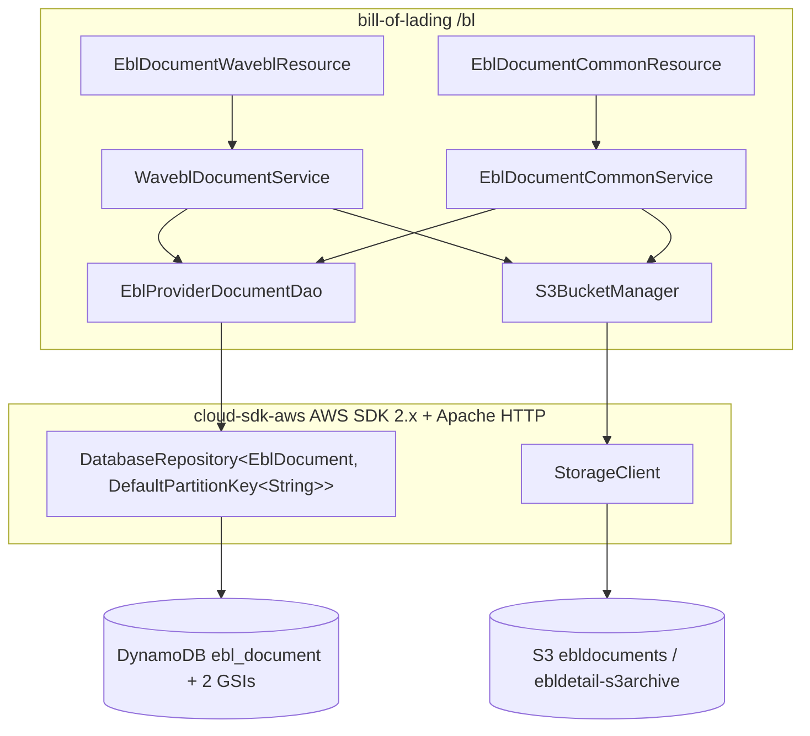
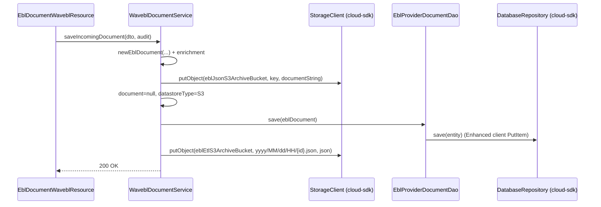

# Bill of Lading — AWS SDK 2.x (cloud-sdk) Upgrade Design

**Module:** `bill-of-lading`
**Date:** 2026-06-30
**Status:** Target design (AWS 1.x → AWS 2.x via cloud-sdk) — **NOT STARTED**
**Companion:** `2026-06-30-bill-of-lading-current-state-DESIGN-claude.md`
**Reference upgrades:** `booking` (S3 + DynamoDB, complete), `visibility` (S3 + DynamoDB + SNS/SQS), `network`/`registration` (DynamoDB DAO patterns)

---

## 1. Change Overview

Replace all direct AWS SDK v1 (`com.amazonaws.*`) usage with the in-house **cloud-sdk** (`cloud-sdk-api` +
`cloud-sdk-aws`, AWS SDK 2.x Enhanced Client + Apache HTTP under the hood). Exactly **two** AWS services are in scope.

| AWS service | Current (v1) | Target (cloud-sdk / v2) |
|-------------|--------------|--------------------------|
| **S3** | `AmazonS3` / `AmazonS3ClientBuilder` (direct), `S3Object`, `IOUtils` | `com.inttra.mercury.cloudsdk.storage.api.StorageClient` + `StorageClientFactory.createDefaultS3Client()`; `StorageObject` for reads |
| **DynamoDB** | `DynamoDBMapper` + v1 ORM annotations (via `dynamo-client`) | `DatabaseRepository<T,K>` + Enhanced-client annotations (`cloud-sdk-aws`) + `DefaultQuerySpec` |

**Out of scope:** Elasticsearch (Jest, `indexingEnabled:false` in every env — left untouched); Parameter Store
(`${awsps:}` still resolved by commons); the ETL **SNS/SQS/Lambda** chain (external to this module — bill-of-lading
only writes the S3 object).

**Backward-compatibility is mandatory.** The following must remain wire-identical so existing items/objects stay
readable and the downstream ETL Lambda keeps parsing:

- DynamoDB table `ebl_document`; GSIs `ebl_number_inttra_company_id_index`, `inttra_id_action_date_index`; their key
  schema and **INCLUDE** projections (`currentStatus`, `documentDirection`).
- Attribute encodings: hash key attribute name `id`; `actionDateTime`/`eblProviderActionDateTime` as **ISO-8601
  strings** (`DateTimeFormatter.ISO_OFFSET_DATE_TIME`); enums as their `name()` strings; `titleSignatures` as a **JSON
  string**; `audit`/`originLocation`/`destinationLocation` as **maps (M)**; `documentOwnerCompanyId` as **number (N)**.
- S3 document key `document/{provider}/{ownerCompanyId}/{yyyy-MM-dd}/{uuid}` and ETL key `yyyy/MM/dd/HH/{id}.json`;
  `s3Location` URI `s3://{bucket}/{key}`.
- **Decoupling rule:** DynamoDB on-wire attribute formats are independent of the REST/ETL JSON formats — the entity's
  Jackson `@JsonFormat(pattern="yyyy-MM-dd'T'HH:mm:ss.SSSZ")` governs REST/ETL JSON, while the `AttributeConverter`
  governs the DynamoDB string. Both must keep their **current, distinct** encodings; do not let the v2 converter leak
  into the JSON path or vice-versa.

---

## 2. Maven Dependency Changes

```diff
  <properties>
-   <mercury.commons.version>1.R.01.021</mercury.commons.version>
-   <mercury.dynamodbclient.version>1.R.01.021</mercury.dynamodbclient.version>
+   <mercury.commons.version>1.0.26-SNAPSHOT</mercury.commons.version>
+   <jackson.version>2.21.0</jackson.version>
  </properties>

+ <!-- Pin Jackson to one line so BouncyCastle / java-jwt / cloud-sdk don't drift (see booking pom) -->
+ <dependencyManagement>
+   <dependencies>
+     <dependency>
+       <groupId>com.fasterxml.jackson</groupId>
+       <artifactId>jackson-bom</artifactId>
+       <version>${jackson.version}</version>
+       <type>pom</type><scope>import</scope>
+     </dependency>
+   </dependencies>
+ </dependencyManagement>

  <dependencies>
    <dependency>
      <groupId>com.inttra.mercury</groupId>
      <artifactId>commons</artifactId>
      <version>${mercury.commons.version}</version>
    </dependency>

-   <dependency>
-     <groupId>com.inttra.mercury</groupId>
-     <artifactId>dynamo-client</artifactId>
-     <version>${mercury.dynamodbclient.version}</version>
-   </dependency>
+   <dependency>
+     <groupId>com.inttra.mercury</groupId>
+     <artifactId>cloud-sdk-api</artifactId>
+     <version>${mercury.commons.version}</version>
+   </dependency>
+   <dependency>
+     <groupId>com.inttra.mercury</groupId>
+     <artifactId>cloud-sdk-aws</artifactId>
+     <version>${mercury.commons.version}</version>
+   </dependency>

+   <!-- DynamoDB Local integration-test framework -->
+   <dependency>
+     <groupId>com.inttra.mercury</groupId>
+     <artifactId>dynamo-integration-test</artifactId>
+     <version>${mercury.commons.version}</version>
+     <scope>test</scope>
+   </dependency>
+   <!-- AWS SDK v1 DynamoDB kept ONLY for DynamoDB Local in tests (matches booking) -->
+   <dependency>
+     <groupId>com.amazonaws</groupId>
+     <artifactId>aws-java-sdk-dynamodb</artifactId>
+     <version>1.12.721</version>
+     <scope>test</scope>
+   </dependency>
  </dependencies>
```

- **Removed (prod):** `dynamo-client` and, with it, the only path that pulled `com.amazonaws:aws-java-sdk-*` (both the
  transitive DynamoDB v1 and the S3 v1 used directly today). After this, **no `com.amazonaws` on the prod classpath.**
- cloud-sdk uses **Apache HTTP** (no Netty), matching the booking/visibility rebase.

---

## 3. Configuration Changes (`conf/<env>/config.yaml`)

The `dynamoDbConfig` block keeps its existing keys and adds the cloud-sdk `BaseDynamoDbConfig` fields (`region`,
`sseEnabled`, optional local-emulator `regionEndpoint`/`signingRegion`). The `environment` prefixes — **including CVT's
`inttra2_test_bl`** — and capacities stay unchanged. Bucket names are untouched.

```diff
  dynamoDbConfig:
    environment: inttra2_qa_bl        # CVT stays inttra2_test_bl, INT inttra_int_bl, PROD inttra2_prod_bl
    readCapacityUnits: 5
    writeCapacityUnits: 5
+   region: us-east-1
+   sseEnabled: false
+   # local Dynamo emulator only:
+   #regionEndpoint: http://localhost:8000
+   #signingRegion: us-west-2

  eblJsonS3ArchiveBucket: inttra2-qa-s3-ebldocuments
  eblEtlS3ArchiveBucket: inttra2-qa-s3-ebldetail-s3archive
```

**Config class change** — `BillOfLadingConfig.dynamoDbConfig` field type moves from
`com.inttra.mercury.dynamo.respository.module.DynamoDbConfig` to
`com.inttra.mercury.cloudsdk.database.config.BaseDynamoDbConfig` (annotate `@Valid @NotNull`, as in `BookingConfig`):

```diff
- import com.inttra.mercury.dynamo.respository.module.DynamoDbConfig;
+ import com.inttra.mercury.cloudsdk.database.config.BaseDynamoDbConfig;
  @Data
  public class BillOfLadingConfig extends ApplicationConfiguration {
-   private DynamoDbConfig dynamoDbConfig;
+   @Valid @NotNull private BaseDynamoDbConfig dynamoDbConfig;
    private ElasticsearchConfig elasticsearchConfig;
    private String eblJsonS3ArchiveBucket;
    private String eblEtlS3ArchiveBucket;
  }
```

---

## 4. Per-Service Spec

### 4.1 S3 — `S3BucketManager`

**Before (v1):**
```java
// BillOfLadingInjector
AmazonS3 s3 = AmazonS3ClientBuilder.standard()
    .withClientConfiguration(new ClientConfiguration().withMaxErrorRetry(5)).build();
bind(AmazonS3.class).toInstance(s3);

// S3BucketManager
amazonS3.putObject(eblJsonS3BucketName, s3Key, documentEncoded);          // saveEblDocument
amazonS3.putObject(eblEtlS3BucketName, s3Key, jsonStr);                    // saveEblJsonForEtlJob
S3Object s3Object = amazonS3.getObject(eblJsonS3BucketName, s3Key);        // getEblDocumentFromS3
String json = new String(IOUtils.toByteArray(s3Object.getObjectContent()), charset);
```

**After (cloud-sdk):** (mirrors booking `S3WorkspaceService`)
```java
// BillOfLadingMessagingModule (new) — or fold into BillOfLadingInjector
@Provides @Singleton
StorageClient provideStorageClient() {
    return StorageClientFactory.createDefaultS3Client();
}

// S3BucketManager  (inject StorageClient instead of AmazonS3; keep the two @Named bucket strings)
storageClient.putObject(eblJsonS3BucketName, s3Key, documentEncoded);     // saveEblDocument
storageClient.putObject(eblEtlS3BucketName, s3Key, jsonStr);              // saveEblJsonForEtlJob
StorageObject obj = storageClient.getObject(eblJsonS3BucketName, s3Key);  // getEblDocumentFromS3
String json = read(obj.getContent(), charset);   // StorageObject.getContent() returns InputStream
```

- The `String`-content `putObject` overload exists on `StorageClient` (used by booking `S3WorkspaceService.putObject`).
- `getObject` returns `StorageObject`; replace `S3Object.getObjectContent()` + `com.amazonaws.util.IOUtils` with
  `StorageObject.getContent()` read via `is.readAllBytes()` (drop the `com.amazonaws.util.IOUtils` import entirely).
- Key-building, URI prefix logic, and the `document`-prefix branch are unchanged.

> **Gap call-out.** The v1 client set `ClientConfiguration.withMaxErrorRetry(5)`.
> `StorageClientFactory.createDefaultS3Client()` (used by booking) does not expose error-retry / socket /
> connection-pool tuning. If the `maxErrorRetry(5)` behaviour must be preserved, use the configurable
> `StorageClientFactory.createS3Client(AwsStorageConfig.builder()…build())` path if available, or raise a
> `cloud-sdk-api` enhancement (same gap flagged in the visibility upgrade).

### 4.2 DynamoDB — `EblDocument` + nested types + `EblProviderDocumentDao`

**Entity before (v1 ORM, abridged):**
```java
@DynamoDBTable(tableName = "ebl_document")
public class EblDocument implements DynamoHashKey<String> {
  @DynamoDBHashKey(attributeName="id") @DynamoDBAutoGeneratedKey private String hashKey;
  @DynamoDBAttribute @DynamoDBIndexHashKey(globalSecondaryIndexName=EBL_NUMBER_INTTRA_ID_INDEX) private String eblNumber;
  @DynamoDBAttribute
  @DynamoDBIndexRangeKey(globalSecondaryIndexName=EBL_NUMBER_INTTRA_ID_INDEX)
  @DynamoDBIndexHashKey(globalSecondaryIndexName=INTTRA_ID_ACTION_DATE_INDEX) private Integer documentOwnerCompanyId;
  @DynamoDBAttribute @DynamoDBTypeConverted(converter=OffsetDateTimeTypeConverter.class)
  @DynamoDBIndexRangeKey(globalSecondaryIndexName=INTTRA_ID_ACTION_DATE_INDEX) private OffsetDateTime actionDateTime;
  @DynamoDBTypeConverted(converter=TitleSignatureDynamodbConverter.class) private List<TitleSignature> titleSignatures;
  @DynamoDBTypeConvertedEnum private DocumentStatus currentStatus; // ... ~45 fields
}
```

**Entity after (Enhanced client, abridged — annotate getters as booking does):**
```java
@DynamoDbBean
@Table(name = "ebl_document")        // com.inttra.mercury.cloudsdk.database.annotation.Table
public class EblDocument {
  @DynamoDbPartitionKey @DynamoDbAttribute("id") public String getHashKey() {...}

  @DynamoDbSecondaryPartitionKey(indexNames = "ebl_number_inttra_company_id_index")
  @DynamoDbAttribute("eblNumber") public String getEblNumber() {...}

  // documentOwnerCompanyId is SORT key on GSI-1 AND PARTITION key on GSI-2
  @DynamoDbSecondarySortKey(indexNames = "ebl_number_inttra_company_id_index")
  @DynamoDbSecondaryPartitionKey(indexNames = "inttra_id_action_date_index")
  @DynamoDbAttribute("documentOwnerCompanyId") public Integer getDocumentOwnerCompanyId() {...}

  @DynamoDbSecondarySortKey(indexNames = "inttra_id_action_date_index")
  @DynamoDbConvertedBy(OffsetDateTimeAttributeConverter.class)   // ISO-8601 string, wire-identical
  @DynamoDbAttribute("actionDateTime") public OffsetDateTime getActionDateTime() {...}

  @DynamoDbConvertedBy(TitleSignatureAttributeConverter.class)   // JSON string, wire-identical
  @DynamoDbAttribute("titleSignatures") public List<TitleSignature> getTitleSignatures() {...}
  // enums: default enhanced-client enum handling stores name() (same as @DynamoDBTypeConvertedEnum)
}
```

- **`@DynamoDBAutoGeneratedKey`** has no enhanced-client equivalent — the UUID is already generated in
  `WaveblDocumentService.getNewHashKeyId()` (`UUID.randomUUID()`), so drop the annotation and rely on the service.
  Verify no other write path relied on auto-generation.
- **GSI projections** are not declared on the entity in v2; they are created at table-bootstrap time. Preserve the
  INCLUDE(`currentStatus`,`documentDirection`) projection in the migrated `DynamoDBCommand` path (`@GsiConfig` +
  `ProjectionType`, as on booking `SpotRatesToInttraRefDetail`).
- **Nested `@DynamoDBDocument` types** `Location`, `Audit`, `NetworkParticipant` → `@DynamoDbBean` (no `@Table`); `Audit`
  keeps two `OffsetDateTime` getters annotated `@DynamoDbConvertedBy(OffsetDateTimeAttributeConverter.class)`.

**Converters** (re-implement as `software.amazon.awssdk.enhanced.dynamodb.AttributeConverter`; cloud-sdk already ships
a reusable `com.inttra.mercury.cloudsdk.database.converter.OffsetDateTimeTypeConverter` — confirm its format matches
`ISO_OFFSET_DATE_TIME` before reusing, otherwise port the existing one):

| v1 converter | v2 replacement | On-wire encoding (unchanged) |
|---|---|---|
| `OffsetDateTimeTypeConverter` | `OffsetDateTimeAttributeConverter` (`AttributeValue` `S`) | `DateTimeFormatter.ISO_OFFSET_DATE_TIME` string |
| `TitleSignatureDynamodbConverter` | `TitleSignatureAttributeConverter` (`AttributeValue` `S`) | Jackson JSON array string |

**DAO before/after** (`getDocumentsSummery`):
```java
// BEFORE — DynamoDBCrudRepository.query(index, attrValues, keyCond, filter, NOT_CONSISTENT) + findByIds
List<EblDocument> ids = query(INTTRA_ID_ACTION_DATE_INDEX, expressionAttributeValues,
    "documentOwnerCompanyId = :documentOwnerCompanyId and actionDateTime BETWEEN :fromDate and :toDate",
    filterExpression, DYNAMO_READ_BEHAVIOUR.NOT_CONSISTENT);
return findByIds(ids);

// AFTER — DatabaseRepository + DefaultQuerySpec (mirrors booking TemplateSummaryDao)
Map<String, CloudAttributeValue> filterValues = new HashMap<>();
DefaultQuerySpec.Builder b = DefaultQuerySpec.builder()
    .indexName("inttra_id_action_date_index")
    .partitionKeyValue(CloudAttributeValue.ofNumber(documentOwnerCompanyId))
    .sortKeyName("actionDateTime")
    .sortKeyValue(CloudAttributeValue.ofString(fromDate.format(ISO)),
                  CloudAttributeValue.ofString(toDate.format(ISO)))
    .sortKeyCondition("BETWEEN")
    .consistentRead(false);
if (currentStatus != null && documentDirection != null) {
    filterValues.put(":currentStatus", CloudAttributeValue.ofString(currentStatus.name()));
    filterValues.put(":documentDirection", CloudAttributeValue.ofString(documentDirection.name()));
    b.filterExpression("currentStatus = :currentStatus and documentDirection = :documentDirection")
     .expressionAttributeValues(filterValues);
} else if (documentDirection != null) { /* direction-only filter */ }
List<EblDocument> ids = repository.query(b.build());
return findByIds(ids);   // keep the per-id hashKey follow-up + setDocument(null)
```

- `findUnderPossessionByEblNumberAndInttraCompanyId` / `findByEblNumber(AndInttraCompanyId)` migrate the same way
  against `ebl_number_inttra_company_id_index` (partition `eblNumber`, optional sort `documentOwnerCompanyId`, filter
  `currentStatus`).
- `findOne(hashKey)` → `repository.findById(new DefaultPartitionKey<>(id))`; `save`/`update` → `repository.save(...)`.
- **`getDocumentsSummery` returns N (number) partition value** — use `CloudAttributeValue.ofNumber` to keep the `N`
  type that v1 wrote (`AttributeValue().withN(...)`).

---

## 5. Guice Wiring Changes

```diff
  // BillOfLadingApplication
- .moduleGenerator((c, e) -> new DynamoDBModule(c.getDynamoDbConfig(), e))
+ .moduleGenerator(BillOfLadingDynamoModule::new)   // cloud-sdk repo + StorageClient providers

  // BillOfLadingInjector.configure()
- AmazonS3 s3 = AmazonS3ClientBuilder.standard()
-     .withClientConfiguration(new ClientConfiguration().withMaxErrorRetry(5)).build();
- bind(AmazonS3.class).toInstance(s3);
  // (keep ServiceDefinition + bucket-name + ElasticsearchConfig + service-impl bindings)
```

```diff
+ // BillOfLadingDynamoModule (new) — pattern from BookingDynamoModule
+ @Provides @Singleton DynamoDbClientConfig provideDynamoCfg(BillOfLadingConfig c) {
+     return c.getDynamoDbConfig().toClientConfigBuilder().consistentRead(false).build();
+ }
+ @Provides @Singleton EblProviderDocumentDao provideEblDao(DynamoDbClientConfig cfg) {
+     String tableName = cfg.getTablePrefix() + EblDocument.class.getAnnotation(Table.class).name();
+     DatabaseRepository<EblDocument, DefaultPartitionKey<String>> repo =
+         DynamoRepositoryFactory.createEnhancedRepository(cfg, tableName, EblDocument.class,
+             DynamoRepositoryConfig.builder().domainType(EblDocument.class).build());
+     return new EblProviderDocumentDao(repo);
+ }
+ @Provides @Singleton StorageClient provideStorageClient() {
+     return StorageClientFactory.createDefaultS3Client();
+ }
```

`S3BucketManager` is injected with `StorageClient`; `EblProviderDocumentDao`'s constructor changes from
`(DynamoDBMapper, DynamoDBMapperConfig)` to `(DatabaseRepository<EblDocument, DefaultPartitionKey<String>>)`.

---

## 6. Target Component Diagram



## 7. Target Data Flow — incoming document (after)



---

## 8. Key Classes Changed

| Class | Change |
|-------|--------|
| `pom.xml` | swap `dynamo-client` → `cloud-sdk-api` + `cloud-sdk-aws`; add `dynamo-integration-test` + test-scoped `aws-java-sdk-dynamodb`; pin Jackson; drop the `dynamodbclient.version` property. |
| `BillOfLadingApplication` | replace `DynamoDBModule` generator with `BillOfLadingDynamoModule`. |
| `BillOfLadingInjector` | drop the `AmazonS3` binding (and `ClientConfiguration` import); keep the rest. |
| `BillOfLadingDynamoModule` (**new**) | `DynamoDbClientConfig`, `EblProviderDocumentDao`, `StorageClient` providers. |
| `BillOfLadingConfig` | `dynamoDbConfig` type `DynamoDbConfig` → `BaseDynamoDbConfig` (`@Valid @NotNull`). |
| `S3BucketManager` | `AmazonS3` → `StorageClient`; `S3Object`/`IOUtils` → `StorageObject.getContent()`. |
| `EblDocument` | v1 ORM annotations → `@DynamoDbBean`/`@Table` + enhanced key annotations on getters; drop `@DynamoDBAutoGeneratedKey`; `getGSIProjections()` removed (projections move to bootstrap). |
| `Audit`, `Location`, `NetworkParticipant` | `@DynamoDBDocument` → `@DynamoDbBean`; `Audit` timestamps `@DynamoDbConvertedBy`. |
| `EblProviderDocumentDao` | `extends DynamoDBCrudRepository` → injected `DatabaseRepository`; `query(...)` → `DefaultQuerySpec`; `findOne` → `findById`. |
| `OffsetDateTimeTypeConverter`, `TitleSignatureDynamodbConverter` | re-implement as `AttributeConverter` (or reuse cloud-sdk's, after verifying format). |
| `DynamoDBCommand` | table/GSI bootstrap via the cloud-sdk admin path; preserve names, key schema, INCLUDE projections, 5/5 capacity. |

---

## 9. Testing Strategy

- **DynamoDB-Local IT** (`dynamo-integration-test` `BaseDynamoDbIT`, `@Tag("integration")`) for
  `EblProviderDocumentDao`: both GSIs; the 90-day `BETWEEN` window; possession/direction filter
  (`UNDER_POSSESSION`+`INCOMING`); `save`→`findById` round-trip; `inactivateDocumentStatus` flow; converter fidelity
  (re-read an item written by the v1 mapper and assert the ISO date string + `titleSignatures` JSON parse identically).
- **S3 round-trip** unit/IT for `S3BucketManager` (`saveEblDocument` key shape, `saveEblJsonForEtlJob` key shape +
  `document==null` in the ETL JSON, `getEblDocumentFromS3` `document`-prefix vs re-parse branch).
- Mirror booking's S3 test level (`S3WorkspaceServiceTest`) and the network/registration DAO IT patterns.
- Reuse the existing `S3BucketManagerTest` / `EblDocumentCommonServiceTest` / `WaveblDocumentServiceTest` after the
  mock types change (`AmazonS3` → `StorageClient`).
- Certify **full local JaCoCo coverage** on all changed code (note `**/model/**` is Sonar-excluded, so converter +
  DAO + manager coverage carries the weight):
  ```
  mvn -f bill-of-lading/pom.xml clean verify
  ```

---

## 10. Risks & Call-outs

- **Largest surface = the DynamoDB v1 ORM.** `EblDocument` has ~45 annotated fields, a dual-role key
  (`documentOwnerCompanyId` = GSI-1 sort + GSI-2 partition), 3 nested `@DynamoDbBean` types, enum + date + JSON
  converters. Every attribute name and encoding must round-trip so existing `ebl_document` items remain readable.
- **`@DynamoDBAutoGeneratedKey` has no v2 equivalent** — confirm the UUID is always set by the service before
  `save`; a missed path would write items with a null/empty `id`.
- **ETL archive JSON** feeds an external Lambda (`inttra2_*_sns_ebldocuments` → `*_sqs_ebldocuments`). Keep it
  byte-identical: same field set, `document` nulled, `@JsonFormat` timestamp pattern preserved. Decouple this JSON from
  the DynamoDB attribute format.
- **S3 client tuning gap** — `maxErrorRetry(5)` is not exposed by `StorageClientFactory.createDefaultS3Client()`; use
  `createS3Client(AwsStorageConfig…)` or raise a cloud-sdk enhancement.
- **CVT prefix trap** — CVT uses `inttra2_test_bl` (DynamoDB) and `inttra2-cv-s3-*` (buckets), **not** `inttra2_cvt_*`.
  Carry these exact strings through the `BaseDynamoDbConfig` migration.
- **Sequencing** — migrate S3 and DynamoDB in incremental, test-verified steps; one outgoing commit per the team
  workflow, and every commit message must carry the Jira ticket prefix (e.g. `ION-xxxxx …`).
