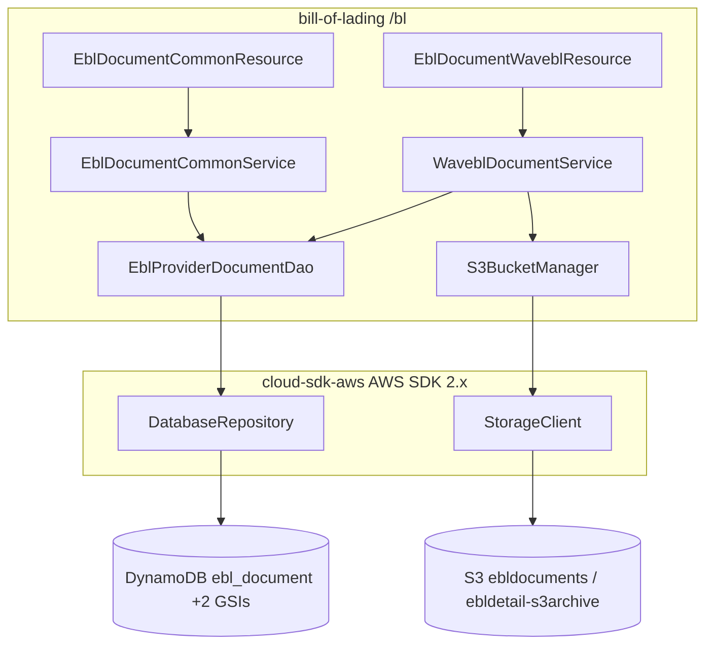
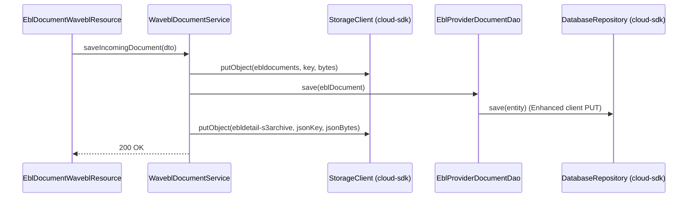

# Bill of Lading — AWS SDK 2.x (cloud-sdk) Upgrade Design

**Module:** `bill-of-lading`
**Date:** 2026-06-30
**Status:** Target design (AWS 1.x → AWS 2.x via cloud-sdk) — NOT STARTED
**Companion:** `2026-06-30-bill-of-lading-current-state-DESIGN-copilot.md`
**Reference upgrades:** `booking` (S3 + DynamoDB), `network`/`registration` (DynamoDB)

---

## 1. Change Overview

Replace all direct AWS SDK v1 usage with the in-house **cloud-sdk** (`cloud-sdk-api` + `cloud-sdk-aws`, AWS SDK 2.x
under the hood). Two AWS services are in scope:

| AWS service | Current (v1) | Target (cloud-sdk / v2) |
|-------------|--------------|--------------------------|
| **S3** | `AmazonS3` / `AmazonS3ClientBuilder` (direct) | `StorageClient` + `StorageClientFactory.createDefaultS3Client()` |
| **DynamoDB** | `DynamoDBMapper` + v1 ORM annotations (via `dynamo-client`) | `DatabaseRepository<T,K>` + Enhanced-client annotations (via `cloud-sdk-aws`) |

Out of scope: Elasticsearch (Jest, indexing currently disabled), Parameter Store (already handled by commons).

**Backward-compatibility is mandatory:** table `ebl_document`, both GSIs, key schema, the S3 binary key pattern, and
the ETL archive JSON format must remain byte/shape-identical (the ETL JSON feeds a downstream S3→SNS→SQS→Lambda chain).

---

## 2. Maven Dependency Changes

```diff
  <properties>
+   <mercury.commons.version>1.0.26-SNAPSHOT</mercury.commons.version>
  </properties>

  <dependencies>
    <dependency>
      <groupId>com.inttra.mercury</groupId>
      <artifactId>commons</artifactId>
-     <version>1.R.01.021</version>
+     <version>${mercury.commons.version}</version>
    </dependency>

-   <dependency>
-     <groupId>com.inttra.mercury</groupId>
-     <artifactId>dynamo-client</artifactId>
-     <version>1.R.01.021</version>
-   </dependency>
+   <dependency>
+     <groupId>com.inttra.mercury</groupId>
+     <artifactId>cloud-sdk-api</artifactId>
+     <version>${mercury.commons.version}</version>
+   </dependency>
+   <dependency>
+     <groupId>com.inttra.mercury</groupId>
+     <artifactId>cloud-sdk-aws</artifactId>
+     <version>${mercury.commons.version}</version>
+   </dependency>

+   <!-- DynamoDB Local integration-test framework -->
+   <dependency>
+     <groupId>com.inttra.mercury</groupId>
+     <artifactId>dynamo-integration-test</artifactId>
+     <version>${mercury.commons.version}</version>
+     <scope>test</scope>
+   </dependency>
+   <!-- AWS SDK v1 DynamoDB kept ONLY for DynamoDB Local in tests -->
+   <dependency>
+     <groupId>com.amazonaws</groupId>
+     <artifactId>aws-java-sdk-dynamodb</artifactId>
+     <scope>test</scope>
+   </dependency>
  </dependencies>
```

- **Removed (prod):** `dynamo-client`, all transitive `com.amazonaws:aws-java-sdk-*` (S3 + DynamoDB v1).
- **Jackson:** pin to a single version (~2.21.0) via `dependencyManagement` to avoid conflicts (BouncyCastle/JWT/AWS).
- cloud-sdk factories use **Apache HTTP** (no Netty).

---

## 3. Configuration Changes (`conf/<env>/config.yaml`)

The DynamoDB block migrates to the cloud-sdk `BaseDynamoDbConfig` shape (region added; same env-prefix + capacities).
S3 bucket names stay as-is.

```diff
  dynamoDbConfig:
    environment: inttra_int_bl
+   region: us-east-1
    readCapacityUnits: 5
    writeCapacityUnits: 5
+   sseEnabled: false

  eblJsonS3ArchiveBucket: inttra-int-s3-ebldocuments
  eblEtlS3ArchiveBucket: inttra-int-s3-ebldetail-s3archive
```

`BillOfLadingConfig` keeps `eblJsonS3ArchiveBucket` / `eblEtlS3ArchiveBucket`; `dynamoDbConfig` field type changes
from the legacy `DynamoDbConfig` to cloud-sdk `BaseDynamoDbConfig`.

---

## 4. Per-Service Spec

### 4.1 S3 — `S3BucketManager`

**Before (v1):**
```java
// BillOfLadingInjector
AmazonS3 s3 = AmazonS3ClientBuilder.standard()
    .withClientConfiguration(new ClientConfiguration().withMaxErrorRetry(5)).build();
bind(AmazonS3.class).toInstance(s3);

// S3BucketManager
amazonS3.putObject(bucket, key, content);
```

**After (cloud-sdk):**
```java
// BillOfLadingInjector / a new BillOfLadingStorageModule
@Provides @Singleton
StorageClient provideStorageClient() {
    return StorageClientFactory.createDefaultS3Client();   // or createS3Client(AwsStorageConfig.builder()...build())
}

// S3BucketManager  (StorageClient.putObject(bucket, key, String content))
storageClient.putObject(bucket, key, content);
// download path: String data = storageClient.getObject(bucket, key);
```

> **Gap call-out:** the v1 client set `maxErrorRetry(5)`. `StorageClientFactory.createDefaultS3Client()` uses the
> default credential chain + Apache HTTP client; `StorageClientFactory.createS3Client(AwsStorageConfig.builder()
> .credentialsProvider(...).httpClient(ApacheHttpClient...)...build())` (`cloudsdk.storage.config.AwsStorageConfig`)
> allows credential/transport tuning. Fine-grained socket/connection-pool/retry timeouts are still not fully exposed —
> raise a `cloud-sdk-api` enhancement if the previous `maxErrorRetry(5)` behavior must be preserved exactly.

### 4.2 DynamoDB — `EblDocument` + `EblProviderDocumentDao`

**Entity before (v1 ORM):**
```java
@DynamoDBTable(tableName = "ebl_document")
public class EblDocument implements DynamoHashKey<String> {
  @DynamoDBHashKey(attributeName="id") @DynamoDBAutoGeneratedKey private String hashKey;
  @DynamoDBIndexHashKey(globalSecondaryIndexName="ebl_number_inttra_company_id_index") private String eblNumber;
  @DynamoDBIndexHashKey(globalSecondaryIndexName="inttra_id_action_date_index") private Integer documentOwnerCompanyId;
  @DynamoDBIndexRangeKey(globalSecondaryIndexName="inttra_id_action_date_index")
  @DynamoDBTypeConverted(converter=OffsetDateTimeTypeConverter.class) private OffsetDateTime actionDateTime;
}
```

**Entity after (enhanced client):**
```java
@DynamoDbBean
@Table(name = "ebl_document")
public class EblDocument {
  @DynamoDbPartitionKey @DynamoDbAttribute("id") private String hashKey;

  @DynamoDbSecondaryPartitionKey(indexNames = "ebl_number_inttra_company_id_index")
  private String eblNumber;

  @DynamoDbSecondaryPartitionKey(indexNames = "inttra_id_action_date_index")
  private Integer documentOwnerCompanyId;

  @DynamoDbSecondarySortKey(indexNames = "inttra_id_action_date_index")
  @DynamoDbConvertedBy(OffsetDateTimeAttributeConverter.class)  // ISO-8601 string, wire-compatible
  private OffsetDateTime actionDateTime;
  // ... document(byte[]), currentStatus, documentDirection, titleSignatures, etc.
}
```

**Converters** (re-implement as `software.amazon.awssdk.enhanced.dynamodb.AttributeConverter`):
- `OffsetDateTimeAttributeConverter` — `OffsetDateTime` ↔ ISO-8601 **String** (preserve existing encoding).
- `TitleSignatureAttributeConverter` — `List<TitleSignature>` ↔ **JSON String** (preserve existing encoding).

**DAO before/after:**
```java
// before: extends DynamoDBCrudRepository; query(index, attrValues, keyCond, filter, NOT_CONSISTENT)
// after:  DatabaseRepository<EblDocument, DefaultPartitionKey<String>> injected; build DefaultQuerySpec
List<EblDocument> getDocumentsSummery(Integer companyId, OffsetDateTime from, OffsetDateTime to) {
  DefaultQuerySpec spec = DefaultQuerySpec.builder()
      .indexName("inttra_id_action_date_index")
      .partitionKeyName("documentOwnerCompanyId")
      .partitionKeyValue(CloudAttributeValue.ofNumber(companyId))
      .sortKeyName("actionDateTime")
      .sortKeyValue(CloudAttributeValue.ofString(from.format(ISO)), CloudAttributeValue.ofString(to.format(ISO)))
      .sortKeyCondition("BETWEEN")
      .consistentRead(false)
      .build();
  return repository.query(spec); // then apply currentStatus/direction filtering
}
```

---

## 5. Guice Wiring Changes

```diff
- bind(AmazonS3.class).toInstance(AmazonS3ClientBuilder.standard()...build());
- bind(DynamoDBMapper.class)...   // via DynamoDBModule (dynamo-client)
+ // StorageModule
+ @Provides @Singleton StorageClient provideStorageClient() { return StorageClientFactory.createDefaultS3Client(); }
+ // DynamoModule
+ @Provides @Singleton DynamoDbClientConfig provideDynamoCfg(BillOfLadingConfig c) {
+     return c.getDynamoDbConfig().toClientConfigBuilder().consistentRead(false).build(); }
+ @Provides @Singleton DatabaseRepository<EblDocument, DefaultPartitionKey<String>> provideEblRepo(DynamoDbClientConfig cfg) {
+     // table name = prefix + @Table.name()  (com.inttra.mercury.cloudsdk.database.annotation.Table)
+     String tableName = cfg.getTablePrefix() + EblDocument.class.getAnnotation(Table.class).name();
+     return DynamoRepositoryFactory.createEnhancedRepository(cfg, tableName, EblDocument.class,
+         DynamoRepositoryConfig.builder().domainType(EblDocument.class).build()); }
```

`S3BucketManager` is injected with `StorageClient`; `EblProviderDocumentDao` is injected with the
`DatabaseRepository` instead of `DynamoDBMapper`.

---

## 6. Target Component Diagram



## 7. Target Data Flow — incoming document (after)



---

## 8. Key Classes Changed

| Class | Change |
|-------|--------|
| `pom.xml` | swap `dynamo-client` → `cloud-sdk-api`+`cloud-sdk-aws`; add test deps. |
| `BillOfLadingInjector` | drop `AmazonS3` binding; add `StorageClient` + DynamoDB repo providers (or split into modules). |
| `BillOfLadingConfig` | `dynamoDbConfig` → `BaseDynamoDbConfig`. |
| `S3BucketManager` | `AmazonS3.putObject` → `StorageClient.putObject(bucket, key, String)`. |
| `EblDocument`, `Location`, `NetworkParticipant` | v1 ORM annotations → `@DynamoDbBean`/`@Table`/enhanced keys. |
| `EblProviderDocumentDao` | `DynamoDBMapper`/`query` → `DatabaseRepository` + `DefaultQuerySpec`. |
| `OffsetDateTimeTypeConverter`, `TitleSignatureDynamodbConverter` | re-implement as `AttributeConverter`. |
| `DynamoDBCommand` | table/GSI bootstrap via cloud-sdk admin path (preserve names/projections). |

---

## 9. Testing Strategy

- **DynamoDB-Local IT** (`dynamo-integration-test` `BaseDynamoDbIT`, `@Tag("integration")`) for
  `EblProviderDocumentDao`: both GSIs, 90-day window, possession/direction filter, save+get round-trip, converter
  fidelity (ISO date string + JSON signatures).
- **S3 round-trip** unit/IT for `S3BucketManager` (put/get bytes; ETL JSON key pattern).
- Mirror **booking**'s S3 test level; **network/registration** DAO IT patterns.
- Certify **full local JaCoCo coverage** on all changed code (`mvn -f bill-of-lading/pom.xml clean verify`).

---

## 10. Risks & Call-outs

- **Largest surface = DynamoDB v1 ORM** — every annotation + converter must preserve on-disk encoding so existing
  `ebl_document` items remain readable.
- **ETL archive JSON** is consumed downstream — keep byte-identical.
- **S3 client tuning gap** (retry/timeout/connection-pool/credential-chain) not exposed by `StorageClientFactory` —
  raise a cloud-sdk enhancement if the previous `maxErrorRetry(5)` behavior is required.
- Sequencing: do DynamoDB and S3 in incremental, test-verified steps; keep exactly one outgoing commit per the team
  workflow.
