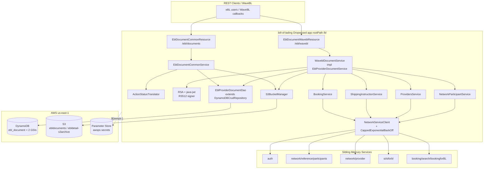
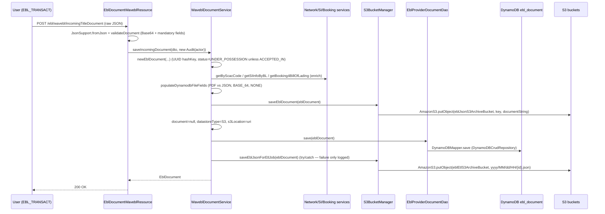
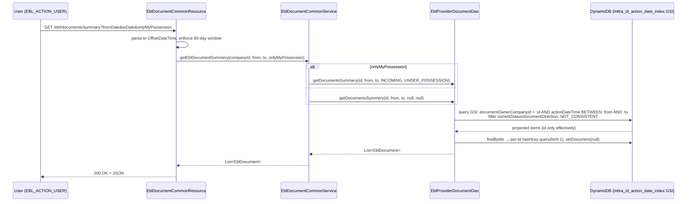
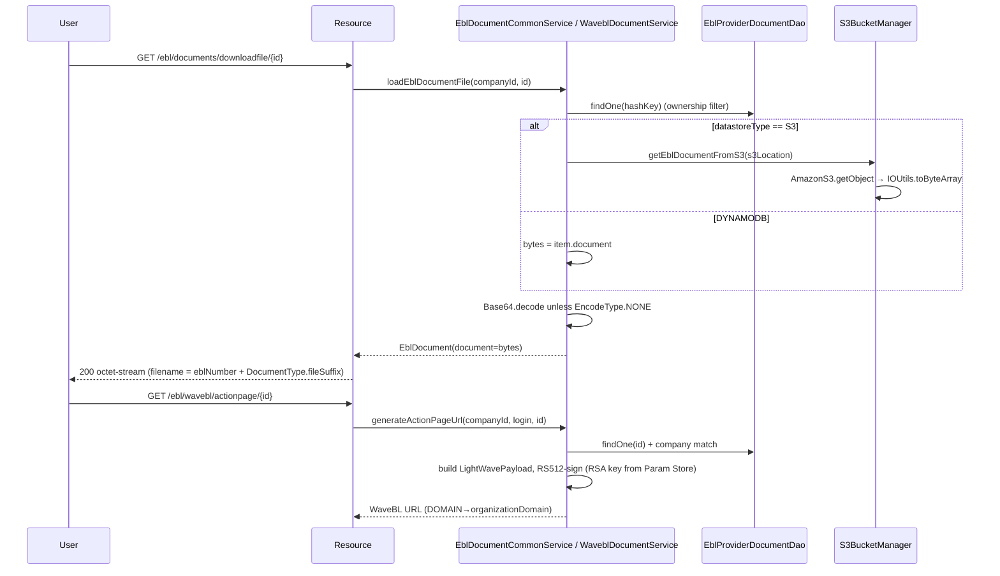

# Bill of Lading — Current-State Design

**Module:** `bill-of-lading`
**Date:** 2026-06-30
**Status:** Current state — AWS SDK **1.x** (`com.amazonaws`) in production; cloud-sdk migration **NOT STARTED**
**Artifact:** `com.inttra.mercury:bill-of-lading:1.0` (Dropwizard 4 / Jetty 12, single shaded JAR `bill-of-lading-1.0.jar`)
**Main class:** `com.inttra.mercury.bl.BillOfLadingApplication`

---

## 1. Business Purpose & Rules

The `bill-of-lading` service manages **electronic Bill of Lading (eBL) title documents** and their
possession/transaction workflow. The only fully-wired provider today is **WaveBL**; `EblProviderCode` and
`ActionStatusTranslator` reserve room for **CargoX** / **ESS** (the `CargoXDocumentService` / `EssDocsDocumentService`
classes exist but are not bound).

Core responsibilities:

- **Document ingestion** — receive incoming/outgoing WaveBL title documents (`POST /ebl/wavebl/incomingTitleDocument`,
  `/outgoingTitleDocument`) as a raw JSON body (`TitleDocumentSummaryADto`).
- **Persistence** — metadata in **DynamoDB** (`ebl_document`), binary/document body in **S3**; the binary is stripped
  from the DynamoDB item after the S3 write (`saveAsJsonFileIntoS3` sets `document=null`, `datastoreType=S3`).
- **Retrieval** — summary list by date range, history by eBL number, and binary download
  (`GET /ebl/documents/summary`, `/history/{eblNumber}`, `/downloadfile/{id}`).
- **Possession tracking** — `currentStatus` (`UNDER_POSSESSION` / `OUT_OF_POSSESSION`); on an outgoing document the
  prior under-possession items for the same eBL number + company are flipped to `OUT_OF_POSSESSION`
  (`inactivateDocumentStatus`).
- **Action-page links** — `GET /ebl/wavebl/actionpage/{id}` builds an **RSA-512 JWT** (`generateLightWaveToken`,
  `RSA512` over a `LightWavePayload`) and substitutes the provider `organizationDomain` into the WaveBL URL template.
- **Network enrichment** — on save, fetch SCAC→carrier (network participants), then SI-for-BL, falling back to
  Booking-for-BL, to populate references / origin / destination.
- **ETL archive** — after the DynamoDB save, a metadata-only JSON copy is written to a second S3 bucket
  (`saveEblJsonForEtlJob`) intended to drive a downstream **S3 → SNS → SQS → Lambda** ETL chain.

### Key business rules

| Rule | Detail (source) |
|------|------|
| Document payload required | In `EblDocumentWaveblResource.validateDocument`: `Document` **and** `DocumentMachineData` cannot both be empty; whichever is present must Base64-decode. |
| Mandatory metadata | `thirdPartyId` (Inttra company id), `documentId`, `eblNumber`, `timestamp`, `status`, `consigneeName`, `shipperName`, `issuerName`, `from`, `to`, `accessToken` — each rejected with `400` if blank. |
| Query window | `EblDocumentCommonResource.MAX_DAYS_RANGE = 90`; `toDate − 90d > fromDate` ⇒ `400 "Date range is more than 90 days"`. `fromDate`→`T00:00:00Z`, `toDate`→`T23:59:59Z`. |
| Ownership filtering | Summary/history/download all filter on `documentOwnerCompanyId == actor.getCompanyId()`; history returns empty list if the caller's company never acted on that eBL. |
| Possession-only filter | `onlyMyPossession=true` ⇒ DAO filters `currentStatus=UNDER_POSSESSION AND documentDirection=INCOMING`. |
| Document type | If `Document` empty → store `DocumentMachineData`, `DocumentType.JSON`; else store `Document`, `DocumentType.PDF`. `compressorType=NONE`, `encodeType=BASE_64`. |
| Possession assignment | Outgoing **or** `status == "ACCEPTED_IN"` ⇒ `OUT_OF_POSSESSION`; otherwise `UNDER_POSSESSION`. |
| Carrier resolution | `issuerName` becomes `carrierName` only when it differs from both shipper and consignee. SCAC pulled from `identifyingCodes` where `DCSAResponsibleAgencyCode == "SCAC"`. |
| Auth roles | Write: `EBL_TRANSACT`, `NETWORK_ADMIN`. Read/action-page: `EBL_ACTION_USER`, `NETWORK_ADMIN`, `COMPANY_USER_ADMIN`, `800020`. |
| Action-page security | JWT header `{alg:RS512, typ:JWT}`, signed with the RSA private key from Parameter Store (`wavebl-action-page` `clientSecret`); URL `DOMAIN` token replaced with the provider's `organizationDomain` (else `domain_empty`). |

---

## 2. Design & Component Diagram

Layered Dropwizard service started through the shared `InttraServer<BillOfLadingConfig>` builder. Module generators
wire: `BillOfLadingInjector` (S3 + service bindings), `LocalCacheModule`, `DynamoDBModule` (from `dynamo-client`,
built from `config.getDynamoDbConfig()`), and `JestModule` (Elasticsearch). A `DynamoDBCommand` is registered for
table/GSI bootstrap.

### Key classes & interactions

| Layer | Class | Responsibility |
|-------|-------|----------------|
| Bootstrap | `BillOfLadingApplication` | Builds `InttraServer`, registers the two resources, `DynamoDBCommand`, and the 4 module generators. |
| Wiring | `BillOfLadingInjector` (Guice `AbstractModule`) | Binds named `ServiceDefinition`s, the two bucket-name `String`s, the **`AmazonS3`** singleton, `ElasticsearchConfig`, and the `ProvidersService`/`NetworkParticipantService` impls. |
| Config | `BillOfLadingConfig extends ApplicationConfiguration` | `dynamoDbConfig` (`DynamoDbConfig` from `dynamo-client`), `elasticsearchConfig`, `eblJsonS3ArchiveBucket`, `eblEtlS3ArchiveBucket`. |
| Resource | `EblDocumentWaveblResource` (`/ebl/wavebl`) | `getLightWaveUrl`, `incomingTitleDocument`, `outgoingTitleDocument`, `validateDocument`. |
| Resource | `EblDocumentCommonResource` (`/ebl/documents`) | `/summary` (90-day window), `/history/{eblNumber}`, `/downloadfile/{id}` (octet-stream). |
| Service | `WaveblDocumentService` (impl `EblProviderDocumentService`) | Builds `EblDocument`, S3 + Dynamo persistence, enrichment, possession inactivation, JWT action-page URL. |
| Service | `EblDocumentCommonService` | Summary/history queries, `loadEblDocumentFile` (S3 download + Base64 decode), `updateDocument`. |
| Service | `ActionStatusTranslator` | Switch on `EblProviderCode` (WAVE_BL / CARGO_X); transform logic currently a pass-through (`TODO`). |
| Persistence | `EblProviderDocumentDao extends DynamoDBCrudRepository<EblDocument, DynamoHashKey<String>>` | GSI queries, `getDocumentsSummery`, `findUnderPossessionByEblNumberAndInttraCompanyId`, `findByEblNumber(AndInttraCompanyId)`, `findByIds`. |
| Persistence | `S3BucketManager` | `saveEblDocument` (binary), `saveEblJsonForEtlJob` (ETL JSON), `getEblDocumentFromS3`. |
| Network | `NetworkServiceClient` + `CappedExponentialBackOff` + `AuthClient` | Retry-wrapped JAX-RS `Client` calls with OAuth token refresh. |
| Network | `NetworkParticipantService(Impl)`, `ProvidersService(Impl)`, `ShippingInstructionService`, `BookingService` | Enrichment look-ups; participant results cached via `LocalCache` (`ServiceCache`). |
| Model | `EblDocument` (`@DynamoDBTable("ebl_document")`) | Domain entity, 2 GSIs, enum + `OffsetDateTime` + `List<TitleSignature>` converters. |
| Model | `Location`, `NetworkParticipant`, `Audit` | `@DynamoDBDocument` nested types; `Audit` also carries two `OffsetDateTime` converters. |
| Converter | `OffsetDateTimeTypeConverter`, `TitleSignatureDynamodbConverter` | v1 `DynamoDBTypeConverter<String,…>` implementations (ISO-8601 string / JSON string). |

---

## 3. Data Flow

### 3.1 Incoming title document (write path)

> **Outgoing path** is identical plus `inactivateDocumentStatus(eblNumber, companyId)` after the DynamoDB save, which
> queries the `ebl_number_inttra_company_id_index` GSI for `UNDER_POSSESSION` rows and `update()`s each to
> `OUT_OF_POSSESSION`.
> The ETL PUT to `eblEtlS3ArchiveBucket` is the trigger for the SNS→SQS→Lambda chain documented in `S3BucketManager`
> (ARNs `inttra2_{qa,cv,pr}_sns_ebldocuments` / `inttra2_{qa,cv,pr}_sqs_ebldocuments`, account `642960533737`).

### 3.2 Summary query by date range (read path)

### 3.3 Download / action-page (binary + JWT)

---

## 4. Data Stores & Integrations

### DynamoDB — table `ebl_document`

- **Hash key:** `id` (`@DynamoDBHashKey(attributeName="id")` + `@DynamoDBAutoGeneratedKey`; the Java field is
  `hashKey`, exposed as JSON `id`).
- **GSI 1 — `ebl_number_inttra_company_id_index`:** hash `eblNumber` (S), range `documentOwnerCompanyId` (N),
  projection **INCLUDE** `currentStatus`, `documentDirection`.
- **GSI 2 — `inttra_id_action_date_index`:** hash `documentOwnerCompanyId` (N), range `actionDateTime` (S, ISO-8601),
  projection **INCLUDE** `currentStatus`, `documentDirection`. (Projections defined in `EblDocument.getGSIProjections()`.)
- **Throughput:** 5 RCU / 5 WCU (base table and both GSIs — `DynamoDBCommand` passes `5L,5L`).
- **Read behaviour:** eventually consistent (`DYNAMO_READ_BEHAVIOUR.NOT_CONSISTENT`) on every query.
- **Attribute encodings:** `OffsetDateTime` → ISO-8601 string (`DateTimeFormatter.ISO_OFFSET_DATE_TIME`); enums via
  `@DynamoDBTypeConvertedEnum`; `List<TitleSignature>` → JSON string; `Location`/`Audit`/`NetworkParticipant` as
  `@DynamoDBDocument` maps (M); `document` is `byte[]` (B) but is nulled before persistence in the normal path.
- **Per-env table names** (`environment` prefix + entity name `bl`):

  | Env | Prefix (`dynamoDbConfig.environment`) | Effective table |
  |-----|----------------------------------------|-----------------|
  | INT | `inttra_int_bl` | `inttra_int_bl…ebl_document` |
  | QA | `inttra2_qa_bl` | `inttra2_qa_bl…ebl_document` |
  | **CVT** | **`inttra2_test_bl`** | `inttra2_test_bl…ebl_document` |
  | PROD | `inttra2_prod_bl` | `inttra2_prod_bl…ebl_document` |

### S3 buckets

`S3BucketManager` takes **two** bucket names. `saveEblDocument` writes the document body to `eblJsonS3ArchiveBucket`
(key `document/{provider}/{ownerCompanyId}/{yyyy-MM-dd}/{uuid}`). `saveEblJsonForEtlJob` writes the metadata-only JSON
to `eblEtlS3ArchiveBucket` (key `yyyy/MM/dd/HH/{hashKey}.json`).

| Purpose (config key) | INT | QA | CVT | PROD |
|---|---|---|---|---|
| Document body (`eblJsonS3ArchiveBucket`) | `inttra-int-s3-ebldocuments` | `inttra2-qa-s3-ebldocuments` | `inttra2-cv-s3-ebldocuments` | `inttra2-pr-s3-ebldocuments` |
| ETL JSON (`eblEtlS3ArchiveBucket`) | `inttra-int-s3-ebldetail-s3archive` | `inttra2-qa-s3-ebldetail-s3archive` | `inttra2-cv-s3-ebldetail-s3archive` | `inttra2-pr-s3-ebldetail-s3archive` |

- Internal URI form stored in `s3Location`: `s3://{eblJsonS3ArchiveBucket}/{key}`. On download the prefix is stripped
  before `getObject`. Keys starting with `document` are returned raw; otherwise the JSON is re-parsed to an
  `EblDocument` and its `document` field returned.

### SNS / SQS / Lambda (ETL — documented contract, not wired in this module)

`S3BucketManager` documents the downstream chain (commented `TODO`): a Lambda listens for the ETL bucket PUTs via
`arn:aws:sns:us-east-1:642960533737:inttra2_{qa,cv,pr}_sns_ebldocuments` →
`https://sqs.us-east-1.amazonaws.com/642960533737/inttra2_{qa,cv,pr}_sqs_ebldocuments`. **No SNS/SQS client is
instantiated inside bill-of-lading** — the contract is purely the on-object JSON shape.

### Elasticsearch (Jest)

`JestModule(config.getElasticsearchConfig())` is wired, but `indexingEnabled: false` in every env. 3 shards / 1
replica, `us-east-1`, per-env `endpointUrl` (shared with the `bk-search` ES domains). Effectively dormant.

### External REST services (via `NetworkServiceClient`)

`auth` (OAuth), `network-participants` (`network/reference/participants`), `provides-get-latest-status`
(`network/provider`), `si4bl` (`si/siforbl`), `booking4bl` (`booking/search/bookingforBL`), and the `wavebl-action-page`
URL template. `NetworkServiceClient`: GET path retries `MAX_RETRIES=4` with `CappedExponentialBackOff.backoffWithJitter`
(`BASE_DELAY=200ms`, `CAP_DELAY=12000ms`); POST path retries 3×; `401` triggers `authClient.newToken()`; `404` on GET
returns `Optional.empty()`. Participant look-ups are memoised in a Guava `LocalCache` (`ServiceCache`).

---

## 5. Maven Dependencies

| Artifact | Version | Notes |
|----------|---------|-------|
| `com.inttra.mercury:commons` | `1.R.01.021` (`${mercury.commons.version}`) | `InttraServer`, `LocalCacheModule`, `JestModule`, JAX-RS `Client`, `${awsps:}` resolution, `ApplicationConfiguration`. |
| `com.inttra.mercury:dynamo-client` | `1.R.01.021` (`${mercury.dynamodbclient.version}`) | `DynamoDBCrudRepository`, `DynamoDBModule`, `DynamoDbConfig`, `AbstractDynamoCommand`, `DynamoHashKey`. **Pulls AWS SDK v1 DynamoDB transitively.** |
| `org.bouncycastle:bcprov-jdk15on` | `1.70` | RSA key parsing for JWT signing. |
| `com.auth0:java-jwt` | `4.3.0` | RS512 JWT creation (excludes its `jackson-databind`). |
| `org.projectlombok:lombok` | `${lombok.version}` (parent), `provided` | `@Data`, `@Builder`, `@Slf4j`. |
| `junit:junit` / `org.mockito:mockito-core` | `4.13.2` / `5.12.0` (`test`) | Unit tests. |
| Build | `maven-shade-plugin:3.5.1`, `maven-compiler-plugin:3.13.0` (release **17**) | Fat JAR (`finalName=bill-of-lading-1.0`), `ManifestResourceTransformer` main class, `dependency-reduced-pom`. |

> **AWS SDK is never declared directly.** DynamoDB v1 (`com.amazonaws.services.dynamodbv2.*`) arrives transitively via
> `dynamo-client`. **S3 v1 (`com.amazonaws.services.s3.*`)** is used directly in `BillOfLadingInjector` /
> `S3BucketManager` but relies on the same transitive `aws-java-sdk` line — there is **no S3 dependency in `pom.xml`**.
> `sonar.coverage.exclusions=**/model/**`.

---

## 6. Configuration & Deployment

### `conf/{int,qa,cvt,prod}/config.yaml`

- `server.rootPath: /bl`, `applicationConnectors` 8080, `adminConnectors` 8081.
- `dynamoDbConfig` — `environment` (table prefix, see §4), `readCapacityUnits: 5`, `writeCapacityUnits: 5`.
- `elasticsearchConfig` — `endpointUrl`, `numberOfShards: 3`, `numberOfReplicas: 1`, `region: us-east-1`,
  `indexingEnabled: false`.
- `eblJsonS3ArchiveBucket`, `eblEtlS3ArchiveBucket` (bucket names, §4).
- `jerseyClient` — 32/128 threads, `timeout: 10s`, `connectionTimeout: 5s`, `retries: 1`, gzip on.
- `securityResources` — `oauthTokenValidationUri`, `userInfoUri`, `userPrincipalUri` (per-env `api(-alpha|-beta|-test).inttra.com`).
- `serviceDefinitions` — `auth` (with `clientId` + `${awsps:…/authclientsecret}`), `wavebl-action-page`
  (`clientSecret = ${awsps:…/billoflading/waveblapiprivatekey}`, the RSA key), `provides-get-latest-status`,
  `network-participants`, `si4bl`, `booking4bl`.
- **Secrets** resolved by commons via AWS Parameter Store: `${awsps:/inttra{2}/<env>/mercuryservices/...}`.

### Deployment

- `build.sh` → `mvn … package sonar:sonar -P mercury-commons,sonar -pl bill-of-lading --also-make`; renames the shaded
  JAR to `${RELEASE_NAME}.jar`, copies each `conf/<env>/config.yaml` as `config.yaml_<env>_conf`, generates the
  Dockerfile (`FROM <ECR>:e2openjre11`).
- `run.sh` → moves the active env's config to `config.yaml`, then `java -Xms64m -Xmx${JVM_Xmx} -jar
  ${RELEASE_NAME}.jar server ./config.yaml`.
- **Table/GSI bootstrap** — `DynamoDBCommand extends AbstractDynamoCommand<BillOfLadingConfig>` runs
  `createTableAndWaitUntilActive(EblDocument.class, 5,5, GSIProjections)` then `addGolbalSecondaryIndex(... 5L,5L ...)`.
- **Credentials** — default AWS credential chain / EC2 (ECS task) IAM role; `AmazonS3ClientBuilder.standard()` and the
  `dynamo-client` builder both use it. S3 client sets `ClientConfiguration.withMaxErrorRetry(5)`.

---

## 7. AWS Services & SDK 1.x Usage (CALL-OUT)

> **This module actively uses AWS SDK v1 (`com.amazonaws`) only.** A repo-wide grep finds **zero**
> `software.amazon.awssdk` and **zero** `cloudsdk` references in `bill-of-lading`. Production usage spans S3 (direct
> v1) and DynamoDB (v1 ORM via `dynamo-client`).

| AWS service | SDK | Where (class) | Concrete v1 classes |
|-------------|-----|---------------|---------------------|
| **S3** | v1 (direct) | `BillOfLadingInjector`, `S3BucketManager` | `AmazonS3`, `AmazonS3ClientBuilder`, `ClientConfiguration`, `com.amazonaws.services.s3.model.S3Object`, `com.amazonaws.util.IOUtils`. |
| **DynamoDB** | v1 ORM (via `dynamo-client`) | `EblProviderDocumentDao`, `EblDocument`, `Audit`, `Location`, `NetworkParticipant`, both converters | `DynamoDBMapper`, `DynamoDBMapperConfig`, `DynamoDBQueryExpression`, `AttributeValue`, `@DynamoDBTable`, `@DynamoDBHashKey`, `@DynamoDBAutoGeneratedKey`, `@DynamoDBAttribute`, `@DynamoDBIndexHashKey`, `@DynamoDBIndexRangeKey`, `@DynamoDBTypeConverted`, `@DynamoDBTypeConvertedEnum`, `@DynamoDBDocument`, `@DynamoDBIgnore`, `Projection`/`ProjectionType`, `DynamoDBTypeConverter`. |
| **Parameter Store** | resolved by commons (`${awsps:…}`) | config only | — (no direct SSM client). |
| **SNS / SQS / Lambda** | **none in-module** | documented in `S3BucketManager` Javadoc only | — (downstream ETL chain; only S3 PUT is performed here). |

**S3 client build** (`BillOfLadingInjector.configure`):
`AmazonS3ClientBuilder.standard().withClientConfiguration(new ClientConfiguration().withMaxErrorRetry(5)).build()`,
bound as `bind(AmazonS3.class).toInstance(s3)` and injected into `S3BucketManager`.

**DynamoDB custom converters:** `OffsetDateTimeTypeConverter` (`OffsetDateTime` ↔ ISO-8601 `String`; also a Jackson
`StdDeserializer`), `TitleSignatureDynamodbConverter` (`List<TitleSignature>` ↔ JSON `String`). `Audit` reuses
`OffsetDateTimeTypeConverter` for two timestamps.

---

## 8. AWS 2.x / cloud-sdk Upgrade Plan (High Level)

Goal: replace direct AWS SDK v1 with the in-house **cloud-sdk** (`cloud-sdk-api` + `cloud-sdk-aws`, AWS SDK 2.x
Enhanced Client + Apache HTTP), mirroring the completed **booking** and **visibility** migrations.

| Step | Action | Reference |
|------|--------|-----------|
| 1 | Bump `commons` → `1.0.26-SNAPSHOT`; **remove** `dynamo-client`; add `cloud-sdk-api` + `cloud-sdk-aws`; add `dynamo-integration-test` (test) and keep `aws-java-sdk-dynamodb` test-scoped for DynamoDB Local. Pin Jackson `2.21.0` in `dependencyManagement`. | `booking/pom.xml` |
| 2 | **S3** — replace the `AmazonS3` binding + `S3BucketManager` body with `StorageClient` + `StorageClientFactory.createDefaultS3Client()`. | `booking` `S3WorkspaceService` / `BookingMessagingModule` |
| 3 | **DynamoDB** — migrate `EblDocument` (+ `Audit`, `Location`, `NetworkParticipant`) ORM annotations to `@DynamoDbBean`/`@Table`/enhanced keys; re-implement both converters as `software.amazon.awssdk.enhanced.dynamodb.AttributeConverter`; rewrite `EblProviderDocumentDao` on `DatabaseRepository` + `DefaultQuerySpec`. **Preserve** table/GSI names, key schema, INCLUDE projections, ISO-date string + JSON encodings. | `booking` `TemplateSummaryDao` / `SpotRatesToInttraRefDetail` / `BookingDynamoModule` |
| 4 | Swap Guice wiring to cloud-sdk factories (a `BillOfLadingDynamoModule` + storage provider); migrate `dynamoDbConfig` to `BaseDynamoDbConfig`. | `booking` `BookingDynamoModule` |
| 5 | **Tests** — DynamoDB-Local IT for the DAO (both GSIs, 90-day window, possession filter, converter fidelity), S3 round-trip IT; full local JaCoCo on changed code. | `booking`/`network` `*DaoIT` |
| 6 | Confirm the ETL S3→SNS→SQS→Lambda JSON contract is byte/shape-identical (the consuming Lambda is external to this module). | — |

**Risks / call-outs:**
- **DynamoDB v1 ORM is the largest surface** — `EblDocument` carries ~45 annotated fields plus 3 nested
  `@DynamoDBDocument` types and 3 converter usages; every attribute name and encoding must round-trip unchanged.
- **ETL archive JSON** is consumed by an external Lambda; must stay byte-identical (note `document` is nulled and
  the timestamp `JsonFormat` is `yyyy-MM-dd'T'HH:mm:ss.SSSZ`).
- **S3 client knobs** — the v1 client sets `maxErrorRetry(5)`; `StorageClientFactory.createDefaultS3Client()` may not
  expose this — flag as a cloud-sdk gap (same as the visibility upgrade).
- `findByIds`'s per-id follow-up query (N+1 read after the GSI projection) must be preserved behaviourally.
