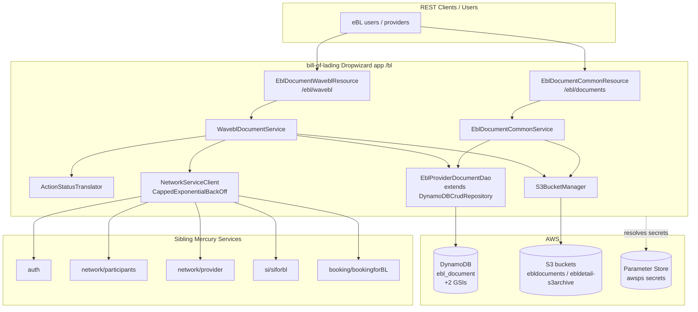
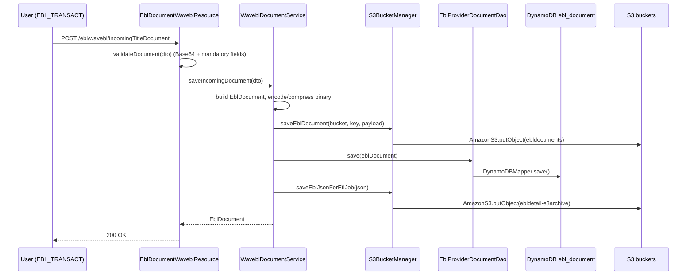
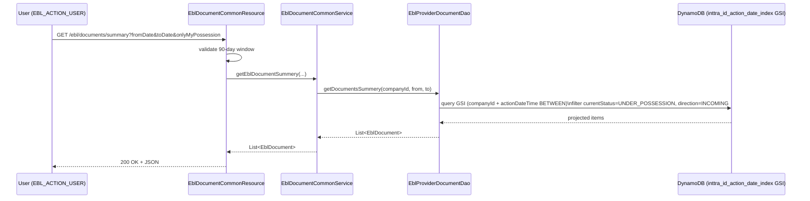

# Bill of Lading — Current-State Design

**Module:** `bill-of-lading`
**Date:** 2026-06-30
**Status:** Current state (AWS SDK 1.x — upgrade NOT STARTED)
**Artifact:** `com.inttra.mercury:bill-of-lading:1.0` (Dropwizard, single shaded JAR)
**Main class:** `com.inttra.mercury.bl.BillOfLadingApplication`

---

## 1. Business Purpose & Rules

The `bill-of-lading` service manages **electronic Bill of Lading (eBL) documents** and their workflow across
multiple eBL providers (**WaveBL**, **CargoX**).

Core responsibilities:

- **Document ingestion & storage** — receive incoming/outgoing eBL title documents from providers.
- **Persistence** — document metadata in DynamoDB, binary content in S3.
- **Retrieval** — query by eBL number, date range, owning company, possession status; download binaries.
- **Status tracking** — track lifecycle (`UNDER_POSSESSION`, etc.) and translate provider-specific statuses to the
  canonical model.
- **Access control** — role-based (`EBL_ACTION_USER`, `EBL_TRANSACT`, `NETWORK_ADMIN`, `COMPANY_USER_ADMIN`).
- **ETL preparation** — archive document metadata JSON to S3 for downstream ETL.
- **Network enrichment** — fetch booking, shipping instruction, participant, and provider data from sibling services.

### Key business rules

| Rule | Detail |
|------|--------|
| Document payload required | `Document` and `DocumentMachineData` cannot both be empty; both must be valid Base64. |
| Mandatory metadata | `InttraCompanyId`, `DocumentId`, `EblNumber`, `ProcessingTimestamp`, `Status`, `ConsigneeName`, `ShipperName`, `IssuerName`, `FromLocation`, `ToLocation`, `AccessToken`. |
| Query window | Summary date-range query limited to a **90-day** window. |
| Ownership filtering | Documents filtered by `documentOwnerCompanyId` (company ownership). |
| Action page links | WaveBL action-page URLs are **JWT-signed** (RSA private key from Parameter Store). |

---

## 2. Design & Component Diagram

Layered Dropwizard service: JAX-RS **resources** → **services** → **persistence** (DynamoDB + S3) with REST
**network-service clients** for enrichment.

### Key classes & interactions

| Layer | Class | Responsibility |
|-------|-------|----------------|
| Resource | `EblDocumentWaveblResource` (`/ebl/wavebl`) | `getLightWaveUrl`, `incomingTitleDocument`, `outgoingTitleDocument`. |
| Resource | `EblDocumentCommonResource` (`/ebl/documents`) | `/summary`, `/history/{eblNumber}`, `/downloadfile/{id}`. |
| Service | `WaveblDocumentService` (impl of `EblProviderDocumentService`) | Save incoming/outgoing docs; build action-page URL; orchestrate enrichment. |
| Service | `EblDocumentCommonService` | Summary/history queries; load+decode S3 file. |
| Service | `ActionStatusTranslator` | Map WaveBL/CargoX statuses to canonical. |
| Persistence | `EblProviderDocumentDao` (extends `DynamoDBCrudRepository`) | GSI queries, `findByEblNumber`, `findByIds`, `save`. |
| Persistence | `S3BucketManager` | `saveEblDocument` (binary), `saveEblJsonForEtlJob` (ETL JSON). |
| Network | `NetworkServiceClient` + `CappedExponentialBackOff` | Retry-wrapped REST calls (max 4 retries, 200 ms base, 12 s cap). |
| Model | `EblDocument` (`@DynamoDBTable("ebl_document")`) | Domain entity + GSI hash/range keys + custom converters. |

---

## 3. Data Flow

### 3.1 Incoming title document (write path)

> The ETL archive bucket PUT is intended to trigger an **SNS → SQS → Lambda** ETL chain (see provider-environment
> ARNs in `S3BucketManager`).

### 3.2 Summary query by date range (read path)

---

## 4. Data Stores & Integrations

### DynamoDB — table `ebl_document`

- **Hash key:** `id` (auto-generated UUID).
- **GSI 1 — `ebl_number_inttra_company_id_index`:** hash `eblNumber`, range `documentOwnerCompanyId`, projection INCLUDE `currentStatus`,`documentDirection`.
- **GSI 2 — `inttra_id_action_date_index`:** hash `documentOwnerCompanyId`, range `actionDateTime`, projection INCLUDE `currentStatus`,`documentDirection`.
- **Throughput:** 5 RCU / 5 WCU. **Reads:** eventually consistent (`NOT_CONSISTENT`).
- **Environment table names:** INT `inttra_int_bl`, QA `inttra2_qa_bl`, PROD `inttra2_prod_bl`.

### S3 buckets

| Purpose | INT | QA | PROD |
|---------|-----|----|----|
| Document binary | `inttra-int-s3-ebldocuments` | `inttra2-qa-s3-ebldocuments` | `inttra2-pr-s3-ebldocuments` |
| ETL archive JSON | `inttra-int-s3-ebldetail-s3archive` | `inttra2-qa-s3-ebldetail-s3archive` | `inttra2-pr-s3-ebldetail-s3archive` |

Binary key pattern `{provider}/{yyyy}/{M}/{dd}/{uuid}`; ETL key pattern `yyyy/MM/dd/HH/{hashKey}.json`.

### Elasticsearch (Jest)
Provisioned per env but **indexing disabled** (`indexingEnabled: false`). 3 shards / 1 replica, `us-east-1`.

### External REST services (via `NetworkServiceClient`)
`auth`, `network-participants`, `provides-get-latest-status` (network/provider), `si4bl` (si/siforbl),
`booking4bl` (booking/search/bookingforBL). Participant data cached ~30 min (`LocalCache`).

---

## 5. Maven Dependencies

| Artifact | Version | Notes |
|----------|---------|-------|
| `com.inttra.mercury:commons` | `1.R.01.021` | Dropwizard base, `InttraServer`, `LocalCacheModule`, `JestModule`, service client. |
| `com.inttra.mercury:dynamo-client` | `1.R.01.021` | `DynamoDBCrudRepository`, `DynamoDBModule`, `DynamoRepositoryConfig`. |
| `org.bouncycastle:bcprov-jdk15on` | `1.70` | RSA crypto for JWT signing. |
| `com.auth0:java-jwt` | `4.3.0` | JWT creation/validation. |
| `org.projectlombok:lombok` | parent | `@Data`,`@Builder`,`@Slf4j`. |
| `junit:junit` / `org.mockito:mockito-core` | 4.13.2 / 5.12.0 | Tests. |
| Build | `maven-shade-plugin:3.5.1`, `maven-compiler-plugin:3.13.0` (Java 17) | Fat JAR + main class. |

> **AWS SDK is not declared directly** — it is pulled in transitively via `dynamo-client` (DynamoDB) and used
> directly for S3 (see §7).

---

## 6. Configuration & Deployment

### Configuration (`conf/{int,qa,cvt,prod}/config.yaml`)

- `server.rootPath: /bl`, ports 8080 (app) / 8081 (admin).
- `dynamoDbConfig` — `environment` (table prefix), 5/5 capacity.
- `elasticsearchConfig` — endpoint, shards/replicas, `indexingEnabled: false`.
- `eblJsonS3ArchiveBucket`, `eblEtlS3ArchiveBucket`.
- `securityResources` — OAuth validate / user-info / principal URIs.
- `serviceDefinitions` — `auth`, `wavebl-action-page`, `provides-get-latest-status`, `network-participants`, `si4bl`, `booking4bl`.
- Secrets via AWS Parameter Store: `${awsps:/.../authclientsecret}`, `${awsps:/.../waveblapiprivatekey}`.
- Config class: `BillOfLadingConfig extends ApplicationConfiguration`.

### Deployment

- `build.sh` → `mvn package` (+ Sonar), produces `bill-of-lading-1.0.jar`, copies per-env config, builds Docker image.
- `run.sh` → `java -Xms64m -Xmx${JVM_Xmx} -jar bill-of-lading-1.0.jar server config.yaml`.
- DynamoDB table/GSI bootstrap via `DynamoDBCommand` (`db-migration` command).
- Credentials via default credential chain / EC2 IAM role.

---

## 7. AWS Services & SDK 1.x Usage (CALL-OUT)

> **This module actively uses AWS SDK v1 (`com.amazonaws`).** No AWS SDK v2 (`software.amazon.awssdk`) usage.
> DynamoDB access is partly wrapped by the in-house `dynamo-client`; S3 is direct v1.

| AWS service | SDK | Where | v1 classes |
|-------------|-----|-------|------------|
| **S3** | v1 (direct) | `BillOfLadingInjector`, `S3BucketManager` | `AmazonS3`, `AmazonS3ClientBuilder`, `ClientConfiguration`, `S3Object`, `com.amazonaws.util.IOUtils` |
| **DynamoDB** | v1 ORM (via `dynamo-client`) | `EblProviderDocumentDao`, `EblDocument`, converters, `Location`, `NetworkParticipant` | `DynamoDBMapper`, `DynamoDBMapperConfig`, `DynamoDBQueryExpression`, `AttributeValue`, `@DynamoDBTable/@DynamoDBHashKey/@DynamoDBIndexHashKey/@DynamoDBIndexRangeKey/@DynamoDBAttribute/@DynamoDBTypeConverted/@DynamoDBDocument` |
| **Parameter Store** | resolved by commons (`${awsps:...}`) | config | — |

**S3 client build** (`BillOfLadingInjector`): `AmazonS3ClientBuilder.standard().withClientConfiguration(new ClientConfiguration().withMaxErrorRetry(5)).build()`, bound as a Guice singleton, injected into `S3BucketManager`.

**DynamoDB custom converters:** `OffsetDateTimeTypeConverter` (OffsetDateTime↔ISO String), `TitleSignatureDynamodbConverter` (`List<TitleSignature>`↔JSON).

---

## 8. AWS 2.x / cloud-sdk Upgrade Plan (High Level)

Goal: replace direct AWS SDK v1 usage with the in-house **cloud-sdk** (`cloud-sdk-api` + `cloud-sdk-aws`, AWS SDK v2
under the hood), mirroring the completed **booking**/**visibility** upgrades.

| Step | Action | Reference module |
|------|--------|------------------|
| 1 | Bump `commons` / `dynamo-client` to the cloud-sdk-bearing version (1.0.x-SNAPSHOT line). | booking, visibility |
| 2 | **S3** — replace `AmazonS3`/`AmazonS3ClientBuilder` in `BillOfLadingInjector`+`S3BucketManager` with the cloud-sdk storage client/factory + config block. | **booking** (S3) |
| 3 | **DynamoDB** — migrate `EblDocument` ORM annotations + `EblProviderDocumentDao` to the cloud-sdk `DatabaseRepository`/enhanced-client pattern; re-implement `OffsetDateTimeTypeConverter` & `TitleSignatureDynamodbConverter` as v2 attribute converters. Preserve table/GSI names, key schema, projections, and the ISO date-string + JSON encodings for **backward compatibility**. | booking, network, registration |
| 4 | Swap Guice bindings to cloud-sdk factories; add messaging/notification/storage config blocks per env. | booking |
| 5 | **Tests** — add DynamoDB-Local integration tests for `EblProviderDocumentDao` (both GSIs, 90-day window, possession filter); S3 round-trip tests; full local JaCoCo coverage on changed code. | network/auth `*DaoIT` |
| 6 | Confirm the ETL archive S3→SNS→SQS→Lambda contract is unchanged (wire-compatible JSON). | — |

**Risks / call-outs:**
- Heavy reliance on **v1 DynamoDB ORM annotations** — the largest migration surface; must preserve on-disk attribute encoding.
- **S3 archive JSON format** is consumed by a downstream ETL Lambda — must stay byte-compatible.
- Potential **cloud-sdk gaps** to verify: S3 client timeout/connection-pool knobs and credential-chain fallback (a known gap flagged during the visibility upgrade).
