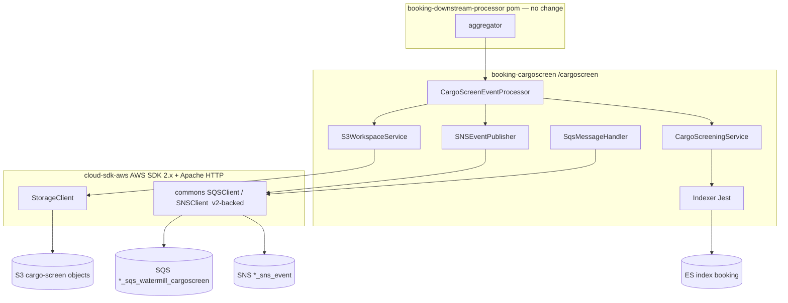
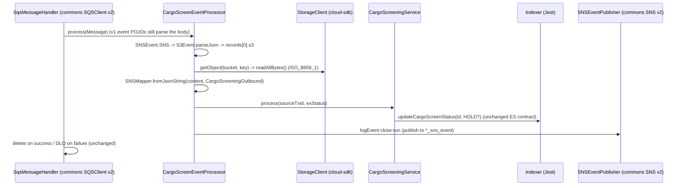

# Booking Downstream Processor — AWS SDK 2.x (cloud-sdk) Upgrade Design (Parent)

**Module:** `booking-downstream-processor`
**Date:** 2026-06-30
**Status:** Target design (AWS 1.x → AWS 2.x via cloud-sdk) — **NOT STARTED**
**Companion:** `2026-06-30-booking-downstream-processor-current-state-DESIGN-claude.md`
**Reference upgrades:** `booking` (S3 + DynamoDB + messaging, complete — `commons 1.0.26-SNAPSHOT`, `cloud-sdk-api`/`cloud-sdk-aws`), `visibility` (S3 + DynamoDB + SNS/SQS)
**Scope note:** the parent is a Maven **aggregator** with no code; this doc gives the parent/system-level plan and the per-submodule (`booking-cargoscreen`) spec.

---

## 1. Change Overview

The parent `booking-downstream-processor` is a `packaging: pom` aggregator with **no source, no config, no
deployment artifacts**, so it has **no functional change of its own**. The AWS 2.x / cloud-sdk migration is entirely
in the child **`booking-cargoscreen`**. Unlike the peer modules (`booking`, `bill-of-lading`, `visibility`), this
module has **no DynamoDB** to migrate — the surface is **S3 (direct v1)** plus the **messaging-client backing**
(SQS/SNS, currently AWS SDK v1 inside commons), plus a free removal of the dead `dynamo-client` dependency.

| AWS service | Current (v1) | Target (cloud-sdk / v2) |
|-------------|--------------|--------------------------|
| **S3** | `AmazonS3` / `AmazonS3ClientBuilder` (direct), `GetObjectRequest`, `S3Object`, `IOUtils` | `com.inttra.mercury.cloudsdk.storage.api.StorageClient` + `StorageClientFactory.createDefaultS3Client()` (or `createS3Client(AwsStorageConfig…)` for tuning) |
| **SQS** | commons `messaging.sqs.SQSClient` wrapping `com.amazonaws.services.sqs.AmazonSQS` (v1) | same commons API, now backed by cloud-sdk / AWS SDK 2.x SQS (delivered by bumping `commons`) |
| **SNS** | commons `messaging.sns.SNSClient`/`SNSEventPublisher` wrapping `com.amazonaws.services.sns.AmazonSNS` (v1) | same commons API, now backed by cloud-sdk / AWS SDK 2.x SNS (delivered by bumping `commons`) |
| **Lambda event POJOs** | `aws-lambda-java-events 2.2.9` (`SNSEvent`, `S3Event`, `S3EventNotification`) | **stay on v1 event POJOs** — these are wire-JSON deserialization classes, not SDK clients (see §4.3) |

**Out of scope:**
- **DynamoDB** — not used; the `dynamo-client` dependency is removed, not migrated.
- **Elasticsearch / Jest** — the ES write path uses commons `JestModule` + `io.searchbox` (Jest), not an AWS SDK; the
  declared-but-unused `elasticsearch-rest-high-level-client` is a separate (non-AWS-SDK) modernization track.
- **Parameter Store** — `${awsps:}` still resolved by commons.
- **External REST `serviceDefinitions`** — unused on the runtime path; untouched.

**Backward-compatibility is mandatory.** The following must stay wire-identical so the worker keeps consuming and
projecting correctly:

- **Inbound message shape:** SQS body = SNS notification envelope (`SNSEvent.SNS`) whose `message` is an
  `S3EventNotification` JSON; `records[0].s3.bucket.name` / `.object.key` must keep parsing. Governed by `SNSMapper`'s
  `ObjectMapper` (JodaModule + JavaTimeModule + `LongDateDeserializer` + `ACCEPT_CASE_INSENSITIVE_PROPERTIES`).
- **S3 object read charset:** `ISO_8859_1` (`S3WorkspaceService.getEncodedContent`).
- **`CargoScreeningOutbound` JSON:** `{ transactionHeader: { sourceTxId, exStatus } }`, all
  `@JsonIgnoreProperties(ignoreUnknown=true)` — must keep deserializing unchanged.
- **ES update contract:** index `booking`, type `Booking`, id = `sourceTxId`, body
  `{ "doc": {"complianceRisk": <bool>}, "doc_as_upsert": true }`, `retry_on_conflict=3`.
- **Queue/topic names** per env (incl. **CVT = `inttra2_cv_*`**, INT account `081020446316`) — unchanged.
- **Decoupling rule:** the S3-object *content* (a `CargoScreeningOutbound` JSON produced upstream) is independent of
  any SDK wire format — the v2 S3 read must return the byte-identical body; do not re-encode or re-charset it.

---

## 2. Maven Dependency Changes

### Parent (`booking-downstream-processor/pom.xml`)
No change required, beyond optionally inheriting the cloud-sdk-bearing `mercury.commons.version` from the root parent.
The two parent properties (`commons-io.version`, `es.version`) stay.

### Child (`booking-cargoscreen/pom.xml`)

```diff
  <properties>
-   <mercury.commons.version>1.R.01.023</mercury.commons.version>
-   <mercury.dynamodbclient.version>1.R.01.023</mercury.dynamodbclient.version>
+   <mercury.commons.version>1.0.26-SNAPSHOT</mercury.commons.version>
    <maven.compiler.release>17</maven.compiler.release>
    <!-- … unchanged build/test versions … -->
  </properties>

  <dependencies>
    <dependency>
      <groupId>com.inttra.mercury</groupId>
      <artifactId>commons</artifactId>
      <version>${mercury.commons.version}</version>
      <exclusions>
        <exclusion>
          <groupId>com.fasterxml.jackson.dataformat</groupId>
          <artifactId>jackson-dataformat-yaml</artifactId>
        </exclusion>
      </exclusions>
    </dependency>

-   <!-- Unused: no DynamoDB usage anywhere in src/main. Drops a whole AWS SDK v1 transitive tree. -->
-   <dependency>
-     <groupId>com.inttra.mercury</groupId>
-     <artifactId>dynamo-client</artifactId>
-     <version>${mercury.dynamodbclient.version}</version>
-   </dependency>

+   <dependency>
+     <groupId>com.inttra.mercury</groupId>
+     <artifactId>cloud-sdk-api</artifactId>
+     <version>${mercury.commons.version}</version>
+   </dependency>
+   <dependency>
+     <groupId>com.inttra.mercury</groupId>
+     <artifactId>cloud-sdk-aws</artifactId>
+     <version>${mercury.commons.version}</version>
+   </dependency>

    <!-- KEEP: v1 Lambda event POJOs are wire-JSON deserialization classes, not SDK clients -->
    <dependency>
      <groupId>com.amazonaws</groupId>
      <artifactId>aws-lambda-java-events</artifactId>
      <version>2.2.9</version>
    </dependency>
    <!-- … guava-retrying, elasticsearch-rest-high-level-client (unused), snakeyaml,
         jackson-dataformat-yaml, lombok, junit5/mockito/jmockit/assertj unchanged … -->
  </dependencies>
```

- **Removed:** `dynamo-client` (+ the `mercury.dynamodbclient.version` property). This is the single biggest cleanup —
  it pulls AWS SDK v1 DynamoDB for code that does not exist.
- **After this:** the only remaining `com.amazonaws` artifact is `aws-lambda-java-events` (deliberately retained). The
  S3/SQS/SNS v1 transitive tree that came through the old `commons` line is replaced by the cloud-sdk-bearing line.
- cloud-sdk uses **Apache HTTP** (no Netty), matching the booking/visibility rebase.

---

## 3. Configuration Changes (`booking-cargoscreen/conf/<env>/config.yaml`)

**Minimal.** There is **no `dynamoDbConfig` block** to migrate (none exists today). The S3 client today is built in
code (`bindS3`) with no YAML knobs, so S3 needs no config keys either unless the configurable `createS3Client` path is
chosen to preserve tuning (see §4.1 Gap).

If the configurable S3 path is adopted to preserve the v1 tuning, add an `awsStorageConfig` block:

```diff
+ # Only if preserving the v1 S3 client tuning via StorageClientFactory.createS3Client(...)
+ awsStorageConfig:
+   region: us-east-1
+   maxErrorRetry: 3
+   connectionTimeoutMillis: 1000
+   socketTimeoutMillis: 5000
+   maxConnections: 50
```

`cargoScreenProcessorConfig` (SQS url/dlqUrl, thread pool), `eventLoggingConfig` (SNS topic ARN),
`esConfiguration`, and `serviceDefinitions`/`securityResources` are **all unchanged**. The per-env queue/topic/ES
names — including **CVT `inttra2_cv_*`** and the INT account `081020446316` — carry through verbatim.

**Config class change:** `BookingCargoScreenApplicationConfig` has **no** dynamo field, so unlike `BookingConfig`/
`BillOfLadingConfig` there is **no `DynamoDbConfig → BaseDynamoDbConfig` field-type swap**. If the configurable S3 path
is taken, add an `AwsStorageConfig` field; otherwise the config class is untouched.

---

## 4. Per-Service Spec

### 4.1 S3 — `S3WorkspaceService` + `BookingCargoScreenApplicationInjector.bindS3`

**Before (v1):**
```java
// BookingCargoScreenApplicationInjector
@Provides
protected AmazonS3 bindS3() {
    RetryPolicy retryPolicy = new RetryPolicy(new AwsRetryCondition(),
        new PredefinedBackoffStrategies.FullJitterBackoffStrategy(500, 5000), 3, false);
    ClientConfiguration cfg = new ClientConfiguration()
        .withMaxErrorRetry(3).withRetryPolicy(retryPolicy)
        .withConnectionTimeout(1000).withSocketTimeout(5000).withMaxConnections(50);
    return AmazonS3ClientBuilder.standard().withClientConfiguration(cfg).build();
}

// S3WorkspaceService
public PutObjectResult putObject(String bucket, String key, String content) {
    return s3Client.putObject(bucket, key, content);
}
public String getContent(String bucket, String key, Charset charset) throws IOException {
    S3Object o = s3Client.getObject(new GetObjectRequest(bucket, key));
    return new String(IOUtils.toByteArray(o.getObjectContent()), charset);   // ISO_8859_1
}
```

**After (cloud-sdk):** (mirrors booking `S3WorkspaceService`)
```java
// BookingCargoScreenApplicationInjector  (replace @Provides AmazonS3 with @Provides StorageClient)
@Provides @Singleton
protected StorageClient bindS3() {
    return StorageClientFactory.createDefaultS3Client();
}

// S3WorkspaceService  (inject StorageClient instead of AmazonS3)
public void putObject(String bucket, String key, String content) {
    storageClient.putObject(bucket, key, content);                           // String overload
}
public String getContent(String bucket, String key, Charset charset) throws IOException {
    StorageObject o = storageClient.getObject(bucket, key);
    return new String(o.getContent().readAllBytes(), charset);               // keep ISO_8859_1
}
```

- The bucket/key still come **from the inbound S3 event notification** (`records[0].s3`), not from config — no bucket
  name is bound. Keep that exactly.
- Drop the `com.amazonaws.util.IOUtils` import; read `StorageObject.getContent()` (InputStream) with `readAllBytes()`.
- Preserve the **`ISO_8859_1`** charset and the `PutObjectResult`-vs-void return shape (callers only check for absence
  of exception).

> **Gap call-out.** The v1 client encoded real tuning: `maxErrorRetry(3)`, a `FullJitterBackoffStrategy(500,5000)`
> retry policy, `connectionTimeout(1000)`, `socketTimeout(5000)`, `maxConnections(50)`.
> `StorageClientFactory.createDefaultS3Client()` does **not** expose these. To preserve them, use
> `StorageClientFactory.createS3Client(AwsStorageConfig.builder()…build())` if that path exposes the knobs, or raise a
> cloud-sdk-api enhancement (same gap flagged in visibility/bill-of-lading). If defaults are acceptable, document the
> behaviour change explicitly in the PR.

### 4.2 SQS / SNS — via commons `SQSModule`/`SNSModule`

These are **not** instantiated directly in `booking-cargoscreen`; they come from the commons artifact. The app wires
them as module generators (`new SQSModule(e)`, `new SNSModule(e)`) and injects `messaging.sqs.SQSClient` (into
`CargoScreenEventProcessor`/`SqsMessageHandler`) and `messaging.sns.SNSClient` (into `SNSEventPublisher`). Today those
commons clients wrap AWS SDK **v1** (`AmazonSQS`/`AmazonSNS` — confirmed by `new SNSClient(AmazonSNSClientBuilder
.defaultClient())` in `CargoScreenApplicationInjectorTest`).

**The migration here is "bump `commons`, then verify":**
```diff
  // BookingCargoScreenApplication.main — UNCHANGED wiring
  .moduleGenerator((c, e) -> new SQSModule(e))
  .moduleGenerator((c, e) -> new SNSModule(e))
```

- Verify against the cloud-sdk commons line that `SQSClient.receiveMessage(url, max, wait)`,
  `SQSClient.deleteMessage(url, receiptHandle)`, `SQSClient.sendMessage(url, body)` (used by `SqsMessageHandler`) and
  `SNSEventPublisher.publishEvent(...)` keep their **signatures and semantics**.
- `SqsMessageHandler` consumes `com.amazonaws.services.sqs.model.Message`. If the cloud-sdk-backed `SQSClient` returns
  a v2 / commons message type instead, `SqsMessageHandler` and `CargoScreenEventProcessor` (which take
  `com.amazonaws.services.sqs.model.Message`) must change their type signatures. **This is the main behavioural risk
  of the messaging bump** — verify the commons `SQSClient` return type on the new line and adjust `Processor<Message>`
  / `process(Message)` accordingly.
- `com.amazonaws.AbortedException` handling in `SqsMessageHandler` may need a v2 equivalent.

### 4.3 Lambda event POJOs — keep on v1

`CargoScreenEventProcessor.getCargoScreenEventFromSqsMessage` parses the SNS-wrapped S3 event with:
```java
SNSEvent.SNS sns = SNSMapper.fromJsonString(body, SNSEvent.SNS.class);
S3EventNotification n = S3Event.parseJson(sns.getMessage());
S3EventNotification.S3Entity s3 = n.getRecords().get(0).getS3();
```
`SNSEvent`, `S3Event`, and `S3EventNotification` are **wire-JSON POJOs** from `aws-lambda-java-events`, not SDK
clients. Per the brief's Lambda guidance, **leave them on v1** even after the client calls move to v2 — they make no
AWS calls, and the JSON shape they parse is produced outside this module. Call this out so reviewers don't try to
"finish" the v2 migration by ripping them out.

---

## 5. Guice Wiring Changes

```diff
  // BookingCargoScreenApplicationInjector.configure() — unchanged except the S3 provider
- @Provides protected AmazonS3 bindS3() {
-     RetryPolicy retryPolicy = new RetryPolicy(new AwsRetryCondition(),
-         new PredefinedBackoffStrategies.FullJitterBackoffStrategy(500, 5000), 3, false);
-     ClientConfiguration cfg = new ClientConfiguration().withMaxErrorRetry(3)
-         .withRetryPolicy(retryPolicy).withConnectionTimeout(1000)
-         .withSocketTimeout(5000).withMaxConnections(50);
-     return AmazonS3ClientBuilder.standard().withClientConfiguration(cfg).build();
- }
+ @Provides @Singleton protected StorageClient bindS3() {
+     return StorageClientFactory.createDefaultS3Client();   // or createS3Client(AwsStorageConfig…)
+ }

  // createEventLoggingPublisher(SNSClient, EventLoggingConfig) — unchanged signature;
  // SNSClient now resolves to the cloud-sdk-backed commons impl.
  // JestModule install, Multibinder<Processor> -> CargoScreenEventProcessor — unchanged.
```
- Remove the unused v1 imports (`ClientConfiguration`, `RetryPolicy`, `PredefinedBackoffStrategies`, `AmazonS3`,
  `AmazonS3ClientBuilder`).
- `SQSModule`/`SNSModule` generators in `BookingCargoScreenApplication.main` are unchanged.

---

## 6. Target Component Diagram



## 7. Target Data Flow — ingestion (after)



---

## 8. Key Classes Changed

| Class | Change |
|-------|--------|
| `booking-downstream-processor/pom.xml` | none (optionally inherit cloud-sdk `commons` version). |
| `booking-cargoscreen/pom.xml` | bump `commons` → `1.0.26-SNAPSHOT`; **remove `dynamo-client`** + `mercury.dynamodbclient.version`; add `cloud-sdk-api` + `cloud-sdk-aws`; keep `aws-lambda-java-events`. |
| `BookingCargoScreenApplicationInjector` | `@Provides AmazonS3 bindS3()` → `@Provides @Singleton StorageClient bindS3()`; drop v1 imports/tuning (or move tuning to `AwsStorageConfig`). |
| `S3WorkspaceService` | inject `StorageClient`; `getObject(GetObjectRequest)`/`S3Object`/`IOUtils` → `StorageClient.getObject` + `StorageObject.getContent().readAllBytes()`; keep `ISO_8859_1`; `putObject` String overload. |
| `CargoScreenEventProcessor` / `SqsMessageHandler` | only if the v2-backed commons `SQSClient` returns a non-`com.amazonaws…model.Message` type: update `Processor<Message>` / `process(Message)` / handler signatures. Otherwise unchanged. |
| `BookingCargoScreenApplication` | unchanged (`SQSModule`/`SNSModule`/Injector generators stay). |
| `BookingCargoScreenApplicationConfig` | unchanged (no dynamo field; add `AwsStorageConfig` only if preserving S3 tuning). |
| `CargoScreenApplicationInjectorTest` | drop the v1 `DynamoDBMapper`/`DynamoDBMapperConfig`/`AmazonSNS`/`AmazonSQS` mocks; mock `StorageClient`. |
| `S3WorkspaceServiceTest` | mock `StorageClient`/`StorageObject` instead of `AmazonS3`/`S3Object`/`S3ObjectInputStream`. |
| `Indexer`, `CargoScreeningService`, `SNSMapper`, model classes | **unchanged** (no AWS SDK; preserve ES contract + JSON shapes). |

---

## 9. Testing Strategy

- **No DynamoDB-Local IT** is needed (no DAO) — a notable simplification vs `booking`/`bill-of-lading`.
- **S3 round-trip** unit/IT for `S3WorkspaceService`: `getEncodedContent` returns byte-identical content with
  `ISO_8859_1`; `putObject` String overload; mock `StorageClient`/`StorageObject`.
- **Message-shape tests** for `CargoScreenEventProcessor.getCargoScreenEventFromSqsMessage`: an SNS-envelope body
  whose `message` is an `S3EventNotification` still parses to `records[0].s3.bucket/object`; `CargoScreeningOutbound`
  deserializes (`sourceTxId`, `exStatus`, unknown-field tolerance). Verify `SNSMapper`'s `ObjectMapper`
  (Joda/JavaTime/`LongDateDeserializer`, case-insensitive) is unchanged.
- **Business-rule tests:** `HOLD` (any case) ⇒ `complianceRisk=true`; missing `transactionHeader`/`sourceTxId` ⇒
  warn-and-skip (no ES write, no exception); ES `409` ⇒ logged, not fatal.
- **SQS handler tests:** delete-on-success, DLQ-on-failure, `DO_NOT_DELETE_KEY`/`DO_NO_SEND_TO_DLQ_KEY` flags,
  `BoundedThreadPool` back-pressure — re-run against the v2-backed `SQSClient` mock (update message type if it changes).
- Reuse booking's S3/messaging test patterns. Certify **full local JaCoCo coverage** on changed code:
  ```
  mvn -f booking-downstream-processor/booking-cargoscreen/pom.xml clean verify
  ```
  (or `mvn -f booking-downstream-processor/pom.xml clean verify` to build the aggregator).

---

## 10. Risks & Call-outs

- **No DynamoDB surface** — the heaviest part of the peer migrations is absent; scope is S3 + the messaging-client
  backing. Removing the dead `dynamo-client` is a free, high-value cleanup that eliminates an entire AWS SDK v1 tree.
- **SQS message type is the real risk** — `SqsMessageHandler`/`CargoScreenEventProcessor` are typed on v1
  `com.amazonaws.services.sqs.model.Message`. If the cloud-sdk-backed commons `SQSClient` returns a different message
  type, the `Processor<Message>` generic, `process(Message)`, and `SqsMessageHandler` change. Verify the commons
  `SQSClient` API on `1.0.26-SNAPSHOT` **before** committing.
- **S3 client tuning gap** — v1 set `maxErrorRetry(3)` + `FullJitterBackoffStrategy(500,5000)` +
  `connectionTimeout(1000)` + `socketTimeout(5000)` + `maxConnections(50)`. `createDefaultS3Client()` likely drops
  these; use `createS3Client(AwsStorageConfig…)` or raise a cloud-sdk enhancement (and document any behaviour change).
- **Inbound JSON wire-compat** — the SNS-envelope → S3-event → `CargoScreeningOutbound` chain is driven by JSON
  produced upstream; do not alter `SNSMapper`'s `ObjectMapper` modules/settings or the `@JsonIgnoreProperties` models.
- **S3 read charset** — keep `ISO_8859_1` exactly; a charset change would corrupt the parsed content.
- **Lambda event POJOs stay v1** — `aws-lambda-java-events` is retained on purpose; don't remove it as "leftover v1."
- **ES/Jest is out of scope** — Jest-vs-`elasticsearch-rest-high-level-client` is a separate modernization track,
  independent of the AWS-SDK upgrade.
- **CVT prefix trap** — CVT queues/topics/ES use **`inttra2_cv_*`** (and INT uses account `081020446316`, prefix
  `inttra_int_*`), **not** `inttra2_test`/`inttra2_cvt`. Carry these exact strings through unchanged.
- **Sequencing** — one outgoing commit per the team workflow; every commit message must carry the Jira ticket prefix
  (e.g. `ION-xxxxx …`).
