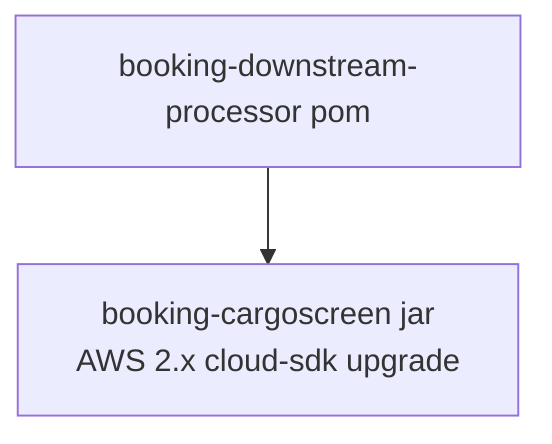

# Booking Downstream Processor — AWS SDK 2.x (cloud-sdk) Upgrade Design (Parent)

**Module:** `booking-downstream-processor`
**Date:** 2026-06-30
**Status:** Target design (aggregator POM) — NOT STARTED
**Companion:** `2026-06-30-booking-downstream-processor-current-state-DESIGN-copilot.md`

---

## 1. Change Overview

The parent is a **Maven aggregator** with no runtime code, so it requires almost no change of its own. The AWS 2.x /
cloud-sdk upgrade is implemented in the child module **`booking-cargoscreen`** (see its `aws2x` design doc).

Parent-level actions:
- Adopt the `mercury.commons.version=1.0.26-SNAPSHOT` property (inherited / aligned with the root parent).
- Keep aggregating `booking-cargoscreen`; no new modules.
- After the child upgrades, ensure the child's `commons` line moves from `1.R.01.023` to the cloud-sdk-bearing
  version and that `cloud-sdk-api`/`cloud-sdk-aws` are present.

## 2. Maven / Configuration / Deployment

No dependency, configuration, or deployment changes at parent level. Property version alignment only.

## 3. AWS Services in Scope

None at parent level. The child migrates **S3** (v1 → `StorageClient`) and **Lambda event POJOs** (v1 → v2), and
standardizes **SQS/SNS** on the cloud-sdk `MessagingClient`/`EventPublisher`. See
`booking-cargoscreen/docs/2026-06-30-booking-downstream-processor-booking-cargoscreen-aws2x-DESIGN-copilot.md`.

## 4. Risks & Call-outs

Parent has no functional risk. Track the child upgrade and reconcile the shared property versions; the ES (Jest)
migration is a separate track from the AWS-SDK upgrade.
