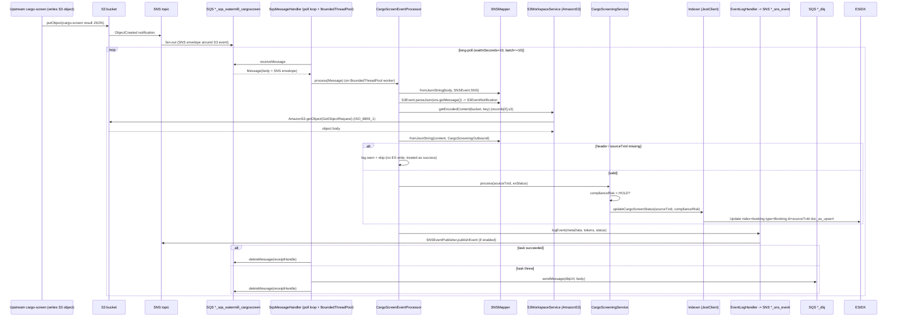
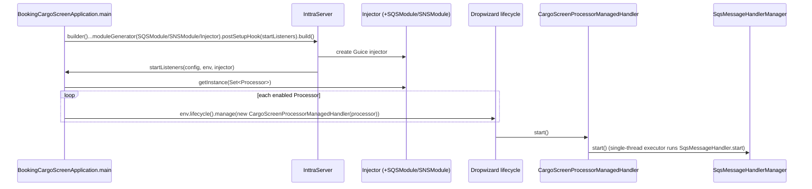

# Booking Downstream Processor — Current-State Design (Parent)

**Module:** `booking-downstream-processor`
**Date:** 2026-06-30
**Status:** Current state — Maven **aggregator** (`packaging: pom`); the one child (`booking-cargoscreen`) runs on AWS SDK **1.x** for S3, SQS, and SNS, plus AWS Lambda **v1 event POJOs**. cloud-sdk migration **NOT STARTED**.
**Artifact:** `com.inttra.mercury:booking-downstream-processor:1.0` (`pom` — no runtime JAR)
**Parent POM:** `com.inttra.mercury:mercury-services:1.0`
**Main class:** none at parent level. Child main class: `com.inttra.mercury.booking.cargoscreen.BookingCargoScreenApplication` (Dropwizard 4 / Jetty 12, shaded JAR `booking-cargoscreen-1.0.jar`).

---

## 1. Business Purpose & Rules

`booking-downstream-processor` is a **Maven aggregator** that groups the downstream booking-processing pipelines that
run *after* a booking and its cargo-screening result have been produced upstream (by the `watermill` publisher chain).
The parent POM **owns no source, no `conf/`, no `build.sh`/`run.sh`, and no runtime artifact** — it exists only to
attach its single child to the reactor build and to carry two shared property versions (`commons-io.version`,
`es.version`). All behaviour lives in the child module.

The single child today is **`booking-cargoscreen`**: a long-running Dropwizard worker that consumes
cargo-screening (compliance / denied-party-screening) result events off an SQS queue and projects the resulting
**compliance-risk** flag onto the matching booking document in Elasticsearch. It is a *consumer/worker*, not a REST
service — it exposes only the Dropwizard admin endpoints; its real input is the SQS queue.

### Pipeline at a glance (the "S3 → SNS → SQS → worker" pattern)

The upstream cargo-screening process writes a result JSON object to S3. The S3 `ObjectCreated` event is delivered to
an SNS topic, which fans out to the `*_sqs_watermill_cargoscreen` SQS queue. `booking-cargoscreen` polls that queue;
each SQS body is an **SNS notification envelope** wrapping an **S3 event notification**. The worker reads the S3
object the notification points at, deserializes it to a `CargoScreeningOutbound`, and updates the booking's
`complianceRisk` flag in the `booking` Elasticsearch index.

### Key business rules (child `booking-cargoscreen`, source-grounded)

| Rule | Detail (source) |
|------|------|
| Compliance-risk evaluation | `CargoScreeningService.evaluateComplianceRisk` ⇒ `complianceRisk = "HOLD".equalsIgnoreCase(exStatus)`. Any status other than `HOLD` (case-insensitive) ⇒ `complianceRisk = false`. |
| Mandatory transaction header | `CargoScreenEventProcessor.process`: if `cargoScreenResponse == null` ⇒ `ProcessingException`. If `transactionHeader == null` **or** `sourceTxId == null` ⇒ message is logged (`warn`) and **skipped** (treated as success, no retry). |
| ES document targeting | `Indexer.updateCargoScreenStatus` updates index `booking`, type `Booking`, document id = `sourceTxId` (the INTTRA reference number). Partial `{ "doc": {"complianceRisk": <bool>}, "doc_as_upsert": true }` with `retry_on_conflict=3`. |
| ES retry | `Indexer` wraps each call in a guava-retrying `Retryer`: 3 attempts, exponential backoff (`100ms` base, unbounded cap), retry on any exception; HTTP `409` (version conflict) is logged at INFO and **not** treated as a hard error. |
| SQS batch limit | `SQSConfig.messagesPerRead` is `@Min(1) @Max(10)` (SQS receive batch ceiling of 10); all envs use `10`, `waitInSeconds: 10` (long-poll). |
| Delete-on-success | `SqsMessageHandler` deletes the message from the main queue after the task completes, unless the message is flagged `DO_NOT_DELETE_KEY`. |
| DLQ-on-failure | On task exception, the body is re-sent to `dlqUrl` (`sqsClient.sendMessage(dlqUrl, body)`) unless flagged `DO_NO_SEND_TO_DLQ_KEY`. |
| Back-pressure | A `BoundedThreadPool` (semaphore-gated, `maximumTasks` permits) bounds in-flight work; the poll loop only fetches a new batch when `getRemainingTasks() > 0`. |
| Event logging toggle | `EventLoggingConfig.enabled` selects `SNSEventPublisher` (publishes a close-run event to `snsEventTopicArn`) vs a no-op `EmptyEventPublisher`. Enabled in every env. |
| Indexing toggle | `ESConfiguration.indexingEnabled` defaults `false` in the POJO, but is governed by config; the worker's only write target is ES, so this is effectively required-on for the pipeline to do work. |

---

## 2. Design & Component Diagram

The parent is structurally trivial — one `<module>` entry. The diagram below shows the parent boundary plus the child
worker's internal layering (Dropwizard app started through the shared `InttraServer<BookingCargoScreenApplicationConfig>`
builder, with `SQSModule`, `SNSModule`, and `BookingCargoScreenApplicationInjector` module generators, and a
`postSetupHook` that starts the SQS listeners via `CargoScreenProcessorManagedHandler`).

```mermaid
flowchart TB
  subgraph Parent[booking-downstream-processor  packaging: pom]
    direction TB
    AGG[aggregator POM<br/>no code / no conf / no scripts]
  end

  subgraph Child[booking-cargoscreen  Dropwizard /cargoscreen]
    direction TB
    APP[BookingCargoScreenApplication<br/>InttraServer + postSetupHook]
    INJ[BookingCargoScreenApplicationInjector<br/>+ SQSModule + SNSModule]
    MH[CargoScreenProcessorManagedHandler<br/>Dropwizard Managed]
    SMH[SqsMessageHandler / SqsMessageHandlerManager]
    BTP[BoundedThreadPool]
    PROC[CargoScreenEventProcessor<br/>implements Processor&lt;Message&gt;]
    SNSM[SNSMapper<br/>Jackson ObjectMapper]
    S3W[S3WorkspaceService]
    CSS[CargoScreeningService]
    IDX[Indexer  JestClient]
    ELH[EventLogHandler]
    EP[EventPublisher<br/>SNSEventPublisher / EmptyEventPublisher]
  end

  subgraph AWS[AWS  us-east-1]
    SQS[(SQS<br/>*_sqs_watermill_cargoscreen + _dlq)]
    SNS[(SNS<br/>*_sns_event)]
    S3B[(S3<br/>cargo-screen result objects)]
    PS[(Parameter Store<br/>awsps secrets)]
  end

  subgraph ES[Elasticsearch  bk-search domain]
    ESIDX[(index "booking" / type "Booking")]
  end

  AGG --> APP
  APP --> INJ --> MH --> SMH --> BTP --> PROC
  PROC --> SNSM
  PROC --> S3W --> S3B
  PROC --> CSS --> IDX --> ESIDX
  PROC --> ELH --> EP --> SNS
  SMH --> SQS
  INJ -. ${awsps:} .-> PS
```

### Key classes & interactions (child)

| Layer | Class | Responsibility |
|-------|-------|----------------|
| Parent | `booking-downstream-processor/pom.xml` | Aggregator only: `packaging=pom`, one `<module>booking-cargoscreen</module>`, shared `commons-io.version=2.15.1` + `es.version=6.8.13`. |
| Bootstrap | `BookingCargoScreenApplication` | Builds `InttraServer`, registers `SQSModule`/`SNSModule`/`BookingCargoScreenApplicationInjector`; `postSetupHook` (`startListeners`) wraps each enabled `Processor` in a `CargoScreenProcessorManagedHandler` and registers it with the Dropwizard lifecycle. |
| Wiring | `BookingCargoScreenApplicationInjector` (Guice `AbstractModule`) | `@Provides AmazonS3 bindS3()` (v1 S3 client with custom `ClientConfiguration`); `@Provides EventPublisher` (SNS vs Empty); installs `JestModule`; `Multibinder<Processor>` → `CargoScreenEventProcessor`. |
| Config | `BookingCargoScreenApplicationConfig extends ApplicationConfiguration` | `cargoScreenProcessorConfig`, `esConfiguration`, `eventLoggingConfig`. **No `dynamoDbConfig`.** |
| Lifecycle | `CargoScreenProcessorManagedHandler`, `SqsMessageHandlerManager` (`io.dropwizard.lifecycle.Managed`) | Start/stop the SQS poll loop on a single-thread executor. |
| Polling | `SqsMessageHandler` | `sqsClient.receiveMessage(url, messagesPerRead, waitInSeconds)`, submit each `Message` to `BoundedThreadPool`; delete on success, DLQ on failure (per-message flags). |
| Threading | `BoundedThreadPool extends ThreadPoolExecutor` | Semaphore-bounded in-flight task count (`maximumTasks`); 25s graceful shutdown; per-task timing metrics. |
| Processor | `CargoScreenEventProcessor implements Processor<Message>` | The core flow: SNS envelope → S3 event → S3 GET → `CargoScreeningOutbound` → `CargoScreeningService.process` → event log. |
| Mapper | `SNSMapper` | Static Jackson `ObjectMapper` (`fromJsonString`); registers `JodaModule`, `JavaTimeModule`, a custom `LongDateDeserializer`, `ACCEPT_CASE_INSENSITIVE_PROPERTIES`. |
| S3 | `S3WorkspaceService` | v1 `AmazonS3.putObject` / `getObject`; `getEncodedContent` reads with `ISO_8859_1` via `com.amazonaws.util.IOUtils`. |
| Domain | `CargoScreeningService` | `complianceRisk = HOLD?`; delegates to `Indexer`. |
| ES | `Indexer` | **Jest** `JestClient.execute(Update)` (partial upsert) with guava-retrying. |
| Logging | `EventLogHandler`, `EmptyEventPublisher` | Build/emit a commons `MetaData` close-run event through `EventPublisher`; `EmptyEventPublisher` is the disabled no-op. |
| Model | `CargoScreeningOutbound`, `OutboundTransactionHeader`, `AuditDetails`, `Upsert` | Inbound SQS/S3 JSON shape; all `@JsonIgnoreProperties(ignoreUnknown=true)`. |

---

## 3. Data Flow

### 3.1 Cargo-screen result ingestion (the only runtime path)



### 3.2 Startup / lifecycle



---

## 4. Data Stores & Integrations

### Parent level
**None.** The aggregator POM has no data stores, no buckets, no queues, no config.

### Child `booking-cargoscreen`

#### SQS (inbound — AWS SDK v1 via commons `SQSClient`)
Long-poll consume + delete + DLQ re-send. **Account differs per env** (INT is in account `081020446316`; QA/CVT/PROD in
`642960533737`).

| Env | Inbound queue (`cargoScreenProcessorConfig.inboundSqsConfig.url`) | DLQ (`dlqUrl`) |
|-----|------------------------------------------------------------------|----------------|
| INT | `…/081020446316/inttra_int_sqs_watermill_cargoscreen` | `…inttra_int_sqs_watermill_cargoscreen_dlq` |
| QA | `…/642960533737/inttra2_qa_sqs_watermill_cargoscreen` | `…inttra2_qa_sqs_watermill_cargoscreen_dlq` |
| **CVT** | `…/642960533737/inttra2_cv_sqs_watermill_cargoscreen` | `…inttra2_cv_sqs_watermill_cargoscreen_dlq` |
| PROD | `…/642960533737/inttra2_pr_sqs_watermill_cargoscreen` | `…inttra2_pr_sqs_watermill_cargoscreen_dlq` |

> Note the env tokens: INT uses prefix `inttra_int_`, QA `inttra2_qa_`, **CVT `inttra2_cv_`** (not `inttra2_test`/`inttra2_cvt`),
> PROD `inttra2_pr_`. All queues are `us-east-1`.

#### SNS (outbound event log — AWS SDK v1 via commons `SNSClient`/`SNSEventPublisher`)

| Env | `eventLoggingConfig.snsEventTopicArn` | enabled |
|-----|----------------------------------------|---------|
| INT | `arn:aws:sns:us-east-1:081020446316:inttra_int_sns_event` | `true` |
| QA | `arn:aws:sns:us-east-1:642960533737:inttra2_qa_sns_event` | `true` |
| **CVT** | `arn:aws:sns:us-east-1:642960533737:inttra2_cv_sns_event` | `true` |
| PROD | `arn:aws:sns:us-east-1:642960533737:inttra2_pr_sns_event` | `true` |

#### S3 (read of the cargo-screen result object — AWS SDK v1 direct)
**No bucket name is configured.** The bucket and key come *from the inbound S3 event notification itself*
(`records[0].getS3().getBucket().getName()` / `.getObject().getKey()`). `S3WorkspaceService` then does a v1
`getObject` and reads the body as `ISO_8859_1`. The `putObject` method exists but is **not exercised on the runtime
path** (it is used by `EventLogHandler` for diagnostic/event payload storage). There is therefore no per-env bucket
table to maintain in this module's config.

#### Elasticsearch (Jest — the write target)

| Env | `esConfiguration.endpointUrl` | region |
|-----|-------------------------------|--------|
| INT | `search-inttra-int-es-bk-search-…us-east-1.es.amazonaws.com` | `us-east-1` |
| QA | `search-inttra2-qa-es-bk-search-…us-east-1.es.amazonaws.com` | `us-east-1` |
| **CVT** | `search-inttra2-cv-es-bk-search-…us-east-1.es.amazonaws.com` | `us-east-1` |
| PROD | `search-inttra2-pr-es-bk-search-…us-east-1.es.amazonaws.com` | `us-east-1` |

- Shared with the **bk-search** booking-search ES domains. `numberOfShards=3`, `numberOfReplicas=1` (POJO defaults; not
  overridden in the env YAMLs). Index `booking`, type `Booking`, doc id = INTTRA reference; partial `doc_as_upsert`
  update of a single field `complianceRisk`.
- Client is **Jest** (`io.searchbox.client.JestClient`, wired by the commons `JestModule`), **not** the declared
  `elasticsearch-rest-high-level-client` — see §5.

#### External REST services (`serviceDefinitions` in config.yaml)
`auth` (OAuth, `clientId` + `${awsps:…/authclientsecret}`), `geography`, `reference-data-containertype`,
`network-participants`, `geography-partnerlocation`, `geography-alias`, `subscription`, `integrationProfile`,
`integrationProfileFormat`. These are configured (per-env `api(-alpha|-beta|-test).inttra.com`) and the commons
`securityResources` are present, but **no code on the runtime cargo-screen path calls them** — they are inherited
service-definition boilerplate from the platform template. The only outbound calls actually made are SQS, SNS, S3, and ES.

#### DynamoDB
**None.** `dynamo-client` (`1.R.01.023`) is declared in the child `pom.xml`, but a grep of `src/main` finds **zero**
`DynamoDBMapper`/`@DynamoDB*`/dynamo usages — it is a dead/unused dependency (only mocked in one injector test).

---

## 5. Maven Dependencies

### Parent (`booking-downstream-processor/pom.xml`)
Aggregator only. **No `<dependencies>`.** Declares `packaging=pom`, one module, and two shared properties consumed by
the child:

| Property | Value | Purpose |
|----------|-------|---------|
| `commons-io.version` | `2.15.1` | (inherited by child) |
| `es.version` | `6.8.13` | ES REST high-level client version used by the child |

### Child (`booking-cargoscreen/pom.xml`) — key artifacts

| Artifact | Version | Notes |
|----------|---------|-------|
| `com.inttra.mercury:commons` | `1.R.01.023` (`mercury.commons.version`) | `InttraServer`, `SQSModule`/`SNSModule`, `messaging.sqs.SQSClient`/`messaging.sns.SNSClient`, `SNSEventPublisher`, `EventLogger`, `JestModule`, `${awsps:}`. **Pulls AWS SDK v1 (S3/SQS/SNS) transitively.** Excludes `jackson-dataformat-yaml` (re-declared explicitly at `2.17.2`). |
| `com.inttra.mercury:dynamo-client` | `1.R.01.023` (`mercury.dynamodbclient.version`) | **Declared but unused in main code** (pulls AWS SDK v1 DynamoDB transitively). |
| `com.amazonaws:aws-lambda-java-events` | `2.2.9` | **v1 Lambda event POJOs** (`S3Event`, `SNSEvent`, `S3EventNotification`) used to parse the SQS body. |
| `org.elasticsearch.client:elasticsearch-rest-high-level-client` | `6.8.13` (`es.version`) | Declared, but the runtime ES path uses **Jest** (via commons `JestModule`), not RHLC. (Comment in pom flags RHLC as deprecated.) |
| `com.github.rholder:guava-retrying` | `2.0.0` | `Indexer` retry (3 attempts, exponential backoff). |
| `org.yaml:snakeyaml` | `2.2` / `com.fasterxml.jackson.dataformat:jackson-dataformat-yaml` | `2.17.2` — explicit re-declare after the commons exclusion. |
| `org.projectlombok:lombok` | `1.18.30` (`provided`) | `@Data`, `@Slf4j`. |
| Tests | `junit-jupiter 5.11.3`, `mockito-core 5.12.0`, `mockito-junit-jupiter 2.17.0`, `jmockit 1.49`, `assertj-core 3.26.3` | Unit tests (JUnit 5). |
| Build | `maven-shade-plugin:3.5.1`, `maven-compiler-plugin:3.13.0` (release **17**), `maven-surefire-plugin:3.2.5` | Fat JAR `booking-cargoscreen-1.0`, `ManifestResourceTransformer` main class `BookingCargoScreenApplication`, `ServicesResourceTransformer`, `dependency-reduced-pom`. Surefire `-Dcontivo.runtime.classpath=maps/lib`. |

> **AWS SDK is never declared directly except `aws-lambda-java-events`.** S3/SQS/SNS v1 arrive transitively through
> `commons`; DynamoDB v1 arrives transitively through the (unused) `dynamo-client`.

---

## 6. Configuration & Deployment

### Parent
No `conf/`, no `build.sh`, no `run.sh`, no Dockerfile. Nothing to deploy.

### Child `conf/{int,qa,cvt,prod}/config.yaml`
- `server.rootPath: /cargoscreen`, `applicationConnectors` 8080, `adminConnectors` 8081, `type: default`.
- `cargoScreenProcessorConfig` — `enabled: true`; `threadPoolConfig.threads: 8`, `maximumTasks: 10`;
  `inboundSqsConfig` (`messagesPerRead: 10`, `waitInSeconds: 10`, `url`, `dlqUrl` — see §4).
- `eventLoggingConfig` — `snsEventTopicArn`, `enabled: true` (see §4).
- `esConfiguration` — `endpointUrl`, `region: us-east-1`, `service: es` (see §4).
- `jerseyClient` — 32/128 threads, `timeout: 2s`, `retries: 2`, gzip on.
- `serviceDefinitions` + `securityResources` — per-env `api(-alpha|-beta|-test).inttra.com`; `auth.clientId 1000-19468`,
  `clientSecret: ${awsps:/inttra{2}/<env>/visibility/mercuryservices/authclientsecret}`.
- **Secrets** resolved by commons via AWS Parameter Store (`${awsps:…}`).

### Deployment (child)
- `build.sh` → `mvn … package sonar:sonar -P mercury-commons,sonar -pl booking-downstream-processor/booking-cargoscreen
  --also-make`; renames the shaded JAR to `${RELEASE_NAME}.jar`, copies each `conf/<env>/config.yaml` to
  `config.yaml_<env>_conf`, copies `suppressions.xml`, generates the Dockerfile (`FROM ${ECR_REPO}:$DEPLOY_IMG`,
  `ADD app /app/`).
- `run.sh` → renames `config.yaml_${ENV}_conf` → `config.yaml`, then
  `java -Xms64m -Xmx${JVM_Xmx} -jar ${RELEASE_NAME}.jar server ./config.yaml`.
- **No DynamoDB table bootstrap** (no `DynamoDBCommand`/`AbstractDynamoCommand` — the module has no tables).
- **Credentials** — default AWS credential chain / ECS task IAM role; the v1 `AmazonS3` client is built with a custom
  `ClientConfiguration` (see §7); the commons SQS/SNS clients use the same chain.

---

## 7. AWS Services & SDK 1.x Usage (CALL-OUT)

> **The parent module uses no AWS services.** All AWS usage is in the child `booking-cargoscreen`, and it is
> **AWS SDK v1 (`com.amazonaws`) across the board** — a repo-wide grep of `booking-cargoscreen` finds **zero**
> `software.amazon.awssdk` and **zero** `cloudsdk`/`cloud-sdk` references. This is the bridge to the aws2x doc.

| AWS service | SDK | Where (class) | Concrete v1 classes |
|-------------|-----|---------------|---------------------|
| **S3** | v1 (direct) | `BookingCargoScreenApplicationInjector.bindS3`, `S3WorkspaceService` | `AmazonS3`, `AmazonS3ClientBuilder`, `ClientConfiguration`, `RetryPolicy`, `PredefinedBackoffStrategies.FullJitterBackoffStrategy`, `GetObjectRequest`, `PutObjectResult`, `S3Object`, `com.amazonaws.util.IOUtils`, `AmazonServiceException`, `SdkClientException`. |
| **SQS** | v1 (via commons `SQSModule`/`SQSClient`) | `SqsMessageHandler`, `CargoScreenEventProcessor` | commons `com.inttra.mercury.messaging.sqs.SQSClient` (wraps `com.amazonaws.services.sqs.AmazonSQS`); message type `com.amazonaws.services.sqs.model.Message`; `com.amazonaws.AbortedException`. |
| **SNS** | v1 (via commons `SNSModule`/`SNSClient`/`SNSEventPublisher`) | `BookingCargoScreenApplicationInjector.createEventLoggingPublisher`, `EventLogHandler` | commons `com.inttra.mercury.messaging.sns.SNSClient` (wraps `com.amazonaws.services.sns.AmazonSNS`); `SNSEventPublisher`, `EventPublisher`. |
| **Lambda event POJOs** | v1 (`aws-lambda-java-events 2.2.9`) | `CargoScreenEventProcessor.getCargoScreenEventFromSqsMessage` | `com.amazonaws.services.lambda.runtime.events.SNSEvent`, `…events.S3Event`, `com.amazonaws.services.s3.event.S3EventNotification`. (Used purely as deserialization POJOs — this is **not** a Lambda; it is a Dropwizard worker.) |
| **Parameter Store** | resolved by commons (`${awsps:…}`) | config only | — (no direct SSM client). |
| **DynamoDB** | **none in code** | `dynamo-client` on classpath only | — (unused transitive dependency). |
| **Elasticsearch** | n/a (not AWS SDK) | `Indexer` | `io.searchbox.client.JestClient`, `io.searchbox.core.Update` (Jest, via commons `JestModule`). |

**S3 client build** (`BookingCargoScreenApplicationInjector.bindS3`) — note this is **richer** than bill-of-lading's
`maxErrorRetry(5)` one-liner:
`AmazonS3ClientBuilder.standard().withClientConfiguration(new ClientConfiguration().withMaxErrorRetry(3)
.withRetryPolicy(new RetryPolicy(new AwsRetryCondition(), new FullJitterBackoffStrategy(500,5000), 3, false))
.withConnectionTimeout(1000).withSocketTimeout(5000).withMaxConnections(50)).build()`.

---

## 8. AWS 2.x / cloud-sdk Upgrade Plan (High Level)

Goal: replace direct/transitive AWS SDK v1 (`com.amazonaws`) with the in-house **cloud-sdk** (`cloud-sdk-api` +
`cloud-sdk-aws`, AWS SDK 2.x + Apache HTTP), mirroring the completed **booking** migration (`commons 1.0.26-SNAPSHOT`,
`cloud-sdk-api`/`cloud-sdk-aws`, `dynamo-integration-test`). **The parent POM itself needs no functional change** —
the work lives entirely in the child.

| Step | Action | Reference |
|------|--------|-----------|
| 1 | **Parent**: optionally align the inherited `mercury.commons.version` to the cloud-sdk line; no other change. | root `mercury-services` pom |
| 2 | **Child pom**: bump `commons` → `1.0.26-SNAPSHOT`; add `cloud-sdk-api` + `cloud-sdk-aws`; **drop the unused `dynamo-client`** (it adds AWS SDK v1 DynamoDB for nothing); keep `aws-lambda-java-events` (see Risks). | `booking/pom.xml` |
| 3 | **S3** — replace the `AmazonS3` binding + `S3WorkspaceService` body with `StorageClient` + `StorageClientFactory`. | `booking` `S3WorkspaceService` |
| 4 | **SQS/SNS** — moving to a cloud-sdk-backed commons changes the messaging clients under the hood; verify `SQSModule`/`SNSModule`/`SNSEventPublisher` resolve to the v2-backed implementations and that `receiveMessage`/`deleteMessage`/`sendMessage`/`publish` signatures still hold. | `booking` / `visibility` messaging |
| 5 | **Lambda event POJOs** — the inbound SQS body is an SNS-wrapped S3 event parsed with v1 `SNSEvent`/`S3Event`. These are wire JSON POJOs; they can remain on `aws-lambda-java-events` (v1) even after client calls move to v2 — confirm and call out. | brief §"Lambda modules" |
| 6 | **Tests** — keep JUnit 5; update `CargoScreenApplicationInjectorTest` (drop the v1 `DynamoDBMapper`/`AmazonSNS`/`AmazonSQS` mocks), `S3WorkspaceServiceTest` (mock `StorageClient` instead of `AmazonS3`). | `booking` S3/messaging tests |

**Risks / call-outs:**
- **No DynamoDB to migrate** — the largest surface in peer modules is absent here; the migration is S3 + the
  messaging-client backing only. Removing the dead `dynamo-client` is a free win that drops a whole v1 transitive tree.
- **S3 client tuning gap** — the v1 client sets `maxErrorRetry(3)`, a `FullJitterBackoffStrategy(500,5000)` retry
  policy, `connectionTimeout(1000)`, `socketTimeout(5000)`, `maxConnections(50)`. `StorageClientFactory
  .createDefaultS3Client()` may not expose these — flag as a cloud-sdk gap (same as visibility/bill-of-lading).
- **Inbound message shape must stay wire-identical** — the SNS-envelope→S3-event→`CargoScreeningOutbound` parse chain
  is driven by JSON shapes produced *outside* this module; any change to `SNSMapper`'s `ObjectMapper`
  (Joda/JavaTime/`LongDateDeserializer`, case-insensitive props) risks breaking deserialization.
- **S3 read charset** — `getEncodedContent` reads as `ISO_8859_1`; preserve that exact charset in the v2 read.
- **Jest/ES is a separate track** — the ES client is Jest (commons `JestModule`), not an AWS SDK; the deprecated
  `elasticsearch-rest-high-level-client` dependency is declared but unused on this path. Out of scope for the AWS-SDK
  upgrade.
