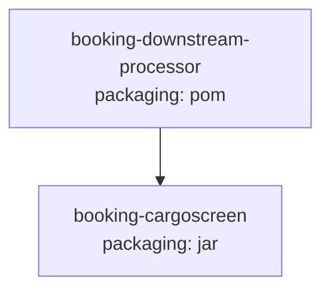

# Booking Downstream Processor — Current-State Design (Parent)

**Module:** `booking-downstream-processor`
**Date:** 2026-06-30
**Status:** Current state (aggregator POM; child uses mixed AWS SDK v2 commons + AWS SDK v1 S3)
**Packaging:** `pom` (Maven aggregator)
**Parent:** `com.inttra.mercury:mercury-services:1.0`

---

## 1. Business Purpose

`booking-downstream-processor` is a **Maven aggregator** that groups the downstream booking-processing pipelines that
run *after* a booking is created. Today it contains a single child module, **`booking-cargoscreen`**, which performs
post-booking cargo screening / compliance evaluation.

It owns no code or runtime artifacts itself; it provides build/version aggregation and shared property versions for
its children.

## 2. Module Layout

| Item | Value |
|------|-------|
| Packaging | `pom` |
| Modules | `booking-cargoscreen` |
| Properties | `commons-io.version=2.15.1`, `es.version=6.8.13` (ES REST high-level client) |
| Code / entry points | None at parent level |

## 3. Maven Dependencies
None at parent level (aggregator only). Property versions are inherited by the child module.

## 4. Configuration & Deployment
No configuration or deployment artifacts at parent level — handled entirely by `booking-cargoscreen`
(see its design doc: `booking-cargoscreen/docs/2026-06-30-booking-downstream-processor-booking-cargoscreen-current-state-DESIGN-copilot.md`).

## 5. AWS Services & SDK 1.x Usage (CALL-OUT)
None directly. The child `booking-cargoscreen` uses:
- **AWS SDK v2** (via `commons`) for **SQS** and **SNS**, and
- **AWS SDK v1** for **S3** plus **AWS Lambda v1 event POJOs** (`S3Event`, `SNSEvent`).

See the child module doc for the upgrade plan.

## 6. AWS 2.x / cloud-sdk Upgrade Plan (High Level)
The parent requires no changes. Track the child module's S3-and-event-POJO migration to the cloud-sdk (AWS SDK v2),
mirroring **booking**. After the child upgrades, bump the parent's child `commons`/`dynamo-client` versions if needed.
