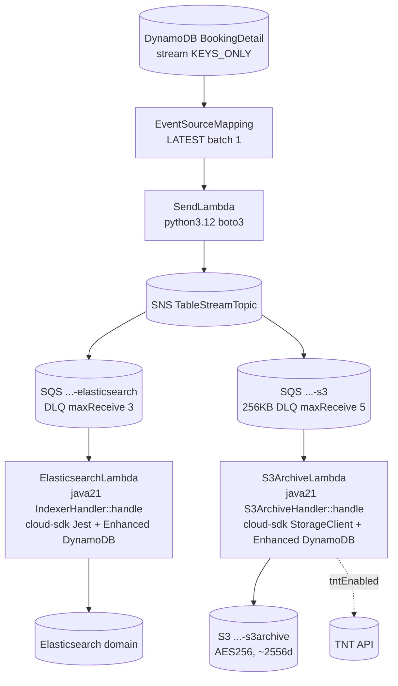
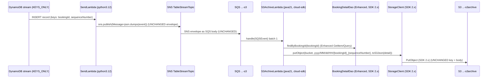

# Booking Update Trigger — AWS SDK 2.x (cloud-sdk) Upgrade Design

**Module:** `booking-update-trigger`
**Date:** 2026-06-30
**Status:** Target design (infrastructure-only) — **NOT STARTED**
**Companion:** `2026-06-30-booking-update-trigger-current-state-DESIGN-claude.md`
**Reference upgrades:** `booking` (the Lambda **handler** cloud-sdk migration is **already complete** — `StorageClient`,
`NotificationService`/`SNSClient`, Enhanced-client `DatabaseRepository`, cloud-sdk `JestModule`); `visibility`
(S3 + DynamoDB + SNS/SQS precedent); `network`/`registration` (DynamoDB DAO patterns).

---

## 1. Change Overview

`booking-update-trigger` is **CloudFormation / infrastructure only** — there is no `pom.xml`, no Java/Maven module, and
**no AWS SDK call to migrate in this repository**. The cloud-sdk (AWS SDK 2.x) migration of the Java Lambda handlers
this module deploys (`IndexerHandler`, `S3ArchiveHandler`) is owned by the **`booking`** module and is **already done**
(see the current-state doc §7). The remaining work for *this* module is therefore:

1. **Lambda-runtime currency** (the actual debt: `java8` and `python3.6` are EOL).
2. **Artifact verification / re-point** of the cloud-sdk `booking` jar.
3. A strict **backward-compatibility verification** of the stream/SNS/SQS/S3 envelopes — the only "interface" this
   module owns.

| Concern | Current | Target |
|---------|---------|--------|
| Java Lambda **code** | `booking-1.0.jar` — **already cloud-sdk (AWS SDK 2.x)**; only `aws-lambda-java-events` (v1 event POJOs) remains `com.amazonaws` | unchanged jar; re-point `CodeS3Key` only if the artifact name changes |
| Java Lambda **runtime** | `java8` (`ElasticsearchLambda`, `S3ArchiveLambda`) | `java17` / `java21` |
| Python `SendLambda` | `python3.6` + inline `boto3` | `python3.12` + `boto3` (current) |
| DynamoDB stream → SNS → SQS → Lambda | KEYS_ONLY stream, `BatchSize 1`, `LATEST`; SNS `json.dumps(event)`; SQS = SNS envelope | **unchanged** (envelopes preserved) |
| S3 archive object | `yyyy/MM/dd/HH/{bookingId}_{sequenceNumber}` = `toS3Json(detail)` | **unchanged** |

**Out of scope:** the handler SDK migration (already complete in `booking`); the ES Jest → OpenSearch-client move
(separate track owned by `booking`); the DynamoDB table/GSI definitions (owned by `booking`).

**Backward-compatibility mandate.** Because the *only* thing this repo owns is the event plumbing, **everything must
stay wire-identical**:

- Stream stays **KEYS_ONLY** with keys `bookingId` (S, partition) + `sequenceNumber` (S, sort); `BatchSize 1`,
  `StartingPosition LATEST`.
- `SendLambda` keeps publishing `Message = json.dumps(event)` to the SNS `TableStreamTopic`; SQS message body stays the
  **raw SNS envelope** (handlers call `extractSns` then `extractDynamoDbEvent`).
- SNS topic / SQS queue / DLQ / bucket **names** (the `${Account}-${Environment}-…` patterns) and the SQS knobs
  (256 KB max, long-poll 5 s, visibility, `maxReceiveCount` 3/5) stay identical.
- S3 archive **key pattern** and **JSON body** stay identical (consumed downstream + by TNT).
- **Decoupling rule:** the DynamoDB on-wire attribute encoding (owned by `booking`'s `@DynamoDbBean` entity) is
  independent of the **SNS/SQS envelope JSON** and the **S3 archive JSON** (`toS3Json`). None of these three formats may
  drift into another; a runtime bump must not change any of them.

---

## 2. "Dependency"/Artifact Changes

There is **no `pom.xml`**. The only artifact reference is the Lambda code key, and it does **not** need to change in
content because the `booking` jar is already cloud-sdk:

```diff
  Parameters:
    CodeS3Key:
-     Default: booking-1.0.jar          # described by Copilot as "v1 lineage" — INCORRECT
+     Default: booking-1.0.jar          # already built on cloud-sdk (AWS SDK 2.x); re-point only if the artifact is renamed
```

Handler entry points are unchanged in name:
- `com.inttra.mercury.booking.lambda.IndexerHandler::handle`
- `com.inttra.mercury.booking.lambda.S3ArchiveHandler::handle`
- `index.handler` (inline Python `SendLambda`)

> Note: `booking`'s build keeps `com.amazonaws:aws-lambda-java-events:3.14.0` on purpose — Lambda **event POJOs**
> (`DynamodbEvent`, `SQSEvent`, `SNSEvent.SNS`, `…events.models.dynamodb.{AttributeValue,OperationType}`) come from this
> v1 artifact and have **no** cloud-sdk equivalent. They stay on v1 even though every client call is now SDK 2.x. This
> is the same pattern called out for the other `pi-*`/Lambda modules in the shared brief.

---

## 3. Configuration / Template Changes

Only the **`Runtime`** properties change. All parameters, env vars, queue/topic/bucket names, and IAM refs stay
identical.

```diff
  # BOOKINGDETAIL-ES.json — ElasticsearchLambda
    Properties:
-     Runtime: java8
+     Runtime: java21

  # BOOKINGDETAIL-S3.json AND cfn/lambda/BOOKINGDETAIL-S3-LAMBDA.json AND ...-LAMBDANoVPC.json — S3ArchiveLambda
    Properties:
-     Runtime: java8
+     Runtime: java21

  # BOOKINGDETAIL-STREAM.json — SendLambda
    Properties:
-     Runtime: python3.6
+     Runtime: python3.12
```

The inline `SendLambda` `boto3` code is runtime-agnostic and needs no edit (it uses `sns.publish` + `os.environ`):

```python
# unchanged — valid on python3.12
import boto3, json, os, logging
def handler(event, context):
    try:
        sns = boto3.client("sns")
        sns.publish(TopicArn=os.environ["topic_arn"], Message=json.dumps(event))
        return True
    except Exception as e:
        logging.error("SNS publish failed due to " + e.__str__())
        raise e
```

Environment variables stay byte-identical so the handlers behave the same:
- ES: `dynamoDbEnvironment`, `elasticsearchEndpointUrl`, `enableCoreBookingSearch`.
- S3: `s3ArchiveBucket`, `dynamoDbEnvironment`, `tntAPI`, `tokenEnv`, `enableCoreBookingArchive` (+ `tntEnabled` in the
  two `lambda/` variants).
- Send: `topic_arn`.

> **Consistency call-out:** `BOOKINGDETAIL-S3.json` lacks the `tntEnabled` parameter/env var that both `lambda/`
> variants have. When touching these templates, align them (or consolidate to one S3 stack with a `VpcConfig`
> condition) so a runtime bump doesn't silently change TNT behaviour between forms.

---

## 4. Per-Service Spec (what changes vs. what is already done)

For each AWS service, the table below shows the **client SDK state in the deployed handler** (already migrated, for
reference) and the **infra change in this repo** (runtime only).

### 4.1 S3 — `S3ArchiveLambda` / `S3ArchiveHandler` (already cloud-sdk)

**Already in place (booking, SDK 2.x):**
```java
// S3ArchiveHandler — class Javadoc: "Migrated from AWS SDK 1.x AmazonS3 to cloud-sdk-aws StorageClient"
private final StorageClient storageClient = StorageClientFactory.createDefaultS3Client();
private String writeToS3(String bucket, String key, Object content) {
    storageClient.putObject(bucket, key, toS3Json(content));   // SDK 2.x PutObject
    return String.format("s3://%s/%s", bucket, key);
}
```

**Infra change here:** none beyond `Runtime: java8 → java21`. Bucket (`…-s3archive`), AES256, lifecycle `2556`, bucket
policy (`PutObject` to `S3ArchiveLambdaRoleArn` + `BucketAccessRoleArn`) all stay.

> **Gap call-out.** `StorageClientFactory.createDefaultS3Client()` does not expose v1-style `maxErrorRetry` / socket /
> connection-pool tuning (same gap flagged in the `bill-of-lading` and `visibility` upgrades). The Lambda relies on the
> SDK 2.x default retry policy. No template knob exists for this; raise a `cloud-sdk-api` enhancement if a specific
> retry count must be pinned.

### 4.2 DynamoDB read — `BookingDetailDao` (already cloud-sdk Enhanced)

**Already in place (booking):**
```java
// HandlerSupport.newBookingDetailDao
String tableName = dynamoDbEnvironment + "_BookingDetail";
DatabaseRepository<BookingDetail, DefaultCompositeKey<String, String>> repo =
    DynamoRepositoryFactory.createDefaultEnhancedRepository(BookingDetail.class, tableName);
return new BookingDetailDao(repo);
```

**Infra change here:** none. The **stream** (the only DynamoDB concern this repo touches) stays KEYS_ONLY with the
composite key `bookingId`/`sequenceNumber`. The `EventSourceMapping` (`LATEST`, `BatchSize 1`) is unchanged.

### 4.3 SNS — producer (`SendLambda`, this repo) + report-bridge (`booking`)

**This repo (producer):** inline `boto3` `sns.publish`; only the **runtime** moves to `python3.12`. The SNS topic
resource and ARN export are unchanged.

**booking (report bridge):** already cloud-sdk (`SNSClient` over `NotificationService`,
`NotificationClientFactory.createDefaultClient("default")`) — no change.

### 4.4 SQS / DLQ (this repo)

No change. ES queue (`maxReceiveCount 3`), S3 queue (256 KB, long-poll 5 s, `maxReceiveCount 5`, named `_s3_dlq`), all
visibility/retention values preserved.

### 4.5 Lambda event POJOs (booking) — **stay v1 by design**

`com.amazonaws.services.lambda.runtime.events.*` (from `aws-lambda-java-events 3.14.0`) is the canonical event model;
there is no cloud-sdk replacement. The `java8 → java21` bump is binary-compatible with this artifact.

---

## 5. Wiring / Handler-Init Changes

There is **no Guice/Injector in this repo**. Handler initialization lives in `booking` and is already cloud-sdk:

```text
S3ArchiveHandler()  -> StorageClientFactory.createDefaultS3Client()   (SDK 2.x)
                     -> HandlerSupport.newBookingDetailDao()          (Enhanced DynamoDB)
                     -> HandlerSupport.getSNSClient()                 (NotificationService)
IndexerHandler()    -> HandlerSupport.newBookingDetailDao()          (Enhanced DynamoDB)
                     -> new Indexer(JestModule.newAwsSigningClient(...))  (cloud-sdk Jest)
```

The only "wiring" change owned by this module is the CloudFormation `Runtime` property (§3). No template needs a new
resource, new IAM action, or new env var for the runtime bump (the SDK 2.x clients use the existing Lambda execution
role via the default credential provider chain).

---

## 6. Target Component Diagram



## 7. Target Data Flow — S3 archive (after runtime bump, plumbing unchanged)



---

## 8. Key "Classes"/Files Changed

| File | Change |
|------|--------|
| `cfn/BOOKINGDETAIL-STREAM.json` | `SendLambda.Runtime` `python3.6` → `python3.12`. Inline `boto3` unchanged. |
| `cfn/BOOKINGDETAIL-ES.json` | `ElasticsearchLambda.Runtime` `java8` → `java21`. |
| `cfn/BOOKINGDETAIL-S3.json` | `S3ArchiveLambda.Runtime` `java8` → `java21`. |
| `cfn/lambda/BOOKINGDETAIL-S3-LAMBDA.json` | `Runtime` `java8` → `java21` (VPC variant). |
| `cfn/lambda/BOOKINGDETAIL-S3-LAMBDANoVPC.json` | `Runtime` `java8` → `java21` (no-VPC variant). |
| `CodeS3Key` (all consumer stacks) | verify it points at the cloud-sdk `booking` jar; **no content change required** (already SDK 2.x). |
| `booking/*` handlers | **no change** — already cloud-sdk; listed here only to mark the boundary. |

---

## 9. Testing Strategy

There is no Maven build in this directory; verification is **deployment smoke + envelope-fidelity**:

- **Smoke (per env):** insert/modify/expire a `BookingDetail` row and assert (a) a new object lands in
  `…-s3archive` at key `yyyy/MM/dd/HH/{bookingId}_{sequenceNumber}` with the **same JSON body** as before the runtime
  bump, and (b) the ES index reflects the change (and `REMOVE` deletes by `inttraReferenceNumber`).
- **Envelope fidelity:** capture a sample SQS body before and after; confirm `extractSns` → `extractDynamoDbEvent`
  still parses (the SNS `Message` is still `json.dumps(event)`); confirm keys `bookingId`/`sequenceNumber` are present
  and `S`-typed.
- **Runtime regression:** `java8 → java21` — re-test cold start, 512 MB headroom, and the 30 s (ES / `BOOKINGDETAIL-S3`)
  vs 120 s (`lambda/` variants) timeouts; confirm the SDK 2.x default retry policy keeps the archive idempotent under
  SQS re-delivery (`maxReceiveCount` 3 / 5).
- **DLQ behaviour:** force a handler failure and confirm redrive to the ES DLQ at 3 and the `_s3_dlq` at 5.
- **Handler unit/IT coverage** (`IndexerHandlerTest`, `S3ArchiveHandlerTest`, `HandlerSupportTest`) lives in `booking`;
  run `mvn -f booking/pom.xml clean verify` there to certify the cloud-sdk handler code — **not** in this repo.
- CloudFormation lint/validate the five templates: `aws cloudformation validate-template --template-body file://<f>`.

---

## 10. Risks & Call-outs

- **Largest correction vs. Copilot:** the handler cloud-sdk migration is **already complete** in `booking` — do **not**
  treat `booking-1.0.jar` as "v1 lineage" and do not plan a handler SDK rewrite here. The only `com.amazonaws` left is
  the Lambda **event POJOs** (`aws-lambda-java-events`), which legitimately stay on v1.
- **Wire-compat is the whole job.** No DynamoDB schema, stream-record (KEYS_ONLY, `bookingId`/`sequenceNumber`), SNS
  body, SQS envelope, or S3 archive (key + `toS3Json` body) format may change. Keep the three JSON formats decoupled.
- **EOL runtimes** `java8` / `python3.6` are the real debt; the `java8 → java21` jump needs cold-start/memory/timeout
  re-testing. The S3 queue's 256 KB `MaximumMessageSize` caps envelope growth.
- **Divergent S3 stacks** — `BOOKINGDETAIL-S3.json` (creates bucket, no `tntEnabled`, 30 s) vs the two `lambda/`
  variants (bucket as param, `tntEnabled`, 120 s). Bump all consistently or consolidate; otherwise TNT/timeout
  behaviour silently differs by deployment form.
- **cloud-sdk S3 retry gap** — `createDefaultS3Client()` exposes no `maxErrorRetry`; relies on SDK 2.x defaults (same
  gap as `bill-of-lading`/`visibility`). No template lever exists.
- **Naming is parameter-driven** — `Account`/`Environment`/`Application` produce all resource names; there is **no**
  hard-coded `inttra2_cvt`/`inttra2_test` in these templates (a CVT deploy simply passes its own `Environment`).
- **Sequencing / commit hygiene** — bump runtimes one stack at a time (STREAM → ES → S3), one outgoing commit per the
  team workflow, every commit message carrying the Jira ticket prefix (e.g. `ION-xxxxx …`).
