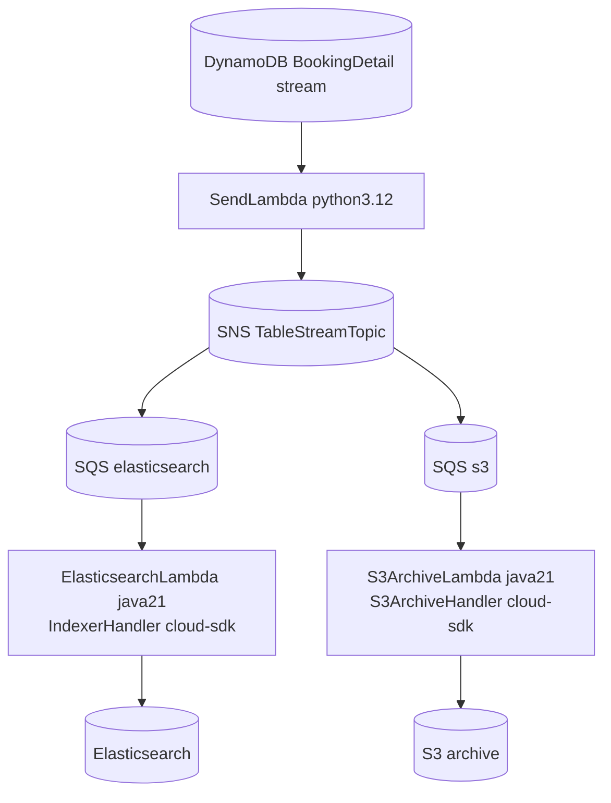

# Booking Update Trigger — AWS SDK 2.x (cloud-sdk) Upgrade Design

**Module:** `booking-update-trigger`
**Date:** 2026-06-30
**Status:** Target design (infrastructure-only) — NOT STARTED
**Companion:** `2026-06-30-booking-update-trigger-current-state-DESIGN-copilot.md`
**Reference upgrades:** `booking` (the Lambda handler code lives there)

---

## 1. Change Overview

`booking-update-trigger` is **CloudFormation/infrastructure only** — it contains no Java/Maven module. The AWS SDK 2.x
/ cloud-sdk migration of the **Java Lambda handlers** it references (`IndexerHandler`, `S3ArchiveHandler`) is owned by
the **`booking`** module. This document therefore specifies **infrastructure modernization** aligned to booking's
completed cloud-sdk upgrade, plus Lambda-runtime currency.

| Concern | Current | Target |
|---------|---------|--------|
| Java Lambda code | `booking-1.0.jar` built with AWS SDK v1 lineage | rebuilt `booking` jar on **cloud-sdk (AWS SDK 2.x)** |
| Java Lambda runtime | `java8` | `java17` / `java21` |
| Python `SendLambda` | `python3.6` + `boto3` | `python3.12` + `boto3` (current) |
| Event plumbing | DynamoDB Stream → SendLambda → SNS → SQS → ES/S3 Lambdas | **unchanged** (envelopes preserved) |

There are **no SDK calls in this repo** to migrate — only template parameters (runtime, code key) and the consumed
artifact change.

---

## 2. "Dependency"/Artifact Changes

There is no `pom.xml`. The only artifact change is the **Lambda code artifact**:

```diff
  Parameters:
    CodeS3Key:
-     Default: booking-1.0.jar          # AWS SDK v1 lineage build
+     Default: booking-<cloud-sdk>.jar  # rebuilt on cloud-sdk (AWS SDK 2.x)
```

Handlers are unchanged in name:
- `com.inttra.mercury.booking.lambda.IndexerHandler::handle`
- `com.inttra.mercury.booking.lambda.S3ArchiveHandler::handle`

## 3. Configuration / Template Changes

```diff
  # BOOKINGDETAIL-ES.json / BOOKINGDETAIL-S3*.json
  ElasticsearchLambda / S3ArchiveLambda:
    Properties:
-     Runtime: java8
+     Runtime: java21

  # BOOKINGDETAIL-STREAM.json
  SendLambda:
    Properties:
-     Runtime: python3.6
+     Runtime: python3.12
```

Environment variables (`dynamoDbEnvironment`, `elasticsearchEndpointUrl`, `s3ArchiveBucket`, `tntAPI`, flags) and all
queue/topic/bucket/IAM parameters remain **unchanged** so the handlers behave identically.

## 4. AWS Services in Scope (CALL-OUT)

| Service | What changes | What stays |
|---------|--------------|------------|
| **Lambda** | runtimes upgraded; Java code = cloud-sdk build | function names, handlers, batch sizes, event sources |
| **DynamoDB Streams** | nothing | table, stream view, LATEST/batch=1 |
| **SNS / SQS** | nothing | topic + queues + DLQ redrive, message/envelope shapes |
| **S3** | nothing | archive bucket, AES256, lifecycle, bucket policy |
| **Elasticsearch** | follows booking (Jest → OpenSearch separate track) | domain endpoint |

## 5. Target Architecture (unchanged plumbing, modern runtimes)



## 6. Deployment Changes

- Rebuild/redeploy the `booking` Lambda artifact on cloud-sdk; upload to the code bucket; update `CodeS3Key`.
- Update `Runtime` in the three templates; `aws cloudformation update-stack` in the existing order
  (STREAM → ES/S3).
- Smoke-test: a BookingDetail change still indexes to ES and archives to S3 with identical record shapes.

## 7. Risks & Call-outs

- **No DynamoDB schema / stream-record / SNS / SQS / S3 format changes** — strictly backward compatible.
- Java runtime jump `java8 → java21` requires re-testing cold start, memory (512 MB), and 30 s/120 s timeouts.
- The handler SDK migration is gated on the **booking** module; this repo only consumes the rebuilt jar.
- ES path's Jest → OpenSearch client move is a separate track owned by booking.
