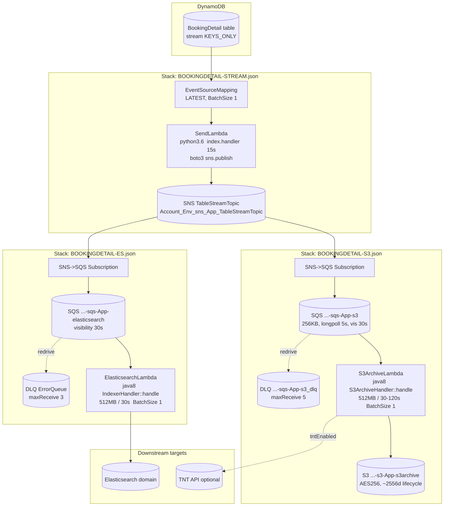
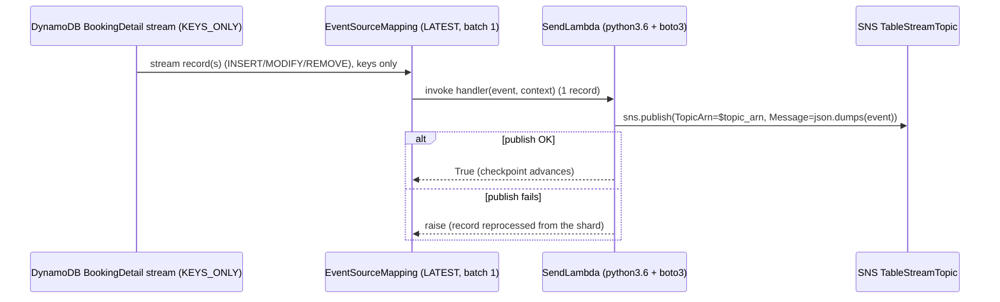

# Booking Update Trigger — Current-State Design

**Module:** `booking-update-trigger`
**Date:** 2026-06-30
**Status:** Current state — **infrastructure-only** (AWS CloudFormation). No Java/Maven module, no `pom.xml`. The Java
Lambda code it deploys (`booking-1.0.jar`) is built by the **`booking`** module, whose handlers are **already on
cloud-sdk / AWS SDK 2.x**; only the AWS Lambda **event POJOs** remain on `com.amazonaws` (`aws-lambda-java-events`).
**Artifact:** CloudFormation JSON templates only (no build output). Deployed Lambda code = `booking-1.0.jar`.
**Main class / handler:** none in this repo. Handlers (in `booking`):
`com.inttra.mercury.booking.lambda.IndexerHandler::handle`, `com.inttra.mercury.booking.lambda.S3ArchiveHandler::handle`;
plus an inline Python `SendLambda` (`index.handler`).

---

## 1. Business Purpose & Rules

`booking-update-trigger` is the **event-plumbing layer** that propagates **`BookingDetail`** mutations out of DynamoDB
to two independent downstream consumers, with no shared coupling between them:

1. **Elasticsearch search index** — keep the booking search index current as bookings are created, modified, or expire
   (TTL `REMOVE`).
2. **S3 archive** — durable, ~7-year audit archive of every new `BookingDetail` version, optionally forwarded to an
   external **Track-and-Trace (TNT) API**.

There is **no application logic in this directory** — only declarative CloudFormation. The behaviour below is enforced
partly by the templates (event-source config, fan-out, runtimes) and partly by the handlers in `booking` (which this
module merely wires up and configures via environment variables).

### Key rules (grounded in the templates + the `booking` handlers)

| Rule | Detail (source) |
|------|------|
| Stream source & position | `TableStreamEventSourceMapping` reads the **`BookingDetail`** DynamoDB stream at `StartingPosition: LATEST`, `BatchSize: 1`, `Enabled: true` (`BOOKINGDETAIL-STREAM.json`). |
| Stream view type | `BookingDetail` declares `@DynamoDBStream(StreamViewType.KEYS_ONLY)` (`booking` `BookingDetail.java`) — stream records carry **keys only**; handlers re-fetch the full item via `BookingDetailDao`. |
| Composite key on the wire | Stream keys are `bookingId` (partition) + `sequenceNumber` (sort) — both `S` (`BookingDetail` `@DynamoDbPartitionKey`/`@DynamoDbSortKey`). Handlers read `keys.get("bookingId").getS()` / `keys.get("sequenceNumber").getS()`. |
| SNS fan-out | `SendLambda` publishes each raw stream event to the SNS `TableStreamTopic`; that topic is then subscribed to by **two** SQS queues (ES + S3), one per consumer stack. |
| ES op handling | `IndexerHandler` indexes on `INSERT`/`MODIFY`, deletes on `REMOVE` (derives `inttraReferenceNumber` from `sequenceNumber.split("_")[3]`). |
| Core-booking gating (ES) | If `booking.isCoreBooking()` and env `enableCoreBookingSearch != true`, the record is **skipped** (not indexed). |
| Archive op handling | `S3ArchiveHandler` archives **only `INSERT`** events; it ignores `MODIFY`/`REMOVE`. |
| Core-booking gating (S3) | If `bookingDetail.isCoreBooking()` and env `enableCoreBookingArchive != true`, the archive write is **skipped**. |
| TNT enrichment gating | TNT forward happens only when env `tntEnabled == true` **and** both `tntAPI` and `tokenEnv` are non-blank. |
| Retry semantics (ES) | `IndexerHandler` wraps booking fetch + index/delete in `Retry` (`maxRetries`, default 5; overridable via env `maxRetries`). |
| Delivery retry / DLQ | ES path: SQS `maxReceiveCount: 3` → DLQ. S3 path: `maxReceiveCount: 5` → named `..._s3_dlq`. |
| At-least-once / idempotency | `BatchSize: 1` everywhere; failures redrive through SQS until `maxReceiveCount`, so handlers must tolerate re-delivery. |

---

## 2. Design & Component Diagram

The module is composed of **three deployable CloudFormation stacks** (plus two alternate forms of the S3 stack):

- `BOOKINGDETAIL-STREAM.json` — the **producer**: `SendLambda` (Python) + DynamoDB-stream event-source mapping + the
  SNS `TableStreamTopic` (exports its ARN).
- `BOOKINGDETAIL-ES.json` — the **Elasticsearch consumer**: SQS processing queue + DLQ + `ElasticsearchLambda` (Java).
- `BOOKINGDETAIL-S3.json` — the **S3 archive consumer**: SQS processing queue + DLQ + archive bucket + bucket policy +
  `S3ArchiveLambda` (Java), **creates the bucket in-stack**.
  - `cfn/lambda/BOOKINGDETAIL-S3-LAMBDA.json` — VPC variant of the S3 consumer (`VpcConfig` with SG + 2 subnets;
    bucket supplied as a parameter, **not** created here; 120 s timeout/visibility).
  - `cfn/lambda/BOOKINGDETAIL-S3-LAMBDANoVPC.json` — same as above but **no** `VpcConfig` (bucket as a parameter).



### Key resources × responsibility

| Stack | Logical resource | Type | Responsibility |
|-------|------------------|------|----------------|
| STREAM | `SendLambda` | `AWS::Lambda::Function` | `python3.6`, `index.handler`, 15 s. Inline `boto3` code: `sns.publish(TopicArn=os.environ["topic_arn"], Message=json.dumps(event))`. Raises on failure (re-drives the stream shard). |
| STREAM | `TableStreamEventSourceMapping` | `AWS::Lambda::EventSourceMapping` | Binds `${TableStreamArn}` → `SendLambda`; `LATEST`, `BatchSize 1`. |
| STREAM | `TableStreamTopic` | `AWS::SNS::Topic` | Name `${Account}_${Environment}_sns_${Application}_TableStreamTopic`; ARN exported as `${AWS::StackName}-TableStreamTopicArn`. |
| STREAM | `SendLambdaLogGroup` | `AWS::Logs::LogGroup` | `/aws/lambda/${SendLambda}`, retention `LogGroupRetentionInDays` (14). |
| ES | `ElasticsearchLambda` | `AWS::Lambda::Function` | `java8`, `com.inttra.mercury.booking.lambda.IndexerHandler::handle`, 512 MB / 30 s. Code = `CodeS3Bucket`/`CodeS3Key` (`booking-1.0.jar`). |
| ES | `TableStreamTopicSubscription` | `AWS::SNS::Subscription` | `sqs` protocol; `TableStreamTopicArn` → `ProcessingQueue`. |
| ES | `ProcessingQueue` / `ProcessingQueuePolicy` | `AWS::SQS::Queue` / `QueuePolicy` | `${Account}-${Environment}-sqs-${Application}-elasticsearch`; policy allows `sqs:SendMessage` only when `aws:SourceArn == TableStreamTopicArn`. |
| ES | `ErrorQueue` | `AWS::SQS::Queue` | Unnamed DLQ; redrive `maxReceiveCount 3`; retention 1 209 600 s (14 d). |
| ES | `ElasticsearchLambdaEventSource` | `EventSourceMapping` | `ProcessingQueue` → `ElasticsearchLambda`, `BatchSize 1`. |
| S3 | `S3ArchiveLambda` | `AWS::Lambda::Function` | `java8`, `com.inttra.mercury.booking.lambda.S3ArchiveHandler::handle`, 512 MB; timeout 30 s (`BOOKINGDETAIL-S3.json`) or 120 s (the `lambda/` variants). |
| S3 | `S3ArchiveBucket` | `AWS::S3::Bucket` | `${Account}-${Environment}-s3-${Application}-s3archive`; **AES256** SSE; lifecycle `ExpirationInDays 2556` (~7 y); access logging to `BucketLoggingDestinationBucket`. **Created in-stack only by `BOOKINGDETAIL-S3.json`**; the `lambda/` variants take the bucket as a parameter. |
| S3 | `S3BucketPolicy` | `AWS::S3::BucketPolicy` | Grants `s3:PutObject` to `BucketAccessRoleArn` and `S3ArchiveLambdaRoleArn` on the bucket + `/*`. |
| S3 | `ProcessingQueue` | `AWS::SQS::Queue` | `${Account}-${Environment}-sqs-${Application}-s3`; `MaximumMessageSize 262144` (256 KB), `ReceiveMessageWaitTimeSeconds 5` (long poll), visibility 30 s (120 s in `lambda/` variants). |
| S3 | `ErrorQueue` | `AWS::SQS::Queue` | Named `${Account}-${Environment}-sqs-${Application}-s3_dlq`; redrive `maxReceiveCount 5`. |
| (handler in `booking`) | `IndexerHandler` | Java | Unwraps SQS→SNS→DynamodbEvent; `INSERT`/`MODIFY` → fetch booking via DAO + `Indexer.index`; `REMOVE` → `Indexer.delete`. Uses cloud-sdk Jest signing client. |
| (handler in `booking`) | `S3ArchiveHandler` | Java | Unwraps the same envelope; `INSERT` only → `BookingDetailDao.findByBookingId`, compute version/split, write JSON via **cloud-sdk `StorageClient.putObject`**, optional TNT. |
| (handler in `booking`) | `HandlerSupport` | Java | Builds the cloud-sdk `BookingDetailDao` (`DynamoRepositoryFactory.createDefaultEnhancedRepository`), the cloud-sdk `SNSClient` (`NotificationClientFactory`), and the AWS-JSON `ObjectMapper`. |

---

## 3. Data Flow

### 3.1 Producer — DynamoDB stream → SNS (`BOOKINGDETAIL-STREAM.json`)



### 3.2 Elasticsearch consumer (`BOOKINGDETAIL-ES.json` + `IndexerHandler`)

```mermaid
sequenceDiagram
  participant SNS as SNS TableStreamTopic
  participant SQE as SQS ...-elasticsearch
  participant ESL as ElasticsearchLambda (IndexerHandler)
  participant DAO as BookingDetailDao (cloud-sdk Enhanced)
  participant IDX as Indexer (cloud-sdk Jest client)
  participant ES as Elasticsearch domain
  participant DLQ as ErrorQueue (maxReceive 3)

  SNS->>SQE: SQS message (SNS envelope wrapping the Dynamodb event JSON)
  SQE->>ESL: invoke handle(SQSEvent)  (batch 1)
  ESL->>ESL: extractSns -> extractDynamoDbEvent (Jackson)
  loop each DynamodbStreamRecord
    ESL->>ESL: bookingId = keys.bookingId.S ; sequenceNumber = keys.sequenceNumber.S
    alt INSERT or MODIFY
      ESL->>DAO: findByBookingId(bookingId)  (Retry up to maxRetries)
      DAO-->>ESL: List<BookingDetail> -> new Booking(details)
      alt isCoreBooking && !enableCoreBookingSearch
        ESL-->>SQE: return true (skip indexing)
      else
        ESL->>IDX: index(booking)  (Retry)
        IDX->>ES: upsert IndexedBooking
      end
    else REMOVE
      ESL->>IDX: delete(inttraReferenceNumber = sequenceNumber.split("_")[3])
      IDX->>ES: delete doc
    end
  end
  alt handler throws
    SQE->>SQE: message reappears after visibility timeout
    SQE->>DLQ: after maxReceiveCount (3)
  end
```

### 3.3 S3 archive consumer (`BOOKINGDETAIL-S3.json` + `S3ArchiveHandler`)

```mermaid
sequenceDiagram
  participant SNS as SNS TableStreamTopic
  participant SQS as SQS ...-s3 (256KB, longpoll 5s)
  participant S3L as S3ArchiveLambda (S3ArchiveHandler)
  participant DAO as BookingDetailDao (cloud-sdk Enhanced)
  participant ST as StorageClient (cloud-sdk-aws, SDK 2.x)
  participant S3B as S3 ...-s3archive bucket
  participant TNT as TNT API (optional)
  participant DLQ as ...-s3_dlq (maxReceive 5)

  SNS->>SQS: SQS message (SNS->Dynamodb event JSON)
  SQS->>S3L: invoke handle(SQSEvent)  (batch 1)
  S3L->>S3L: extractSns -> extractDynamoDbEvent
  loop each DynamodbStreamRecord
    alt eventName == INSERT
      S3L->>DAO: findByBookingId(bookingId) -> Booking
      S3L->>S3L: pick detail by sequenceNumber; set uniqueVersionId + splitCopy
      alt isCoreBooking && !enableCoreBookingArchive
        S3L-->>SQS: skip archive
      else
        S3L->>S3L: convert XML payload to JSON (SO* contracts)
        S3L->>ST: putObject(bucket, key=yyyy/MM/dd/HH/{bookingId}_{sequenceNumber}, toS3Json(detail))
        ST->>S3B: PutObject (SDK 2.x)
      end
      opt tntEnabled && tntAPI && tokenEnv
        S3L->>TNT: sendToTNT(toS3Json(detail), tntAPI, tokenEnv)
      end
    else MODIFY/REMOVE
      S3L-->>SQS: ignored
    end
  end
  alt handler throws
    SQS->>DLQ: after maxReceiveCount (5)
  end
```

---

## 4. Data Stores & Integrations

### DynamoDB (source — defined in `booking`, streamed here)

- Table logical name **`BookingDetail`** (`@Table(name="BookingDetail")`); per-env physical name is
  `${DynamoDbEnvironment}_BookingDetail` (e.g. `inttra_int_booking_BookingDetail`).
- Stream: `@DynamoDBStream(StreamViewType.KEYS_ONLY)` — records contain **only the key attributes**.
- Key schema (on the wire, `S`/`S`): partition `bookingId`, sort `sequenceNumber`.
- The `TableStreamArn` is passed in as a parameter (`Latest stream ARN of the DynamoDB table to stream`).

> The handlers re-read the full item from this table via `BookingDetailDao.findByBookingId(bookingId)` (cloud-sdk
> Enhanced client) because the stream is KEYS_ONLY. The archive/index content therefore reflects the **table** state at
> handler time, not the stream image.

### SNS / SQS (created by this module)

| Resource | Name pattern | Notes |
|----------|--------------|-------|
| SNS topic | `${Account}_${Environment}_sns_${Application}_TableStreamTopic` | One topic, two SQS subscriptions. ARN exported. |
| SQS (ES) | `${Account}-${Environment}-sqs-${Application}-elasticsearch` | Visibility 30 s; retention 345 600 s (4 d); redrive → unnamed DLQ at 3. |
| DLQ (ES) | (auto-named `ErrorQueue`) | Visibility 30 s; retention 1 209 600 s (14 d). |
| SQS (S3) | `${Account}-${Environment}-sqs-${Application}-s3` | `MaximumMessageSize 262144`, long-poll 5 s, visibility 30 s (120 s in `lambda/` variants), retention 4 d; redrive → `_s3_dlq` at 5. |
| DLQ (S3) | `${Account}-${Environment}-sqs-${Application}-s3_dlq` | Visibility 30 s; retention 14 d. |

> With `Account=inttra2`, `Environment=qa`, `Application=booking_BookingDetail`, the SNS topic resolves to
> `inttra2_qa_sns_booking_BookingDetail_TableStreamTopic` and the S3 queue to
> `inttra2-qa-sqs-booking_BookingDetail-s3`. `int` uses `inttra`; `cv`/`pr` use `inttra2`. **No `inttra2_cvt`/`inttra2_test`
> string appears in these templates** — naming is entirely driven by the `Account`/`Environment`/`Application`
> parameters supplied at stack-create time.

### S3 (archive bucket)

- Bucket name pattern `${Account}-${Environment}-s3-${Application}-s3archive` (e.g.
  `inttra2-qa-s3-booking_BookingDetail-s3archive`).
- **SSE AES256**, lifecycle expiration `2556` days (~7 years), server access logging to `BucketLoggingDestinationBucket`
  with prefix `s3/${Account}-${Environment}-s3-${Application}-s3archive`.
- Object key (from `S3ArchiveHandler.calcKey`): `yyyy/MM/dd/HH/{bookingId}_{sequenceNumber}` (UTC, from
  `audit.createdDateUtc`). Object body = `toS3Json(bookingDetail)`. `s3://{bucket}/{key}` logged as the write location.
- Created in-stack only by `BOOKINGDETAIL-S3.json`; the two `lambda/` variants treat `s3ArchiveBucket` as a pre-existing
  parameter.

### Elasticsearch

- Target domain is provisioned elsewhere; this module passes `ElasticsearchDomainArn` + `ElasticsearchDomainEndpoint`
  into the ES Lambda env (`elasticsearchEndpointUrl`). The Jest client (cloud-sdk `JestModule.newAwsSigningClient`,
  AWS-SigV4) lives in the `booking` handler.

### External — TNT API

- `S3ArchiveHandler` optionally POSTs the archived JSON to `${tntAPI}` using `${tokenEnv}`, gated by `${tntEnabled}`.

---

## 5. "Dependencies" (no `pom.xml` — code artifact + runtimes)

This module has **no Maven build**. The only versioned inputs are the runtimes and the consumed Lambda jar.

| Input | Value | Notes |
|-------|-------|-------|
| Lambda code artifact | `booking-1.0.jar` (`CodeS3Key` default) | Shaded uber-JAR produced by the **`booking`** module (`maven-shade-plugin` `finalName=booking-1.0`). Contains `IndexerHandler` / `S3ArchiveHandler` / `HandlerSupport`. |
| Java Lambda runtime | `java8` | Both `ElasticsearchLambda` and `S3ArchiveLambda`. **End-of-life on AWS Lambda.** |
| Python Lambda runtime | `python3.6` | `SendLambda` inline `boto3`. **End-of-life on AWS Lambda.** |
| `booking` commons line | `1.0.26-SNAPSHOT` (`mercury.commons.version`) | The cloud-sdk-bearing commons line; pulls `cloud-sdk-api` + `cloud-sdk-aws`. |
| `booking` Lambda-events dep | `com.amazonaws:aws-lambda-java-events:3.14.0` | **The only `com.amazonaws` on the booking prod classpath** — supplies the v1 event POJOs the handlers parse. |
| `booking` Jackson line | `2.21.0` (`jackson-bom` import) | Pinned to keep AWS-JSON parsing stable. |
| CloudFormation | declarative JSON, schema `2010-09-09` | Deployed via AWS CLI. |

---

## 6. Configuration & Deployment

### CloudFormation parameters (shared naming convention)

All resource names are built from three string parameters: **`Account`** (`inttra` / `inttra2`), **`Environment`**
(`int` / `qa` / `cv` / `pr`), **`Application`** (e.g. `booking_BookingDetail`).

| Parameter | Stack(s) | Purpose / default |
|-----------|----------|-------------------|
| `TableStreamArn` | STREAM | DynamoDB BookingDetail stream ARN (event source). |
| `SendLambdaRoleArn` | STREAM | IAM role for `SendLambda`. |
| `TableStreamTopicArn` | ES, S3 | SNS topic ARN exported by the STREAM stack. |
| `CodeS3Bucket` / `CodeS3Key` | ES, S3 | Lambda code location; `CodeS3Key` default `booking-1.0.jar`. |
| `DynamoDbEnvironment` | ES, S3 | Table prefix, e.g. `inttra_int_booking` → handler reads `${prefix}_BookingDetail`. |
| `ElasticsearchDomainArn` / `...Endpoint` | ES | Target ES domain (endpoint → env `elasticsearchEndpointUrl`). |
| `ElasticsearchLambdaRoleArn` | ES | IAM role for the ES Lambda. |
| `EnableCoreBookingSearch` | ES | Feature flag (default `false`) → env `enableCoreBookingSearch`. |
| `S3ArchiveBucketExpirationInDays` | S3 | Lifecycle (default `2556`). |
| `S3ArchiveLambdaRoleArn` | S3 | IAM role for the S3 Lambda. |
| `BucketAccessRoleArn` | S3 | External role granted `PutObject` via bucket policy. |
| `BucketLoggingDestinationBucket` | S3 | S3 server-access-log target bucket. |
| `tntAPI` / `tokenEnv` / `tntEnabled` | S3 | TNT enrichment (note: `tntEnabled` is **not** present in `BOOKINGDETAIL-S3.json`; it is present in both `lambda/` variants). |
| `EnableCoreBookingArchive` | S3 | Feature flag (default `false`) → env `enableCoreBookingArchive`. |
| `SecurityGroupId`, `SubnetId1`, `SubnetId2` | S3 (VPC variant only) | `VpcConfig` for the multi-AZ S3 Lambda. |
| `Timeout` / `MemorySize` | ES, S3 | Defaults: ES 30 s / 512 MB; S3 30 s (`BOOKINGDETAIL-S3.json`) or 120 s (`lambda/` variants) / 512 MB. |
| `ProcessingQueue*` / `ErrorQueue*` | ES, S3 | Retention/visibility/`maxReceiveCount` (3 ES, 5 S3). |
| `LogGroupRetentionInDays` | all | CloudWatch Logs retention (default 14). |

### Lambda environment variables

| Function | Env vars (from templates) |
|----------|----------------------------|
| `SendLambda` | `topic_arn` (= `TableStreamTopic` ARN). |
| `ElasticsearchLambda` | `dynamoDbEnvironment`, `elasticsearchEndpointUrl`, `enableCoreBookingSearch`. |
| `S3ArchiveLambda` | `s3ArchiveBucket`, `dynamoDbEnvironment`, `tntAPI`, `tokenEnv`, `enableCoreBookingArchive`; **plus `tntEnabled`** in the two `lambda/` variants. |

### Deployment

- Deployed with **AWS CloudFormation** (`aws cloudformation create-stack` / `update-stack`). **No build scripts in this
  directory.**
- **Order:** (1) `BOOKINGDETAIL-STREAM.json` (creates SNS topic, exports `TableStreamTopicArn`); (2)
  `BOOKINGDETAIL-ES.json`; (3) one of `BOOKINGDETAIL-S3.json` (bucket created in-stack) **or**
  `cfn/lambda/BOOKINGDETAIL-S3-LAMBDA.json` (VPC, bucket as param) **or** `…-S3-LAMBDANoVPC.json` (no VPC, bucket as
  param).
- **Prerequisites:** IAM roles exist (`SendLambdaRoleArn`, `ElasticsearchLambdaRoleArn`, `S3ArchiveLambdaRoleArn`,
  `BucketAccessRoleArn`); `booking-1.0.jar` uploaded to `CodeS3Bucket`; DynamoDB stream enabled; ES domain provisioned.
- **Credentials:** the handlers use the default AWS credential provider chain (the Lambda execution role) — see
  `HandlerSupport.newBookingDetailDao` / `StorageClientFactory.createDefaultS3Client` / `NotificationClientFactory`.

---

## 7. AWS Services & SDK Usage (CALL-OUT)

> **This directory contains no SDK code** — it is declarative CloudFormation plus one inline `boto3` Python snippet.
> The "SDK version" question is therefore about (a) the **inline `SendLambda`** and (b) the **`booking` handlers** that
> the templates deploy. **Important correction to the Copilot doc:** `booking`'s handlers are **already migrated to
> cloud-sdk (AWS SDK 2.x)** — `StorageClient`, `NotificationService`/`SNSClient`, the Enhanced-client
> `DatabaseRepository`, and the cloud-sdk `JestModule`. The **only** `com.amazonaws` artifact left on booking's prod
> classpath is `aws-lambda-java-events` (the Lambda **event POJOs**).

| Where | SDK | Concrete classes | State |
|-------|-----|------------------|-------|
| `SendLambda` (this repo, inline) | `boto3` (Python) | `boto3.client("sns").publish(...)` | Current `boto3`; `python3.6` runtime is EOL. |
| `IndexerHandler` event parsing (booking) | **v1 Lambda events** | `com.amazonaws.services.lambda.runtime.events.{SQSEvent,SNSEvent.SNS,DynamodbEvent,...}`, `…events.models.dynamodb.{AttributeValue,OperationType}` | Stays v1 (event POJOs from `aws-lambda-java-events 3.14.0`). |
| `IndexerHandler` ES client (booking) | **cloud-sdk** | `com.inttra.mercury.cloudsdk.aws.module.JestModule.newAwsSigningClient(...)`, `io.searchbox.client.JestClient` | Migrated (SigV4 Jest via cloud-sdk). |
| `IndexerHandler`/`S3ArchiveHandler` DynamoDB read (booking) | **cloud-sdk (SDK 2.x Enhanced)** | `DatabaseRepository`, `DynamoRepositoryFactory.createDefaultEnhancedRepository`, `DefaultCompositeKey` (via `HandlerSupport`/`BookingDetailDao`) | Migrated. |
| `S3ArchiveHandler` S3 write (booking) | **cloud-sdk (SDK 2.x)** | `com.inttra.mercury.cloudsdk.storage.api.StorageClient`, `StorageClientFactory.createDefaultS3Client()`, `storageClient.putObject(...)` | Migrated (class Javadoc: "Migrated from AWS SDK 1.x AmazonS3 to cloud-sdk-aws StorageClient"). |
| `S3ArchiveHandler` SNS (report bridge) (booking) | **cloud-sdk** | `SNSClient` over `NotificationService` (`NotificationClientFactory.createDefaultClient`) | Migrated. |
| DynamoDB stream (this repo) | n/a (infra) | `BatchSize 1`, `StartingPosition LATEST`, KEYS_ONLY view | Declarative only. |
| SNS / SQS / S3 / Logs (this repo) | n/a (infra) | `AWS::SNS::Topic/Subscription`, `AWS::SQS::Queue/QueuePolicy`, `AWS::S3::Bucket/BucketPolicy`, `AWS::Logs::LogGroup` | Declarative only. |

**Runtime-currency call-outs (not SDK, but the real modernization debt here):** `java8` (both Java Lambdas) and
`python3.6` (`SendLambda`) are **end-of-life** AWS Lambda runtimes.

---

## 8. AWS 2.x / cloud-sdk Upgrade Plan (High Level)

Because the **client-side** cloud-sdk migration of the handlers is **already done in `booking`**, this module's
remaining work is **infrastructure modernization** (runtimes), an artifact re-point, and a backward-compatibility
verification of the stream/SNS/SQS/S3 envelopes.

| Step | Action | Reference |
|------|--------|-----------|
| 1 | Confirm the deployed `booking-1.0.jar` is the **cloud-sdk build** (it already is in source) and re-point `CodeS3Key` if the artifact name changes. | `booking` `pom.xml` / handlers |
| 2 | Upgrade Lambda runtimes: `java8` → `java17`/`java21` (`ElasticsearchLambda`, `S3ArchiveLambda`); `python3.6` → `python3.12` (`SendLambda`). Re-test cold start, 512 MB memory, 30 s/120 s timeouts. | — |
| 3 | Verify the **DynamoDB stream → SNS → SQS → Lambda** envelope is unchanged: stream stays KEYS_ONLY with keys `bookingId`/`sequenceNumber` (`S`), `SendLambda` still `json.dumps(event)` into the SNS `Message`, SQS body stays the SNS envelope. | this repo + `HandlerSupport.extractSns/extractDynamoDbEvent` |
| 4 | Verify the **S3 archive object** stays byte-identical: key `yyyy/MM/dd/HH/{bookingId}_{sequenceNumber}`, body `toS3Json(bookingDetail)` (cloud-sdk `StorageClient.putObject` already produces this). | `S3ArchiveHandler.calcKey` / `writeToS3` |
| 5 | (Optional) replace the inline `boto3` `SendLambda` with an **EventBridge Pipe** (DynamoDB stream → SNS) to drop a runtime and a hop. | — |
| 6 | Track the ES path's Jest → OpenSearch-client move (owned by `booking`); not required for this module to function. | `booking` `JestModule` |

**Risks / call-outs:**
- **No DynamoDB schema, stream-record, SNS, SQS, or S3 format changes** — the contract is the envelope shape and the
  archive object; both must stay wire-identical.
- **`java8`/`python3.6` are EOL** — the runtime jump (esp. `java8 → java21`) needs cold-start / memory / timeout
  re-testing; the 256 KB SQS `MaximumMessageSize` on the S3 queue limits envelope growth.
- **Two divergent S3-stack forms** (`cfn/BOOKINGDETAIL-S3.json` creates the bucket and omits `tntEnabled`; the two
  `lambda/*` variants take the bucket as a param, set `tntEnabled`, and use a 120 s timeout). A modernization must keep
  the variants consistent or consolidate them.
- **The handler SDK migration is already complete** — do **not** rebuild on a "v1 lineage" jar; the only `com.amazonaws`
  left is the Lambda **event POJOs** (`aws-lambda-java-events`), which legitimately stay on v1.
- **Commit hygiene:** every outgoing commit message must carry the Jira ticket prefix (e.g. `ION-xxxxx …`).
