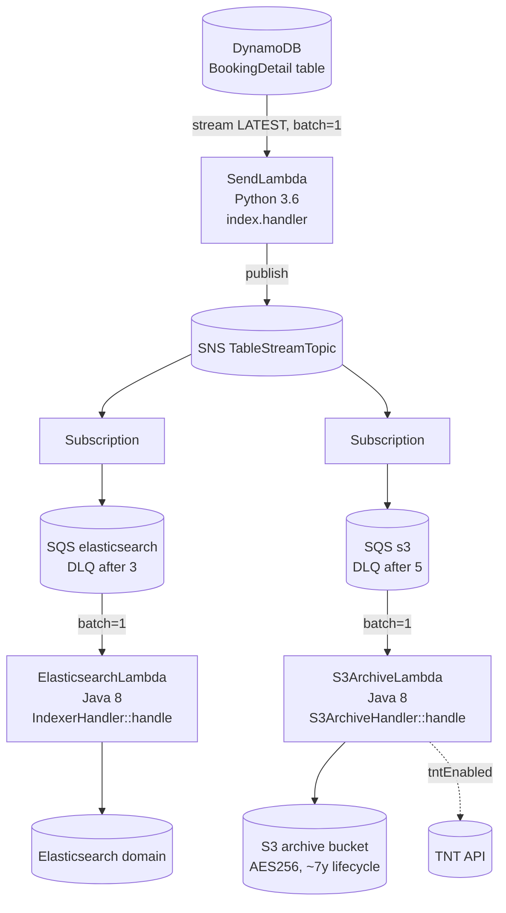

# Booking Update Trigger — Current-State Design

**Module:** `booking-update-trigger`
**Date:** 2026-06-30
**Status:** Current state (infrastructure-only; no Java/Maven module)
**Type:** AWS CloudFormation templates (DynamoDB Streams → SNS → SQS → Lambda fan-out)

---

## 1. Business Purpose

`booking-update-trigger` is an **infrastructure-only** component. It defines the AWS event-streaming and fan-out
plumbing that propagates **BookingDetail** changes from DynamoDB to two downstream consumers:

1. **Elasticsearch** — keep the booking search index current.
2. **S3 archive** — durable audit/archival of booking detail changes (optionally enriched via a TNT API).

There is **no application code** here. The Java Lambda handlers it references are built and supplied by the
**`booking`** module (artifact `booking-1.0.jar`). The only inline code is a small Python `SendLambda`.

### Contents

```
booking-update-trigger/
└── cfn/
    ├── BOOKINGDETAIL-STREAM.json        # DynamoDB stream -> SendLambda (Python) -> SNS topic
    ├── BOOKINGDETAIL-ES.json            # SNS -> SQS -> ElasticsearchLambda (Java 8)
    ├── BOOKINGDETAIL-S3.json            # SNS -> SQS -> S3ArchiveLambda (VPC) + archive bucket
    └── lambda/
        ├── BOOKINGDETAIL-S3-LAMBDA.json       # S3 archive Lambda (VPC variant)
        └── BOOKINGDETAIL-S3-LAMBDANoVPC.json  # S3 archive Lambda (no-VPC variant)
```

---

## 2. Architecture & Data Flow



### Flow steps

1. **DynamoDB Streams** on the `BookingDetail` table emit INSERT/MODIFY/REMOVE records (`StartingPosition=LATEST`, `BatchSize=1`).
2. **SendLambda** (`python3.6`, `index.handler`, 15 s) publishes each record to the **SNS `TableStreamTopic`**.
3. The SNS topic fans out to **two SQS queues** (Elasticsearch path and S3 path), each with its own DLQ redrive.
4. **ElasticsearchLambda** (`java8`, `com.inttra.mercury.booking.lambda.IndexerHandler::handle`, batch 1) updates the ES index.
5. **S3ArchiveLambda** (`java8`, `com.inttra.mercury.booking.lambda.S3ArchiveHandler::handle`, batch 1) writes to the archive bucket and optionally calls the TNT API.

---

## 3. AWS Services Used (CALL-OUT)

| Service | Resource (pattern) | Notes |
|---------|--------------------|-------|
| **DynamoDB Streams** | `${TableStreamArn}` | Source; LATEST; batch 1; no filters. |
| **Lambda** | `SendLambda` | `python3.6`, `index.handler`, inline code → **boto3** `sns.publish`. |
| **Lambda** | `ElasticsearchLambda` | `java8`, `IndexerHandler::handle`; code = `booking-1.0.jar` from S3; no VPC; mem 512 MB, timeout 30 s. |
| **Lambda** | `S3ArchiveLambda` | `java8`, `S3ArchiveHandler::handle`; code = `booking-1.0.jar`; VPC + no-VPC variants; mem 512 MB, timeout 120 s. |
| **SNS** | `..._sns_..._TableStreamTopic` | Decouples stream from consumers; exported ARN. |
| **SQS** | `...-sqs-...-elasticsearch` (DLQ x3), `...-sqs-...-s3` (DLQ x5), `..._s3_dlq` | 4-day retention; S3 queue 256 KB max msg, 5 s long poll, 30–120 s visibility. |
| **S3** | `...-s3-...-s3archive` | AES256; lifecycle ~2556 days (~7 y); access logging; bucket policy grants the Lambda + access roles `PutObject`. |
| **IAM** | role ARNs (parameters) | `ElasticsearchLambdaRoleArn`, `S3ArchiveLambdaRoleArn`, `BucketAccessRoleArn` — created externally. |
| **VPC/EC2** | `SecurityGroupId`, `SubnetId1/2` | VPC variant only (multi-AZ). |
| **CloudWatch Logs** | `/aws/lambda/${...}` | 14-day retention default. |
| **Elasticsearch** | endpoint via parameter | Domain provisioned elsewhere. |
| **External: TNT API** | `${tntAPI}` | Optional; gated by `tntEnabled`. |

### SDK versions (call-out)
- **SendLambda** — `boto3` (Python), implicitly current.
- **Java Lambdas** — code is **`booking-1.0.jar`**; the handlers' SDK version is whatever the **`booking`** module ships (booking's AWS upgrade is COMPLETED, so the runtime SDK depends on the deployed JAR build).
- **CloudFormation** — declarative JSON; deployed via AWS CLI.

---

## 4. Configuration / Parameters

Key CloudFormation parameters (shared naming via `Account` / `Environment` / `Application`):

| Parameter | Purpose |
|-----------|---------|
| `TableStreamArn` | DynamoDB BookingDetail stream ARN (SendLambda source). |
| `TableStreamTopicArn` | SNS topic ARN (consumed by ES & S3 stacks). |
| `CodeS3Bucket` / `CodeS3Key` (`booking-1.0.jar`) | Lambda code location. |
| `DynamoDbEnvironment` | DynamoDB table prefix (e.g. `inttra_int_booking`). |
| `ElasticsearchDomainEndpoint` / `...Arn` | ES target. |
| `s3ArchiveBucket`, `S3ArchiveBucketExpirationInDays` (2556) | Archive target + lifecycle. |
| `ProcessingQueue*` / `ErrorQueue*` | SQS retention, visibility, max-receive (3 ES / 5 S3). |
| `tntAPI`, `tokenEnv`, `tntEnabled` | TNT enrichment for S3ArchiveLambda. |
| `EnableCoreBookingSearch`, `EnableCoreBookingArchive` | Feature flags. |
| `SecurityGroupId`, `SubnetId1/2` | VPC variant networking. |

**Lambda environment variables:** ES — `dynamoDbEnvironment`, `elasticsearchEndpointUrl`, `enableCoreBookingSearch`;
S3 — `s3ArchiveBucket`, `dynamoDbEnvironment`, `tntAPI`, `tokenEnv`, `tntEnabled`, `enableCoreBookingArchive`;
Send — `topic_arn`.

---

## 5. Deployment

Deployed with **AWS CloudFormation** (AWS CLI `create-stack` / `update-stack`); no build scripts in this directory.

**Order:**
1. `BOOKINGDETAIL-STREAM.json` (creates SendLambda + SNS topic; exports `TableStreamTopicArn`).
2. `BOOKINGDETAIL-ES.json` (ES queue + Lambda; consumes topic ARN).
3. `BOOKINGDETAIL-S3.json` **or** `lambda/BOOKINGDETAIL-S3-LAMBDANoVPC.json` (S3 queue + Lambda + bucket).

**Prerequisites:** IAM roles exist; `booking-1.0.jar` uploaded to the code bucket; DynamoDB stream enabled; ES domain provisioned.

---

## 6. AWS Services & SDK 1.x Usage (CALL-OUT)

This component itself contains **no SDK code** — it is declarative infrastructure. The "SDK version" concern lives in:

- The **Python SendLambda** (`boto3`) — minor; could be modernized to Python 3.12 runtime.
- The **Java Lambda handlers** (`IndexerHandler`, `S3ArchiveHandler`) which live in the **`booking`** module. Their
  AWS SDK version follows the `booking` build (booking's upgrade is COMPLETED).

**Runtime currency call-outs (not SDK, but relevant to any modernization):**
- `python3.6` and `java8` Lambda runtimes are **end-of-life** on AWS Lambda.
- ES REST/Jest client lineage in the booking Lambdas is deprecated.

---

## 7. AWS 2.x / cloud-sdk Upgrade Plan (High Level)

The cloud-sdk migration for the **handlers** is owned by the **`booking`** module; this component's plan is
infrastructure modernization aligned to that:

| Step | Action |
|------|--------|
| 1 | Rebuild/redeploy `booking-1.0.jar` once booking's handlers run on cloud-sdk (AWS SDK v2); update `CodeS3Key` to the new artifact. |
| 2 | Upgrade Lambda runtimes: `java8` → `java17`/`java21`, `python3.6` → `python3.12`; re-test event payloads. |
| 3 | Verify the **stream → SNS → SQS → Lambda** envelope formats are unchanged so existing consumers keep working (backward compatible). |
| 4 | Optionally replace the inline `boto3` SendLambda with an EventBridge Pipe / native DynamoDB-stream-to-SNS pattern (optional simplification). |
| 5 | Track the ES path's move from Jest/legacy ES client to the OpenSearch client (driven by booking). |

**Call-outs:** No DynamoDB schema or stream-record shape changes; keep SNS message body and SQS envelope
byte-compatible; the S3 archive object format is consumed downstream and must not change.
