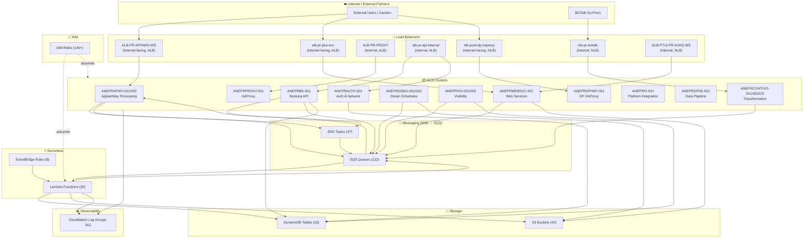
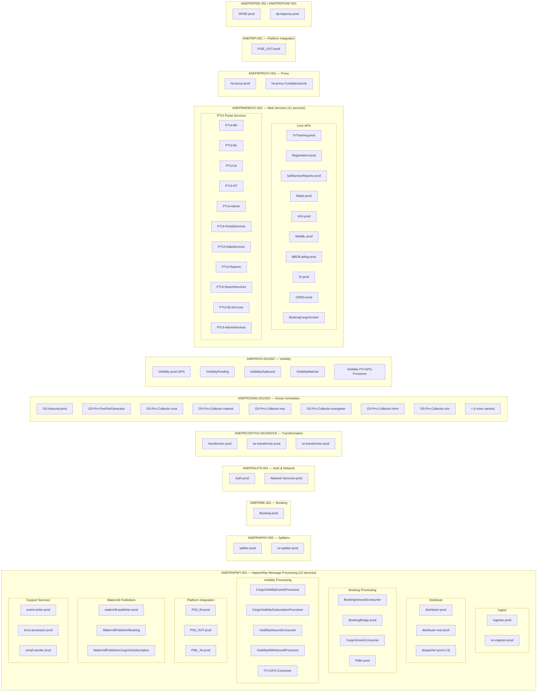
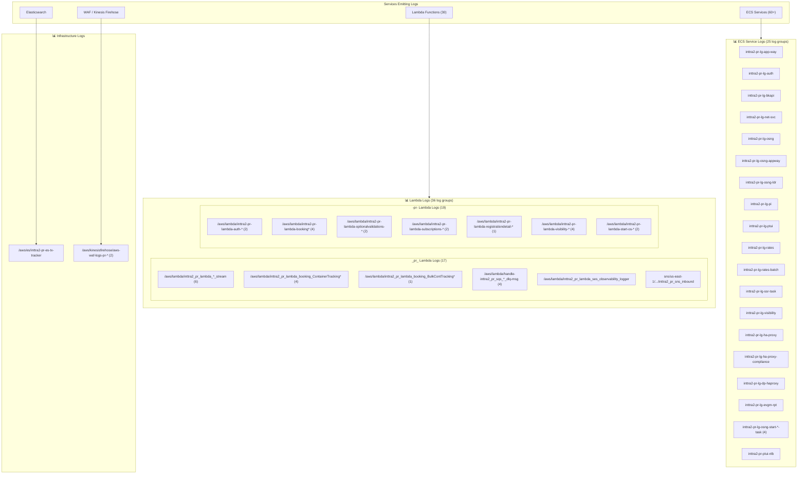
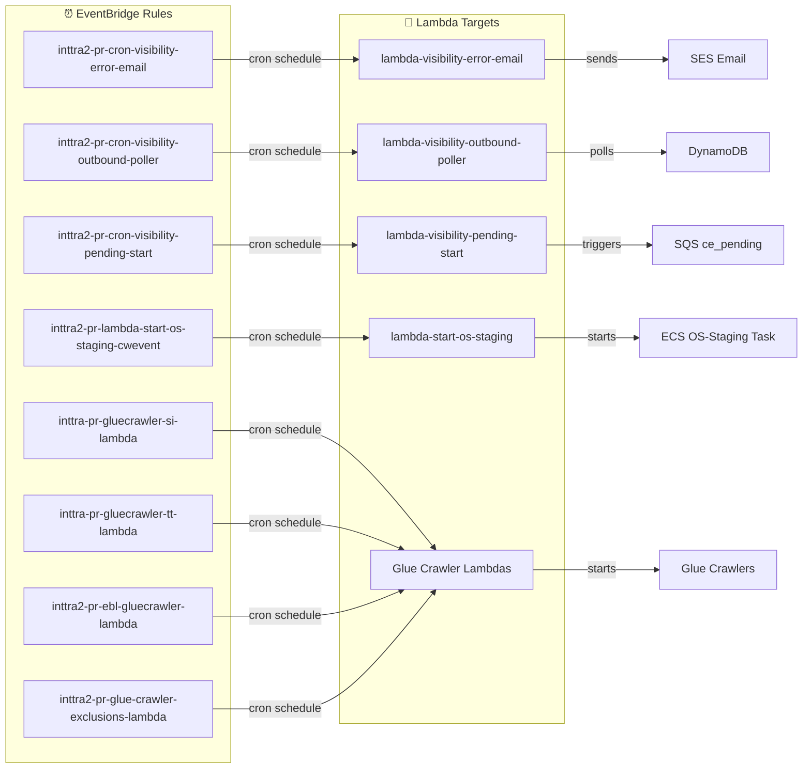

# INTTRA2 Production Architecture — Network & Component Diagram

**Account:** `642960533737` | **Region:** `us-east-1` | **Environment:** Production (`pr`)  
**Generated:** 2026-05-27

---

## 1. High-Level Architecture Overview

This diagram shows the overall topology: load balancers → ECS clusters → messaging → storage.

---

## 2. ECS Clusters & Services — Detailed Breakdown

This diagram expands each ECS cluster to show individual services running inside.

---

## 3. Message Flow — SNS → SQS → Consumers

This diagram shows how messages flow from publishers through SNS fan-out to SQS queues, consumed by ECS services and Lambda functions.

```mermaid
graph LR
    subgraph PUBLISHERS["📤 Publishers (ECS Services)"]
        PUB_INGEST["Ingestor"]
        PUB_DISPATCH["Dispatcher"]
        PUB_DISTRIB["Distributor"]
        PUB_TRANS["Transformer"]
        PUB_WM["Watermill Publishers"]
        PUB_SPLIT["Splitter"]
    end

    subgraph SNS_TOPICS["📢 SNS Topics"]
        sns_inbound["sns_inbound"]
        sns_event["sns_event"]
        sns_event_ce["sns_event_ce"]
        sns_pi_si["sns_pi_si"]
        sns_pi_bl["sns_pi_bl"]
        sns_pi_se["sns_pi_statusevents"]
        sns_osifc["sns_osifc"]
        sns_os_ppg["sns_os_port_pair_generator"]
        sns_ebldocs["sns_ebldocuments"]
        sns_wm_cs["sns_watermill_cargoscreen"]
        sns_wm_gps["sns_watermill_itv_gps"]
        sns_bk_detail["sns_bookingdetail_TableStreamTopic"]
        sns_sub_stream["sns_subscriptions_TableStreamTopic"]
        sns_ov_stream["sns_optionalvalidations_TableStreamTopic"]
        sns_reprocess["inttra2-pr-reprocess-ob-bookings"]
    end

    subgraph SQS_QUEUES["📬 SQS Queues (key flows)"]
        sqs_ingest["sqs_ingest"]
        sqs_event["sqs_event"]
        sqs_router["sqs_router"]
        sqs_split["sqs_splitter_pu"]
        sqs_ce_split["sqs_splitter_ce_pu"]
        sqs_dispatch["sqs_dispatcher_pu"]
        sqs_trans["sqs_transformer_inbound"]
        sqs_ce_trans["sqs_transformer_ce_inbound"]
        sqs_os_trans["sqs_transformer_os_inbound"]
        sqs_bk_in["sqs_bk_inbound"]
        sqs_bk_bridge["sqs_booking_bridge_inbound"]
        sqs_bk_cs["sqs_booking_cargo_screen"]
        sqs_vis_ce["sqs_ce_inbound"]
        sqs_vis_match["sqs_ce_match"]
        sqs_vis_out["sqs_ce_outbound"]
        sqs_vis_pend["sqs_ce_pending"]
        sqs_vis_val["sqs_ce_validate"]
        sqs_vis_enr["sqs_ce_enrich"]
        sqs_os_in["sqs_os_inbound"]
        sqs_os_col["sqs_os_collector"]
        sqs_os_stg["sqs_os_staging"]
        sqs_os_ldr["sqs_os_loader"]
        sqs_os_ob["sqs_os_outbound"]
        sqs_pisi["sqs_pi_si"]
        sqs_pibl["sqs_pi_bl_es"]
        sqs_pise["sqs_pi_statusevents"]
        sqs_email["sqs_email_outbound"]
        sqs_file_del["sqs_file_delivery"]
        sqs_rest_del["sqs_rest_delivery"]
        sqs_wm_bk["sqs_watermill_bk"]
        sqs_wm_ce["sqs_watermill_ce"]
        sqs_wm_cs["sqs_watermill_cargoscreen"]
        sqs_wm_gps["sqs_watermill_itv_gps"]
        sqs_bk_s3["inttra2-pr-sqs-bookingdetail-s3"]
        sqs_sub_s3["inttra2-pr-sqs-subscriptions-s3"]
        sqs_ov_s3["inttra2-pr-sqs-optionalvalidations-s3"]
    end

    subgraph CONSUMERS["📥 Consumers"]
        CON_INGEST["Ingestor (ECS)"]
        CON_EVENT["Event Writer (ECS)"]
        CON_ROUTER["Router (ECS)"]
        CON_SPLIT["Splitter (ECS)"]
        CON_DISPATCH["Dispatcher (ECS)"]
        CON_TRANS["Transformer (ECS)"]
        CON_BK["BookingInboundConsumer (ECS)"]
        CON_BRIDGE["BookingBridge (ECS)"]
        CON_CS["CargoScreenConsumer (ECS)"]
        CON_VIS_IN["VisibilityInboundConsumer (ECS)"]
        CON_VIS_MATCH["VisibilityMatcher (ECS)"]
        CON_VIS_OUT["VisibilityOutbound (ECS)"]
        CON_VIS_PEND["VisibilityPending (ECS)"]
        CON_OS["OS-Inbound (ECS)"]
        CON_PISI["PISI_IN (ECS)"]
        CON_PIBL["PIBL_IN (ECS)"]
        CON_EMAIL["EmailSender (ECS)"]
        CON_FILE["FileDelivery (ECS)"]
        CON_WM["Watermill Publishers (ECS)"]
        CON_LAMBDA["Lambda Functions"]
    end

    PUB_INGEST --> sns_inbound
    PUB_DISPATCH --> sqs_dispatch
    PUB_DISTRIB --> sqs_router & sqs_file_del & sqs_rest_del
    PUB_TRANS --> sns_event & sns_event_ce
    PUB_WM --> sqs_wm_bk & sqs_wm_ce & sqs_wm_cs & sqs_wm_gps
    PUB_SPLIT --> sqs_dispatch

    sns_inbound --> sqs_ingest & sqs_trans & sqs_ce_trans & sqs_os_trans
    sns_event --> sqs_event & sqs_split & sqs_bk_in
    sns_event_ce --> sqs_ce_split & sqs_vis_ce
    sns_pi_si --> sqs_pisi
    sns_pi_bl --> sqs_pibl
    sns_bk_detail --> sqs_bk_s3
    sns_sub_stream --> sqs_sub_s3
    sns_ov_stream --> sqs_ov_s3

    sqs_ingest --> CON_INGEST
    sqs_event --> CON_EVENT
    sqs_router --> CON_ROUTER
    sqs_split --> CON_SPLIT
    sqs_dispatch --> CON_DISPATCH
    sqs_trans --> CON_TRANS
    sqs_bk_in --> CON_BK
    sqs_bk_bridge --> CON_BRIDGE
    sqs_bk_cs --> CON_CS
    sqs_vis_ce --> CON_VIS_IN
    sqs_vis_match --> CON_VIS_MATCH
    sqs_vis_out --> CON_VIS_OUT
    sqs_vis_pend --> CON_VIS_PEND
    sqs_os_in --> CON_OS
    sqs_pisi --> CON_PISI
    sqs_pibl --> CON_PIBL
    sqs_email --> CON_EMAIL
    sqs_wm_bk & sqs_wm_ce --> CON_WM
    sqs_bk_s3 & sqs_sub_s3 & sqs_ov_s3 --> CON_LAMBDA
```

---

## 4. Lambda Functions & Triggers

```mermaid
graph TB
    subgraph TRIGGERS["⏰ Triggers"]
        DDB_STREAMS["DynamoDB Streams"]
        EB_CRON["EventBridge Cron Rules"]
        SNS_TRIGGER["SNS Notifications"]
        SQS_DLQ["SQS Dead Letter Queues"]
    end

    subgraph LAMBDA_UNDERSCORE["⚡ Lambda (_pr_) — Stream Processors"]
        l_pi_si["lambda_pi_si_stream"]
        l_pi_bl["lambda_pi_bl_stream"]
        l_pi_se["lambda_pi_statusevents_stream"]
        l_si_es["lambda_si_es_stream"]
        l_bl_es["lambda_bl_es_stream"]
        l_si_s3["lambda_si_s3"]
        l_ses["lambda_ses_observability_logger"]
    end

    subgraph LAMBDA_DLQ_HANDLERS["⚡ Lambda — DLQ Handlers"]
        h_bridgeob["handle-sqs_bridgeob_pu_dlq"]
        h_ce_match["handle-sqs_ce_match_dlq"]
        h_ce_val["handle-sqs_ce_validate_dlq"]
        h_pibl["handle-sqs_pi_bl_es_dlq"]
    end

    subgraph LAMBDA_HYPHEN["⚡ Lambda (-pr-) — Business Logic"]
        subgraph LAMBDA_AUTH["Auth"]
            l_auth_s3["lambda-auth-SS3ArchiveLambda"]
            l_auth_stream["lambda-auth-StreamTriggerLambda"]
        end
        subgraph LAMBDA_BOOKING["Booking"]
            l_bk_s3["lambda-bookingdetail-S3ArchiveLambda"]
            l_bk_es["lambda-bookingdetail-ElasticsearchLambda"]
            l_bk_send["lambda-bookingdetail-SendLambda"]
            l_bk_cs["lambda-bookingdetail-CargoScreen"]
            l_bk_out["lambda-booking-outbound"]
            l_bk_pi["lambda-booking-partner-integration"]
        end
        subgraph LAMBDA_VIS["Visibility"]
            l_vis_ob["lambda-visibility-outbound-poller"]
            l_vis_err["lambda-visibility-error-email"]
            l_vis_s3["lambda-visibility-s3-archive"]
            l_vis_start["lambda-visibility-pending-start"]
        end
        subgraph LAMBDA_SUBS["Subscriptions & Validations"]
            l_sub_s3["lambda-subscriptions-S3ArchiveLambda"]
            l_sub_send["lambda-subscriptions-SendLambda"]
            l_ov_s3["lambda-optionalvalidations-S3ArchiveLambda"]
            l_ov_send["lambda-optionalvalidations-SendLambda"]
        end
        subgraph LAMBDA_REG["Registration"]
            l_reg_s3["lambda-registrationdetail-S3Archive"]
        end
        subgraph LAMBDA_OS["Ocean Schedules"]
            l_os_col["lambda-start-os-collector-ecs-tasks"]
            l_os_stg["lambda-start-os-staging"]
        end
    end

    subgraph TARGETS["🎯 Targets"]
        ES["Elasticsearch"]
        S3_ARCHIVE["S3 Archive Buckets"]
        DDB_TABLES["DynamoDB Tables"]
        SQS_OUT["SQS Outbound Queues"]
        SES["SES (Email)"]
        ECS_TASKS["ECS Task Management"]
    end

    DDB_STREAMS --> l_pi_si & l_pi_bl & l_pi_se & l_si_es & l_bl_es
    DDB_STREAMS --> l_auth_stream & l_bk_es & l_bk_send & l_sub_send & l_ov_send
    SNS_TRIGGER --> l_si_s3 & l_bk_s3 & l_sub_s3 & l_ov_s3 & l_auth_s3 & l_reg_s3 & l_vis_s3
    SQS_DLQ --> h_bridgeob & h_ce_match & h_ce_val & h_pibl

    EB_CRON -->|"cron-visibility-*"| l_vis_ob & l_vis_err & l_vis_start
    EB_CRON -->|"lambda-start-os-staging-cwevent"| l_os_stg
    EB_CRON -->|"gluecrawler-*"| ES

    l_pi_si & l_pi_bl & l_si_es & l_bl_es --> ES
    l_bk_es --> ES
    l_bk_s3 & l_sub_s3 & l_ov_s3 & l_auth_s3 & l_reg_s3 & l_vis_s3 --> S3_ARCHIVE
    l_si_s3 --> S3_ARCHIVE
    l_bk_send & l_sub_send & l_ov_send --> SQS_OUT
    l_vis_err --> SES
    l_os_col & l_os_stg --> ECS_TASKS
    l_ses --> SES
```

---

## 5. Data Storage — DynamoDB & S3

```mermaid
graph TB
    subgraph DYNAMO["🗄️ DynamoDB Tables"]
        subgraph DDB_NETWORK["Network Service"]
            ddb_blacklist["network_service_blacklisted_email"]
            ddb_audit["network_service_connections_auditTrail"]
            ddb_msg_reg["network_service_message_register"]
            ddb_ov["network_service_optionalvalidations"]
            ddb_subs["network_service_subscriptions"]
        end
        subgraph DDB_BOOKING["Booking"]
            ddb_cv_sub["CargoVisibilitySubscription"]
            ddb_ctrl["controlnumber_sequence"]
        end
        subgraph DDB_OS["Ocean Schedules"]
            ddb_os_cache["os_realtime_cache"]
            ddb_os_stg["schedules_pro_staging"]
        end
        subgraph DDB_SHARED["Shared"]
            ddb_wm_off["watermill_offset"]
        end
    end

    subgraph S3_BUCKETS["🪣 S3 Buckets"]
        subgraph S3_ARCHIVE["Archive Buckets"]
            s3_bk_arch["s3-bookingdetail-s3archive"]
            s3_bk_so["s3-bookingdetail-s3soarchive"]
            s3_ebl_arch["s3-ebldetail-s3archive"]
            s3_reg_arch["s3-registrationdetail-s3archive"]
            s3_sub_arch["s3-subscriptions-s3archive"]
            s3_tt_arch["s3-tt-s3archive"]
            s3_webbl_arch["s3-webbl-s3archive"]
            s3_ov_arch["s3-optionalvalidations-s3archive"]
            s3_auth_arch["s3-auth-tokens-archive"]
            s3_si_arch["si-s3archive"]
        end
        subgraph S3_REPORTS["Report & History"]
            s3_bk_rpt["s3-bookingdetail-s3report"]
            s3_bk_hist["s3-bookingdetail-historyload"]
            s3_tx_rpt["tx-tracking-report"]
        end
        subgraph S3_MESSAGING["Message & Delivery"]
            s3_api["api"]
            s3_inbound["inbound-pickup"]
            s3_outbound["outbound-delivery"]
            s3_reprocess["reprocess-out"]
            s3_gis["gis-delivery"]
        end
        subgraph S3_CT_EVENTS["Container Tracking Events"]
            s3_ct_pipe["s3-booking-containertrackingevent-*<br/>(4 buckets: dpipeline-logs,<br/>dynamodb-import, query-results, tables)"]
            s3_bulk_pipe["s3-booking-bulkconttrackingevent-*<br/>(4 buckets: dpipeline-logs,<br/>dynamodb-import, query-results, tables)"]
        end
        subgraph S3_OS["Ocean Schedules"]
            s3_osng["osng-workspace"]
            s3_dp_os["dp-os-stage"]
        end
        subgraph S3_INFRA["Infrastructure"]
            s3_es_snap["es-snapshots"]
            s3_glue["glue-logs"]
            s3_workspace["workspace"]
            s3_workspace_f["workspace-filtered"]
        end
        subgraph S3_EMAIL["Email"]
            s3_bounce["bounce-emails"]
            s3_bounced["bounced-emails"]
        end
        subgraph S3_MISC["Other"]
            s3_ebl_docs["s3-ebldocuments"]
            s3_net_part["network-entity-partner"]
            s3_dp_tx["dp-tx-stage / dp-tx-error-stage"]
            s3_dp_tt["dp-tt-stage / dp-transaction-tracking"]
            s3_wm_cs["watermill-cargoscreen"]
            s3_wm_gps["watermill-gps"]
        end
    end

    subgraph CONSUMERS_DATA["Consumers"]
        ECS_SVC["ECS Services"]
        LAMBDA_FN["Lambda Functions"]
        GLUE["Glue ETL Jobs"]
        SNOWFLAKE["Snowflake<br/>(via S3 cross-account)"]
    end

    ECS_SVC --> DYNAMO
    ECS_SVC --> S3_MESSAGING
    LAMBDA_FN --> S3_ARCHIVE
    LAMBDA_FN --> DYNAMO
    GLUE --> S3_REPORTS & S3_INFRA
    SNOWFLAKE --> S3_ARCHIVE
```

---

## 6. IAM Roles — Categorized

```mermaid
graph TB
    subgraph IAM_ECS["🔐 ECS Task Roles (73 roles)"]
        direction TB
        ecs_auth["INTTRA2-ECS-PR-Auth-Task"]
        ecs_bk["INTTRA2-ECS-PR-BKAPI-Task"]
        ecs_bl["INTTRA2-ECS-PR-BL-Task"]
        ecs_booking_cs["INTTRA2-ECS-PR-Booking-CargoScreen-Task"]
        ecs_bk_inb["INTTRA2-ECS-PR-Booking-Inbound-Consumer-Task"]
        ecs_bridge["INTTRA2-ECS-PR-BookingBridge-Task"]
        ecs_dispatch["INTTRA2-ECS-PR-Dispatcher-Task"]
        ecs_distrib["INTTRA2-ECS-PR-Distributor-Task"]
        ecs_distrib_r["INTTRA2-ECS-PR-Distributor-Rest-Task"]
        ecs_email["INTTRA2-ECS-PR-EmailSender-Task"]
        ecs_error["INTTRA2-ECS-PR-ErrorProcessor-Task"]
        ecs_event["INTTRA2-ECS-PR-EventWriter-Task"]
        ecs_ingest["INTTRA2-ECS-PR-Ingestor-Task"]
        ecs_ingest_ce["INTTRA2-ECS-PR-Ingestor-CE-Task"]
        ecs_net["INTTRA2-ECS-PR-NetworkServices-Task"]
        ecs_more["... +58 more ECS task roles"]
    end

    subgraph IAM_LAMBDA["🔐 Lambda Execution Roles (35 roles)"]
        lam_auth_s3["INTTRA2-LAMBDA-PR-AUTH-S3-ARCHIVE"]
        lam_auth_ddb["INTTRA2-LAMBDA-PR-AUTH-DDB-STREAM"]
        lam_bk_cs["INTTRA2-LAMBDA-PR-BK-CARGOSCREEN"]
        lam_bk_ddb["INTTRA2-LAMBDA-PR-BK-DDB-STREAM"]
        lam_bk_s3["INTTRA2-LAMBDA-PR-BK-S3-ARCHIVE"]
        lam_bk_es["INTTRA2-LAMBDA-PR-BK-ES-DELETE"]
        lam_bk_search["INTTRA2-LAMBDA-PR-BK-SEARCH"]
        lam_bl_es["INTTRA2-LAMBDA-PR-BL-ES-STREAM"]
        lam_vis_email["INTTRA2-LAMBDA-PR-Visibility-Error-Email"]
        lam_vis_ob["INTTRA2-PR-Visibility-Outbound-Lambda"]
        lam_ses["INTTRA2-LAMBDA-PR-SES-Observability-Logger"]
        lam_more["... +24 more Lambda roles"]
    end

    subgraph IAM_GLUE["🔐 Glue ETL Roles (18 roles)"]
        glue_bk["INTTRA2-GLUE-PR-BK-CRAWLER-ROLE"]
        glue_bk_etl["INTTRA2-GLUE-PR-BK-ETL-JOB-ROLE"]
        glue_ebl["INTTRA2-GLUE-PR-EBL-CRAWLER-ROLE"]
        glue_si["INTTRA2-GLUE-PR-SI-CRAWLER-ROLE"]
        glue_tt["INTTRA2-GLUE-PR-TT-ETL-JOB-ROLE"]
        glue_os["INTTRA2-GLUE-PR-OS-ETL-JOB-ROLE"]
        glue_osng["INTTRA2-GLUE-PR-OSNG-CRAWLER-ROLE"]
        glue_more["... +11 more Glue roles"]
    end

    subgraph IAM_INFRA["🔐 Infrastructure Roles"]
        snow_bk["INTTRA2-Snowflake-S3-PR-BookingArchive-Role"]
        snow_ebl["INTTRA2-Snowflake-S3-PR-EBLDetailArchive-Role"]
        snow_si["INTTRA2-Snowflake-S3-PR-SIArchive-Role"]
        snow_tt["INTTRA2-Snowflake-S3-PR-TTArchive-Role"]
        snow_webbl["INTTRA2-Snowflake-S3-PR-WEBBLArchive-Role"]
        es_snap["INTTRA2-PR-ES-SNAPSHOTS"]
        cognito["INTTRA2-PR-CognitoAccessForAmazonES"]
        kibana["INTTRA2-PR-Kibana-Cognito-Role"]
        bounce["INTTRA2-PR-Bounce-Emails-*"]
        dphap["INTTRA2-PR-DPHAP"]
    end

    subgraph SERVICES["AWS Services"]
        svc_ecs["Amazon ECS"]
        svc_lambda["AWS Lambda"]
        svc_glue["AWS Glue"]
        svc_snowflake["Snowflake"]
    end

    IAM_ECS -->|"assumed by"| svc_ecs
    IAM_LAMBDA -->|"assumed by"| svc_lambda
    IAM_GLUE -->|"assumed by"| svc_glue
    IAM_INFRA -->|"assumed by"| svc_snowflake
```

---

## 7. CloudWatch Log Groups — Service Mapping

---

## 8. EventBridge Rules — Scheduled Triggers

---

## Component Explanations

### Load Balancers
| Load Balancer | Type | Scheme | Purpose |
|--------------|------|--------|---------|
| **ALB-PR-APPWAY-WS** | ALB | Internet-facing | Main entry point for AppianWay message processing services (EDI inbound/outbound, API calls from partners) |
| **alb-pr-ptui-ecs** | ALB | Internet-facing | Portal/UI services (PTUI web applications — booking, BL, SI, tracking, admin, reports) |
| **ALB-PR-PROXY** | ALB | Internal | Internal HAProxy reverse proxy routing traffic between internal services |
| **alb-pr-api-internal** | ALB | Internal | Internal API gateway for service-to-service calls (booking API, auth, network) |
| **nlb-prod-dp-haproxy** | NLB | Internet-facing | Data Pipeline HAProxy — high-throughput carrier data ingestion (EDI, XML) |
| **nlb-pr-biztalk** | NLB | Internal | BizTalk integration — on-premises BizTalk server connectivity for legacy EDI |
| **NLB-PTUI-PR-NJHQ-WS** | NLB | Internal | PTUI internal NLB for NJ headquarters web services |

### ECS Clusters
| Cluster | Service Domain | Key Responsibility |
|---------|---------------|-------------------|
| **ANEPRAPWY-001** | AppianWay (23 svcs) | Core message processing hub — ingestion, distribution, dispatching, platform integration, watermill publishing, booking bridge, visibility event processing |
| **ANEPRAPWY-002** | AppianWay Splitters | Message splitting — breaks large batched messages into individual units for parallel processing |
| **ANEPRBK-001** | Booking API | REST API for booking operations — create, update, cancel shipment bookings |
| **ANEPRAUTH-001** | Auth & Network | Authentication/authorization service + network/partner management service |
| **ANEPRCONTIVO-001/002/CE** | Contivo Transformation | EDI message transformation — converts between internal XML format and carrier-specific EDI formats (standard, ocean schedules, container events) |
| **ANEPROSNG-001/003** | Ocean Schedules NG | Next-gen ocean schedules — collectors fetch schedules from 13+ carriers (Maersk, MSC, CMA, etc.), port pair generation, staging |
| **ANEPRPI-001** | Platform Integration | Outbound platform integration — publishes status events to external systems |
| **ANEPRVIS-001/002** | Visibility | Container visibility — event matching, pending event management, outbound delivery, ITV/GPS tracking |
| **ANEPRWEBSVC-001** | Web Services (21 svcs) | All web-facing APIs — TxTracking, Registration, Rates, VAS, WebBL, BillOfLading, SI, OSNG, PTUI portal services |
| **ANEPRPROXY-001** | HAProxy | Reverse proxy + ComplianceLink proxy for routing and SSL termination |
| **ANEPRDPDE-001** | Data Pipeline | Data pipeline distribution engine — routes transformed data to downstream systems |
| **ANEPRDPHAP-001** | DP HAProxy | Data pipeline HAProxy — load balances carrier connections |

### DynamoDB Tables
| Table | Domain | Purpose |
|-------|--------|---------|
| `CargoVisibilitySubscription` | Visibility | Stores cargo visibility subscriptions — which customers are subscribed to tracking events for which containers/bookings |
| `controlnumber_sequence` | Booking | Auto-incrementing control number sequences for EDI interchange/group/transaction set numbers |
| `network_service_blacklisted_email` | Network | Email addresses blacklisted from receiving system notifications |
| `network_service_connections_auditTrail` | Network | Audit trail for partner connection changes (who connected/disconnected, when, approval status) |
| `network_service_message_register` | Network | Message routing registry — maps carrier SCAC codes to processing rules and delivery endpoints |
| `network_service_optionalvalidations` | Network | Configurable validation rules per carrier/customer — which optional EDI validations to enforce |
| `network_service_subscriptions` | Network | Service subscriptions — which customers are subscribed to which services (booking, tracking, schedules, etc.) |
| `os_realtime_cache` | Ocean Schedules | Cache for real-time ocean schedule lookups — avoids re-fetching from carriers for frequently requested routes |
| `schedules_pro_staging` | Ocean Schedules | Staging area for schedule data being processed — intermediate state before publishing to search index |
| `watermill_offset` | Shared | Watermill message processing offsets — tracks consumer group position for exactly-once processing semantics |

### Key Message Flows
1. **Inbound EDI Flow:** External Partner → NLB/ALB → Ingestor → SNS `sns_inbound` → SQS `sqs_transformer_inbound` → Transformer (ECS) → SNS `sns_event` → SQS fan-out → multiple consumers
2. **Booking Flow:** Booking API (REST) → SQS `sqs_bk_inbound` → BookingInboundConsumer → DynamoDB + Elasticsearch → BookingBridge → SQS → Dispatcher → Distributor → outbound delivery
3. **Visibility Flow:** Container events → SQS `sqs_ce_inbound` → VisibilityInboundConsumer → SQS `sqs_ce_validate` → validate → `sqs_ce_enrich` → enrich → `sqs_ce_match` → match → `sqs_ce_outbound` → outbound
4. **Ocean Schedules Flow:** EventBridge cron → Lambda starts OS-Collectors (per carrier) → carrier APIs → SQS `sqs_os_inbound` → OS-Inbound → staging → loader → outbound
5. **Archive Flow:** DynamoDB Streams → SNS `*_TableStreamTopic` → SQS `*-s3` → Lambda `*-S3ArchiveLambda` → S3 archive buckets → Snowflake (cross-account)

### Dead Letter Queue (DLQ) Strategy
Every SQS queue has a corresponding `_dlq` queue. Messages that fail processing after max retries land in the DLQ. Four Lambda functions (`handle-*_dlq-msg`) automatically process DLQ messages for critical queues:
- `bridgeob_pu_dlq` — failed booking bridge outbound messages
- `ce_match_dlq` — failed container event matching
- `ce_validate_dlq` — failed container event validation
- `pi_bl_es_dlq` — failed bill of lading Elasticsearch indexing

### Snowflake Integration
Five dedicated IAM roles (`INTTRA2-Snowflake-S3-PR-*-Role`) enable Snowflake to read from S3 archive buckets for analytics:
- Booking archives, EBL detail archives, SI archives, TT archives, WebBL archives
