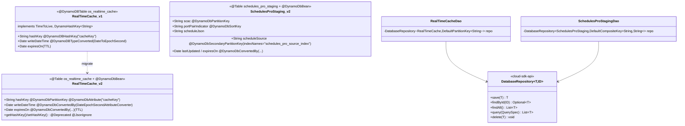
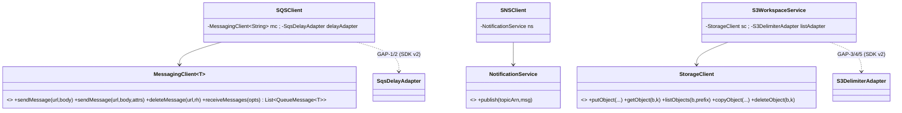
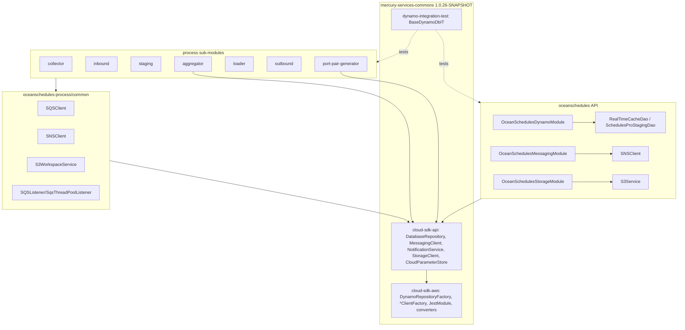
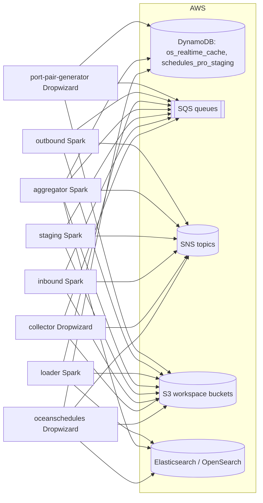
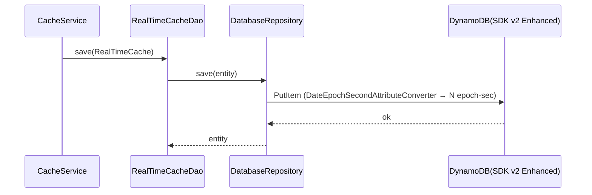
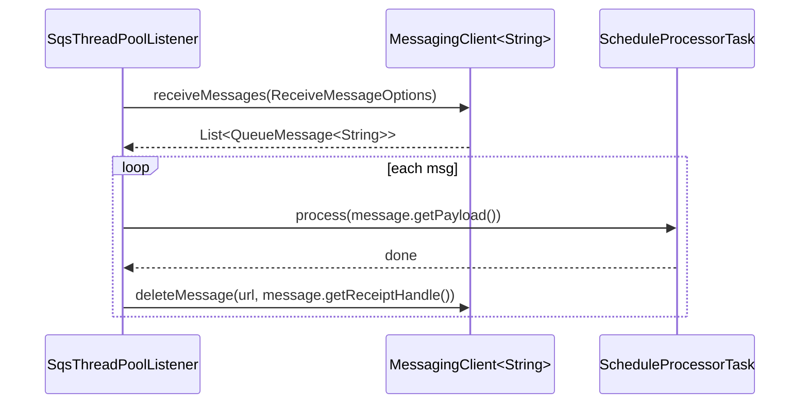
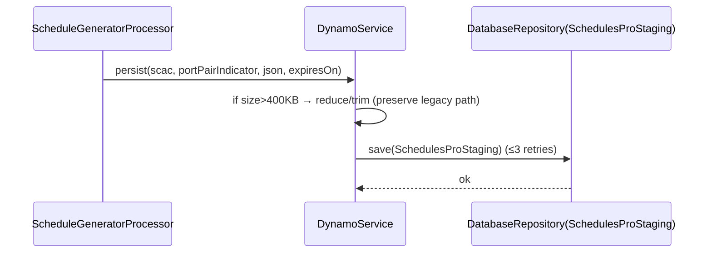
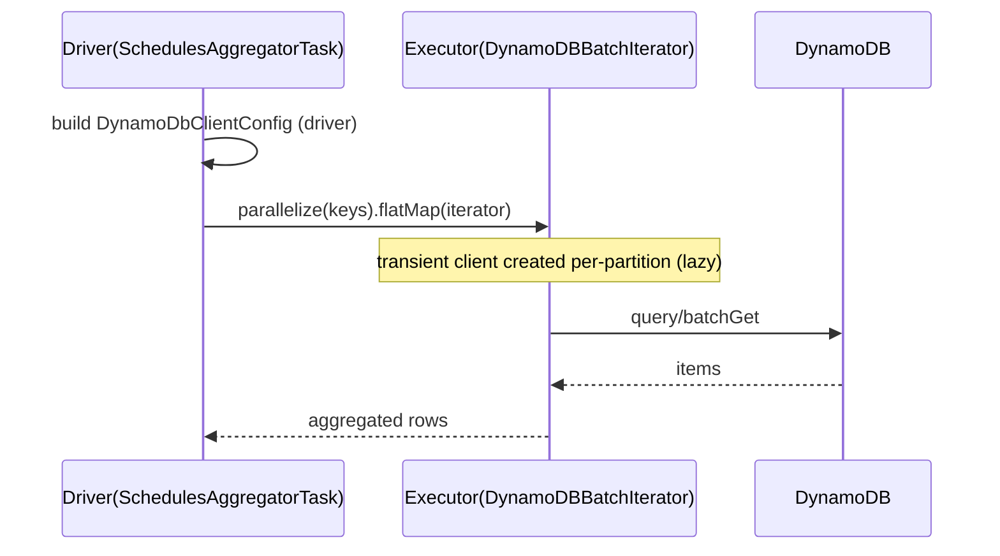

# Ocean Schedules — AWS SDK 2.x Upgrade Design (ION-11462)

> **Date**: 2026-05-31 · **Agent**: Copilot CLI — Claude Opus 4.8 · **Branch**: `feature/ION-11462-os-aws-upgrade-copilot`
> **Companion plan**: `oceanschedules-process/docs/2026-05-31-os-aws-upgrade-plan.md` (peer-reviewed)
> **Commons/cloud-sdk version**: `1.0.26-SNAPSHOT` · **Reference module**: `booking`
> **Session**: `5438b56c73c04f94`

## 1. Executive Summary

Migrate the `oceanschedules` (Dropwizard REST API) and `oceanschedules-process` (8 Spark/Dropwizard batch sub-modules) from **AWS SDK v1** (`dynamo-client`, `com.amazonaws.*`) to **cloud-sdk-api + cloud-sdk-aws** (AWS SDK v2). Approach: vendor-neutral interfaces (`DatabaseRepository`, `MessagingClient`, `NotificationService`, `StorageClient`) injected via Guice modules, mirroring `booking`. Migrate `common` first (shared by the 7 process sub-modules), keep the build green per-commit by adding cloud-sdk deps additively then removing v1 deps only after each unit is fully migrated.

Four real cloud-sdk gaps are handled with in-module SDK v2 adapters and raised as commons change-requests (§11): SQS delay-send, SQS large-payload (extended client), S3 delimiter/sub-folder listing + batch delete, and S3 multipart/transfer upload. SSM is **out of scope** (no code uses it; only unused deps are removed).

## 2. Class Diagrams

### 2.1 DynamoDB entity & DAO migration



### 2.2 Client wrappers (SQS/SNS/S3)



## 3. Component Diagram



## 4. Deployment Diagram



## 5. Sequence Diagrams

### 5.1 API write (RealTimeCacheDao.save)


### 5.2 Inbound SQS consume (QueueMessage)


### 5.3 port-pair-generator write (low-level → repository)


### 5.4 Aggregator Spark + DynamoDB (executor-safe)


## 6. Maven Dependency Changes

Per unit, add (additive first):
```xml
<dependency><groupId>com.inttra.mercury</groupId><artifactId>cloud-sdk-api</artifactId><version>${mercury.commons.version}</version></dependency>
<dependency><groupId>com.inttra.mercury</groupId><artifactId>cloud-sdk-aws</artifactId><version>${mercury.commons.version}</version></dependency>
<dependency><groupId>com.inttra.mercury</groupId><artifactId>dynamo-integration-test</artifactId><version>${mercury.commons.version}</version><scope>test</scope></dependency>
```
Set `<mercury.commons.version>1.0.26-SNAPSHOT</mercury.commons.version>`. After migration, remove per unit: `dynamo-client` (oceanschedules), and the direct `com.amazonaws:aws-java-sdk-*` deps (common: sqs + extended; aggregator: dynamodb + **ssm(unused)**; loader: sqs/s3/sns; outbound: sqs/sns/s3/core + **ssm(unused)**; port-pair-generator: dynamodb).

## 7. Key Classes & Functions

| Class | Module | Responsibility | Notes |
|---|---|---|---|
| `RealTimeCache`, `SchedulesProStaging` | oceanschedules | SDK v2 `@DynamoDbBean` entities | remove unused `<T>`; keep `getHashKey/setHashKey` |
| `DateEpochSecondAttributeConverter` | oceanschedules (or reuse commons) | `Date ↔ N(epoch-sec)` | null/string-N/epoch-0 tolerant |
| `RealTimeCacheDao`, `SchedulesProStagingDao` | oceanschedules | hold `DatabaseRepository` | composite key uses `DefaultCompositeKey<String,String>` |
| `OceanSchedulesDynamoModule/MessagingModule/StorageModule` | oceanschedules | Guice provider modules | booking `BookingDynamoModule` pattern |
| `SQSClient` | common + collector/ppg | wrap `MessagingClient<String>` + `SqsDelayAdapter` | GAP-1/2 |
| `SNSClient` | common + oceanschedules | wrap `NotificationService` | |
| `S3WorkspaceService`, `S3Service`, `MultiPartUploader` | common + oceanschedules | wrap `StorageClient` + `S3DelimiterAdapter`/transfer | GAP-3/4/5 |
| `DynamoSparkService`, `DynamoDBBatchIterator` | aggregator | per-partition transient client | executor-safe |
| `DynamoService` | port-pair-generator | `repository.save(entity)` | preserve 400KB/retry path |

## 8. Configuration

Each Dropwizard config (`OceanSchedulesConfig`, collector, ppg) gains:
```yaml
dynamoDbConfig:
  environment: "inttra_<env>_os"   # drives table prefix
  region: "us-east-1"
  sseEnabled: true
```
mapped to `com.inttra.mercury.cloudsdk.database.config.BaseDynamoDbConfig`. Spark sub-modules construct `DynamoDbClientConfig` programmatically from job args/region. Envs: `cvt`, `int`, `qa`, `prod`.

## 9. Testing Strategy

- **Unit** (JUnit 5 + Mockito + AssertJ): converters (parameterized v1/v2/null/epoch-0), Guice modules, DAOs (mock `DatabaseRepository`), client wrappers (mock cloud-sdk), adapters (mock SDK v2). Every new public method covered.
- **Integration** (`BaseDynamoDbIT`, DynamoDB Local): `RealTimeCacheDaoIT`, `SchedulesProStagingDaoIT` (composite + GSI + TTL), port-pair-generator `DynamoServiceIT`. Pre-populate legacy epoch-sec fixtures; assert no `unconvert` exceptions + round-trip equality.
- Per-module `mvn -pl <unit> -am verify`; final aggregate verify + startup smoke.

## 10. Data Format Backward Compatibility

Dates are epoch **seconds** in `N`. `DateEpochSecondAttributeConverter` handles `N↔Date`, null/missing, string-encoded `N`, epoch 0. JSON string fields unchanged. TTL `expiresOn` stays epoch-sec. ITs read legacy fixtures to prove compatibility (booking lesson).

## 11. cloud-sdk Gap / Commons Change Requests (full implementation-ready specs)

This section is the authoritative, self-contained backlog of changes required in the
`mercury-services-commons` repository (`cloud-sdk-api` + `cloud-sdk-aws`) to let
oceanschedules / oceanschedules-process migrate **without** any in-module AWS SDK v2
glue code. Each gap below lists: the consuming OS call-site(s), the proposed API
surface (exact signatures + target file), the `cloud-sdk-aws` implementation approach,
config/wiring impact, the required commons tests, and the interim in-module workaround
that keeps this branch green until commons ships the change.

> Repo: `C:\Users\arijit.kundu\projects\mercury-services-commons`
> Modules: `cloud-sdk-api` (interfaces/models), `cloud-sdk-aws` (AWS SDK v2 impls + factories).
> Tracking: each interim workaround carries a `// TODO(ION-11462): requires commons change GAP-n` marker.

### GAP-1 — SQS send with `DelaySeconds`

- **Consuming call-sites**: `oceanschedules-process/common` `SQSClient.sendMessage(target, content, delaySeconds)` used by retry/backoff re-queue paths in `collector` and `port-pair-generator`.
- **API gap**: `MessagingClient<T>` exposes `sendMessage(url, body)` and `sendMessage(url, body, Map<String,String> attributes)` but **no** delay-seconds overload.
- **Proposed `cloud-sdk-api`** (`com/inttra/mercury/cloudsdk/messaging/api/MessagingClient.java`):
  ```java
  /** Sends a message that becomes visible only after {@code delaySeconds} (0–900). */
  void sendMessage(String queueUrl, T body, int delaySeconds);
  ```
- **Proposed `cloud-sdk-aws`**: in the SDK v2 `SqsMessagingClient` impl, set `SendMessageRequest.builder().delaySeconds(delaySeconds)`; validate `0 <= delaySeconds <= 900` (throw `IllegalArgumentException` otherwise).
- **Wiring**: none new — reuses the existing `MessagingClientFactory` / Guice provider.
- **Commons tests**: unit asserting `delaySeconds` propagated to the request; boundary tests for `0`, `900`, and out-of-range rejection.
- **Interim (in-module)**: `SqsDelayAdapter` wrapping SDK v2 `software.amazon.awssdk.services.sqs.SqsClient` in `oceanschedules-process/common`, injected alongside `MessagingClient`; `// TODO(ION-11462): requires commons change GAP-1`.

### GAP-2 — SQS large-payload (extended) client (>256 KB via S3 offload)

- **Consuming call-sites**: `collector` `OceanSchedulesCollectorModule` (~line 50) and `port-pair-generator` (~line 60) build `AmazonSQSExtendedClient` (`amazon-sqs-java-extended-client-lib:1.2.6`) for payloads exceeding the 256 KB SQS limit. (The dep is declared in `common/pom.xml` but the wiring lives in those two modules.)
- **API gap**: `cloud-sdk-api`/`cloud-sdk-aws` have **no** large-payload offloading support.
- **Proposed `cloud-sdk-aws`**: optional SDK v2 payload-offloading wrapper (`software.amazon.payloadoffloading:payloadoffloading-common` + `amazon-sqs-java-extended-client-lib` v2 line) created by the messaging factory **only when** a new config field `largePayloadBucket` is present; transparently offloads/inlines payloads.
- **Config**: add `largePayloadBucket` (+ optional `alwaysThroughS3`) to the messaging client config; default off → behaviour unchanged for all current callers.
- **Commons tests**: integration round-trip of a >256 KB payload proving S3 offload + transparent retrieval; small-payload test proving no S3 round-trip when under the threshold.
- **Interim (in-module)**: keep the SDK v2 extended-client adapter local to `collector` and `port-pair-generator`; `// TODO(ION-11462): requires commons change GAP-2`.

### GAP-3 — S3 delimiter listing (sub-folders / common prefixes) + batch delete

- **Consuming call-sites**: `oceanschedules` `S3Service.listSubFolders(bucket, folder)` (uses `ListObjectsRequest.withDelimiter("/")` → `objectListing.getCommonPrefixes()`, with truncation paging up to 100 000 prefixes) and `S3Service.deleteFolder(...)` (lists then **batch**-deletes via `DeleteObjectsRequest` up to 1 000 keys/call, with truncation paging). Same pattern duplicated in `oceanschedules-process/common`.
- **API gap**: `StorageClient.listObjects(bucket, keyPrefix)` returns flat `List<StorageObject>` with **no** delimiter / common-prefix support; `deleteObject` is single-key only — **no** batch delete.
- **Proposed `cloud-sdk-api`** (`com/inttra/mercury/cloudsdk/storage/api/StorageClient.java`):
  ```java
  /** Returns the common prefixes (sub-folders) directly under {@code prefix}, split on {@code delimiter}. */
  List<String> listSubFolders(String bucket, String prefix, String delimiter);

  /** Deletes the given keys in batches (≤1000/request); returns the count actually deleted. */
  int deleteObjects(String bucket, List<String> keys);
  ```
- **Proposed `cloud-sdk-aws`**: impl over SDK v2 `S3Client`: `listObjectsV2(b -> b.delimiter(delimiter).prefix(prefix))` paginated via `listObjectsV2Paginator`, collecting `CommonPrefix#prefix`; batch delete via `deleteObjects(DeleteObjectsRequest)` chunked into ≤1000-key `Delete` blocks, summing `DeleteObjectsResponse.deleted()`.
- **Commons tests**: IT (S3 mock / localstack) — nested-prefix fixture asserts only immediate sub-folders returned; truncation paging across >1000 objects; batch delete of >1000 keys spanning multiple requests.
- **Interim (in-module)**: `S3DelimiterAdapter` wrapping SDK v2 `S3Client` in `oceanschedules` + `common`, providing `listSubFolders` / batch-delete; `// TODO(ION-11462): requires commons change GAP-3`.

### GAP-4 — S3 multipart / transfer-manager upload for large objects

- **Consuming call-sites**: `oceanschedules-process/common` `MultiPartUploader` (low-level S3 multipart API) and `oceanschedules` `S3Service` / `AWSUtil` (v1 `TransferManager`) upload large schedule artifacts.
- **API gap**: `StorageClient.putObject(File)` exists but there is **no** explicit multipart / `S3TransferManager` API for very large / parallelised uploads with progress + automatic part sizing.
- **Proposed `cloud-sdk-api`** (`StorageClient.java`):
  ```java
  /** Uploads a (potentially large) file using managed multipart transfer. */
  void putLargeObject(String bucket, String key, File file);
  ```
- **Proposed `cloud-sdk-aws`**: impl via SDK v2 `software.amazon.awssdk.transfer.s3.S3TransferManager#uploadFile`, sharing the module’s async S3 client; tune `minimumPartSizeInBytes` via existing storage config.
- **Commons tests**: IT uploading a >5 MB file (forces ≥2 parts) and asserting object size + ETag/round-trip equality.
- **Interim (in-module)**: prefer `StorageClient.putObject(File)`; if insufficient, a local `S3TransferManager` adapter in `common`; `// TODO(ION-11462): requires commons change GAP-4`.

### GAP-5 — (resolved) SSM is NOT a gap

- No `AWSSimpleSystemsManagement` usage exists anywhere in OS. `aws-java-sdk-ssm` is an **unused** transitive/declared dep in `outbound` (1.12.773) and `aggregator` (1.12.638). Parameter-store access is handled by commons `com.inttra.mercury.config.ParameterStoreLookup` (out of scope). **Action**: simply remove the unused `aws-java-sdk-ssm` deps; no commons change required.

### GAP-6 — Arbitrary conditional write (compare-and-set lock)

- **Consuming call-site**: `oceanschedules` `RealTimeCacheDao.acquireLock(realTimeCache)` performs a **conditional** `DynamoDBMapper.save` with `ExpectedAttributeValue(LOCKED).withComparisonOperator(NE)` — i.e. "put only if attribute `locked` ≠ `LOCKED`" — catching `ConditionalCheckFailedException` to signal lock contention. This is a generic compare-and-set, **not** put-if-absent.
- **API gap**: `DatabaseRepository` exposes `save`, `saveIfNotExist`, `findById`, `findAll`, `query`, `delete` — there is **no** generic conditional put with a caller-supplied predicate. `saveIfNotExist` only covers `attribute_not_exists(PK)`.
- **Proposed `cloud-sdk-api`** (`com/inttra/mercury/cloudsdk/database/api/DatabaseRepository.java` + a new `ConditionSpec` model in `com/inttra/mercury/cloudsdk/database/api/condition/`):
  ```java
  /**
   * Conditionally persists {@code entity}. Returns the saved entity when the
   * condition holds, or {@link Optional#empty()} when the condition fails
   * (i.e. the underlying conditional check was not met).
   */
  <S extends T> Optional<S> saveIf(S entity, ConditionSpec condition);
  ```
  where `ConditionSpec` is a small fluent model translating to a DynamoDB condition, e.g.
  `ConditionSpec.attribute("locked").ne(CloudAttributeValue.ofString("LOCKED"))`,
  composable with `.and(...)` / `.or(...)` / `attributeNotExists(name)`.
- **Proposed `cloud-sdk-aws`**: impl maps `ConditionSpec` to an enhanced-client
  `software.amazon.awssdk.enhanced.dynamodb.Expression` and runs
  `DynamoDbTable#putItem(PutItemEnhancedRequest.builder().item(e).conditionExpression(expr))`;
  catch `software.amazon.awssdk.services.dynamodb.model.ConditionalCheckFailedException`
  → return `Optional.empty()` (no rethrow), any other error rethrown as the standard
  cloud-sdk persistence exception.
- **Commons tests**: unit translating each `ConditionSpec` operator → `Expression`
  (`<>`, `attribute_not_exists`, AND/OR); IT (DynamoDB Local) — first `saveIf` succeeds,
  a second contending `saveIf` returns empty (lock held), and a `saveIf` after the
  condition clears succeeds again.
- **Interim (in-module)**: a small SDK v2 enhanced-client adapter in `oceanschedules`
  (`RealTimeCacheConditionalWriter`) injected alongside the `DatabaseRepository`,
  performing the `putItem` with `Expression.builder().expression("attribute_not_exists(#l) OR #l <> :locked")...`;
  `// TODO(ION-11462): requires commons change GAP-6`.

### GAP-7 — Table provisioning / TTL enablement helper (DDL)

- **Consuming call-site**: `oceanschedules` `DynamoTableCommand` (a Dropwizard `AbstractDynamoCommand`) provisions tables and enables TTL at deploy time: it uses v1 `DynamoDBMapper.generateCreateTableRequest`, `TableUtils.createTableIfNotExists/waitUntilActive`, `BillingMode.PAY_PER_REQUEST`, `SSESpecification`, and `updateTimeToLive` keyed on `TimeToLive.EXPIRES_ON_ATTRIBUTE_NAME`; it also waits for GSI back-fill to become `ACTIVE`.
- **API gap**: the enhanced-client repository created by `DynamoRepositoryFactory.createEnhancedRepository(...)` can create a table from the bean schema, but there is **no** cloud-sdk surface for: (a) PAY_PER_REQUEST + SSE table creation **with wait-until-active**, (b) **enable TTL** on a named attribute, or (c) **await GSI ACTIVE/back-fill**. (Reference modules largely rely on infra-provisioned tables, so this DDL path was not previously needed.)
- **Proposed `cloud-sdk-aws`** (new admin helper, e.g. `com/inttra/mercury/cloudsdk/database/admin/DynamoTableAdmin`):
  ```java
  void createTableIfNotExists(Class<?> beanType, String tableName, boolean sseEnabled, BillingModeSpec billing);
  void enableTtlIfNotEnabled(String tableName, String ttlAttribute);
  void awaitGsiActive(String tableName, Duration timeout);
  ```
  built over SDK v2 `DynamoDbEnhancedClient` (`createTable` from `TableSchema`) + low-level `DynamoDbClient` (`updateTimeToLive`, `describeTimeToLive`, `describeTable` GSI polling, `DynamoDbWaiter`).
- **Commons tests**: IT (DynamoDB Local) — create-if-not-exists is idempotent, TTL toggled only when disabled, GSI wait returns once `ACTIVE`.
- **Interim (in-module)**: keep `DynamoTableCommand` on a **local SDK v2** `DynamoDbClient` + `DynamoDbEnhancedClient` adapter (`OsTableProvisioner`) replicating create/TTL/GSI-wait; `// TODO(ION-11462): requires commons change GAP-7`. (This is deploy-time tooling, not request-path code, so the local adapter is low-risk.)

### Gap → consuming call-site quick map

| Gap | cloud-sdk module | OS module(s) | Primary call-site |
|---|---|---|---|
| GAP-1 SQS delay send | api+aws | process/common, collector, port-pair-generator | `SQSClient.sendMessage(t,c,delay)` |
| GAP-2 SQS large payload | aws | collector, port-pair-generator | `*Module` extended-client wiring |
| GAP-3 S3 delimiter list + batch delete | api+aws | oceanschedules, process/common | `S3Service.listSubFolders` / `deleteFolder` |
| GAP-4 S3 multipart/transfer | api+aws | process/common, oceanschedules | `MultiPartUploader`, `S3Service`/`AWSUtil` |
| GAP-5 SSM (non-gap) | — | outbound, aggregator | remove unused `aws-java-sdk-ssm` dep |
| GAP-6 conditional write | api+aws | oceanschedules | `RealTimeCacheDao.acquireLock` |
| GAP-7 table/TTL DDL helper | aws | oceanschedules | `DynamoTableCommand` |

## 12. Change Log (kept updated during implementation)

| # | File | Type | Status |
|---|---|---|---|
| — | `oceanschedules-process/docs/2026-05-31-os-aws-upgrade-plan.md` | create | done (peer-reviewed) |
| — | `oceanschedules/docs/2026-05-31-os-aws2x-upgrade-design-copilot.md` | create | done (this doc) |
| — | branch `feature/ION-11462-os-aws-upgrade-copilot` | create | done |
| 1 | `oceanschedules/pom.xml` | edit (additive cloud-sdk deps, keep dynamo-client) | done — compiles offline |
| 2 | `oceanschedules/docs/...-design-copilot.md` §11 | edit (gap section expanded to implementation-ready specs; added GAP-7 table/TTL DDL helper + gap→call-site map) | done |
| 3 | oceanschedules main sources (modules/config/util/service/client) | edit (SDK v1 → cloud-sdk / SDK v2) | done — interim commit `7e0138f961` |
| 4 | `oceanschedules/src/test/.../s3/S3ServiceTest.java`, `service/CarrierServiceTest.java` | edit (rewrite to SDK v2 `S3Client`/`S3Object`) | done — 572 unit tests green |
| 5 | `oceanschedules/src/test/.../sns/SNSClientTest.java` | edit (stray-brace compile fix) | done |
| 6 | `oceanschedules/conf/{cvt,int,prod,qa}/config.yaml` | edit (add `region: us-east-1` to `dynamoDbConfig`) | done |
| 7 | `oceanschedules/src/test/.../persistence/cache/RealTimeCacheDaoIT.java` | create (DynamoDB Local IT, simple PK + GAP-6 lock) | done — 7 tests green |
| 8 | `oceanschedules/src/test/.../persistence/portpair/SchedulesProStagingDaoIT.java` | create (DynamoDB Local IT, composite key + GSI) | done — 4 tests green |
| 9 | `oceanschedules/pom.xml` | edit (exclude stale `aws-java-sdk-dynamodb` from `integration-test-commons`; GAP-7 resolution) | done — DynamoDB Local 2.5.2 starts |

### GAP-7 resolution

GAP-7 (table/TTL DDL helper) is handled in-module by `DynamoTableCommand` using a
local SDK v2 `DynamoDbClient` + `DynamoDbEnhancedClient` adapter — deploy-time
tooling only, not request-path code. During IT bring-up a transitive dependency
clash surfaced: `integration-test-commons:1.0` pins `aws-java-sdk-dynamodb:1.12.638`
(missing `OnDemandThroughput`), which prevented **DynamoDB Local 2.5.2** from
starting (`NoClassDefFoundError`). Resolved by excluding the stale
`aws-java-sdk-dynamodb` from `integration-test-commons` so DynamoDB Local's
required `1.12.721` wins mediation. All integration tests pass.

*(Remaining implementation rows appended as code lands for the 8 `oceanschedules-process` sub-modules.)*

---
*End of design.*
