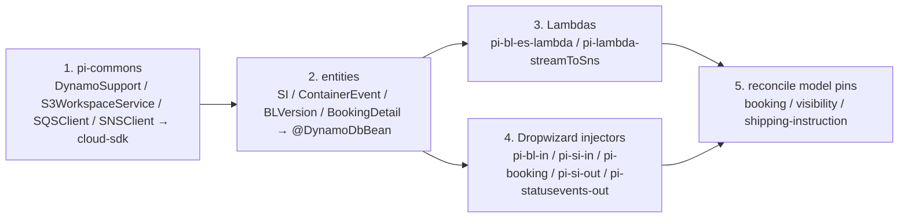
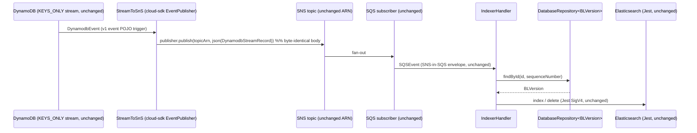

# Partner Integrator — AWS SDK 2.x (cloud-sdk) Upgrade Design (Parent / Suite Playbook)

**Module:** `partner-integrator` (Maven aggregator / parent POM)
**Date:** 2026-06-30
**Status:** Target design (AWS SDK 1.x → AWS SDK 2.x via **cloud-sdk**) — **NOT STARTED**
**Companion:** `2026-06-30-partner-integrator-current-state-DESIGN-claude.md`
**Reference upgrades:** `booking`, `visibility` (S3 + DynamoDB + SNS/SQS done); `network` / `registration` / `auth` (DynamoDB DAO patterns)

> This parent document is the **suite-wide cloud-sdk playbook** for all 8 sub-modules. It fixes the shared patterns,
> the upgrade sequencing, and the backward-compatibility mandate. Each sub-module's own `aws2x` doc applies these
> patterns to its concrete classes; the per-sub-module class lists below are the authoritative scope split.

---

## 1. Change Overview & Backward-Compatibility Mandate

The suite uses **DynamoDB (ORM), S3, SNS, SQS** — all on AWS SDK v1 (`com.amazonaws` `1.12.715`) — plus AWS Lambda v1
event POJOs (`aws-lambda-java-events`). Non-AWS integrations (**IBM MQ, Oracle, Appian, Elasticsearch/Jest**) are **out
of scope** of this AWS-SDK upgrade and must keep working unchanged.

| AWS service | Current (v1) | Target (cloud-sdk / v2) | In scope |
|-------------|--------------|--------------------------|:--:|
| S3 | `AmazonS3` / `AmazonS3ClientBuilder` (`S3WorkspaceService`) | `StorageClient` + `StorageClientFactory` | ✓ |
| DynamoDB ORM | `DynamoDBMapper` + `@DynamoDB*` annotations + `DynamoDBMapperConfig` table resolver | Enhanced client: `DatabaseRepository<T,K>` + `@DynamoDbBean`/`@Table` + `DynamoRepositoryFactory` | ✓ |
| DynamoDB converters | `DynamoDBTypeConverter` (`CompressionConverter`, `DateToEpochSecond`) | `software.amazon.awssdk.enhanced.dynamodb.AttributeConverter` | ✓ |
| SNS | `AmazonSNS` / `PublishRequest` (`SNSClient`/`SNSEventPublisher`, lambdas) | `EventPublisher` + `NotificationClientFactory` | ✓ |
| SQS | `AmazonSQS` / `SendMessageRequest`/`ReceiveMessageRequest`/`DeleteMessageRequest` (`SQSClient`, `SQSListener*`) | `MessagingClient<String>` + `MessagingClientFactory` | ✓ |
| Lambda event POJOs | `aws-lambda-java-events` 2.0.1/2.2.2/3.13.0 (`DynamodbEvent`, `SQSEvent`, `SNSEvent`, `OperationType`) | Keep as the trigger contract; normalize versions; move *client* calls to v2 | ✓ (clients) |
| Parameter Store | `${awsps:…}` via commons | unchanged | — |
| Elasticsearch | Jest + SigV4 (`JestModule`) | OpenSearch Java client — **separate track** | ✗ |
| IBM MQ / Oracle / Appian | — | unchanged | ✗ |

**Backward-compatibility (hard contracts):**

1. **DynamoDB table names** must stay identical after env-prefixing: `<prefix>_bill_of_lading`, `<prefix>_si`,
   `<prefix>_container_events`, and the special `<prefix>_booking_<table>` resolution for `BookingDetail`. Preserve the
   prefix logic in `SEFeedApplicationInjector.getNewDynamoDBMapperConfig` (the `_booking` segment) when moving to
   `DynamoRepositoryConfig`/`getTablePrefix()`.
2. **Key schema + GSIs:** `id` (hash) / `sequenceNumber` (auto-gen range) on `si`/`bill_of_lading`; `id` (hash) on
   `container_events`; GSI `INTTRA_REFERENCE_NUMBER_INDEX` on `siInttraReferenceNumber` (SI) and `blInttraReferenceNumber` (BL).
3. **Auto `sequenceNumber`** format `m_{currentTimeMillis}_{state}` (`@DynamoDBAutoGeneratedKey`) — must be reproduced.
4. **`@DynamoDBStream(KEYS_ONLY)`** view type on `si`/`container_events`/`bill_of_lading` — the stream feeds the relay
   Lambdas; do not change the view type.
5. **On-disk attribute encodings:** `CompressionConverter` (gzip/base64 of the `message` payload) and `DateToEpochSecond`
   (epoch-second numeric `expiresOn`) must produce byte-identical stored values under the v2 `AttributeConverter`.
6. **Wire envelopes:** the SNS message body is the **JSON-serialized `DynamodbStreamRecord`**; the ES indexer parses an
   SNS-in-SQS envelope. SQS message bodies (file/rest/watermill delivery) and the SNS CE event JSON must stay identical.

### Upgrade sequencing (critical)



1. **`pi-commons` first** — it owns the shared DynamoDB/S3/SQS/SNS surface; every Dropwizard sub-module inherits the fix.
2. **Shared entities** (`vo.SI`, `vo.ContainerEvent`, BL `BLVersion`, `BookingDetail`) — annotation migration + converters.
3. **Lambdas** (`pi-bl-es-lambda`, `pi-lambda-streamToSns`) — they don't depend on `pi-commons`; migrate independently.
4. **Dropwizard processor injectors** — swap Guice bindings to cloud-sdk factories.
5. **Reconcile inter-module pins** with cloud-sdk-bearing model versions.

---

## 2. Shared Maven Dependency Changes

Apply per sub-module (verify the exact cloud-sdk line in current booking/visibility poms — shown as `1.0.26-SNAPSHOT`):

```diff
  <properties>
-   <mercury.commons.version>1.R.01.023</mercury.commons.version>
-   <mercury.dynamodbclient.version>1.R.01.023</mercury.dynamodbclient.version>
-   <aws.java.sdk.version>1.12.715</aws.java.sdk.version>
+   <mercury.commons.version>1.0.26-SNAPSHOT</mercury.commons.version>   <!-- cloud-sdk-bearing line -->
  </properties>

    <!-- pi-commons / consumers: drop direct v1, add cloud-sdk -->
-   <dependency><groupId>com.amazonaws</groupId><artifactId>aws-java-sdk-dynamodb</artifactId><version>${aws.java.sdk.version}</version></dependency>
-   <dependency><groupId>com.inttra.mercury</groupId><artifactId>dynamo-client</artifactId><version>${mercury.dynamodbclient.version}</version></dependency>
+   <dependency><groupId>com.inttra.mercury</groupId><artifactId>cloud-sdk-api</artifactId><version>${mercury.commons.version}</version></dependency>
+   <dependency><groupId>com.inttra.mercury</groupId><artifactId>cloud-sdk-aws</artifactId><version>${mercury.commons.version}</version></dependency>

    <!-- tests: enhanced-client IT harness + keep v1 dynamodb test-scoped for DynamoDB-Local -->
+   <dependency><groupId>com.inttra.mercury</groupId><artifactId>dynamo-integration-test</artifactId><version>${mercury.commons.version}</version><scope>test</scope></dependency>
+   <dependency><groupId>com.amazonaws</groupId><artifactId>aws-java-sdk-dynamodb</artifactId><scope>test</scope></dependency>

    <!-- pi-lambda-streamToSns: drop direct v1 SNS, add cloud-sdk -->
-   <dependency><groupId>com.amazonaws</groupId><artifactId>aws-java-sdk-sns</artifactId><version>1.12.715</version></dependency>
+   <dependency><groupId>com.inttra.mercury</groupId><artifactId>cloud-sdk-api</artifactId><version>${mercury.commons.version}</version></dependency>
+   <dependency><groupId>com.inttra.mercury</groupId><artifactId>cloud-sdk-aws</artifactId><version>${mercury.commons.version}</version></dependency>
```

- **Normalize `aws-lambda-java-events`** to one version across `pi-bl-es-lambda` (2.2.2), `pi-lambda-streamToSns` (2.2.2),
  `pi-bl-in-processor` (2.2.2), `pi-si-out-processor` (2.0.1), `pi-statusevents-out-processor` (3.13.0) — pick one in
  parent `dependencyManagement`. Lambda event POJOs stay (they are the trigger contract).
- Keep `com.ibm.mq.allclient` 9.4.4.1, `ojdbc10`, `elasticsearch` 8.17.0, `dropwizard-jdbi3` unchanged.
- HTTP client moves from Netty (v1/transitive) to **Apache HTTP** (cloud-sdk default) — confirm no Netty pin remains.
- The `com.github.platform-team:aws-maven:6.0.0` build extension (S3 Maven wagon for model artifacts) is **unchanged**.

---

## 3. Shared Configuration Changes

The `dynamoDbConfig` block keeps its semantics (env prefix + capacity + `sseEnabled`) but binds to cloud-sdk
`BaseDynamoDbConfig`; add an explicit `region`. SQS/SNS URLs/ARNs and the S3 workspace bucket are **unchanged**.

```diff
  dynamoDbConfig:
    readCapacityUnits: 25
    writeCapacityUnits: 25
    environment: inttra2_prod         # table prefix — MUST be preserved (and `_booking` segment for BookingDetail)
    sseEnabled: false
+   region: us-east-1                 # cloud-sdk requires explicit region

  s3WorkspaceConfig:
    bucket: inttra2-pr-workspace      # unchanged
  sqsPickupConfig:
    queueUrl: https://sqs.us-east-1.amazonaws.com/642960533737/inttra2_pr_sqs_pi_statusevents   # unchanged
  txTrackingEventTopicArn: arn:aws:sns:us-east-1:642960533737:inttra2_pr_sns_event_ce            # unchanged
```

Config-class field type changes: `dynamoDbConfig` field type changes from `com.inttra.mercury.dynamo.respository.module.DynamoDbConfig`
to the cloud-sdk `BaseDynamoDbConfig` in each `*ApplicationConfig`. The Lambdas keep reading env vars (`dynamoDbEnvironment`,
`snsTopicArn`, `allEventsSnsTopicArn`, `elasticsearchEndpointUrl`, `AWS_DEFAULT_REGION`).

---

## 4. Per-Service Spec (Before v1 / After cloud-sdk)

### 4.1 S3 — `S3WorkspaceService` (pi-commons)

**Before (v1):**
```java
@Singleton
public class S3WorkspaceService implements WorkspaceService {
    private final AmazonS3 s3Client;          // injected; AmazonS3ClientBuilder.standard().build()
    public PutObjectResult putObject(String bucket, String fileName, String content) {
        return s3Client.putObject(bucket, fileName, content);
    }
    public String getContent(String bucket, String fileName) {
        S3Object o = s3Client.getObject(new GetObjectRequest(bucket, fileName));
        return read(o.getObjectContent());
    }
}
```

**After (cloud-sdk):**
```java
@Singleton
public class S3WorkspaceService implements WorkspaceService {
    private final StorageClient storage;      // StorageClientFactory.createDefaultS3Client()
    public void putObject(String bucket, String fileName, String content) {
        storage.putObject(bucket, fileName, content);
    }
    public String getContent(String bucket, String fileName) {
        return storage.getObject(bucket, fileName);   // verify exact getObject signature in booking
    }
}
```
> **Gap call-out:** the v1 `copyObjectWithMetaDate` / `putObjectWithMetaData` (user metadata maps) and
> `copyS3FileToFileSystem` streaming must have cloud-sdk equivalents — verify `StorageClient` exposes metadata + copy;
> if not, this is a known gap to raise (booking only round-trips plain objects). Preserve the `RecoverableException`
> wrapping of `SdkClientException`.

### 4.2 DynamoDB ORM — entities + `DynamoSupport` + DAOs

**Before (v1 ORM, `vo.SI`):**
```java
@DynamoDBTable(tableName = "si")
@DynamoDBStream(StreamViewType.KEYS_ONLY)
public class SI implements Expires, DynamoHashAndSortKey<String,String> {
    @DynamoDBHashKey  @DynamoDBAttribute(attributeName="id")          public String getHashKey() {...}
    @DynamoDBRangeKey @DynamoDBAutoGeneratedKey
    @DynamoDBAttribute(attributeName="sequenceNumber")                public String getSortKey() {...}
    @DynamoDBIndexHashKey(globalSecondaryIndexName=INTTRA_REFERENCE_NUMBER_INDEX) String siInttraReferenceNumber;
    @DynamoDBTypeConverted(converter=CompressionConverter.class)      String message;
    @DynamoDBTypeConverted(converter=DateToEpochSecond.class)         Date expiresOn;
}
// DynamoSupport: AmazonDynamoDB + DynamoDBMapper + DynamoDBMapperConfig table-name resolver (prefix + tableName)
```

**After (cloud-sdk enhanced client):**
```java
@DynamoDbBean
@Table(name = "si")   // com.inttra.mercury.cloudsdk.database.annotation.Table
public class SI implements Expires {
    @DynamoDbPartitionKey                                              public String getId() {...}
    @DynamoDbSortKey                                                   public String getSequenceNumber() {...}  // app-generated m_{ts}_{state}
    @DynamoDbSecondaryPartitionKey(indexNames = INTTRA_REFERENCE_NUMBER_INDEX) public String getSiInttraReferenceNumber() {...}
    @DynamoDbConvertedBy(CompressionAttributeConverter.class)          public String getMessage() {...}
    @DynamoDbConvertedBy(EpochSecondAttributeConverter.class)          public Date getExpiresOn() {...}
}
// DAO: DatabaseRepository<SI,Key> from DynamoRepositoryFactory.createEnhancedRepository(cfg, tableName, SI.class, repoCfg)
//      tableName = cfg.getTablePrefix() + "si"  (keep the SEFeed `_booking` special-case for BookingDetail)
```
> **`@DynamoDBAutoGeneratedKey` has no enhanced-client equivalent** — reproduce the `m_{currentTimeMillis}_{state}`
> sort-key generation in the entity constructor / a `save()` wrapper. The `@DynamoDbBean` enhanced client requires a
> no-arg constructor and standard getters/setters (Lombok `@Data` is fine; drop the `DynamoHashAndSortKey` getHashKey/getSortKey indirection).
>
> **Converter parity is the critical wire-compat point:** `CompressionAttributeConverter` must emit the exact same
> compressed/encoded `String` as `CompressionConverter`; `EpochSecondAttributeConverter` must write `expiresOn` as the
> same numeric epoch-second `AttributeValue` (`N`) as `DateToEpochSecond`. Add a round-trip test against a stored value.

### 4.3 SNS — `SNSClient`/`SNSEventPublisher` + relay Lambdas

**Before (v1):**
```java
// SEFeedApplicationInjector
bind(AmazonSNS.class).toInstance(AmazonSNSClientBuilder.standard().build());
@Provides EventPublisher createEventPublisher(SEFeedApplicationConfig cfg, SNSClient snsClient) {
    return new SNSEventPublisher(cfg.getTxTrackingEventTopicArn(), snsClient);
}
// StreamToSnSProcessor
snsClient = AmazonSNSClientBuilder.defaultClient();
snsClient.publish(new PublishRequest().withTopicArn(topicArn).withMessage(message));
```

**After (cloud-sdk):**
```java
@Provides EventPublisher eventPublisher(SEFeedApplicationConfig cfg) {
    return NotificationClientFactory.createDefaultClient(cfg.getTxTrackingEventTopicArn());
}
// relay Lambda
EventPublisher publisher = NotificationClientFactory.createDefaultClient(topicArn);
publisher.publish(topicArn, message);   // body still the JSON-serialized DynamodbStreamRecord
```
> Preserve the **dual-publish** behaviour in `StreamStatusEventsToSnsProcessor` (INSERT/REMOVE → both `snsTopicArn` and
> `allEventsSnsTopicArn`; MODIFY → all-events only) by constructing two `EventPublisher`s.
> **Gap:** `AmazonSNSClientBuilder.defaultClient()` resolves region/credentials from the chain implicitly; confirm
> `NotificationClientFactory` does the same in a Lambda (region from `AWS_DEFAULT_REGION`, creds from execution role).

### 4.4 SQS — `SQSClient` (send) + `SQSListener*` (receive)

**Before (v1):**
```java
public class SQSClient implements MessageSender {           // @Named("amazonSQSForSender") AmazonSQS
    public void sendMessage(String target, String content) {
        amazonSQS.sendMessage(new SendMessageRequest().withQueueUrl(target).withMessageBody(content));
    }
    public void deleteMessage(String url, String handle) {
        amazonSQS.deleteMessage(new DeleteMessageRequest(url, handle));
    }
}
// SQSListener: long-poll waitTimeSeconds/maxNumberOfMessages on queueUrl, dispatch
```

**After (cloud-sdk):**
```java
public class SQSClient implements MessageSender {
    private final MessagingClient<String> messaging;        // MessagingClientFactory.createDefaultStringClient()
    public void sendMessage(String target, String content) { messaging.sendMessage(target, content); }
    public void deleteMessage(String url, String handle)    { messaging.deleteMessage(url, handle); }
}
// SQSListener: messaging.receiveMessages(url, ReceiveMessageOptions.builder()
//                  .waitTimeSeconds(20).maxNumberOfMessages(3).build()) → List<QueueMessage>
```
> **Gap:** the v1 `SendMessageRequest.setDelaySeconds(delay)` path (`SQSClient.sendMessage(target,content,delay)`) must
> map to a cloud-sdk delay option — verify `MessagingClient` exposes per-message delay; flag if not.

### 4.5 Lambda triggers (event POJOs)

Keep `DynamodbEvent`/`DynamodbStreamRecord`, `SQSEvent`/`SQSMessage`, `SNSEvent.SNS`, and `OperationType` as the trigger
contract (`aws-lambda-java-events`). Only the **client calls inside** the handler move to v2/cloud-sdk:
`AmazonSNS.publish` → `EventPublisher.publish`; `DynamoDBMapper.load` (in `HandlerSupport.newBLDao`/`BLDynamoDao`) →
`DatabaseRepository.findById`. The SNS-in-SQS envelope parsing in `IndexerHandler` (`extractSns` → `extractDynamoDbStreamRecord`)
is unchanged.

---

## 5. Guice Wiring / Lambda Init Changes

**Dropwizard injectors** (`SEFeedApplicationInjector`, `SIFeedApplicationInjector`, `BLApplicationInjector`,
`SIApplicationInjector`, `BookingApplicationInjector`):

```diff
- bind(AmazonSQS.class).annotatedWith(Names.named("amazonSQSForListener")).toInstance(AmazonSQSClientBuilder.standard().build());
- bind(AmazonSQS.class).annotatedWith(Names.named("amazonSQSForSender")).toInstance(AmazonSQSClientBuilder.standard().build());
- bind(AmazonS3.class).toInstance(AmazonS3ClientBuilder.standard().build());
- bind(AmazonSNS.class).toInstance(AmazonSNSClientBuilder.standard().build());
- AmazonDynamoDB client = DynamoSupport.newClient(cfg.getDynamoDbConfig());
- bind(AmazonDynamoDB.class).toInstance(client);
- bind(DynamoDBMapperConfig.class).toInstance(getNewDynamoDBMapperConfig(cfg.getDynamoDbConfig()));
- bind(DynamoDBMapper.class).toInstance(newMapper(client, cfg.getDynamoDbConfig(), dynamoDBMapperConfig));
+ bind(MessagingClient.class).toInstance(MessagingClientFactory.createDefaultStringClient());
+ bind(StorageClient.class).toInstance(StorageClientFactory.createDefaultS3Client());
+ bind(EventPublisher.class).toInstance(NotificationClientFactory.createDefaultClient(cfg.getTxTrackingEventTopicArn()));
+ // DAOs get a DatabaseRepository<T,K> from DynamoRepositoryFactory.createEnhancedRepository(cfg.getDynamoDbConfig(), tableName, T.class, repoCfg)
  bind(WorkspaceService.class).to(S3WorkspaceService.class);   // unchanged binding; impl now wraps StorageClient
```
> Keep the **two named SQS clients** semantics if the receive/send paths still need distinct clients; cloud-sdk may
> collapse them into one `MessagingClient`. Preserve the table-name resolver's `_booking` special case when building
> `DynamoRepositoryConfig`.

**Lambdas:** replace `AmazonSNSClientBuilder.defaultClient()` in `StreamToSnSProcessor`/`StreamStatusEventsToSnsProcessor`
constructors with `NotificationClientFactory.createDefaultClient(topicArn)`; replace `DynamoSupport.newClient()/newMapper()`
in `HandlerSupport.newBLDao()` with a cloud-sdk repository factory.

---

## 6. Target Component & Data Flow

```mermaid
flowchart TB
  subgraph Commons[pi-commons (cloud-sdk)]
    S3[S3WorkspaceService → StorageClient]
    SQS[SQSClient/SQSListener → MessagingClient]
    SNS[EventPublisher (NotificationClientFactory)]
    REPO[DatabaseRepository<T,K> (DynamoRepositoryFactory)]
    ENT[SI / ContainerEvent @DynamoDbBean + AttributeConverters]
  end
  Commons --> BLIN[pi-bl-in] & SIIN[pi-si-in] & BKIN[pi-booking] & SIOUT[pi-si-out] & SEOUT[pi-statusevents-out]
  ESL[pi-bl-es-lambda] --> REPO
  S2S[pi-lambda-streamToSns] --> SNS
```



---

## 7. Key Classes Changed (scope split)

| Sub-module | Class | Change |
|------------|-------|--------|
| pi-commons | `workspace.S3WorkspaceService` | `AmazonS3` → `StorageClient` |
| pi-commons | `messaging.SQSClient`, `listener.sqs.SQSListener`/`SQSListenerClient` | `AmazonSQS` → `MessagingClient<String>` |
| pi-commons | `messaging.sns.SNSClient`, `messaging.logging.SNSEventPublisher` | `AmazonSNS`/`PublishRequest` → `EventPublisher`/`NotificationClientFactory` |
| pi-commons | `dynamodb.DynamoSupport` | `AmazonDynamoDB`/`DynamoDBMapper`/`DynamoDBMapperConfig` → `DynamoRepositoryFactory`/`DatabaseRepository` |
| pi-commons | `vo.SI`, `vo.ContainerEvent` | `@DynamoDB*` → `@DynamoDbBean`/`@Table`/`@DynamoDbPartitionKey`/`@DynamoDbSortKey`/`@DynamoDbSecondaryPartitionKey`/`@DynamoDbConvertedBy` |
| pi-commons | `CompressionConverter`, `DateToEpochSecond` | `DynamoDBTypeConverter` → `AttributeConverter` (byte-identical) |
| pi-bl-in / pi-bl-es-lambda | `*.model.BLVersion`, `*.dao.BLDynamoDao`, `dao.DynamoSupport` | entity + repository migration (preserve GSI + sequenceNumber) |
| pi-bl-es-lambda | `lambda.HandlerSupport`, `lambda.IndexerHandler` | DAO via cloud-sdk repo; ES/Jest unchanged |
| pi-lambda-streamToSns | `StreamToSnSProcessor`, `StreamStatusEventsToSnsProcessor` | `AmazonSNS` → `EventPublisher`; preserve dual-publish + INSERT/REMOVE/MODIFY rules |
| pi-si-in / pi-si-out | `dao.SIDao`, `config.*Injector` | repository + injector bindings |
| pi-booking | `dao.BookingDao`, `config.BookingApplicationInjector` | repository + injector bindings (`booking` model pin) |
| pi-statusevents-out | `dao.ContainerEventDao`/`dao.BookingDao`, `config.SEFeedApplicationInjector`, `processor.OutboundProcessor`/`AppianwayIntegrator` | full set (DDB+S3+SNS+SQS); Appian unchanged; keep `_booking` resolver |

---

## 8. Testing Strategy

- **DynamoDB-Local IT** for every versioned table/GSI using `dynamo-integration-test` (`BaseDynamoDbIT`, `@Tag("integration")`):
  `si` (+`INTTRA_REFERENCE_NUMBER_INDEX`, auto `sequenceNumber`), `container_events`, `bill_of_lading` (+ GSI), `booking`.
  Keep `aws-java-sdk-dynamodb` `test`-scoped for DynamoDB-Local.
- **Converter round-trip tests:** assert `CompressionAttributeConverter` and `EpochSecondAttributeConverter` produce the
  same stored `AttributeValue` (`S`/`N`) as the v1 converters for representative payloads (this is the wire-compat guard).
- **Message-shape tests:** assert the SNS body (JSON `DynamodbStreamRecord`), the SNS-in-SQS envelope parsed by
  `IndexerHandler`, and the file/rest/watermill SQS bodies are byte-identical pre/post upgrade.
- **S3 round-trip** unit/IT through `S3WorkspaceService` (incl. metadata + copy paths).
- **Lambda envelope-parsing** unit tests for both relay handlers (INSERT/REMOVE/MODIFY routing, dual-publish) and `IndexerHandler`.
- **JaCoCo** coverage on changed code per sub-module.
- Per-module verify (one commit per module): `mvn -f partner-integrator/<sub-module>/pom.xml clean verify`.

---

## 9. Risks & Call-outs

- **Largest surface = DynamoDB ORM + the Stream→SNS→SQS→ES fan-out.** Wire-compat hazards: the JSON
  `DynamodbStreamRecord` SNS body, the SNS-in-SQS envelope, the `CompressionConverter`/`DateToEpochSecond` encodings,
  the auto `sequenceNumber` format, and the `KEYS_ONLY` stream view. Any drift silently breaks the indexer or downstream subscribers.
- **`@DynamoDBAutoGeneratedKey` has no enhanced-client equivalent** — must be reimplemented in code.
- **`StreamStatusEventsToSnsProcessor` dual-publish** (and operation-type routing) must be preserved exactly.
- **cloud-sdk gaps to verify** (raise early): S3 user-metadata + copy + file-stream APIs; SQS per-message delay
  (`setDelaySeconds`); SNS/SQS/Dynamo credential + region resolution inside Lambda (`defaultClient()` parity);
  S3 timeout/connection-pool knobs.
- **Version drift** in `aws-lambda-java-events` (2.0.1 / 2.2.2 / 3.13.0) and inconsistent `commons`/`dynamo-client`
  lines must be normalized in `pi-commons` / parent `dependencyManagement` first.
- **Inter-module model pins** (`booking 1.0.M/2.1.7.M/2.1.8.M`, `visibility 1.4.M`, `shipping-instruction 1.0.M`),
  several fetched from S3 Maven repos via the `aws-maven` extension, must be reconciled with cloud-sdk-upgraded versions.
- **Out of scope but must keep working:** IBM MQ, Oracle, Appian, partner EDIFACT, and Elasticsearch/Jest (its
  OpenSearch migration is a separate track).
- **Process:** one outgoing commit per sub-module per the team workflow; **every commit message needs the Jira ticket
  prefix** (e.g. `ION-xxxxx`), or the control hook rejects it.
