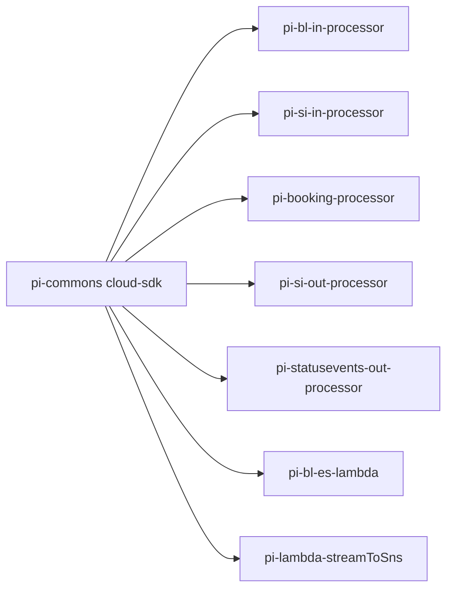

# Partner Integrator — AWS SDK 2.x (cloud-sdk) Upgrade Design (Parent / Playbook)

**Module:** `partner-integrator`
**Date:** 2026-06-30
**Status:** Target design (AWS 1.x → AWS 2.x via cloud-sdk) — NOT STARTED
**Companion:** `2026-06-30-partner-integrator-current-state-DESIGN-copilot.md`
**Reference upgrades:** `booking`, `network`, `visibility`

> This parent document is the **shared cloud-sdk playbook** for all 8 sub-modules. Each sub-module's `aws2x` doc
> specs its own service mix and class changes but follows the patterns below.

---

## 1. Change Overview & Sequencing

`partner-integrator` uses **DynamoDB, S3, SNS, SQS** (all AWS SDK v1) plus AWS Lambda v1 event POJOs, alongside
non-AWS IBM MQ, Oracle, and Elasticsearch/Jest. The AWS-SDK upgrade migrates the AWS clients to cloud-sdk; MQ/Oracle/
Appian/ES are **out of scope** (separate tracks).

**Upgrade order (critical):**
1. **`pi-commons` first** — it builds and injects the shared DynamoDB/S3/SNS/SQS v1 clients. Every other sub-module
   inherits the fix.
2. Lambdas (`pi-bl-es-lambda`, `pi-lambda-streamToSns`) — replace AWS v1 event POJOs + v1 SNS/DynamoDB clients.
3. Dropwizard processors (`pi-bl-in`, `pi-booking`, `pi-si-in`, `pi-si-out`, `pi-statusevents-out`) — swap injectors.
4. Reconcile inter-module version pins: `booking 2.1.7.M/2.1.8.M`, `visibility 1.4.M`, `shipping-instruction 1.0.M`.



---

## 2. Shared Maven Dependency Changes (apply per sub-module)

```diff
  <properties>
+   <mercury.commons.version>1.0.26-SNAPSHOT</mercury.commons.version>
  </properties>

-   <dependency><groupId>com.amazonaws</groupId><artifactId>aws-java-sdk-dynamodb</artifactId><version>1.12.715</version></dependency>
-   <dependency><groupId>com.amazonaws</groupId><artifactId>aws-java-sdk-sns</artifactId><version>1.12.715</version></dependency>
-   <dependency><groupId>com.inttra.mercury</groupId><artifactId>dynamo-client</artifactId><version>1.R.01.023</version></dependency>
+   <dependency><groupId>com.inttra.mercury</groupId><artifactId>cloud-sdk-api</artifactId><version>${mercury.commons.version}</version></dependency>
+   <dependency><groupId>com.inttra.mercury</groupId><artifactId>cloud-sdk-aws</artifactId><version>${mercury.commons.version}</version></dependency>
+   <dependency><groupId>com.inttra.mercury</groupId><artifactId>dynamo-integration-test</artifactId><version>${mercury.commons.version}</version><scope>test</scope></dependency>
+   <dependency><groupId>com.amazonaws</groupId><artifactId>aws-java-sdk-dynamodb</artifactId><scope>test</scope></dependency>
```

- For lambdas: bump `aws-lambda-java-events` v2 → v3 (or parse via cloud-sdk message envelope).
- Keep IBM MQ (`com.ibm.mq.allclient`), Oracle JDBC, ES8 unchanged. Pin Jackson via `dependencyManagement`.

---

## 3. Shared cloud-sdk Target APIs

| AWS service | cloud-sdk API (vendor-neutral) | cloud-sdk AWS factory |
|-------------|--------------------------------|------------------------|
| **DynamoDB** | `DatabaseRepository<T,K>` (`save/findById/query/scan/delete`); keys `DefaultPartitionKey`/`DefaultCompositeKey`; `DefaultQuerySpec` + `CloudAttributeValue` | `DynamoRepositoryFactory.createEnhancedRepository(DynamoDbClientConfig, tableName, Class<T>, DynamoRepositoryConfig)` where `tableName = clientConfig.getTablePrefix() + @Table.name()`; `BaseDynamoDbConfig` |
| **SQS** | `MessagingClient<String>` (`sendMessage/receiveMessages→QueueMessage/deleteMessage`); `ReceiveMessageOptions` | `MessagingClientFactory.createDefaultStringClient()` |
| **SNS** | `EventPublisher.publish(topicArn, msg)` | `NotificationClientFactory.createDefaultClient(topicArn)` |
| **S3** | `StorageClient.putObject(bucket,key,byte[])/getObject` | `StorageClientFactory.createDefaultS3Client()` |
| **Lambda events** | v2 `aws-lambda-java-events` models (`DynamodbEvent`, `SQSEvent`, `SNSEvent`) | — |

**Entity modeling:** `@DynamoDbBean` + `@Table(name=...)` (`com.inttra.mercury.cloudsdk.database.annotation.Table`) +
`@DynamoDbPartitionKey`/`@DynamoDbSortKey`/`@DynamoDbSecondaryPartitionKey(indexNames=)`/`@DynamoDbSecondarySortKey`/
`@DynamoDbAttribute`/`@DynamoDbConvertedBy`.
**Converters:** implement `software.amazon.awssdk.enhanced.dynamodb.AttributeConverter<T>`.

**Notification/SNS detail (verified):** the cloud-sdk SNS surface is `com.inttra.mercury.cloudsdk.notification.*` —
the provider returns an `EventPublisher` (`...notification.workflow.EventPublisher`) from
`NotificationClientFactory.createDefaultClient(topicArn)` (`...notification.factory`), or `EmptyEventPublisher` when
disabled. Workflow/audit events are emitted via a module `EventLogHandler` wrapping `EventLogger`
(`...notification.workflow`) + `EventGenerator`/`MetaData` (as in visibility). `StorageClientFactory` exposes
`createDefaultS3Client()` and `createS3Client(AwsStorageConfig.builder()...)`; `StorageClient.putObject(bucket,key,String)`.

---

## 4. Shared Configuration Changes

- DynamoDB block → cloud-sdk `BaseDynamoDbConfig` (add `region`; keep `environment` prefix + capacities + `sseEnabled`).
- SQS/SNS queue/topic URLs unchanged; client construction moves to factories (credentials = default chain).
- S3 bucket names unchanged.

```diff
  dynamoDbConfig:
    tableName: <table>
    region: us-east-1
+   environment: <prefix>            # if using env-prefix table naming
+   readCapacityUnits: 5
+   writeCapacityUnits: 5
+   sseEnabled: false
```

---

## 5. Shared Guice Wiring Delta

```diff
- @Provides AmazonDynamoDB / DynamoDBMapper (DynamoSupport)
- @Provides AmazonS3 (AmazonS3ClientBuilder)
- @Provides AmazonSNS (AmazonSNSClientBuilder)
- @Provides AmazonSQS (AmazonSQSClientBuilder)
+ @Provides DatabaseRepository<T,K>  (DynamoRepositoryFactory)
+ @Provides StorageClient            (StorageClientFactory.createDefaultS3Client)
+ @Provides EventPublisher      (NotificationClientFactory.createDefaultClient(topicArn))
+ @Provides MessagingClient<String>  (MessagingClientFactory.createDefaultStringClient)
```

For `pi-commons`, these providers live in the shared library; sub-module injectors consume them.

---

## 6. AWS Services in Scope by Sub-module

| Sub-module | DynamoDB | S3 | SNS | SQS | Lambda events |
|------------|:--:|:--:|:--:|:--:|:--:|
| pi-commons | ✓ | ✓ | ✓ | ✓ | — |
| pi-bl-in-processor | ✓ | ✓ | ✓ | — | — |
| pi-bl-es-lambda | ✓ | — | — | — | ✓ |
| pi-booking-processor | ✓ | ✓ | ✓ | — | — |
| pi-lambda-streamToSns | (stream) | — | ✓ | — | ✓ |
| pi-si-in-processor | ✓ | ✓ | ✓ | — | — |
| pi-si-out-processor | ✓ | — | — | ✓✓ | — |
| pi-statusevents-out-processor | ✓ | — | ✓ | ✓✓✓ | — |

---

## 7. Shared Testing Strategy

- **DynamoDB-Local IT** for every DAO/version table (`dynamo-integration-test` `BaseDynamoDbIT`, `@Tag("integration")`).
- **SQS/SNS** at booking/network level (unit, mocked `MessagingClient`/`EventPublisher`).
- **S3** round-trip unit/IT.
- **Lambda** envelope-parsing unit tests.
- Full local **JaCoCo** coverage on changed code per sub-module.

---

## 8. Risks & Call-outs

- **DynamoDB Streams → SNS → SQS** fan-out: stream-record and SNS/SQS envelope shapes must remain byte-compatible.
- Preserve all table names (`bl_versions`, `si_versions`, `booking_versions`, `container_events`,
  `si_subscriptions`, `si_distribution_status`), keys, GSIs, and on-disk encodings.
- IBM MQ, Oracle, Appian, partner webhooks/EDIFACT — **non-AWS contracts**, keep unchanged.
- ES8/Jest → OpenSearch client is a **separate** track.
- Reconcile inter-module pins (`booking`, `visibility`, `shipping-instruction`) with their cloud-sdk-upgraded versions.
