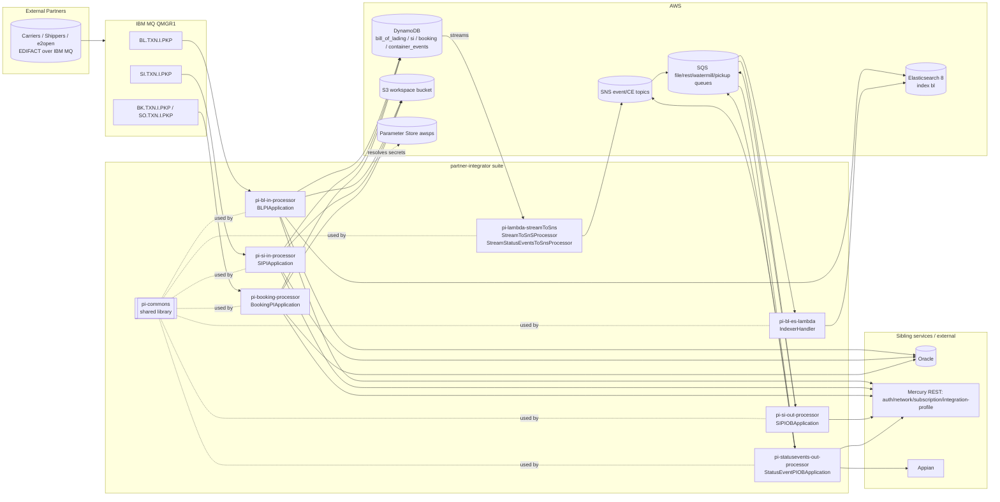
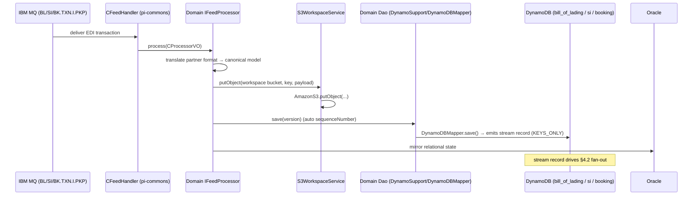
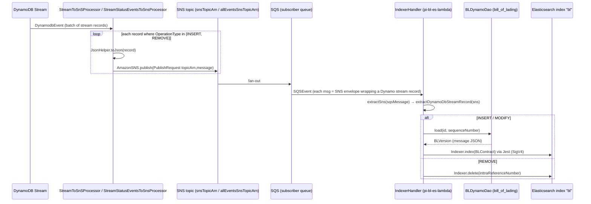
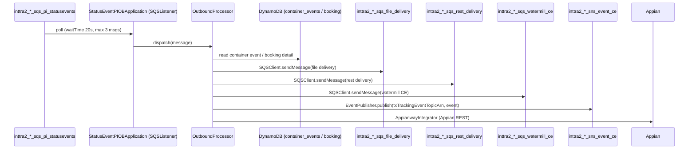

# Partner Integrator — Current-State Design (Parent / Suite Overview)

**Module:** `partner-integrator` (Maven aggregator / parent POM)
**Date:** 2026-06-30
**Status:** Current state — **AWS SDK 1.x** (`com.amazonaws` `1.12.715`) + AWS Lambda v1 event POJOs across all sub-modules. cloud-sdk / AWS SDK v2 migration **NOT STARTED**.
**Packaging:** `pom` — `com.inttra.mercury:partner-integrator:1.0`, parent `com.inttra.mercury:mercury-services:1.0`.
**JDK:** 17 (`maven.compiler.release=17`).
**Sub-modules (8):** `pi-commons`, `pi-booking-processor`, `pi-statusevents-out-processor`, `pi-lambda-streamToSns`, `pi-si-in-processor`, `pi-bl-in-processor`, `pi-si-out-processor`, `pi-bl-es-lambda`.

> This is the **parent/aggregator** document. It describes the partner-integrator suite as a system: what it does,
> how the sub-modules relate, the shared substrate (`pi-commons`), the aggregate AWS footprint, and the portfolio-wide
> SDK state. Each sub-module's own `docs/` pair carries the deep-dive; a per-sub-module summary table appears in §3.

---

## 1. Business Purpose

`partner-integrator` ("PI") is the **EDI / partner B2B integration platform** that bridges the INTTRA Ocean Logistics
network and external trading partners (carriers, shippers, forwarders, e2open). It is the inbound/outbound message
plane for three document domains — **Bill of Lading (BL)**, **Shipping Instruction (SI)**, and **Booking** — plus
**container status events**.

Core responsibilities:

- **Inbound ingestion** — pull partner EDI transactions off **IBM MQ** queues (`*.TXN.I.PKP`), translate
  partner/EDIFACT formats to the INTTRA canonical model, persist a **versioned** record in DynamoDB, mirror state to
  Oracle, and emit a DynamoDB-stream event.
- **Fan-out** — DynamoDB Streams are relayed to **SNS** by Lambda, then to **SQS** subscribers and a **BL→Elasticsearch
  indexer** Lambda.
- **Outbound distribution** — SQS-driven Dropwizard workers (SI-out, status-events-out) build partner deliverables and
  drop them onto file-delivery / REST-delivery / watermill SQS queues and SNS event topics; status events additionally
  integrate with **Appian**.
- **Enrichment** — all processors call sibling Mercury REST services (auth, network reference data, subscription,
  integration-profile) via the `commons` service-client stack.

The architecture is **event-driven and polyglot in runtime**: a mix of long-running **Dropwizard** services (MQ / SQS
listeners) and stateless **AWS Lambda** workers, backed by **DynamoDB** (system of record for versions/events),
**Oracle** (relational mirror), **Elasticsearch 8** (BL search), **S3** (workspace payload store), **SQS**, and **SNS**.



---

## 2. Design — Layering & Shared Substrate

The suite is layered the same way in every Dropwizard sub-module, with `pi-commons` providing the framework:

```mermaid
flowchart TB
  subgraph Commons[pi-commons shared library]
    CFH[CFeedHandler / IFeedProcessor\nMQ + SQS feed pipeline]
    LST[SQSListener / SQSListenerClient / ListenerManager]
    SQSC[SQSClient implements MessageSender\nAmazonSQS]
    S3W[S3WorkspaceService implements WorkspaceService\nAmazonS3]
    DS[DynamoSupport\nAmazonDynamoDB + DynamoDBMapper + DynamoDBMapperConfig]
    VO[Shared entities: SI / ContainerEvent\n@DynamoDBTable + @DynamoDBStream]
    SNSP[EventPublisher / SNSEventPublisher\n(commons messaging.sns SNSClient)]
    NSC[Network service clients: AuthClient,\nIntegrationProfileService, subscription, ...]
  end

  subgraph Module[each pi-* Dropwizard module]
    APP[*Application extends InttraServer]
    INJ[*ApplicationInjector extends AbstractModule\n@Provides AWS clients]
    PROC[domain processors / DAOs / handlers]
  end

  APP --> INJ --> PROC --> Commons
```

### Key shared classes (`pi-commons`)

| Layer | Class (`com.inttra.mercury.common…`) | Responsibility | AWS v1 type held |
|-------|--------------------------------------|----------------|------------------|
| Feed pipeline | `handler.CFeedHandler`, `processor.IFeedProcessor`, `processor.CProcessorVO` | Generic inbound feed handler: read → translate → persist → stream. | — |
| SQS listening | `listener.sqs.SQSListener` / `SQSListenerClient` / `ListenerManager` | Long-poll an SQS queue, dispatch to a per-message task. | `AmazonSQS` (`amazonSQSForListener`) |
| SQS send | `messaging.SQSClient` (impl `MessageSender`) | `sendMessage(target,body[,delay])`, `deleteMessage`. | `AmazonSQS` (`amazonSQSForSender`) via `SendMessageRequest`/`DeleteMessageRequest` |
| S3 | `workspace.S3WorkspaceService` (impl `WorkspaceService`) | `putObject`/`getContent`/`copyObject`/`getMetaData`/`copyS3FileToFileSystem`. | `AmazonS3` + `GetObjectRequest`/`CopyObjectRequest`/`ObjectMetadata`/`S3Object`, `com.amazonaws.util.IOUtils` |
| DynamoDB | `dynamodb.DynamoSupport` | `newClient(config)`, `newMapper(...)`, `newDynamoDBMapperConfig(...)`; builds env-prefixed table-name resolver. | `AmazonDynamoDB`, `DynamoDBMapper`, `DynamoDBMapperConfig` |
| Entities | `vo.SI` (`@DynamoDBTable("si")`), `vo.ContainerEvent` (`@DynamoDBTable("container_events")`) | Versioned domain records; both `@DynamoDBStream(KEYS_ONLY)`. | ORM annotations + `DynamoDBTypeConverted` |
| SNS | `messaging.logging.EventPublisher` / `SNSEventPublisher` + `messaging.sns.SNSClient` | Publish tx-tracking / CE events to an SNS topic ARN. | `AmazonSNS` / `PublishRequest` |
| Appian | `appianway.AppianwayIntegrator` | Outbound integration to Appian. | — |
| Network | `networkservices.*` (`auth.AuthClient`, `integrationprofile`, subscription) | REST enrichment via `commons` service-client + `LocalCacheModule`. | — |

> `pi-commons` is built as a **plain jar** (`pi-commons-1.0.jar`) and is a `compile`-scope dependency of every
> Dropwizard sub-module. The two Lambda sub-modules (`pi-bl-es-lambda`, `pi-lambda-streamToSns`) do **not** depend on
> `pi-commons`; they carry their own `DynamoSupport`/handler scaffolding and depend directly on `commons` + `dynamo-client`.

---

## 3. Sub-Module Map

| Sub-module | Runtime | Main class / handler | Domain | AWS used (SDK v1) |
|------------|---------|----------------------|--------|--------------------|
| `pi-commons` | jar (library) | — | Shared framework | DynamoDB, S3, SNS, SQS |
| `pi-bl-in-processor` | Dropwizard (shaded) | `com.inttra.mercury.blfeed.BLPIApplication` | BL inbound (MQ→DDB/Oracle/ES) | DynamoDB, S3, (ES via Jest), Lambda event POJO dep |
| `pi-si-in-processor` | Dropwizard (shaded) | `com.inttra.mercury.sifeed.SIPIApplication` | SI inbound (MQ→DDB/Oracle) | DynamoDB, S3 |
| `pi-booking-processor` | Dropwizard (shaded) | `com.inttra.mercury.bkfeed.BookingPIApplication` | Booking + SO inbound (MQ→DDB/Oracle) | DynamoDB, S3 |
| `pi-si-out-processor` | Dropwizard (shaded) | `com.inttra.mercury.sifeed.outprocessor.SIPIOBApplication` | SI outbound (SQS→partner queues) | DynamoDB, SQS (pickup + destination) |
| `pi-statusevents-out-processor` | Dropwizard (shaded) | `com.inttra.mercury.sefeed.outprocessor.StatusEventPIOBApplication` | Status-event outbound (SQS→Appian/SNS/SQS) | DynamoDB, S3, SNS, SQS (pickup + distributor + rest + watermill) |
| `pi-lambda-streamToSns` | AWS Lambda (assembly zip) | `com.inttra.mercury.pi.StreamToSnSProcessor`, `com.inttra.mercury.pi.StreamStatusEventsToSnsProcessor` | DynamoDB Stream → SNS relay | DynamoDB stream events, SNS, Lambda events v1 |
| `pi-bl-es-lambda` | AWS Lambda (shaded) | `com.inttra.mercury.pi.lambda.IndexerHandler` | BL version → Elasticsearch index | DynamoDB read, ES (Jest, SigV4), Lambda events v1 |

**Declared `<modules>` order** (parent pom): `pi-commons`, `pi-booking-processor`, `pi-statusevents-out-processor`,
`pi-lambda-streamToSns`, `pi-si-in-processor`, `pi-bl-in-processor`, `pi-si-out-processor`, `pi-bl-es-lambda`.

### Inter-module model pins (verified in sub-module poms)

| Sub-module | Pinned Mercury model artifacts |
|------------|-------------------------------|
| `pi-booking-processor` | `booking:2.1.7.M` (pulled from S3 maven repo `s3://inttra-deployment/Booking/repo`) |
| `pi-statusevents-out-processor` | `visibility:1.4.M`, `booking:2.1.8.M` (+ local `lib/` repo) |
| `pi-si-out-processor` | `shipping-instruction:1.0.M`, `booking:1.0.M` |
| `pi-si-in-processor` | `shipping-instruction:1.0.M` |

> These pins are **inconsistent** across sub-modules (`booking` appears as `1.0.M`, `2.1.7.M`, `2.1.8.M`) and several
> are fetched from an S3-backed Maven repo via the `com.github.platform-team:aws-maven:6.0.0` build extension and a
> `maven-dependency-plugin` `purge`/`get` dance. They must be reconciled with cloud-sdk-bearing versions during the upgrade.

---

## 4. Data Flow

### 4.1 Inbound (write path) — generic across BL / SI / Booking



### 4.2 Stream fan-out → SNS → SQS → ES index



> **Dual-topic relay:** `StreamToSnSProcessor` forwards `INSERT`/`REMOVE` records to a single `snsTopicArn`.
> `StreamStatusEventsToSnsProcessor` does a **dual publish** — `INSERT`/`REMOVE` go to both `snsTopicArn` and
> `allEventsSnsTopicArn`, while `MODIFY` goes only to `allEventsSnsTopicArn`. Both clients are
> `AmazonSNSClientBuilder.defaultClient()` (default credential chain / Lambda role).
>
> Note the **decoupled relay**: the stream relay forwards selected stream records; the ES
> indexer reacts to `INSERT`/`MODIFY` (re-loading the full `BLVersion` from the table by `id`+`sequenceNumber`) and
> `REMOVE`. The SNS message body is the **JSON-serialized `DynamodbStreamRecord`** — this envelope shape is a hard
> wire-compatibility contract for the upgrade.

### 4.3 Outbound distribution (status events)



---

## 5. Data Stores & Integrations (aggregate footprint)

### DynamoDB tables (env-prefixed)

Table names are resolved at runtime by `DynamoDBMapperConfig` from `@DynamoDBTable.tableName` **prefixed** with the
`dynamoDbConfig.environment` value. The booking detail entity additionally inserts a `_booking` segment (see
`SEFeedApplicationInjector.getNewDynamoDBMapperConfig`).

| Logical table | `@DynamoDBTable` | Hash key | Range key | GSI | Stream | Converters | Owner module(s) |
|---------------|------------------|----------|-----------|-----|--------|------------|------------------|
| BL versions | `bill_of_lading` | `id` | `sequenceNumber` (auto) | `INTTRA_REFERENCE_NUMBER_INDEX` (hash `blInttraReferenceNumber`) | KEYS_ONLY | `DateToEpochSecond` (expiresOn) | pi-bl-in, pi-bl-es-lambda |
| SI versions | `si` | `id` | `sequenceNumber` (auto `m_{ts}_{state}`) | `INTTRA_REFERENCE_NUMBER_INDEX` (hash `siInttraReferenceNumber`) | KEYS_ONLY | `CompressionConverter` (message), `DateToEpochSecond` (expiresOn) | pi-si-in, pi-si-out |
| Booking | `booking` (entity `BookingDetail`) | — | — | — | — | — | pi-booking, pi-statusevents-out |
| Container events | `container_events` | `id` | — | — | KEYS_ONLY | `DateToEpochSecond` (expiresOn) | pi-statusevents-out |

**Per-env prefix (`dynamoDbConfig.environment`), verified in config.yaml:**

| Env | prefix | example resolved table |
|-----|--------|------------------------|
| INT | `inttra_int` | `inttra_int_si`, `inttra_int_bill_of_lading` |
| QA | `inttra2_qa` | `inttra2_qa_si` |
| CVT | `inttra2_test` / `inttra2_cvt` (verify per file) | `inttra2_test_container_events` |
| PROD | `inttra2_prod` (booking module uses `inttra2_prod_booking`; status-out resolves `inttra2_prod_booking` for `BookingDetail`) | `inttra2_prod_container_events`, `inttra2_prod_booking_booking` |

Capacity: 5/5 in lower envs; **25/25** for most prod tables, **100/100** for `pi-si-out-processor` prod. `sseEnabled: false`.

### S3

- Single **workspace bucket** per env via `s3WorkspaceConfig.bucket`: prod `inttra2-pr-workspace` (status-events-out,
  si-out). Used by `S3WorkspaceService` for partner payload staging (`putObject`/`getContent`/`copyObject`).
- Build-time only: `s3://inttra-deployment/Booking/repo` and `s3://inttra-deployment/Shipping-instruction/repo` are
  **Maven repositories** (model artifacts), not runtime data stores.

### SQS (queue URLs, prod, account `642960533737`, `us-east-1`)

| Config key | Queue | Used by |
|------------|-------|---------|
| `sqsPickupConfig` | `inttra2_pr_sqs_pi_statusevents` / `inttra2_pr_sqs_pi_si` | SE-out / SI-out listener |
| `sqsDistributorConfig` / `sqsDestinationConfig` | `inttra2_pr_sqs_file_delivery` | SE-out / SI-out |
| `sqsRestDistributorConfig` | `inttra2_pr_sqs_rest_delivery` | SE-out |
| `watermillPublisherConfig` | `inttra2_pr_sqs_watermill_ce` (`e2openEdiId: E2OPENSTD`, `formatId: 129`) | SE-out |

### SNS

- `txTrackingEventTopicArn: arn:aws:sns:us-east-1:642960533737:inttra2_pr_sns_event_ce` (status-events-out).
- Stream-relay topics injected by **env var** in the Lambdas: `snsTopicArn`, `allEventsSnsTopicArn`
  (`StreamToSnSProcessor` / `StreamStatusEventsToSnsProcessor`).

### Elasticsearch

- ES **8.17.0** cluster, `us-east-1`, service `es`, SigV4-signed via **Jest** (`io.searchbox.client.JestClient`,
  `JestModule.newAwsSigningClient`). Index/type/mapping all `bl` (`ElasticsearchSupport`). pi-bl-in endpoint
  (prod): `search-inttra2-pr-es-bk-search-*.us-east-1.es.amazonaws.com` (3 shards / 1 replica). The ES Lambda reads
  endpoint/region/timeouts from env vars (`elasticsearchEndpointUrl`, `AWS_DEFAULT_REGION`, `connTimeoutMillis`,
  `readTimeoutMillis`).

### Oracle & IBM MQ

- **Oracle** JDBC (`ojdbc10` 19.14.0.0) via Dropwizard JDBI3; per-env URL/user/password (`${awsps:...}`).
- **IBM MQ** (`com.ibm.mq.allclient` 9.4.4.1): `mqPickupConfig` (host/channel/port/queueMgr/queue/backout); booking adds
  `mqSOConfig` (`SO.TXN.I.PKP`). Inbound queues: `BL.TXN.I.PKP`, `SI.TXN.I.PKP`, `BK.TXN.I.PKP`.

### External REST (via `commons` service-client)

`auth` (OAuth client secret from Parameter Store), `network` reference data (geography, country, package/container type,
participants/aliases), `subscription`, `format-service`, `integration-profile`(+`/format`), and **Appian** (status events).

---

## 6. Maven Dependencies (suite-wide)

| Artifact | Version | Where | Purpose |
|----------|---------|-------|---------|
| `com.inttra.mercury:commons` | `1.R.01.023` | all | Dropwizard base (`InttraServer`), service client, `JestModule`, Parameter-Store resolution, `messaging.sns.SNSClient`. |
| `com.inttra.mercury:dynamo-client` | `1.R.01.023` | pi-commons, pi-bl-es-lambda | DynamoDB repository/annotation support (`DynamoDbConfig`, `@DynamoDBStream`, `DynamoHashKey`/`DynamoHashAndSortKey`). |
| `com.amazonaws:aws-java-sdk-dynamodb` | `1.12.715` | pi-commons, pi-lambda-streamToSns | AWS SDK **v1** DynamoDB (`AmazonDynamoDB`, `DynamoDBMapper`, ORM annotations). Pulls S3/SNS transitively into commons consumers. |
| `com.amazonaws:aws-java-sdk-sns` | `1.12.715` | pi-lambda-streamToSns | AWS SDK **v1** SNS (`AmazonSNS`, `PublishRequest`). |
| `com.amazonaws:aws-lambda-java-events` | `2.2.2` (bl-es, streamToSns, bl-in), `2.0.1` (si-out), `3.13.0` (statusevents-out) | lambdas + some processors | Lambda **v1** event POJOs (`DynamodbEvent`, `SQSEvent`, `SNSEvent`, `OperationType`). **Version drift** (2.0.1/2.2.2/3.13.0). |
| `com.amazonaws:aws-lambda-java-core` | `1.2.0` | pi-lambda-streamToSns | `RequestHandler`, `Context`, `LambdaLogger`. |
| `org.elasticsearch:elasticsearch` | `8.17.0` | pi-bl-in, pi-bl-es-lambda | ES8 client model. |
| `com.ibm.mq:com.ibm.mq.allclient` | `9.4.4.1` | pi-commons | IBM MQ JMS client. |
| `com.oracle.database.jdbc:ojdbc10` | `19.14.0.0` | pi-commons | Oracle JDBC. |
| `io.dropwizard:dropwizard-jdbi3` | `5.0.1` | processors | JDBI3 for Oracle. |
| `org.projectlombok:lombok` | parent | all | `@Data/@Builder/@Slf4j`. |
| Build extension `com.github.platform-team:aws-maven` | `6.0.0` | all | S3-backed Maven wagon (model artifacts). |
| Build plugins | `maven-shade-plugin` (3.5.1/3.5.3), `maven-assembly-plugin` (streamToSns), `maven-compiler-plugin` (3.12.1–3.14.0, release 17) | — | Fat-JAR / Lambda zip packaging. |

> **AWS SDK is partly explicit, partly transitive.** `aws-java-sdk-dynamodb` v1 is declared directly in `pi-commons`
> (and `pi-lambda-streamToSns`); S3 and SNS arrive transitively (commons `messaging.sns.SNSClient`) and are then bound
> as Guice singletons (`AmazonS3ClientBuilder.standard().build()`, `AmazonSNSClientBuilder.standard().build()`).

---

## 7. Configuration & Deployment

- **Dropwizard config** (`conf/{int,qa,cvt,prod}/config.yaml`): `server.rootPath` (`/bl`, `/pisi`, `/booking`),
  app/admin ports (`8080/8081`, BL `8090/8091`), `dynamoDbConfig` (`environment` prefix + RCU/WCU + `sseEnabled`),
  `s3WorkspaceConfig.bucket`, `sqs*Config.queueUrl`, `txTrackingEventTopicArn`, `mqPickupConfig`/`mqSOConfig`,
  `database` (Oracle), `blElasticSearch` / `reindexESConfiguration`, `securityResources`, `serviceDefinitions`.
- **Config classes:** `*ApplicationConfig extends ApplicationConfiguration` (`BLApplicationConfig`,
  `SIApplicationConfig`, `BookingApplicationConfig`, `SIFeedApplicationConfig`, `SEFeedApplicationConfig`).
- **Secrets:** AWS Parameter Store via `${awsps:/...}` resolved by `commons` (auth client secret, Oracle user/password).
  e.g. `${awsps:/inttra2/prod/mercuryservices/partner-integration/authclientsecret}`.
- **Guice wiring:** `*ApplicationInjector extends AbstractModule` binds AWS v1 clients. Representative
  (`SEFeedApplicationInjector`): `bind(AmazonSQS.class).annotatedWith(Names.named("amazonSQSForListener"/"amazonSQSForSender"))`,
  `bind(AmazonS3.class).toInstance(AmazonS3ClientBuilder.standard().build())`, `bind(AmazonSNS.class)…`,
  `AmazonDynamoDB` + `DynamoDBMapper` + `DynamoDBMapperConfig` from `DynamoSupport`; `EventPublisher` via
  `new SNSEventPublisher(txTrackingEventTopicArn, snsClient)`.
- **Table bootstrap:** Dropwizard `ConfiguredCommand`s `CreateTables` / `DeleteTables` (per processor); BL adds
  `CreateIndex` / `ReIndexBL` (ES).
- **Packaging/deploy:** Dropwizard modules → `maven-shade` fat JAR + `Manifest` main class, per-env config copied,
  Docker image. Lambdas: `pi-lambda-streamToSns` → `maven-assembly` deployment zip (`src/assembly/deployment_package.xml`);
  `pi-bl-es-lambda` → shaded JAR. Credentials via **default credential chain / EC2/Lambda IAM role**
  (`AmazonSNSClientBuilder.defaultClient()`, `…standard().build()`).

---

## 8. AWS Services & SDK 1.x Usage (CALL-OUT — bridge to aws2x)

> **The entire suite is on AWS SDK v1 (`com.amazonaws` 1.12.715) + Lambda v1 event POJOs.** No
> `software.amazon.awssdk` (v2) and no `cloud-sdk` usage anywhere in partner-integrator.

| Service | SDK | Where (class) | Concrete v1 classes |
|---------|-----|---------------|---------------------|
| **S3** | v1 (direct) | `S3WorkspaceService`; injectors (`AmazonS3ClientBuilder.standard().build()`) | `AmazonS3`, `AmazonS3ClientBuilder`, `GetObjectRequest`, `CopyObjectRequest`, `GetObjectMetadataRequest`, `ObjectMetadata`, `S3Object`, `S3ObjectInputStream`, `PutObjectResult`, `com.amazonaws.util.IOUtils`, `SdkClientException` |
| **DynamoDB** | v1 ORM (via `dynamo-client` + direct) | `DynamoSupport`, all `*Dao`, `vo.SI`/`vo.ContainerEvent`/`BLVersion`/`BookingDetail`, `HandlerSupport` | `AmazonDynamoDB`, `DynamoDBMapper`, `DynamoDBMapperConfig`, `AttributeValue`, `OperationType`, `@DynamoDBTable/@DynamoDBHashKey/@DynamoDBRangeKey/@DynamoDBIndexHashKey/@DynamoDBAttribute/@DynamoDBAutoGeneratedKey/@DynamoDBTypeConverted/@DynamoDBIgnore` |
| **SNS** | v1 | `messaging.sns.SNSClient` / `SNSEventPublisher`; `StreamToSnSProcessor`/`StreamStatusEventsToSnsProcessor` | `AmazonSNS`, `AmazonSNSClientBuilder` (`.standard()`/`.defaultClient()`), `PublishRequest` |
| **SQS** | v1 | `SQSClient`, `SQSListener`/`SQSListenerClient` | `AmazonSQS`, `AmazonSQSClientBuilder`, `SendMessageRequest`, `DeleteMessageRequest`, `ReceiveMessageRequest` |
| **Lambda events** | v1 | `StreamToSnSProcessor`, `StreamStatusEventsToSnsProcessor`, `IndexerHandler`, `HandlerSupport` | `RequestHandler`, `Context`, `LambdaLogger`, `DynamodbEvent` (`DynamodbStreamRecord`), `SQSEvent` (`SQSMessage`), `SNSEvent.SNS`, `OperationType` |
| **Parameter Store** | resolved by commons | config (`${awsps:…}`) | — |
| **Elasticsearch** | Jest + SigV4 (not AWS data SDK) | `IndexerHandler`, `JestModule` | `io.searchbox.client.JestClient` |

---

## 9. AWS 2.x / cloud-sdk Upgrade Plan (High Level, portfolio-wide)

Goal: replace direct AWS SDK v1 (`com.amazonaws.*`) with the in-house **cloud-sdk** (`cloud-sdk-api` + `cloud-sdk-aws`,
AWS SDK 2.x under the hood), mirroring the completed **booking**/**visibility** upgrades (and the `network`/`registration`/`auth`
DAO patterns). Full sequencing and code is in the companion `…-aws2x-DESIGN-claude.md`.

| Step | Action | Reference |
|------|--------|-----------|
| 1 | **`pi-commons` first** — migrate `DynamoSupport`, `S3WorkspaceService`, `SQSClient`/`SQSListener*`, and the `SNSClient`/`SNSEventPublisher` path to cloud-sdk. Every Dropwizard sub-module inherits the fix. | booking, network |
| 2 | **DynamoDB entities** — migrate `vo.SI`, `vo.ContainerEvent`, `BLVersion`, `BookingDetail` ORM annotations to enhanced-client `@DynamoDbBean`/`@Table` and re-implement `CompressionConverter` + `DateToEpochSecond` as v2 `AttributeConverter`s. **Preserve table names, key schema, the `INTTRA_REFERENCE_NUMBER_INDEX` GSI, `KEYS_ONLY` streams, env prefix logic (incl. the `_booking` segment), and on-disk encodings.** | booking, network, registration |
| 3 | **S3 / SNS / SQS** — swap injector bindings to cloud-sdk storage/notification/messaging factories. | booking, visibility |
| 4 | **Lambdas** (`pi-bl-es-lambda`, `pi-lambda-streamToSns`) — keep/normalize Lambda v1 event POJOs (`DynamodbEvent`/`SQSEvent`/`SNSEvent`) as the trigger contract, but move client calls (`AmazonSNS.publish`, `DynamoDBMapper.load`) to v2; reconcile `aws-lambda-java-events` version drift (2.0.1/2.2.2/3.13.0). | — |
| 5 | **Reconcile inter-module pins** (`booking 1.0.M/2.1.7.M/2.1.8.M`, `visibility 1.4.M`, `shipping-instruction 1.0.M`) with cloud-sdk-upgraded versions. | — |
| 6 | **Elasticsearch** — Jest/ES8 → OpenSearch Java client is a **separate track**. | — |
| 7 | **Tests** — DynamoDB-Local IT for every versioned table/GSI (`dynamo-integration-test`/`BaseDynamoDbIT`); SQS/SNS mocked at booking/network level; S3 round-trip; Lambda envelope-parsing; full local JaCoCo on changed code. | network/auth `*DaoIT` |

**Risks / call-outs:**

- **Heaviest surface is the DynamoDB ORM + the Stream→SNS→SQS→ES fan-out.** The SNS message body is the
  JSON-serialized `DynamodbStreamRecord`; the ES indexer parses SNS-in-SQS envelopes and reloads by `id`+`sequenceNumber`.
  These **envelope/record shapes must stay byte-compatible**.
- **Auto-generated `sequenceNumber`** (`m_{currentTimeMillis}_{state}`) and the `KEYS_ONLY` stream view are part of the
  contract — re-implement, don't redesign.
- **IBM MQ, Oracle, Appian, partner EDIFACT** are non-AWS contracts and out of scope, but must keep working.
- **cloud-sdk gaps to verify** (flagged during visibility): S3 timeout/connection-pool knobs, SNS/SQS credential-chain
  fallback (`AmazonSNSClientBuilder.defaultClient()` semantics), and whether DynamoDB Streams trigger config needs touching.
- **Version drift** in `aws-lambda-java-events` and inconsistent `commons`/`dynamo-client` lines must be normalized in pi-commons first.
