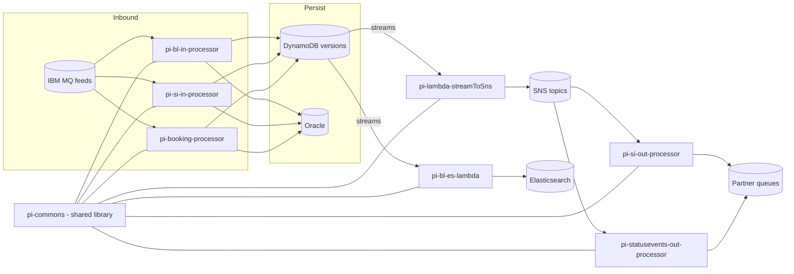

# Partner Integrator — Current-State Design (Parent / Overview)

**Module:** `partner-integrator`
**Date:** 2026-06-30
**Status:** Current state (AWS SDK 1.x — upgrade NOT STARTED across sub-modules)
**Packaging:** `pom` (Maven aggregator, 8 sub-modules)
**JDK:** 17

---

## 1. Business Purpose

`partner-integrator` is the **EDI (Electronic Data Interchange) integration platform** that connects the INTTRA
Ocean Logistics network with external partners. It ingests partner documents (Bill of Lading, Shipping Instruction,
Booking, Status Events), transforms between partner formats and INTTRA canonical models, persists versions, and
distributes events to downstream subscribers.

Architecture is **event-driven**: a mix of Dropwizard long-running services (IBM MQ / SQS listeners) and AWS Lambda
workers, backed by **DynamoDB**, **Oracle**, **Elasticsearch**, **S3**, **SQS**, and **SNS**.

## 2. Sub-Module Map

| Sub-module | Type | Domain | Key AWS | Doc |
|------------|------|--------|---------|-----|
| `pi-commons` | jar (library) | Shared framework | DynamoDB/S3/SNS/SQS v1 | `pi-commons/docs/...` |
| `pi-bl-in-processor` | jar (Dropwizard) | BL inbound | DynamoDB/S3/SNS v1, IBM MQ, Oracle, ES8 | `pi-bl-in-processor/docs/...` |
| `pi-bl-es-lambda` | jar (Lambda) | BL → ES index | DynamoDB v1, Lambda events v1, Jest/ES8 | `pi-bl-es-lambda/docs/...` |
| `pi-booking-processor` | jar (Dropwizard) | Booking inbound | DynamoDB/S3/SNS v1, IBM MQ, Oracle | `pi-booking-processor/docs/...` |
| `pi-si-in-processor` | jar (Dropwizard) | SI inbound | DynamoDB/S3/SNS v1, IBM MQ, Oracle | `pi-si-in-processor/docs/...` |
| `pi-si-out-processor` | jar (Dropwizard) | SI outbound | SQS x2/DynamoDB v1, Watermill | `pi-si-out-processor/docs/...` |
| `pi-statusevents-out-processor` | jar (Dropwizard) | Status events outbound | SQS x3/SNS/DynamoDB v1, Appian | `pi-statusevents-out-processor/docs/...` |
| `pi-lambda-streamToSns` | jar (2 Lambdas) | Stream → SNS relay | DynamoDB/SNS v1, Lambda events v1 | `pi-lambda-streamToSns/docs/...` |

`<modules>`: pi-commons, pi-booking-processor, pi-statusevents-out-processor, pi-lambda-streamToSns,
pi-si-in-processor, pi-bl-in-processor, pi-si-out-processor, pi-bl-es-lambda.

## 3. Cross-Cutting Concerns

- **Shared library:** `pi-commons` supplies `CFeedHandler`, MQ/SQS listeners, `IFeedProcessor`, DynamoDB base
  (`DynamoRepositoryBase`), `S3WorkspaceService`, network-service clients, JAXB schemas, SNS event publishing.
- **Mercury libs:** `commons` + `dynamo-client` `1.R.01.023`.
- **AWS SDK:** **v1** (`aws-java-sdk-dynamodb` / `aws-java-sdk-sns` `1.12.715`) plus AWS Lambda **v1** event POJOs.
  No AWS v2 / cloud-sdk usage yet.
- **Non-AWS:** IBM MQ (`com.ibm.mq.allclient` 9.4.4.1), Oracle JDBC, Elasticsearch 8.17 + Jest.

## 4. AWS Services & SDK 1.x Usage (CALL-OUT)

| Service | Used by | SDK |
|---------|---------|-----|
| **DynamoDB** | all processors + lambdas | v1 (`AmazonDynamoDB`, `DynamoDBMapper`, ORM annotations) |
| **S3** | inbound processors via `S3WorkspaceService` | v1 (`AmazonS3`) |
| **SNS** | inbound processors, out-processors, stream lambdas | v1 (`AmazonSNS`, `AmazonSNSClientBuilder`) |
| **SQS** | out-processors, listeners | v1 (`AmazonSQS`) |
| **Lambda events** | `pi-bl-es-lambda`, `pi-lambda-streamToSns` | v1 (`DynamodbEvent`, `SQSEvent`, `SNSEvent`, `OperationType`) |
| **Elasticsearch** | `pi-bl-es-lambda`, `pi-bl-in-processor` | Jest + ES8 (not AWS SDK) |

## 5. AWS 2.x / cloud-sdk Upgrade Plan (High Level, portfolio-wide)

1. **Upgrade `pi-commons` first** — it is the shared substrate. Migrate its DynamoDB base, `S3WorkspaceService`,
   SNS/SQS wrappers, and listeners to the cloud-sdk (AWS SDK v2), mirroring **booking**/**network**. Every other
   sub-module inherits the fix.
2. **Migrate SQS/SNS** to cloud-sdk `MessagingClient` / `NotificationService` (reference **booking**, **network**).
3. **Migrate S3** to the cloud-sdk storage client (reference **booking**).
4. **Migrate DynamoDB** ORM entities + `DynamoRepositoryBase` to the cloud-sdk `DatabaseRepository`/enhanced client,
   preserving all table names, keys, and on-disk encodings (versions/streams must stay wire-compatible).
5. **Lambdas** (`pi-bl-es-lambda`, `pi-lambda-streamToSns`) — replace AWS v1 event POJOs and AWS v1 SNS/DynamoDB
   clients with v2; upgrade Lambda runtimes off `java8`.
6. **Elasticsearch** — separate track: Jest/ES8 → OpenSearch Java client.
7. **Tests** — DynamoDB-Local IT for every DAO/version table; SQS/SNS at booking/network test level; full local
   JaCoCo coverage on changed code.

**Call-outs:** Heavy fan-out via DynamoDB Streams → SNS → SQS means **stream-record and SNS/SQS envelope shapes must
remain byte-compatible**. IBM MQ, Oracle, and Appian integrations are **out of scope** for the AWS upgrade but must
keep working. `pi-statusevents-out-processor` pins `booking:2.1.8.M` / `visibility:1.4.M` and
`pi-booking-processor` pins `booking:2.1.7.M` — these inter-module versions need alignment during the upgrade.
