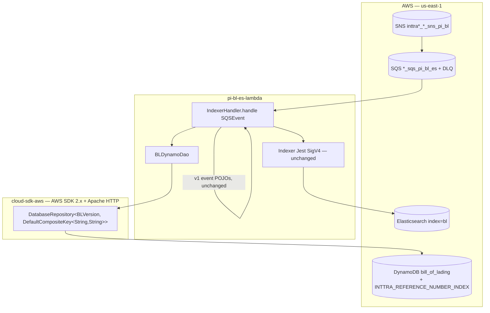
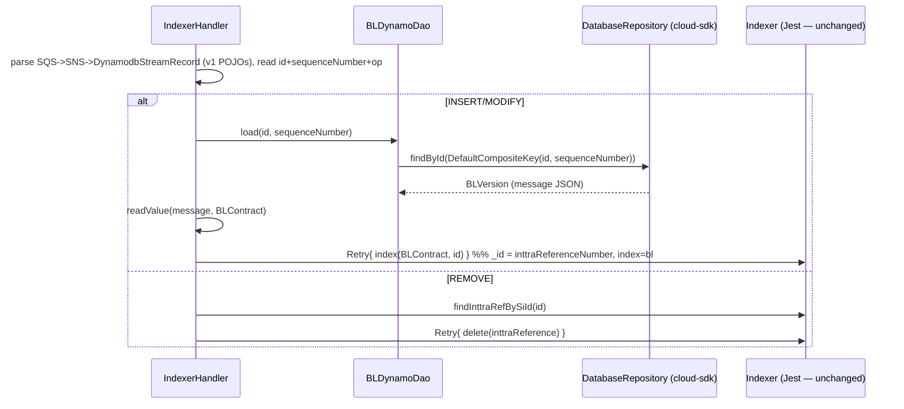

# Partner Integrator — pi-bl-es-lambda — AWS SDK 2.x (cloud-sdk) Upgrade Design

**Module:** `partner-integrator / pi-bl-es-lambda`
**Date:** 2026-06-30
**Status:** Target design (AWS 1.x → AWS 2.x via cloud-sdk) — **NOT STARTED**
**Companion:** `2026-06-30-partner-integrator-pi-bl-es-lambda-current-state-DESIGN-claude.md`
**Reference upgrades:** `booking` (S3 + DynamoDB, complete), `visibility` (S3 + DynamoDB + SNS/SQS), `network`/`registration` (DynamoDB DAO patterns)

---

## 1. Change Overview

This Lambda touches **exactly one** AWS SDK service in code: **DynamoDB** (a client read via `DynamoSupport` +
`BLDynamoDao`, and the v1 ORM on `BLVersion` + the `@DynamoDBDocument` model classes). The migration replaces that v1
DynamoDB usage — which arrives **transitively through `dynamo-client`** — with the in-house **cloud-sdk**
(`cloud-sdk-api` + `cloud-sdk-aws`, AWS SDK 2.x Enhanced Client + Apache HTTP). The Lambda **event POJOs**
(`aws-lambda-java-events`) and the **Jest/SigV4 Elasticsearch** path are deliberately *not* part of the SDK-2.x
DynamoDB migration.

| Concern | Current (v1) | Target (cloud-sdk / v2) |
|---------|--------------|--------------------------|
| **DynamoDB client** | `AmazonDynamoDB` + `AmazonDynamoDBClientBuilder` (`DynamoSupport`) | cloud-sdk repository built by `DynamoRepositoryFactory.createEnhancedRepository(...)` |
| **DynamoDB ORM** | `DynamoDBMapper` + `@DynamoDBTable/@DynamoDBHashKey/@DynamoDBRangeKey/@DynamoDBAttribute/@DynamoDBIndexHashKey/@DynamoDBTypeConverted` on `BLVersion`; `@DynamoDBDocument` model classes | `@DynamoDbBean` + `@Table` + `@DynamoDbPartitionKey/@DynamoDbSortKey/@DynamoDbSecondaryPartitionKey/@DynamoDbAttribute/@DynamoDbConvertedBy` |
| **DAO** | `BLDynamoDao extends DynamoDBCrudRepository<BLVersion, DynamoHashAndSortKey<String,String>>` | injected `DatabaseRepository<BLVersion, DefaultCompositeKey<String,String>>` |
| **Converter** | `DateToEpochSecond implements DynamoDBTypeConverter<Long,Date>` | `DateToEpochSecondAttributeConverter implements AttributeConverter<Date>` (epoch-second `N`, identical) |
| **Dynamo dep** | `dynamo-client:1.R.01.023` | removed → `cloud-sdk-api` + `cloud-sdk-aws` |

**Out of scope (left wire-identical):**
- **Lambda event POJOs** (`aws-lambda-java-events:2.2.2`) — `SQSEvent`, `SNSEvent.SNS`,
  `DynamodbEvent.DynamodbStreamRecord`, `OperationType`, `com.amazonaws.services.dynamodbv2.model.AttributeValue`.
  These are runtime *deserialization* contracts (the SQS→SNS→stream envelope), not SDK service clients; they may
  stay on v1 even after the DynamoDB **client** calls move to v2. The handler reads `keys.get("id").getS()` /
  `getEventName()` against these POJOs — that parsing must not change.
- **Elasticsearch** — `JestModule.newAwsSigningClient` + `io.searchbox.*` (`Indexer`). A move to the OpenSearch Java
  client is a **separate track**.
- **SQS / SNS** — no client in code; pure CloudFormation infrastructure.

**Backward-compatibility mandate.** These must stay wire-identical so existing DynamoDB items remain readable and the
search index stays consistent:

- Table **`bill_of_lading`**; per-env prefix → effective name `<dynamoDbEnvironment>_bill_of_lading` (CVT
  **`inttra2_test`**, INT `inttra_int`, QA `inttra2_qa`, PROD `inttra2_prod`).
- Key schema: hash attribute **`id`** (S), range attribute **`sequenceNumber`** (S); GSI
  **`INTTRA_REFERENCE_NUMBER_INDEX`** on `blInttraReferenceNumber`.
- Attribute encodings: `message` as a JSON **string (S)**; `expiresOn` as **epoch seconds — DynamoDB `N`**
  (`DateToEpochSecond`); all `@DynamoDBAttribute` names unchanged.
- The Elasticsearch document contract: `_id = inttraReferenceNumber`, index/type **`bl`**, the `IndexedBL` field set
  and `lastModifiedDateUtc` format `yyyy-MM-dd HH:mm:ss`.
- **Decoupling rule:** the DynamoDB on-wire format (`AttributeConverter`, `N` for `expiresOn`) is independent of the
  Elasticsearch JSON produced by `JsonSupport.toJson(IndexedBL)`. Do not let the v2 converter leak into the ES JSON
  path, and do not change the `IndexedBL` Jackson output.

---

## 2. Maven Dependency Changes

```diff
  <properties>
-   <mercury.commons.version>1.R.01.023</mercury.commons.version>
-   <mercury.dynamodbclient.version>1.R.01.023</mercury.dynamodbclient.version>
+   <mercury.commons.version>1.0.26-SNAPSHOT</mercury.commons.version>   <!-- verify current cloud-sdk line in booking/visibility -->
    <elasticsearch.version>8.17.0</elasticsearch.version>
    <aws-lambda-java-events.version>2.2.2</aws-lambda-java-events.version>  <!-- event POJOs stay v1 -->
  </properties>

  <dependencies>
    <dependency>
      <groupId>com.inttra.mercury</groupId>
      <artifactId>commons</artifactId>
      <version>${mercury.commons.version}</version>
    </dependency>

-   <dependency>
-     <groupId>com.inttra.mercury</groupId>
-     <artifactId>dynamo-client</artifactId>
-     <version>${mercury.dynamodbclient.version}</version>
-   </dependency>
+   <dependency>
+     <groupId>com.inttra.mercury</groupId>
+     <artifactId>cloud-sdk-api</artifactId>
+     <version>${mercury.commons.version}</version>
+   </dependency>
+   <dependency>
+     <groupId>com.inttra.mercury</groupId>
+     <artifactId>cloud-sdk-aws</artifactId>
+     <version>${mercury.commons.version}</version>
+   </dependency>

    <!-- ES query-builder helpers + Jest transport via commons — UNCHANGED (separate OpenSearch track) -->
    <dependency>
      <groupId>org.elasticsearch</groupId>
      <artifactId>elasticsearch</artifactId>
      <version>${elasticsearch.version}</version>
    </dependency>

    <!-- Lambda event POJOs — STAY ON v1 2.2.2 (envelope deserialization contract) -->
    <dependency>
      <groupId>com.amazonaws</groupId>
      <artifactId>aws-lambda-java-events</artifactId>
      <version>${aws-lambda-java-events.version}</version>
    </dependency>

+   <!-- DynamoDB Local integration-test framework -->
+   <dependency>
+     <groupId>com.inttra.mercury</groupId>
+     <artifactId>dynamo-integration-test</artifactId>
+     <version>${mercury.commons.version}</version>
+     <scope>test</scope>
+   </dependency>
+   <!-- AWS SDK v1 DynamoDB kept ONLY for DynamoDB Local in tests (matches booking) -->
+   <dependency>
+     <groupId>com.amazonaws</groupId>
+     <artifactId>aws-java-sdk-dynamodb</artifactId>
+     <version>1.12.721</version>
+     <scope>test</scope>
+   </dependency>

    <dependency><groupId>org.mockito</groupId><artifactId>mockito-core</artifactId><version>${mockito.version}</version><scope>test</scope></dependency>
    <dependency><groupId>org.junit.jupiter</groupId><artifactId>junit-jupiter-api</artifactId><version>${junit.version}</version><scope>test</scope></dependency>
    <dependency><groupId>org.mockito</groupId><artifactId>mockito-junit-jupiter</artifactId><version>${mockito.version}</version><scope>test</scope></dependency>
  </dependencies>
```

- **Removed (prod):** `dynamo-client` — the only path pulling transitive `com.amazonaws:aws-java-sdk-dynamodb`. After
  this, the only remaining `com.amazonaws` on the **prod** classpath is `aws-lambda-java-events` (event POJOs, by
  design).
- cloud-sdk uses **Apache HTTP** (no Netty), matching the booking/visibility rebase.
- Drop the now-unused `${mercury.dynamodbclient.version}` property.

---

## 3. Configuration Changes

This Lambda has **no `config.yaml`** — all configuration is Lambda environment variables, and **none change**:
`dynamoDbEnvironment`, `elasticsearchEndpointUrl`, `AWS_DEFAULT_REGION`, `connTimeoutMillis`, `readTimeoutMillis`,
`maxRetries`. The CloudFormation `Runtime` is already `java17`; **no runtime bump is required** (contrast the
Copilot doc's `java8 → java21` step, which does not apply here).

The internal config object changes type. Today `HandlerSupport.newBLDao` builds a
`com.inttra.mercury.dynamo.respository.module.DynamoDbConfig` and sets only `environment`; under cloud-sdk it becomes
the cloud-sdk DynamoDB config carrying the same prefix plus an explicit region:

```diff
- import com.inttra.mercury.dynamo.respository.module.DynamoDbConfig;
+ import com.inttra.mercury.cloudsdk.database.config.BaseDynamoDbConfig;   // verify exact type in booking/visibility

  public static BLDynamoDao newBLDao() {
      String dynamoDbEnvironment = System.getenv("dynamoDbEnvironment");
      if (StringUtils.isBlank(dynamoDbEnvironment)) {
          throw new IllegalArgumentException("Environment setting for 'dynamoDbEnvironment' is missing");
      }
-     AmazonDynamoDB client = DynamoSupport.newClient();
-     DynamoDbConfig dynamoDbConfig = new DynamoDbConfig();
-     dynamoDbConfig.setEnvironment(dynamoDbEnvironment);
-     DynamoDBMapperConfig mapperConfig = DynamoSupport.newDynamoDBMapperConfig(dynamoDbConfig);
-     DynamoDBMapper mapper = DynamoSupport.newMapper(client, dynamoDbConfig);
-     return new BLDynamoDao(mapper, mapperConfig);
+     BaseDynamoDbConfig cfg = BaseDynamoDbConfig.builder()
+             .environment(dynamoDbEnvironment)               // prefix "<env>_" preserved
+             .region(System.getenv("AWS_DEFAULT_REGION"))
+             .build();
+     return DynamoSupport.newBLDao(cfg);                     // builds DatabaseRepository internally
  }
```

The effective table name **must stay** `<dynamoDbEnvironment>_bill_of_lading` — the cloud-sdk repository factory must
apply the `"<env>_"` prefix to the `@Table` name exactly as `DynamoSupport.newDynamoDBMapperConfig` did.

---

## 4. Per-Service Spec

### 4.1 DynamoDB — `BLVersion` entity

**Before (v1 ORM, abridged):**
```java
@DynamoDBTable(tableName = "bill_of_lading")
@DynamoDBStream(StreamViewType.KEYS_ONLY)
public class BLVersion implements Expires, DynamoHashAndSortKey<String, String> {
  public static final String INTTRA_REFERENCE_NUMBER_INDEX = "INTTRA_REFERENCE_NUMBER_INDEX";

  @DynamoDBIgnore private String id;
  @DynamoDBIgnore private String sequenceNumber;

  @DynamoDBHashKey  @DynamoDBAttribute(attributeName="id")             public String getHashKey() { return id; }
  @DynamoDBRangeKey @DynamoDBAutoGeneratedKey
  @DynamoDBAttribute(attributeName="sequenceNumber")                   public String getSortKey() { return sequenceNumber; }

  @DynamoDBAttribute
  @DynamoDBIndexHashKey(globalSecondaryIndexName=INTTRA_REFERENCE_NUMBER_INDEX) private String blInttraReferenceNumber;

  @DynamoDBAttribute private String message;
  @DynamoDBAttribute @DynamoDBTypeConverted(converter=DateToEpochSecond.class) private Date expiresOn;
}
```

**After (Enhanced client, abridged — annotate getters, mirror booking):**
```java
@DynamoDbBean
@Table(name = "bill_of_lading")                  // com.inttra.mercury.cloudsdk.database.annotation.Table
public class BLVersion {
  public static final String INTTRA_REFERENCE_NUMBER_INDEX = "INTTRA_REFERENCE_NUMBER_INDEX";

  @DynamoDbPartitionKey @DynamoDbAttribute("id")            public String getId() { return id; }
  @DynamoDbSortKey      @DynamoDbAttribute("sequenceNumber") public String getSequenceNumber() { return sequenceNumber; }

  @DynamoDbSecondaryPartitionKey(indexNames = INTTRA_REFERENCE_NUMBER_INDEX)
  @DynamoDbAttribute("blInttraReferenceNumber")            public String getBlInttraReferenceNumber() {...}

  @DynamoDbAttribute("message")                            public String getMessage() {...}

  @DynamoDbConvertedBy(DateToEpochSecondAttributeConverter.class)   // epoch-second N, wire-identical
  @DynamoDbAttribute("expiresOn")                          public Date getExpiresOn() {...}
}
```

- **`@DynamoDBAutoGeneratedKey` on `sequenceNumber`** has no enhanced-client equivalent. The value is actually
  produced by the **upstream producer** (`m_<millis>_<state>_<ref>`, see the `BLVersion(id,state,…)` ctor) — this
  Lambda only **reads**, so dropping the annotation is safe here. Confirm no write path in this module relies on it
  (there is none — the Lambda never `save()`s).
- **`@DynamoDBStream(KEYS_ONLY)`** is metadata for the bootstrap tooling, not the runtime read; the stream itself is
  owned by the `bill_of_lading` producer module, so it is not re-declared here.
- **`DynamoHashAndSortKey<String,String>` interface** (getHashKey/getSortKey/getExpiresOn) was a `dynamo-client`
  contract; under cloud-sdk the keys are plain annotated getters and the composite key is expressed at query time as
  `DefaultCompositeKey<>(id, sequenceNumber)`.
- **`@DynamoDBDocument` model classes** (`BLContract`, `Charge`, `Equipment`, `Contact`, … ~30 classes) are used by
  this Lambda **only for Jackson** (deserializing `message` and serializing `IndexedBL`); they are **never persisted
  by this module**. Re-annotating them to `@DynamoDbBean` is optional and only needed if the producer module shares
  the classes. **Recommendation:** leave the `@DynamoDBDocument` annotations in place (harmless, Jackson-only) and
  only port `BLVersion` + `DateToEpochSecond`, to keep the diff minimal and the `message` round-trip untouched.

**Converter — `DateToEpochSecond`:**

| v1 | v2 replacement | On-wire (unchanged) |
|----|----------------|---------------------|
| `DateToEpochSecond implements DynamoDBTypeConverter<Long,Date>` (`date.getTime()/1000`) | `DateToEpochSecondAttributeConverter implements software.amazon.awssdk.enhanced.dynamodb.AttributeConverter<Date>` | DynamoDB **`N`**, value = `epochMillis / 1000` (seconds) |

```java
public class DateToEpochSecondAttributeConverter implements AttributeConverter<Date> {
    @Override public AttributeValue transformFrom(Date d) {
        return AttributeValue.builder().n(Long.toString(d.getTime() / 1000)).build();   // N, seconds
    }
    @Override public Date transformTo(AttributeValue v) {
        return new Date(Long.parseLong(v.n()) * 1000);
    }
    @Override public EnhancedType<Date> type() { return EnhancedType.of(Date.class); }
    @Override public AttributeValueType attributeValueType() { return AttributeValueType.N; }
}
```

> **Gap call-out (seconds, not millis).** Keep the `/1000` and the `N` type — a TTL stored as milliseconds, or as
> `S`, would silently break DynamoDB TTL expiry and any reader expecting seconds.

### 4.2 DynamoDB — `BLDynamoDao`

**Before (v1):**
```java
public class BLDynamoDao extends DynamoDBCrudRepository<BLVersion, DynamoHashAndSortKey<String,String>> {
  public BLDynamoDao(DynamoDBMapper mapper, DynamoDBMapperConfig cfg) { super(mapper, cfg, DynamoRepositoryConfig.builder().domainType(BLVersion.class).build()); }
  public BLVersion load(String id, String rangeKey) { return dynamoDBMapper.load(BLVersion.class, id, rangeKey); }
  public List<BLVersion> findByBlId(String id) { return query(id, "id = :hashKeyValue"); }
  public List<BLVersion> findByInttraReferenceNumber(String ref) {
      List<BLVersion> d = query(INTTRA_REFERENCE_NUMBER_INDEX, ref, null, "blInttraReferenceNumber = :hashKeyValue");
      return findByBLs(d.stream().map(BLVersion::getId).collect(toSet()));
  }
}
```

**After (cloud-sdk `DatabaseRepository`):**
```java
public class BLDynamoDao {
  private final DatabaseRepository<BLVersion, DefaultCompositeKey<String,String>> repository;
  public BLDynamoDao(DatabaseRepository<BLVersion, DefaultCompositeKey<String,String>> repository) { this.repository = repository; }

  // hot path — keys-only stream means we re-read the full item
  public BLVersion load(String id, String sequenceNumber) {
      return repository.findById(new DefaultCompositeKey<>(id, sequenceNumber), true).orElse(null);   // consistent read
  }

  public List<BLVersion> findByBlId(String id) {
      return repository.query(DefaultQuerySpec.builder()
          .partitionKeyValue(CloudAttributeValue.ofString(id)).build());
  }

  public List<BLVersion> findByInttraReferenceNumber(String ref) {
      List<BLVersion> d = repository.query(DefaultQuerySpec.builder()
          .indexName(BLVersion.INTTRA_REFERENCE_NUMBER_INDEX)
          .partitionKeyValue(CloudAttributeValue.ofString(ref)).build());
      return findByBLs(d.stream().map(BLVersion::getId).collect(toSet()));
  }
}
```

- `load(id, sequenceNumber)` is the only method the Lambda invokes per message; the `findBy*` methods are not on the
  invocation path but migrate the same way (`DefaultQuerySpec` on table / GSI). Verify exact `DefaultQuerySpec` /
  `CloudAttributeValue` / `DefaultCompositeKey` type names against booking/visibility — these are the canonical
  cloud-sdk equivalents.
- **`load` returning `null` vs `Optional`:** v1 `mapper.load` returns `null` on miss and the handler then NPEs into
  the outer `catch` (logged + swallowed). Preserve that behaviour — `.orElse(null)` keeps the contract; do not let a
  miss throw before the handler's try/catch.

> **Gap call-out (read consistency).** v1 `DynamoDBMapper.load` is **eventually consistent** by default. The stream
> event can arrive before the write is globally visible; the current code tolerates this via `Retry` (5 attempts,
> exp backoff). Using a **consistent read** (`findById(key, true)`) on the cloud-sdk side is *safer* and removes some
> retry pressure — but it is a behavioural change. If exact parity is required, pass `false`. Decide explicitly and
> note it in the commit.

### 4.3 Lambda event POJOs (unchanged — explicit)

```java
// IndexerHandler.handle — UNCHANGED parsing against v1 event POJOs
SNS sns = HandlerSupport.extractSns(objectMapper, sqsMessage);                       // SQSMessage.getBody() -> SNS
DynamodbStreamRecord rec = HandlerSupport.extractDynamoDbStreamRecord(objectMapper, sns); // SNS.getMessage() -> stream rec
Map<String, AttributeValue> keys = rec.getDynamodb().getKeys();                      // com.amazonaws...model.AttributeValue
String id = keys.get("id").getS();                                                   // S accessor
switch (OperationType.fromValue(rec.getEventName())) { case INSERT: case MODIFY: ... case REMOVE: ... }
```

No change. These types come from `aws-lambda-java-events:2.2.2` and `com.amazonaws.services.dynamodbv2.model`. They
are deserialization shapes for the SQS→SNS→stream envelope, not service clients, and stay on v1.

### 4.4 Elasticsearch (unchanged — explicit)

`IndexerHandler.newJestClient` (`JestModule.newAwsSigningClient(endpointUrl, region, "es", connTimeout, readTimeout,
null)`) and `Indexer` (`io.searchbox.*`, index/type `bl`) are untouched here. OpenSearch-client migration is a
separate track and must not be bundled into this DynamoDB change.

---

## 5. Lambda Handler / Init Changes

No Guice/Dropwizard injector exists; wiring is the `IndexerHandler` no-arg constructor + `HandlerSupport`/`DynamoSupport`
static factories.

```diff
  // HandlerSupport
- import com.amazonaws.services.dynamodbv2.AmazonDynamoDB;
- import com.amazonaws.services.dynamodbv2.datamodeling.DynamoDBMapper;
- import com.amazonaws.services.dynamodbv2.datamodeling.DynamoDBMapperConfig;
- import com.inttra.mercury.dynamo.respository.module.DynamoDbConfig;
+ import com.inttra.mercury.cloudsdk.database.config.BaseDynamoDbConfig;
  // newBLDao(): build BaseDynamoDbConfig and delegate to DynamoSupport.newBLDao(cfg)  (see §3)

  // DynamoSupport — replace v1 client/mapper builders with the cloud-sdk repository factory
- public static AmazonDynamoDB newClient() { return AmazonDynamoDBClientBuilder.standard().build(); }
- public static DynamoDBMapper newMapper(AmazonDynamoDB c, DynamoDbConfig cfg) {...}
- public static DynamoDBMapperConfig newDynamoDBMapperConfig(DynamoDbConfig cfg) {... withTableNamePrefix("<env>_") ...}
+ public static BLDynamoDao newBLDao(BaseDynamoDbConfig cfg) {
+     String table = cfg.getEnvironment() + "_" + BLVersion.class.getAnnotation(Table.class).name();  // <env>_bill_of_lading
+     DatabaseRepository<BLVersion, DefaultCompositeKey<String,String>> repo =
+         DynamoRepositoryFactory.createEnhancedRepository(cfg, table, BLVersion.class,
+             DynamoRepositoryConfig.builder().domainType(BLVersion.class).build());
+     return new BLDynamoDao(repo);
+ }
```

`IndexerHandler` itself is unchanged except that its constructor still calls `HandlerSupport.newBLDao()`; the `Indexer`
+ Jest construction (`newJestClient()`) and the `Retry` logic stay as-is.

---

## 6. Target Component Diagram



## 7. Target Data Flow — index (after)



---

## 8. Key Classes Changed

| Class | Change |
|-------|--------|
| `pom.xml` | remove `dynamo-client`; add `cloud-sdk-api` + `cloud-sdk-aws`; add `dynamo-integration-test` + test-scoped `aws-java-sdk-dynamodb`; bump `commons`; keep `aws-lambda-java-events:2.2.2`; drop `dynamodbclient.version`. |
| `BLVersion` | v1 ORM annotations → `@DynamoDbBean`/`@Table` + `@DynamoDbPartitionKey`/`@DynamoDbSortKey`/`@DynamoDbSecondaryPartitionKey`/`@DynamoDbConvertedBy`; drop `@DynamoDBAutoGeneratedKey` (read-only module) and the `dynamo-client` `DynamoHashAndSortKey` interface. |
| `DateToEpochSecond` | re-implement as `AttributeConverter<Date>` (epoch-second `N`, `/1000` preserved). |
| `BLDynamoDao` | `extends DynamoDBCrudRepository` → injected `DatabaseRepository<BLVersion, DefaultCompositeKey<String,String>>`; `load` → `findById`; `findBy*` → `DefaultQuerySpec`. |
| `DynamoSupport` | v1 `AmazonDynamoDB`/`DynamoDBMapper`/`DynamoDBMapperConfig` builders → `DynamoRepositoryFactory.createEnhancedRepository`; preserve `"<env>_" + @Table name` prefix. |
| `HandlerSupport.newBLDao` | build `BaseDynamoDbConfig` (env + region); delegate to `DynamoSupport.newBLDao(cfg)`. |
| `@DynamoDBDocument` model classes | **No change recommended** (Jackson-only in this module). Re-annotate to `@DynamoDbBean` only if shared with the persisting producer. |
| `IndexerHandler`, `Indexer`, `Retry`, event POJOs | **Unchanged.** |

---

## 9. Testing Strategy

- **DynamoDB-Local IT** (`dynamo-integration-test` `BaseDynamoDbIT`, `@Tag("integration")`) for `BLDynamoDao.load`:
  write a `BLVersion` (table `<env>_bill_of_lading`, hash `id`, range `sequenceNumber`), assert `findById` round-trips
  the `message` string and that `expiresOn` reads back as **epoch seconds (`N`)** — re-read an item written by the v1
  mapper and assert byte-identical encoding (converter fidelity). Exercise the `INTTRA_REFERENCE_NUMBER_INDEX` GSI via
  `findByInttraReferenceNumber`.
- **Handler unit tests** (reuse `IndexerHandlerTest`): SQS→SNS→`DynamodbStreamRecord` envelope parsing, the
  `INSERT`/`MODIFY` vs `REMOVE` routing, the missing-`id` `RuntimeException`, and `index`/`delete` with a **mocked
  `Indexer`** — assert the ES `_id`/index/type are unchanged.
- **Converter unit test** (reuse `LongDateDeserializerTest` style): `DateToEpochSecondAttributeConverter` seconds
  round-trip.
- Keep `HandlerSupportTest` / `BLDynamoDaoTest` mock types updated (`DynamoDBMapper` → `DatabaseRepository`).
- Certify **full local JaCoCo coverage** on changed code (note `**/model/**` is Sonar-excluded, so the converter +
  DAO + `DynamoSupport` carry the coverage weight):
  ```
  mvn -f partner-integrator/pi-bl-es-lambda/pom.xml clean verify
  ```

---

## 10. Risks & Call-outs

- **Largest surface = the DynamoDB read path** (`DynamoSupport` + `BLDynamoDao` + `BLVersion` + `DateToEpochSecond`).
  Small class count but every attribute name (`id`, `sequenceNumber`, `blInttraReferenceNumber`, `message`,
  `expiresOn`) and the `<env>_bill_of_lading` effective table name must round-trip so existing items stay readable.
- **`DateToEpochSecond` is seconds, not millis** — keep `/1000` and `N`. A wrong unit/type breaks TTL and downstream
  readers.
- **Read consistency is a behavioural decision** — v1 `mapper.load` is eventually consistent and relies on `Retry`;
  cloud-sdk `findById(key, true)` is consistent. Choose deliberately and document it (parity = `false`).
- **`load` miss returns `null`** today (handler swallows the NPE). Preserve `.orElse(null)` so the error-isolation
  behaviour (log + continue, no DLQ stall) is unchanged.
- **Event POJOs stay v1** — do **not** bump `aws-lambda-java-events` as part of this change; the SQS→SNS→stream
  envelope (`extractSns`/`extractDynamoDbStreamRecord`, `keys.get("id").getS()`, `OperationType.fromValue`) is a wire
  contract. Any version bump is a separate, independently-verified commit.
- **Elasticsearch (Jest/SigV4) is a separate track** — index/type `bl`, `_id = inttraReferenceNumber`, the
  `IndexedBL` field set, and the `yyyy-MM-dd HH:mm:ss` `lastModifiedDateUtc` format must remain unchanged; do not fold
  an OpenSearch migration into this commit.
- **`@DynamoDBDocument` model classes are Jackson-only here** — leave them alone to keep the `message`→`BLContract`
  and `IndexedBL`→JSON paths byte-identical (decoupling rule).
- **CVT prefix trap** — DynamoDB uses **`inttra2_test`** while SNS/ES use the `cv` token
  (`inttra2_cv_sns_pi_bl`, `inttra2-cv-es-bk-search`). Carry both verbatim through the `BaseDynamoDbConfig` migration.
- **Runtime already `java17`** — no runtime bump (unlike the generic playbook's `java8 → java21`).
- **Sequencing / workflow** — one outgoing commit per the team workflow; every commit message must carry the Jira
  ticket prefix (e.g. `ION-xxxxx …`).
