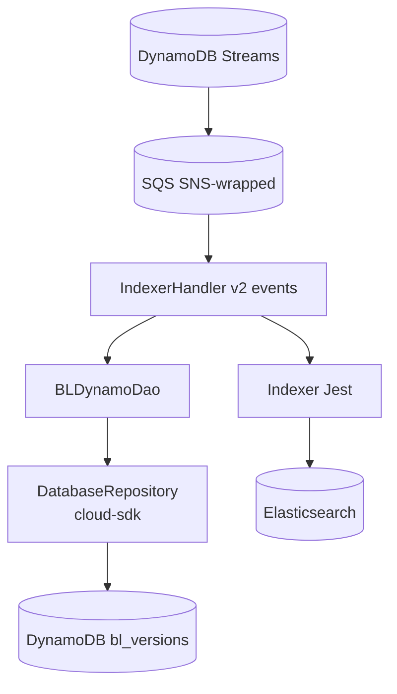
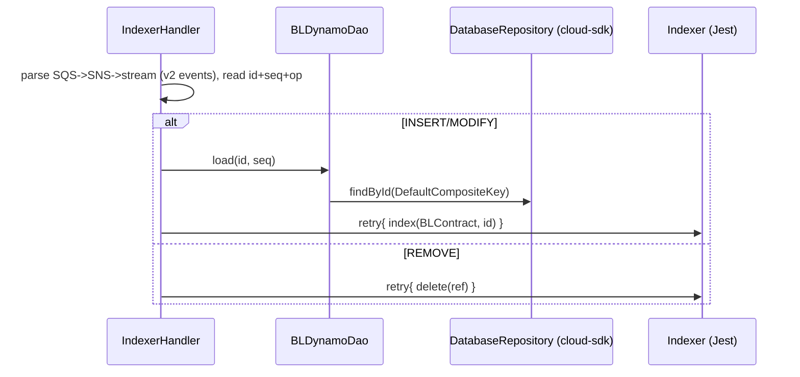

# Partner Integrator — pi-bl-es-lambda — AWS SDK 2.x (cloud-sdk) Upgrade Design

**Module:** `partner-integrator / pi-bl-es-lambda`
**Date:** 2026-06-30
**Status:** Target design — NOT STARTED
**Companion:** `2026-06-30-partner-integrator-pi-bl-es-lambda-current-state-DESIGN-copilot.md`
**Playbook:** `partner-integrator/docs/2026-06-30-partner-integrator-aws2x-DESIGN-copilot.md`

---

## 1. Change Overview

AWS Lambda that indexes BL into Elasticsearch from DynamoDB Streams. AWS scope: **DynamoDB** (read `BLVersion`) and
**AWS Lambda v1 event POJOs**. Elasticsearch (Jest/ES8) is a separate OpenSearch track.

| Concern | Current (v1) | Target |
|---------|--------------|--------|
| **DynamoDB** | `DynamoDBMapper` (`BLDynamoDao`) | `DatabaseRepository<BLVersion, DefaultCompositeKey<String,String>>` |
| **Lambda events** | `SQSEvent`/`SNSEvent`/`DynamodbEvent`/`OperationType` (v1) | `aws-lambda-java-events` v3 (or cloud-sdk envelope parsing) |
| **Runtime** | `java8` | `java17`/`java21` |

---

## 2. Maven Dependency Changes

```diff
- <dependency><groupId>com.amazonaws</groupId><artifactId>aws-lambda-java-events</artifactId><version>2.2.2</version></dependency>
+ <dependency><groupId>com.amazonaws</groupId><artifactId>aws-lambda-java-events</artifactId><version>3.11.x</version></dependency>
+ <dependency><groupId>com.inttra.mercury</groupId><artifactId>cloud-sdk-api</artifactId><version>${mercury.commons.version}</version></dependency>
+ <dependency><groupId>com.inttra.mercury</groupId><artifactId>cloud-sdk-aws</artifactId><version>${mercury.commons.version}</version></dependency>
+ <dependency><groupId>com.inttra.mercury</groupId><artifactId>dynamo-integration-test</artifactId><version>${mercury.commons.version}</version><scope>test</scope></dependency>
  <dependency><groupId>org.elasticsearch</groupId><artifactId>elasticsearch</artifactId><version>8.17.0</version></dependency>  <!-- separate track -->
```

## 3. Configuration Changes

Environment variables only — unchanged keys (`elasticsearchEndpointUrl`, `dynamoDbEnvironment`, `MAX_RETRIES`, etc.).
Lambda template `Runtime` → `java21`.

## 4. Per-Service Spec

- **DynamoDB:** `BLVersion` → enhanced annotations; `BLDynamoDao.load(id, sequenceNumber)` →
  `repository.findById(new DefaultCompositeKey<>(id, sequenceNumber), true)`.
- **Lambda events:** replace v1 `SQSEvent`/`SNSEvent`/`DynamodbEvent`/`OperationType` with v3 equivalents; keep the
  SQS→SNS→DynamoDB-stream envelope unwrapping and the `id`/`sequenceNumber`/op-type extraction identical.
- **ES:** Jest/`JestModule.newAwsSigningClient()` unchanged here (separate OpenSearch migration).

## 5. Guice / Init Changes

`HandlerSupport` builds the DynamoDB repo via `DynamoRepositoryFactory` (instead of `DynamoDBMapper`); ES client
construction unchanged.

## 6. Target Component Diagram



## 7. Target Sequence — index/delete (after)



## 8. Key Classes Changed

| Class | Change |
|-------|--------|
| `pom.xml` | lambda-events v2→v3; add cloud-sdk-api/aws + test deps. |
| `IndexerHandler` | v1 event POJOs → v2; same envelope parsing. |
| `HandlerSupport` | `DynamoDBMapper` → `DynamoRepositoryFactory`. |
| `BLDynamoDao`/`BLVersion` | enhanced client + `DefaultCompositeKey`. |

## 9. Testing Strategy

- Unit tests for envelope parsing (SQS→SNS→stream) + index/delete with mocked `Indexer`.
- **DynamoDB-Local IT** for `BLDynamoDao`. Full local **JaCoCo** coverage on changed code.

## 10. Risks & Call-outs

- Stream-record key extraction (`id`,`sequenceNumber`) + indexed doc shape must remain unchanged.
- Runtime jump `java8 → java21` — re-test cold start/memory.
- ES Jest/ES8 → OpenSearch client is a separate track.
