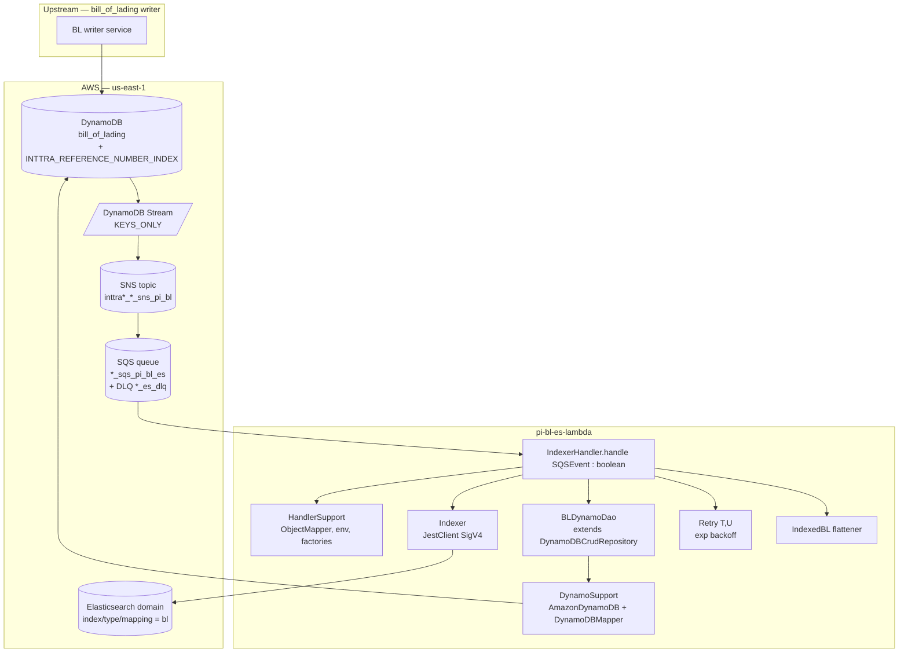
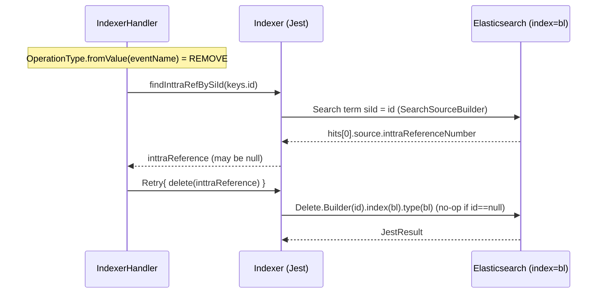

# Partner Integrator — pi-bl-es-lambda — Current-State Design

**Module:** `partner-integrator / pi-bl-es-lambda`
**Date:** 2026-06-30
**Status:** Current state — AWS SDK **1.x** (`com.amazonaws`) in production; cloud-sdk migration **NOT STARTED**
**Artifact:** `com.inttra.mercury:pi-bl-es-lambda:1.0` (AWS Lambda, single shaded JAR `pi-bl-es-lambda-1.0.jar`)
**Lambda handler:** `com.inttra.mercury.pi.lambda.IndexerHandler::handle` (CloudFormation `Runtime: java17`)

---

## 1. Business Purpose & Rules

`pi-bl-es-lambda` is an **AWS Lambda that projects Bill-of-Lading version documents into an Elasticsearch
search index**. It is the read-model builder behind BL search: upstream the `bill_of_lading` DynamoDB table emits
a **DynamoDB Stream** (`KEYS_ONLY`); that stream is fanned out through **SNS → SQS**, and each SQS message drives
one invocation of this Lambda. The handler re-reads the full item from DynamoDB (the stream is keys-only, so the
body must be fetched), deserializes the stored `message` JSON into a `BLContract`, flattens it into a search
document (`IndexedBL`), and upserts/deletes it in the `bl` Elasticsearch index keyed by INTTRA reference number.

Core responsibilities:

- **Envelope unwrapping** — each `SQSEvent.SQSMessage` body is an **SNS** notification (`SNSEvent.SNS`); the SNS
  `Message` is a serialized **DynamoDB `DynamodbStreamRecord`**. `HandlerSupport.extractSns` then
  `extractDynamoDbStreamRecord` peel the two layers (`IndexerHandler.handle`).
- **Key extraction** — the stream record's `dynamodb.keys` must contain `id`; the handler also logs `sequenceNumber`.
  A missing `id` key throws `RuntimeException("id key not found.")`.
- **INSERT / MODIFY** — `OperationType.fromValue(eventName)` ∈ {`INSERT`, `MODIFY`} ⇒ `BLDynamoDao.load(id,
  sequenceNumber)` returns the `BLVersion`; its `message` attribute is parsed to `BLContract`; `Indexer.index`
  upserts the derived `IndexedBL` into Elasticsearch (wrapped in `Retry`, default 5 attempts, exponential backoff).
- **REMOVE** — `Indexer.findInttraRefBySiId(id)` looks up the existing `inttraReferenceNumber` for the SI id, then
  `Indexer.delete(ref)` removes the document (also `Retry`-wrapped).
- **Document flattening** (`IndexedBL` constructor) — copies `state`, `inttraReference`, `shipmentId`; fans
  `BLContract.references` out into ~20 typed reference-number lists by `ReferenceType`; fans `BLContract.parties`
  out into per-role name/id pairs by `PartyRole` and accumulates a `companiesWithAccess` set; stamps
  `lastModifiedBy="System"` and a UTC `lastModifiedDateUtc`.
- **Error isolation** — any exception inside the per-message `try` is logged (with `id` + `sequenceNumber`) and
  swallowed; the handler always returns `true`. Poison messages therefore do not stall the batch, but visibility/
  redrive is delegated to the SQS dead-letter queue (`maxReceiveCount: 10`, see §6).

### Key business rules

| Rule | Detail (source) |
|------|------|
| Mandatory key | `dynamodb.keys` must contain `id`; else `RuntimeException("id key not found.")` (`IndexerHandler.handle`). |
| Operation routing | `INSERT`/`MODIFY` → load + index; `REMOVE` → resolve ref + delete. Other op types are ignored (no `default` branch). |
| Retry policy | `Retry<T,U>` runs up to `maxRetries` (env `maxRetries`, default **5**); sleeps `2^i * 1000 ms` between attempts; exhaustion throws `IllegalStateException("Failed to execute after N retries…")` which the handler's outer `catch` logs and swallows. |
| Index doc id | Elasticsearch `_id` = `BLContract.getInttraReference()` on index; on delete the `_id` is the `inttraReferenceNumber` resolved from `siId`. |
| Reference fan-out | `IndexedBL.setReference` maps each `Reference.referenceType` to a typed list (BillOfLadingNumber→`blReferenceNumbers`, BookingNumber→`carrierBookingNumbers`, PurchaseOrderNumber→`purchaseOrderNumbers`, INTTRASINumber→`inttraSINumbers`, … 20 types total). Unmapped types are dropped. |
| Party fan-out | `IndexedBL.setParties` matches `TransactionParty.partyRole.name()` against the 12 role constants in `ElasticsearchSupport` (Carrier, Consignee, Forwarder, Requestor, Shipper, ContractParty, FreightPayer, MainNotifyParty, BillOfLadingRecipient, Exporter, GoodsOwner, ToOrder); every non-null `partyINTTRACompanyId` is added to `companiesWithAccess`. |
| Timestamp format | `lastModifiedDateUtc` formatted `yyyy-MM-dd HH:mm:ss` (`ElasticsearchSupport.DATE_FORMAT`) from `new Date()` at index time. |
| TTL | `BLVersion.expiresOn` persisted as **epoch seconds** (`DateToEpochSecond`), i.e. a DynamoDB TTL number — not surfaced in the index. |

---

## 2. Design & Component Diagram

Single-class Lambda entry point (`IndexerHandler`) with **no Guice / Dropwizard** wiring — collaborators are
constructed by hand in the no-arg constructor via static factories in `HandlerSupport`. A `static {}` block calls
`HandlerSupport.configureLogging()` to quiet `org.apache.http` and `com.amazonaws` to `ERROR`. DynamoDB access is
through this module's **own** `DynamoSupport` (it builds `AmazonDynamoDB` + `DynamoDBMapper` directly) feeding
`BLDynamoDao`, which extends `DynamoDBCrudRepository` from the shared `dynamo-client`. Elasticsearch access is a
**Jest** client built with **AWS SigV4** signing (`JestModule.newAwsSigningClient`, from `commons`).



### Key classes & responsibilities

| Layer | Class | Responsibility |
|-------|-------|----------------|
| Handler | `IndexerHandler` | Entry point `boolean handle(SQSEvent)`. No-arg ctor builds `BLDynamoDao` (`HandlerSupport.newBLDao`) + `Indexer(newJestClient())`; reads `maxRetries`. Iterates SQS records, unwraps SNS→stream, routes by `OperationType`, drives index/delete under `Retry`. |
| Support | `HandlerSupport` | Static utilities: `newObjectMapper()` (case-insensitive, `LongDateDeserializer`, Joda module), env getters `getenv(key,convert[,default])`, `configureLogging()`, `extractSns`/`extractDynamoDbStreamRecord` (via `JsonSupport.fromJson`), `newBLDao()`. |
| DAO | `BLDynamoDao extends DynamoDBCrudRepository<BLVersion, DynamoHashAndSortKey<String,String>>` | `load(id, sequenceNumber)` direct mapper load; plus `findByInttraReferenceNumber`, `findByBLs`, `findByBlId` (GSI/hash queries) — only `load` is on the Lambda hot path. |
| DAO support | `DynamoSupport` | Module-local builders: `newClient()` (`AmazonDynamoDBClientBuilder`), `newMapper(client, cfg)` (`DynamoDBMapper`), `newDynamoDBMapperConfig(cfg)` (table-name prefix `"<env>_"` + resolver). **This module carries its own DynamoSupport — it does not depend on a shared `pi-commons`.** |
| ES | `Indexer` | `index(BLContract, blId)` (Jest `Index.Builder`), `delete(id)` (`Delete.Builder`), `findInttraRefBySiId(siId)` (`Search.Builder` + `term siId`). All ops target index/type `bl`. |
| ES support | `ElasticsearchSupport` | Constants: `SERVICE_NAME=es`, `INDEX_NAME/TYPE_NAME/MAPPING_NAME=bl`, field names, the 12 party-role strings, `DATE_FORMAT`. |
| Model (search) | `IndexedBL implements Record` | Flattened search document (~60 fields). Ctor `(BLContract, siId)` performs reference/party fan-out; `getId()` returns `inttraReferenceNumber`. |
| Model (entity) | `BLVersion` | `@DynamoDBTable("bill_of_lading")` entity: hash `id`, range `sequenceNumber` (`@DynamoDBAutoGeneratedKey`), GSI `INTTRA_REFERENCE_NUMBER_INDEX` on `blInttraReferenceNumber`, `message` (JSON body), `expiresOn` (epoch-second TTL). `@DynamoDBStream(KEYS_ONLY)`. |
| Model (payload) | `BLContract` + `@DynamoDBDocument` nested types | `state`, `inttraReference`, `shipmentId`, `references`, `parties`, … (~40 model classes; the bulk are `@DynamoDBDocument` POJOs used for Jackson, not persisted by this Lambda). |
| Converter | `DateToEpochSecond implements DynamoDBTypeConverter<Long,Date>` | `Date` ↔ epoch **seconds** (Long → DynamoDB `N`). |
| Util | `Retry<T,U> implements Function<T,U>` | Up to `maxRetries`, `Thread.sleep(2^i * 1000)` backoff; throws `IllegalStateException` on exhaustion. |
| Util | `LongDateDeserializer` | Jackson deserializer mapping a numeric epoch into `java.util.Date` (registered on the handler `ObjectMapper`). |

> **Note on the handler signature.** The entry point is a plain `public boolean handle(SQSEvent)` method named in
> CloudFormation as `IndexerHandler::handle`. The class does **not** implement
> `com.amazonaws.services.lambda.runtime.RequestHandler` and takes **no** `Context` / `LambdaLogger` — there is no
> `aws-lambda-java-core` dependency in the pom. (The Copilot doc's `RequestHandler<SQSEvent,?>` / `Context` /
> `LambdaLogger` is incorrect.)

---

## 3. Data Flow

### 3.1 INSERT / MODIFY — index path

```mermaid
sequenceDiagram
  participant RT as Lambda runtime
  participant H as IndexerHandler
  participant HS as HandlerSupport
  participant DAO as BLDynamoDao
  participant DDB as DynamoDB bill_of_lading
  participant IDX as Indexer (Jest SigV4)
  participant ES as Elasticsearch (index=bl)

  RT->>H: handle(SQSEvent)
  loop each SQSMessage
    H->>HS: extractSns(mapper, sqsMessage)            %% SQS body -> SNS
    HS-->>H: SNS
    H->>HS: extractDynamoDbStreamRecord(mapper, sns)  %% SNS.Message -> DynamodbStreamRecord
    HS-->>H: DynamodbStreamRecord
    H->>H: keys.get("id"); require "id"; log sequenceNumber
    Note over H: OperationType.fromValue(eventName) = INSERT/MODIFY
    H->>DAO: load(id, sequenceNumber)
    DAO->>DDB: DynamoDBMapper.load(BLVersion, id, range)
    DDB-->>DAO: BLVersion (message JSON)
    DAO-->>H: BLVersion
    H->>H: objectMapper.readValue(message, BLContract.class)
    H->>IDX: Retry{ index(BLContract, blVersion.getId()) }
    IDX->>IDX: new IndexedBL(contract, siId); JsonSupport.toJson
    IDX->>ES: Index.Builder(json).index(bl).type(bl).id(inttraReference)
    ES-->>IDX: JestResult (isSucceeded?)
  end
  H-->>RT: true
```

### 3.2 REMOVE — delete path



---

## 4. Data Stores & Integrations

### DynamoDB — table `bill_of_lading`

- **Hash key:** `id` (`@DynamoDBHashKey`, attribute `id`; Java getter `getHashKey()`).
- **Range key:** `sequenceNumber` (`@DynamoDBRangeKey @DynamoDBAutoGeneratedKey`, attribute `sequenceNumber`; getter
  `getSortKey()`). Generated form (when written by the producer): `m_<epochMillis>_<state>_<inttraRef>`.
- **GSI — `INTTRA_REFERENCE_NUMBER_INDEX`:** hash `blInttraReferenceNumber` (`@DynamoDBIndexHashKey`).
- **Stream:** `@DynamoDBStream(StreamViewType.KEYS_ONLY)` — the stream carries keys only, which is *why* the handler
  re-loads the full item via `BLDynamoDao.load`.
- **Notable attributes:** `message` (the full BL JSON, deserialized into `BLContract`), `carrierId`, `requestorId`,
  `shipperId`, `bookingNumber`, `blNumber`, `expiresOn` (epoch-second TTL via `DateToEpochSecond`, DynamoDB `N`).
- **Table-name prefixing:** `DynamoSupport.newDynamoDBMapperConfig` applies prefix `"<environment>_"` and a resolver
  `"<environment>_<DynamoDBTable.tableName>"`, so the effective table is `<dynamoDbEnvironment>_bill_of_lading`.
- **Per-env effective table** (`dynamoDbEnvironment` from the Lambda env var, see deploy scripts):

  | Env | `dynamoDbEnvironment` | Effective table |
  |-----|------------------------|-----------------|
  | INT | `inttra_int` | `inttra_int_bill_of_lading` |
  | QA | `inttra2_qa` | `inttra2_qa_bill_of_lading` |
  | **CVT** | **`inttra2_test`** | `inttra2_test_bill_of_lading` |
  | PROD | `inttra2_prod` | `inttra2_prod_bill_of_lading` |

> **Prefix note.** The Lambda is passed the **account/env prefix only** (`inttra_int`, `inttra2_qa`,
> `inttra2_test`, `inttra2_prod`) — *not* an `…_bl` suffix. The `_bill_of_lading` segment comes from the
> `@DynamoDBTable` name, so the table name carries no separate `bl` token. CVT uses **`inttra2_test`** (not
> `inttra2_cvt`).

### DynamoDB Stream → SNS → SQS (event source)

The Lambda's event source is the **SQS** queue, not the stream directly. The `BillOfLadingESStack.json`
CloudFormation template provisions:

| Resource | Name pattern (`Fn::Sub`) | Notes |
|----------|--------------------------|-------|
| Processing queue | `${Account}_${Environment}_sqs_pi_${Application}_es` | e.g. `inttra2_qa_sqs_pi_bl_es`; visibility 30s, retention 4d, max msg 256 KiB. |
| Dead-letter queue | `${Account}_${Environment}_sqs_pi_${Application}_es_dlq` | retention 14d; redrive `maxReceiveCount: 10`. |
| SNS subscription | `TableStreamSNSTopic` → processing queue (protocol `sqs`) | topic ARN `inttra*_<env>_sns_pi_bl` (deploy scripts). |
| Event-source mapping | SQS → `BLElasticSearchLambda`, `BatchSize: 1` | one message per invocation. |
| Lambda | `${Account}_${Environment}_lambda_${Application}_es_stream` | `Runtime: java17`, `Timeout: 30`, `MemorySize: 256`. |

### Elasticsearch (Jest, SigV4-signed)

- One index/type/mapping, all named **`bl`** (`ElasticsearchSupport.INDEX_NAME/TYPE_NAME/MAPPING_NAME`).
- Client = `JestModule.newAwsSigningClient(endpointUrl, region, "es", connTimeoutMillis, readTimeoutMillis, null)`
  (`IndexerHandler.newJestClient`) — Jest over Apache HTTP with **AWS Signature v4** for service `es`. **This is not
  the generic Elasticsearch 8 REST client.** (The `org.elasticsearch:elasticsearch` dependency is present only for
  query-builder helpers: `QueryBuilders`, `BoolQueryBuilder`, `SearchSourceBuilder`.)
- Per-env domain endpoints (deploy scripts), all `us-east-1`, all the shared `*-es-bk-search` domains:

  | Env | `ElasticsearchDomainEndpoint` |
  |-----|-------------------------------|
  | INT | `search-inttra-int-es-bk-search-…us-east-1.es.amazonaws.com` |
  | QA | `search-inttra2-qa-es-bk-search-…us-east-1.es.amazonaws.com` |
  | CVT | `search-inttra2-cv-es-bk-search-…us-east-1.es.amazonaws.com` |
  | PROD | `search-inttra2-pr-es-bk-search-…us-east-1.es.amazonaws.com` |

---

## 5. Maven Dependencies

| Artifact | Version | Notes |
|----------|---------|-------|
| `com.inttra.mercury:commons` | `1.R.01.023` (`${mercury.commons.version}`) | `JestModule.newAwsSigningClient`, `JsonSupport`, `ApplicationConfiguration`-family utils, `${awsps:}` resolution. |
| `com.inttra.mercury:dynamo-client` | `1.R.01.023` (`${mercury.dynamodbclient.version}`) | `DynamoDBCrudRepository`, `DynamoRepositoryConfig`, `DynamoHashAndSortKey`, `DynamoDbConfig`, `@DynamoDBStream`. **Pulls AWS SDK v1 DynamoDB (`com.amazonaws.services.dynamodbv2.*`) transitively.** |
| `org.elasticsearch:elasticsearch` | `8.17.0` (`${elasticsearch.version}`) | Query-builder helpers only (`QueryBuilders`, `SearchSourceBuilder`). Actual transport is Jest (from `commons`). |
| **`com.amazonaws:aws-lambda-java-events`** | **`2.2.2`** (`${aws-lambda-java-events.version}`) | **AWS v1 Lambda event POJOs** — `SQSEvent`, `SNSEvent.SNS`, `DynamodbEvent.DynamodbStreamRecord`. |
| `org.mockito:mockito-core` / `mockito-junit-jupiter` | `5.16.0` (test) | Unit tests. |
| `org.junit.jupiter:junit-jupiter-api` | `5.12.0` (test) | JUnit 5. |
| Build | `maven-shade-plugin:3.5.3`, `maven-compiler-plugin:3.14.0` (release **17**) | Fat JAR (`finalName=pi-bl-es-lambda-1.0`). `sonar.coverage.exclusions=**/model/**`. |

> **AWS SDK posture.** v1 DynamoDB (`com.amazonaws.services.dynamodbv2.*`) arrives **transitively via
> `dynamo-client`** and is used directly in `DynamoSupport` (`AmazonDynamoDB`, `AmazonDynamoDBClientBuilder`,
> `DynamoDBMapper`, `DynamoDBMapperConfig`) and across the ORM annotations on `BLVersion` and the `@DynamoDBDocument`
> model classes. The only **directly declared** `com.amazonaws` artifact is `aws-lambda-java-events:2.2.2` (event
> POJOs). A repo-wide grep across this module finds **zero** `software.amazon.awssdk` and **zero** `cloud-sdk`
> references. The Jest/SigV4 ES path comes from `commons`, not the AWS SDK.

---

## 6. Configuration & Deployment

### Configuration — environment variables only (no `config.yaml`)

| Env var | Consumer | Default | Purpose |
|---------|----------|---------|---------|
| `dynamoDbEnvironment` | `HandlerSupport.newBLDao` | — (required) | DynamoDB table prefix (`inttra2_test`, …). Missing ⇒ `IllegalArgumentException`. |
| `elasticsearchEndpointUrl` | `IndexerHandler.newJestClient` | — (required) | ES domain endpoint. |
| `AWS_DEFAULT_REGION` | `IndexerHandler.newJestClient` | — (required) | SigV4 signing region (service `es`). |
| `connTimeoutMillis` | `newJestClient` | 5000 | Jest connect timeout. |
| `readTimeoutMillis` | `newJestClient` | 10000 | Jest read timeout. |
| `maxRetries` | `IndexerHandler` ctor | 5 | `Retry` attempts. |
| `sqsArn` | CF template only | — | Set in the Lambda environment block (informational). |

### Deployment

- `build.sh` → `mvn … package sonar:sonar -P mercury-commons,sonar -pl <app_dir> --also-make`, renames the shaded
  JAR to `${app}-${RELEASE}.jar` under `/app`, and copies `cfscripts/*`.
- CloudFormation `cfscripts/BillOfLadingESStack.json` provisions the SQS processing queue + DLQ, the SNS→SQS
  subscription, the Lambda (`Handler com.inttra.mercury.pi.lambda.IndexerHandler::handle`, `Runtime java17`,
  `Timeout 30s`, `Memory 256 MB`), the SQS event-source mapping (`BatchSize 1`), and a 14-day CloudWatch log group.
- `deploy_{int,cvt,qa,prod}.sh` invoke `aws cloudformation deploy` with per-env overrides:

  | Env | Account | AccountId | `DynamoDbEnvironment` | SNS topic ARN |
  |-----|---------|-----------|------------------------|----------------|
  | INT | inttra | 081020446316 | `inttra_int` | `…:081020446316:inttra_int_sns_pi_bl` |
  | QA | inttra2 | 642960533737 | `inttra2_qa` | `…:642960533737:inttra2_qa_sns_pi_bl` |
  | CVT | inttra2 | 642960533737 | `inttra2_test` | `…:642960533737:inttra2_cv_sns_pi_bl` |
  | PROD | inttra2 | 642960533737 | `inttra2_prod` | `…:642960533737:inttra2_pr_sns_pi_bl` |

  > **CVT split-naming trap:** the DynamoDB prefix is `inttra2_test` while the SNS topic and ES domain use the `cv`
  > token (`inttra2_cv_sns_pi_bl`, `inttra2-cv-es-bk-search`). Both must be carried verbatim.
- **Credentials / IAM** — default AWS credential chain (Lambda execution role
  `INTTRA*-LAMBDA-<ENV>-BL-ES-STREAM`). Both `AmazonDynamoDBClientBuilder.standard().build()` and the SigV4 Jest
  client rely on it; the role needs DynamoDB read on `*_bill_of_lading`, SQS consume, and ES HTTP access.

---

## 7. AWS Services & SDK 1.x Usage (CALL-OUT)

> **This module uses AWS SDK v1 (`com.amazonaws`) only.** No `software.amazon.awssdk` / `cloud-sdk` anywhere.

| AWS service | SDK | Where (class) | Concrete classes / annotations |
|-------------|-----|---------------|--------------------------------|
| **DynamoDB (client + ORM)** | v1 (transitive via `dynamo-client`) | `DynamoSupport`, `BLDynamoDao`, `HandlerSupport.newBLDao`, `BLVersion`, `DateToEpochSecond`, `@DynamoDBDocument` model classes | `AmazonDynamoDB`, `AmazonDynamoDBClientBuilder`, `AwsClientBuilder.EndpointConfiguration`, `DynamoDBMapper`, `DynamoDBMapperConfig`, `@DynamoDBTable`, `@DynamoDBHashKey`, `@DynamoDBRangeKey`, `@DynamoDBAutoGeneratedKey`, `@DynamoDBAttribute`, `@DynamoDBIndexHashKey`, `@DynamoDBIgnore`, `@DynamoDBTypeConverted`, `@DynamoDBTypeConvertedEnum`, `@DynamoDBDocument`, `DynamoDBTypeConverter`, `StreamViewType`. |
| **Lambda event POJOs** | v1 (`aws-lambda-java-events:2.2.2`, direct) | `IndexerHandler`, `HandlerSupport` | `SQSEvent`, `SQSEvent.SQSMessage`, `SNSEvent.SNS`, `DynamodbEvent`, `DynamodbEvent.DynamodbStreamRecord`, `com.amazonaws.services.dynamodbv2.model.AttributeValue`, `OperationType`. |
| **Lambda runtime core** | **none** | — | No `aws-lambda-java-core`; handler is a POJO method `handle(SQSEvent):boolean`. No `Context`/`RequestHandler`/`LambdaLogger`. |
| **Elasticsearch** | Jest + SigV4 (from `commons`, **not** AWS SDK) | `IndexerHandler.newJestClient`, `Indexer` | `JestModule.newAwsSigningClient`, `io.searchbox.*` (`JestClient`, `Index`, `Delete`, `Search`); ES query builders from `org.elasticsearch:elasticsearch`. |
| **SQS / SNS** | **none in code** | infrastructure only | The SNS→SQS plumbing is CloudFormation; the Lambda only *consumes* `SQSEvent` POJOs — it instantiates no SQS/SNS client. |
| **Parameter Store** | n/a | — | No `${awsps:}` here; all config is plain Lambda env vars. |

**DynamoDB converter:** `DateToEpochSecond implements DynamoDBTypeConverter<Long,Date>` (Date ↔ epoch **seconds**,
on-wire `N`) — the one custom converter that must round-trip identically on migration.

---

## 8. AWS 2.x / cloud-sdk Upgrade Plan (High Level)

Goal: remove direct/transitive AWS SDK v1 by swapping `dynamo-client` for the in-house **cloud-sdk** (`cloud-sdk-api`
+ `cloud-sdk-aws`, AWS SDK 2.x Enhanced Client + Apache HTTP), mirroring **booking** and **visibility**.

| Step | Action | Reference |
|------|--------|-----------|
| 1 | Bump `commons` to the cloud-sdk line; **remove** `dynamo-client`; add `cloud-sdk-api` + `cloud-sdk-aws`; add `dynamo-integration-test` (test); keep v1 `aws-java-sdk-dynamodb` **test-scoped** for DynamoDB Local. | `booking`/`visibility` pom |
| 2 | Migrate `BLVersion` ORM → `@DynamoDbBean`/`@Table` + enhanced key annotations; re-implement `DateToEpochSecond` as `software.amazon.awssdk.enhanced.dynamodb.AttributeConverter` (preserve epoch-second `N`). Migrate the `@DynamoDBDocument` model classes to `@DynamoDbBean` (only if persisted; most are Jackson-only). | `network`, `registration` DAO patterns |
| 3 | Rewrite `DynamoSupport` + `BLDynamoDao` on `DynamoRepositoryFactory.createEnhancedRepository(...)` / `DatabaseRepository`; preserve table `bill_of_lading`, the `id`/`sequenceNumber` key schema, and the `INTTRA_REFERENCE_NUMBER_INDEX` GSI. | `booking` `*Dao` |
| 4 | Keep the **Lambda event POJOs** (`aws-lambda-java-events`) as-is unless a version bump is needed — the SQS→SNS→stream envelope parsing and the `id`/`sequenceNumber`/op-type extraction must stay byte-identical. Event POJOs may legitimately stay on v1 even after client calls move to v2. | partner-integrator playbook |
| 5 | Leave the **Jest/SigV4 Elasticsearch** path untouched (separate OpenSearch-client track). | — |
| 6 | **Tests** — unit tests for envelope parsing + index/delete with a mocked `Indexer`; DynamoDB-Local IT for `BLDynamoDao.load`; full local JaCoCo on changed code. | `network`/`auth` `*DaoIT` |

**Risks / call-outs:**
- The **stream-record key extraction** (`id`, `sequenceNumber`) and the **`IndexedBL` document shape** (Elasticsearch
  `_id = inttraReferenceNumber`, field names in `ElasticsearchSupport`) must remain unchanged so the index stays
  consistent and searchable.
- `DateToEpochSecond` is **seconds**, not milliseconds — the v2 `AttributeConverter` must keep the `/1000` and the
  `N` type.
- This module's **own `DynamoSupport`** (not a shared `pi-commons`) is the migration surface — the prefix logic
  (`"<env>_"` + `@DynamoDBTable` name → `<env>_bill_of_lading`) must be reproduced exactly in the cloud-sdk config.
- CVT DynamoDB prefix is **`inttra2_test`** (SNS/ES use `cv`) — do not normalise to `inttra2_cvt`.
- `aws-lambda-java-events` is on **`2.2.2`** today (not v3); treat any bump as an isolated, separately-verified change.
