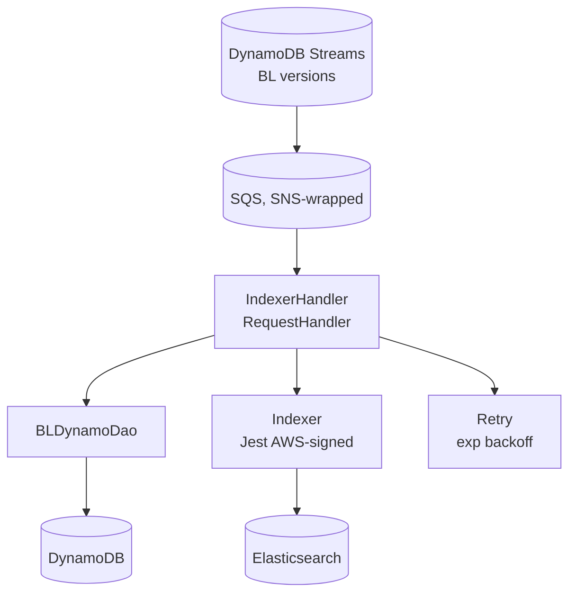
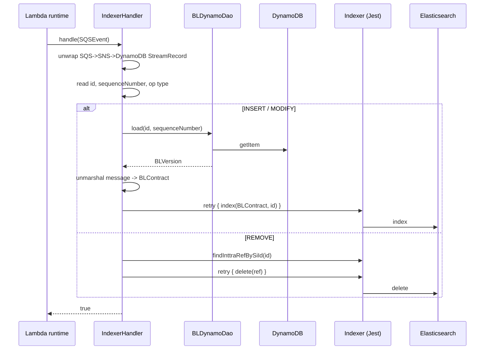

# Partner Integrator — pi-bl-es-lambda — Current-State Design

**Module:** `partner-integrator / pi-bl-es-lambda`
**Date:** 2026-06-30
**Status:** Current state (AWS SDK 1.x — upgrade NOT STARTED)
**Artifact:** `com.inttra.mercury:pi-bl-es-lambda:1.0` (AWS Lambda, shaded JAR)
**Handler:** `com.inttra.mercury.pi.lambda.IndexerHandler::handle`

---

## 1. Business Purpose & Rules

AWS Lambda that **indexes Bill of Lading documents into Elasticsearch** from DynamoDB Streams.

### Flow / rules
1. `pi-bl-in-processor` writes `BLVersion` to DynamoDB; a stream change is delivered (via SQS, SNS-wrapped) to this Lambda.
2. Extract the DynamoDB `StreamRecord`; require `id` + `sequenceNumber`.
3. **INSERT/MODIFY** → load full `BLVersion`, unmarshal `message` → `BLContract`, index to Elasticsearch (retry ≤5, exponential backoff).
4. **REMOVE** → find BL by id, delete from index (retry ≤5).
5. Parse errors are logged and skipped (no poison-pill stall).

---

## 2. Design & Component Diagram

### Key classes

| Class | Role |
|-------|------|
| `IndexerHandler` (`RequestHandler<SQSEvent,?>`) | Entry point; orchestrate DynamoDB read → ES index/delete. |
| `HandlerSupport` | Static utilities: Jackson mapper, AWS client builders, env getters, logging. |
| `BLDynamoDao` | `load(id, sequenceNumber)` → `BLVersion` via `DynamoDBMapper`. |
| `Indexer` | ES ops `index(BLContract,id)`, `delete(ref)`, `findInttraRefBySiId(id)` via Jest. |
| `BLVersion` | `@DynamoDBTable` entity (`id` hash, `sequenceNumber` range, `message` JSON). |
| `BLContract` | JAXB/Jackson object from `message`. |
| `Retry<T,R>` | Function wrapper with exponential backoff. |

---

## 3. Data Flow — index/delete

---

## 4. Data Stores & Integrations

| Resource | Usage |
|----------|-------|
| DynamoDB `bl_versions` | Read BL by id + sequenceNumber. |
| DynamoDB Streams → SQS (SNS-wrapped) | Lambda event source. |
| Elasticsearch (AWS-signed Jest) | Index/delete BL documents. |

---

## 5. Maven Dependencies

| Artifact | Version | Notes |
|----------|---------|-------|
| `com.inttra.mercury:commons` | `1.R.01.023` | `JestModule.newAwsSigningClient()`, utils. |
| `com.inttra.mercury:dynamo-client` | `1.R.01.023` | DynamoDB base. |
| **`com.amazonaws:aws-lambda-java-events`** | **`2.2.2`** | **AWS v1 Lambda event POJOs.** |
| `org.elasticsearch:elasticsearch` | `8.17.0` | ES client lib. |

---

## 6. Configuration & Deployment

- **Configuration** — environment variables only (no YAML): `elasticsearchEndpointUrl`, `AWS_DEFAULT_REGION`,
  `connTimeoutMillis`, `readTimeoutMillis`, `dynamoDbEnvironment`, `MAX_RETRIES`.
- **Deployment** — `build.sh` → `pi-bl-es-lambda-1.0.jar` (shaded, includes ES + Jackson + AWS SDK). Lambda config:
  handler `com.inttra.mercury.pi.lambda.IndexerHandler`, SQS event source (SNS-wrapped). CloudFormation templates
  under `cfscripts/`.

---

## 7. AWS Services & SDK 1.x Usage (CALL-OUT)

| AWS service | SDK | v1 classes |
|-------------|-----|-----------|
| **DynamoDB** | v1 | `DynamoDBMapper`, ORM on `BLVersion`, `OperationType` |
| **Lambda runtime/events** | v1 | `RequestHandler`, `Context`, `LambdaLogger`, `SQSEvent`, `SNSEvent`, `DynamodbEvent` |
| **Elasticsearch** | Jest (not AWS SDK) | AWS Signature v4 signing via `JestModule` |

---

## 8. AWS 2.x / cloud-sdk Upgrade Plan (High Level)

| Step | Action | Reference |
|------|--------|-----------|
| 1 | Replace AWS v1 Lambda event POJOs (`SQSEvent`/`SNSEvent`/`DynamodbEvent`, `OperationType`) with v2 (`aws-lambda-java-events` v3) — keep the SQS→SNS→stream envelope parsing identical. | booking lambdas |
| 2 | Migrate `BLDynamoDao`/`BLVersion` to cloud-sdk `DatabaseRepository`/enhanced client; preserve `bl_versions` schema. | network, registration |
| 3 | Upgrade Lambda runtime `java8` → `java17`/`java21`; re-test cold start + memory. | — |
| 4 | Move ES from Jest/ES8 to OpenSearch Java client with SigV4 (separate track). | — |
| 5 | **Tests** — unit tests for envelope parsing + index/delete with mocked Indexer; DynamoDB-Local IT for `BLDynamoDao`; full JaCoCo coverage. | network/auth `*DaoIT` |

**Call-out:** stream-record key extraction (`id`, `sequenceNumber`) and the indexed document shape must remain
unchanged so the search index stays consistent.
