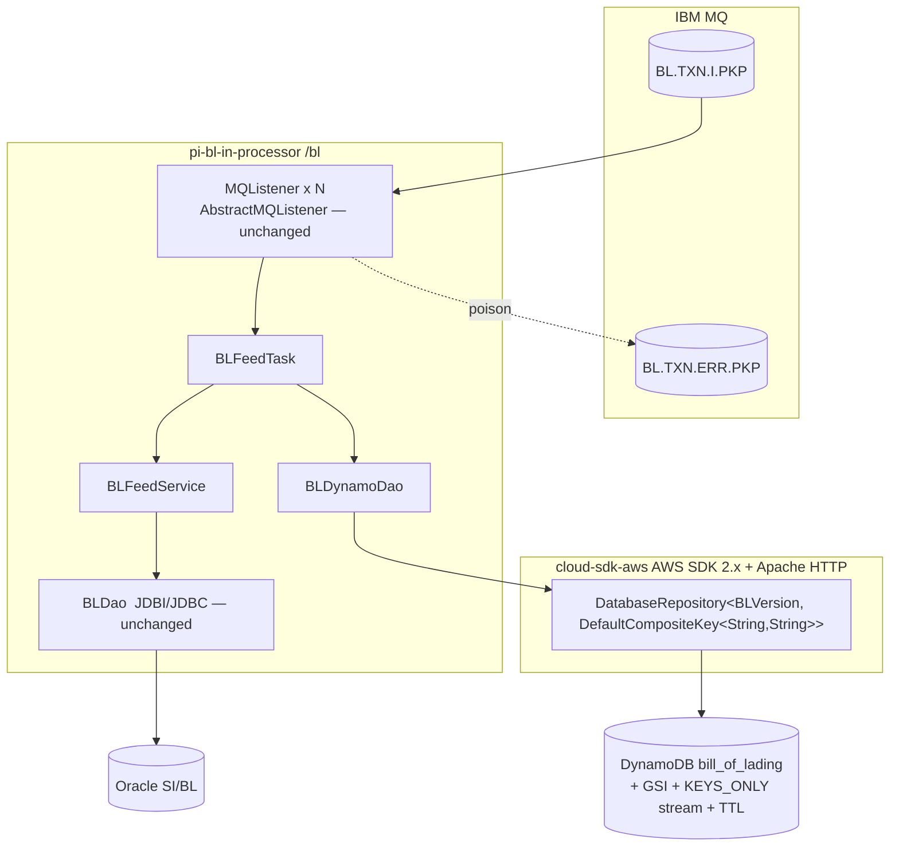
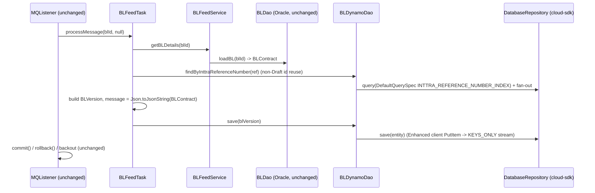

# Partner Integrator — pi-bl-in-processor — AWS SDK 2.x (cloud-sdk) Upgrade Design

**Module:** `partner-integrator / pi-bl-in-processor`
**Date:** 2026-06-30
**Status:** Target design (AWS 1.x → AWS 2.x via cloud-sdk) — **NOT STARTED** (gated on `pi-commons` cloud-sdk line)
**Companion:** `2026-06-30-partner-integrator-pi-bl-in-processor-current-state-DESIGN-claude.md`
**Reference upgrades:** `booking` (S3 + DynamoDB, complete — `commons`/`cloud-sdk-api`/`cloud-sdk-aws` `1.0.26-SNAPSHOT`), `visibility` (DynamoDB + SNS/SQS), `network`/`registration` (DynamoDB DAO patterns)

---

## 1. Change Overview

Replace the AWS SDK v1 (`com.amazonaws.*`) **DynamoDB** usage with the in-house **cloud-sdk** (`cloud-sdk-api` +
`cloud-sdk-aws`, AWS SDK 2.x Enhanced Client + Apache HTTP). **DynamoDB is the only AWS service in scope** — there is
no S3, SNS, SQS, or Kinesis client anywhere in this module (see current-state §7), so unlike the generic
partner-integrator playbook there is **nothing to migrate to `StorageClient`/`EventPublisher` here**.

| AWS service | Current (v1) | Target (cloud-sdk / v2) |
|-------------|--------------|--------------------------|
| **DynamoDB (runtime ORM)** | `DynamoDBMapper` + v1 ORM annotations on `BLVersion` (via `pi-commons`→`dynamo-client`) | `DatabaseRepository<BLVersion, DefaultCompositeKey<String,String>>` + Enhanced-client annotations + `DefaultQuerySpec` |
| **DynamoDB (table/GSI/stream/TTL admin)** | `DynamoDBTableMapper` + `TableUtils` + control-plane requests in `CreateTables`/`DeleteTables` | cloud-sdk admin/bootstrap path (preserve name, key schema, GSI, `KEYS_ONLY` stream, TTL, 25/25) |

**Out of scope (unchanged):** IBM MQ (`com.ibm.mq`, `AbstractMQListener`/`MQService`), Oracle/JDBI (`BLDao`,
`dropwizard-jdbi3`), Elasticsearch (Jest re-index commands, ES8), Parameter Store (`${awsps:}` resolved by commons),
and the latent `Indexer`/`aws-lambda-java-events` code.

**Backward-compatibility is mandatory.** The following must stay wire-identical so existing `bill_of_lading` items
remain readable and the downstream stream consumers (`pi-bl-es-lambda`, stream-to-SNS) keep parsing:

- DynamoDB table `bill_of_lading`; GSI `INTTRA_REFERENCE_NUMBER_INDEX`; key schema (hash `id`, range
  `sequenceNumber`, GSI hash `blInttraReferenceNumber`); **`KEYS_ONLY` stream**; TTL attribute `expiresOn`.
- Attribute encodings: `id`/`sequenceNumber`/`blInttraReferenceNumber`/`message`/`carrierId`/`requestorId`/
  `shipperId`/`blNumber`/`bookingNumber` as **strings (S)**; `expiresOn` as a **number (N) = epoch seconds**
  (`millis / 1000`); `message` = the **JSON-serialized `BLContract` string** (`Json.toJsonString`).
- The range-key format `m_{millis}_{state}_{inttraRef}` and the hash-key reuse rule (UUID for `AdvanceNotificationDraft`,
  else reuse prior version's `id`).
- **Decoupling rule:** the DynamoDB on-wire format is independent of the REST/stream JSON. `BLVersion.message`
  already holds Jackson JSON (`Json.toJsonString(BLContract)`); that JSON serialization is governed by Jackson and
  must **not** be replaced by an `AttributeConverter`. Only the *scalar* DynamoDB attributes (and the epoch-seconds
  TTL converter) move to the v2 enhanced encoding — the JSON string content of `message` stays byte-identical.

---

## 2. Maven Dependency Changes

The DynamoDB v1 line is inherited transitively from `pi-commons`→`dynamo-client`; once `pi-commons` ships the
cloud-sdk line, this module only needs the test deps. (No `dynamo-client`/`cloud-sdk` artifact is declared directly
in this pom today.)

```diff
  <dependency>
    <groupId>com.inttra.mercury</groupId>
    <artifactId>pi-commons</artifactId>
    <version>1.0</version>           <!-- consumes cloud-sdk-api + cloud-sdk-aws once pi-commons is rebased -->
    <scope>compile</scope>
  </dependency>

+ <!-- DynamoDB Local integration-test framework (matches booking) -->
+ <dependency>
+   <groupId>com.inttra.mercury</groupId>
+   <artifactId>dynamo-integration-test</artifactId>
+   <version>${mercury.commons.version}</version>
+   <scope>test</scope>
+ </dependency>
+ <!-- AWS SDK v1 DynamoDB kept ONLY for DynamoDB Local in tests -->
+ <dependency>
+   <groupId>com.amazonaws</groupId>
+   <artifactId>aws-java-sdk-dynamodb</artifactId>
+   <scope>test</scope>
+ </dependency>

  <dependency>
    <groupId>io.dropwizard</groupId>
    <artifactId>dropwizard-jdbi3</artifactId>
    <version>5.0.1</version>          <!-- Oracle, unchanged -->
  </dependency>
  <dependency>
    <groupId>org.elasticsearch</groupId>
    <artifactId>elasticsearch</artifactId>
    <version>${elasticsearch.version}</version>  <!-- ES8, unchanged -->
  </dependency>
```

- The `aws-lambda-java-events` dependency is unused by the MQ flow; leave as-is (or remove in a separate cleanup —
  out of scope for this migration).
- cloud-sdk uses **Apache HTTP** (no Netty), matching the booking/visibility rebase (see
  `cloud-sdk-aws/docs/2026-05-28-netty-critical.md`).
- After `pi-commons` drops transitive `dynamo-client`/`aws-java-sdk-dynamodb` from prod, **no `com.amazonaws`
  remains on the runtime classpath** (test-scoped v1 DynamoDB stays for DynamoDB Local only).

## 3. Configuration Changes (`conf/<env>/config.yaml`)

The `dynamoDbConfig` block keeps its existing keys and gains the cloud-sdk `BaseDynamoDbConfig` fields. The
`environment` prefixes — **including CVT's `inttra2_test`** — and 25/25 capacities stay unchanged.

```diff
  dynamoDbConfig:
    readCapacityUnits: 25
    writeCapacityUnits: 25
    environment: inttra2_qa          # CVT stays inttra2_test, INT inttra_int, PROD inttra2_prod
    sseEnabled: false
+   region: us-east-1                # was implicit via default chain in DynamoSupport.newClient
+   # local Dynamo emulator only:
+   #regionEndpoint: http://localhost:8000
+   #signingRegion: us-west-2
  # mqPickupConfig / database (Oracle) / blElasticSearch / reindexESConfiguration / serviceDefinitions — unchanged
```

**Config class change** — `BLApplicationConfig.dynamoDbConfig` moves from
`com.inttra.mercury.dynamo.respository.module.DynamoDbConfig` to
`com.inttra.mercury.cloudsdk.database.config.BaseDynamoDbConfig` (keep `@Valid @NotNull`, as in `BookingConfig`):

```diff
- import com.inttra.mercury.dynamo.respository.module.DynamoDbConfig;
+ import com.inttra.mercury.cloudsdk.database.config.BaseDynamoDbConfig;
  @Data
  @EqualsAndHashCode(callSuper = false)
  public class BLApplicationConfig extends ApplicationConfiguration {
    ...
-   @Valid @NotNull
-   private DynamoDbConfig dynamoDbConfig;
+   @Valid @NotNull
+   private BaseDynamoDbConfig dynamoDbConfig;
  }
```

> The module-local `com.inttra.mercury.blfeed.dao.DynamoSupport` (v1 client/mapper factory) is **deleted** — its job
> moves into the cloud-sdk repository factory. Note this is distinct from the commons `DynamoSupport` that
> `CreateTables`/`DeleteTables` import.

## 4. Per-Service Spec

### 4.1 DynamoDB entity — `BLVersion` (+ TTL converter)

**Entity before (v1 ORM):**
```java
@DynamoDBTable(tableName = "bill_of_lading")
@DynamoDBStream(StreamViewType.KEYS_ONLY)
public class BLVersion implements Expires, DynamoHashAndSortKey<String,String> {
  @DynamoDBHashKey  @DynamoDBAttribute("id")             public String getHashKey() { return id; }
  @DynamoDBRangeKey @DynamoDBAutoGeneratedKey @DynamoDBAttribute("sequenceNumber") public String getSortKey() { return sequenceNumber; }
  @DynamoDBAttribute @DynamoDBIndexHashKey(globalSecondaryIndexName=INTTRA_REFERENCE_NUMBER_INDEX) private String blInttraReferenceNumber;
  @DynamoDBAttribute private String message;
  @DynamoDBAttribute @DynamoDBTypeConverted(converter=DateToEpochSecond.class) private Date expiresOn;
  // carrierId, requestorId, shipperId, blNumber, bookingNumber
}
```

**Entity after (Enhanced client):**
```java
@DynamoDbBean
@Table(name = "bill_of_lading")          // com.inttra.mercury.cloudsdk.database.annotation.Table
public class BLVersion implements Expires {   // composite key handled by DefaultCompositeKey at the repo
  @DynamoDbPartitionKey @DynamoDbAttribute("id")               public String getId() {...}
  @DynamoDbSortKey      @DynamoDbAttribute("sequenceNumber")   public String getSequenceNumber() {...}

  @DynamoDbSecondaryPartitionKey(indexNames = "INTTRA_REFERENCE_NUMBER_INDEX")
  @DynamoDbAttribute("blInttraReferenceNumber")                public String getBlInttraReferenceNumber() {...}

  @DynamoDbAttribute("message")                                public String getMessage() {...}   // JSON string, unchanged

  @DynamoDbConvertedBy(DateToEpochSecondAttributeConverter.class)   // N = epoch seconds, wire-identical
  @DynamoDbAttribute("expiresOn")                              public Date getExpiresOn() {...}
}
```

- **`@DynamoDBAutoGeneratedKey` on `sequenceNumber` is dropped** — the value is always set explicitly in the
  `BLVersion(id, state, expiresOn, inttraRef)` constructor (`m_{millis}_{state}_{inttraRef}`). The enhanced client
  has no auto-generated-key equivalent; the constructor already covers it.
- **Stream + TTL** are table properties, not entity annotations in v2; they move to the bootstrap path (§4.3). The
  `@DynamoDBStream(KEYS_ONLY)` semantics must be reproduced exactly.
- `Expires` interface stays; only the converter is swapped.

**Converter** (re-implement as `software.amazon.awssdk.enhanced.dynamodb.AttributeConverter<Date>`):

| v1 converter | v2 replacement | On-wire encoding (unchanged) |
|---|---|---|
| `DateToEpochSecond` (`DynamoDBTypeConverter<Long,Date>`) | `DateToEpochSecondAttributeConverter` (`AttributeValue` `N`) | `date.getTime() / 1000` epoch **seconds**; inverse `new Date(n * 1000)` |

```java
// AFTER — software.amazon.awssdk.enhanced.dynamodb.AttributeConverter<Date>
public AttributeValue transformFrom(Date d) { return AttributeValue.fromN(Long.toString(d.getTime() / 1000)); }
public Date transformTo(AttributeValue v)   { return new Date(Long.parseLong(v.n()) * 1000); }
public AttributeValueType attributeValueType() { return AttributeValueType.N; }
```

> `BLContract` and its ~40 `@DynamoDBDocument` nested types are **never stored as DynamoDB maps** on this path — they
> are serialized to the `message` string by `Json.toJsonString`. Their `@DynamoDBDocument`/`@DynamoDBTypeConvertedEnum`
> annotations are vestigial and can be removed without affecting the wire format, but doing so is **optional cleanup**
> and must not change the Jackson JSON output of `message`.

### 4.2 DynamoDB DAO — `BLDynamoDao`

**Before (v1, `DynamoDBCrudRepository`):**
```java
public class BLDynamoDao extends DynamoDBCrudRepository<BLVersion, DynamoHashAndSortKey<String,String>> {
  @Inject public BLDynamoDao(DynamoDBMapper m, DynamoDBMapperConfig c) {
    super(m, c, DynamoRepositoryConfig.builder().domainType(BLVersion.class).build());
  }
  public BLVersion load(String id, String range) { return dynamoDBMapper.load(BLVersion.class, id, range); }
  public List<BLVersion> findByInttraReferenceNumber(String ref) {
    List<BLVersion> details = query(BLVersion.INTTRA_REFERENCE_NUMBER_INDEX, ref, null,
        "blInttraReferenceNumber = :hashKeyValue");
    return findByBLs(details.stream().map(BLVersion::getId).collect(toSet()));
  }
  public List<BLVersion> findByBlId(String id) { return query(id, "id = :hashKeyValue"); }
}
```

**After (cloud-sdk `DatabaseRepository` + `DefaultQuerySpec`, mirrors booking `TemplateSummaryDao`):**
```java
public class BLDynamoDao {
  private final DatabaseRepository<BLVersion, DefaultCompositeKey<String,String>> repo;
  @Inject public BLDynamoDao(DatabaseRepository<BLVersion, DefaultCompositeKey<String,String>> repo) { this.repo = repo; }

  public void save(BLVersion v) { repo.save(v); }

  public BLVersion load(String id, String range) {
    return repo.findById(new DefaultCompositeKey<>(id, range)).orElse(null);
  }

  public List<BLVersion> findByInttraReferenceNumber(String ref) {
    DefaultQuerySpec spec = DefaultQuerySpec.builder()
        .indexName("INTTRA_REFERENCE_NUMBER_INDEX")
        .partitionKeyValue(CloudAttributeValue.ofString(ref))
        .build();
    Set<String> ids = repo.query(spec).stream().map(BLVersion::getId).collect(toSet());
    return findByBLs(ids);
  }

  public List<BLVersion> findByBlId(String id) {
    return repo.query(DefaultQuerySpec.builder()
        .partitionKeyValue(CloudAttributeValue.ofString(id)).build());
  }
}
```

- The GSI query → `findByBLs` → per-id `findByBlId` **fan-out is preserved behaviourally** (same N+1 read shape the
  v1 code used).
- `save` continues to emit a `KEYS_ONLY` stream record on `PutItem` (downstream consumers unaffected).

> **Gap call-out.** The v1 production path used `AmazonDynamoDBClientBuilder.standard().build()` with the default
> credential/region chain and **no explicit retry/timeout knobs** (none were set). The cloud-sdk repository factory
> manages its own SDK-2.x client; if any implicit v1 retry/socket behaviour must be matched, verify the cloud-sdk
> client config exposes it, else raise a `cloud-sdk-api` enhancement (same gap flagged in booking/visibility).

### 4.3 DynamoDB admin — `CreateTables` / `DeleteTables`

These use the v1 control plane (`DynamoDBTableMapper`, `TableUtils`, `UpdateTableRequest`, `StreamSpecification`,
`TimeToLiveSpecification`). Migrate to the cloud-sdk admin/bootstrap path while **preserving**: table name
`bill_of_lading`, hash/range key schema, `INTTRA_REFERENCE_NUMBER_INDEX`, the **`KEYS_ONLY` stream**, the TTL on
`expiresOn` (`Expires.EXPIRES_ON_ATTRIBUTE_NAME`), 25/25 throughput, and SSE-from-config. The stream + TTL are the
riskiest to reproduce because the v1 code derives them from the `@DynamoDBStream` annotation and the `Expires`
interface — both must be wired explicitly in the v2 bootstrap.

## 5. Guice Wiring Changes

```diff
  // BLApplicationInjector.configure()
- AmazonDynamoDB client = DynamoSupport.newClient(blPIApplicationConfig.getDynamoDbConfig());
- bind(AmazonDynamoDB.class).toInstance(client);
- DynamoDBMapperConfig cfg = DynamoSupport.newDynamoDBMapperConfig(blPIApplicationConfig.getDynamoDbConfig());
- bind(DynamoDBMapperConfig.class).toInstance(cfg);
- DynamoDBMapper mapper = DynamoSupport.newMapper(client, blPIApplicationConfig.getDynamoDbConfig(), cfg);
- bind(DynamoDBMapper.class).toInstance(mapper);
  // (keep: Jdbi/Oracle binding, MQConfig, ServiceDefinitions, GeographyService binding,
  //  and the @Provides List<Listener> MQ fan-out — all UNCHANGED)
```

```diff
+ // @Provides in BLApplicationInjector (or a new BLDynamoModule) — pattern from BookingDynamoModule
+ @Provides @Singleton
+ DatabaseRepository<BLVersion, DefaultCompositeKey<String,String>> provideBlRepo(BLApplicationConfig c) {
+     String table = c.getDynamoDbConfig().getEnvironment() + "_"
+                  + BLVersion.class.getAnnotation(Table.class).name();   // {env}_bill_of_lading
+     return DynamoRepositoryFactory.createEnhancedRepository(
+         c.getDynamoDbConfig(), table, BLVersion.class,
+         DynamoRepositoryConfig.builder().domainType(BLVersion.class).build());
+ }
```

`BLDynamoDao`'s constructor changes from `(DynamoDBMapper, DynamoDBMapperConfig)` to the injected
`DatabaseRepository<BLVersion, DefaultCompositeKey<String,String>>`. **No change to the MQ listener fan-out,
Oracle/JDBI binding, or `GeographyService` binding** — the MQ trigger path is untouched.

## 6. Target Component Diagram



## 7. Target Data Flow — inbound BL message (after)



## 8. Key Classes Changed

| Class | Change |
|-------|--------|
| `pom.xml` | add `dynamo-integration-test` (test) + test-scoped `aws-java-sdk-dynamodb`; inherit cloud-sdk via the rebased `pi-commons`. |
| `BLApplicationConfig` | `dynamoDbConfig` type `DynamoDbConfig` → `BaseDynamoDbConfig`. |
| `BLApplicationInjector` | drop `AmazonDynamoDB`/`DynamoDBMapperConfig`/`DynamoDBMapper` bindings; add `DatabaseRepository<BLVersion,…>` provider. MQ/Oracle/Geography bindings unchanged. |
| `BLVersion` | v1 ORM annotations → `@DynamoDbBean`/`@Table` + `@DynamoDbPartitionKey`/`@DynamoDbSortKey`/`@DynamoDbSecondaryPartitionKey`; drop `@DynamoDBAutoGeneratedKey`; `expiresOn` → `@DynamoDbConvertedBy`. |
| `DateToEpochSecond` | re-implement as `software.amazon.awssdk.enhanced.dynamodb.AttributeConverter<Date>` (epoch-seconds `N`, wire-identical). |
| `BLDynamoDao` | `extends DynamoDBCrudRepository` → injected `DatabaseRepository`; `query(...)` → `DefaultQuerySpec`; `load` → `findById(DefaultCompositeKey)`; preserve GSI + fan-out. |
| `com.inttra.mercury.blfeed.dao.DynamoSupport` | **deleted** (v1 client/mapper factory; superseded by `DynamoRepositoryFactory`). |
| `CreateTables` / `DeleteTables` | v1 control plane → cloud-sdk admin path; preserve name, key schema, GSI, `KEYS_ONLY` stream, TTL on `expiresOn`, 25/25. |
| `BLContract` + nested model | **optional** removal of vestigial `@DynamoDBDocument`/`@DynamoDBTypeConvertedEnum`; must not alter the Jackson JSON written to `message`. |

## 9. Testing Strategy

- **DynamoDB-Local IT** (`dynamo-integration-test` `BaseDynamoDbIT`, `@Tag("integration")`) for `BLDynamoDao`:
  composite-key `save` → `load(id, sequenceNumber)` round-trip; `findByInttraReferenceNumber` via the GSI +
  `findByBlId` fan-out; **TTL epoch-seconds fidelity** (write with the v2 converter, re-read, assert
  `n == millis/1000`); the version-id reuse rule (Draft → new `id`, non-Draft → reuse).
- **Wire-compat assertion** — re-read an item written by the v1 mapper (or a fixture) and assert the `message` JSON
  string, the `N`-typed `expiresOn`, and the `S`-typed scalars parse identically; confirm the table still emits a
  `KEYS_ONLY` stream record on `PutItem`.
- Reuse the existing `BLDynamoDaoTest` / `BLFeedServiceTest` / `BLFeedTaskTest` after the mock types change
  (`DynamoDBMapper` → `DatabaseRepository`).
- Mirror the booking/network/registration DAO-IT patterns. **Leave MQ, Oracle (`BLDaoTest`), and ES tests
  untouched.**
- Certify **full local JaCoCo coverage** on all changed code (note `**/config/**,**/model/**` are Sonar-excluded, so
  the converter + DAO carry the weight):
  ```
  mvn -f partner-integrator/pi-bl-in-processor/pom.xml clean verify
  ```

## 10. Risks & Call-outs

- **Stream + TTL reproduction is the highest-risk item.** `bill_of_lading` is consumed by `pi-bl-es-lambda` and the
  stream-to-SNS lambda off a `KEYS_ONLY` stream; the v2 bootstrap must re-enable the exact stream view type and the
  TTL on `expiresOn`, or those downstream pipelines silently stop receiving records.
- **`message` JSON must stay byte-identical.** It is Jackson-serialized `BLContract`, not a DynamoDB map. Do not let
  any `AttributeConverter` or the removal of vestigial `@DynamoDBDocument` annotations change the JSON shape.
- **`@DynamoDBAutoGeneratedKey` has no v2 equivalent** — `sequenceNumber` is constructor-set; verify no path relied on
  auto-generation before dropping the annotation.
- **Table-prefix trap** — the prefix is the bare `environment` (`inttra2_test` for CVT, `inttra_int`, `inttra2_qa`,
  `inttra2_prod`) joined to `bill_of_lading` (no extra `_bl` segment). Carry these exact strings through the
  `BaseDynamoDbConfig` migration; CVT is `inttra2_test`, **not** `inttra2_cvt`/`inttra2_test_bl`.
- **Migration is gated on `pi-commons`.** This module declares no `dynamo-client`/`cloud-sdk` artifact directly; it
  inherits the SDK line from `pi-commons`. The DAO/entity/injector work cannot land until `pi-commons` ships the
  cloud-sdk line (booking already consumes `1.0.26-SNAPSHOT`).
- **IBM MQ, Oracle/JDBI, Elasticsearch (Jest), and `aws-lambda-java-events`** are out of AWS-SDK scope and must not
  be touched by this migration.
- **Sequencing** — migrate entity+converter, DAO, injector, and bootstrap in incremental test-verified steps; one
  outgoing commit per the team workflow, and every commit message must carry the Jira ticket prefix (e.g.
  `ION-xxxxx …`).
