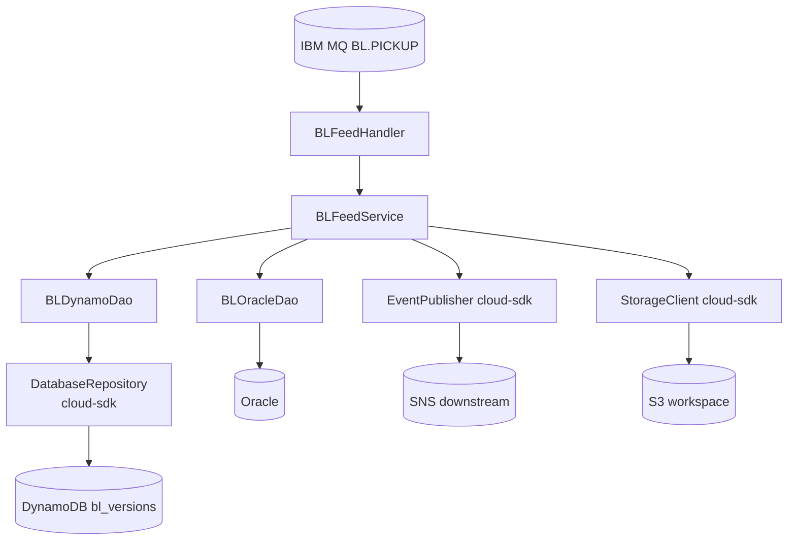
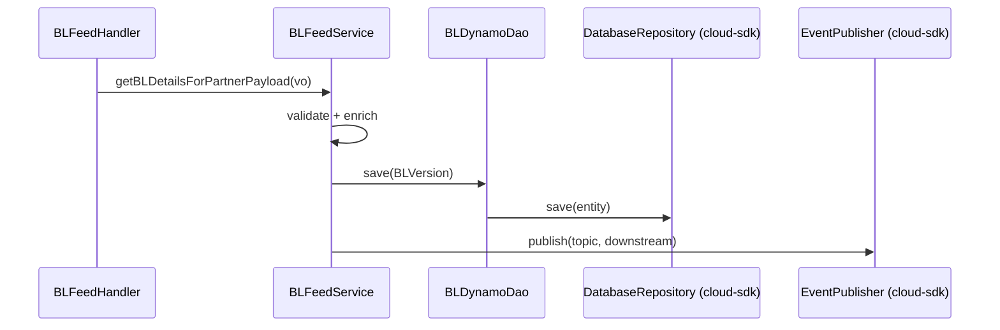

# Partner Integrator — pi-bl-in-processor — AWS SDK 2.x (cloud-sdk) Upgrade Design

**Module:** `partner-integrator / pi-bl-in-processor`
**Date:** 2026-06-30
**Status:** Target design — NOT STARTED (depends on `pi-commons` upgrade)
**Companion:** `2026-06-30-partner-integrator-pi-bl-in-processor-current-state-DESIGN-copilot.md`
**Playbook:** `partner-integrator/docs/2026-06-30-partner-integrator-aws2x-DESIGN-copilot.md`

---

## 1. Change Overview

BL inbound processor. AWS services in scope (all via `pi-commons`): **DynamoDB** (`bl_versions`), **S3** (workspace),
**SNS** (downstream publish). IBM MQ, Oracle, ES8 are out of scope.

| AWS service | Current (v1) | Target (cloud-sdk / v2) |
|-------------|--------------|--------------------------|
| **DynamoDB** | `DynamoDBMapper` + v1 ORM (`BLDynamoDao`/`BLVersion`) | `DatabaseRepository<BLVersion, DefaultCompositeKey<String,String>>` |
| **S3** | `AmazonS3` (`S3WorkspaceService`) | `StorageClient` |
| **SNS** | `AmazonSNS` | `EventPublisher` |

---

## 2. Maven Dependency Changes

Inherits `pi-commons` cloud-sdk; align property + add test deps (see playbook §2):
```diff
  <dependency><groupId>com.inttra.mercury</groupId><artifactId>pi-commons</artifactId><version>1.0</version></dependency>
+ <dependency><groupId>com.inttra.mercury</groupId><artifactId>dynamo-integration-test</artifactId><version>${mercury.commons.version}</version><scope>test</scope></dependency>
+ <dependency><groupId>com.amazonaws</groupId><artifactId>aws-java-sdk-dynamodb</artifactId><scope>test</scope></dependency>
  <dependency><groupId>io.dropwizard</groupId><artifactId>dropwizard-jdbi3</artifactId><version>5.0.1</version></dependency>  <!-- Oracle, unchanged -->
```

## 3. Configuration Changes (`conf/<env>/config.yaml`)

```diff
  dynamoDbConfig:
    tableName: bl_versions
    region: us-east-1
+   sseEnabled: false
  # mqPickupConfig / database(Oracle) / blElasticSearch — unchanged
```
`BLApplicationConfig.dynamoDbConfig` → cloud-sdk `BaseDynamoDbConfig`.

## 4. Per-Service Spec

- **DynamoDB:** `BLVersion` → `@DynamoDbBean`/`@Table("bl_versions")`/`@DynamoDbPartitionKey id`/`@DynamoDbSortKey sequenceNumber`;
  `BLDynamoDao` uses `DatabaseRepository.save/findById(DefaultCompositeKey)` and `DefaultQuerySpec` for date-range queries.
- **S3:** `S3WorkspaceService.getObject/putObject(byte[])` via `StorageClient`.
- **SNS:** downstream publish via `EventPublisher.publish(topicArn, msg)`.

## 5. Guice Wiring Changes

```diff
- BLApplicationInjector: bind AmazonDynamoDB / DynamoDBMapper / AmazonS3 / AmazonSNS
+ BLApplicationInjector: provide DatabaseRepository<BLVersion,..> (DynamoRepositoryFactory),
+   inject StorageClient + EventPublisher from pi-commons
```

## 6. Target Component Diagram



## 7. Target Sequence — BL inbound (after)



## 8. Key Classes Changed

| Class | Change |
|-------|--------|
| `pom.xml` | add test deps; inherit cloud-sdk via pi-commons. |
| `BLApplicationConfig` | `dynamoDbConfig` → `BaseDynamoDbConfig`. |
| `BLApplicationInjector` | v1 bindings → cloud-sdk repo/storage/notification. |
| `BLVersion` | v1 ORM → enhanced annotations. |
| `BLDynamoDao` | `DynamoRepositoryBase`/mapper → `DatabaseRepository` + `DefaultQuerySpec`. |
| `BLFeedService` | S3/SNS calls via `StorageClient`/`EventPublisher`. |

## 9. Testing Strategy

- **DynamoDB-Local IT** for `BLDynamoDao` (composite key save/get, date-range query).
- **SNS** unit tests mocking `EventPublisher`; **S3** round-trip.
- Keep MQ/Oracle behavior unchanged. Full local **JaCoCo** coverage on changed code.

## 10. Risks & Call-outs

- `bl_versions` feeds `pi-bl-es-lambda` + stream-to-SNS — keep item shape unchanged.
- IBM MQ, Oracle, ES8 are out of AWS-SDK scope.
