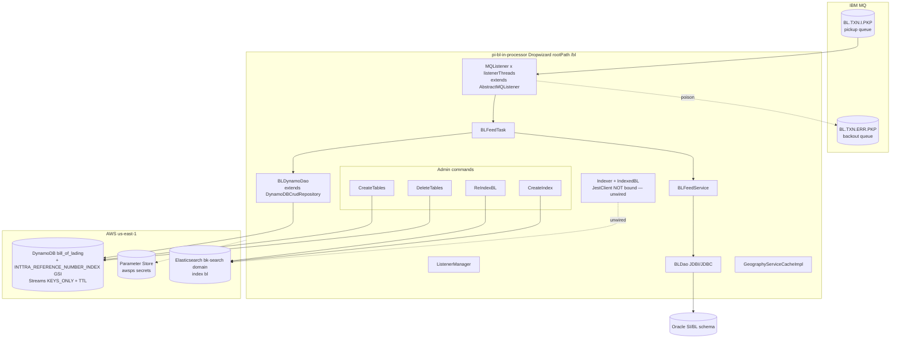
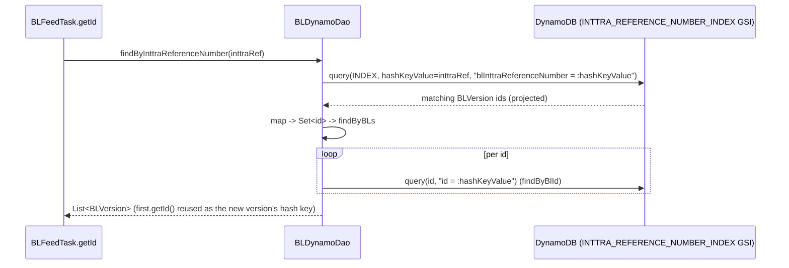
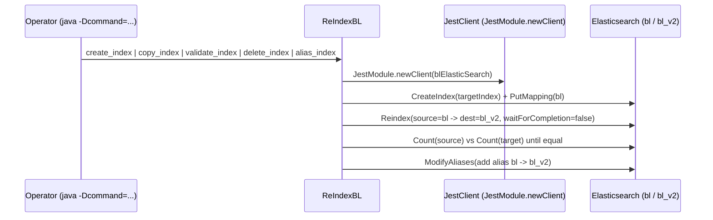

# Partner Integrator — pi-bl-in-processor — Current-State Design

**Module:** `partner-integrator / pi-bl-in-processor`
**Date:** 2026-06-30
**Status:** Current state — AWS SDK **1.x** (`com.amazonaws`) in production; cloud-sdk migration **NOT STARTED**
**Artifact:** `com.inttra.mercury:pi-bl-in-processor:1.0` (Dropwizard 4 / Jetty 12, single shaded JAR `pi-bl-in-processor-1.0.jar`)
**Main class:** `com.inttra.mercury.blfeed.BLPIApplication`

---

## 1. Business Purpose & Rules

`pi-bl-in-processor` is an **inbound Bill-of-Lading (BL) feed processor**. It is a headless Dropwizard
application (`InttraServer`) whose only runtime job is to run **IBM MQ listener threads** that drain a BL pickup
queue, build a normalized **`BLContract`** document by reading the legacy **Oracle** BL/Shipping-Instruction schema,
and persist a versioned snapshot (**`BLVersion`**) to **DynamoDB**.

There are **no JAX-RS resources** — `server.rootPath: /bl` exists only so the Dropwizard admin/health endpoints
bind. All work is driven by the MQ post-setup hook.

Core responsibilities:

- **Message intake** — `MQListener` (one per `listenerThreads`) loops on `MQService.getMessage`, reading each MQ
  message body as a `String`. The body is a BL/SI identifier, **not** an EDI/XML cargo payload — there is no XSD or
  JAXB unmarshalling in this module.
- **Assembly from Oracle** — `BLFeedService.getBLDetails(blId)` delegates to `BLDao.loadBL(blId)`, which issues
  ~25 JDBI/JDBC `PreparedStatement` queries against the Oracle SI/BL tables (header, dates, summary, references,
  parties, contacts, communications, charges, transports, locations, line-items, containers, seals, hazmat) and
  assembles a deep `BLContract` object graph.
- **Version key derivation** — `BLFeedTask.getId` decides the DynamoDB hash key `id`: for
  `State.AdvanceNotificationDraft` a fresh `UUID` is minted; otherwise the prior version's `id` is reused by
  looking up `findByInttraReferenceNumber` (so successive versions of one BL share one `id`, distinguished by the
  range key).
- **Persistence** — `BLFeedTask` maps `BLContract` → `BLVersion`, serializes the full `BLContract` to a JSON string
  in `BLVersion.message` (`Json.toJsonString`), and writes it via `BLDynamoDao.save` to the DynamoDB table
  `bill_of_lading`. The table has **DynamoDB Streams (`KEYS_ONLY`) enabled** and a **TTL** attribute.
- **Transactional MQ semantics** — processing runs under MQ syncpoint (`MQGMO_SYNCPOINT`). On success the listener
  `commit()`s; on failure `BLFeedTask` rethrows `EException`, and `AbstractMQListener` either `rollback()`s (while
  `backoutCount <= backoutThreshold`) or moves the poison message to the **backout queue** and commits.
- **Elasticsearch (out-of-band, admin-only)** — `CreateIndex` / `ReIndexBL` are standalone Dropwizard *commands*
  for index lifecycle (create / copy / validate / delete / alias). The `Indexer`/`IndexedBL` classes can index a
  `BLContract` into the `bl` index, but **`JestClient` is not bound in the Guice injector**, so live per-message ES
  indexing is **not wired into the MQ flow** today. ES indexing of `bill_of_lading` is performed downstream by
  `pi-bl-es-lambda` off the DynamoDB stream.

### Key business rules

| Rule | Detail (source) |
|------|------|
| Hash-key reuse vs. new | `BLFeedTask.getId`: `State.AdvanceNotificationDraft` ⇒ new `UUID`; else reuse the existing version's `id` from `findByInttraReferenceNumber(blIntraRef)` (first match), falling back to a new `UUID` when none found. |
| Range-key (version) format | `BLVersion` constructor: `sequenceNumber = String.format("m_%d_%s_%s", System.currentTimeMillis(), state, inttraReferenceNumber)` — every message yields a distinct version row. |
| TTL window | `BLFeedTask.calcExpiresOn()` = `OffsetDateTime.now().plusDays(400)`; stored as epoch **seconds** via `DateToEpochSecond`, surfaced to DynamoDB TTL as `expiresOn`. |
| Party mapping | `setParties`: `Carrier → carrierId`, `Requestor → requestorId`, `Shipper → shipperId` (each = `partyINTTRACompanyId`). |
| Reference mapping | `setReferences`: `BillOfLadingNumber → blNumber`, `BookingNumber → bookingNumber`. |
| INTTRA reference index | `blInttraReferenceNumber` is set from `blContract.getInttraReference()` and is the GSI hash key for version lookup. |
| Reference-type override | `BLDao.setReferences`: `reference_type_id == 28 ⇒ ReferenceType.INTTRASINumber`; party `company_type_id == 28 ⇒ CompanyPartyType.BillOfLadingRecipient`. |
| Listener fan-out | `BLApplicationInjector.bridgeListener` builds `listenerThreads` independent `MQListener`s, each with its own `MQService` connection. |
| Error routing | `AbstractMQListener.handleException`: `backoutCount <= backoutThreshold (=3)` ⇒ `rollback()`; otherwise send to `backoutQueue` (`BL.TXN.ERR.PKP`) + `commit()`. |
| Capacity | `dynamoDbConfig.readCapacityUnits = writeCapacityUnits = 25` in **all** envs; applied to base table and GSI. |

---

## 2. Design & Component Diagram

Headless Dropwizard service started via `InttraServer.<BLApplicationConfig>builder()`. Module generators:
`LocalCacheModule` and `BLApplicationInjector` (Guice). Four admin commands are registered: `create-tables`,
`delete-tables`, `re-index`, `create-index`. The `postSetupHook` resolves `List<Listener>`, wraps them in a
`ListenerManager`, registers it with the Dropwizard lifecycle, and starts the MQ poll loops.



### Key classes & interactions

| Layer | Class | Responsibility |
|-------|-------|----------------|
| Bootstrap | `BLPIApplication` | Builds `InttraServer`, registers the 4 commands + 2 module generators, and the `startListener` post-setup hook. |
| Wiring | `BLApplicationInjector` (Guice `AbstractModule`) | `@Provides List<Listener>` (`listenerThreads` `MQListener`s); binds `MQConfig`, `Jdbi` (Oracle, via `JdbiFactory`), **`AmazonDynamoDB`**, **`DynamoDBMapperConfig`**, **`DynamoDBMapper`** (all from commons `DynamoSupport`), every `ServiceDefinition`, and `GeographyService → GeographyServiceCacheImpl`. **No `AmazonS3` / `AmazonSNS` / `AmazonSQS` binding exists.** |
| Config | `BLApplicationConfig extends ApplicationConfiguration` | `mqPickupConfig`, `blElasticSearch`, `reindexESConfiguration`, `database` (`DataSourceFactory`), `dynamoDbConfig` (`DynamoDbConfig` from `dynamo-client`), `usePassThrough`, `listenerThreads`. |
| Listener | `MQListener extends AbstractMQListener` (commons) | `process(String)` → `task.processMessage(content, null)`. The poll/commit/rollback/backout loop lives in commons `AbstractMQListener`. |
| Task | `BLFeedTask` | Orchestrates one message: `getBLDetails` → `getId` → build `BLVersion` → set parties/refs → `message=JSON(BLContract)` → `blDynamoDao.save`. Wraps any failure as `EException`. |
| Service | `BLFeedService` | Thin facade: `getBLDetails(blId)` → `BLDao.loadBL`; `findByInttraReferenceNumber` → `BLDynamoDao`. |
| Persistence (Oracle) | `BLDao` | JDBI-backed; `loadBL` runs the SQL constants in `SQL` against Oracle, assembling the full `BLContract` graph (header, parties, contacts, charges, transports, locations, line items, containers, seals, hazmat). |
| Persistence (Dynamo) | `BLDynamoDao extends DynamoDBCrudRepository<BLVersion, DynamoHashAndSortKey<String,String>>` | `save`, `load(id, range)`, `findByInttraReferenceNumber` (GSI query → fan-out `findByBlId`), `findByBlId`, `findByBLs`. |
| Model | `BLVersion` (`@DynamoDBTable("bill_of_lading")`, `@DynamoDBStream(KEYS_ONLY)`) | Hash `id`, range `sequenceNumber`, GSI `INTTRA_REFERENCE_NUMBER_INDEX` on `blInttraReferenceNumber`; `message` (JSON), `expiresOn` (TTL), `carrierId/requestorId/shipperId/blNumber/bookingNumber`. Implements `Expires`. |
| Model | `BLContract` (+ ~40 `@DynamoDBDocument` nested types: `TransactionParty`, `Equipment`, `PackageDetails`, `DangerousGoods`, `Location`, `Charge`, …) | The normalized BL domain graph. Serialized to a JSON string into `BLVersion.message`; the `@DynamoDBDocument` annotations are vestigial on this path. |
| Converter | `DateToEpochSecond` (`DynamoDBTypeConverter<Long,Date>`) | `Date` ↔ epoch **seconds** for the TTL attribute. |
| Dynamo util | `com.inttra.mercury.blfeed.dao.DynamoSupport` | v1 client/mapper factory: `AmazonDynamoDBClientBuilder`, `DynamoDBMapper`, `DynamoDBMapperConfig` with a `{environment}_{table}` table-name prefix resolver. |
| Commands | `CreateTables`, `DeleteTables` | v1 table admin: `mapper.generateCreateTableRequest`, `TableUtils.createTableIfNotExists`, GSI create via `UpdateTableRequest`, stream spec from `@DynamoDBStream`, TTL via `UpdateTimeToLiveRequest` on `Expires` tables. |
| Commands | `ReIndexBL`, `CreateIndex` | Jest ES index lifecycle (create/copy/validate/delete/alias), driven by `-Dcommand=…`. |
| ES (unwired) | `Indexer`, `IndexedBL`, `ElasticsearchSupport` | `Indexer.index/delete/findInttraRefBySiId` against the `bl` index; depends on an injected `JestClient` that is **not** bound in `BLApplicationInjector`. |
| Network | `GeographyServiceCacheImpl` | Bound to `GeographyService`; participant/geography look-ups cached via `LocalCacheModule`. Not exercised on the persist path read here. |

---

## 3. Data Flow

### 3.1 Inbound BL message (write path)

```mermaid
sequenceDiagram
  participant MQ as IBM MQ (BL.TXN.I.PKP)
  participant L as MQListener / AbstractMQListener
  participant T as BLFeedTask
  participant FS as BLFeedService
  participant ORA as BLDao (Oracle / JDBI)
  participant DAO as BLDynamoDao
  participant DDB as DynamoDB bill_of_lading

  L->>MQ: getMessage (MQGMO_SYNCPOINT)
  MQ-->>L: message body = blId (String)
  L->>T: processMessage(blId, null)
  T->>FS: getBLDetails(blId)
  FS->>ORA: loadBL(blId)
  ORA->>ORA: ~25 PreparedStatements -> assemble BLContract
  ORA-->>T: BLContract
  T->>T: getId(state, inttraRef)  (UUID for Draft, else reuse prior id)
  alt state != AdvanceNotificationDraft
    T->>FS: findByInttraReferenceNumber(inttraRef)
    FS->>DAO: query INTTRA_REFERENCE_NUMBER_INDEX + fan-out findByBlId
    DAO->>DDB: GSI query + per-id hashKey query
  end
  T->>T: new BLVersion(id, state, expiresOn(+400d), inttraRef)
  T->>T: setParties / setReferences / message = Json.toJsonString(BLContract)
  T->>DAO: save(blVersion)
  DAO->>DDB: DynamoDBMapper.save  (PutItem; emits KEYS_ONLY stream record)
  alt success
    L->>MQ: commit()
  else exception (EException)
    L->>L: backoutCount <= 3 ? rollback() : sendToQueue(BL.TXN.ERR.PKP) + commit()
  end
```

> The DynamoDB `PutItem` produces a `KEYS_ONLY` stream record consumed downstream by `pi-bl-es-lambda`
> (Elasticsearch indexing) and the stream-to-SNS lambda. This module performs **no** SNS/SQS/S3 calls itself.

### 3.2 Version lookup by INTTRA reference (read path)



### 3.3 Elasticsearch re-index (admin command, out of band)



---

## 4. Data Stores & Integrations

### IBM MQ (inbound, primary trigger)

`mqPickupConfig` (`MQConfig`): `hostName`, `channel: JBOSS.CHL1`, `port: 1424`, `queueMgrName: QMGR1`,
`queueName: BL.TXN.I.PKP`, `backoutQueue: BL.TXN.ERR.PKP`, `backoutThreshold: 3`. Connection via the IBM `com.ibm.mq`
base client (`MQEnvironment` + `MQQueueManager`). Reads under `MQGMO_SYNCPOINT`; `commit`/`backout` on the queue
manager. `listenerThreads: 3` in every env.

### DynamoDB — table `bill_of_lading`

- **Hash key:** `id` (`@DynamoDBHashKey @DynamoDBAttribute("id")`; Java field `id`, exposed via `getHashKey()`).
- **Range key:** `sequenceNumber` (`@DynamoDBRangeKey @DynamoDBAutoGeneratedKey @DynamoDBAttribute("sequenceNumber")`;
  exposed via `getSortKey()`). Composite key type `DynamoHashAndSortKey<String,String>`.
- **GSI — `INTTRA_REFERENCE_NUMBER_INDEX`:** hash `blInttraReferenceNumber` (S); used to find all versions of one BL.
- **Streams:** `@DynamoDBStream(StreamViewType.KEYS_ONLY)` ⇒ `CreateTables` sets `StreamSpecification(enabled, KEYS_ONLY)`.
- **TTL:** `expiresOn` (epoch seconds, `DateToEpochSecond`); `CreateTables` enables TTL via `UpdateTimeToLiveRequest`
  on `Expires.EXPIRES_ON_ATTRIBUTE_NAME` because `BLVersion implements Expires`.
- **Throughput:** 25 RCU / 25 WCU (base table + GSI), `sseEnabled: false`, every env.
- **Attribute encodings:** `message` is a JSON `String` (S) holding the full serialized `BLContract`;
  `carrierId/requestorId/shipperId/blNumber/bookingNumber/blInttraReferenceNumber` are strings (S);
  `expiresOn` is a number (N, epoch seconds).
- **Effective table names** (`{environment}_bill_of_lading`, prefix from `DynamoSupport.newDynamoDBMapperConfig`):

  | Env | `dynamoDbConfig.environment` | Effective table |
  |-----|------------------------------|-----------------|
  | INT | `inttra_int` | `inttra_int_bill_of_lading` |
  | QA | `inttra2_qa` | `inttra2_qa_bill_of_lading` |
  | **CVT** | **`inttra2_test`** | `inttra2_test_bill_of_lading` |
  | PROD | `inttra2_prod` | `inttra2_prod_bill_of_lading` |

  > Note the prefix is the bare environment string (`inttra2_test`, not `inttra2_test_bl`); the entity table name
  > `bill_of_lading` carries the `bl` semantics, so there is no extra `_bl` segment.

### Oracle (source of BL/SI data)

`database` (`io.dropwizard.db.DataSourceFactory`): `oracle.jdbc.driver.OracleDriver`, per-env JDBC URL
(`jdbc:oracle:thin:@…/{int,qa,cvt,prod}.nj.inttra.com`), pool `initialSize:5 / minSize:5 / maxSize:35`,
`validationQuery: select 1 from dual`. User/password resolved from Parameter Store
(`${awsps:/inttra{2}/<env>/mercuryservices/partner-integration/pibl/oracleDB/{user,password}}`). All BL assembly
SQL lives in the `SQL` constants class; `BLDao` opens a fresh JDBI `Handle`/`Connection` per sub-query.

### Elasticsearch (admin re-index only; live indexing downstream)

`blElasticSearch` (`ESConfiguration`): the shared per-env `bk-search` domain endpoint, `numberOfShards: 3`,
`numberOfReplicas: 1`, `region: us-east-1`, `service: es`. `reindexESConfiguration`: `sourceIndex: bl`,
`targetIndex: bl_v2`, `alias: bl`. Used only by the `create-index`/`re-index` commands (via `JestModule.newClient`).
`Indexer` is not invoked at runtime (no bound `JestClient`).

### Network services (REST, via `ServiceDefinition` + `LocalCacheModule`)

`serviceDefinitions`: `auth` (OAuth, `clientId` + `${awsps:…/authclientsecret}`), `geography`, `geography-alias`,
`alias`, `country`, `reference-data-packagetype`, `reference-data-containertype`, `participants-alias`,
`network-participant`, `network-participants` — per-env `api(-alpha|-beta|-test).inttra.com`. Consumed via
`GeographyServiceCacheImpl` (bound to `GeographyService`).

### Not present in this module

**No S3, no SNS, no SQS, no Kinesis client is instantiated anywhere in `pi-bl-in-processor`.** The only AWS service
called directly is **DynamoDB**; Parameter Store is resolved transparently by commons.

---

## 5. Maven Dependencies

| Artifact | Version | Notes |
|----------|---------|-------|
| `com.inttra.mercury:pi-commons` | `1.0` | `InttraServer`, `AbstractMQListener`/`MQService`/`MQConfig`, commons `DynamoSupport`, `LocalCacheModule`, `JestModule`, `GeographyService(CacheImpl)`, `Expires`, `${awsps:}` resolution, `ApplicationConfiguration`. **Pulls AWS SDK v1 DynamoDB + `dynamo-client` (v1 ORM) transitively.** |
| `com.amazonaws:aws-lambda-java-events` | `2.2.2` | Lambda event POJOs (present on the classpath; not exercised by the MQ flow — this is a Dropwizard app, not a Lambda). |
| `io.dropwizard:dropwizard-jdbi3` | `5.0.1` | Oracle JDBC access (`Jdbi`, `JdbiFactory`). |
| `org.elasticsearch:elasticsearch` | `8.17.0` (`${elasticsearch.version}`) | ES query builders used by the re-index commands (Jest transport from commons `JestModule`). |
| `org.junit.jupiter:*` | `5.11.3` (`test`) | JUnit 5. |
| `org.mockito:mockito-core` / `mockito-junit-jupiter` | `5.12.0` / `5.11.0` (`test`) | Mocking. |
| `org.assertj:assertj-core` | `3.25.3` (`test`) | Fluent assertions. |
| Build | `maven-shade-plugin:3.5.1`, `maven-compiler-plugin:3.13.0` (release **17**), `aws-maven:6.0.0` extension | Fat JAR `pi-bl-in-processor-1.0`, `ManifestResourceTransformer` main class `…blfeed.BLPIApplication`, `ServicesResourceTransformer`; S3 wagon for the `si-model-s3-repo-url` repo. |

> **AWS SDK is never declared directly for DynamoDB.** `aws-java-sdk-dynamodb` (v1) and `dynamo-client` (the v1 ORM
> `DynamoDBCrudRepository`/`DynamoDbConfig`) arrive transitively through `pi-commons`. `sonar.coverage.exclusions =
> **/config/**,**/model/**`.

---

## 6. Configuration & Deployment

### `conf/{int,qa,cvt,prod}/config.yaml`

- `server.rootPath: /bl`, `applicationConnectors` **8090**, `adminConnectors` **8091** (note: not 8080/8081).
- `mqPickupConfig` — host/channel/port/qmgr/queue/backout (see §4); `BL.TXN.I.PKP` + `BL.TXN.ERR.PKP` in all envs.
- `listenerThreads: 3`.
- `database` — Oracle thin URL + pool sizing; `user`/`password` from `${awsps:…/pibl/oracleDB/*}`.
- `blElasticSearch` — per-env `bk-search` ES endpoint, 3 shards / 1 replica, `us-east-1`.
- `reindexESConfiguration` — `sourceIndex: bl`, `targetIndex: bl_v2`, `alias: bl`.
- `dynamoDbConfig` — `readCapacityUnits: 25`, `writeCapacityUnits: 25`, `environment` (prefix, see §4),
  `sseEnabled: false`. **No `region`/`regionEndpoint` set** ⇒ `DynamoSupport.newClient` uses
  `AmazonDynamoDBClientBuilder.standard().build()` (default region/credential chain).
- `securityResources` — `oauthTokenValidationUri`, `userInfoUri`, `userPrincipalUri` (per-env
  `api(-alpha|-beta|-test).inttra.com`).
- `jerseyClient` — 32/128 threads, `timeout: 2s`, `retries: 2`, gzip on.
- **Secrets** resolved by commons via AWS Parameter Store: `${awsps:/inttra{2}/<env>/mercuryservices/partner-integration/...}`.

### Deployment

- Build: `mvn -pl partner-integrator/pi-bl-in-processor -am clean package` → shaded `pi-bl-in-processor-1.0.jar`.
- Run (server): `java -jar pi-bl-in-processor-1.0.jar server conf/<env>/config.yaml`. Runs as an ECS/Fargate task
  with VPC reachability to IBM MQ and Oracle.
- **Table bootstrap:** `java -jar pi-bl-in-processor-1.0.jar create-tables conf/<env>/config.yaml` — creates
  `bill_of_lading` (25/25, SSE per config), enables the `KEYS_ONLY` stream, creates `INTTRA_REFERENCE_NUMBER_INDEX`,
  and sets TTL on `expiresOn`. `delete-tables` removes it.
- **ES bootstrap / re-index:** `java -Dcommand=create_index -jar … re-index conf/<env>/config.yaml`
  (then `copy_index`, `validate_index`/`delete_index`, `alias_index`) — see the header comment in `ReIndexBL`.
- **Credentials:** default AWS credential chain / ECS task IAM role (no explicit region/endpoint in config).

---

## 7. AWS Services & SDK 1.x Usage (CALL-OUT)

> **This module actively uses AWS SDK v1 (`com.amazonaws`) only, and only for DynamoDB.** A grep across
> `pi-bl-in-processor/src/main` finds **zero** `software.amazon.awssdk`, **zero** `cloudsdk`/`cloud-sdk`, and
> **zero** `AmazonS3`/`AmazonSNS`/`AmazonSQS` references. (`aws-lambda-java-events` is on the classpath but unused.)

| AWS service | SDK | Where (class) | Concrete v1 classes |
|-------------|-----|---------------|---------------------|
| **DynamoDB (runtime)** | v1 ORM (via `pi-commons` → `dynamo-client`) | `BLApplicationInjector`, `BLDynamoDao`, `BLVersion`, `BLContract` + nested model, `DateToEpochSecond`, `DynamoSupport` | `AmazonDynamoDB`, `AmazonDynamoDBClientBuilder`, `DynamoDBMapper`, `DynamoDBMapperConfig`, `AwsClientBuilder.EndpointConfiguration`, `@DynamoDBTable`, `@DynamoDBHashKey`, `@DynamoDBRangeKey`, `@DynamoDBAutoGeneratedKey`, `@DynamoDBAttribute`, `@DynamoDBIndexHashKey`, `@DynamoDBIgnore`, `@DynamoDBTypeConverted`, `@DynamoDBTypeConvertedEnum`, `@DynamoDBDocument`, `DynamoDBTypeConverter`, `StreamViewType`. |
| **DynamoDB (admin commands)** | v1 control plane | `CreateTables`, `DeleteTables` | `DynamoDBTableMapper`, `TableUtils`, `CreateTableRequest`, `CreateGlobalSecondaryIndexAction`, `GlobalSecondaryIndex(Update)`, `UpdateTableRequest`, `ProvisionedThroughput`, `SSESpecification`, `StreamSpecification`, `TimeToLiveSpecification`, `UpdateTimeToLiveRequest`, `DescribeTableResult`, `ResourceNotFoundException`. |
| **Parameter Store** | resolved by commons (`${awsps:…}`) | config only | — (no direct SSM client). |
| **S3 / SNS / SQS / Kinesis** | **none in-module** | — | — (downstream ES indexing + stream-to-SNS handled by `pi-bl-es-lambda` off the DynamoDB stream). |

**DynamoDB client build** (`DynamoSupport.newClient`): if `regionEndpoint` is set →
`AmazonDynamoDBClientBuilder.standard().withEndpointConfiguration(new EndpointConfiguration(regionEndpoint,
signingRegion))`; otherwise `AmazonDynamoDBClientBuilder.standard().build()` (the production path — neither key is set
in any `config.yaml`). The `DynamoDBMapperConfig` applies a `{environment}_{table}` table-name prefix/override.

**Custom converter:** `DateToEpochSecond` (`Date` ↔ `Long` epoch seconds) for the TTL attribute `expiresOn`.

---

## 8. AWS 2.x / cloud-sdk Upgrade Plan (High Level)

Goal: replace AWS SDK v1 (`com.amazonaws`) DynamoDB usage with the in-house **cloud-sdk** (`cloud-sdk-api` +
`cloud-sdk-aws`, AWS SDK 2.x Enhanced Client + Apache HTTP), mirroring the completed **booking** and **visibility**
migrations. DynamoDB is the **only** AWS service in scope; the bulk of the work is gated on `pi-commons` shipping
its cloud-sdk line (booking already consumes `commons`/`cloud-sdk-api`/`cloud-sdk-aws` at `1.0.26-SNAPSHOT`).

| Step | Action | Reference |
|------|--------|-----------|
| 1 | Have `pi-commons` consume the cloud-sdk line (drop transitive `dynamo-client`/`aws-java-sdk-dynamodb` from prod). In `pi-bl-in-processor/pom.xml`, add `dynamo-integration-test` (test) and keep `aws-java-sdk-dynamodb` test-scoped for DynamoDB Local. | `booking/pom.xml` |
| 2 | **DynamoDB ORM** — migrate `BLVersion` to `@DynamoDbBean`/`@Table("bill_of_lading")`/`@DynamoDbPartitionKey id`/`@DynamoDbSortKey sequenceNumber` + `@DynamoDbSecondaryPartitionKey(INTTRA_REFERENCE_NUMBER_INDEX)`; re-implement `DateToEpochSecond` as a v2 `AttributeConverter` (epoch-seconds `N`, wire-identical). | `network`, `registration`, `booking` |
| 3 | Rewrite `BLDynamoDao` on `DatabaseRepository<BLVersion, DefaultCompositeKey<String,String>>` + `DefaultQuerySpec` (GSI query + `findByBlId` fan-out preserved). | `booking` `TemplateSummaryDao` |
| 4 | Swap `BLApplicationInjector` v1 bindings (`AmazonDynamoDB`/`DynamoDBMapper(Config)`) for cloud-sdk factory providers; migrate `BLApplicationConfig.dynamoDbConfig` to `BaseDynamoDbConfig` (add `region`). | `booking` `BookingDynamoModule` |
| 5 | Migrate `CreateTables`/`DeleteTables` to the cloud-sdk admin path; **preserve** table name, key schema, GSI, `KEYS_ONLY` stream, TTL on `expiresOn`, 25/25 capacity. | `booking`/`network` bootstrap |
| 6 | **Tests** — DynamoDB-Local IT for `BLDynamoDao` (composite-key save/load, GSI lookup, TTL epoch fidelity, version-id reuse); full local JaCoCo on changed code. Leave MQ/Oracle/ES untouched. | `network`/`auth` `*DaoIT` |

**Risks / call-outs:**
- **`bill_of_lading` feeds a `KEYS_ONLY` DynamoDB stream** consumed by `pi-bl-es-lambda` and the stream-to-SNS
  lambda; the item shape (attribute names, the JSON `message`, epoch-seconds `expiresOn`) and the stream spec must
  stay byte/shape-identical so those consumers keep working.
- **`@DynamoDBAutoGeneratedKey` on the range key has no v2 equivalent** — `sequenceNumber` is already explicitly set
  in the `BLVersion` constructor, so the annotation is effectively unused; drop it and rely on the constructor.
  Verify no write path expects auto-generation.
- **Table-prefix decoupling** — the prefix is the bare `environment` (`inttra2_test`, `inttra_int`, …) with the
  table name `bill_of_lading`; carry the exact strings through the `BaseDynamoDbConfig` migration (CVT = `inttra2_test`).
- **IBM MQ, Oracle (JDBI), and Elasticsearch are out of AWS-SDK scope** and unchanged by this migration.
- **`Indexer` (unwired `JestClient`) and `aws-lambda-java-events` (unused)** are pre-existing dead/latent code; the
  migration should not accidentally start wiring them.
