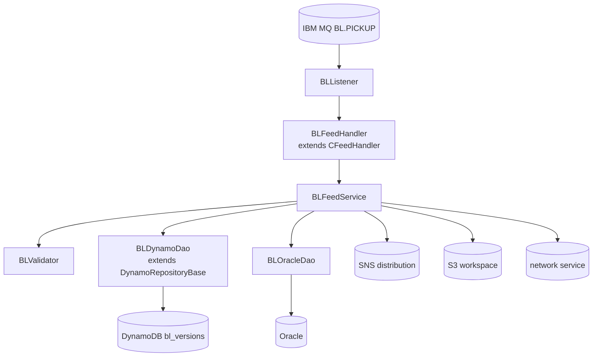
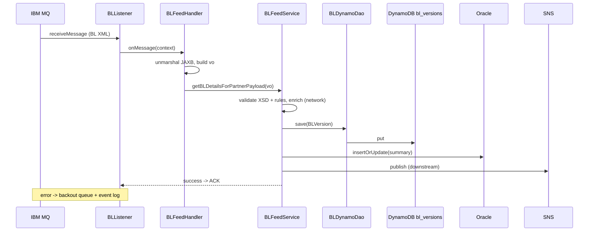

# Partner Integrator — pi-bl-in-processor — Current-State Design

**Module:** `partner-integrator / pi-bl-in-processor`
**Date:** 2026-06-30
**Status:** Current state (AWS SDK 1.x — upgrade NOT STARTED)
**Artifact:** `com.inttra.mercury:pi-bl-in-processor:1.0` (Dropwizard, shaded JAR)
**Main class:** `com.inttra.mercury.blfeed.BLPIApplication`

---

## 1. Business Purpose & Rules

Inbound processor for **Bill of Lading (BL)** EDI feeds. It picks up partner BL messages from IBM MQ, validates and
enriches them, persists versions to DynamoDB, mirrors a summary to Oracle, and publishes to downstream consumers
(ES indexer lambda + partner distribution).

### Flow / rules
1. IBM MQ listener polls the BL pickup queue.
2. Unmarshal JAXB harmonization payload; validate against XSD + business rules (bill number, shipper, consignee,
   dates, commodity codes, container number format, weights/dimensions).
3. Enrich with INTTRA metadata (reference, commodity, participants, geography).
4. Persist `BLVersion` to DynamoDB (`bl_versions`).
5. Publish to SNS/SQS for ES indexer and distribution processors.
6. Upsert BL header summary to Oracle.
7. On critical error → log to event bus, route to MQ backout queue.

---

## 2. Design & Component Diagram

### Key classes

| Class | Role |
|-------|------|
| `BLPIApplication` | Dropwizard `main`; boots `InttraServer` with `BLApplicationConfig` + `BLApplicationInjector`. |
| `BLApplicationInjector` | Guice: binds `AmazonDynamoDB`, `DynamoDBMapper`, `AmazonS3`, Oracle `DataSource`, DAOs, services. |
| `BLListener` | MQ poll loop; per-message dispatch. |
| `BLFeedHandler` | Unmarshal JAXB → `CProcessorVO` → `BLFeedService`. |
| `BLFeedService` | Validate, enrich, persist `BLVersion`, publish SNS, sync Oracle. |
| `BLDynamoDao` (extends `DynamoRepositoryBase<BLVersion>`) | `save`, `load(id, sequenceNumber)`, date-range query. |
| `BLOracleDao` | JDBC: insert/update BL header summary, historical search. |
| `BLVersion` (`@DynamoDBTable`) | `id` (hash), `sequenceNumber` (range), `message` (full XML), `createdDate`, `status`. |

---

## 3. Data Flow — BL inbound

---

## 4. Data Stores & Integrations

| Resource | Usage |
|----------|-------|
| IBM MQ (`mqPickupConfig`) | Inbound BL feed; backout queue for errors. |
| DynamoDB `bl_versions` | BL versions (id + sequenceNumber). |
| Oracle | BL header summary + status history. |
| SNS / SQS | Publish to ES indexer + distribution. |
| S3 (workspace) | Archive original EDI (via `S3WorkspaceService`). |
| Network service REST | Participant aliases, geography, integration profiles. |
| Elasticsearch (optional) | Indexed by `pi-bl-es-lambda`. |

---

## 5. Maven Dependencies

| Artifact | Version | Notes |
|----------|---------|-------|
| `com.inttra.mercury:pi-commons` | `1.0` | Brings AWS SDK v1 clients, MQ/SQS listeners, framework. |
| `io.dropwizard:dropwizard-jdbi3` | `5.0.1` | Oracle JDBC access. |
| `org.elasticsearch:elasticsearch` | `8.17.0` | ES client lib. |

AWS SDK v1 (`AmazonDynamoDB`, `DynamoDBMapper`, `AmazonS3`, `AmazonSNS`) comes transitively via `pi-commons`.

---

## 6. Configuration & Deployment

### Configuration (`conf/<env>/config.yaml`)
`mqPickupConfig{queueMgrName, queueName, backoutQueue}`, `dynamoDbConfig{tableName: bl_versions, region}`,
`database{driverClass: oracle..., url, user, password}`, `blElasticSearch{endpointUrl, indexName}`,
`usePassThrough`, `listenerThreads`. Config class `BLApplicationConfig`.

### Deployment
`mvn -pl pi-bl-in-processor -am clean package` → `pi-bl-in-processor-1.0.jar`;
run `java -jar pi-bl-in-processor-1.0.jar server conf/<env>/config.yaml`. Runs as a Fargate/ECS task with VPC MQ access.

---

## 7. AWS Services & SDK 1.x Usage (CALL-OUT)

> **AWS SDK v1 (via `pi-commons`).** DynamoDB + S3 + SNS.

| AWS service | v1 classes | Where |
|-------------|-----------|-------|
| DynamoDB | `AmazonDynamoDB`, `DynamoDBMapper`, ORM on `BLVersion` | `BLDynamoDao`, injector |
| S3 | `AmazonS3` | `S3WorkspaceService` (commons) |
| SNS | `AmazonSNS` | downstream publish |

---

## 8. AWS 2.x / cloud-sdk Upgrade Plan (High Level)

Driven by the `pi-commons` upgrade.

| Step | Action | Reference |
|------|--------|-----------|
| 1 | Consume upgraded `pi-commons` (cloud-sdk DynamoDB/S3/SNS). | pi-commons |
| 2 | Swap `BLApplicationInjector` v1 bindings for cloud-sdk factories. | booking |
| 3 | Migrate `BLDynamoDao`/`BLVersion` to cloud-sdk `DatabaseRepository`; preserve `bl_versions` schema + encodings. | network, registration |
| 4 | Migrate downstream **SNS** publish to `NotificationService`. | booking, network |
| 5 | **Tests** — DynamoDB-Local IT for `BLDynamoDao`; mocked SNS unit tests; full JaCoCo coverage. Keep MQ/Oracle behavior unchanged. | network/auth `*DaoIT` |

**Call-out:** `BLVersion` stream feeds `pi-bl-es-lambda` and stream-to-SNS — keep DynamoDB item shape unchanged. ES8
and IBM MQ/Oracle are out of AWS-SDK scope.
