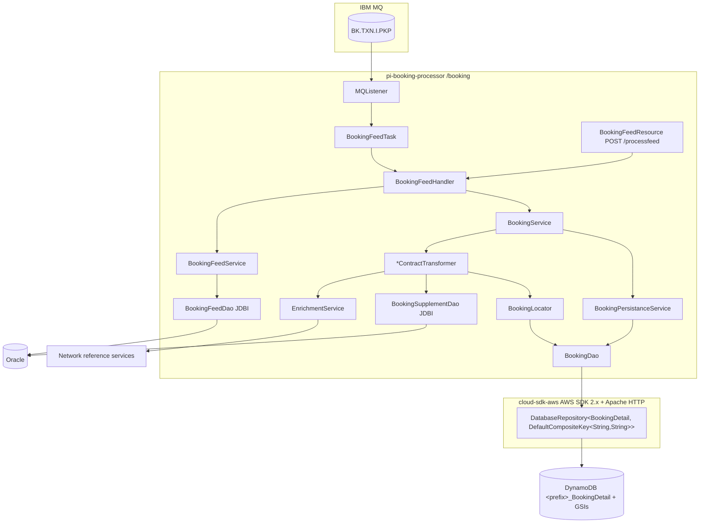
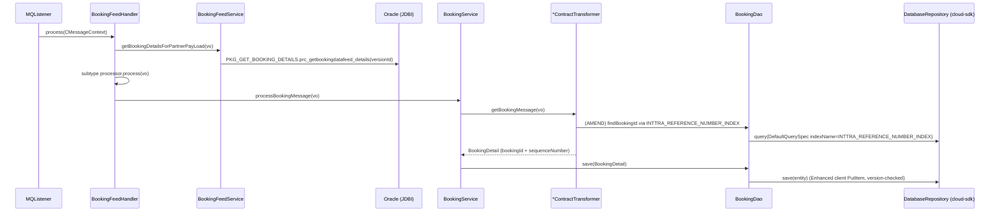

# Partner Integrator — pi-booking-processor — AWS SDK 2.x (cloud-sdk) Upgrade Design

**Module:** `partner-integrator/pi-booking-processor`
**Date:** 2026-06-30
**Status:** Target design (AWS 1.x → AWS 2.x via cloud-sdk) — **NOT STARTED** (gated on the `pi-commons` cloud-sdk upgrade)
**Companion:** `2026-06-30-partner-integrator-pi-booking-processor-current-state-DESIGN-claude.md`
**Reference upgrades:** `booking` (DynamoDB Enhanced Client + `cloud-sdk`, complete — its in-tree `BookingDetail` is already `@DynamoDbBean`/`@Table`), `visibility` (S3 + DynamoDB + SNS/SQS), `network`/`registration` (DynamoDB DAO patterns)

---

## 1. Change Overview

This module's **only** AWS surface is **DynamoDB v1** (`com.amazonaws.services.dynamodbv2.*`): the `AmazonDynamoDB` /
`DynamoDBMapper` / `DynamoDBMapperConfig` bindings built by `DynamoSupport` in `BookingApplicationInjector`, the
`BookingDao extends DynamoDBCrudRepository`, and the v1 ORM annotations on `BookingDetail` carried by the pinned
`booking:2.1.7.M` jar. There is **no S3, no SNS, no SQS, no Kinesis** in this module (contrary to the Copilot draft).

| AWS service | Current (v1) | Target (cloud-sdk / v2) |
|-------------|--------------|--------------------------|
| **DynamoDB** | `AmazonDynamoDB` + `DynamoDBMapper`/`DynamoDBMapperConfig` (via `DynamoSupport`), `DynamoDBCrudRepository`, v1-ORM `BookingDetail` | `DatabaseRepository<BookingDetail, DefaultCompositeKey<String,String>>` + `DynamoRepositoryFactory.createEnhancedRepository(...)` + `DefaultQuerySpec`; cloud-sdk `@DynamoDbBean`/`@Table` `BookingDetail` (from upgraded `booking`) |

**Out of scope:** IBM MQ (`com.ibm.mq`), Oracle/JDBI (`BookingFeedDao`, `BookingSupplementDao`), the network reference
services, the partner-feed builder/transform layers, Parameter Store (`${awsps:}` still resolved by commons), and the
`aws-maven` build extension's `s3://inttra-deployment/Booking/repo` (build-time only, not a runtime client).

**Two coupled dependency moves** make this upgrade unusual:
1. **`pi-commons`** must be upgraded first so it stops exporting `dynamo-client` (v1 DynamoDB) transitively.
2. **The `booking` pin** must move from `2.1.7.M` (a v1-ORM `BookingDetail` + v1 `DynamoSupport`) to the cloud-sdk
   booking artifact whose `BookingDetail` is already `@DynamoDbBean`/`@Table` (`software.amazon.awssdk.enhanced.dynamodb`,
   `com.inttra.mercury.cloudsdk.database`). Doing only one of the two leaves mixed v1/v2 annotations on `BookingDetail`.

**Backward-compatibility is mandatory.** `BookingDetail` is read/written by the main `booking` service too, so the
following must remain wire-identical:

- DynamoDB table `BookingDetail` (effective `<env-prefix>_BookingDetail`); composite key **`bookingId` (S) + `sequenceNumber` (S)**.
- GSI **`INTTRA_REFERENCE_NUMBER_INDEX`** (partition `inttraReferenceNumber`, KEYS_ONLY) and the sibling GSIs
  `carrierId_carrierReferenceNumber`, `bookerId_shipmentId`, `carrierScac_carrierReferenceNumber`.
- `sequenceNumber` string format `m_{System.currentTimeMillis()}_{bookingState}_{inttraReference}`.
- TTL attribute `expiresOn` (**epoch seconds**, millisec dropped) and optimistic-lock `version` (`@DynamoDbVersionAttribute`).
- Converter encodings for `payload` (`Contract`), `audit`, `enrichedAttributes`, `metaData` and all enum attributes.
- **Decoupling rule:** the DynamoDB on-wire attribute formats (the `AttributeConverter`s in the booking artifact) are
  independent of the partner/visibility JSON/XML the feed layer produces (`ExportBRPartInt`, `ValidateAdditionalSync`).
  The SDK swap must not leak the Dynamo converter into the JAXB/partner path or vice-versa.

---

## 2. Maven Dependency Changes

```diff
  <repositories>
    <!-- keep the lib/ file repo only if still hosting the upgraded booking artifact -->
    <repository><id>pi-bk-local-repo</id><url>file:${project.basedir}/lib</url> ... </repository>
  </repositories>

  <dependencies>
-   <dependency>
-     <groupId>com.inttra.mercury</groupId>
-     <artifactId>booking</artifactId>
-     <version>2.1.7.M</version>            <!-- v1 BookingDetail + v1 DynamoSupport -->
-   </dependency>
+   <dependency>
+     <groupId>com.inttra.mercury</groupId>
+     <artifactId>booking</artifactId>
+     <version>{cloud-sdk booking, e.g. 2.2.x.M}</version>  <!-- @DynamoDbBean BookingDetail, no v1 DynamoSupport -->
+   </dependency>

    <dependency>
      <groupId>com.inttra.mercury</groupId>
      <artifactId>pi-commons</artifactId>
      <version>1.0</version>                <!-- must already be on the cloud-sdk line (drops dynamo-client) -->
      <scope>compile</scope>
    </dependency>

+   <!-- cloud-sdk pulled directly here only if pi-commons does not re-export it -->
+   <dependency><groupId>com.inttra.mercury</groupId><artifactId>cloud-sdk-api</artifactId><version>${mercury.commons.version}</version></dependency>
+   <dependency><groupId>com.inttra.mercury</groupId><artifactId>cloud-sdk-aws</artifactId><version>${mercury.commons.version}</version></dependency>

+   <!-- DynamoDB Local integration-test framework -->
+   <dependency><groupId>com.inttra.mercury</groupId><artifactId>dynamo-integration-test</artifactId><version>${mercury.commons.version}</version><scope>test</scope></dependency>
+   <!-- AWS SDK v1 DynamoDB kept ONLY for DynamoDB-Local in tests (matches booking) -->
+   <dependency><groupId>com.amazonaws</groupId><artifactId>aws-java-sdk-dynamodb</artifactId><version>1.12.721</version><scope>test</scope></dependency>
  </dependencies>
```

- The `maven-dependency-plugin` `purge-local-repository` / `get` executions pinned to `com.inttra.mercury:booking:2.1.7.M`
  must be re-pointed to the new booking version (or removed if the artifact is resolved from a real repo rather than `lib/`).
- After the pi-commons bump there must be **no `com.amazonaws` on the prod classpath** (the only source today is
  `dynamo-client` via pi-commons plus the v1 `booking` jar). cloud-sdk uses **Apache HTTP** (no Netty).
- `BookingDaoTest`'s `com.amazonaws.services.dynamodbv2.datamodeling.DynamoDBMapper`/`DynamoDBMapperConfig` imports move
  to the test-scoped v1 jar (DynamoDB-Local) or are replaced by the cloud-sdk IT base class.

---

## 3. Configuration Changes (`conf/<env>/config.yaml`)

`dynamoDbConfig` keeps its existing keys and adds the cloud-sdk `BaseDynamoDbConfig` fields. The `environment` prefixes —
**including CVT's `inttra2_test_booking`** — and the 25/25 capacities stay unchanged.

```diff
  dynamoDbConfig:
    readCapacityUnits: 25
    writeCapacityUnits: 25
    environment: inttra2_qa_booking   # CVT stays inttra2_test_booking; INT inttra_int_booking; PROD inttra2_prod_booking
    sseEnabled: false
+   region: us-east-1
+   # local Dynamo emulator only:
+   #regionEndpoint: http://localhost:8000
+   #signingRegion: us-west-2
```

**Config class change** — `BookingApplicationConfig.dynamoDbConfig` field type moves from the v1
`com.inttra.mercury.dynamo.respository.module.DynamoDbConfig` to the cloud-sdk
`com.inttra.mercury.cloudsdk.database.config.BaseDynamoDbConfig`:

```diff
- import com.inttra.mercury.dynamo.respository.module.DynamoDbConfig;
+ import com.inttra.mercury.cloudsdk.database.config.BaseDynamoDbConfig;
  @Data
  @EqualsAndHashCode(callSuper = false)
  public class BookingApplicationConfig extends ApplicationConfiguration {
    @JsonProperty @NotNull private MQConfig mqPickupConfig;
    @JsonProperty @NotNull private MQConfig mqSOConfig;
    @Valid @NotNull @JsonProperty private DataSourceFactory database = new DataSourceFactory();
-   @Valid @NotNull private DynamoDbConfig dynamoDbConfig;
+   @Valid @NotNull private BaseDynamoDbConfig dynamoDbConfig;
    @JsonProperty @NotNull private boolean usePassThrough;
    @JsonProperty @NotNull private int listenerThreads;
  }
```

> The MQ blocks (`mqPickupConfig`, `mqSOConfig`), `database` (Oracle), `serviceDefinitions`, and `jerseyClient` are
> untouched.

---

## 4. Per-Service Spec

### 4.1 DynamoDB — `BookingDao` + `BookingDetail`

`BookingDetail` itself is **not edited in this module** — it comes from the `booking` artifact. The current-state v1 ORM
annotations live in the `2.1.7.M` jar; the upgraded booking artifact already ships the v2 entity (verified in the booking
source tree):

```java
// Upgraded booking artifact (already cloud-sdk) — for reference only, NOT edited here
@Table(name = "BookingDetail")              // com.inttra.mercury.cloudsdk.database.annotation.Table
@DynamoDbBean
@DynamoDBStream(StreamViewType.KEYS_ONLY)
public class BookingDetail implements Expires {
  @DynamoDbPartitionKey @DynamoDbAttribute("bookingId")     public String getBookingId() {...}
  @DynamoDbSortKey      @DynamoDbAttribute("sequenceNumber") public String getSequenceNumber() {...}
  @DynamoDbVersionAttribute public Integer getVersion() {...}
  @TTL @DynamoDbConvertedBy(DateEpochSecondAttributeConverter.class) public Date getExpiresOn() {...}
  @GsiConfig(indexName = INTTRA_REFERENCE_NUMBER_INDEX, projection = ProjectionType.KEYS_ONLY)
  @DynamoDbSecondaryPartitionKey(indexNames = {INTTRA_REFERENCE_NUMBER_INDEX})
  @DynamoDbConvertedBy(NullifyEmptyStringConverter.class)   public String getInttraReferenceNumber() {...}
  // payload/audit/enrichedAttributes/metaData via @DynamoDbConvertedBy converters
}
```

**`BookingDao` before (v1):**
```java
public class BookingDao extends DynamoDBCrudRepository<BookingDetail, DynamoHashAndSortKey<String,String>> {
  @Inject public BookingDao(DynamoDBMapper mapper, DynamoDBMapperConfig cfg) {
    super(mapper, cfg, DynamoRepositoryConfig.builder().domainType(BookingDetail.class).build());
  }
  public String findBookingId(String inttraReferenceNumber) {
    List<BookingDetail> d = query(BookingDetail.INTTRA_REFERENCE_NUMBER_INDEX, inttraReferenceNumber,
        null, "inttraReferenceNumber = :hashKeyValue");
    return (d != null && !d.isEmpty()) ? d.get(0).getBookingId() : null;
  }
  public BookingDetail findLatestVersion(String inttraReferenceNumber) { /* GSI query, take last */ }
  public BookingDetail findBookingDetail(String bookingId, String sequenceNumber) {
    List<BookingDetail> d = query(bookingId, sequenceNumber,
        "bookingId = :hashKeyValue and sequenceNumber = :sortKeyValue");
    return (d != null && !d.isEmpty()) ? d.get(0) : null;
  }
}
```

**`BookingDao` after (cloud-sdk — mirrors booking/`network` DAO pattern):**
```java
public class BookingDao {
  private final DatabaseRepository<BookingDetail, DefaultCompositeKey<String,String>> repository;

  @Inject public BookingDao(DatabaseRepository<BookingDetail, DefaultCompositeKey<String,String>> repository) {
    this.repository = repository;
  }
  public void save(BookingDetail d) { repository.save(d); }   // keep the BookingPersistanceService.save contract

  public String findBookingId(String inttraReferenceNumber) {
    List<BookingDetail> d = repository.query(DefaultQuerySpec.builder()
        .indexName(BookingDetail.INTTRA_REFERENCE_NUMBER_INDEX)
        .partitionKeyValue(CloudAttributeValue.ofString(inttraReferenceNumber))
        .build());
    return (d != null && !d.isEmpty()) ? d.get(0).getBookingId() : null;
  }
  public BookingDetail findLatestVersion(String inttraReferenceNumber) {
    List<BookingDetail> ids = repository.query(DefaultQuerySpec.builder()
        .indexName(BookingDetail.INTTRA_REFERENCE_NUMBER_INDEX)
        .partitionKeyValue(CloudAttributeValue.ofString(inttraReferenceNumber)).build());
    if (ids == null || ids.isEmpty()) return null;
    BookingDetail last = ids.get(ids.size() - 1);              // preserve "last element = latest" behaviour
    return findBookingDetail(last.getBookingId(), last.getSequenceNumber());
  }
  public BookingDetail findBookingDetail(String bookingId, String sequenceNumber) {
    return repository.findById(new DefaultCompositeKey<>(bookingId, sequenceNumber)).orElse(null);
  }
}
```

- The GSI query is **KEYS_ONLY**, so `findBookingId`/`findLatestVersion` keep the existing "query the index, then re-read
  the full item by composite key" behaviour (`findBookingDetail` becomes a `findById`).
- `findBookingDetail`'s v1 `query(hash, sort, keyCondition)` collapses to an Enhanced-client `findById` on the composite
  key (more direct, same result for a unique item).

> **Gap call-out.** `DynamoSupport.newClient` / `newDynamoDBMapperConfig` (v1) exposed knobs such as save-behaviour
> (`UPDATE_SKIP_NULL_ATTRIBUTES`, used inside `DynamoDBCrudRepository` for updates) and the v1 client/retry config.
> `DynamoRepositoryFactory.createEnhancedRepository(...)` does not surface a v1-style `DynamoDBMapperConfig`. Confirm the
> Enhanced-client `save` semantics (full PutItem vs `UPDATE_SKIP_NULL`) match what the main `booking` service expects for
> `BookingDetail`, since both write the same table — flag any divergence as a cloud-sdk gap (same class of gap the
> visibility upgrade raised for save-behaviour).

### 4.2 No S3 / SNS / SQS

There is nothing to migrate here — this module instantiates no S3/SNS/SQS/Kinesis client. (Do **not** introduce an
`EventPublisher` or `StorageClient`; the Copilot draft's SNS/S3 steps are unfounded for this module — downstream stream
fan-out belongs to `pi-lambda-streamToSns` over the `booking` table's DynamoDB stream.)

---

## 5. Guice Wiring Changes (`BookingApplicationInjector`)

```diff
- import com.amazonaws.services.dynamodbv2.AmazonDynamoDB;
- import com.amazonaws.services.dynamodbv2.datamodeling.DynamoDBMapper;
- import com.amazonaws.services.dynamodbv2.datamodeling.DynamoDBMapperConfig;
- import com.inttra.mercury.booking.dynamodb.DynamoSupport;
+ import com.inttra.mercury.cloudsdk.database.DatabaseRepository;
+ import com.inttra.mercury.cloudsdk.database.DynamoRepositoryFactory;
+ import com.inttra.mercury.cloudsdk.database.id.DefaultCompositeKey;

  @Override
  public void configure() {
    bind(Listener.class).to(MQListener.class);
    bind(MQConfig.class).toInstance(bookingPIApplicationConfig.getMqPickupConfig());
    Jdbi jdbi = new JdbiFactory().build(environment, bookingPIApplicationConfig.getDatabase(), "oracle");
    bind(Jdbi.class).toInstance(jdbi);

-   AmazonDynamoDB client = DynamoSupport.newClient(bookingPIApplicationConfig.getDynamoDbConfig());
-   bind(AmazonDynamoDB.class).toInstance(client);
-   DynamoDBMapperConfig mapperConfig = DynamoSupport.newDynamoDBMapperConfig(bookingPIApplicationConfig.getDynamoDbConfig());
-   bind(DynamoDBMapperConfig.class).toInstance(mapperConfig);
-   DynamoDBMapper mapper = DynamoSupport.newMapper(client, bookingPIApplicationConfig.getDynamoDbConfig(), mapperConfig);
-   bind(DynamoDBMapper.class).toInstance(mapper);
    // (keep ServiceDefinition + network-service cache bindings unchanged)
  }

+ @Provides @Singleton
+ DatabaseRepository<BookingDetail, DefaultCompositeKey<String,String>> provideBookingRepository(BookingApplicationConfig c) {
+   BaseDynamoDbConfig cfg = c.getDynamoDbConfig();
+   String tableName = cfg.getEnvironment() + "_" + BookingDetail.class.getAnnotation(Table.class).name(); // <prefix>_BookingDetail
+   return DynamoRepositoryFactory.createEnhancedRepository(
+       cfg, tableName, BookingDetail.class,
+       DynamoRepositoryConfig.builder().domainType(BookingDetail.class).build());
+ }
```

- `BookingDao`'s constructor changes from `(DynamoDBMapper, DynamoDBMapperConfig)` to the injected
  `DatabaseRepository<BookingDetail, DefaultCompositeKey<String,String>>`. `BookingPersistanceService` / `BookingLocator`
  are unchanged (they call `bookingDao.save` / `findBookingId` / `findLatestVersion`).
- Verify the exact table-name composition cloud-sdk uses for the env prefix against `booking`'s repository provider — the
  `<prefix>_<Table-name>` join must produce the same physical names listed in §4 of the current-state doc.

---

## 6. Target Component Diagram



## 7. Target Data Flow — inbound feed (after)



---

## 8. Key Classes Changed

| Class | Change |
|-------|--------|
| `pom.xml` | bump `booking` pin `2.1.7.M` → cloud-sdk booking; re-point/`remove` the `maven-dependency-plugin` `get`/`purge` of `booking:2.1.7.M`; add `cloud-sdk-api`+`cloud-sdk-aws` (if not re-exported by pi-commons) + test-scoped `dynamo-integration-test` and v1 `aws-java-sdk-dynamodb`. |
| `pi-commons` (upstream) | must already be on the cloud-sdk line so it stops exporting `dynamo-client` (v1). **Prerequisite, not edited here.** |
| `BookingApplicationConfig` | `dynamoDbConfig` type `DynamoDbConfig` → `BaseDynamoDbConfig`. |
| `BookingApplicationInjector` | drop `AmazonDynamoDB`/`DynamoDBMapper`/`DynamoDBMapperConfig` + `DynamoSupport` bindings; add a `DatabaseRepository<BookingDetail, DefaultCompositeKey<String,String>>` provider. |
| `BookingDao` | `extends DynamoDBCrudRepository` → injected `DatabaseRepository`; `query(...)` → `DefaultQuerySpec`; composite-key read → `findById`. |
| `BookingDetail` | **not edited here** — supplied by the upgraded `booking` artifact (already `@DynamoDbBean`/`@Table`). |
| `BookingDaoTest` | swap v1 `DynamoDBMapper`/`DynamoDBMapperConfig` mocks for the cloud-sdk repository / DynamoDB-Local IT base. |
| `BookingPersistanceService`, `BookingLocator` | unchanged (call surface preserved). |

---

## 9. Testing Strategy

- **DynamoDB-Local IT** (`dynamo-integration-test` `BaseDynamoDbIT`, `@Tag("integration")`) for `BookingDao`:
  `save`→`findById` composite-key round-trip; `INTTRA_REFERENCE_NUMBER_INDEX` query feeding the AMEND
  reuse-vs-new-bookingId rule; `findLatestVersion` "last element" ordering; TTL (`expiresOn` epoch seconds) and
  `@DynamoDbVersionAttribute` round-trip; converter fidelity for `payload`/`audit`/`enrichedAttributes`/`metaData`
  (re-read an item written by the v1 mapper and assert it parses identically).
- **Transform / handler unit tests** stay valid (MQ, Oracle, processors, transformers, enrichment are unchanged) — only
  the `BookingDao`/injector mocks change.
- Keep **MQ / Oracle / network-service / partner-feed behaviour unchanged**; assert no `com.amazonaws` on the prod
  classpath after the bump (test-scoped v1 jar excepted).
- Certify **full local JaCoCo coverage** on changed code (note `**/com/inttra/mercury/bkfeed/vo/**` is Sonar-excluded, so
  the `BookingDao` + injector carry the coverage weight):
  ```
  mvn -f partner-integrator/pi-booking-processor/pom.xml clean verify
  ```

---

## 10. Risks & Call-outs

- **Largest surface = the `booking` dependency reconciliation, not raw SDK calls.** Only one entity (`BookingDetail`)
  and one DAO are involved, but the entity's annotations are owned by an *external pinned jar* that is still v1. Moving
  the pin to the cloud-sdk booking artifact and dropping the v1 `DynamoSupport`/`dynamo-client` path must happen in the
  **same** commit, or `BookingDetail` will carry conflicting v1+v2 annotations.
- **Shared-table wire-compat.** `BookingDetail` (`<prefix>_BookingDetail`) is read/written by the main `booking` service
  and feeds the `pi-lambda-streamToSns` DynamoDB stream. Table name, composite key, `INTTRA_REFERENCE_NUMBER_INDEX`,
  TTL, version attribute, and all converter encodings must stay byte-identical so existing items remain readable and the
  stream shape is unchanged.
- **Save-behaviour parity.** The v1 path used `DynamoDBMapperConfig` (including `UPDATE_SKIP_NULL_ATTRIBUTES` inside
  `DynamoDBCrudRepository`). Confirm the Enhanced-client `save` (full-item PutItem with version check) matches how the
  `booking` service expects writes to behave on this shared table.
- **`@DynamoDBAutoGeneratedKey` removal** — the v1 jar auto-generated `bookingId`; the cloud-sdk `BookingDetail` does not.
  Confirm every write path sets `bookingId` (via `Utils.getNewBookingId()` / `BookingLocator`) before `save`.
- **CVT prefix trap** — CVT uses `inttra2_test_booking` (DynamoDB table prefix), **not** `inttra2_cvt_*`; INT uses
  `inttra_int_booking`. Carry these exact strings through the `BaseDynamoDbConfig` migration. (No S3/CVT bucket exists.)
- **No `conf/prod/config.yaml`** is present in the module tree though `build.sh` iterates `int qa cvt prod` — verify the
  prod config source before release. *(// TODO verify prod prefix `inttra2_prod_booking`.)*
- **Sequencing / workflow** — pi-commons bump, then booking pin + DAO/injector swap, in incremental test-verified steps;
  one outgoing commit per the team workflow, and every commit message must carry the Jira ticket prefix (e.g. `ION-xxxxx …`).
