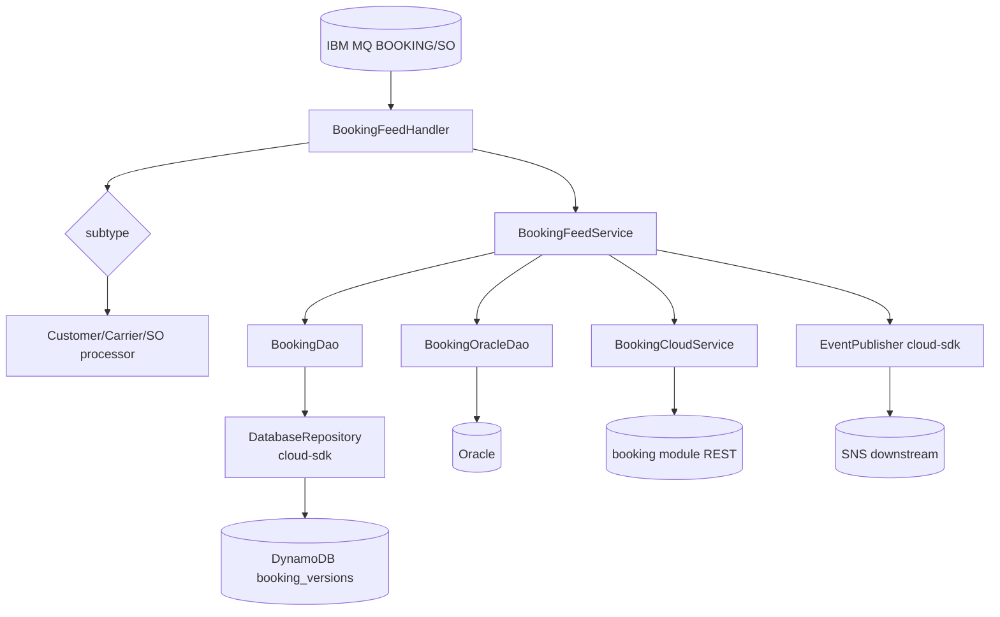
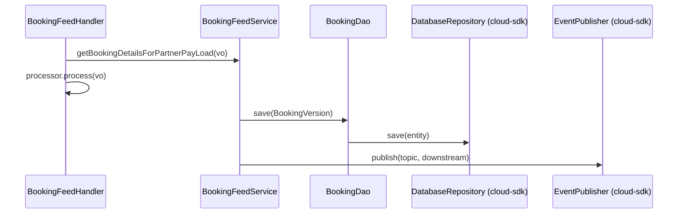

# Partner Integrator — pi-booking-processor — AWS SDK 2.x (cloud-sdk) Upgrade Design

**Module:** `partner-integrator / pi-booking-processor`
**Date:** 2026-06-30
**Status:** Target design — NOT STARTED (depends on `pi-commons` upgrade)
**Companion:** `2026-06-30-partner-integrator-pi-booking-processor-current-state-DESIGN-copilot.md`
**Playbook:** `partner-integrator/docs/2026-06-30-partner-integrator-aws2x-DESIGN-copilot.md`

---

## 1. Change Overview

Booking inbound processor. AWS scope (via `pi-commons`): **DynamoDB** (`booking_versions`), **S3** (workspace),
**SNS** (downstream). Plus a **booking module dependency pin** to reconcile. IBM MQ, Oracle out of scope.

| AWS service | Current (v1) | Target |
|-------------|--------------|--------|
| **DynamoDB** | `DynamoDBMapper` (`BookingDao`/`BookingVersion`) | `DatabaseRepository<BookingVersion, DefaultCompositeKey<String,String>>` |
| **S3** | `AmazonS3` | `StorageClient` |
| **SNS** | `AmazonSNS` | `EventPublisher` |

---

## 2. Maven Dependency Changes

```diff
- <dependency><groupId>com.inttra.mercury</groupId><artifactId>booking</artifactId><version>2.1.7.M</version></dependency>
+ <dependency><groupId>com.inttra.mercury</groupId><artifactId>booking</artifactId><version>{cloud-sdk-upgraded booking}</version></dependency>
  <dependency><groupId>com.inttra.mercury</groupId><artifactId>pi-commons</artifactId><version>1.0</version></dependency>
+ <dependency><groupId>com.inttra.mercury</groupId><artifactId>dynamo-integration-test</artifactId><version>${mercury.commons.version}</version><scope>test</scope></dependency>
+ <dependency><groupId>com.amazonaws</groupId><artifactId>aws-java-sdk-dynamodb</artifactId><scope>test</scope></dependency>
```

> **Call-out:** the `booking:2.1.7.M` pin must move to booking's cloud-sdk-upgraded version; verify the consumed
> booking API (`BookingCloudService`) is compatible.

## 3. Configuration Changes (`conf/<env>/config.yaml`)

```diff
  dynamoDbConfig:
    tableName: booking_versions
    region: us-east-1
+   sseEnabled: false
  # mqPickupConfig / mqSOConfig / database(Oracle) — unchanged
```

## 4. Per-Service Spec

- **DynamoDB:** `BookingVersion` → enhanced annotations; `BookingDao` uses `DatabaseRepository.save/findById/query`.
- **S3:** `StorageClient` for workspace I/O.
- **SNS:** `EventPublisher.publish` for downstream + visibility.

## 5. Guice Wiring Changes

```diff
- BookingApplicationInjector: bind AmazonDynamoDB / DynamoDBMapper / AmazonS3 / AmazonSNS + booking module DAOs
+ BookingApplicationInjector: DatabaseRepository<BookingVersion,..> (factory) + StorageClient + EventPublisher (pi-commons)
```

## 6. Target Component Diagram



## 7. Target Sequence — booking inbound (after)



## 8. Key Classes Changed

| Class | Change |
|-------|--------|
| `pom.xml` | booking pin → cloud-sdk booking; add test deps. |
| `BookingApplicationConfig` | `dynamoDbConfig` → `BaseDynamoDbConfig`. |
| `BookingApplicationInjector` | v1 bindings → cloud-sdk repo/storage/notification. |
| `BookingVersion` | v1 ORM → enhanced annotations. |
| `BookingDao` | mapper → `DatabaseRepository`. |
| `BookingFeedService` | S3/SNS via cloud-sdk clients. |

## 9. Testing Strategy

- **DynamoDB-Local IT** for `BookingDao`; **SNS** unit tests mocking `EventPublisher`; **S3** round-trip.
- Keep MQ/Oracle/booking-sync behavior unchanged. Full local **JaCoCo** coverage on changed code.

## 10. Risks & Call-outs

- Reconcile `booking:2.1.7.M` with booking's completed upgrade.
- Keep `booking_versions` stream shape unchanged for downstream consumers.
