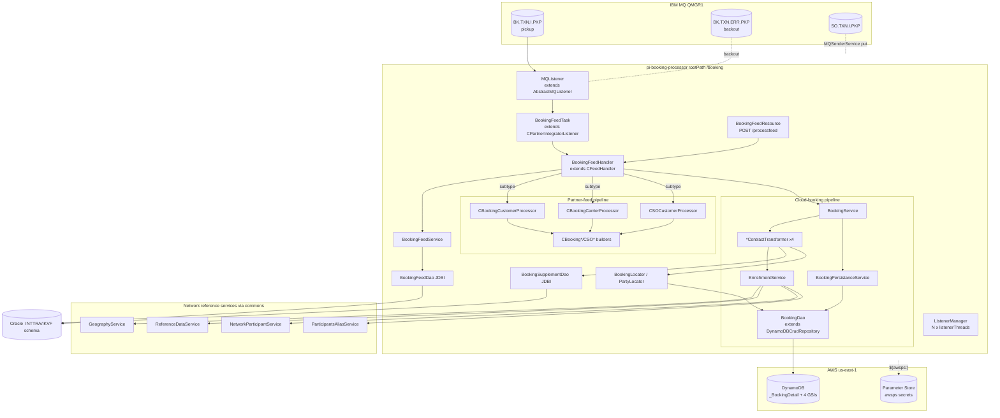
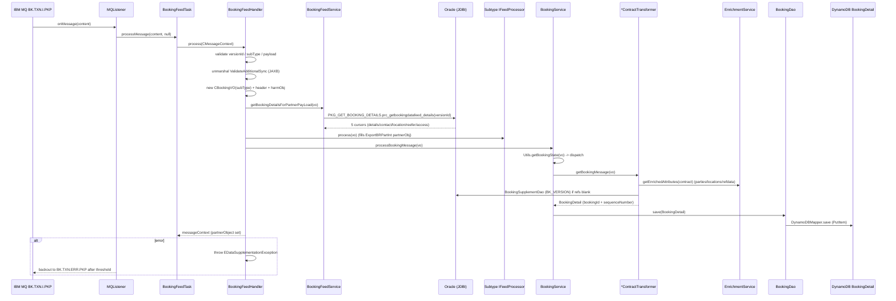
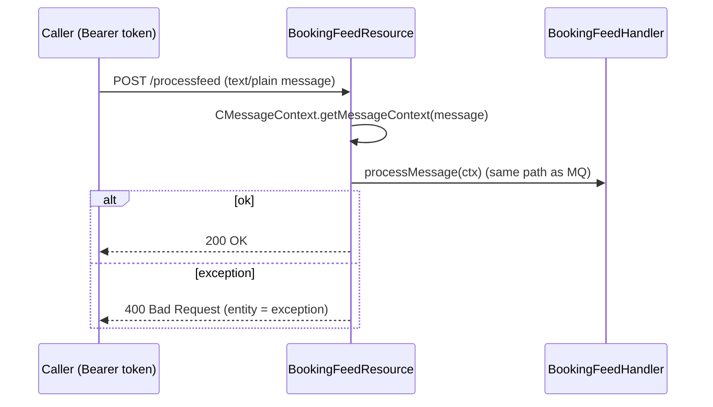

# Partner Integrator — pi-booking-processor — Current-State Design

**Module:** `partner-integrator/pi-booking-processor`
**Date:** 2026-06-30
**Status:** Current state — AWS SDK **1.x** (`com.amazonaws`) for DynamoDB; cloud-sdk migration **NOT STARTED**. **No S3 / SNS / SQS / Kinesis client is instantiated in this module.**
**Artifact:** `com.inttra.mercury:pi-booking-processor:1.0` (Dropwizard 4 / Jetty 12 via shared `InttraServer`, single shaded JAR `pi-booking-processor-1.0.jar`)
**Main class:** `com.inttra.mercury.bkfeed.BookingPIApplication`

---

## 1. Business Purpose & Rules

`pi-booking-processor` is the **inbound partner-integration processor for Booking and Sales-Order (SO) EDI feeds**. It
is *not* a request/response REST service in normal operation — it is an **IBM MQ listener daemon**. It pulls
harmonization-format booking messages off an MQ pickup queue, enriches them from the Oracle `INTTRA`/`IKVF` booking
schema and from network reference services, transforms the harmonization payload into the partner **visibility export**
(`ExportBRPartInt`) format, then converts that into a booking-module `Contract`/`BookingDetail` and **persists the
`BookingDetail` version into DynamoDB**.

Two intertwined object pipelines run per message:

1. **Partner-feed pipeline** (`feedProcessor.process`) — fills a partner `ExportBRPartInt` object (`processorVO.getPartnerObj()`)
   from the harmonization payload. This is the legacy "partner object" the rest of the integrator consumes.
2. **Cloud-booking pipeline** (`bookingService.processBookingMessage`) — re-reads that partner object, builds a
   booking-module `BookingRequestContract`/`SOBookingRequestContract`, enriches parties/locations/reference-data, wraps
   it in a `BookingDetail`, and saves it to DynamoDB (the table the main `booking` service also reads).

### Core responsibilities

- **Consume** booking + SO feeds from IBM MQ (`BK.TXN.I.PKP`, with `SO.TXN.I.PKP` referenced for SO put-back).
- **Unmarshal** the JAXB harmonization payload (`ValidateAdditionalSync`, package
  `com.inttra.mercury.common.schema.bkws.validate.v1`) from the `CMessageContext`.
- **Route** by `NDataFeedSubType`: `BOOKING_CUSTOMER` → `CBookingCustomerProcessor`, `BOOKING_CARRIER` →
  `CBookingCarrierProcessor`, `SO_CUSTOMER` → `CSOCustomerProcessor`.
- **Enrich** from Oracle (`PKG_GET_BOOKING_DETAILS.prc_getbookingdatafeed_details` stored proc; `BK_VERSION` supplement
  query) and from network reference services (geography, country, container/package type, participant alias).
- **Transform** the harmonization payload to partner format (the `CBooking*`/`CSO*` builder family) and then to a
  booking-module `Contract` (the `transform/*ContractTransformer` family) keyed by `BookingState`.
- **Persist** the resulting `BookingDetail` to DynamoDB via `BookingDao` (v1 `DynamoDBMapper`).
- A thin JAX-RS resource (`BookingFeedResource`, `POST /processfeed`) exists for manual / test replay of a single feed
  message — it shares the exact same handler path as the MQ listener.

### Key business rules

| Rule | Detail (source) |
|------|------|
| Mandatory message id | `BookingFeedHandler.processMessage`: `messageContext.getTransactionId()` (the booking **version id**) must be non-null → else `ERuntime.EInvalidMessageException("Booking version id is missing")`. |
| Mandatory subtype | `messageContext.getDataFeedSubType()` must be non-null → else `EInvalidMessageException("Datafeed subtype is null for version …")`. |
| Non-empty payload | `bkHarmPayload` (`messageContext.getPayload()`) must be non-empty (`CBKFeedUtil.isEmpty`) → else `EInvalidMessageException("BK HARM payload is null …")`. |
| Subtype routing | Only `BOOKING_CUSTOMER` / `BOOKING_CARRIER` / `SO_CUSTOMER` are processed; any other subtype logs `"Unknown message type"` and is skipped (no persistence). |
| Oracle version lookup | `BookingFeedDao`: `bookingVO.getVersionId()` required → else `RuntimeException("Version Id is not set for the Object")`. Stored proc returns 5 cursors (details, contact, location, line-item/reefer, access-parties). |
| Booking-state dispatch | `BookingService.getBookingDetail` switches on `Utils.getBookingState(vo)`: `REQUEST`/`AMEND` → `RequestAmendContractTransformer`; `CANCEL` → `CancelContractTransformer`; `CONFIRM`/`PENDING` → `ConfirmPendingContractTransformer`; `DECLINE`/`REPLACE` → `DeclineReplaceContractTransformer`; default → `Exception("Invalid booking state")`. |
| New vs existing booking id | `RequestAmendContractTransformer`: `REQUEST` → `Utils.getNewBookingId()` (new UUID); `AMEND` → `bookingLocator.getBookingId(inttraReference)` (DynamoDB GSI lookup) falling back to a new id if not found. |
| Party resolution / owner | `EnrichmentService.getResolvedParties`: carrier-status messages resolve the **carrier** as owner; otherwise the **booker** is owner (`INTTRA_ALIAS_OWNER = "1000"`), and carrier + remaining parties + haulage parties are resolved against the owner's party id. |
| Supplement fallback | `RequestAmendContractTransformer.supplementBookingContract`: if `carrierReferenceNumber`/`shipmentId` are blank, fill from the Oracle `BK_VERSION` supplement (`BookingSupplementDao`) and add the corresponding `BRReference`. |
| MQ backout | `mqPickupConfig.backoutThreshold` (2 in QA/CVT, 3 in INT): the shared `AbstractMQListener` re-queues to `backoutQueue` (`BK.TXN.ERR.PKP`) after the threshold; `EDataSupplementationException` is thrown on any processing error so the message is not silently ACKed. |

---

## 2. Design & Component Diagram

Dropwizard service built through the shared `InttraServer<BookingApplicationConfig>` builder. The application registers
**no `DynamoDBCommand`** (no table bootstrap here — the `booking` service owns the table); instead a `postSetupHook`
(`startListener`) wires a `ListenerManager` over a list of `MQListener`s and starts polling. Module generators:
`LocalCacheModule` (network-service caches) and `BookingApplicationInjector` (MQ, JDBI/Oracle, DynamoDB v1 clients,
network-service cache impls).



### Key classes & interactions

| Layer | Class | Responsibility |
|-------|-------|----------------|
| Bootstrap | `BookingPIApplication` | Builds `InttraServer`, registers `LocalCacheModule` + `BookingApplicationInjector`, the `BookingFeedResource`, and a `postSetupHook` that builds a `ListenerManager` from the injected `List<Listener>` and starts it. |
| Wiring | `BookingApplicationInjector` (Guice `AbstractModule`) | Binds `Listener`→`MQListener`, `MQConfig`, the JDBI `Jdbi` (`"oracle"` datasource), the **v1 `AmazonDynamoDB`** + `DynamoDBMapperConfig` + `DynamoDBMapper` (all from `DynamoSupport`), each named `ServiceDefinition`, and the 4 network-service cache impls. `@Provides List<Listener>` fans out `listenerThreads` MQ listeners. |
| Config | `BookingApplicationConfig extends ApplicationConfiguration` | `mqPickupConfig`, `mqSOConfig` (`MQConfig`), `database` (`DataSourceFactory`, Oracle), `dynamoDbConfig` (v1 `DynamoDbConfig` from `dynamo-client`), `usePassThrough`, `listenerThreads`. |
| Listener | `MQListener extends AbstractMQListener` (commons) | `process(content)` → `BookingFeedTask.processMessage(content, null)`. One instance per `listenerThreads`. |
| Listener | `BookingFeedTask extends CPartnerIntegratorListener` (commons) | `process(message, ctx)` → delegates to `BookingFeedHandler.process(ctx)`. |
| Listener (put) | `MQSenderService` | Standalone IBM MQ producer to the SO queue (`mqSOConfig.queueName`), `MQC.MQPMO_SYNCPOINT`. Not wired into the main consume path. |
| Handler | `BookingFeedHandler extends CFeedHandler` (commons) | Validates version-id/subtype/payload, unmarshals JAXB, builds `CBookingVO`, calls `BookingFeedService` (Oracle enrich), runs the subtype `IFeedProcessor`, then `BookingService.processBookingMessage`. |
| Service | `BookingFeedService` | Thin wrapper over `BookingFeedDao.getBookingDetailsForPartnerPayLoad`. |
| Service | `BookingService` | `BookingState`-switch over the 4 `ContractTransformer`s; hands result to `BookingPersistanceService`. |
| Service | `BookingPersistanceService` | `bookingDao.save(bookingDetail)`. |
| Service | `PartyLocator` | Participant/alias resolution used by `EnrichmentService`. |
| Persistence (Oracle) | `BookingFeedDao` (JDBI) | Calls `IKVF.PKG_GET_BOOKING_DETAILS.prc_getbookingdatafeed_details` (5 OUT cursors → header, contact, location literals, reefer/atmosphere, parties-with-access). |
| Persistence (Oracle) | `BookingSupplementDao` (JDBI) | `BookingFeedSql.BOOKING_FEED_SUPPLIMENT_SQL` over `INTTRA.BK_VERSION` (carrier ref, shipment id, VGM cutoff, version date). |
| Persistence (DynamoDB) | `BookingDao extends DynamoDBCrudRepository<BookingDetail, DynamoHashAndSortKey<String,String>>` | `save`, `findBookingId`/`findLatestVersion` (GSI `INTTRA_REFERENCE_NUMBER_INDEX`), `findBookingDetail(bookingId, sequenceNumber)` (composite-key query). |
| Persistence (DynamoDB) | `BookingLocator` | Wraps `BookingDao.findBookingId` / `findLatestVersion`. |
| Transform | `RequestAmend` / `Cancel` / `ConfirmPending` / `DeclineReplace` `ContractTransformer` (impl `ContractTransformer`) | Build a booking-module `BookingRequestContract`/`SOBookingRequestContract` then `BookingDetail` (via `Utils.getBookingDetail`). |
| Transform | `EnrichmentService` | Resolves parties (`PartyLocator`), enriches locations (geography/country), collects container/package types (reference data). |
| Transform | `Utils`, `ExportBRHelper`, `ExportBCHelper`, `EnumMapper` | Marshalling, enum mapping, new-booking-id/UUID, `BookingState` derivation. |
| Processor | `CBookingCustomerProcessor` / `CBookingCarrierProcessor` / `CSOCustomerProcessor` (+ `CBKCustomer*` / `CBookingCarrier*` / `CSOCustomer*` builders) | Populate the partner `ExportBRPartInt` (details/properties/parties/cargo/equipment/transport). |
| Model | `com.inttra.mercury.booking.model.BookingDetail` (from `booking:2.1.7.M`) | **v1 ORM** entity persisted to DynamoDB (see §4). |
| VO | `CBookingVO`, `CContactVO`, `CTransportLocationVO`, `CLineItemReeferVO`, `CAtmosphereSettingsVO`, `BookingSupplementDetails` | In-flight value objects (Sonar-excluded: `**/com/inttra/mercury/bkfeed/vo/**`). |

---

## 3. Data Flow

### 3.1 Inbound booking/SO feed (MQ consume → transform → persist)



### 3.2 AMEND lookup (DynamoDB GSI read)

```mermaid
sequenceDiagram
  participant TR as RequestAmendContractTransformer
  participant LOC as BookingLocator
  participant DAO as BookingDao
  participant DDB as DynamoDB (INTTRA_REFERENCE_NUMBER_INDEX GSI)

  TR->>LOC: getBookingId(inttraReference)
  LOC->>DAO: findBookingId(inttraReference)
  DAO->>DDB: query INTTRA_REFERENCE_NUMBER_INDEX where inttraReferenceNumber = :hashKeyValue
  DDB-->>DAO: List<BookingDetail> (KEYS_ONLY projection)
  DAO-->>LOC: first().getBookingId()  (or null)
  Note over TR: null -> Utils.getNewBookingId(); else reuse existing bookingId
```

### 3.3 Manual replay (REST)



---

## 4. Data Stores & Integrations

### DynamoDB — table `BookingDetail` (owned by the `booking` service; this module is a writer/reader)

The persisted entity is `com.inttra.mercury.booking.model.BookingDetail` **from the pinned `booking:2.1.7.M` jar**,
which is a **v1 ORM** class (`@DynamoDBTable(tableName="BookingDetail")`, `@DynamoDBHashKey`, `@DynamoDBRangeKey`,
`@DynamoDBIndexHashKey`, `@DynamoDBAutoGeneratedKey`, `@DynamoDBTypeConverted`/`@DynamoDBTypeConvertedEnum`,
`@DynamoDBVersionAttribute` — verified by decompiling the jar). `BookingDao` is typed
`DynamoDBCrudRepository<BookingDetail, DynamoHashAndSortKey<String,String>>`.

- **Hash key:** `bookingId` (S) — a UUID (`Utils.getNewBookingId()`).
- **Sort key:** `sequenceNumber` (S) — format `m_{System.currentTimeMillis()}_{bookingState}_{inttraReference}`.
- **GSI used here — `INTTRA_REFERENCE_NUMBER_INDEX`:** hash `inttraReferenceNumber` (S), KEYS_ONLY. (The booking entity
  also declares `carrierId_carrierReferenceNumber`, `bookerId_shipmentId`, `carrierScac_carrierReferenceNumber` GSIs;
  pi-booking-processor only queries `INTTRA_REFERENCE_NUMBER_INDEX`.)
- **TTL:** `expiresOn` (epoch seconds, millisec dropped). **Optimistic locking:** `version` (`@DynamoDBVersionAttribute`).
- **Throughput:** `readCapacityUnits: 25` / `writeCapacityUnits: 25` (applied to base + all GSIs by config), `sseEnabled: false`.
- **Encodings (v1 jar):** `payload` (`Contract`), `audit`, `enrichedAttributes`, `metaData` via `@DynamoDBTypeConverted`
  converters (JSON-ish strings); enums via `@DynamoDBTypeConvertedEnum`; `expiresOn` via a date→epoch converter.
- **Per-env table prefix** (`dynamoDbConfig.environment`, of the form `<acct>_<env>_booking`; effective table =
  `<prefix>_BookingDetail`):

  | Env | Prefix (`environment`) | Effective table |
  |-----|------------------------|-----------------|
  | INT | `inttra_int_booking` | `inttra_int_booking_BookingDetail` |
  | QA | `inttra2_qa_booking` | `inttra2_qa_booking_BookingDetail` |
  | **CVT** | **`inttra2_test_booking`** | `inttra2_test_booking_BookingDetail` |
  | PROD | `inttra2_prod_booking` *(// TODO verify — no `conf/prod/config.yaml` present in the module; build.sh expects one)* | `inttra2_prod_booking_BookingDetail` |

> **CVT prefix trap:** CVT is `inttra2_test_booking`, **not** `inttra2_cvt_*`. There is **no** `inttra2-cv-*` S3 bucket
> involved — this module touches **no S3**.

### Oracle (JDBI, `"oracle"` datasource)

| Object | Used by | Purpose |
|--------|---------|---------|
| `IKVF.PKG_GET_BOOKING_DETAILS.prc_getbookingdatafeed_details(versionId, 5×SYS_REFCURSOR)` | `BookingFeedDao` | Booking master enrichment: header details, transaction contact, location literals (BK_TRANSPORT/BK_LOCATION/BK_PARTY_CHARGE), reefer/atmosphere line items, parties-with-access. |
| `INTTRA.BK_VERSION` (SELECT) | `BookingSupplementDao` | Supplement carrier reference number, customer shipment id, VGM cutoff date, version date. |

- Driver `oracle.jdbc.driver.OracleDriver`; per-env JDBC URL (`@10.1.37.x:1521/{env}.nj.inttra.com`); pool 5/5/35;
  user/password from Parameter Store (`${awsps:/inttra{2}/<env>/mercuryservices/partner-integration/pibk/oracleDB/...}`).

### IBM MQ (`com.ibm.mq`)

| Config | Queue | Role |
|--------|-------|------|
| `mqPickupConfig` | `BK.TXN.I.PKP` (QMGR1, channel `JBOSS.CHL1`, port 1424) | Inbound booking + SO pickup (the SO feed is delivered on the same pickup queue; subtype routing splits it). |
| `mqPickupConfig.backoutQueue` | `BK.TXN.ERR.PKP` (`backoutThreshold` 2/3) | Poison-message backout. |
| `mqSOConfig` | `SO.TXN.I.PKP` | Target queue for `MQSenderService` (SO put-back); not used in the main consume loop. |

### Network reference services (via commons, cached through `LocalCacheModule`)

`GeographyService` (`/network/reference/geography`, `/country`), `ReferenceDataService` (`/network/packagetype`,
`/network/containertype`), `NetworkParticipantService` (`/network/reference/participants`), `ParticipantsAliasService`
(`/network/participants/aliases`), plus `auth` (OAuth, `clientId` + `${awsps:…/authclientsecret}`). All resolved from
per-env `serviceDefinitions` (`api-alpha`/`api-beta`/`api-test`.inttra.com). The `…CacheImpl` variants are bound, so
look-ups are memoised in the commons `LocalCache`.

### NOT present in this module

**No `AmazonS3`, no `AmazonSNS`, no `AmazonSQS`, no Kinesis, no `software.amazon.awssdk`, no `cloudsdk`.** A repo-wide
grep over `src/` finds **only** `com.amazonaws.services.dynamodbv2.*` (DynamoDB v1), in `BookingApplicationInjector`,
`BookingDao`, and `BookingDaoTest`. Downstream visibility/formatter distribution is **not** performed here — this module
writes the `BookingDetail` to DynamoDB and sets the partner object on the message context; any SNS/stream fan-out is done
by the **`booking` service's** DynamoDB-stream lambda (`pi-lambda-streamToSns`), not by pi-booking-processor.

---

## 5. Maven Dependencies

| Artifact | Version | Notes |
|----------|---------|-------|
| `com.inttra.mercury:booking` | **`2.1.7.M`** (from `lib/` file repo `pi-bk-local-repo`) | Booking domain model (`BookingDetail`, `Contract`, `EnrichedAttributes`), `DynamoSupport` (v1 Dynamo client factory). **Pinned old v1 build (jar dated 2024-06-12); diverges from the now-cloud-sdk booking source tree.** `maven-dependency-plugin` `purge`+`get` re-fetches `2.1.7.M` at `package`. |
| `com.inttra.mercury:pi-commons` | `1.0` (`compile`) | `InttraServer`, MQ framework (`AbstractMQListener`, `CPartnerIntegratorListener`, `MQService`, `ListenerManager`), `CFeedHandler`, network-service caches, `LocalCacheModule`. Transitively pulls `commons 1.R.01.023` **and `dynamo-client 1.R.01.023` (AWS SDK v1 DynamoDB)**. |
| `io.dropwizard:dropwizard-jdbi3` | `5.0.1` | Oracle access (`JdbiFactory`, `Jdbi`). |
| `com.ibm.mq` (via pi-commons) | — | IBM MQ client (`MQQueueManager`, `MQMessage`, `MQEnvironment`). |
| `io.swagger:swagger-annotations` | `1.5.15` (jaxrs/jersey2 excluded) | `@Api` on the resource. |
| `org.junit.jupiter:junit-jupiter` / `org.mockito:mockito-core` / `mockito-junit-jupiter` / `org.assertj:assertj-core` | `5.11.3` / `5.12.0` / `2.17.0` / `3.25.3` (`test`) | Unit tests. |
| Build | `maven-shade-plugin:3.5.1`, `maven-compiler-plugin:3.13.0` (release **17**), `maven-surefire-plugin:3.2.5`, `aws-maven:6.0.0` extension | Fat JAR (`finalName=pi-booking-processor-1.0`), `ManifestResourceTransformer` main class `BookingPIApplication`, `dependency-reduced-pom`. `aws-maven` extension serves the S3-hosted booking model repo (`s3://inttra-deployment/Booking/repo`). |

> **AWS SDK is never declared directly.** DynamoDB v1 (`com.amazonaws.services.dynamodbv2.*`) arrives transitively via
> `pi-commons → dynamo-client`, and the consumed `booking:2.1.7.M` jar carries v1 ORM annotations on `BookingDetail`.
> `sonar.coverage.exclusions=**/com/inttra/mercury/bkfeed/vo/**`.

---

## 6. Configuration & Deployment

### `conf/{int,qa,cvt}/config.yaml` (no `prod` present in the module tree)

- `server.rootPath: /booking` (commented "temp until entitlement is added"), `applicationConnectors` 8080,
  `adminConnectors` 8081, `applicationContextPath: /`, `adminContextPath: /admin`.
- `mqPickupConfig` — `hostName`, `channel: JBOSS.CHL1`, `port: 1424`, `queueMgrName: QMGR1`, `queueName: BK.TXN.I.PKP`,
  `backoutQueue: BK.TXN.ERR.PKP`, `backoutThreshold` (INT 3, QA/CVT 2).
- `mqSOConfig` — only `queueName: SO.TXN.I.PKP` (other MQ fields inherited / set via `MQSenderService`).
- `listenerThreads` — INT 3, QA/CVT 1 (number of `MQListener`s).
- `database` — Oracle `DataSourceFactory`; `user`/`password` via `${awsps:…/pibk/oracleDB/...}`; per-env URL; pool 5/5/35.
- `dynamoDbConfig` — `readCapacityUnits: 25`, `writeCapacityUnits: 25`, `environment` (table prefix, see §4),
  `sseEnabled: false`. (v1 `DynamoDbConfig` — no `region` key today.)
- `serviceDefinitions` — `auth` (`clientId` + `${awsps:…/authclientsecret}`), `geography`, `geography-alias`, `alias`,
  `country`, `reference-data-packagetype`, `reference-data-containertype`, `participants-alias`, `network-participant`,
  `network-participants`.
- `jerseyClient` — 32/128 threads, `timeout: 2s`, `retries: 2`, gzip on (responses only).
- **Secrets** resolved by commons via AWS Parameter Store (`${awsps:/inttra{2}/<env>/mercuryservices/...}`).

### Deployment

- `build.sh` → `mvn -q verify package sonar:sonar -P mercury-commons,sonar -pl partner-integrator/pi-booking-processor
  --also-make` with Sonar project `mercury-services.partner-integrator-pi-booking-processor` and a dependency-check
  report; renames the shaded JAR to `${RELEASE_NAME}.jar`, copies each `conf/<env>/config.yaml` as
  `config.yaml_<env>_conf` and `suppressions.xml`, generates the Dockerfile (`FROM ${ECR_REPO}:e2openjre11`).
- `run.sh` → moves the active env's config to `config.yaml`, removes the other `*_conf`, then
  `java -Xms64m -Xmx${JVM_Xmx:-256m} -jar ${RELEASE_NAME}.jar server ./config.yaml`. (`server` command starts the
  Dropwizard app; the MQ listeners start from the `postSetupHook`, so the JVM stays up as a daemon.)
- **No table bootstrap** in this module (no `DynamoDBCommand`) — the `booking` service creates/owns `BookingDetail`.
- **Credentials** — default AWS credential chain / ECS task IAM role (consumed by `DynamoSupport.newClient`) and by the
  `${awsps:}` resolver in commons.

---

## 7. AWS Services & SDK 1.x Usage (CALL-OUT)

> **This module actively uses AWS SDK v1 (`com.amazonaws`) for DynamoDB only.** A repo-wide grep over `src/` finds
> **zero** `software.amazon.awssdk` and **zero** `cloudsdk` references. Parameter Store is resolved by commons.

| AWS service | SDK | Where (class) | Concrete v1 classes |
|-------------|-----|---------------|---------------------|
| **DynamoDB** | v1 (client + ORM) | `BookingApplicationInjector`, `BookingDao`, the v1 `BookingDetail` in `booking:2.1.7.M` jar, `dynamo-client` `DynamoDBCrudRepository` | `AmazonDynamoDB`, `DynamoDBMapper`, `DynamoDBMapperConfig`, `DynamoDBQueryExpression`, `AttributeValue`, `KeyPair`, `PaginatedQueryList`, `ScanResultPage`, `@DynamoDBTable`, `@DynamoDBHashKey`, `@DynamoDBRangeKey`, `@DynamoDBIndexHashKey`, `@DynamoDBAutoGeneratedKey`, `@DynamoDBAttribute`, `@DynamoDBTypeConverted`, `@DynamoDBTypeConvertedEnum`, `@DynamoDBVersionAttribute`, `@DynamoDBIgnore`. |
| **Parameter Store** | resolved by commons (`${awsps:…}`) | config only (auth secret, Oracle creds) | — (no direct SSM client). |
| **S3** | **none in-module at runtime** | `aws-maven` build extension only (`s3://inttra-deployment/Booking/repo`) | — (build-time artifact fetch, not an app dependency). |
| **SNS / SQS / Kinesis** | **none in-module** | — | — (downstream fan-out is the `booking`-stream lambda's job). |

**DynamoDB client build** (`BookingApplicationInjector.configure`):
`AmazonDynamoDB client = DynamoSupport.newClient(cfg)` → `bind(AmazonDynamoDB.class).toInstance(client)`;
`DynamoDBMapperConfig = DynamoSupport.newDynamoDBMapperConfig(cfg)`;
`DynamoDBMapper = DynamoSupport.newMapper(client, cfg, mapperConfig)` → bound and injected into `BookingDao`.
`DynamoSupport` is supplied by the **`booking:2.1.7.M` jar** (a v1 helper not present in the current booking source tree).

---

## 8. AWS 2.x / cloud-sdk Upgrade Plan (High Level)

Goal: replace direct AWS SDK v1 (`com.amazonaws`) DynamoDB usage with the in-house **cloud-sdk** (`cloud-sdk-api` +
`cloud-sdk-aws`, AWS SDK 2.x Enhanced Client + Apache HTTP), mirroring the completed **booking** and **visibility**
migrations — **and reconcile the `booking` dependency**, because the in-tree booking module is *already* cloud-sdk while
the pinned `2.1.7.M` jar is still v1.

| Step | Action | Reference |
|------|--------|-----------|
| 1 | **Upgrade `pi-commons` first** (`commons`/`dynamo-client 1.R.01.023` → cloud-sdk line; add `cloud-sdk-api`+`cloud-sdk-aws`, drop `dynamo-client`). This module cannot move until pi-commons stops exporting v1 DynamoDB. | pi-commons, booking |
| 2 | **Bump the `booking` pin** from `2.1.7.M` (v1 `BookingDetail`/`DynamoSupport`) to the cloud-sdk-upgraded booking artifact whose `BookingDetail` is already `@DynamoDbBean`/`@Table` (verified in the booking source tree). Re-validate consumed APIs (`Contract`, `EnrichedAttributes`, `Utils.getBookingDetail`). | `booking` (in-tree `BookingDetail`) |
| 3 | **DynamoDB** — rewrite `BookingApplicationInjector`'s `AmazonDynamoDB`/`DynamoDBMapper`/`DynamoDBMapperConfig` bindings (and `DynamoSupport` usage) to a cloud-sdk `DatabaseRepository<BookingDetail, DefaultCompositeKey<String,String>>` provider; rewrite `BookingDao` off `DynamoDBCrudRepository` onto the injected repository + `DefaultQuerySpec`. **Preserve** table `BookingDetail`, composite key (`bookingId`+`sequenceNumber`), `INTTRA_REFERENCE_NUMBER_INDEX` GSI, TTL, version attribute, all converter encodings. | `booking` `BookingDynamoModule`/`*Dao`; `network`/`registration` DAO patterns |
| 4 | **Config** — migrate `BookingApplicationConfig.dynamoDbConfig` from v1 `DynamoDbConfig` to cloud-sdk `BaseDynamoDbConfig` (add `region`, keep prefix/capacities/`sseEnabled`). | `BookingConfig` |
| 5 | **Tests** — DynamoDB-Local IT for `BookingDao` (composite-key round-trip, `INTTRA_REFERENCE_NUMBER_INDEX` AMEND lookup, version/TTL fidelity); keep MQ/Oracle/transform behaviour unchanged; full local JaCoCo on changed code. | `network`/`auth` `*DaoIT` |

**Risks / call-outs:**
- **Dependency reconciliation is the headline risk.** The pinned `booking:2.1.7.M` jar's `BookingDetail` is v1 ORM, but
  the in-tree booking module's `BookingDetail` is already cloud-sdk (`@DynamoDbBean`/`@Table`, `software.amazon.awssdk.enhanced.dynamodb`,
  `com.inttra.mercury.cloudsdk.database`). The upgrade must move the pin and drop the v1 `DynamoSupport` dependency in one
  coordinated step, or the module will have mixed v1/v2 annotations on the same entity class.
- **`@DynamoDBAutoGeneratedKey` (v1 jar) has no v2 equivalent** — confirm `bookingId` is always set by
  `Utils.getNewBookingId()` / `bookingLocator` before `save` (the in-tree v2 `BookingDetail` already drops auto-gen).
- **Composite-key + GSI wire-compat** — `BookingDetail` is read/written by the main `booking` service too; the table,
  key schema, `INTTRA_REFERENCE_NUMBER_INDEX`, TTL (`expiresOn` epoch seconds), and converter JSON must stay identical.
- **`sequenceNumber` format** (`m_{ts}_{state}_{inttraRef}`) is generated by the booking-model constructor — preserve it
  by reusing the booking artifact rather than re-implementing.
- **MQ / Oracle / network-service paths are out of scope** but must keep working through the pi-commons bump (the MQ
  client and JDBI are unaffected by the AWS SDK swap).
