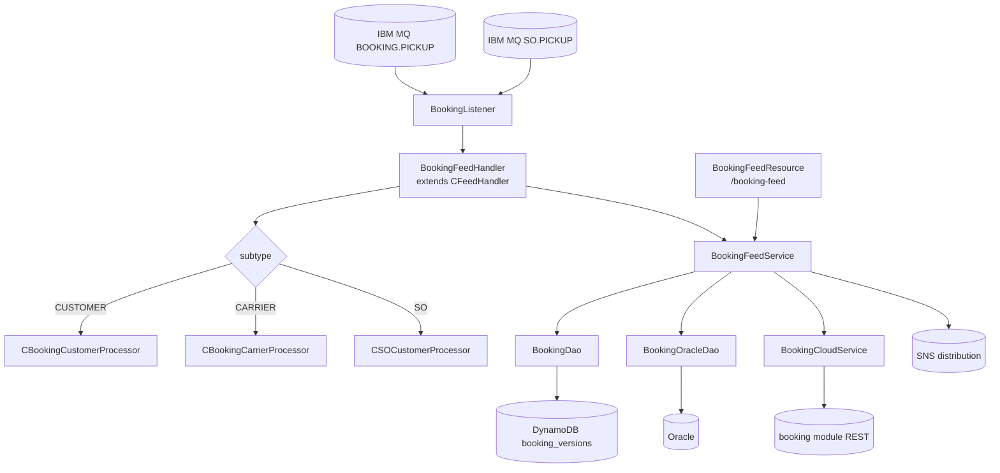
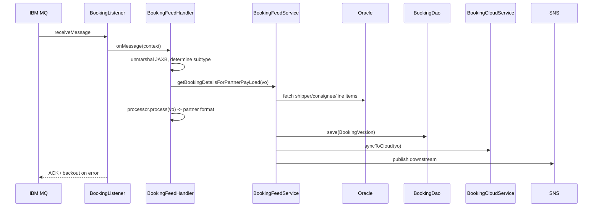

# Partner Integrator — pi-booking-processor — Current-State Design

**Module:** `partner-integrator / pi-booking-processor`
**Date:** 2026-06-30
**Status:** Current state (AWS SDK 1.x — upgrade NOT STARTED)
**Artifact:** `com.inttra.mercury:pi-booking-processor:1.0` (Dropwizard, shaded JAR)
**Main class:** `com.inttra.mercury.bkfeed.BookingPIApplication`

---

## 1. Business Purpose & Rules

Inbound processor for **Booking** EDI feeds (and Sales Order variant). Picks up booking messages from IBM MQ, routes
by feed subtype, enriches from Oracle, transforms to partner formats, persists versions, and syncs with the main
booking module.

### Flow / rules
1. IBM MQ listeners poll the booking pickup queue and the SO (sales order) queue.
2. Unmarshal JAXB harmonization payload; route by subtype:
   - `BOOKING_CUSTOMER` → `CBookingCustomerProcessor`
   - `BOOKING_CARRIER` → `CBookingCarrierProcessor`
   - `SO_CUSTOMER` → `CSOCustomerProcessor`
3. Enrich with booking detail from Oracle (shipper, consignee, line items).
4. Apply processor-specific transformation (fees, port names, currency/localization).
5. Persist `BookingVersion` to DynamoDB; publish to downstream formatters; sync to the booking cloud service.
6. Validate JAXB/XSD, booking reference, parties, commodity codes, rates, dates.

---

## 2. Design & Component Diagram

### Key classes

| Class | Role |
|-------|------|
| `BookingPIApplication` | Dropwizard `main`; integrates with main booking module. |
| `BookingApplicationInjector` | Guice: binds booking module DAOs/services + AWS v1 clients. |
| `BookingFeedHandler` | Unmarshal → route to subtype processor. |
| `CBooking{Customer,Carrier}Processor`, `CSOCustomerProcessor` | Subtype-specific transforms. |
| `BookingDao` | DynamoDB `BookingVersion` (booking_ref + sequence). |
| `BookingOracleDao` | Oracle lookups/inserts. |
| `BookingService` / `BookingFeedService` | Orchestration. |
| `BookingCloudService` | Sync to booking module REST API. |
| `BookingFeedResource` (`/booking-feed`) | Manual submit + status query (JAX-RS). |

---

## 3. Data Flow — booking inbound

---

## 4. Data Stores & Integrations

| Resource | Usage |
|----------|-------|
| IBM MQ (`mqPickupConfig`, `mqSOConfig`) | Inbound booking + SO feeds; backout queues. |
| DynamoDB `booking_versions` | Booking versions (ref + sequence). |
| Oracle (booking schema) | Booking master data. |
| Booking module REST | Sync to internal system (visibility/reporting). |
| SNS | Publish to partner formatters + visibility. |
| JAX-RS resource | `GET /booking-feed/status/{ref}`, `POST /booking-feed/manual-submit`. |

---

## 5. Maven Dependencies

| Artifact | Version | Notes |
|----------|---------|-------|
| **`com.inttra.mercury:booking`** | **`2.1.7.M`** | Booking module DAOs/services (version pin — align during upgrade). |
| `com.inttra.mercury:pi-commons` | `1.0` | Framework + AWS v1 clients. |
| `io.dropwizard:dropwizard-jdbi3` | `5.0.1` | Oracle access. |

AWS SDK v1 (`AmazonDynamoDB`, `DynamoDBMapper`, `AmazonSNS`, `AmazonS3`) via `pi-commons`.

---

## 6. Configuration & Deployment

### Configuration (`conf/<env>/config.yaml`)
Two MQ queues (`mqPickupConfig`, `mqSOConfig`), `database{oracle...}`, `dynamoDbConfig{tableName: booking_versions}`,
`usePassThrough`, `listenerThreads: 10`. Config class `BookingApplicationConfig`.

### Deployment
`mvn -pl pi-booking-processor -am clean package` → `pi-booking-processor-1.0.jar`;
`java -jar pi-booking-processor-1.0.jar server conf/<env>/config.yaml`.

---

## 7. AWS Services & SDK 1.x Usage (CALL-OUT)

| AWS service | v1 classes | Where |
|-------------|-----------|-------|
| DynamoDB | `AmazonDynamoDB`, `DynamoDBMapper`, ORM on `BookingVersion` | `BookingDao`, injector |
| SNS | `AmazonSNS` | downstream publish |
| S3 | `AmazonS3` | `S3WorkspaceService` (commons) |

---

## 8. AWS 2.x / cloud-sdk Upgrade Plan (High Level)

| Step | Action | Reference |
|------|--------|-----------|
| 1 | Consume upgraded `pi-commons`; align the `booking` module dependency (`2.1.7.M` → current cloud-sdk booking). | pi-commons, booking |
| 2 | Swap injector v1 bindings → cloud-sdk factories. | booking |
| 3 | Migrate `BookingDao`/`BookingVersion` → cloud-sdk `DatabaseRepository`; preserve `booking_versions` schema/encoding. | network, registration |
| 4 | Migrate downstream **SNS** → `NotificationService`; keep payloads wire-compatible. | booking, network |
| 5 | **Tests** — DynamoDB-Local IT for `BookingDao`; mocked SNS unit tests; full JaCoCo coverage; keep MQ/Oracle/booking-sync behavior unchanged. | network/auth `*DaoIT` |

**Call-out:** The `booking:2.1.7.M` pin must be reconciled with booking's completed AWS upgrade. Keep
`booking_versions` stream shape unchanged for downstream consumers.
