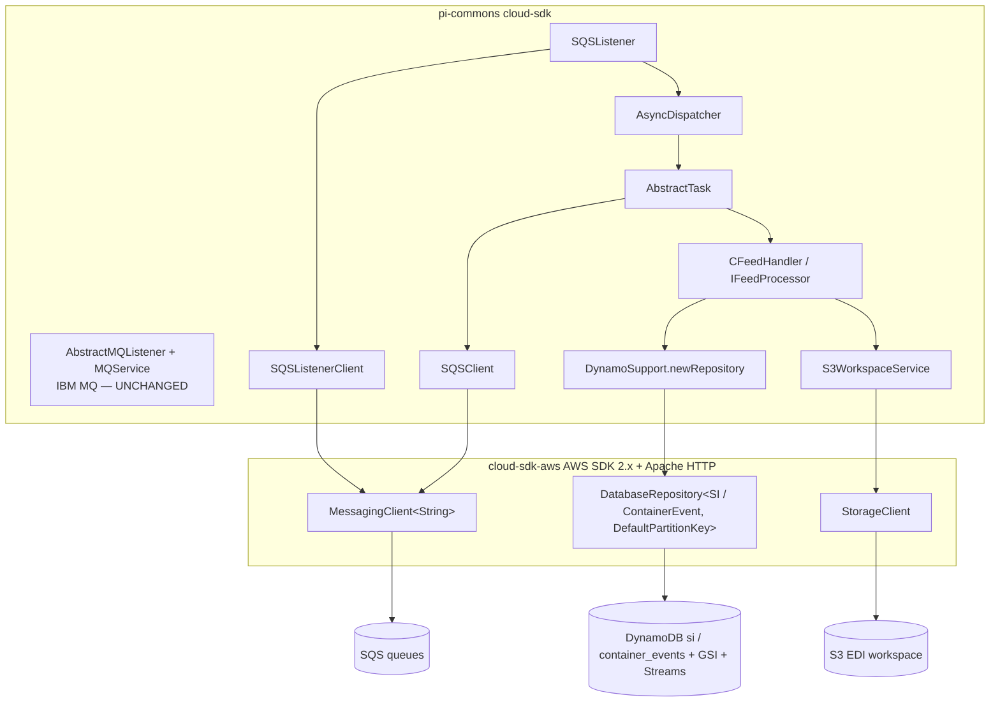
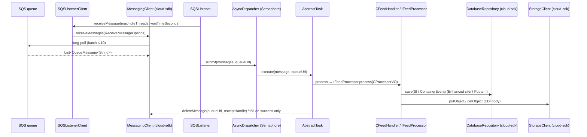

# Partner Integrator — pi-commons — AWS SDK 2.x (cloud-sdk) Upgrade Design

**Module:** `partner-integrator / pi-commons`
**Date:** 2026-06-30
**Status:** Target design (AWS 1.x → AWS 2.x via cloud-sdk) — **NOT STARTED** (upgrade **FIRST**; every `pi-*` module inherits these classes)
**Companion:** `2026-06-30-partner-integrator-pi-commons-current-state-DESIGN-claude.md`
**Reference upgrades:** `booking` (S3 + DynamoDB, complete), `visibility` (S3 + DynamoDB + SNS/SQS), `network`/`registration`/`auth` (DynamoDB DAO patterns)

---

## 1. Change Overview

Replace all direct AWS SDK v1 (`com.amazonaws.*`) usage in `pi-commons` with the in-house **cloud-sdk**
(`cloud-sdk-api` + `cloud-sdk-aws`, AWS SDK 2.x Enhanced Client + Apache HTTP under the hood). **Three** AWS services
are in scope. There is **no SNS and no Kinesis** in this module, so neither is in scope here (contrary to the Copilot
doc, which listed an SNS publisher).

| AWS service | Current (v1) | Target (cloud-sdk / v2) |
|-------------|--------------|--------------------------|
| **DynamoDB** | `AmazonDynamoDB` + `DynamoDBMapper` (`DynamoSupport`); v1 ORM annotations on `SI`/`ContainerEvent`/`EnrichedAttributes` + `networkservices/*/model` | Enhanced client: `DatabaseRepository<T,K>` + `DynamoRepositoryFactory.createEnhancedRepository(...)`; `@DynamoDbBean`/`@Table`/enhanced keys; `AttributeConverter` |
| **S3** | `AmazonS3` (`S3WorkspaceService`), `S3Object`, `IOUtils` | `com.inttra.mercury.cloudsdk.storage.api.StorageClient` + `StorageClientFactory.createDefaultS3Client()`; `StorageObject` for reads |
| **SQS** | `AmazonSQS` ×2 named instances (`SQSClient` send/delete, `SQSListenerClient` receive) | cloud-sdk messaging client (`MessagingClient<String>` + `MessagingClientFactory`) — **verify exact type name against booking/visibility** |

**Out of scope / unchanged:**
- **IBM MQ** (`MQService`, `AbstractMQListener`, `com.ibm.mq.allclient`) — non-AWS, untouched.
- JAXB schemas (`common.schema.*`), `CSchemaValidator`, `CJAXBContextFactory`.
- Network-service REST clients (`NetworkServiceClient`, `*Service(Cache)Impl`, JAX-RS `Client`).
- iLog value objects (`common.ilog`) — no AWS client there.
- Parameter Store (`${awsps:}`) — still resolved by commons.
- The listener → `AsyncDispatcher` → `AbstractTask` framework and its **at-least-once** delete semantics stay
  behaviourally identical; only the SQS client type underneath changes.

**Backward-compatibility is mandatory.** The following must remain wire-identical so existing items/objects stay
readable, DynamoDB Streams keep emitting the same shapes, and downstream stream lambdas keep parsing:

- DynamoDB tables `si` and `container_events` (runtime-prefixed `<environment>_<table>`); GSI
  **`INTTRA_REFERENCE_NUMBER_INDEX`** (hash `siInttraReferenceNumber`); key schema (`SI`: hash `id`, sort
  `sequenceNumber`; `ContainerEvent`: hash `id`); the `@DynamoDBStream(KEYS_ONLY)` setting.
- Attribute encodings: `sequenceNumber` auto-key format `m_<epochMillis>_<state>` (S); `message` via
  `CompressionConverter` (`COMPRESSED|`+GZip+Base64 over 300 KB, else raw string — S); `expiresOn` via
  `DateToEpochSecond` (epoch **seconds**, N — the TTL attribute); `enrichedAttributes` as a map (M); enum fields as
  `name()` strings.
- S3 object content bytes and user-metadata maps; the bucket/key strings (callers supply them).
- SQS message body/attributes consumed by `CFeedHandler`/`AbstractTask`.
- **Decoupling rule:** the DynamoDB on-wire attribute formats (the converter strings/numbers above) are independent of
  any REST/JSON representation of `SI`/`ContainerEvent`. The `AttributeConverter` governs only the DynamoDB attribute;
  Jackson (`@JsonIgnore`/`@JsonIgnoreProperties`) governs JSON. Keep both encodings distinct and unchanged.

---

## 2. Maven Dependency Changes

```diff
  <properties>
-   <aws.java.sdk.version>1.12.715</aws.java.sdk.version>
-   <mercury.commons.version>1.R.01.023</mercury.commons.version>
-   <mercury.dynamodbclient.version>1.R.01.023</mercury.dynamodbclient.version>
+   <mercury.commons.version>1.0.26-SNAPSHOT</mercury.commons.version>
  </properties>

  <dependencies>
    <dependency>
      <groupId>com.inttra.mercury</groupId>
      <artifactId>commons</artifactId>
      <version>${mercury.commons.version}</version>
    </dependency>

-   <!-- direct AWS SDK v1 DynamoDB (and the transitive S3/SQS v1 it brought) -->
-   <dependency>
-     <groupId>com.amazonaws</groupId>
-     <artifactId>aws-java-sdk-dynamodb</artifactId>
-     <version>${aws.java.sdk.version}</version>
-   </dependency>
-   <dependency>
-     <groupId>com.inttra.mercury</groupId>
-     <artifactId>dynamo-client</artifactId>
-     <version>${mercury.dynamodbclient.version}</version>
-   </dependency>

+   <!-- cloud-sdk (AWS SDK 2.x Enhanced Client + Apache HTTP) -->
+   <dependency>
+     <groupId>com.inttra.mercury</groupId>
+     <artifactId>cloud-sdk-api</artifactId>
+     <version>${mercury.commons.version}</version>
+   </dependency>
+   <dependency>
+     <groupId>com.inttra.mercury</groupId>
+     <artifactId>cloud-sdk-aws</artifactId>
+     <version>${mercury.commons.version}</version>
+   </dependency>

+   <!-- DynamoDB-Local integration-test framework -->
+   <dependency>
+     <groupId>com.inttra.mercury</groupId>
+     <artifactId>dynamo-integration-test</artifactId>
+     <version>${mercury.commons.version}</version>
+     <scope>test</scope>
+   </dependency>
+   <!-- v1 DynamoDB kept ONLY for DynamoDB-Local in tests (matches booking) -->
+   <dependency>
+     <groupId>com.amazonaws</groupId>
+     <artifactId>aws-java-sdk-dynamodb</artifactId>
+     <version>1.12.721</version>
+     <scope>test</scope>
+   </dependency>

    <dependency><groupId>com.ibm.mq</groupId><artifactId>com.ibm.mq.allclient</artifactId><version>9.4.4.1</version></dependency> <!-- unchanged -->
  </dependencies>
```

- `dynamo-client` is removed if cloud-sdk supplies the replacement for `@DynamoDBStream` / `DynamoHashKey` /
  `DynamoHashAndSortKey`. If those in-house types are still required (the stream annotation in particular), keep
  `dynamo-client` on the **cloud-sdk-bearing** line instead of dropping it — **`// TODO verify` against the
  booking/visibility pom whether `@DynamoDBStream` moved into cloud-sdk-aws**.
- After this, **no `com.amazonaws` on the prod classpath** (S3 and SQS v1 arrived transitively via the dynamodb
  module / commons; both go with it). cloud-sdk uses **Apache HTTP** (no Netty).

---

## 3. Configuration Changes

`pi-commons` ships no `config.yaml`; the DynamoDB config-shape change (`DynamoDbConfig` → cloud-sdk
`BaseDynamoDbConfig`) is realized in each **consuming** module's config + injector. pi-commons' own config model
classes keep their fields — only the client they feed changes:

- `S3Config` (`bucket`) — unchanged.
- `SQSConfig` (`queueUrl`, `waitTimeSeconds`, `maxNumberOfMessages`) — unchanged.
- `MQConfig` — unchanged (non-AWS).
- `DynamoSupport`'s `regionEndpoint`/`signingRegion` (local-emulator) inputs map to cloud-sdk
  `BaseDynamoDbConfig.regionEndpoint`/`signingRegion`; add `region` (default `us-east-1`) at the consumer level.

```diff
  // consuming app config (e.g. SIFeedApplicationConfig) — shown for context, not in pi-commons
- import com.inttra.mercury.dynamo.respository.module.DynamoDbConfig;
+ import com.inttra.mercury.cloudsdk.database.config.BaseDynamoDbConfig;
- private DynamoDbConfig dynamoDbConfig;
+ @Valid @NotNull private BaseDynamoDbConfig dynamoDbConfig;   // keeps environment prefix + region + emulator fields
```

---

## 4. Per-Service Spec

### 4.1 DynamoDB — `DynamoSupport`, `SI`, `ContainerEvent`, converters

**Before (v1):**
```java
// DynamoSupport (static factory)
AmazonDynamoDB client = AmazonDynamoDBClientBuilder.standard().build();        // or .withEndpointConfiguration(...)
DynamoDBMapperConfig cfg = DynamoDBMapperConfig.builder()
    .withTableNameOverride(TableNameOverride.withTableNamePrefix(env + "_"))
    .withTableNameResolver((clazz, c) -> env + "_" + tableNameOf(clazz))
    .build();
DynamoDBMapper mapper = new DynamoDBMapper(client, cfg);                       // newMapper(...)

// SI entity
@DynamoDBTable(tableName = "si")
@DynamoDBStream(StreamViewType.KEYS_ONLY)
public class SI implements DynamoHashAndSortKey<String,String> {
  @DynamoDBHashKey @DynamoDBAttribute("id") public String getHashKey() {...}
  @DynamoDBRangeKey @DynamoDBAutoGeneratedKey @DynamoDBAttribute("sequenceNumber") public String getSortKey() {...}
  @DynamoDBIndexHashKey(globalSecondaryIndexName=INTTRA_REFERENCE_NUMBER_INDEX) private String siInttraReferenceNumber;
  @DynamoDBTypeConverted(converter=CompressionConverter.class) private String message;
  @DynamoDBTypeConverted(converter=DateToEpochSecond.class)   private Date expiresOn;   // TTL
  private EnrichedAttributes enrichedAttributes;
}
```

**After (cloud-sdk Enhanced client):**
```java
// DynamoSupport — return DatabaseRepository instead of DynamoDBMapper (keep static-factory shape for callers)
public static <T> DatabaseRepository<T, DefaultPartitionKey<String>> newRepository(
        BaseDynamoDbConfig cfg, Class<T> type) {
    String tableName = cfg.getEnvironment() + "_" + tableNameOf(type);          // preserve "<env>_<table>"
    return DynamoRepositoryFactory.createEnhancedRepository(
        cfg, tableName, type,
        DynamoRepositoryConfig.builder().domainType(type).build());
}

// SI entity (annotate getters as booking does)
@DynamoDbBean
@Table(name = "si")                                   // com.inttra.mercury.cloudsdk.database.annotation.Table
public class SI {
  @DynamoDbPartitionKey @DynamoDbAttribute("id")        public String getHashKey() {...}
  @DynamoDbSortKey      @DynamoDbAttribute("sequenceNumber") public String getSortKey() {...}  // value set in ctor
  @DynamoDbSecondaryPartitionKey(indexNames="INTTRA_REFERENCE_NUMBER_INDEX")
  @DynamoDbAttribute("siInttraReferenceNumber")         public String getSiInttraReferenceNumber() {...}
  @DynamoDbConvertedBy(CompressionAttributeConverter.class)   // String, COMPRESSED|+GZip+Base64 over 300 KB — wire-identical
  @DynamoDbAttribute("message")                         public String getMessage() {...}
  @DynamoDbConvertedBy(DateToEpochSecondAttributeConverter.class)  // Number, epoch seconds — TTL, wire-identical
  @DynamoDbAttribute("expiresOn")                       public Date getExpiresOn() {...}
  @DynamoDbAttribute("enrichedAttributes")              public EnrichedAttributes getEnrichedAttributes() {...} // map
}
```

- **`@DynamoDBAutoGeneratedKey` on `sequenceNumber`** has no Enhanced-client equivalent. The value is already produced
  in the `SI(id, state, expiresOn)` constructor (`m_<epochMillis>_<state>`); drop the annotation and rely on the
  constructor — **verify every write path constructs `SI` that way** (a missed path would write a null sort key).
- **`@DynamoDBStream(KEYS_ONLY)`** — re-apply the cloud-sdk/`dynamo-client` stream annotation (whichever ships it post-
  bump) so the table keeps emitting KEYS_ONLY stream records to downstream lambdas. `// TODO verify` annotation home.
- **`EnrichedAttributes`** `@DynamoDBDocument` → `@DynamoDbBean` (no `@Table`); stays a map (M).
- **`networkservices/*/model`** classes (`Geography`, `Country`, `CountryIdentifier`, `ContainerType`, `PackageType`)
  carry `@DynamoDBDocument`/`@DynamoDBTypeConvertedEnum` — migrate to `@DynamoDbBean` + default enum handling (Sonar-
  excluded, so cover via the entity ITs).

**Converters** (re-implement as `software.amazon.awssdk.enhanced.dynamodb.AttributeConverter`; preserve exact encoding):

| v1 converter | v2 replacement | On-wire encoding (unchanged) |
|---|---|---|
| `CompressionConverter` (`String↔String`) | `CompressionAttributeConverter` (`AttributeValue` `S`) | raw string, or `COMPRESSED|` + Base64(GZip) when ISO-8859-1 bytes > `1024*300` |
| `DateToEpochSecond` (`Long↔Date`) | `DateToEpochSecondAttributeConverter` (`AttributeValue` `N`) | epoch **seconds** = `date.getTime()/1000` (TTL attribute) |

**Repository usage before/after:**
```java
// BEFORE
mapper.save(si);
mapper.load(SI.class, id, sequenceNumber);
// query GSI INTTRA_REFERENCE_NUMBER_INDEX via DynamoDBQueryExpression

// AFTER (mirrors booking DAO on DatabaseRepository + DefaultQuerySpec)
repository.save(si);
repository.findById(new DefaultPartitionKey<>(id) /* + sort key */);
DefaultQuerySpec spec = DefaultQuerySpec.builder()
    .indexName("INTTRA_REFERENCE_NUMBER_INDEX")
    .partitionKeyValue(CloudAttributeValue.ofString(siInttraReferenceNumber))
    .build();
List<SI> rows = repository.query(spec);
```

### 4.2 S3 — `S3WorkspaceService`

**Before (v1):**
```java
private final AmazonS3 s3Client;
s3Client.putObject(bucket, fileName, content);                       // String + byte[]/ObjectMetadata overloads
s3Client.copyObject(src, srcKey, dst, dstKey);                       // + CopyObjectRequest w/ metadata
S3Object o = s3Client.getObject(new GetObjectRequest(bucket, key));
String body = read(o.getObjectContent());                           // BufferedReader / IOUtils.toByteArray
Map<String,String> md = s3Client.getObjectMetadata(...).getUserMetadata();
```

**After (cloud-sdk):** (mirrors booking `S3WorkspaceService`)
```java
private final StorageClient storageClient;   // StorageClientFactory.createDefaultS3Client()
storageClient.putObject(bucket, fileName, content);                  // String overload
storageClient.putObject(bucket, fileName, bytes, metadataMap);       // byte[] + metadata — verify overload
storageClient.copyObject(src, srcKey, dst, dstKey, metadataMap);     // verify signature
StorageObject obj = storageClient.getObject(bucket, key);
String body = read(obj.getContent(), charset);                       // getContent() -> InputStream
Map<String,String> md = obj.getUserMetadata();                       // verify accessor name
```
- Drop `com.amazonaws.util.IOUtils`; read via `is.readAllBytes()` / the existing `BufferedReader` helper.
- `RecoverableException` wrapping stays; replace the caught `com.amazonaws.SdkClientException` with the cloud-sdk
  storage exception type. `AWSUtil.isRetryable(...)` (uses v1 `RetryUtils`) must be re-pointed or removed — **flag**.

> **Gap call-out.** `S3WorkspaceService.copyS3FileToFileSystem` streams via `S3ObjectInputStream` and the byte/`byte[]`
> + `ObjectMetadata` content-length path; confirm `StorageClient` exposes a streaming `getContent()` and a
> content-length-aware put. If `StorageClientFactory.createDefaultS3Client()` does not expose retry/timeout/connection
> tuning (same gap flagged in the visibility upgrade), use the configurable `createS3Client(AwsStorageConfig…)` path or
> raise a `cloud-sdk-api` enhancement.

### 4.3 SQS — `SQSClient` / `SQSListenerClient` / `SQSListener`

**Before (v1):**
```java
// SQSClient (@Named("amazonSQSForSender"))
amazonSQS.sendMessage(new SendMessageRequest().withQueueUrl(url).withMessageBody(body));  // + delaySeconds
amazonSQS.deleteMessage(new DeleteMessageRequest(queueUrl, receiptHandle));

// SQSListenerClient (@Named("amazonSQSForListener"))
ReceiveMessageResult r = amazonSQS.receiveMessage(
    new ReceiveMessageRequest(queueUrl).withWaitTimeSeconds(w).withMaxNumberOfMessages(n));
List<Message> msgs = r.getMessages();
```

**After (cloud-sdk):**
```java
// SQSClient
messagingSender.sendMessage(url, body);                  // + sendMessage(url, body, delaySeconds) — verify overload
messagingSender.deleteMessage(queueUrl, receiptHandle);

// SQSListenerClient
List<QueueMessage<String>> msgs = messagingListener.receiveMessages(
    ReceiveMessageOptions.builder().queueUrl(queueUrl).maxMessages(n).waitTimeSeconds(w).build());
```
- The two **separately named** clients (`amazonSQSForSender` / `amazonSQSForListener`) map to two cloud-sdk messaging
  client instances (or one if a single client supports both roles — **verify against booking/visibility**).
- `SQSListener`/`AsyncDispatcher`/`TaskMessage` currently pass `com.amazonaws.services.sqs.model.Message` between
  layers; this type changes to the cloud-sdk `QueueMessage<String>` across `Dispatcher.submit`, `TaskMessage`,
  `AbstractTask.process`, `TaskFactory.getTask`. **The dispatcher/task framework signatures change but the batching,
  semaphore backpressure, and at-least-once delete-on-success semantics stay identical.**
- `SQSListener` catches `com.amazonaws.AbortedException`; replace with the cloud-sdk equivalent / `InterruptedException`
  handling so shutdown interrupts still break the poll loop. **Flag** — verify cloud-sdk's abort/interrupt type.

---

## 5. Guice Wiring Changes

pi-commons has **no module of its own** — the AWS clients are bound by each consumer (e.g. `SIFeedApplicationInjector`,
`SEFeedApplicationInjector`). The wiring change therefore lands in **every consumer**; the canonical diff:

```diff
  // <Consumer>ApplicationInjector.configure()
- bind(AmazonSQS.class).annotatedWith(Names.named("amazonSQSForListener"))
-     .toInstance(AmazonSQSClientBuilder.standard().build());
- bind(AmazonSQS.class).annotatedWith(Names.named("amazonSQSForSender"))
-     .toInstance(AmazonSQSClientBuilder.standard().build());
- bind(AmazonS3.class).toInstance(AmazonS3ClientBuilder.standard().build());
- AmazonDynamoDB client = DynamoSupport.newClient(config.getDynamoDbConfig());
- bind(AmazonDynamoDB.class).toInstance(client);
+ bind(MessagingClient.class).annotatedWith(Names.named("amazonSQSForListener"))
+     .toInstance(MessagingClientFactory.createDefaultStringClient());   // verify factory name
+ bind(MessagingClient.class).annotatedWith(Names.named("amazonSQSForSender"))
+     .toInstance(MessagingClientFactory.createDefaultStringClient());
+ bind(StorageClient.class).toInstance(StorageClientFactory.createDefaultS3Client());
+ // DynamoDB: bind a DatabaseRepository per entity via DynamoSupport.newRepository(config.getDynamoDbConfig(), SI.class)
```

To avoid duplicating this in every consumer, consider adding a **new** shared `PiCommonsAwsModule` in pi-commons that
`@Provides` `StorageClient`, the two named messaging clients, and a `DatabaseRepository` factory binding — consumers
then just `install(new PiCommonsAwsModule())`. (No such module exists today; this is the recommended consolidation.)

---

## 6. Target Component Diagram



## 7. Target Sequence — SQS feed ingest (after)



---

## 8. Key Classes Changed

| Class | Change |
|-------|--------|
| `pom.xml` | remove direct `aws-java-sdk-dynamodb 1.12.715`; remove/`dynamo-client`-bump; add `cloud-sdk-api` + `cloud-sdk-aws`; add `dynamo-integration-test` + test-scoped v1 DynamoDB; drop `aws.java.sdk.version`. |
| `DynamoSupport` | `newClient`/`newMapper` (`AmazonDynamoDB`/`DynamoDBMapper`) → `newRepository` returning `DatabaseRepository` via `DynamoRepositoryFactory`; preserve `<env>_<table>` prefixing. |
| `SI` | v1 ORM → `@DynamoDbBean`/`@Table` + enhanced keys on getters; drop `@DynamoDBAutoGeneratedKey` (ctor sets `sequenceNumber`); re-apply KEYS_ONLY stream annotation; converters → `@DynamoDbConvertedBy`. |
| `ContainerEvent` | same migration; hash `id` only; `DateToEpochSecond` → `AttributeConverter`. |
| `EnrichedAttributes` | `@DynamoDBDocument` → `@DynamoDbBean`. |
| `networkservices/*/model` (`Geography`, `Country`, `CountryIdentifier`, `ContainerType`, `PackageType`) | `@DynamoDBDocument`/`@DynamoDBTypeConvertedEnum` → `@DynamoDbBean` + enhanced enum handling. |
| `CompressionConverter`, `DateToEpochSecond` | `DynamoDBTypeConverter` → `AttributeConverter` (preserve `COMPRESSED|`/GZip/Base64 and epoch-seconds). |
| `S3WorkspaceService` | `AmazonS3`/`S3Object`/`IOUtils` → `StorageClient`/`StorageObject.getContent()`. |
| `SQSClient` | `AmazonSQS` (`amazonSQSForSender`) → cloud-sdk messaging client. |
| `SQSListenerClient` | `AmazonSQS` (`amazonSQSForListener`) + `ReceiveMessageRequest/Result` → `MessagingClient.receiveMessages`. |
| `SQSListener`, `AsyncDispatcher`, `Dispatcher`, `TaskMessage`, `AbstractTask`, `Task`, `TaskFactory` | message type `com.amazonaws…sqs.model.Message` → cloud-sdk `QueueMessage<String>`; abort/interrupt handling adjusted; framework semantics unchanged. |
| `AWSUtil`, `UnrecoverableAWSException` | re-point/remove the v1 `SdkClientException` + `RetryUtils` usage. |
| (**new, recommended**) `PiCommonsAwsModule` | `@Provides` `StorageClient`, the two named messaging clients, and the repository factory so consumers `install(...)` instead of each rebuilding clients. |
| Each consumer `*ApplicationInjector` (`SIFeedApplicationInjector`, `SEFeedApplicationInjector`, …) | swap v1 client bindings for cloud-sdk (or install `PiCommonsAwsModule`); `DynamoDbConfig` → `BaseDynamoDbConfig`. |

---

## 9. Testing Strategy

- **DynamoDB-Local IT** (`dynamo-integration-test` `BaseDynamoDbIT`, `@Tag("integration")`) for `SI` and
  `ContainerEvent`: `save`→`findById` round-trip; the `INTTRA_REFERENCE_NUMBER_INDEX` GSI; **converter fidelity** —
  write a large `message` (>300 KB) and assert the `COMPRESSED|`+Base64(GZip) string round-trips identically, and that
  `expiresOn` persists as epoch **seconds**; auto-key `sequenceNumber` format `m_<epochMillis>_<state>`; verify an item
  written by the v1 mapper is readable by the Enhanced client (and vice-versa).
- **S3 round-trip** IT for `S3WorkspaceService`: String + `byte[]` + metadata put, `getContent`/`getS3ObjectWrapper`/
  `getMetaData`, `copyObject(WithMetaData)`, `copyS3FileToFileSystem`.
- **SQS** unit tests mocking the messaging client: `receiveMessages` batch sizing to idle threads, delete-on-success,
  **no-delete-on-exception** (at-least-once), shutdown interrupt breaks the poll loop.
- **IBM MQ** tests unchanged (use the package-private `MQService(MQQueueManager, MQQueue)` constructor); confirm
  syncpoint commit/rollback/backout behaviour is untouched.
- **Regression-test every `pi-*` consumer** after the bump (each builds its own clients / injector).
- Certify **full local JaCoCo** on changed code (note `**/schema/**`, `**/ilog/**`, `**/networkservices/**/model/**`
  are Sonar-excluded, so `DynamoSupport`, converters, `SI`/`ContainerEvent`, `S3WorkspaceService`, and the SQS classes
  carry the coverage):
  ```
  mvn -f partner-integrator/pi-commons/pom.xml clean verify
  ```

---

## 10. Risks & Call-outs

- **Largest blast radius in `partner-integrator`.** Every `pi-*` processor depends on these classes **and** builds its
  own `AmazonSQS`/`AmazonS3`/`AmazonDynamoDB` (verified in `SIFeedApplicationInjector`/`SEFeedApplicationInjector`), so
  the consumer injectors change too. Upgrade and test pi-commons first, then ripple to each consumer in a verified step.
- **DynamoDB Streams (KEYS_ONLY)** feed external stream-to-SNS/ES lambdas — table names (`si`, `container_events`),
  the `<env>_<table>` prefix, the GSI, key schema, and the converter encodings must stay wire-identical or those
  lambdas break.
- **`@DynamoDBAutoGeneratedKey` has no v2 equivalent** — confirm the `SI` constructor sets `sequenceNumber` on every
  write path; a missed path writes a null sort key.
- **Decoupling rule** — `CompressionConverter` (300 KB GZip+Base64) and `DateToEpochSecond` (epoch seconds TTL) are
  DynamoDB on-wire formats; the `AttributeConverter` must reproduce them byte-for-byte and must not leak into the
  REST/JSON shape.
- **cloud-sdk gaps** — `StorageClientFactory.createDefaultS3Client()` may not expose retry/timeout/connection tuning;
  `AWSUtil`'s v1 `RetryUtils` has no direct cloud-sdk analogue; confirm a streaming `getContent()` and a content-length
  put exist. Raise enhancements where missing (same gaps flagged in the visibility upgrade).
- **SQS message type leak** — `com.amazonaws…sqs.model.Message` threads through `Dispatcher`/`TaskMessage`/`AbstractTask`/
  `TaskFactory`; changing it touches the whole dispatch framework signature (compile-time fan-out), even though runtime
  semantics are preserved.
- **IBM MQ unchanged** — no AWS migration there; verify the listener thread pool / `ListenerManager` still starts both
  listener types after the bump.
- **CVT prefix trap** — partner-integrator DynamoDB tables use the repo `inttra2_test_*` (CVT) / `inttra2_qa_*` /
  `inttra2_prod_*` / `inttra_int_*` convention via the consumer's `dynamoDbConfig.environment`; **`// TODO verify`** the
  exact strings in each consuming module's `conf/<env>/config.yaml` (they are not in pi-commons).
- **Sequencing & commits** — incremental, test-verified steps; one outgoing commit per the team workflow, and every
  commit message must carry the Jira ticket prefix (e.g. `ION-xxxxx …`).
