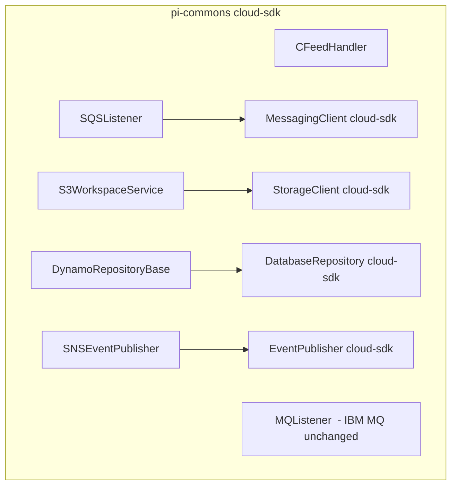
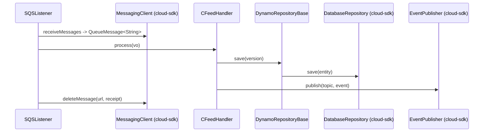

# Partner Integrator — pi-commons — AWS SDK 2.x (cloud-sdk) Upgrade Design

**Module:** `partner-integrator / pi-commons`
**Date:** 2026-06-30
**Status:** Target design — NOT STARTED (**upgrade FIRST**; all sub-modules inherit it)
**Companion:** `2026-06-30-partner-integrator-pi-commons-current-state-DESIGN-copilot.md`
**Playbook:** `partner-integrator/docs/2026-06-30-partner-integrator-aws2x-DESIGN-copilot.md`

---

## 1. Change Overview

`pi-commons` is the **central place** where AWS SDK v1 DynamoDB/S3/SNS/SQS clients are built and injected, so it is
the highest-leverage upgrade target. Migrate all four AWS services to cloud-sdk; keep IBM MQ unchanged.

| AWS service | Current (v1) | Target (cloud-sdk / v2) |
|-------------|--------------|--------------------------|
| **DynamoDB** | `AmazonDynamoDB` + `DynamoDBMapper` (`DynamoRepositoryBase`) | `DatabaseRepository<T,K>` + `DynamoRepositoryFactory` |
| **S3** | `AmazonS3` (`S3WorkspaceService`) | `StorageClient` + `StorageClientFactory` |
| **SNS** | `AmazonSNS` (`SNSEventPublisher`) | `EventPublisher` + `NotificationClientFactory` |
| **SQS** | `AmazonSQS` (`SQSListener`) | `MessagingClient<String>` + `MessagingClientFactory` |

Non-AWS (unchanged): IBM MQ (`MQListener`, `com.ibm.mq.allclient`), JAXB schemas, network-service REST clients.

---

## 2. Maven Dependency Changes

See the shared playbook §2. Net for `pi-commons`:
```diff
- <dependency><groupId>com.amazonaws</groupId><artifactId>aws-java-sdk-dynamodb</artifactId><version>1.12.715</version></dependency>
- <dependency><groupId>com.inttra.mercury</groupId><artifactId>dynamo-client</artifactId><version>1.R.01.023</version></dependency>
+ <dependency><groupId>com.inttra.mercury</groupId><artifactId>cloud-sdk-api</artifactId><version>${mercury.commons.version}</version></dependency>
+ <dependency><groupId>com.inttra.mercury</groupId><artifactId>cloud-sdk-aws</artifactId><version>${mercury.commons.version}</version></dependency>
+ <dependency><groupId>com.inttra.mercury</groupId><artifactId>dynamo-integration-test</artifactId><version>${mercury.commons.version}</version><scope>test</scope></dependency>
+ <dependency><groupId>com.amazonaws</groupId><artifactId>aws-java-sdk-dynamodb</artifactId><scope>test</scope></dependency>
  <dependency><groupId>com.ibm.mq</groupId><artifactId>com.ibm.mq.allclient</artifactId><version>9.4.4.1</version></dependency>  <!-- unchanged -->
```

---

## 3. Configuration Changes

`pi-commons` defines no YAML of its own; the config-shape change (DynamoDB → `BaseDynamoDbConfig`) is realized in the
consuming sub-modules. Its config model classes (`SQSConfig`, `S3Config`, `MQConfig`) keep their fields; only the
client they feed changes.

---

## 4. Per-Service Spec

### 4.1 DynamoDB — `DynamoRepositoryBase<T>`
**Before:** generic CRUD via `DynamoDBMapper`.
**After:** wrap/replace with `DatabaseRepository<T,K>`. Either (a) re-base `DynamoRepositoryBase` on
`DatabaseRepository` (keep its method names for callers) or (b) inject `DatabaseRepository` directly. Entities (`SI`,
`ContainerEvent`) migrate to `@DynamoDbBean`/`@Table`/enhanced keys; converters → `AttributeConverter`.

### 4.2 S3 — `S3WorkspaceService`
**Before:** `AmazonS3.getObject/putObject`.
**After:** `StorageClient.getObject(bucket,key)` (String content) / `putObject(bucket,key,String)` from
`StorageClientFactory.createDefaultS3Client()`.

### 4.3 SNS — `SNSEventPublisher`
**Before:** `AmazonSNS.publish`.
**After:** `EventPublisher.publish(topicArn, msg)` from `NotificationClientFactory.createDefaultClient(topicArn)`.

### 4.4 SQS — `SQSListener`
**Before:** `AmazonSQS.receiveMessage(url)` poll loop + `deleteMessage`.
**After:** `MessagingClient<String>.receiveMessages(ReceiveMessageOptions.builder().queueUrl(url).maxMessages(n).waitTimeSeconds(w).build())`
→ `List<QueueMessage<String>>`; `deleteMessage(url, receiptHandle)`. Keep the listener/dispatcher framework and
backout semantics intact.

---

## 5. Guice Wiring Changes

Move the shared providers here so all sub-modules inherit them:
```java
@Provides @Singleton StorageClient storage(){ return StorageClientFactory.createDefaultS3Client(); }
@Provides @Singleton MessagingClient<String> messaging(){ return MessagingClientFactory.createDefaultStringClient(); }
@Provides @Singleton EventPublisher notifications(@Named("eventTopicArn") String arn){ return NotificationClientFactory.createDefaultClient(arn); }
// DynamoDB repos are bound per entity in each sub-module via DynamoRepositoryFactory
```

---

## 6. Target Component Diagram



## 7. Target Sequence — generic feed (after)



---

## 8. Key Classes Changed

| Class | Change |
|-------|--------|
| `pom.xml` | remove v1 DynamoDB + `dynamo-client`; add cloud-sdk-api/aws + test deps. |
| `DynamoRepositoryBase` | `DynamoDBMapper` → `DatabaseRepository`. |
| `S3WorkspaceService` | `AmazonS3` → `StorageClient`. |
| `SNSEventPublisher` | `AmazonSNS` → `EventPublisher`. |
| `SQSListener` | `AmazonSQS` → `MessagingClient`. |
| `SI`, `ContainerEvent` VOs | v1 ORM → `@DynamoDbBean`/`@Table`/enhanced keys + `AttributeConverter`. |
| listener/injector wiring | bind cloud-sdk factories. |

---

## 9. Testing Strategy

- **DynamoDB-Local IT** for `DynamoRepositoryBase` and the shared VOs.
- **SQS/SNS** unit tests mocking `MessagingClient`/`EventPublisher` (booking/network level).
- **S3** round-trip unit/IT.
- Regression-test all consumers after this upgrade (every sub-module depends on these clients).
- Full local **JaCoCo** coverage on changed code.

---

## 10. Risks & Call-outs

- **Blast radius:** every `pi-*` module depends on these clients — upgrade and test here first, then ripple outward.
- Keep IBM MQ listener behavior unchanged (non-AWS).
- Preserve DynamoDB table names/keys/encodings for `SI`/`ContainerEvent` so streams + downstream consumers keep working.
