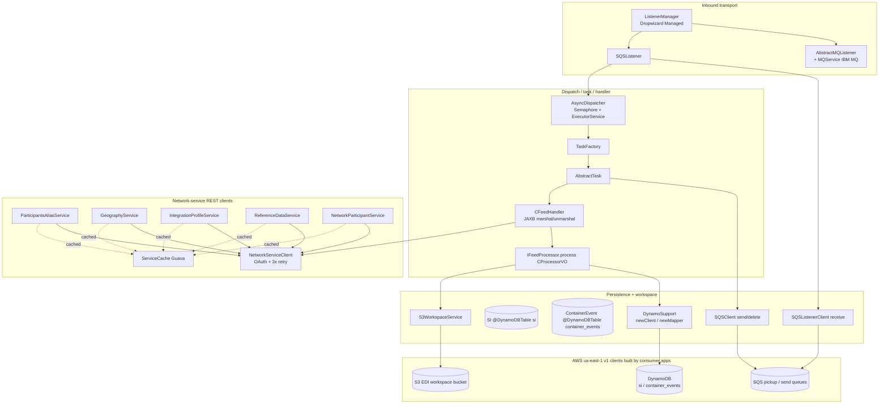
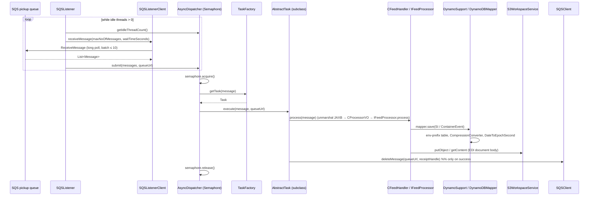
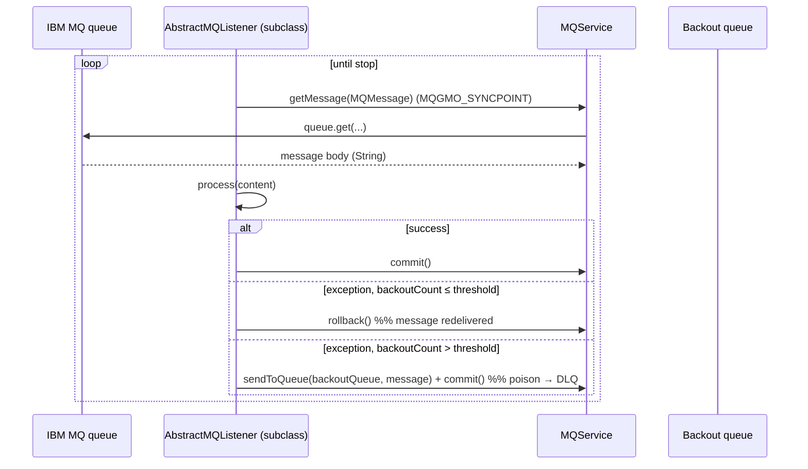

# Partner Integrator — pi-commons — Current-State Design

**Module:** `partner-integrator / pi-commons`
**Date:** 2026-06-30
**Status:** Current state — AWS SDK **1.x** (`com.amazonaws`) only; cloud-sdk migration **NOT STARTED**
**Artifact:** `com.inttra.mercury:pi-commons:1.0` (shared library JAR `pi-commons-1.0.jar`; not independently deployed — built and published via the `aws-maven` extension and consumed by the other `pi-*` modules)
**Main class:** none — this is a dependency JAR. It supplies framework classes (listeners, dispatcher, tasks, handlers, DAO support, S3 workspace, network-service clients, JAXB schemas) that the consuming `pi-*` Dropwizard apps wire into their own `*Application`/`*Injector`.

---

## 1. Business Purpose & Rules

`pi-commons` is the **shared framework library** for the `partner-integrator` family of EDI feed processors
(`pi-si-out-processor`, `pi-statusevents-out-processor`, and siblings). It owns the message-ingest plumbing, the
DynamoDB persistence helpers, the S3 document workspace, the network-service REST clients, and the JAXB schema bindings
that every feed processor reuses. It contains **no runnable application and no Guice module of its own** — each
consuming app builds the AWS clients and binds them (see §6).

Capabilities actually present in source:

- **Inbound transport listeners** — an IBM MQ listener (`AbstractMQListener` + `MQService`, `com.ibm.mq.allclient`) and
  an AWS SQS listener (`SQSListener` + `SQSListenerClient`). Both implement the common `Listener` interface and are run
  by `ListenerManager` (a Dropwizard `Managed`) on a fixed thread pool.
- **Thread dispatcher / task framework** — `AsyncDispatcher` (`Dispatcher`) pulls batches of SQS `Message`s and submits
  them to a bounded `ExecutorService` gated by a `Semaphore`; `TaskFactory` resolves a `Task`/`AbstractTask` per
  message; `AbstractTask` deletes the SQS message after successful processing.
- **Feed handler / processor contracts** — `CFeedHandler` (abstract `IFeedHandler`) does JAXB marshal/unmarshal and
  header generation; `IFeedProcessor.process(CProcessorVO)` is the per-domain processing hook implemented downstream.
- **DynamoDB persistence support** — `DynamoSupport` static factory builds `AmazonDynamoDB` clients and
  `DynamoDBMapper`s with an environment table-name prefix; entity VOs `SI` (table `si`) and `ContainerEvent` (table
  `container_events`) carry the v1 ORM annotations + custom converters.
- **S3 document workspace** — `S3WorkspaceService` (`WorkspaceService`) wraps `AmazonS3` for EDI document get/put/copy
  and metadata.
- **SQS messaging** — `SQSClient` (send/delete) and `SQSListenerClient` (receive), each injected with a **separately
  named** `AmazonSQS` instance.
- **Network-service REST clients** — `NetworkServiceClient` (OAuth + retry) plus participant/alias/geography/
  integration-profile/reference-data services, each with a plain `*Impl` and a Guava-cached `*CacheImpl` variant.
- **Integration logging (iLog) model** — `CILog`/`CILogEvent`/`CILogPayload` value objects and enums; **pure POJOs**,
  no AWS client (no SNS/Elasticsearch publisher lives in this module).
- **JAXB schemas** — generated bindings for BL/SI/Booking/Visibility harmonization payloads under
  `common.schema.*`; schema validation via `CSchemaValidator`.

### Key business rules / behaviours (from source)

| Rule | Detail (source) |
|------|------|
| SQS long-poll batching | `SQSListener` only polls when the dispatcher has idle worker threads: `maxNoOfMessages = dispatcher.getIdleThreadCount()`; AWS max batch is 10. `waitTimeSeconds` 0 = short poll, 1–20 = long poll. |
| Backpressure | `AsyncDispatcher.execute` does `semaphore.acquire()` before submitting work; `getIdleThreadCount()` returns `semaphore.availablePermits()` so the listener never over-fetches. |
| SQS message lifecycle | `AbstractTask.execute` processes then `deleteMessage(queueUrl, receiptHandle)`; on exception it logs and **does not delete**, so the message reappears after the visibility timeout (at-least-once). |
| MQ syncpoint + backout | `MQService` gets under `MQGMO_SYNCPOINT`; `AbstractMQListener` `commit()`s on success, `rollback()`s while `backoutCount <= backoutThreshold`, then puts the poison message to `MQConfig.backoutQueue` and commits. |
| MQ reconnect | On `MQRC_CONNECTION_BROKEN` (or any other `MQException`) `AbstractMQListener` rebuilds the connection, retrying every `DELAY_RETRY_CONNECTION_IN_MS = 60000` ms. |
| Network-service retry | `NetworkServiceClient` GET/POST retry **3×**; `NotAuthorizedException` triggers `authClient.newToken()`; `NotFoundException` on GET returns `Optional.empty()`; exhausting retries throws `RuntimeException`. |
| Lazy/expiring token | `prepareAuthenticatedRequest` calls `authClient.newToken()` when the token is null or `!token.isValid()`. |
| Message compression | `CompressionConverter`: when an `SI.message` exceeds `MAX_CONTRACT_SIZE = 1024*300` bytes (ISO-8859-1) it is GZip+Base64 encoded and prefixed `COMPRESSED|`; `unconvert` reverses only when the prefix is present. |
| TTL encoding | `DateToEpochSecond` stores `expiresOn` as **epoch seconds** (`date.getTime()/1000`) — the DynamoDB TTL attribute. |
| Table-name prefixing | `DynamoSupport.newDynamoDBMapperConfig` forces every table name to `"<environment>_<tableName>"` via a `TableNameOverride` + `TableNameResolver`. |
| Cached vs non-cached services | Each network service has an `*Impl` (direct REST) and a `*CacheImpl` (Guava `ServiceCache`); the consuming app chooses which to bind. |

---

## 2. Design & Component Diagram

`pi-commons` is a layered framework. Transport listeners feed a dispatcher → task → handler/processor pipeline;
persistence and integration helpers sit beneath. There is **no `*Injector`/`*Module` here** — the AWS clients
(`AmazonSQS` ×2, `AmazonS3`, `AmazonDynamoDB`) are constructed and bound by each consuming app's injector (e.g.
`SIFeedApplicationInjector`, `SEFeedApplicationInjector`), then injected into these shared classes.



### Key classes & interactions

| Layer | Class | Responsibility |
|-------|-------|----------------|
| Transport (MQ) | `AbstractMQListener` (impl `Listener`) | IBM MQ poll loop under `MQGMO_SYNCPOINT`; commit/rollback/backout; reconnect on broken connection. Subclasses implement `process(String)`. |
| Transport (MQ) | `MQService` | `MQEnvironment`/`MQQueueManager`/`MQQueue` get/put/commit/rollback/close; built from `MQConfig`. |
| Transport (SQS) | `SQSListener` (impl `Listener`) | Long-poll `ReceiveMessageRequest`, submit to `Dispatcher`; sizes the batch to idle threads; handles `com.amazonaws.AbortedException`. |
| Lifecycle | `ListenerManager` (Dropwizard `Managed`) | Fixed thread pool sized to `listeners.size()`; `start()` submits each `Listener::startup`, `stop()` shuts them down. |
| Dispatch | `AsyncDispatcher` (impl `Dispatcher`) | Bounded `ExecutorService` + `Semaphore` backpressure; `submit(List<Message>, queueUrl)` → `work` → `TaskFactory.getTask` → `Task.execute`. |
| Task | `AbstractTask` (impl `Task`) | `@Metered` `execute`; delegates to `process`, then `SQSClient.deleteMessage`; failure leaves the message un-deleted. |
| Handler | `CFeedHandler` (abstract, impl `IFeedHandler`) | JAXB `unmarshalPayloadToObject` / `marshalAnnotatedObject` (`CJAXBContextFactory`, ISO-8859-1), GUID + `ExportCoreHeaderType` header generation; subclass implements `processMessage(CMessageContext)`. |
| Processor | `IFeedProcessor` | `CProcessorVO process(CProcessorVO)` — per-domain hook implemented in consuming modules. |
| Persistence | `DynamoSupport` (static util) | `newClient(DynamoDbConfig)` / `newClient(regionEndpoint, signingRegion)` → `AmazonDynamoDB`; `newMapper(...)` → `DynamoDBMapper` with env-prefix `TableNameOverride`/`TableNameResolver`. |
| Entity | `SI` (`@DynamoDBTable("si")`, `@DynamoDBStream(KEYS_ONLY)`) | Hash key `id`, **auto-generated** range key `sequenceNumber`, GSI `INTTRA_REFERENCE_NUMBER_INDEX` (hash `siInttraReferenceNumber`), `message` via `CompressionConverter`, `expiresOn` via `DateToEpochSecond`, nested `EnrichedAttributes`. |
| Entity | `ContainerEvent` (`@DynamoDBTable("container_events")`, `@DynamoDBStream(KEYS_ONLY)`) | Hash key `id`, plain string attrs, `expiresOn` via `DateToEpochSecond`, nested `EnrichedAttributes`. |
| Converter | `CompressionConverter` (`DynamoDBTypeConverter<String,String>`) | GZip+Base64 over the 300 KB threshold; `COMPRESSED|` prefix. |
| Converter | `DateToEpochSecond` (`DynamoDBTypeConverter<Long,Date>`) | `Date` ↔ epoch seconds (TTL). |
| Nested doc | `EnrichedAttributes` (`@DynamoDBDocument`) | `transactionPartyList`, `eventCode`, `transactionPartyWithout4FList` (stored as a map). |
| Workspace | `S3WorkspaceService` (impl `WorkspaceService`) | `copyObject`/`copyObjectWithMetaDate`, `putObject` (String + `byte[]` + metadata), `getContent`/`getS3ObjectWrapper`/`getS3InputStream`/`getMetaData`, `copyS3FileToFileSystem`; wraps `SdkClientException` as `RecoverableException`. |
| Messaging | `SQSClient` (impl `MessageSender`) | `sendMessage` (+ delay), `deleteMessage`; injected `@Named("amazonSQSForSender")`. |
| Messaging | `SQSListenerClient` | `receiveMessage(ReceiveMessageRequest)`; injected `@Named("amazonSQSForListener")`. |
| Network | `NetworkServiceClient` | JAX-RS `Client` GET/POST with 3× retry + `AuthClient` token refresh (`@Timed`). |
| Network | `ParticipantsAliasService(Imp/CacheImpl)`, `GeographyService(Impl/CacheImpl)`, `IntegrationProfileService(Impl)`, `IntegrationProfileFormatService(Impl)`, `ReferenceDataService(Impl/CacheImpl)`, `NetworkParticipantService(Impl/CacheImpl)` | Domain REST look-ups; cache variants use `ServiceCache` (Guava + `GuavaCacheMetrics`) bound via `LocalCacheModule`. |
| Util | `AWSUtil` | `isRetryable(SdkClientException)` using v1 `com.amazonaws.retry.RetryUtils`. |
| Util | `UnrecoverableAWSException` | wraps `com.amazonaws.SdkClientException`. |
| iLog | `CILog`, `CILogEvent`, `CILogPayload`, `EIlog`, enums (`NIEventType`, `NXLogStatus`, …) | Integration-logging value objects — **no AWS client**. |
| Schema | `common.schema.*` (JAXB), `CSchemaValidator`, `CJAXBContextFactory` | BL/SI/Booking/Visibility XSD bindings + validation. |

---

## 3. Data Flow

### 3.1 SQS feed ingest (representative read/process/delete path)



> On any exception in `AbstractTask.execute` the message is **not** deleted; it returns to the queue after the SQS
> visibility timeout (at-least-once delivery). `AsyncDispatcher.work` swallows the exception (logs only) and always
> releases the semaphore permit.

### 3.2 IBM MQ feed ingest (syncpoint + backout)



### 3.3 Network-service enrichment lookup (cached)

```mermaid
sequenceDiagram
  participant P as IFeedProcessor / handler
  participant CS as *CacheImpl (e.g. ParticipantsAliasServiceCacheImpl)
  participant Cache as ServiceCache (Guava)
  participant Impl as *ServiceImpl
  participant NSC as NetworkServiceClient
  participant AUTH as AuthClient
  participant NET as network REST service

  P->>CS: getByAliasName / getByParticipantId / lookup
  CS->>Cache: getValue(key)
  alt cache miss
    Cache->>Impl: load(key)
    Impl->>NSC: get(url, params, type)
    NSC->>AUTH: getToken() / newToken() if invalid or 401
    NSC->>NET: GET (≤3 retries; 404 → Optional.empty)
    NET-->>NSC: JSON
    NSC-->>Impl: Optional<T>
    Impl-->>Cache: value
  end
  Cache-->>CS: Optional<T>
  CS-->>P: Optional<T>
```

---

## 4. Data Stores & Integrations

### DynamoDB — entities defined here, tables created/named by consumers

`pi-commons` defines two `@DynamoDBTable` entities. The **actual table name is prefixed at runtime** by
`DynamoSupport.newDynamoDBMapperConfig` to `"<environment>_<tableName>"`, where `<environment>` comes from the
consuming app's `dynamoDbConfig.environment`.

| Entity (`@DynamoDBTable`) | Keys / indexes | Encodings | Stream |
|---|---|---|---|
| `SI` — base name `si` | Hash `id` (S); range `sequenceNumber` (S, `@DynamoDBAutoGeneratedKey`, format `m_<epochMillis>_<state>`); GSI **`INTTRA_REFERENCE_NUMBER_INDEX`** hash `siInttraReferenceNumber` (S) | `message` → `CompressionConverter` (GZip+Base64 over 300 KB, else raw S); `expiresOn` → `DateToEpochSecond` (N, epoch seconds, TTL); `enrichedAttributes` → `EnrichedAttributes` map (M) | `@DynamoDBStream(KEYS_ONLY)` |
| `ContainerEvent` — base name `container_events` | Hash `id` (S) | string attrs; `expiresOn` → `DateToEpochSecond` (N); `enrichedAttributes` → map (M) | `@DynamoDBStream(KEYS_ONLY)` |

- `@DynamoDBStream` is the in-house `com.inttra.mercury.dynamo.annotation.DynamoDBStream` (from `dynamo-client`),
  driving DynamoDB **Streams** (KEYS_ONLY) consumed by downstream stream-to-SNS/ES lambdas (external to this module).
- `SI`/`ContainerEvent` implement `DynamoHashAndSortKey<String,String>` / `DynamoHashKey<String>` from
  `dynamo-client`'s `com.inttra.mercury.dynamo.respository.id`.
- **Per-env prefixes** are supplied by each consumer's `config.yaml` (`dynamoDbConfig.environment`). Verified examples
  from the partner-integrator family follow the repo convention:

  | Env | `dynamoDbConfig.environment` prefix | Effective table (SI) |
  |-----|-------------------------------------|-----------------------|
  | INT | `inttra_int` | `inttra_int_si` |
  | QA | `inttra2_qa` | `inttra2_qa_si` |
  | **CVT** | **`inttra2_test`** | `inttra2_test_si` |
  | PROD | `inttra2_prod` | `inttra2_prod_si` |

  `// TODO verify` the exact `partner-integrator` per-env prefix strings against each consuming module's
  `conf/<env>/config.yaml` (the table prefix lives there, not in pi-commons).

### S3 — EDI document workspace

`S3WorkspaceService` operates on bucket + key strings passed by callers; the bucket name comes from the consumer's
`S3Config.bucket` (`s3WorkspaceConfig` block). No bucket name is hard-coded in pi-commons. Operations: `putObject`
(String / `byte[]` / with user-metadata), `copyObject(WithMetaData)`, `getContent`/`getS3ObjectWrapper`/
`getS3InputStream`/`getMetaData`, and `copyS3FileToFileSystem`. All `SdkClientException`s are wrapped as
`RecoverableException`.

### SQS — pickup and send queues

Two distinct `AmazonSQS` instances are injected by name: `@Named("amazonSQSForListener")` (`SQSListenerClient.receiveMessage`)
and `@Named("amazonSQSForSender")` (`SQSClient.sendMessage`/`deleteMessage`). Queue URLs come from the consumer's
`SQSConfig` (`queueUrl`, `waitTimeSeconds`, `maxNumberOfMessages`). The library polls in batches sized to idle worker
threads and deletes on success only.

### IBM MQ — inbound EDI transport (non-AWS)

`MQService` connects via `MQEnvironment` (host/port/channel/userId/password/queueMgrName) and accesses a get queue under
`MQGMO_SYNCPOINT`; poison messages go to `MQConfig.backoutQueue`. Driven by `MQConfig` (`hostName`, `port`, `channel`,
`queueMgrName`, `queueName`, `backoutQueue`, `backoutThreshold`).

### Network REST services (via `NetworkServiceClient`)

Alias, geography, integration-profile, integration-profile-format, reference-data, and network-participant lookups over
a JAX-RS `Client` with OAuth (`AuthClient`) and 3× retry. Cache variants (`*CacheImpl`) memoise via Guava `ServiceCache`
wired by `LocalCacheModule` (instrumented by `GuavaCacheMetrics`).

### Integration logging (iLog)

The `common.ilog` package is **value objects only** (`CILog`, `CILogEvent`, `CILogPayload`, enums). There is **no SNS
publisher and no Elasticsearch/Jest client in pi-commons** — those live (if anywhere) in consuming modules or downstream
stream lambdas. (This corrects the Copilot doc, which described an `SNSEventPublisher`/`EventPublisher` here.)

---

## 5. Maven Dependencies

| Artifact | Version | Notes |
|----------|---------|-------|
| `com.inttra.mercury:commons` | `1.R.01.023` (`${mercury.commons.version}`) | `InttraServer`, `ApplicationConfiguration`, `LocalCacheModule` base, JAX-RS `Client`, `${awsps:}` resolution. |
| `com.inttra.mercury:dynamo-client` | `1.R.01.023` (`${mercury.dynamodbclient.version}`) | `DynamoDbConfig`, `DynamoHashKey`/`DynamoHashAndSortKey`, `@DynamoDBStream`. **Transitively pulls AWS SDK v1 DynamoDB.** |
| **`com.amazonaws:aws-java-sdk-dynamodb`** | **`1.12.715`** (`${aws.java.sdk.version}`) | **Direct AWS SDK v1 DynamoDB** — `DynamoDBMapper`, ORM annotations, `AmazonDynamoDB(ClientBuilder)`. |
| `com.ibm.mq:com.ibm.mq.allclient` | `9.4.4.1` | IBM MQ client (EDI transport, `MQService`). |
| `com.oracle.database.jdbc:ojdbc10` | `19.14.0.0` | Oracle JDBC (legacy iLog / reference data). |
| `jdom:jdom` | `1.1` | XML handling for schema/transform utilities. |
| `com.fasterxml.jackson.module:jackson-module-afterburner` | `2.19.2` | Jackson perf module. |
| `org.apache.logging.log4j:log4j-to-slf4j` | `2.23.1` | log4j→slf4j bridge. |
| `com.github.rholder:guava-retrying` | `2.0.0` | Retry helper. |
| `io.swagger:swagger-annotations` | `1.5.15` | `@ApiModelProperty` on VOs (swagger-jaxrs/jersey2 excluded). |
| `org.projectlombok:lombok` | `${lombok.version}` (parent) | `@Data`, `@Builder`, `@Slf4j`. |
| `junit-jupiter`, `mockito-core`, `mockito-junit-jupiter`, `assertj-core` | `5.11.3` / `5.14.2` / `2.17.0` / `3.26.3` (`test`) | JUnit 5 unit tests. |
| Build | `maven-compiler-plugin:3.13.0` (release **17**), `maven-surefire-plugin:3.2.5`, `aws-maven:6.0.0` extension | `finalName=pi-commons-1.0`; published to the AWS-hosted Maven repo for downstream consumption. |

> **Direct AWS v1 declaration:** unlike `bill-of-lading`, pi-commons declares
> `com.amazonaws:aws-java-sdk-dynamodb:1.12.715` **directly**. S3 (`com.amazonaws.services.s3.*`) and SQS
> (`com.amazonaws.services.sqs.*`) classes are compiled against transitive `aws-java-sdk-*` artifacts pulled by the
> dynamodb module / commons — there is **no direct S3 or SQS dependency in pom.xml**.
> `sonar.coverage.exclusions=**/schema/**,**/ilog/**,**/networkservices/**/model/**`.

---

## 6. Configuration & Deployment

- **No config.yaml of its own.** pi-commons defines reusable **config model classes** that consuming apps embed:
  `S3Config` (`bucket`), `SQSConfig` (`queueUrl`, `waitTimeSeconds`, `maxNumberOfMessages`), `MQConfig`
  (`hostName`/`port`/`channel`/`userId`/`password`/`queueMgrName`/`queueName`/`backoutQueue`/`backoutThreshold`),
  `NetworkServiceConfig`. The DynamoDB config (`DynamoDbConfig` with `environment`/`regionEndpoint`/`signingRegion`)
  comes from `dynamo-client` and is supplied per-app.
- **Client construction lives in the consumers.** Verified in `SIFeedApplicationInjector` (and
  `SEFeedApplicationInjector`): they bind
  - `AmazonSQS` `@Named("amazonSQSForListener")` and `@Named("amazonSQSForSender")` from `AmazonSQSClientBuilder.standard().build()`,
  - `AmazonS3` from `AmazonS3ClientBuilder.standard().build()`,
  - `AmazonDynamoDB` from `DynamoSupport.newClient(config.getDynamoDbConfig())`,

  then inject them into `SQSListenerClient`/`SQSClient`/`S3WorkspaceService` and build a `DynamoDBMapper` via
  `DynamoSupport.newMapper`. The optional `regionEndpoint`/`signingRegion` path in `DynamoSupport.newClient` targets a
  local DynamoDB emulator.
- **Deployment:** built and installed/published via the `aws-maven` extension; not a deployable artifact. Every `pi-*`
  processor depends on it.
- **Credentials:** default AWS credential chain (ECS task / EC2 IAM role); no explicit credential provider is set in
  pi-commons or in the verified consumer injector (`*ClientBuilder.standard().build()`).

---

## 7. AWS Services & SDK 1.x Usage (CALL-OUT)

> **AWS SDK v1 (`com.amazonaws`) only.** A grep of `pi-commons/src/main` finds **zero** `software.amazon.awssdk` and
> **zero** `cloudsdk`/`cloud-sdk` references. Because every `pi-*` processor depends on these shared classes, the v1
> surface here is the **highest-leverage upgrade target** in `partner-integrator`. Note there is **no SNS and no
> Kinesis** code in this module.

| AWS service | SDK | Where (class) | Concrete v1 classes |
|-------------|-----|---------------|---------------------|
| **DynamoDB** | v1 ORM (direct dep + via `dynamo-client`) | `DynamoSupport`, `SI`, `ContainerEvent`, `EnrichedAttributes`, `CompressionConverter`, `DateToEpochSecond`, plus `@DynamoDBDocument`/`@DynamoDBTypeConvertedEnum` model classes in `networkservices/*/model` (`Geography`, `Country`, `CountryIdentifier`, `ContainerType`, `PackageType`) | `AmazonDynamoDB`, `AmazonDynamoDBClientBuilder`, `AwsClientBuilder.EndpointConfiguration`, `DynamoDBMapper`, `DynamoDBMapperConfig`, `DynamoDBMapperConfig.TableNameOverride`, `@DynamoDBTable`, `@DynamoDBHashKey`, `@DynamoDBRangeKey`, `@DynamoDBAutoGeneratedKey`, `@DynamoDBAttribute`, `@DynamoDBIndexHashKey`, `@DynamoDBIgnore`, `@DynamoDBTypeConverted`, `@DynamoDBTypeConvertedEnum`, `@DynamoDBDocument`, `DynamoDBTypeConverter`, `StreamViewType` |
| **S3** | v1 (direct usage, transitive dep) | `S3WorkspaceService`, `WorkspaceService` (`PutObjectResult`) | `AmazonS3`, `S3Object`, `S3ObjectInputStream`, `GetObjectRequest`, `GetObjectMetadataRequest`, `CopyObjectRequest`, `ObjectMetadata`, `PutObjectResult`, `com.amazonaws.util.IOUtils`, `com.amazonaws.SdkClientException` |
| **SQS** | v1 (direct usage, transitive dep) | `SQSClient`, `SQSListenerClient`, `SQSListener`, `AsyncDispatcher`, `TaskMessage`, `Dispatcher`, `AbstractTask`, `Task`, `TaskFactory` | `AmazonSQS`, `ReceiveMessageRequest`, `ReceiveMessageResult`, `SendMessageRequest`, `DeleteMessageRequest`, `com.amazonaws.services.sqs.model.Message`, `com.amazonaws.AbortedException` |
| **Retry / errors** | v1 util | `AWSUtil`, `UnrecoverableAWSException` | `com.amazonaws.SdkClientException`, `com.amazonaws.retry.RetryUtils` (`isRetryableServiceException`/`isThrottlingException`/`isClockSkewError`) |
| **Parameter Store** | resolved by commons (`${awsps:}`) | consumer config only | — (no direct SSM client) |
| **SNS / Kinesis** | **none in-module** | — | — |

**Client builds:** all AWS clients are built **outside** pi-commons (in each consumer's `*Injector`) with
`*ClientBuilder.standard().build()`; pi-commons receives them via Guice `@Inject`/`@Named`. The only client-building
code *inside* pi-commons is `DynamoSupport.newClient(...)`, a static factory the consumers call.

**Custom DynamoDB converters:** `CompressionConverter` (`String↔String`, GZip+Base64 with `COMPRESSED|` prefix over
300 KB) and `DateToEpochSecond` (`Date↔Long` epoch-seconds TTL). Both are v1 `DynamoDBTypeConverter` implementations
whose on-wire encoding must be preserved across any migration.

---

## 8. AWS 2.x / cloud-sdk Upgrade Plan (High Level)

Goal: replace direct AWS SDK v1 (`com.amazonaws`) with the in-house **cloud-sdk** (`cloud-sdk-api` + `cloud-sdk-aws`,
AWS SDK 2.x Enhanced Client + Apache HTTP), mirroring the completed **booking** and **visibility** migrations. Because
every `pi-*` module inherits these classes, **pi-commons is migrated first**.

| Step | Action | Reference |
|------|--------|-----------|
| 1 | Bump `commons`/`dynamo-client` to the cloud-sdk-bearing line (e.g. `1.0.26-SNAPSHOT`); **remove** direct `aws-java-sdk-dynamodb 1.12.715`; add `cloud-sdk-api` + `cloud-sdk-aws`; add `dynamo-integration-test` (test) and keep `aws-java-sdk-dynamodb` **test-scoped** for DynamoDB-Local. | `booking`/`visibility` pom |
| 2 | **DynamoDB** — re-base `DynamoSupport`/the mapper on the Enhanced client; migrate `SI`/`ContainerEvent`/`EnrichedAttributes` (+ the `networkservices/*/model` `@DynamoDBDocument`/enum classes) to `@DynamoDbBean`/`@Table`/enhanced keys; re-implement `CompressionConverter` + `DateToEpochSecond` as `AttributeConverter`; preserve table names (`si`, `container_events`), the `INTTRA_REFERENCE_NUMBER_INDEX` GSI, the auto-generated `sequenceNumber`, and the KEYS_ONLY stream. | `booking`/`network`/`registration` DAOs |
| 3 | **S3** — replace `S3WorkspaceService`'s `AmazonS3` with `StorageClient` + `StorageClientFactory.createDefaultS3Client()`; map `S3Object`/`IOUtils` to `StorageObject.getContent()`. | `booking` `S3WorkspaceService` |
| 4 | **SQS** — replace `SQSClient`/`SQSListenerClient` `AmazonSQS` with the cloud-sdk messaging client (verify exact name in booking/visibility); keep the listener/dispatcher/task framework and at-least-once delete semantics. | `booking`/`network` messaging |
| 5 | Move the AWS client providers (or their cloud-sdk equivalents) into the consumer injectors' cloud-sdk modules; keep IBM MQ (`MQService`/`AbstractMQListener`) **unchanged** (non-AWS). | `booking` modules |
| 6 | **Tests** — DynamoDB-Local IT for the mapper + `SI`/`ContainerEvent` (converter fidelity, GSI, TTL, auto-key); S3 round-trip IT; mocked SQS unit tests; **regression-test every `pi-*` consumer** after the bump. | `network`/`auth` `*DaoIT` |

**Risks / call-outs:**
- **Blast radius is the whole `partner-integrator` family** — every consumer builds `AmazonSQS`/`AmazonS3`/`AmazonDynamoDB`
  itself (e.g. `SIFeedApplicationInjector`), so the injector wiring in **each** consumer changes too, not just pi-commons.
- **DynamoDB Streams** (`@DynamoDBStream(KEYS_ONLY)`) feed external stream lambdas — table names, key schema, the
  `sequenceNumber` auto-key format (`m_<epochMillis>_<state>`), and the converter encodings must stay wire-identical.
- **Decoupling rule:** `CompressionConverter`'s `COMPRESSED|`+GZip+Base64 string and `DateToEpochSecond`'s epoch-seconds
  number are the DynamoDB on-wire formats; do not let the v2 converter alter them or leak into the REST/JSON shape.
- **`@DynamoDBAutoGeneratedKey`** on `SI.sequenceNumber` has no Enhanced-client equivalent — the value is already set in
  the `SI(id, state, expiresOn)` constructor, but confirm every write path sets it before `save`.
- **IBM MQ stays on v1-independent libraries** — no AWS change there.
