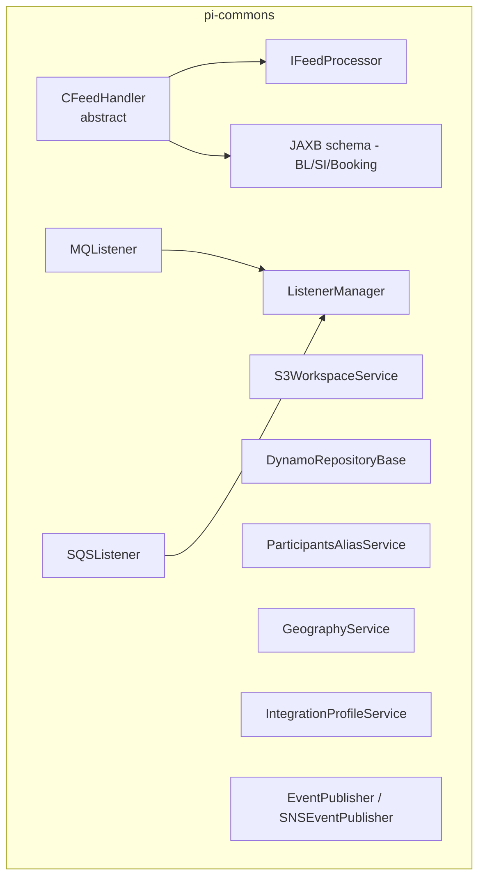
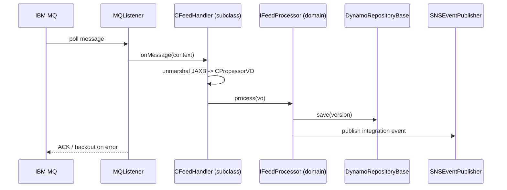

# Partner Integrator — pi-commons — Current-State Design

**Module:** `partner-integrator / pi-commons`
**Date:** 2026-06-30
**Status:** Current state (AWS SDK 1.x — upgrade NOT STARTED)
**Artifact:** `com.inttra.mercury:pi-commons:1.0` (shared library JAR — not independently deployed)

---

## 1. Business Purpose & Rules

`pi-commons` is the **shared framework library** consumed by every other `pi-*` sub-module. It provides the feed
processing framework, message listeners, data models, network-service clients, schema validation, S3 workspace, and
integration logging. It contains no runnable application; it is a dependency JAR.

Capabilities:
- **Feed processing framework** — abstract `CFeedHandler` + `IFeedProcessor` for inbound/outbound transformations.
- **Listeners** — IBM MQ and SQS poll-based listeners with retry/backout handling and a `ListenerManager` lifecycle.
- **Data models** — DynamoDB value objects (`SI`, `ContainerEvent`), processor VOs, subscription configs.
- **Network-service clients** — participants/aliases, geography, integration profiles (cached variants available).
- **Schema validation** — JAXB schemas for BL / SI / Booking harmonization payloads.
- **Workspace** — S3-backed document storage (`S3WorkspaceService`).
- **Integration logging** — events to SNS and Elasticsearch.

---

## 2. Design & Component Diagram

### Key classes

| Class | Role |
|-------|------|
| `CFeedHandler` (abstract) | Unmarshal JAXB payload, delegate to `IFeedProcessor.process(CProcessorVO)`. Subclassed by BL/SI/Booking handlers. |
| `IFeedProcessor` | `process(CProcessorVO)` interface for domain processors. |
| `MQListener` | Poll IBM MQ (`com.ibm.mq.allclient`); dispatch task per message. |
| `SQSListener` | Poll SQS (`AmazonSQS.receiveMessage()`); same dispatch pattern. |
| `ListenerManager` | Manage listener lifecycle; started in Dropwizard post-setup. |
| `S3WorkspaceService` | Read/write EDI document files to S3 (`AmazonS3`). |
| `DynamoRepositoryBase<T>` | Generic DynamoDB CRUD via `DynamoDBMapper`. |
| `ParticipantsAliasService` / `GeographyService` / `IntegrationProfileService` | REST calls to network/booking/visibility services. |
| `EventPublisher` / `SNSEventPublisher` | Publish integration audit events to SNS. |

---

## 3. Data Flow (representative — booking feed via shared framework)

---

## 4. Data Stores & Integrations

| Resource | Usage |
|----------|-------|
| S3 (config) | Workspace for EDI document interchange. |
| IBM MQ (config) | Inbound EDI feed pickup. |
| DynamoDB | Domain entities (`SI`, `ContainerEvent`); table names from sub-module configs. |
| SNS (config) | Integration event publishing. |
| Network service REST | Participant aliases, geography, integration profiles. |
| Elasticsearch (Jest) | Integration metadata search/index. |

---

## 5. Maven Dependencies

| Artifact | Version | Notes |
|----------|---------|-------|
| `com.inttra.mercury:commons` | `1.R.01.023` | `InttraServer`, `ApplicationConfiguration`, `LocalCacheModule`. |
| `com.inttra.mercury:dynamo-client` | `1.R.01.023` | `DynamoDbConfig`, `DynamoRepositoryConfig`. |
| **`com.amazonaws:aws-java-sdk-dynamodb`** | **`1.12.715`** | **AWS SDK v1 DynamoDB.** |
| `com.ibm.mq:com.ibm.mq.allclient` | `9.4.4.1` | IBM MQ client (EDI transport). |

---

## 6. Configuration & Deployment

- **Configuration** — none of its own; consuming sub-modules supply YAML. Common config keys it reads:
  `dynamoDbConfig.tableName/region`, `sqsPickupConfig.queueUrl/waitTimeSeconds`, `s3WorkspaceConfig.bucket`,
  `mqPickupConfig.queueMgrName/queueName/backoutQueue`.
- **Deployment** — built into the local Maven repo and consumed as a dependency by all `pi-*` modules. Not deployed independently.

---

## 7. AWS Services & SDK 1.x Usage (CALL-OUT)

> **AWS SDK v1 throughout.** This is the central place where DynamoDB/S3/SNS/SQS v1 clients are built and injected,
> so it is the **highest-leverage upgrade target** in `partner-integrator`.

| AWS service | v1 classes | Where |
|-------------|-----------|-------|
| **DynamoDB** | `AmazonDynamoDB`, `DynamoDBMapper`, ORM annotations | `DynamoRepositoryBase`, VOs (`SI`, `ContainerEvent`) |
| **S3** | `AmazonS3` (+ `AmazonS3ClientBuilder`) | `S3WorkspaceService` |
| **SNS** | `AmazonSNS` | `SNSEventPublisher` |
| **SQS** | `AmazonSQS` | `SQSListener` |

Clients are built with the standard v1 builders (`AmazonDynamoDBClientBuilder.standard().build()`, etc.) or via
`DynamoSupport.newClient(DynamoDbConfig)`; credentials come from the environment (EC2/Lambda IAM roles).

---

## 8. AWS 2.x / cloud-sdk Upgrade Plan (High Level)

`pi-commons` should be migrated **first** — all sub-modules inherit its clients.

| Step | Action | Reference |
|------|--------|-----------|
| 1 | Bump `commons`/`dynamo-client` to the cloud-sdk-bearing version; remove direct `aws-java-sdk-dynamodb 1.12.715`. | booking, visibility |
| 2 | **SQS** (`SQSListener`) → cloud-sdk `MessagingClient`/`MessagingClientFactory`. | booking, network |
| 3 | **SNS** (`SNSEventPublisher`) → cloud-sdk `NotificationService`/`SnsService`. | booking, network |
| 4 | **S3** (`S3WorkspaceService`) → cloud-sdk storage client/factory. | booking |
| 5 | **DynamoDB** (`DynamoRepositoryBase`, VOs) → cloud-sdk `DatabaseRepository`/enhanced client; preserve table names + encodings. | booking, network, registration |
| 6 | **Tests** — DynamoDB-Local IT for `DynamoRepositoryBase`; mocked SQS/SNS unit tests at booking level; full JaCoCo coverage. | network/auth `*DaoIT` |

**Call-out:** Keep IBM MQ listener behavior unchanged (non-AWS). Because every sub-module depends on these shared
clients, regression-test all consumers after the `pi-commons` upgrade.
