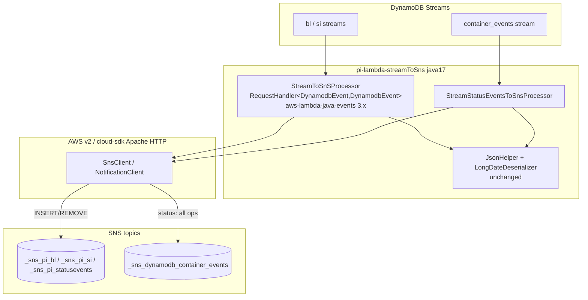
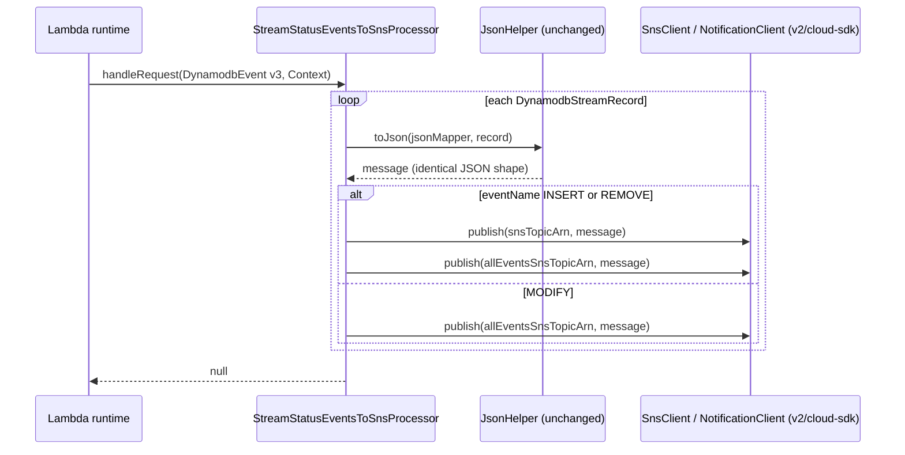

# Partner Integrator — pi-lambda-streamToSns — AWS SDK 2.x (cloud-sdk) Upgrade Design

**Module:** `partner-integrator/pi-lambda-streamToSns`
**Date:** 2026-06-30
**Status:** Target design (AWS 1.x → AWS 2.x via cloud-sdk) — **NOT STARTED**
**Companion:** `2026-06-30-partner-integrator-pi-lambda-streamToSns-current-state-DESIGN-claude.md`
**Reference upgrades:** `booking` (S3 + DynamoDB + SNS/SQS, complete), `visibility` (S3 + DynamoDB + SNS/SQS); other partner-integrator pi-* lambdas for the Lambda-runtime patterns.

---

## 1. Change Overview

This is an AWS **Lambda** module (two `RequestHandler` classes, one artifact), **not** a Dropwizard app — there is no
Guice injector, no `config.yaml`, no `commons`/`dynamo-client`/`pi-commons` dependency. The migration surface is
deliberately tiny: **exactly one outbound AWS client call** (`AmazonSNS.publish`). Everything else is event/runtime
POJOs handed in by the Lambda runtime.

| Concern | Current (v1) | Target (cloud-sdk / v2) |
|---------|--------------|--------------------------|
| **SNS publish** | `com.amazonaws.services.sns.AmazonSNS` + `AmazonSNSClientBuilder.defaultClient()` + `PublishRequest` | cloud-sdk notification client (verify exact type in `booking`/`visibility`) **or** AWS v2 `software.amazon.awssdk.services.sns.SnsClient` + `PublishRequest` |
| **DynamoDB stream model** | `com.amazonaws.services.dynamodbv2.model.{OperationType, AttributeValue, StreamRecord}` via `aws-java-sdk-dynamodb` 1.12.715 | replace with the model bundled in `aws-lambda-java-events` 3.x, **or** keep test-scoped only |
| **Lambda event POJO** | `aws-lambda-java-events` 2.2.2 (`DynamodbEvent`) | `aws-lambda-java-events` 3.x (`DynamodbEvent` retained) — **stays a v1-shaped POJO; this is expected for Lambda modules** |
| **Lambda runtime libs** | `aws-lambda-java-core` 1.2.0 (`RequestHandler`, `Context`, `LambdaLogger`) | unchanged |

**Out of scope:** the Lambda runtime (already **`java17`** in every CF stack — the Copilot doc's "java8 → java21" is
incorrect, see §10); the CloudFormation stacks (topic/queue names, event-source mapping, IAM); Parameter Store (not
used); DynamoDB *client* calls (there are none — this module never talks to a DynamoDB table, only consumes its stream).

**Backward-compatibility is the central mandate.** The following must remain wire-identical:

- **SNS message body** — `ObjectMapper.writeValueAsString(DynamodbEvent.DynamodbStreamRecord)`. The serialised JSON
  (v1 attribute-value shape: `eventName`, `dynamodb` with `Keys`/`NewImage`/`OldImage` as `{"S"|"N"|"M":...}` maps,
  `SequenceNumber`, `StreamViewType`) is the contract for every SNS/SQS subscriber. The `JsonHelper` `ObjectMapper`
  configuration (`ACCEPT_CASE_INSENSITIVE_PROPERTIES`, `JodaModule`, `LongDateDeserializer` for `Date`) must be
  preserved so the body bytes do not shift.
- **Dual-publish routing** (the core compatibility contract):
  - `StreamToSnSProcessor`: INSERT/REMOVE → `snsTopicArn`; **MODIFY dropped**.
  - `StreamStatusEventsToSnsProcessor`: INSERT/REMOVE → **both** `snsTopicArn` and `allEventsSnsTopicArn`; MODIFY →
    `allEventsSnsTopicArn` **only**. The `snsTopicArn`-then-`allEventsTopicArn` ordering for INSERT/REMOVE is preserved.
- **Topic ARNs** still sourced from env vars `snsTopicArn` / `allEventsSnsTopicArn` (unchanged CF wiring).
- **Failure semantics** — keep the `try/catch(Exception)` that logs and swallows publish errors (no partial-batch
  failure, no DLQ from the handler) unless explicitly changing it.

---

## 2. Maven Dependency Changes

```diff
  <properties>
    <maven.compiler.release>17</maven.compiler.release>
-   <aws.java.sdk.version>1.12.715</aws.java.sdk.version>
+   <mercury.commons.version>1.0.26-SNAPSHOT</mercury.commons.version>
+   <aws.lambda.events.version>3.11.4</aws.lambda.events.version>   <!-- verify current 3.x line -->
    <junit.version>5.11.3</junit.version>
    <mockito-junit.version>5.11.0</mockito-junit.version>
  </properties>

  <dependencies>
-   <dependency>
-     <groupId>com.amazonaws</groupId>
-     <artifactId>aws-lambda-java-events</artifactId>
-     <version>2.2.2</version>
-   </dependency>
+   <dependency>
+     <groupId>com.amazonaws</groupId>
+     <artifactId>aws-lambda-java-events</artifactId>
+     <version>${aws.lambda.events.version}</version>
+   </dependency>

    <dependency>
      <groupId>com.amazonaws</groupId>
      <artifactId>aws-lambda-java-core</artifactId>
      <version>1.2.0</version>            <!-- unchanged: RequestHandler/Context/LambdaLogger -->
    </dependency>

-   <!-- AWS SDK v1 SNS client -->
-   <dependency>
-     <groupId>com.amazonaws</groupId>
-     <artifactId>aws-java-sdk-sns</artifactId>
-     <version>1.12.715</version>
-   </dependency>
+   <!-- cloud-sdk notification client (in-house AWS v2 wrapper) -->
+   <dependency>
+     <groupId>com.inttra.mercury</groupId>
+     <artifactId>cloud-sdk-api</artifactId>
+     <version>${mercury.commons.version}</version>
+   </dependency>
+   <dependency>
+     <groupId>com.inttra.mercury</groupId>
+     <artifactId>cloud-sdk-aws</artifactId>
+     <version>${mercury.commons.version}</version>
+   </dependency>

-   <!-- AWS SDK v1 DynamoDB stream model (OperationType / AttributeValue / StreamRecord) -->
-   <dependency>
-     <groupId>com.amazonaws</groupId>
-     <artifactId>aws-java-sdk-dynamodb</artifactId>
-     <version>${aws.java.sdk.version}</version>
-   </dependency>
+   <!-- If OperationType/AttributeValue cannot be sourced from aws-lambda-java-events 3.x,
+        keep this ONLY in test scope; otherwise remove entirely. -->

    <dependency>
      <groupId>com.fasterxml.jackson.core</groupId>
      <artifactId>jackson-databind</artifactId>
      <version>2.17.1</version>
    </dependency>
    <dependency>
      <groupId>com.fasterxml.jackson.datatype</groupId>
      <artifactId>jackson-datatype-joda</artifactId>
      <version>2.17.1</version>
    </dependency>
    <!-- test deps (junit-jupiter, mockito-junit-jupiter) unchanged -->
  </dependencies>
```

- **Removed (prod):** `aws-java-sdk-sns` (v1) and `aws-java-sdk-dynamodb` (v1). After this there is **no
  `com.amazonaws` SDK *client* on the prod classpath** — only the Lambda event/runtime libraries (`aws-lambda-java-*`),
  which are expected to remain `com.amazonaws` for a Java Lambda.
- The `maven-shade-plugin` / `maven-assembly-plugin` (`deployment_package.zip`) packaging is unchanged; the cloud-sdk
  jars land under `lib/`. Confirm the shaded zip stays under the Lambda size limit after the cloud-sdk + AWS v2
  transitive set is added (AWS v2 + Apache HTTP can be larger than the v1 SNS jar).

---

## 3. Configuration Changes

**None at the config layer.** This module has no `config.yaml`. The only runtime configuration is the env vars
`snsTopicArn` and `allEventsSnsTopicArn`, which stay identical (still `Ref`-ed from the CF topics). The CloudFormation
`Runtime` is already `java17` and does not change.

The only "config-shaped" change is internal: the topic ARN is still read with `System.getenv(...)` in each handler
constructor; no new env var is introduced.

---

## 4. Per-Service Spec

### 4.1 SNS — `StreamToSnSProcessor` and `StreamStatusEventsToSnsProcessor`

**Before (v1):**
```java
// constructor
snsClient = AmazonSNSClientBuilder.defaultClient();      // com.amazonaws.services.sns.AmazonSNS
topicArn  = System.getenv("snsTopicArn");
// (status handler also) allEventsTopicArn = System.getenv("allEventsSnsTopicArn");

// handleRequest — per record
String message = JsonHelper.toJson(jsonMapper, record);
PublishRequest req = new PublishRequest().withTopicArn(topicArn).withMessage(message);
snsClient.publish(req);                                  // com.amazonaws...sns.model.PublishRequest
```

**After (AWS v2 `SnsClient` — the most direct, lowest-risk swap):**
```java
// constructor
snsClient = SnsClient.create();                          // software.amazon.awssdk.services.sns.SnsClient
                                                         // uses default region/credential chain (Lambda exec role)
topicArn  = System.getenv("snsTopicArn");

// handleRequest — per record (routing UNCHANGED)
String message = JsonHelper.toJson(jsonMapper, record);
PublishRequest req = PublishRequest.builder()            // software.amazon.awssdk...sns.model.PublishRequest
    .topicArn(topicArn).message(message).build();
snsClient.publish(req);
```

**After (cloud-sdk notification client — preferred, mirrors booking/visibility):**
```java
// constructor — verify the exact factory + type names in booking/visibility source
notificationClient = NotificationClientFactory.createDefaultSnsClient();   // // TODO verify name

// handleRequest — per record
notificationClient.publish(topicArn, message);           // // TODO verify signature (topicArn, body)
```

- The two `publish` calls in `StreamStatusEventsToSnsProcessor` (INSERT/REMOVE) and the single all-events publish
  (MODIFY) map one-to-one; **do not collapse or reorder them**. Keep the `snsTopicArn`-first ordering.
- The message string (`JsonHelper.toJson(jsonMapper, record)`) is computed exactly as today and passed unchanged.
- `com.amazonaws.util.StringUtils.isNullOrEmpty` (used for the ARN null/empty guard) must be replaced once
  `aws-java-sdk-sns` is removed — switch to `org.apache.commons.lang3.StringUtils.isBlank` or a small private helper, to
  avoid re-introducing a v1 dependency just for a utility.

> **Gap call-out.** The v1 `AmazonSNSClientBuilder.defaultClient()` carried no explicit retry/timeout tuning, so there
> is no v1 knob to preserve. If the cloud-sdk factory does not expose region/HTTP-client tuning and the Lambda needs an
> explicit region, fall back to `SnsClient.builder().region(Region.US_EAST_1).build()` (or the configurable cloud-sdk
> factory). Verify whether the cloud-sdk notification client expects a single fixed topic ARN per instance — if so,
> `StreamStatusEventsToSnsProcessor` needs **two** client instances (one per topic) rather than one client used with
> two ARNs.

### 4.2 DynamoDB stream event model

**Before (v1):**
```java
import com.amazonaws.services.lambda.runtime.events.DynamodbEvent;
import com.amazonaws.services.dynamodbv2.model.OperationType;        // from aws-java-sdk-dynamodb
...
for (DynamodbEvent.DynamodbStreamRecord record : dynamodbEvent.getRecords()) {
    switch (OperationType.fromValue(record.getEventName())) { case INSERT: case REMOVE: ... }
}
```

**After (`aws-lambda-java-events` 3.x):**
```java
import com.amazonaws.services.lambda.runtime.events.DynamodbEvent;   // still com.amazonaws, now 3.x
...
for (DynamodbEvent.DynamodbStreamRecord record : dynamodbEvent.getRecords()) {
    switch (record.getEventName()) {                                  // String compare, or events-3.x OperationType
        case "INSERT": case "REMOVE": ...
    }
}
```

- `DynamodbEvent` **stays a `com.amazonaws` event POJO** — this is the expected end state for a Java Lambda (the
  runtime delivers this type). Only the *version* moves (2.2.2 → 3.x).
- `OperationType.fromValue(...)` came from `aws-java-sdk-dynamodb` (v1). When that dependency is removed, replace the
  switch with either a `String` switch on `record.getEventName()` (values `INSERT`/`MODIFY`/`REMOVE`) or the
  equivalent enum bundled in `aws-lambda-java-events` 3.x. **Verify the exact value strings are unchanged** — the
  routing must still treat `INSERT`/`REMOVE`/`MODIFY` identically.
- `JsonHelper` / `LongDateDeserializer` are **unchanged** (serialization parity). Re-run the existing
  `shouldSerializeRecordToJsonInMessage` assertions against the 3.x `DynamodbStreamRecord` to confirm the JSON body
  still contains `eventName`, `dynamodb`, and the op name.

---

## 5. Handler Init / Wiring Changes

There is no Guice module to diff — wiring is the handler **constructor**. The change is localised:

```diff
  public class StreamToSnSProcessor implements RequestHandler<DynamodbEvent, DynamodbEvent> {
-     private AmazonSNS snsClient;
+     private SnsClient snsClient;                       // or cloud-sdk NotificationClient
      private String topicArn;
      private ObjectMapper jsonMapper;

      public StreamToSnSProcessor() {
-         snsClient = AmazonSNSClientBuilder.defaultClient();
+         snsClient = SnsClient.create();                // or NotificationClientFactory.createDefaultSnsClient()
          jsonMapper = JsonHelper.newObjectMapper();
          topicArn = System.getenv("snsTopicArn");
-         if (StringUtils.isNullOrEmpty(topicArn)) {     // com.amazonaws.util.StringUtils
+         if (StringUtils.isBlank(topicArn)) {           // org.apache.commons.lang3.StringUtils
              throw new RuntimeException("sns topic arn is missing. please check the environment parameters.");
          }
      }
```

`StreamStatusEventsToSnsProcessor` changes identically, retaining both ARN guards and the dual/triple `publish` routing.

> The existing unit tests inject the SNS mock by **reflection** into the private `snsClient` field
> (`StreamToSnSProcessor.class.getDeclaredField("snsClient")`). After the field type changes to `SnsClient` /
> cloud-sdk client, update the test mock type accordingly (`@Mock SnsClient snsClient`); the injection mechanism is
> unchanged.

---

## 6. Target Component Diagram



## 7. Target Data Flow — status fan-out (after)



---

## 8. Key Classes Changed

| Class | Change |
|-------|--------|
| `pom.xml` | remove `aws-java-sdk-sns` (v1) and `aws-java-sdk-dynamodb` (v1, or make test-scoped); bump `aws-lambda-java-events` 2.2.2 → 3.x; add `cloud-sdk-api` + `cloud-sdk-aws` (or AWS v2 `sns`); drop the `aws.java.sdk.version` property; add `mercury.commons.version`. |
| `StreamToSnSProcessor` | `AmazonSNS`/`AmazonSNSClientBuilder.defaultClient()`/`PublishRequest` → v2/cloud-sdk publish; `OperationType.fromValue` → string/3.x enum switch; `com.amazonaws.util.StringUtils` → commons-lang3. **Routing unchanged** (INSERT/REMOVE → primary, MODIFY dropped). |
| `StreamStatusEventsToSnsProcessor` | same swaps; **dual/triple publish routing unchanged** (INSERT/REMOVE → both topics, MODIFY → all-events only). |
| `JsonHelper`, `LongDateDeserializer` | **unchanged** — serialization parity is required for the message-body contract. |
| `StreamToSnSProcessorTest`, `StreamStatusEventsToSnsProcessorTest` | change the `@Mock` SNS type and the reflected field type; keep all per-op-type routing / publish-count / message-content assertions. |
| `cfscripts/**` | **unchanged** — runtime already `java17`; topic/queue names, event-source mapping, IAM roles untouched. |

---

## 9. Testing Strategy

- **Unit tests (existing, adapt mock type).** The current suites already cover the full behaviour and must stay green
  with equal assertions:
  - `StreamToSnSProcessorTest`: INSERT publishes once to primary; REMOVE publishes once; **MODIFY does not publish**;
    multi-record selective publish (2×INSERT + 1×REMOVE = 3 publishes, MODIFY ignored); empty list → no publish; SNS
    exception logged + swallowed; JSON body contains `eventName`/`dynamodb`/op name.
  - `StreamStatusEventsToSnsProcessorTest`: INSERT → 2 publishes (primary then all-events, ARNs asserted in order);
    REMOVE → 2 publishes; **MODIFY → 1 publish to all-events only**; mixed batch (INSERT+MODIFY+REMOVE+INSERT = 7
    publishes); empty list → no publish; exception path; JSON body content.
- **Message-shape regression** — assert the serialised body for a representative `DynamodbStreamRecord` is unchanged
  between the 2.2.2 and 3.x event POJOs (capture the `publish` message via `ArgumentCaptor` as the tests already do).
- **No DynamoDB-Local / S3 IT** is needed — this module performs no DynamoDB or S3 client calls.
- Surefire already injects `snsTopicArn` / `allEventsSnsTopicArn` env vars so the constructors succeed under test;
  keep that block.
- Full local JaCoCo on changed code; the PR gate runs:
  ```
  mvn -f partner-integrator/pi-lambda-streamToSns/pom.xml clean verify
  ```
  (the repo's `build_pr.sh` adds `sonar:sonar -P mercury-commons,sonar -Dsonar.qualitygate.wait=true -pl <app_dir>
  --also-make`).

---

## 10. Risks & Call-outs

- **Smallest migration in the repo** — one client call (`AmazonSNS.publish`) per handler. The risk is almost entirely
  in *not* changing behaviour, not in the mechanics.
- **Dual-publish contract** — `StreamStatusEventsToSnsProcessor`'s INSERT/REMOVE-to-both / MODIFY-to-all-events-only
  routing, and `StreamToSnSProcessor`'s INSERT/REMOVE-only (MODIFY dropped) routing, are downstream contracts. Preserve
  exactly, including the publish ordering.
- **Message-body byte/shape compatibility** — the SNS body is `writeValueAsString(record)`. Bumping
  `aws-lambda-java-events` (2.2.2 → 3.x) changes the source POJO; verify the JSON (attribute-value maps, field casing,
  date handling via `LongDateDeserializer`/`JodaModule`) is identical, or downstream parsers break.
- **`OperationType` removal** — dropping `aws-java-sdk-dynamodb` removes `OperationType`/`AttributeValue`; the switch
  must move to string literals or the 3.x enum. Verify the event-name strings (`INSERT`/`MODIFY`/`REMOVE`) match.
- **Artifact size / shading** — AWS v2 SNS + Apache HTTP transitive set is heavier than the single v1 SNS jar; confirm
  the `deployment_package.zip` still deploys (Lambda 250 MB unzipped limit) and cold-start time stays acceptable.
- **`com.amazonaws.util.StringUtils`** leaves with the v1 SNS jar — repoint the ARN guard to commons-lang3 (or inline)
  or the build breaks.
- **Copilot doc inaccuracies to avoid** (verified against `cfscripts/**`): the runtime is **`java17`** today (not
  `java8`/`java21`); the Lambda event source is the **DynamoDB stream directly** via `AWS::Lambda::EventSourceMapping`
  (not "DynamoDB Streams → SQS wrapper → handler" — SQS is downstream of SNS); and there are **three** CF stacks
  (`bl`, `si`, `statusevents`) using **two** handlers, with the all-events topic specifically named
  `${Account}_${Environment}_sns_dynamodb_container_events`.
- **Sequencing / workflow** — three stacks share this artifact; CVT uses the `inttra2_test_*` source-table prefix. One
  outgoing commit per the team workflow; every commit message must carry the Jira ticket prefix (e.g. `ION-xxxxx …`).
