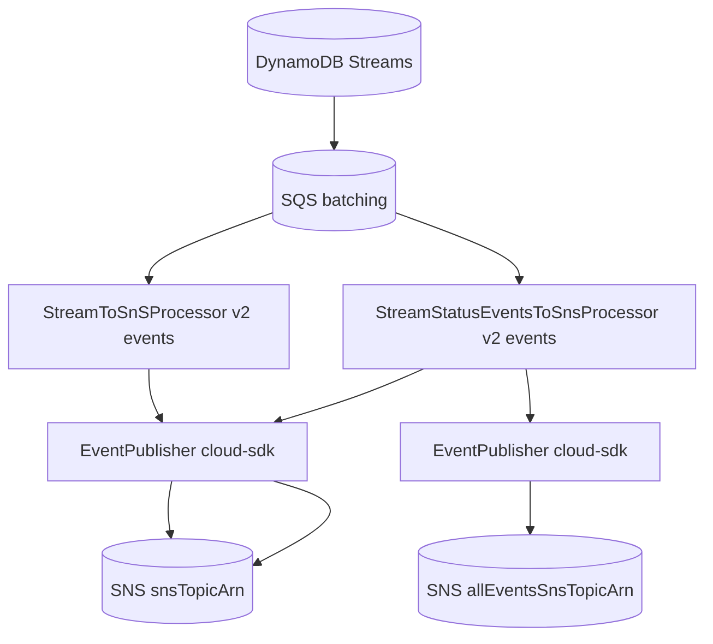
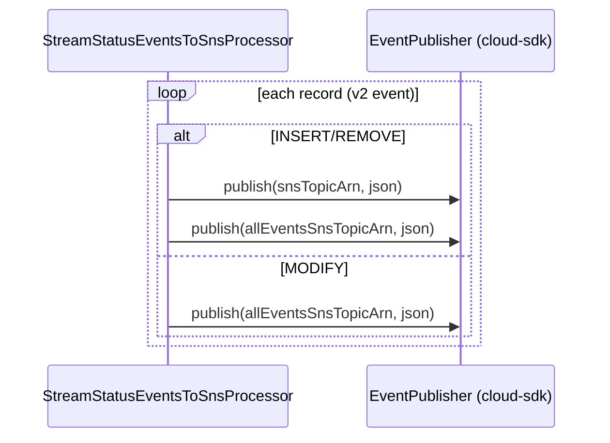

# Partner Integrator — pi-lambda-streamToSns — AWS SDK 2.x (cloud-sdk) Upgrade Design

**Module:** `partner-integrator / pi-lambda-streamToSns`
**Date:** 2026-06-30
**Status:** Target design — NOT STARTED
**Companion:** `2026-06-30-partner-integrator-pi-lambda-streamToSns-current-state-DESIGN-copilot.md`
**Playbook:** `partner-integrator/docs/2026-06-30-partner-integrator-aws2x-DESIGN-copilot.md`

---

## 1. Change Overview

Two Lambdas that fan DynamoDB Streams out to SNS. AWS scope: **SNS** (publish) + **DynamoDB stream event POJOs**.

| Concern | Current (v1) | Target |
|---------|--------------|--------|
| **SNS** | `AmazonSNS` / `AmazonSNSClientBuilder.defaultClient()` / `PublishRequest` | `EventPublisher` + `NotificationClientFactory.createDefaultClient(topicArn)` (or AWS v2 `SnsClient`) |
| **Stream events** | `DynamodbEvent` / `OperationType` (v1) | `aws-lambda-java-events` v3 |
| **Runtime** | `java8` | `java17`/`java21` |

---

## 2. Maven Dependency Changes

```diff
- <dependency><groupId>com.amazonaws</groupId><artifactId>aws-java-sdk-sns</artifactId><version>1.12.715</version></dependency>
- <dependency><groupId>com.amazonaws</groupId><artifactId>aws-java-sdk-dynamodb</artifactId><version>1.12.715</version></dependency>
- <dependency><groupId>com.amazonaws</groupId><artifactId>aws-lambda-java-events</artifactId><version>2.2.2</version></dependency>
+ <dependency><groupId>com.amazonaws</groupId><artifactId>aws-lambda-java-events</artifactId><version>3.11.x</version></dependency>
+ <dependency><groupId>com.inttra.mercury</groupId><artifactId>cloud-sdk-api</artifactId><version>${mercury.commons.version}</version></dependency>
+ <dependency><groupId>com.inttra.mercury</groupId><artifactId>cloud-sdk-aws</artifactId><version>${mercury.commons.version}</version></dependency>
  <dependency><groupId>com.amazonaws</groupId><artifactId>aws-lambda-java-core</artifactId><version>1.2.0</version></dependency>  <!-- unchanged -->
```

## 3. Configuration Changes

Env vars only — `snsTopicArn`, `allEventsSnsTopicArn` unchanged. Lambda `Runtime` → `java21`.

## 4. Per-Service Spec

- **SNS:** replace `AmazonSNS.publish(PublishRequest)` with `EventPublisher.publish(topicArn, json)` (two
  instances for the two target topics, or one service used with two ARNs). Preserve message body bytes per topic.
- **Stream events:** replace v1 `DynamodbEvent`/`OperationType` with v3; keep op-type filtering identical:
  - `StreamToSnSProcessor`: INSERT/REMOVE → `snsTopicArn` (skip MODIFY).
  - `StreamStatusEventsToSnsProcessor`: INSERT/REMOVE → both topics; MODIFY → `allEventsSnsTopicArn` only.

## 5. Init/Wiring Changes

Construct `EventPublisher` via `NotificationClientFactory.createDefaultClient(arn)` in each handler constructor
(replacing `AmazonSNSClientBuilder.defaultClient()`).

## 6. Target Component Diagram



## 7. Target Sequence — status fan-out (after)



## 8. Key Classes Changed

| Class | Change |
|-------|--------|
| `pom.xml` | remove v1 SNS/DynamoDB; lambda-events v2→v3; add cloud-sdk-api/aws. |
| `StreamToSnSProcessor` / `StreamStatusEventsToSnsProcessor` | v1 SNS + events → `EventPublisher` + v2 events; same routing. |
| `JsonHelper` / `LongDateDeserializer` | unchanged (serialization parity). |

## 9. Testing Strategy

- Unit tests asserting per-op-type topic routing (INSERT/REMOVE/MODIFY) with mocked `EventPublisher`.
- Full local **JaCoCo** coverage on changed code.

## 10. Risks & Call-outs

- Published record JSON + dual-topic routing rules are a **contract** for all subscribers — keep byte/shape-identical.
- Runtime jump `java8 → java21`.
