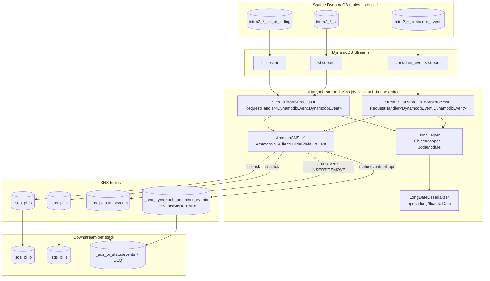
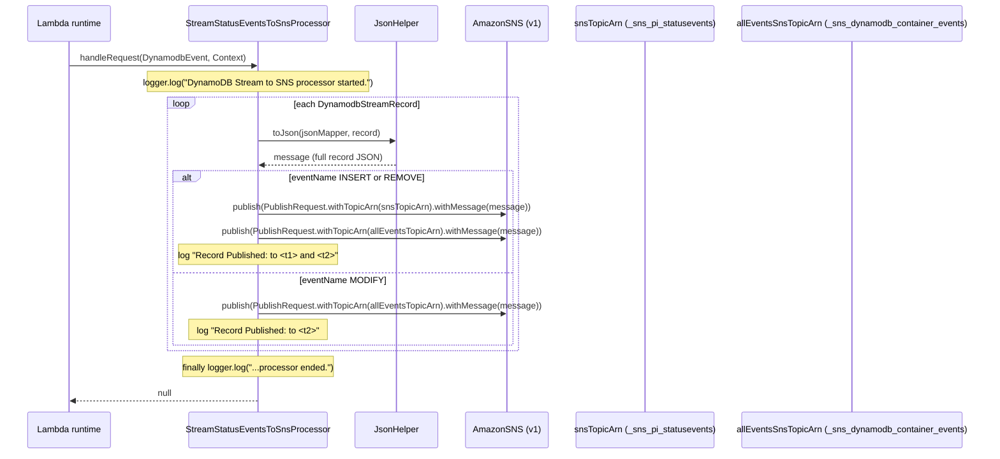
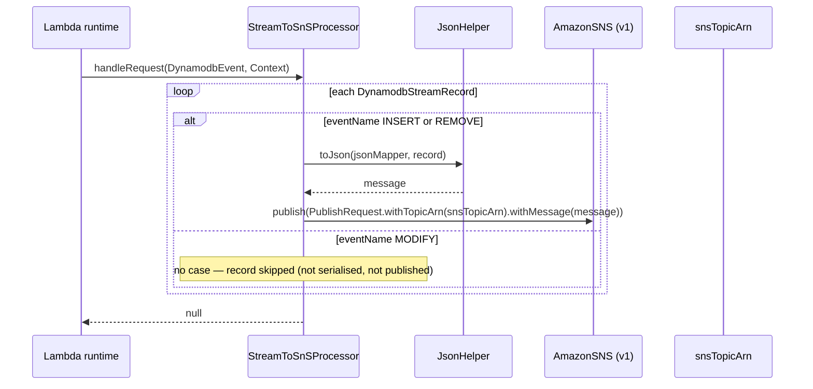
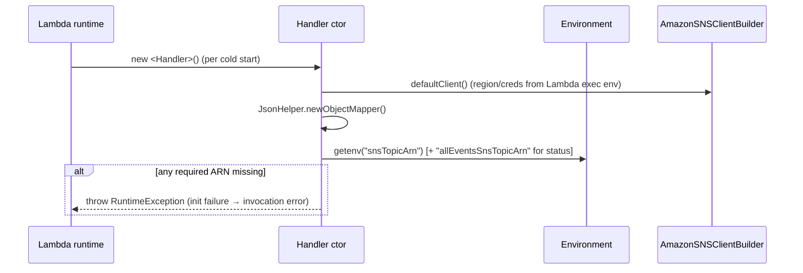

# Partner Integrator — pi-lambda-streamToSns — Current-State Design

**Module:** `partner-integrator/pi-lambda-streamToSns`
**Date:** 2026-06-30
**Status:** Current state — AWS SDK **1.x** (`com.amazonaws`) in production; cloud-sdk migration **NOT STARTED**
**Artifact:** `com.inttra.mercury:pi-lambda-streamToSns:1.0.0` (AWS **Lambda**, not Dropwizard; packaged as a `deployment_package.zip` — classes at root + `lib/` jars; **two handler classes** in one artifact)
**Lambda handlers:** `com.inttra.mercury.pi.StreamToSnSProcessor::handleRequest`, `com.inttra.mercury.pi.StreamStatusEventsToSnsProcessor::handleRequest`

---

## 1. Business Purpose & Rules

`pi-lambda-streamToSns` is a pair of AWS Lambda functions that act as a **DynamoDB Stream → SNS fan-out relay** for the
Partner Integration (PI) outbound pipeline. Each function is wired (via CloudFormation `AWS::Lambda::EventSourceMapping`)
directly to the stream of a source DynamoDB table; for every stream record it serialises the **raw v1
`DynamodbStreamRecord`** to JSON and publishes it to one or two SNS topics depending on the change type. SNS topics then
fan out to per-application SQS queues that downstream partner-integration consumers drain.

The repository ships **two** handler implementations, deployed as **three** distinct CloudFormation stacks
(`cfscripts/bl`, `cfscripts/si`, `cfscripts/statusevents`):

| Handler class | Stacks using it | Topics published | Behaviour |
|---|---|---|---|
| `StreamToSnSProcessor` | `bl` (bill-of-lading stream), `si` (shipping-instruction stream) | `snsTopicArn` only | **INSERT / REMOVE** → publish to `snsTopicArn`. **MODIFY → dropped** (no `default` case). |
| `StreamStatusEventsToSnsProcessor` | `statusevents` (container-events stream) | `snsTopicArn` **and** `allEventsSnsTopicArn` | **INSERT / REMOVE** → publish to **both** topics. **MODIFY** → publish to `allEventsSnsTopicArn` **only**. |

> **DynamoSupport is self-contained.** This Lambda carries its own copy of the DynamoDB v1 stream model
> (`com.amazonaws.services.dynamodbv2.model.*` via `aws-java-sdk-dynamodb`) and the AWS Lambda event POJOs
> (`aws-lambda-java-events`). It does **not** depend on `pi-commons` or any shared `DynamoSupport` module — the
> only Mercury coupling is the Sonar project name in the build scripts. Its dependency closure is purely AWS v1 +
> Jackson.

### Key business rules

| Rule | Detail (source) |
|------|------|
| Topic ARN required | `StreamToSnSProcessor` constructor throws `RuntimeException("sns topic arn is missing...")` if `snsTopicArn` env var is null/empty. |
| Dual ARN required (status) | `StreamStatusEventsToSnsProcessor` constructor additionally throws if `allEventsSnsTopicArn` is null/empty (`"sns topic arn for all events is missing..."`). |
| Op-type routing (generic) | `StreamToSnSProcessor`: `switch(OperationType.fromValue(record.getEventName()))` publishes only on `INSERT`/`REMOVE`; `MODIFY` falls through with no case and is **silently skipped**. |
| Op-type routing (status) | `StreamStatusEventsToSnsProcessor`: `INSERT`/`REMOVE` → two `publish` calls (`snsTopicArn` then `allEventsTopicArn`); `MODIFY` → single `publish` to `allEventsTopicArn`. |
| Message body | `JsonHelper.toJson(jsonMapper, record)` — the **entire** `DynamodbEvent.DynamodbStreamRecord` (eventName, dynamodb keys / NewImage / OldImage / SequenceNumber etc.) serialised to JSON. This JSON shape is the downstream contract. |
| Error isolation | The whole record loop is wrapped in `try/catch(Exception)`; an SNS failure is logged (`"Cannot send notification to SNS service due to error :" + e.getMessage()`) and **swallowed** — the handler still returns and the batch is treated as processed (no partial-batch failure / no retry). |
| Return value | `handleRequest` always returns `null` (declared `RequestHandler<DynamodbEvent,DynamodbEvent>`; the return is unused by the stream event source). |
| Status-events ordering | For `INSERT`/`REMOVE` the `snsTopicArn` publish happens **before** the `allEventsTopicArn` publish; both carry the identical JSON message. |

---

## 2. Design & Component Diagram

There is **no Dropwizard application, no Guice injector, no config.yaml**. Each handler is a plain
`RequestHandler<DynamodbEvent,DynamodbEvent>` whose **constructor** (run once per cold start) builds the SNS client and
reads topic ARNs from environment variables. The AWS Lambda runtime instantiates the class named in the CloudFormation
`Handler` string and invokes `handleRequest` per stream batch.

> **EventSourceMapping is direct, not via SQS.** The Lambda's event source is the DynamoDB stream itself
> (`AWS::Lambda::EventSourceMapping` with `EventSourceArn = <table>/stream/...`, `BatchSize: 1`,
> `StartingPosition: LATEST`, `Enabled: true`). SQS sits **downstream** of SNS (a `TableStream...SNSTopic` →
> `ProcessingQueue` subscription), not between the stream and the handler.

### Key classes & responsibilities

| Class | Type | Responsibility |
|-------|------|----------------|
| `StreamToSnSProcessor` | `RequestHandler<DynamodbEvent,DynamodbEvent>` | Single-topic relay. Ctor: `AmazonSNSClientBuilder.defaultClient()`, `JsonHelper.newObjectMapper()`, `topicArn = System.getenv("snsTopicArn")`. `handleRequest`: loop records, publish INSERT/REMOVE to `topicArn`. |
| `StreamStatusEventsToSnsProcessor` | `RequestHandler<DynamodbEvent,DynamodbEvent>` | Dual-topic relay. Ctor additionally reads `allEventsSnsTopicArn`. `handleRequest`: serialise record first, then route by op type (both topics for INSERT/REMOVE, all-events only for MODIFY). |
| `JsonHelper` | static util | `newObjectMapper()` — `ObjectMapper` with `MapperFeature.ACCEPT_CASE_INSENSITIVE_PROPERTIES=true`, a `SimpleModule` registering `LongDateDeserializer` for `java.util.Date`, and `JodaModule`. `toJson(om, o)` wraps `writeValueAsString` (re-throws `JsonProcessingException` as `RuntimeException`). |
| `LongDateDeserializer` | `StdDeserializer<Date>` | Deserialises a numeric token (epoch millis) to `java.util.Date`: `ID_NUMBER_INT` → `new Date(Long.parseLong(...))`, `ID_NUMBER_FLOAT` → `new Date(Double.longValue())`, else `null`. (Handles AWS's "dates as floats/longs" idiosyncrasy.) |

---

## 3. Data Flow

### 3.1 Status-events fan-out (the dual-publish contract)

### 3.2 Generic relay (bl / si)

> Note the subtle difference: `StreamToSnSProcessor` serialises the record **inside** the INSERT/REMOVE case (MODIFY is
> never serialised), whereas `StreamStatusEventsToSnsProcessor` serialises **every** record up-front (MODIFY records are
> serialised and published to all-events).

### 3.3 Cold-start initialisation

---

## 4. Data Stores & Integrations

This Lambda **owns no data store**. It is a stateless relay between a DynamoDB stream (input) and SNS topics (output).

### DynamoDB stream sources (input — by `AWS::Lambda::EventSourceMapping.EventSourceArn`)

The source table's stream ARN is passed at deploy time via the `DynamoTableArn` CloudFormation parameter
(`deploy_<env>.sh`). Per-env source tables:

| Stack | Source table (per env) | Notes |
|-------|------------------------|-------|
| `bl` | INT `inttra_int_bill_of_lading` · QA `inttra2_qa_bill_of_lading` · **CVT `inttra2_test_bill_of_lading`** · PROD `inttra2_prod_bill_of_lading` | The bill-of-lading service's table (see `bill-of-lading` docs). |
| `si` | `inttra_int_si` / `inttra2_qa_si` / `inttra2_test_si` / `inttra2_prod_si` | Shipping-instruction table. |
| `statusevents` | `inttra_int_container_events` / `inttra2_qa_container_events` / `inttra2_test_container_events` / `inttra2_prod_container_events` | Container/status-events table. |

> **CVT prefix trap:** the CVT environment uses **`inttra2_test_*`** (account `inttra2`, env component `cv`), *not*
> `inttra2_cvt_*`. Confirmed in `cfscripts/bl/deploy_cvt.sh` (`Account=inttra2 Environment=cv`,
> `table/inttra2_test_bill_of_lading/...`).

### SNS topics (output) + downstream SQS

Topic and queue names are CloudFormation-templated as `${Account}_${Environment}_sns_pi_${Application}` etc. Resolved
examples:

| Resource | Template | PROD (`bl`) | PROD (`statusevents`) |
|----------|----------|-------------|------------------------|
| Primary topic (`snsTopicArn`) | `${Account}_${Environment}_sns_pi_${Application}` | `inttra2_pr_sns_pi_bl` | `inttra2_pr_sns_pi_statusevents` |
| All-events topic (`allEventsSnsTopicArn`) | `${Account}_${Environment}_sns_dynamodb_container_events` | — (n/a) | `inttra2_pr_sns_dynamodb_container_events` |
| Processing queue | `${Account}_${Environment}_sqs_pi_${Application}` | `inttra2_pr_sqs_pi_bl` | `inttra2_pr_sqs_pi_statusevents` |
| Error queue (DLQ) | `${Account}_${Environment}_sqs_pi_${Application}_dlq` | (si/statusevents only) | `inttra2_pr_sqs_pi_statusevents_dlq` |

- The `bl` stack defines **only** the primary topic (`TableStreamSNSTopic`) + Lambda + event-source mapping + log group.
- The `si` and `statusevents` stacks additionally define `ProcessingQueue`, `ErrorQueue` (DLQ via `RedrivePolicy`,
  `maxReceiveCount: 10`), a `ProcessSQSPolicy` allowing `SQS:SendMessage` from the topic, and a
  `TableStreamTopicSQSSubscription` (SNS→SQS, protocol `sqs`).
- `statusevents` is the only stack with **two** topics: `TableStreamSNSTopic` (`_sns_pi_statusevents`) and
  `TableStreamAllEventsSNSTopic` (`_sns_dynamodb_container_events`). Its SQS subscription is to the **all-events** topic.

### Message shape (the contract)

The SNS message body is `ObjectMapper.writeValueAsString(DynamodbEvent.DynamodbStreamRecord)`. With
`ACCEPT_CASE_INSENSITIVE_PROPERTIES`, `JodaModule`, and the `LongDateDeserializer` registered, the JSON includes the v1
field names (`eventName`, `dynamodb`, `Keys`/`NewImage`/`OldImage` as `{ "S": ... } / { "N": ... } / { "M": ... }`
attribute-value maps, `SequenceNumber`, `StreamViewType`, etc.). The test suite asserts the body `contains("eventName")`,
`contains("dynamodb")`, and the op-type name (`"INSERT"` etc.).

### Credentials / region

`AmazonSNSClientBuilder.defaultClient()` uses the default credential + region chain — at runtime the Lambda execution
role (`LambdaRole` CF parameter, e.g. `INTTRA2-LAMBDA-PR-PIBL-DDB-STREAM`) and the function's region. No explicit region
is set in code.

---

## 5. Maven Dependencies

| Artifact | Version | Scope | Purpose |
|----------|---------|-------|---------|
| `com.amazonaws:aws-lambda-java-events` | **`2.2.2`** | compile | Lambda event POJOs — provides `com.amazonaws.services.lambda.runtime.events.DynamodbEvent` (and `DynamodbStreamRecord`). **Old major (2.x)**; current upstream line is 3.x. |
| `com.amazonaws:aws-lambda-java-core` | `1.2.0` | compile | `RequestHandler`, `Context`, `LambdaLogger`. |
| `com.amazonaws:aws-java-sdk-sns` | **`1.12.715`** | compile | **AWS SDK v1 SNS client** — `AmazonSNS`, `AmazonSNSClientBuilder`, `PublishRequest`, `PublishResult`. |
| `com.amazonaws:aws-java-sdk-dynamodb` | **`1.12.715`** (`${aws.java.sdk.version}`) | compile | **AWS SDK v1 DynamoDB model** — `AttributeValue`, `OperationType`, `StreamRecord`. Used only for the stream record model, not for any DynamoDB client call. |
| `com.fasterxml.jackson.core:jackson-databind` | `2.17.1` | compile | Record serialisation. |
| `com.fasterxml.jackson.datatype:jackson-datatype-joda` | `2.17.1` | compile | `JodaModule` for Joda date types in `JsonHelper`. |
| `org.junit.jupiter:junit-jupiter-api` / `-engine` | `5.11.3` | test | JUnit 5 tests. |
| `org.mockito:mockito-junit-jupiter` | `5.11.0` | test | Mockito (mocks `AmazonSNS`, `Context`, `LambdaLogger`). |

**Build plugins:** `maven-compiler-plugin` 3.12.1 (release **17**), `maven-shade-plugin` 3.5.1 (shade at `package`),
`maven-assembly-plugin` (descriptor `src/assembly/deployment_package.xml` → `deployment_package.zip`: `*.class` at root,
dependency jars under `lib/`), `maven-surefire-plugin` 3.2.5 (injects test env vars `snsTopicArn` /
`allEventsSnsTopicArn` so the constructors don't throw during tests).

> **All AWS dependencies are AWS SDK v1 (`com.amazonaws`).** A grep finds **zero** `software.amazon.awssdk` (v2) and
> **zero** `cloudsdk`/`cloud-sdk` references in this module. There is **no `commons` / `dynamo-client` / `pi-commons`
> dependency** — the module is self-contained.

---

## 6. Configuration & Deployment

### Runtime configuration — environment variables only

| Env var | Used by | Source (CloudFormation) |
|---------|---------|--------------------------|
| `snsTopicArn` | both handlers | `Ref: TableStreamSNSTopic` |
| `allEventsSnsTopicArn` | `StreamStatusEventsToSnsProcessor` only | `Ref: TableStreamAllEventsSNSTopic` (statusevents stack) |

There is **no `conf/<env>/config.yaml`**, no Parameter Store (`${awsps:}`) usage, no YAML, and no Guice — all
configuration is the two env vars plus the deploy-time CF parameters.

### CloudFormation parameters (per stack)

`Account` (`inttra`/`inttra2`), `Environment` (`int`/`qa`/`cv`/`pr`), `Application` (`bl`/`si`/`statusevents`),
`AccountId` (`081020446316` for inttra/INT, `642960533737` for inttra2), `LambdaRole`, `LambdaCodePath` (S3 key under
the `inttra-deployment` bucket), `DynamoTableArn` (the source table's **stream** ARN).

### Lambda function properties (from `PartnerIntegrationStack.json`)

- `FunctionName`: `${Account}_${Environment}_lambda_pi_${Application}_stream`.
- `Runtime`: **`java17`** · `Handler`: the per-stack handler `::handleRequest` · `Timeout`: `30`s · `MemorySize`:
  `256` MB.
- `Code`: `S3Bucket: inttra-deployment`, `S3Key: { Ref: LambdaCodePath }`.
- `Environment.Variables`: `snsTopicArn` (+ `allEventsSnsTopicArn` for statusevents).
- `TableStreamEventSourceMapping`: `BatchSize: 1`, `Enabled: true`, `StartingPosition: LATEST`,
  `EventSourceArn: { Ref: DynamoTableArn }`.
- `LambdaLogGroup`: `/aws/lambda/${PartnerIntegrationLambda}`, `RetentionInDays: 14`.

### Build & package

- `build-package.sh` — `mvn ... package sonar:sonar -P mercury-commons,sonar
  -Dsonar.projectKey=mercury-services.partner-integrator-pi-lambda-streamToSns -pl ${app_dir} --also-make
  -Dbuild.number=...`; copies `cfscripts/*` to `/app/cfscripts/`; renames
  `pi-lambda-streamToSns-1.0.0-deployment_package.zip` → `/app/${app}-${RELEASE}.zip`.
- `build_pr.sh` — `mvn ... verify sonar:sonar -P mercury-commons,sonar -Dsonar.qualitygate.wait=true -pl ${app_dir}
  --also-make` (PR gate).
- `deploy_<env>.sh` (per stack) — `aws cloudformation deploy --template-file <PartnerIntegrationStack.json>
  --parameter-overrides Account=... Environment=... Application=... AccountId=... LambdaRole=... LambdaCodePath=...
  DynamoTableArn=arn:aws:dynamodb:us-east-1:<acct>:table/<table>/stream/<ts> --no-fail-on-empty-changeset`.

### IAM / credentials

The execution role (`LambdaRole` parameter) must allow reading the source DynamoDB stream and `sns:Publish` to the
topic(s). The SNS client uses the default credential chain (the Lambda execution role).

---

## 7. AWS Services & SDK 1.x Usage (CALL-OUT)

> **This module uses AWS SDK v1 (`com.amazonaws`) exclusively.** No `software.amazon.awssdk` and no `cloud-sdk`.

| AWS service | SDK | Where (class) | Concrete v1 classes / calls |
|-------------|-----|---------------|------------------------------|
| **SNS** (publish — the only client call) | v1 (direct) | `StreamToSnSProcessor`, `StreamStatusEventsToSnsProcessor` | `com.amazonaws.services.sns.AmazonSNS`, `AmazonSNSClientBuilder.defaultClient()`, `com.amazonaws.services.sns.model.PublishRequest` (`.withTopicArn(...).withMessage(...)`), `snsClient.publish(req)`. |
| **DynamoDB Streams** (event input — POJOs only, no client) | v1 event model | both handlers | `com.amazonaws.services.lambda.runtime.events.DynamodbEvent`, `DynamodbEvent.DynamodbStreamRecord`, `com.amazonaws.services.dynamodbv2.model.OperationType`, `AttributeValue`, `StreamRecord` (the last two only in tests + `record.getEventName()`/`getDynamodb()`). |
| **Lambda runtime** | v1 | both handlers | `com.amazonaws.services.lambda.runtime.{RequestHandler, Context, LambdaLogger}`. |
| **Utilities** | v1 | both handlers | `com.amazonaws.util.StringUtils.isNullOrEmpty` (ARN null/empty check). |
| Parameter Store / Secrets Manager | **none** | — | No `${awsps:}` / SSM / Secrets usage. |

**The only outbound client call is `AmazonSNS.publish(PublishRequest)`.** Everything else (`DynamodbEvent`,
`OperationType`, `RequestHandler`, `Context`) is event/runtime POJOs supplied by the Lambda runtime, not client calls.

---

## 8. AWS 2.x / cloud-sdk Upgrade Plan (High Level)

Goal: remove the AWS SDK v1 **SNS client** (`com.amazonaws.services.sns.*`) in favour of the in-house cloud-sdk
notification path (or AWS SDK v2 `SnsClient`), while keeping the DynamoDB stream **event POJOs** that the Lambda runtime
hands in — these come from `aws-lambda-java-events` and may legitimately stay on a v1-shaped event model.

| Step | Action | Reference |
|------|--------|-----------|
| 1 | Replace `aws-java-sdk-sns` (v1) with the cloud-sdk notification client (`cloud-sdk-api` + `cloud-sdk-aws`) or AWS v2 `software.amazon.awssdk:sns`. Swap `AmazonSNSClientBuilder.defaultClient()` + `PublishRequest` for the v2/cloud-sdk publish API. | `booking` / `visibility` SNS path |
| 2 | Decide the fate of `aws-lambda-java-events`: bump `2.2.2` → current 3.x **and** keep the `DynamodbEvent` POJO type, **or** stay on the existing version. The event type is supplied by the runtime; verify the JSON the runtime delivers and which version Lambda's Java 17 runtime expects. | partner-integrator pi-* lambdas |
| 3 | Drop the direct `aws-java-sdk-dynamodb` (v1) dependency if `OperationType`/`AttributeValue` can be replaced by the equivalents bundled in `aws-lambda-java-events` (3.x exposes its own `StreamRecord`/`AttributeValue`); otherwise keep test-scoped only. | — |
| 4 | Preserve the **message body contract**: `ObjectMapper.writeValueAsString(record)` output (v1 attribute-value JSON shape) and the **dual-publish routing** must remain byte/shape-identical for every subscriber. | this doc §3 |
| 5 | Tests — keep per-op-type routing assertions (INSERT/REMOVE → both topics, MODIFY → all-events only / skipped) with a mocked publisher; full JaCoCo on changed code. | existing `*ProcessorTest` |

**Risks / call-outs:**
- **Smallest possible AWS surface** — exactly one client call (`AmazonSNS.publish`). The migration is essentially a
  one-method swap per handler plus a pom change.
- **Dual-publish backward-compat contract** — `StreamStatusEventsToSnsProcessor` publishes INSERT/REMOVE to **both**
  `snsTopicArn` and `allEventsSnsTopicArn` and MODIFY to all-events **only**; `StreamToSnSProcessor` publishes only
  INSERT/REMOVE to `snsTopicArn` and **drops MODIFY**. Both routing rules are downstream contracts and must be preserved
  exactly.
- **Event POJO version drift** — `aws-lambda-java-events` is pinned at `2.2.2`, several majors behind. Bumping to 3.x
  changes the package for `DynamodbEvent` nested types and the v1 `com.amazonaws.services.dynamodbv2.model` imports;
  validate the deserialised event still produces the same JSON body.
- **Error swallowing is intentional today** — the `catch(Exception)` keeps the batch "succeeded" on publish failure (no
  DLQ / no retry from the handler). Preserve this behaviour unless explicitly changing the failure semantics.
- **Three stacks, two handlers** — any handler change ships to all three CF stacks (bl, si, statusevents); CVT uses the
  `inttra2_test_*` source-table prefix. One outgoing commit per the team workflow; commit messages need the Jira ticket
  prefix.
