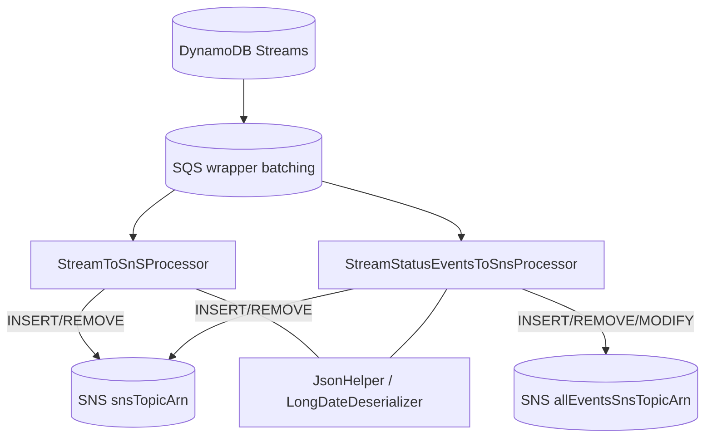
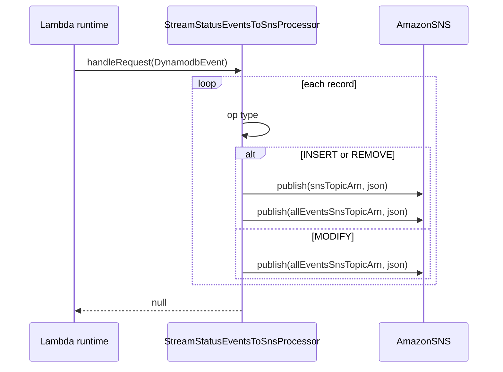

# Partner Integrator — pi-lambda-streamToSns — Current-State Design

**Module:** `partner-integrator / pi-lambda-streamToSns`
**Date:** 2026-06-30
**Status:** Current state (AWS SDK 1.x — upgrade NOT STARTED)
**Artifact:** `com.inttra.mercury:pi-lambda-streamToSns:1.0.0` (AWS Lambda, shaded JAR; **two handlers**)

---

## 1. Business Purpose & Rules

Two AWS Lambda functions packaged in one JAR that **fan out DynamoDB Streams to SNS topics**.

| Handler | Class | Behavior |
|---------|-------|----------|
| Generic relay | `com.inttra.mercury.pi.StreamToSnSProcessor` | Publish INSERT/REMOVE records to `snsTopicArn` (skip MODIFY). |
| Status events | `com.inttra.mercury.pi.StreamStatusEventsToSnsProcessor` | INSERT/REMOVE → both `snsTopicArn` + `allEventsSnsTopicArn`; MODIFY → `allEventsSnsTopicArn` only. |

Use cases: relay BL/SI/Booking state changes; broadcast container-event / shipment-status updates.

---

## 2. Design & Component Diagram

### Key classes

| Class | Role |
|-------|------|
| `StreamToSnSProcessor` (`RequestHandler<DynamodbEvent,DynamodbEvent>`) | Filter INSERT/REMOVE → publish to primary topic. |
| `StreamStatusEventsToSnsProcessor` (`RequestHandler<DynamodbEvent,DynamodbEvent>`) | Dual-topic publish with op-type rules. |
| `JsonHelper` | Jackson config + record serialization. |
| `LongDateDeserializer` | Unix-timestamp → Date. |

---

## 3. Data Flow

---

## 4. Data Stores & Integrations

| Resource | Usage |
|----------|-------|
| DynamoDB Streams (any table) | Triggered by INSERT/MODIFY/REMOVE. |
| SQS (wrapper) | Lambda event source (batching). |
| SNS (`snsTopicArn`, `allEventsSnsTopicArn`) | Publish records to subscribers. |

---

## 5. Maven Dependencies

| Artifact | Version | Notes |
|----------|---------|-------|
| **`com.amazonaws:aws-lambda-java-events`** | **`2.2.2`** | AWS v1 Lambda event POJOs. |
| `com.amazonaws:aws-lambda-java-core` | `1.2.0` | Lambda core. |
| **`com.amazonaws:aws-java-sdk-sns`** | **`1.12.715`** | **AWS v1 SNS client.** |
| **`com.amazonaws:aws-java-sdk-dynamodb`** | **`1.12.715`** | **AWS v1 DynamoDB (stream model).** |
| `com.fasterxml.jackson.core:jackson-databind` | `2.17.1` | Serialization. |

---

## 6. Configuration & Deployment

- **Configuration** — env vars only: `snsTopicArn`, `allEventsSnsTopicArn`.
- **Deployment** — `mvn -pl pi-lambda-streamToSns -am clean package`. Two Lambda functions (same JAR, different
  handler strings): `...StreamToSnSProcessor::handleRequest`, `...StreamStatusEventsToSnsProcessor::handleRequest`.
  Event source: DynamoDB Streams via SQS wrapper.

---

## 7. AWS Services & SDK 1.x Usage (CALL-OUT)

| AWS service | SDK | v1 classes |
|-------------|-----|-----------|
| **SNS** | v1 (direct) | `AmazonSNS`, `AmazonSNSClientBuilder.defaultClient()`, `PublishRequest` |
| **DynamoDB Streams** | v1 | `DynamodbEvent`, `OperationType` |
| **Lambda runtime** | v1 | `RequestHandler`, `Context` |

---

## 8. AWS 2.x / cloud-sdk Upgrade Plan (High Level)

| Step | Action | Reference |
|------|--------|-----------|
| 1 | Replace AWS v1 SNS (`AmazonSNS`/`PublishRequest`) with cloud-sdk `NotificationService`/`SnsService` or AWS v2 `SnsClient`; preserve message body bytes per topic. | booking, network |
| 2 | Replace AWS v1 `DynamodbEvent`/`OperationType` with v2 Lambda event POJOs; keep op-type filtering identical. | booking lambdas |
| 3 | Upgrade Lambda runtime off `java8`. | — |
| 4 | **Tests** — unit tests asserting per-op-type topic routing (INSERT/REMOVE/MODIFY) with mocked SNS; full JaCoCo coverage. | booking |

**Call-out:** The published record JSON and the dual-topic routing rules are a **contract** for all downstream
subscribers — they must remain byte/shape-identical after the upgrade.
