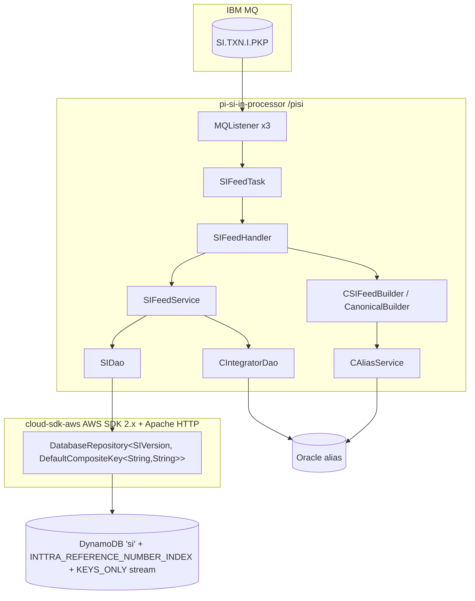

# Partner Integrator — pi-si-in-processor — AWS SDK 2.x (cloud-sdk) Upgrade Design

**Module:** `partner-integrator/pi-si-in-processor`
**Date:** 2026-06-30
**Status:** Target design (AWS 1.x → AWS 2.x via cloud-sdk) — **NOT STARTED**
**Companion:** `2026-06-30-partner-integrator-pi-si-in-processor-current-state-DESIGN-claude.md`
**Reference upgrades:** `booking` (S3 + DynamoDB, complete), `visibility` (S3 + DynamoDB + SNS/SQS), `network`/`registration` (DynamoDB DAO patterns)

---

## 1. Change Overview

Replace all AWS SDK v1 (`com.amazonaws.*`) usage with the in-house **cloud-sdk** (`cloud-sdk-api` + `cloud-sdk-aws`,
AWS SDK 2.x Enhanced Client + Apache HTTP under the hood). For this module there is **exactly one** AWS service in
scope: **DynamoDB**.

| AWS service | Current (v1) | Target (cloud-sdk / v2) |
|-------------|--------------|--------------------------|
| **DynamoDB** | `AmazonDynamoDB` + `DynamoDBMapper`/`DynamoDBMapperConfig` (via `pi-commons` `DynamoSupport`); v1 ORM entity `SIVersion` (`dynamo-client` `DynamoDBCrudRepository`) | `DatabaseRepository<SIVersion, DefaultCompositeKey<String,String>>` + Enhanced-client annotations + `DefaultQuerySpec` (via `DynamoRepositoryFactory`) |

> **Correction vs the Copilot pair.** The Copilot current-state and aws2x docs list **SNS** ("downstream publish via
> `AmazonSNS` → `EventPublisher`") and an **S3** "optional original-SI archive" (`AmazonS3` → `StorageClient`), and a
> `si_versions` table. **None of these exist in `pi-si-in-processor`.** A repo-wide grep finds no `AmazonSNS`,
> `AmazonS3`, `S3WorkspaceService`, SQS, or Kinesis usage; the real table is **`si`** (not `si_versions`); downstream
> propagation is via the DynamoDB **KEYS_ONLY stream**. This design therefore scopes to DynamoDB only. If a future SNS
> publish is genuinely required it must be added as a separate feature, not folded into the SDK upgrade.

**Out of scope (unchanged):** IBM MQ (`MQConfig`/`AbstractMQListener`), Oracle (`Jdbi`, `CIntegratorDao`,
`CAliasDao` + alias resolution), the SI transform (`CSIFeedBuilder`/`CanonicalBuilder`), the network-service REST
clients, and Parameter Store (`${awsps:}`, still resolved by commons).

**Backward-compatibility is mandatory.** The following must remain wire-identical so existing `si` items stay
readable and the downstream stream consumers keep parsing:

- DynamoDB table **`si`** and GSI **`INTTRA_REFERENCE_NUMBER_INDEX`** (hash `siInttraReferenceNumber`); the per-env
  prefix scheme (`{environment}_si`, incl. **CVT `inttra2_test_si`**).
- Key schema: partition key attribute **`id`** (S), sort key attribute **`sequenceNumber`** (S) with the
  `m_{millis}_{state}` value produced in the `SIVersion` constructor.
- Attribute encodings: `message` via `CompressionConverter` (**ISO-8859-1**, GZip+Base64 only above 300 KB, `COMPRESSED|`
  marker) stored as **string (S)**; `expiresOn` via `DateToEpochSecond` stored as **epoch-seconds number (N)**;
  `enrichedAttributes` as **map (M)**; all id/ref/party/reference/contract fields as **strings (S)**.
- The **`@DynamoDBStream(KEYS_ONLY)`** stream on `si` — its view type and key shape are the contract for
  `pi-si-out-processor` / stream-to-SNS consumers.
- **Decoupling rule:** the DynamoDB on-wire attribute format (converter output) is independent of the JAXB/XML `message`
  payload and the JSON exposure of `SIVersion`. The `AttributeConverter` governs only the DynamoDB string; keep it from
  leaking into the marshalled `ExportSIPartInt` XML or the entity's JSON view (`@JsonIgnore` on the key getters).

> **Cross-module note.** `SIVersion` and both converters live in the **`shipping-instruction`** artifact, not in this
> module. The DynamoDB migration is therefore driven by the `shipping-instruction` pin; `pi-si-in-processor` only
> consumes it, plus rewrites `SIDao` + the injector wiring.

---

## 2. Maven Dependency Changes

```diff
  <properties>
    <maven.compiler.release>17</maven.compiler.release>
+   <mercury.commons.version>1.0.26-SNAPSHOT</mercury.commons.version>
  </properties>

  <dependencies>
    <dependency>
      <groupId>com.inttra.mercury</groupId>
      <artifactId>shipping-instruction</artifactId>
-     <version>1.0.M</version>
+     <version>{aligned-cloud-sdk-line}</version>   <!-- version whose SIVersion uses enhanced-client annotations -->
    </dependency>
    <dependency>
      <groupId>com.inttra.mercury</groupId>
      <artifactId>pi-commons</artifactId>
-     <version>1.0</version>
+     <version>${mercury.commons.version}</version>  <!-- cloud-sdk-bearing pi-commons -->
      <scope>compile</scope>
    </dependency>

+   <!-- DynamoDB Local integration-test framework -->
+   <dependency>
+     <groupId>com.inttra.mercury</groupId>
+     <artifactId>dynamo-integration-test</artifactId>
+     <version>${mercury.commons.version}</version>
+     <scope>test</scope>
+   </dependency>
+   <!-- AWS SDK v1 DynamoDB kept ONLY for DynamoDB Local in tests (matches booking) -->
+   <dependency>
+     <groupId>com.amazonaws</groupId>
+     <artifactId>aws-java-sdk-dynamodb</artifactId>
+     <scope>test</scope>
+   </dependency>
  </dependencies>
```

- **Removed (prod):** the transitive `com.amazonaws:aws-java-sdk-dynamodb` that arrives via `pi-commons` +
  `shipping-instruction`. After the aligned pins, **no `com.amazonaws` on the prod classpath.**
- `pi-commons` must first expose the cloud-sdk repo/config types (`DatabaseRepository`, `DynamoRepositoryFactory`,
  `BaseDynamoDbConfig`) that today it wraps as v1 (`DynamoSupport`). This is the gating dependency (Copilot correctly
  flagged "depends on `pi-commons` upgrade").
- cloud-sdk uses **Apache HTTP** (no Netty), matching the booking/visibility rebase.
- The `si-model-s3-repo-url` release repo + `aws-maven` extension and the `maven-dependency-plugin` purge/get of
  `shipping-instruction` are unchanged (only the fetched version bumps).

---

## 3. Configuration Changes (`conf/<env>/config.yaml`)

The `dynamoDbConfig` block keeps its keys and adds the cloud-sdk `BaseDynamoDbConfig` fields (`region`; optional
local-emulator `regionEndpoint`/`signingRegion`). The `environment` prefixes — **including CVT's `inttra2_test`** — and
capacities stay unchanged. MQ, Oracle `database`, `serviceDefinitions`, `listenerThreads`, and `usePassThrough` are
untouched.

```diff
  dynamoDbConfig:
    readCapacityUnits: 100       # 25 in INT/QA, 100 in CVT/PROD — unchanged
    writeCapacityUnits: 100
    environment: inttra2_test    # CVT stays inttra2_test; INT inttra_int; QA inttra2_qa; PROD inttra2_prod
    sseEnabled: false
+   region: us-east-1
+   # local Dynamo emulator only:
+   #regionEndpoint: http://localhost:8000
+   #signingRegion: us-west-2
```

**Config class change** — `SIApplicationConfig.dynamoDbConfig` field type moves from
`com.inttra.mercury.dynamo.respository.module.DynamoDbConfig` to the cloud-sdk
`com.inttra.mercury.cloudsdk.database.config.BaseDynamoDbConfig` (keep `@Valid @NotNull`, as in `BookingConfig`):

```diff
- import com.inttra.mercury.dynamo.respository.module.DynamoDbConfig;
+ import com.inttra.mercury.cloudsdk.database.config.BaseDynamoDbConfig;
  @Data
  @EqualsAndHashCode(callSuper = false)
  public class SIApplicationConfig extends ApplicationConfiguration {
    @JsonProperty @NotNull private MQConfig mqPickupConfig;
    @Valid @NotNull @JsonProperty private DataSourceFactory database = new DataSourceFactory();
-   @Valid @NotNull private DynamoDbConfig dynamoDbConfig;
+   @Valid @NotNull private BaseDynamoDbConfig dynamoDbConfig;
    @JsonProperty @NotNull private boolean usePassThrough;
    @JsonProperty @NotNull private int listenerThreads;
  }
```

---

## 4. Per-Service Spec

### 4.1 DynamoDB — `SIVersion` (in `shipping-instruction`) + `SIDao`

**Entity before (v1 ORM, abridged):**
```java
@DynamoDBTable(tableName = "si")
@DynamoDBStream(StreamViewType.KEYS_ONLY)
public class SIVersion implements Expires, DynamoHashAndSortKey<String, String> {
  public static final String INTTRA_REFERENCE_NUMBER_INDEX = "INTTRA_REFERENCE_NUMBER_INDEX";

  public SIVersion(String id, String state, Date expiresOn) {
    this.id = id;
    this.sequenceNumber = String.format("m_%d_%s", System.currentTimeMillis(), state);  // auto sort key
    setExpiresOn(expiresOn);
  }
  @JsonIgnore @DynamoDBHashKey  @DynamoDBAttribute("id")             public String getHashKey() {...}
  @JsonIgnore @DynamoDBRangeKey @DynamoDBAutoGeneratedKey @DynamoDBAttribute("sequenceNumber") public String getSortKey() {...}
  @DynamoDBAttribute @DynamoDBIndexHashKey(globalSecondaryIndexName=INTTRA_REFERENCE_NUMBER_INDEX) private String siInttraReferenceNumber;
  @DynamoDBAttribute @DynamoDBTypeConverted(converter=CompressionConverter.class) private String message;
  @DynamoDBAttribute @DynamoDBTypeConverted(converter=DateToEpochSecond.class)   private Date expiresOn;
  @DynamoDBAttribute private EnrichedAttributes enrichedAttributes;   // + carrierId/requestorId/shipperId/bookingNumber/blNumber/contract
}
```

**Entity after (Enhanced client, abridged — cloud-sdk `@Table`/enhanced key annotations on getters):**
```java
@DynamoDbBean
@Table(name = "si")                     // com.inttra.mercury.cloudsdk.database.annotation.Table
public class SIVersion implements Expires {
  public static final String INTTRA_REFERENCE_NUMBER_INDEX = "INTTRA_REFERENCE_NUMBER_INDEX";

  public SIVersion(String id, String state, Date expiresOn) {         // constructor still sets the sort key
    this.id = id;
    this.sequenceNumber = String.format("m_%d_%s", System.currentTimeMillis(), state);
    setExpiresOn(expiresOn);
  }
  @DynamoDbPartitionKey @DynamoDbAttribute("id")             public String getId() {...}
  @DynamoDbSortKey      @DynamoDbAttribute("sequenceNumber") public String getSequenceNumber() {...}

  @DynamoDbSecondaryPartitionKey(indexNames = INTTRA_REFERENCE_NUMBER_INDEX)
  @DynamoDbAttribute("siInttraReferenceNumber") public String getSiInttraReferenceNumber() {...}

  @DynamoDbConvertedBy(CompressionAttributeConverter.class)  // ISO-8859-1 / COMPRESSED| — wire-identical (S)
  @DynamoDbAttribute("message") public String getMessage() {...}

  @DynamoDbConvertedBy(DateToEpochSecondAttributeConverter.class)  // epoch-seconds — wire-identical (N)
  @DynamoDbAttribute("expiresOn") public Date getExpiresOn() {...}
}
```

- **`@DynamoDBAutoGeneratedKey` on the sort key has no enhanced-client equivalent** — but the value is already produced
  by the `SIVersion` constructor (`m_{millis}_{state}`), so drop the annotation and rely on the constructor. Verify no
  write path constructs `SIVersion` without going through it.
- **Stream** — the `@DynamoDbBean` cannot declare the stream; it is a table property. Preserve `KEYS_ONLY` at
  table-provisioning time (the `si` table is provisioned externally / shared with `pi-si-out-processor`).

**Converters** (re-implement as `software.amazon.awssdk.enhanced.dynamodb.AttributeConverter`, preserving exact
encoding — reuse cloud-sdk's `DateToEpochSecond` equivalent if its epoch-**seconds** semantics match; the booking
`DateToEpochSecond` is a candidate):

| v1 converter | v2 replacement | On-wire encoding (unchanged) |
|---|---|---|
| `CompressionConverter` (`String`↔`String`) | `CompressionAttributeConverter` (`AttributeValue` **S**) | raw ISO-8859-1 string when ≤ 300 KB; else `COMPRESSED|` + Base64(GZip(bytes)) |
| `DateToEpochSecond` (`Date`↔`Long`) | `DateToEpochSecondAttributeConverter` (`AttributeValue` **N**) | `date.getTime()/1000` epoch **seconds** |

> **Gap call-out.** The v1 `CompressionConverter` returns a `String` and DynamoDB stores it as `S`; ensure the v2
> `AttributeConverter` targets `AttributeType.S` (not `B`) so existing items round-trip. Likewise `DateToEpochSecond`
> must emit `N` (`AttributeValue.builder().n(...)`), not `S`.

**DAO before/after** (`SIDao`):
```java
// BEFORE — extends DynamoDBCrudRepository<SIVersion, DynamoHashAndSortKey<String,String>>
public List<SIVersion> findByInttraReferenceNumber(String ref) {
  List<SIVersion> details = query(SIVersion.INTTRA_REFERENCE_NUMBER_INDEX, ref, null,
      "siInttraReferenceNumber = :hashKeyValue");
  return findBySIs(details.stream().map(SIVersion::getId).collect(toSet()));
}
public List<SIVersion> findBySIId(String id) { return query(id, "id = :hashKeyValue"); }

// AFTER — injected DatabaseRepository<SIVersion, DefaultCompositeKey<String,String>> + DefaultQuerySpec
public List<SIVersion> findByInttraReferenceNumber(String ref) {
  DefaultQuerySpec q = DefaultQuerySpec.builder()
      .indexName(SIVersion.INTTRA_REFERENCE_NUMBER_INDEX)
      .partitionKeyValue(CloudAttributeValue.ofString(ref))
      .consistentRead(false)                       // GSI query is eventually consistent
      .build();
  Set<String> ids = repository.query(q).stream().map(SIVersion::getId).collect(toSet());
  return findBySIs(ids);                           // keep the N+1 per-id follow-up
}
public List<SIVersion> findBySIId(String id) {
  return repository.query(DefaultQuerySpec.builder()
      .partitionKeyValue(CloudAttributeValue.ofString(id)).build());  // all versions for that id
}
```

- `save(SIVersion)` → `repository.save(siVersion)` (Enhanced `PutItem`; the constructor-set `sequenceNumber` is the sort
  key, so each save still appends a version). `findBySIs` keeps flat-mapping `findBySIId` per id.
- The GSI query → collect-ids → per-id base-table query (**N+1**) must be preserved behaviourally; it is the only read
  path and feeds `SI_REPLACE` id-reuse.

---

## 5. Guice Wiring Changes (`SIApplicationInjector`)

```diff
  public void configure() {
    bind(Listener.class).to(MQListener.class);
    bind(MQConfig.class).toInstance(siPIApplicationConfig.getMqPickupConfig());
    Jdbi jdbi = new JdbiFactory().build(environment, siPIApplicationConfig.getDatabase(), "oracle");
    bind(Jdbi.class).toInstance(jdbi);

-   AmazonDynamoDB client = DynamoSupport.newClient(siPIApplicationConfig.getDynamoDbConfig());
-   bind(AmazonDynamoDB.class).toInstance(client);
-   DynamoDBMapperConfig mapperConfig = DynamoSupport.newDynamoDBMapperConfig(siPIApplicationConfig.getDynamoDbConfig());
-   bind(DynamoDBMapperConfig.class).toInstance(mapperConfig);
-   DynamoDBMapper mapper = DynamoSupport.newMapper(client, siPIApplicationConfig.getDynamoDbConfig(), mapperConfig);
-   bind(DynamoDBMapper.class).toInstance(mapper);
    // (ServiceDefinition + Geography/RefData/Participant/Alias cached impls — unchanged)
  }

+ @Provides @Singleton
+ DatabaseRepository<SIVersion, DefaultCompositeKey<String,String>> provideSiRepo(SIApplicationConfig c) {
+   BaseDynamoDbConfig cfg = c.getDynamoDbConfig();
+   String tableName = cfg.getEnvironment() + "_" + SIVersion.class.getAnnotation(Table.class).name();  // {env}_si
+   return DynamoRepositoryFactory.createEnhancedRepository(
+       cfg.toClientConfig(), tableName, SIVersion.class,
+       DynamoRepositoryConfig.builder().domainType(SIVersion.class).build());
+ }
```

- `SIDao` constructor changes from `(DynamoDBMapper, DynamoDBMapperConfig)` to
  `(DatabaseRepository<SIVersion, DefaultCompositeKey<String,String>>)`.
- The **`{environment}_` table-prefix** logic that `pi-commons` `DynamoSupport` performed via `TableNameOverride` must
  be reproduced when building the repository's table name (as above) — cloud-sdk does not read the v1
  `DynamoDBMapperConfig`.
- MQ (`Listener`/`MQConfig`, `@Provides List<Listener>`), Oracle `Jdbi`, `ServiceDefinition`, and network-service
  bindings are untouched.

---

## 6. Target Component Diagram



## 7. Target Data Flow — SI inbound (after)

```mermaid
sequenceDiagram
  participant H as SIFeedHandler
  participant FS as SIFeedService
  participant DAO as SIDao
  participant REPO as DatabaseRepository (cloud-sdk)
  participant DDB as DynamoDB 'si'

  H->>H: unmarshal ValidateSI + Oracle supplement + alias resolve + build ExportSIPartInt
  alt SI_REPLACE
    H->>FS: findByInttraReferenceNumber(ref)
    FS->>DAO: query GSI then per-id (N+1)
    DAO->>REPO: query(DefaultQuerySpec)
  end
  H->>H: new SIVersion(id, state, now+400d); seq=m_{ts}_{state}; setMessage(xml)
  H->>FS: save(siVersion)
  FS->>DAO: save(siVersion)
  DAO->>REPO: save(entity)  (Enhanced PutItem) → KEYS_ONLY stream fires
```

---

## 8. Key Classes Changed

| Class | Change |
|-------|--------|
| `pom.xml` | align `shipping-instruction` + `pi-commons` to the cloud-sdk line; add `dynamo-integration-test` + test-scoped `aws-java-sdk-dynamodb`; drop the transitive prod `com.amazonaws`. |
| `SIApplicationConfig` | `dynamoDbConfig` type `DynamoDbConfig` → `BaseDynamoDbConfig` (add `region` in yaml). |
| `SIApplicationInjector` | drop `AmazonDynamoDB`/`DynamoDBMapper`/`DynamoDBMapperConfig` bindings; add a `@Provides` cloud-sdk `DatabaseRepository`; keep MQ/Jdbi/ServiceDefinition/network bindings. |
| `SIVersion` (**in `shipping-instruction`**) | v1 ORM → `@DynamoDbBean`/`@Table("si")` + enhanced key/GSI annotations on getters; drop `@DynamoDBAutoGeneratedKey`; keep constructor-set `sequenceNumber`; preserve KEYS_ONLY stream at table level. |
| `CompressionConverter`, `DateToEpochSecond` (**in `shipping-instruction`**) | re-implement as `AttributeConverter` (S and N respectively); preserve ISO-8859-1 / 300 KB / `COMPRESSED|` and epoch-seconds. |
| `SIDao` | `extends DynamoDBCrudRepository` → injected `DatabaseRepository`; `query(...)` → `DefaultQuerySpec`; keep GSI + N+1 follow-up. |
| `SIFeedService` | unchanged public API (`save`, `findByInttraReferenceNumber`) — only `SIDao`'s internals change. |
| **MQ / Oracle / alias / transform classes** | **unchanged** (`MQListener`, `SIFeedTask`, `SIFeedHandler`, `CIntegratorDao`, `CAliasDao`, `CAliasService`, `CSIFeedBuilder`, `CanonicalBuilder`). |

---

## 9. Testing Strategy

- **DynamoDB-Local IT** (`dynamo-integration-test` `BaseDynamoDbIT`, `@Tag("integration")`) for `SIDao`:
  - `save` → composite-key round-trip (`id` partition + `m_{ts}_{state}` sort); appending a second version under the
    same `id`.
  - `findByInttraReferenceNumber`: GSI query on `INTTRA_REFERENCE_NUMBER_INDEX` + per-id follow-up (N+1) returns all
    versions; `SI_REPLACE` id-reuse resolves to the existing `id`.
  - **Converter fidelity**: write via the v1 mapper, read via the enhanced client (and vice-versa) — assert the
    `message` compression boundary (just below and above 300 KB, ISO-8859-1, `COMPRESSED|` marker) and `expiresOn`
    epoch-**seconds** are byte-identical.
- **Handler/transform unit tests** (`SIFeedHandlerTest`, `CanonicalBuilderTest`, `CSIFeedBuilderTest`) — reuse as-is;
  only the `SIDao` mock type changes.
- **No SNS/S3 tests** — none are used; do not add them.
- Keep MQ (`MQListenerTest`, `SIFeedTaskTest`), Oracle (`CIntegratorDaoTest`), and alias (`CAliasDaoTest`,
  `NEntityTypeTest`, `NAliasTypeTest`) behaviour and tests unchanged.
- Certify **full local JaCoCo coverage** on changed code (note `**/config/**` is Sonar-excluded, so `SIDao` + the
  migrated converters carry the coverage weight):
  ```
  mvn -f partner-integrator/pi-si-in-processor/pom.xml clean verify
  ```

---

## 10. Risks & Call-outs

- **Cross-module coupling** — the entity + both converters live in `shipping-instruction`; the DynamoDB migration is
  really a `shipping-instruction` change consumed here. Sequence it with every other consumer of `SIVersion`
  (`pi-si-out-processor`, stream-to-SNS lambdas) and bump the pin only when that artifact ships the enhanced-client
  annotations.
- **KEYS_ONLY stream is the downstream contract.** No SNS/SQS/S3 exists in this module (the Copilot doc's claims are
  wrong). Preserve the `si` stream view type and key schema; do not add a notification client during the upgrade.
- **Composite auto-gen sort key** — `sequenceNumber = m_{millis}_{state}` is set in the constructor, not by an
  enhanced-client generator; confirm all write paths go through the constructor before dropping
  `@DynamoDBAutoGeneratedKey`.
- **Converter type fidelity** — `CompressionConverter` must stay `S` (ISO-8859-1, 300 KB threshold, `COMPRESSED|`);
  `DateToEpochSecond` must stay `N` (epoch seconds). A wrong target `AttributeType` breaks reads of existing items.
- **Table-prefix reproduction** — the `{environment}_` prefix formerly applied by `DynamoSupport` `TableNameOverride`
  must be rebuilt when constructing the cloud-sdk repository's table name; **CVT is `inttra2_test_si`**, not
  `inttra2_cvt_si`.
- **`pi-commons` gating dependency** — this upgrade cannot land until `pi-commons` exposes the cloud-sdk repo/config
  types (today it only offers the v1 `DynamoSupport`).
- **cloud-sdk client knobs** — the v1 client used `AmazonDynamoDBClientBuilder.standard().build()` (default region
  chain, no explicit retry/timeout). Confirm the cloud-sdk factory's defaults are acceptable; flag any missing knob as
  a cloud-sdk gap (same pattern as the booking/visibility upgrades).
- **Sequencing / workflow** — migrate in incremental, test-verified steps; one outgoing commit per the team workflow,
  and every commit message must carry the Jira ticket prefix (e.g. `ION-xxxxx …`).
