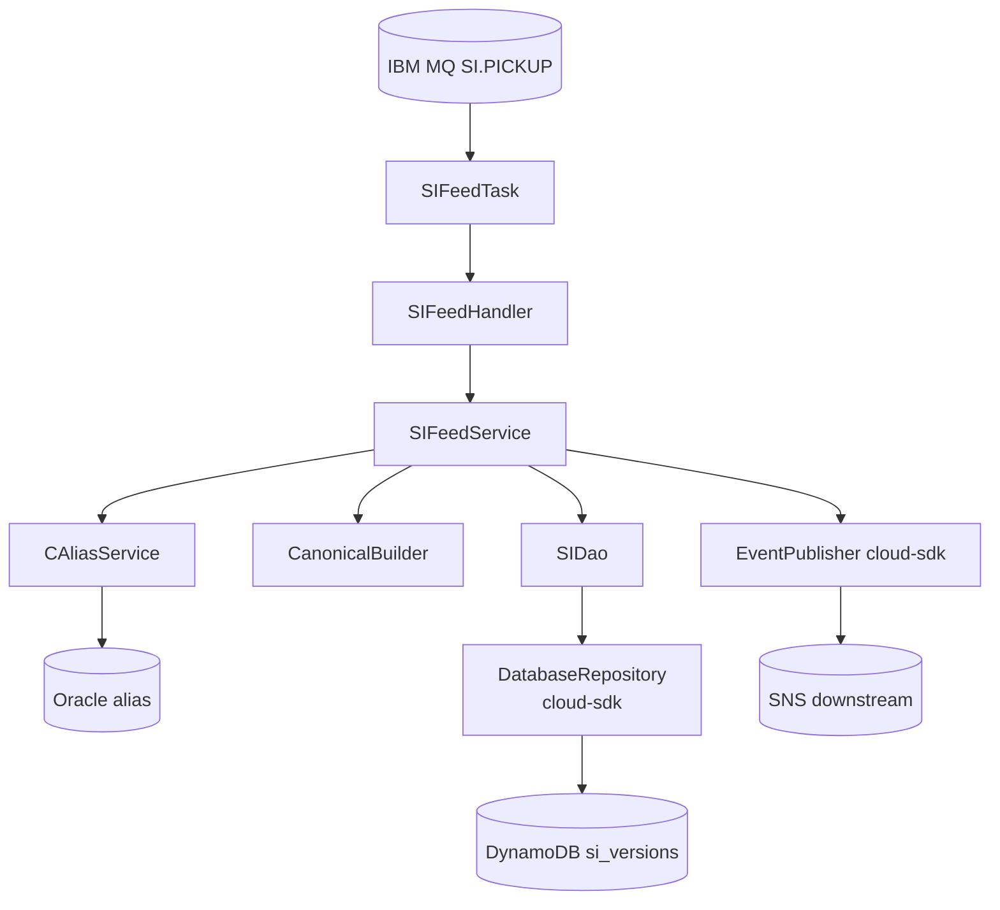
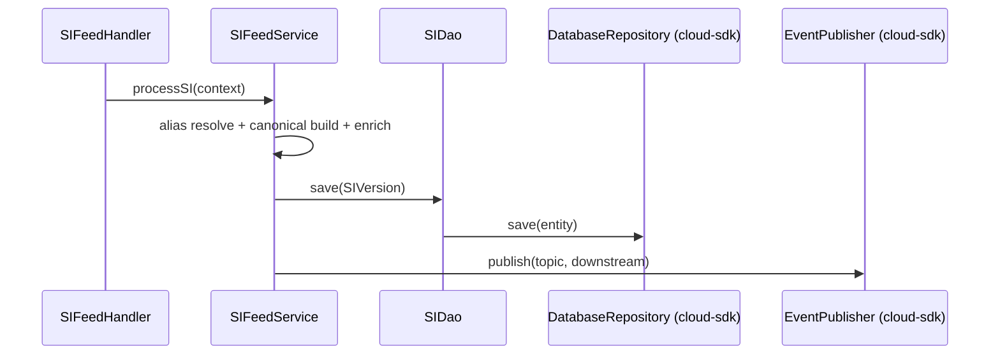

# Partner Integrator — pi-si-in-processor — AWS SDK 2.x (cloud-sdk) Upgrade Design

**Module:** `partner-integrator / pi-si-in-processor`
**Date:** 2026-06-30
**Status:** Target design — NOT STARTED (depends on `pi-commons` upgrade)
**Companion:** `2026-06-30-partner-integrator-pi-si-in-processor-current-state-DESIGN-copilot.md`
**Playbook:** `partner-integrator/docs/2026-06-30-partner-integrator-aws2x-DESIGN-copilot.md`

---

## 1. Change Overview

SI inbound processor. AWS scope (via `pi-commons`): **DynamoDB** (`si_versions`), **S3** (workspace), **SNS**
(downstream). IBM MQ, Oracle (incl. alias tables), network REST out of scope.

| AWS service | Current (v1) | Target |
|-------------|--------------|--------|
| **DynamoDB** | `DynamoDBMapper` (`SIDao`/`SIVersion`) | `DatabaseRepository<SIVersion, DefaultCompositeKey<String,String>>` |
| **S3** | `AmazonS3` | `StorageClient` |
| **SNS** | `AmazonSNS` | `EventPublisher` |

---

## 2. Maven Dependency Changes

```diff
- <dependency><groupId>com.inttra.mercury</groupId><artifactId>shipping-instruction</artifactId><version>1.0.M</version></dependency>
+ <dependency><groupId>com.inttra.mercury</groupId><artifactId>shipping-instruction</artifactId><version>{aligned}</version></dependency>
  <dependency><groupId>com.inttra.mercury</groupId><artifactId>pi-commons</artifactId><version>1.0</version></dependency>
+ <dependency><groupId>com.inttra.mercury</groupId><artifactId>dynamo-integration-test</artifactId><version>${mercury.commons.version}</version><scope>test</scope></dependency>
+ <dependency><groupId>com.amazonaws</groupId><artifactId>aws-java-sdk-dynamodb</artifactId><scope>test</scope></dependency>
```

## 3. Configuration Changes (`conf/<env>/config.yaml`)

```diff
  dynamoDbConfig:
    tableName: si_versions
    region: us-east-1
+   sseEnabled: false
  # mqPickupConfig / database(Oracle) — unchanged
```

## 4. Per-Service Spec

- **DynamoDB:** `SIVersion` → enhanced annotations (`id` partition, `sequenceNumber` sort); `SIDao` uses
  `DatabaseRepository.save/findById(DefaultCompositeKey)`.
- **S3:** `StorageClient` for optional original-SI archive.
- **SNS:** `EventPublisher.publish` to SI out-processor/visibility/warehouse.
- Alias resolution (`CAliasService`/Oracle) and `CanonicalBuilder` logic unchanged.

## 5. Guice Wiring Changes

```diff
- SIApplicationInjector: bind AmazonDynamoDB / DataSource / SIDao / CAliasService
+ SIApplicationInjector: DatabaseRepository<SIVersion,..> (factory) + StorageClient + EventPublisher (pi-commons); Oracle DataSource unchanged
```

## 6. Target Component Diagram



## 7. Target Sequence — SI inbound (after)



## 8. Key Classes Changed

| Class | Change |
|-------|--------|
| `pom.xml` | align `shipping-instruction`; add test deps. |
| `SIApplicationConfig` | `dynamoDbConfig` → `BaseDynamoDbConfig`. |
| `SIApplicationInjector` | v1 bindings → cloud-sdk repo/storage/notification. |
| `SIVersion` | v1 ORM → enhanced annotations. |
| `SIDao` | mapper → `DatabaseRepository`. |
| `SIFeedService` | S3/SNS via cloud-sdk clients. |

## 9. Testing Strategy

- **DynamoDB-Local IT** for `SIDao` (composite key); **SNS** unit tests mocking `EventPublisher`; **S3** round-trip.
- Keep MQ/Oracle/alias behavior unchanged. Full local **JaCoCo** coverage on changed code.

## 10. Risks & Call-outs

- Keep `si_versions` stream shape stable for `pi-si-out-processor` + stream-to-SNS.
- Alias resolution (Oracle) + IBM MQ out of AWS-SDK scope.
