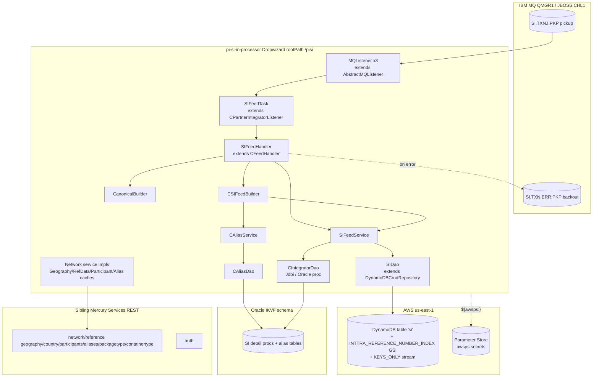

# Partner Integrator — pi-si-in-processor — Current-State Design

**Module:** `partner-integrator/pi-si-in-processor`
**Date:** 2026-06-30
**Status:** Current state — AWS SDK **1.x** (`com.amazonaws`) in production (DynamoDB only); cloud-sdk migration **NOT STARTED**
**Artifact:** `com.inttra.mercury:pi-si-in-processor:1.0` (Dropwizard 4 / Jetty 12, single shaded JAR `pi-si-in-processor-1.0.jar`)
**Main class:** `com.inttra.mercury.sifeed.SIPIApplication`

---

## 1. Business Purpose & Rules

`pi-si-in-processor` is the **inbound Shipping Instruction (SI)** partner-integration processor. It is *not* a REST
service — although Dropwizard exposes `rootPath: /pisi` (a temporary placeholder "untill entitlement is added"), the
module has **no resources**. Its real entry point is an **IBM MQ listener** that consumes harmonised SI messages,
supplements them from the Oracle integration schema, transforms them into the canonical **INTTRA visibility export SI
format**, and persists a versioned record to **DynamoDB table `si`**. A DynamoDB **KEYS_ONLY stream** on that table is
the downstream hand-off (consumed outside this module — e.g. `pi-si-out-processor` / stream-to-SNS lambdas).

Core responsibilities:

- **Consume** — an `MQListener` (extends `pi-commons` `AbstractMQListener`) polls the SI pickup queue and hands each
  message body to `SIFeedTask.processMessage` → `SIFeedHandler.processMessage`.
- **Unmarshal** — the MQ payload is JAXB-unmarshalled to `ValidateSI` (harmonised SI schema, package
  `com.inttra.mercury.common.schema.sivalidate.v1`).
- **Supplement** — `SIFeedService.getSIDetails` calls the Oracle stored procedure
  `IKVF.PKG_GET_SI_DETAILS.PRC_GET_SI_DATA_FEED_DETAILS` (12 REF CURSORs) to hydrate a `CSIBuilderVO` from the
  integration DB, keyed by the MQ **transaction id**.
- **Transform** — `CSIFeedBuilder.buildKewillXML(...)` + `CanonicalBuilder` map `ValidateSI` + `CSIBuilderVO` into the
  canonical `ExportSIPartInt` (INTTRA visibility export SI) object, resolving partner aliases along the way.
- **Persist** — `SIFeedHandler.buildSIWrapper` marshals `ExportSIPartInt` back to XML, wraps it in a `SIVersion`
  (from the `shipping-instruction` artifact), and `SIFeedService.save` writes it to DynamoDB `si` via `SIDao`.
- **Version continuity** — on an `SI_REPLACE` transaction the handler looks up the existing SI by INTTRA reference
  (`findByInttraReferenceNumber`) and **reuses the same `id`** so replacements append a new sort-key version rather
  than creating a new logical SI.

### Key business rules

| Rule | Detail (source) |
|------|-----------------|
| Entry is MQ, not REST | `SIPIApplication.newServer()` registers only `LocalCacheModule` + `SIApplicationInjector`; a `postSetupHook` (`startListener`) builds a `ListenerManager` over the injected `List<Listener>`. No JAX-RS resource classes exist. |
| Listener fan-out | `SIApplicationInjector.bridgeListener` creates `listenerThreads` (**3** in every env) `MQListener` instances, each with its own `MQService(mqPickupConfig)` and the shared `SIFeedTask`. |
| Pickup / backout queues | `mqPickupConfig`: `queueName: SI.TXN.I.PKP`, `backoutQueue: SI.TXN.ERR.PKP`, `backoutThreshold: 3`, `channel JBOSS.CHL1`, `queueMgrName QMGR1`, `port 1424` (per-env host). |
| Payload contract | Body must JAXB-unmarshal to `ValidateSI` in package `com.inttra.mercury.common.schema.sivalidate.v1` (`SI_HARM_PACKAGE`); malformed payloads throw and are logged/backed-out. |
| Oracle supplement is mandatory | `getCSIBuilderVO` sets `sid = messageContext.getTransactionId()` and calls `getSIDetails`; a DB failure raises `EDataSupplementationException` ("data fecthing failed for transaction Id: …"). |
| Alias resolution | `CAliasService.getEntityId(alias, aliasTypes, ownerEntityId, entityType)` → `CAliasDao.getEntityIdByAlias`; `NEntityType` codes `User(1) / Organization(2) / Geography(32) / Carrier(48) / Charge(60)`, `NAliasType` supplies the alias-code set. A missing alias raises `EAliasNoDataFound`. |
| SI transaction state | `getSITransactionState` reads `…Properties.getSITransactionState()` (`CoreTransactionStateValues`); `SI_REPLACE` triggers id-reuse, otherwise `id = UUID.randomUUID()`. |
| INTTRA reference | `getSIInttraRef` scans `SITransactionIdentifiers` for `PITransactionIdentifierTypeValues.INTTRA_REFERENCE`; that value is stored as `siInttraReferenceNumber` (the GSI hash). |
| Party extraction | From `Details.Parties`, roles `CARRIER → carrierId`, `REQUESTOR → requestorId`, `SHIPPER → shipperId`. |
| Reference extraction | From `Details.References`, `BOOKING_NUMBER → bookingNumber`, `BILL_OF_LADING_NUMBER → blNumber`. |
| Enriched companies | `partiesWithAccess.partyIdentifier` where type `INTTRA_COMPANY_ID` → `EnrichedAttributes(companies)` on the `SIVersion`. |
| TTL / expiry | `calcExpiresOn()` = `now + 400 days`; stored as epoch-seconds (`DateToEpochSecond`) on the `expiresOn` attribute. |
| Alias-error tolerance | `EAliasNoDataFound` is caught and only logged (message dropped, not backed-out); any other exception is rethrown as `EException`, driving MQ backout. |

---

## 2. Design & Component Diagram

Layered, listener-driven Dropwizard app started through the shared `InttraServer<SIApplicationConfig>` builder. Two
module generators wire it: `LocalCacheModule` (network-service caching from `pi-commons`) and `SIApplicationInjector`
(the app's Guice module). The injector binds the IBM MQ plumbing, the Oracle `Jdbi`, the **AWS SDK v1 DynamoDB**
client/mapper (via `pi-commons` `DynamoSupport`), the `ServiceDefinition`s, and the cached network-service impls.



### Key classes & interactions

| Layer | Class | Responsibility |
|-------|-------|----------------|
| Bootstrap | `SIPIApplication` | Builds `InttraServer<SIApplicationConfig>`; module generators `LocalCacheModule` + `SIApplicationInjector`; `postSetupHook` starts the MQ `ListenerManager`. |
| Wiring | `SIApplicationInjector` (Guice `AbstractModule`) | `@Provides` the `List<Listener>` (N `MQListener`s); binds `Listener→MQListener`, `MQConfig`, Oracle `Jdbi`, **`AmazonDynamoDB`**, **`DynamoDBMapperConfig`**, **`DynamoDBMapper`**, per-name `ServiceDefinition`s, and the four cached network-service impls. |
| Config | `SIApplicationConfig extends ApplicationConfiguration` | `mqPickupConfig` (`MQConfig`), Oracle `database` (`DataSourceFactory`), `dynamoDbConfig` (`DynamoDbConfig` from `dynamo-client`), `usePassThrough` (bool), `listenerThreads` (int). |
| Listener | `MQListener extends AbstractMQListener` | `process(String content)` → `SIFeedTask.processMessage(content, null)`. |
| Listener | `SIFeedTask extends CPartnerIntegratorListener` | `process(msg, ctx)` delegates to `SIFeedHandler` as an `IFeedHandler`; base class supplies MQ ACK / backout semantics. |
| Handler | `SIFeedHandler extends CFeedHandler` | `processMessage`: unmarshal `ValidateSI`, build `CSIBuilderVO`, build `ExportSIPartInt`, wrap to `SIVersion`, attach contract, `save`. Party/reference/state/enrichment extraction. |
| Service | `SIFeedService` | `getSIDetails`/`getPckgDetails` (Oracle via `CIntegratorDao`), `save(SIVersion)` and `findByInttraReferenceNumber` (DynamoDB via `SIDao`). |
| Transform | `CSIFeedBuilder`, `CanonicalBuilder`, `CSIFeedUtil` | `ValidateSI` + `CSIBuilderVO` → canonical `ExportSIPartInt`; `CanonicalBuilder.buildContractAsString` produces the `contract` string. |
| Alias | `CAliasService` → `CAliasDao` | Resolve partner aliases (vessel/port/company/carrier/charge) to INTTRA entity ids from Oracle alias tables. `NEntityType` / `NAliasType` enums. |
| Persistence (Oracle) | `CIntegratorDao` | `Jdbi` `CallableStatement` to `IKVF.PKG_GET_SI_DETAILS.*` stored procs (`PRC_GET_SI_DATA_FEED_DETAILS`, `PRC_GET_SI_PKG_TYP_DETAILS`). |
| Persistence (DynamoDB) | `SIDao extends DynamoDBCrudRepository<SIVersion, DynamoHashAndSortKey<String,String>>` | `save`, `findBySIId(id)`, `findBySIs(Set<id>)`, `findByInttraReferenceNumber` (GSI query then per-id follow-up). |
| Model | `SIVersion` (`@DynamoDBTable("si")`, from `shipping-instruction`) | Composite-key entity, one GSI, `@DynamoDBStream(KEYS_ONLY)`, two converters. |
| Converters | `CompressionConverter`, `DateToEpochSecond` (in `shipping-instruction`) | `message` GZip+Base64 over threshold; `expiresOn` `Date`↔epoch-seconds. |

---

## 3. Data Flow

### 3.1 SI inbound (consume → transform → persist)

```mermaid
sequenceDiagram
  participant MQ as IBM MQ (SI.TXN.I.PKP)
  participant L as MQListener
  participant T as SIFeedTask
  participant H as SIFeedHandler
  participant FS as SIFeedService
  participant IDAO as CIntegratorDao (Oracle)
  participant FB as CSIFeedBuilder + CanonicalBuilder
  participant AL as CAliasService (Oracle alias)
  participant SDAO as SIDao
  participant DDB as DynamoDB 'si'

  MQ->>L: message body (harmonised SI XML)
  L->>T: processMessage(content, null)
  T->>H: process(msgContext) [IFeedHandler]
  H->>H: unmarshal ValidateSI (JAXB, sivalidate.v1)
  H->>FS: getSIDetails(CSIBuilderVO{sid=transactionId})
  FS->>IDAO: PRC_GET_SI_DATA_FEED_DETAILS (12 REF CURSORs)
  IDAO-->>FS: hydrated CSIBuilderVO
  H->>FB: buildKewillXML(header, validateSI, csiBuilderVO)
  FB->>AL: getEntityId(alias, aliasTypes, owner, NEntityType)
  AL-->>FB: INTTRA entity ids
  FB-->>H: ExportSIPartInt (canonical export SI)
  H->>H: state=getSITransactionState; SIIntraRef=getSIInttraRef
  alt state == SI_REPLACE
    H->>FS: findByInttraReferenceNumber(SIIntraRef)
    FS->>SDAO: query GSI INTTRA_REFERENCE_NUMBER_INDEX then per-id
    SDAO-->>H: existing SIVersion (reuse id)
  else
    H->>H: id = UUID.randomUUID()
  end
  H->>H: new SIVersion(id, state, expiresOn=now+400d)<br/>seq = m_{ts}_{state}; setMessage(marshalled XML)<br/>set carrier/requestor/shipper/booking/bl/enriched
  H->>H: contract = CanonicalBuilder.buildContractAsString(...)
  H->>FS: save(siVersion)
  FS->>SDAO: save(siVersion)
  SDAO->>DDB: PutItem (DynamoDBMapper) → KEYS_ONLY stream fires
  Note over T,MQ: success = ACK; unhandled exception = EException → MQ backout (threshold 3)<br/>EAliasNoDataFound = logged only (message dropped)
```

### 3.2 SI_REPLACE lookup (GSI read path)

```mermaid
sequenceDiagram
  participant H as SIFeedHandler
  participant SDAO as SIDao
  participant DDB as DynamoDB 'si'

  H->>SDAO: findByInttraReferenceNumber(inttraRef)
  SDAO->>DDB: query(INTTRA_REFERENCE_NUMBER_INDEX,<br/>"siInttraReferenceNumber = :hashKeyValue")
  DDB-->>SDAO: matching versions (projected)
  SDAO->>SDAO: collect distinct SIVersion.getId()
  loop per id
    SDAO->>DDB: query("id = :hashKeyValue")  (all versions of that SI)
  end
  SDAO-->>H: List<SIVersion>; handler takes findFirst().getId()
```

> `findByInttraReferenceNumber` is a two-hop read: a GSI query on `siInttraReferenceNumber` to collect the logical
> `id`s, then a base-table `id = :hashKeyValue` query per id (`findBySIId`) — an N+1 pattern that must be preserved.

---

## 4. Data Stores & Integrations

### DynamoDB — table `si` (entity `SIVersion`, from the `shipping-instruction` artifact)

- **Table name:** `@DynamoDBTable(tableName = "si")`. Effective name = `{environment}_si` — the `pi-commons`
  `DynamoSupport.newDynamoDBMapperConfig` applies a `TableNameOverride` prefix of `"{environment}_"`.
- **Hash key:** `id` (`@DynamoDBHashKey @DynamoDBAttribute("id")`; Java field `id`, exposed via `getHashKey`).
- **Range key:** `sequenceNumber` (`@DynamoDBRangeKey @DynamoDBAutoGeneratedKey @DynamoDBAttribute("sequenceNumber")`,
  via `getSortKey`). Value is **auto-generated in the `SIVersion` constructor**:
  `String.format("m_%d_%s", System.currentTimeMillis(), state)` → e.g. `m_1719763200000_SI_NEW`. Each SI transaction
  therefore appends a new versioned row under the same `id`.
- **GSI — `INTTRA_REFERENCE_NUMBER_INDEX`:** hash key `siInttraReferenceNumber` (S), no explicit range key. Used only
  by `findByInttraReferenceNumber`.
- **Stream:** `@DynamoDBStream(StreamViewType.KEYS_ONLY)` — the table publishes a **keys-only** change stream that is
  the downstream trigger (consumed *outside* this module: `pi-si-out-processor` / stream-to-SNS lambdas).
- **Attribute encodings:**
  - `message` — `@DynamoDBTypeConverted(CompressionConverter.class)`: stored raw when the ISO-8859-1 byte length
    ≤ 300 KB (`MAX_CONTRACT_SIZE = 1024*300`); above that, GZip-compressed → Base64 → prefixed `COMPRESSED|`. Read path
    reverses only when the `COMPRESSED|` prefix is present. **Charset is ISO-8859-1** (must be preserved exactly).
  - `expiresOn` — `@DynamoDBTypeConverted(DateToEpochSecond.class)`: `Date` ↔ `Long` epoch **seconds**
    (`getTime()/1000`); a plain number (N) attribute (used as the SI's 400-day retention marker; not wired as DynamoDB
    native TTL in this module).
  - `enrichedAttributes` — nested `EnrichedAttributes` (map, M).
  - `id`, `sequenceNumber`, `siInttraReferenceNumber`, `carrierId`, `requestorId`, `shipperId`, `bookingNumber`,
    `blNumber`, `contract` — plain strings (S). `id`/`sequenceNumber` also carry `@DynamoDBIgnore` on the raw fields;
    persistence is driven by the annotated `getHashKey`/`getSortKey` getters.
- **Capacity & per-env table names** (`dynamoDbConfig.environment` prefix):

  | Env | `environment` | RCU/WCU | Effective table |
  |-----|---------------|---------|-----------------|
  | INT | `inttra_int` | 25 / 25 | `inttra_int_si` |
  | QA | `inttra2_qa` | 25 / 25 | `inttra2_qa_si` |
  | **CVT** | **`inttra2_test`** | 100 / 100 | **`inttra2_test_si`** |
  | PROD | `inttra2_prod` | 100 / 100 | `inttra2_prod_si` |

  > **CVT prefix trap:** CVT uses `inttra2_test` (not `inttra2_cvt`), matching the visibility/CVT topology.

### Oracle (JDBI3 / `IKVF` schema)

- `database` (`DataSourceFactory`): Oracle thin driver, per-env host, pool `initialSize/minSize 5`, `maxSize 35`,
  `validationQuery "select 1 from dual"`. User/password from Parameter Store (`${awsps:…/pisi/oracleDB/user|password}`).
- `CIntegratorDao` calls stored procs: `IKVF.PKG_GET_SI_DETAILS.PRC_GET_SI_DATA_FEED_DETAILS` (12 out REF CURSORs for
  reefer/details/location/pay-term/company/package/container/vessel/clause/report) and
  `PRC_GET_SI_PKG_TYP_DETAILS`. `CAliasDao` resolves aliases from the same DB.

### IBM MQ

- `mqPickupConfig` (`MQConfig`): `SI.TXN.I.PKP` pickup, `SI.TXN.ERR.PKP` backout, `backoutThreshold 3`, channel
  `JBOSS.CHL1`, `QMGR1`, port `1424` (host per env). Consumed by `listenerThreads` (3) parallel `MQListener`s.

### External REST services (sibling Mercury services, via `pi-commons` cached clients)

`ServiceDefinition`s: `auth` (OAuth, `clientId` + `${awsps:…/authclientsecret}`), `geography`, `geography-alias`,
`alias`, `country`, `reference-data-packagetype`, `reference-data-containertype`, `participants-alias`,
`network-participant`, `network-participants`. Wired as cached impls: `GeographyServiceCacheImpl`,
`ReferenceDataServiceCacheImpl`, `NetworkParticipantServiceCacheImpl`, `ParticipantsAliasServiceCacheImpl`
(memoised via `LocalCacheModule`).

### S3 / SNS / SQS

**None.** A repo-wide grep of the module finds **zero** S3, SNS, SQS, or Kinesis client usage. The only AWS client
instantiated is DynamoDB (see §7). Downstream propagation happens purely through the **DynamoDB `si` KEYS_ONLY
stream**, which is consumed by other modules.

---

## 5. Maven Dependencies

| Artifact | Version | Notes |
|----------|---------|-------|
| `com.inttra.mercury:shipping-instruction` | `1.0.M` | SI domain model incl. `SIVersion` + its `CompressionConverter`/`DateToEpochSecond`. Pulled from an S3-hosted Maven repo (`si-model-s3-repo-url`); `maven-dependency-plugin` `purge-local-repository` + `get` force a fresh fetch at `initialize`. |
| `com.inttra.mercury:pi-commons` | `1.0` (`compile`) | `InttraServer`, `AbstractMQListener`/`MQService`/`ListenerManager`, `CFeedHandler`/`CPartnerIntegratorListener`, `DynamoSupport`, network-service cached impls, `${awsps:}` resolution. **Pulls AWS SDK v1 DynamoDB transitively.** |
| `io.dropwizard:dropwizard-jdbi3` | `5.0.1` (`compile`) | Oracle access via `Jdbi`. |
| `com.fasterxml.jackson.dataformat:jackson-dataformat-xml` | `2.19.2` | XML (un)marshalling around the canonical SI. |
| `io.swagger:swagger-annotations` | `1.5.15` | Model annotations (`@ApiModelProperty` on `SIVersion`); `swagger-jaxrs`/`swagger-jersey2-jaxrs` excluded. |
| `junit:junit` / `org.mockito:mockito-core` / `org.assertj:assertj-core` | `4.13.2` / `5.12.0` / `3.25.3` (`test`) | Unit tests. |
| Build | `maven-shade-plugin:3.5.1`, `maven-compiler-plugin:3.13.0` (release **17**), `maven-surefire-plugin:3.2.5`, `aws-maven:6.0.0` extension | Fat JAR (`finalName=pi-si-in-processor-1.0`), `ManifestResourceTransformer` main class `com.inttra.mercury.sifeed.SIPIApplication`; `aws-maven` extension serves the S3 model repo. |

> **AWS SDK is never declared directly.** DynamoDB v1 (`com.amazonaws.services.dynamodbv2.*`) arrives transitively via
> `pi-commons` (and `shipping-instruction`, whose `SIVersion`/converters use the v1 datamodeling annotations).
> `sonar.coverage.exclusions=**/config/**`.

---

## 6. Configuration & Deployment

### `conf/{int,qa,cvt,prod}/config.yaml`

- `server.rootPath: /pisi` (placeholder — no resources), app connector `8080`, admin `8081`.
- `mqPickupConfig` — host per env, `channel JBOSS.CHL1`, `port 1424`, `queueMgrName QMGR1`, `queueName SI.TXN.I.PKP`,
  `backoutQueue SI.TXN.ERR.PKP`, `backoutThreshold 3`.
- `listenerThreads: 3` (all envs).
- `database` — Oracle thin URL per env; `user`/`password` = `${awsps:…/pisi/oracleDB/*}`; pool 5/5/35.
- `dynamoDbConfig` — `readCapacityUnits`/`writeCapacityUnits` (25 INT/QA, 100 CVT/PROD), `environment` prefix
  (§4), `sseEnabled: false`. **No `region`/`regionEndpoint`/`signingRegion` set** → v1 default region provider chain.
- `securityResources` — `oauthTokenValidationUri` / `userInfoUri` / `userPrincipalUri` per env
  (`api(-alpha|-beta|-test).inttra.com`).
- `jerseyClient` — 32/128 threads, `timeout 2s`, `retries 2`, gzip on for responses.
- `serviceDefinitions` — the 10 network/auth endpoints (§4); `auth.clientSecret = ${awsps:…/authclientsecret}`.
- **Secrets** resolved by commons via AWS Parameter Store: `${awsps:/inttra{2}/<env>/mercuryservices/partner-integration/...}`.
- `usePassThrough` — boolean flag on the config (default `false`).

### Deployment

- `build.sh` → `mvn … package sonar:sonar -P mercury-commons,sonar -pl <module> --also-make`
  (`sonar.projectKey=mercury-services.partner-integrator-pi-si-in-processor`); renames the shaded JAR to
  `${RELEASE_NAME}.jar`, copies each `conf/<env>/config.yaml` to `config.yaml_<env>_conf`, copies `suppressions.xml`,
  emits a Dockerfile `FROM <ECR>:e2openjre11`.
- `run.sh` → moves the active env's `config.yaml_${ENV}_conf` to `config.yaml`, then
  `java -Xms64m -Xmx${JVM_Xmx} -jar ${RELEASE_NAME}.jar server ./config.yaml` (`JVM_Xmx` default `256m`).
- **Table/GSI bootstrap** — no `DynamoDBCommand` in this module. The `si` table + GSI + stream are provisioned
  externally (shared with `pi-si-out-processor` / `shipping-instruction`); the app assumes the table already exists.
- **Credentials** — default AWS credential chain / ECS task IAM role; `AmazonDynamoDBClientBuilder.standard().build()`
  in `pi-commons` `DynamoSupport.newClient` (no explicit region → default region provider).

---

## 7. AWS Services & SDK 1.x Usage (CALL-OUT)

> **This module uses exactly one AWS service via SDK v1: DynamoDB.** A repo-wide grep of `pi-si-in-processor` for
> `com.amazonaws`, `software.amazon.awssdk`, and `cloudsdk` finds **only** `com.amazonaws.services.dynamodbv2.*`
> (in `SIApplicationInjector` and `SIDao`) — **no S3, no SNS, no SQS, no Kinesis, no v2, no cloud-sdk.**

| AWS service | SDK | Where (class) | Concrete v1 classes |
|-------------|-----|---------------|---------------------|
| **DynamoDB** | v1 ORM (client + mapper via `pi-commons` `DynamoSupport`; entity/converters from `shipping-instruction`) | `SIApplicationInjector`, `SIDao`, `SIVersion`, `CompressionConverter`, `DateToEpochSecond` | `AmazonDynamoDB`, `AmazonDynamoDBClientBuilder`, `DynamoDBMapper`, `DynamoDBMapperConfig` (`TableNameOverride`), `@DynamoDBTable`, `@DynamoDBHashKey`, `@DynamoDBRangeKey`, `@DynamoDBAutoGeneratedKey`, `@DynamoDBAttribute`, `@DynamoDBIndexHashKey`, `@DynamoDBTypeConverted`, `@DynamoDBIgnore`, `@DynamoDBStream`/`StreamViewType`, `DynamoDBTypeConverter`; wrapper `DynamoDBCrudRepository` + `DynamoHashAndSortKey` + `DynamoRepositoryConfig` from `dynamo-client`. |
| **Parameter Store** | resolved by commons (`${awsps:…}`) | config only (`auth.clientSecret`, Oracle user/password) | — (no direct SSM client). |
| **S3 / SNS / SQS / Kinesis** | **none in-module** | — | — (downstream propagation is via the DynamoDB `si` KEYS_ONLY stream, consumed elsewhere). |

**DynamoDB client build** (`SIApplicationInjector.configure`, delegating to `pi-commons.DynamoSupport`):
`AmazonDynamoDBClientBuilder.standard().build()` (no endpoint/region unless `regionEndpoint`/`signingRegion` set),
`DynamoDBMapperConfig` with `TableNameOverride.withTableNamePrefix("{environment}_")` + a `TableNameResolver` that
maps `@DynamoDBTable.tableName()` (`si`) to `{environment}_si`, and a `DynamoDBMapper(client, mapperConfig)` — all three
bound as Guice `toInstance` singletons and injected into `SIDao`.

**DynamoDB converters:** `CompressionConverter` (`String`↔`String`, conditional GZip+Base64, `COMPRESSED|` marker,
ISO-8859-1) and `DateToEpochSecond` (`Date`↔`Long` epoch seconds). Both live in the `shipping-instruction` artifact.

---

## 8. AWS 2.x / cloud-sdk Upgrade Plan (High Level)

Goal: replace direct/transitive AWS SDK v1 (`com.amazonaws`) with the in-house **cloud-sdk** (`cloud-sdk-api` +
`cloud-sdk-aws`, AWS SDK 2.x Enhanced Client + Apache HTTP), mirroring the completed **booking** and **visibility**
migrations. The AWS surface here is **DynamoDB only** — narrow but subtle (composite key, auto-gen sort key, custom
converters, KEYS_ONLY stream, shared table).

| Step | Action | Reference |
|------|--------|-----------|
| 1 | Consume the cloud-sdk-bearing `pi-commons` line; align the `shipping-instruction` pin to the version whose `SIVersion` uses the enhanced-client annotations (the entity + converters live there, so **that artifact must migrate in lockstep**). Add `dynamo-integration-test` (test) and keep `aws-java-sdk-dynamodb` test-scoped for DynamoDB Local. | `booking`/`visibility` pom |
| 2 | Migrate `SIVersion` (`shipping-instruction`) ORM annotations to `@DynamoDbBean`/`@Table("si")` + `@DynamoDbPartitionKey(id)` / `@DynamoDbSortKey(sequenceNumber)` / `@DynamoDbSecondaryPartitionKey(INTTRA_REFERENCE_NUMBER_INDEX)`; re-implement `CompressionConverter` + `DateToEpochSecond` as `AttributeConverter`. Preserve the `si` table/GSI names, KEYS_ONLY stream, and on-wire encodings (ISO-8859-1 `COMPRESSED|` string, epoch-seconds number). | `booking` `SpotRatesToInttraRefDetail` + `DateToEpochSecond`; `network`/`registration` DAO patterns |
| 3 | Rewrite `SIDao` on `DatabaseRepository<SIVersion, DefaultCompositeKey<String,String>>` + `DefaultQuerySpec`; `findByInttraReferenceNumber` becomes a GSI query then per-id follow-up (keep the N+1 behaviour). | `booking` `TemplateSummaryDao` |
| 4 | Swap `SIApplicationInjector` DynamoDB bindings (`AmazonDynamoDB`/`DynamoDBMapper*`) for a cloud-sdk repo factory; migrate `SIApplicationConfig.dynamoDbConfig` to `BaseDynamoDbConfig` (add `region`). Leave MQ, Oracle `Jdbi`, and network-service bindings untouched. | `booking` `BookingDynamoModule` |
| 5 | **Tests** — DynamoDB-Local IT for `SIDao` (composite key round-trip, GSI query + N+1 follow-up, `SI_REPLACE` id-reuse, converter fidelity incl. the 300 KB compression boundary and epoch-seconds); keep MQ/Oracle/alias/transform behaviour unchanged; full local JaCoCo on changed code. | `network`/`auth` `*DaoIT` |
| 6 | Confirm the DynamoDB `si` **KEYS_ONLY stream** shape is unchanged so `pi-si-out-processor` / stream-to-SNS consumers keep working. | — |

**Risks / call-outs:**
- **The entity + converters live in `shipping-instruction`, not this module** — the DynamoDB migration is effectively
  cross-module and must be sequenced with any other consumer of `SIVersion`.
- **Auto-generated composite sort key** — `sequenceNumber = m_{ts}_{state}` is set in the `SIVersion` constructor, not by
  `@DynamoDBAutoGeneratedKey` semantics the enhanced client understands. Confirm the value is always populated before
  `save` (it is, in the constructor) and drop the v1 auto-gen annotation.
- **`CompressionConverter` charset & threshold** — ISO-8859-1 and the 300 KB boundary + `COMPRESSED|` marker must be
  byte-preserved so existing `si` items remain readable and the stream payload is unchanged.
- **KEYS_ONLY stream is the downstream contract** — no SNS/SQS exists in this module; do not "helpfully" add one. The
  wire contract is the table key schema flowing through the stream.
- **Oracle, IBM MQ, alias resolution, and the SI transform are entirely out of AWS-SDK scope** and must not change.
- The Copilot doc claimed SNS publish and an S3 workspace archive in this module; neither exists (see companion aws2x
  doc §1).
