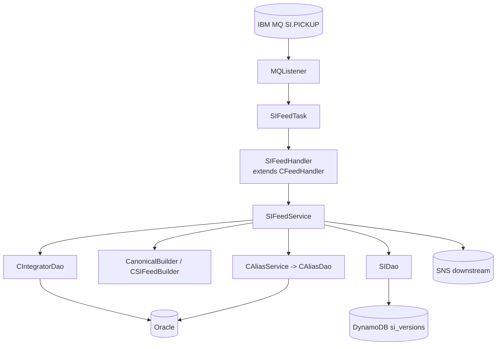
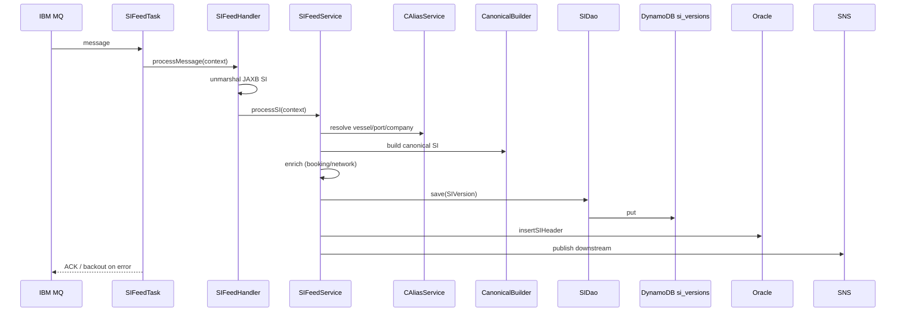

# Partner Integrator — pi-si-in-processor — Current-State Design

**Module:** `partner-integrator / pi-si-in-processor`
**Date:** 2026-06-30
**Status:** Current state (AWS SDK 1.x — upgrade NOT STARTED)
**Artifact:** `com.inttra.mercury:pi-si-in-processor:1.0` (Dropwizard, shaded JAR)
**Main class:** `com.inttra.mercury.sifeed.SIPIApplication`

---

## 1. Business Purpose & Rules

Inbound processor for **Shipping Instruction (SI)** EDI feeds. Picks up partner SI messages from IBM MQ, performs
**alias resolution** (partner references → INTTRA internal IDs), transforms to the **canonical SI** model, enriches,
persists versions to DynamoDB, mirrors a summary to Oracle, and publishes downstream.

### Flow / rules
1. IBM MQ listener polls the SI pickup queue → `SIFeedTask` per message.
2. Unmarshal JAXB SI payload.
3. Alias resolution: vessel (name+IMO) → vessel ID; port (UNLOCODE) → port ID; company (name+country) → participant ID.
4. Build canonical SI (`CanonicalBuilder` / `CSIFeedBuilder`).
5. Enrich from booking/network services (container count, weight).
6. Persist `SIVersion` to DynamoDB (`si_versions`); insert SI header to Oracle.
7. Publish to SNS downstream (SI out-processor, visibility, warehouse).
8. Validate JAXB/XSD, mandatory SI fields, container/port formats, dangerous-goods compliance, commodity codes.

---

## 2. Design & Component Diagram

### Key classes

| Class | Role |
|-------|------|
| `SIPIApplication` | Dropwizard `main` (with `LocalCacheModule`, `SIApplicationInjector`). |
| `SIApplicationInjector` | Guice: `AmazonDynamoDB`, Oracle `DataSource`, `SIDao`, `CAliasService`. |
| `MQListener` / `SIFeedTask` | MQ poll loop + per-message task. |
| `SIFeedHandler` | Unmarshal JAXB → `SIFeedService`. |
| `SIFeedService` | Alias resolution, canonical transform, enrich, persist, publish. |
| `CanonicalBuilder` / `CSIFeedBuilder` | Partner SI → canonical SI model. |
| `CAliasService` / `CAliasDao` | Resolve vessel/port/company aliases (Oracle). |
| `SIDao` | DynamoDB `SIVersion` (id + sequenceNumber). |
| `CIntegratorDao` | Oracle SI master data + booking linkages. |
| `NEntityType` / `NAliasType` | Alias enums (VESSEL/PORT/COMPANY…, IMO/SMDG/LOCODE/DUNS). |

---

## 3. Data Flow — SI inbound

---

## 4. Data Stores & Integrations

| Resource | Usage |
|----------|-------|
| IBM MQ (`mqPickupConfig`) | Inbound SI feed; backout queue. |
| DynamoDB `si_versions` | SI versions (id + sequenceNumber). |
| Oracle (SI schema + alias tables) | SI summary + alias resolution. |
| Booking module | Lookup booking by container number. |
| Network service REST | Participant aliases, geography, integration profiles. |
| SNS | Publish to SI out-processor, visibility, warehouse. |
| S3 (workspace) | Optional original-SI archive. |

---

## 5. Maven Dependencies

| Artifact | Version | Notes |
|----------|---------|-------|
| **`com.inttra.mercury:shipping-instruction`** | **`1.0.M`** | SI domain models (version pin). |
| `com.inttra.mercury:pi-commons` | `1.0` | Framework + AWS v1 clients. |
| `io.dropwizard:dropwizard-jdbi3` | `5.0.1` | Oracle access. |

AWS SDK v1 (`AmazonDynamoDB`, `DynamoDBMapper`, `AmazonSNS`, `AmazonS3`) via `pi-commons`.

---

## 6. Configuration & Deployment

### Configuration (`conf/<env>/config.yaml`)
`mqPickupConfig{queueMgrName, queueName, backoutQueue}`, `dynamoDbConfig{tableName: si_versions, region}`,
`database{oracle...}`, `usePassThrough`. Config class `SIApplicationConfig`.

### Deployment
`mvn -pl pi-si-in-processor -am clean package` → `pi-si-in-processor-1.0.jar`;
`java -jar pi-si-in-processor-1.0.jar server conf/<env>/config.yaml`.

---

## 7. AWS Services & SDK 1.x Usage (CALL-OUT)

| AWS service | v1 classes | Where |
|-------------|-----------|-------|
| DynamoDB | `AmazonDynamoDB`, `DynamoDBMapper`, ORM on `SIVersion` | `SIDao`, injector |
| SNS | `AmazonSNS` | downstream publish |
| S3 | `AmazonS3` | `S3WorkspaceService` (commons) |

---

## 8. AWS 2.x / cloud-sdk Upgrade Plan (High Level)

| Step | Action | Reference |
|------|--------|-----------|
| 1 | Consume upgraded `pi-commons`; align `shipping-instruction` pin. | pi-commons |
| 2 | Swap injector v1 bindings → cloud-sdk factories. | booking |
| 3 | Migrate `SIDao`/`SIVersion` → cloud-sdk `DatabaseRepository`; preserve `si_versions` schema/encoding. | network, registration |
| 4 | Migrate downstream **SNS** → `NotificationService`. | booking, network |
| 5 | **Tests** — DynamoDB-Local IT for `SIDao`; mocked SNS unit tests; full JaCoCo coverage; keep MQ/Oracle/alias behavior unchanged. | network/auth `*DaoIT` |

**Call-out:** Alias resolution (Oracle) and IBM MQ are out of AWS-SDK scope. Keep `si_versions` stream shape stable
for `pi-si-out-processor` and stream-to-SNS consumers.
