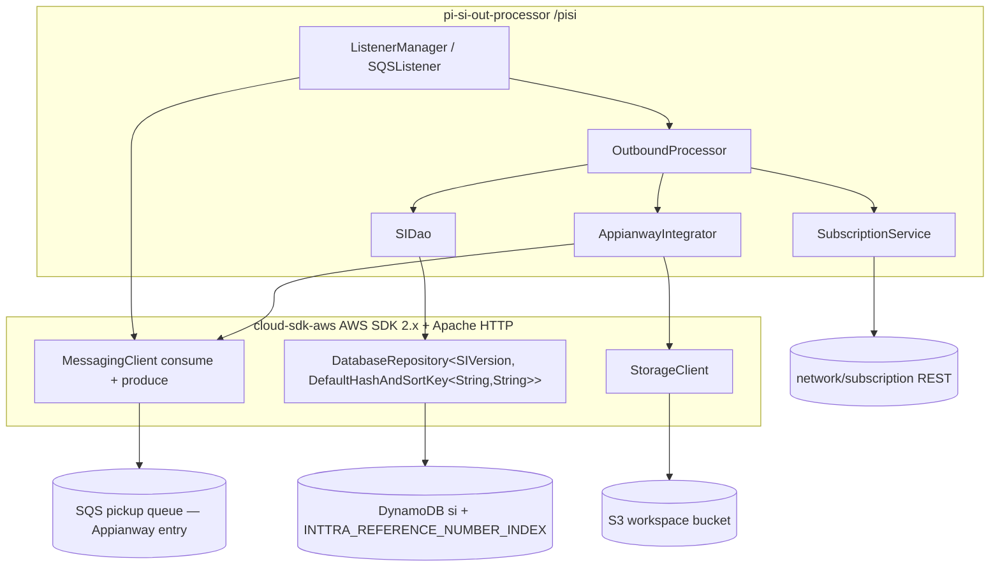
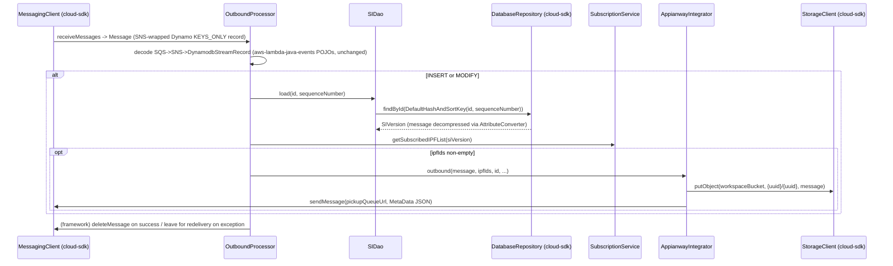

# Partner Integrator — pi-si-out-processor — AWS SDK 2.x (cloud-sdk) Upgrade Design

**Module:** `partner-integrator / pi-si-out-processor`
**Date:** 2026-06-30
**Status:** Target design (AWS 1.x → AWS 2.x via cloud-sdk) — **NOT STARTED** (gated on the `pi-commons` cloud-sdk upgrade)
**Companion:** `2026-06-30-partner-integrator-pi-si-out-processor-current-state-DESIGN-claude.md`
**Reference upgrades:** `booking` (S3 + DynamoDB, complete — `commons` `1.0.26-SNAPSHOT`, `cloud-sdk-api` + `cloud-sdk-aws`), `visibility` (S3 + DynamoDB + SNS/SQS), `network`/`registration` (DynamoDB DAO patterns)

---

## 1. Change Overview

Replace direct AWS SDK v1 (`com.amazonaws.*`) usage with the in-house **cloud-sdk** (`cloud-sdk-api` +
`cloud-sdk-aws`, AWS SDK 2.x Enhanced Client + Apache HTTP). **The bulk of the implementation lives in `pi-commons`**
(`SQSListenerClient`, `SQSClient`, `S3WorkspaceService`, `DynamoSupport`, `DynamoDBCrudRepository`,
`AppianwayIntegrator`); this module mostly **inherits** the change and re-wires its Guice injector. Four AWS services
are in scope here.

| AWS service | Current (v1) | Target (cloud-sdk / v2) |
|-------------|--------------|--------------------------|
| **SQS** | two `AmazonSQS` (`amazonSQSForListener`, `amazonSQSForSender`) built in `SIFeedApplicationInjector`; pi-commons `SQSListenerClient.receiveMessage` / `SQSClient.sendMessage`+`deleteMessage` | cloud-sdk messaging client(s) (verify exact name in booking/visibility — `MessagingClient`); keep the two-role split |
| **DynamoDB** | `AmazonDynamoDB` + `DynamoDBMapper` (via `dynamo-client`); `SIDao`, `CreateTables`, `DeleteTables`; entities `SI`/`SIVersion`/`ContainerEvent`/`EnrichedAttributes` | Enhanced client: `DatabaseRepository<T,K>` + `DynamoRepositoryFactory.createEnhancedRepository(...)` + `DefaultQuerySpec` |
| **S3** | `AmazonS3` built in the injector; pi-commons `S3WorkspaceService` (`putObject`/`getObject`) | `StorageClient` + `StorageClientFactory.createDefaultS3Client()` |
| **SSM (Parameter Store)** | direct v1 `AWSSimpleSystemsManagementClientBuilder.defaultClient().getParameters(...)` in `Utils` | v2/cloud-sdk SSM, or fold into the commons `${awsps:}` resolver and delete the direct call |

**Out of scope:** the `aws-lambda-java-events` POJOs (`DynamodbEvent`, `SNSEvent`) used to **decode** the SQS
envelope — these are event data-shapes from `aws-lambda-java-events`, **not** an AWS client, and stay on v1 even after
all client calls move to v2 (matches the partner-integrator playbook). The upstream `si`-stream → SNS → SQS fan-out is
external; this module only consumes the resulting SQS message.

**Backward-compatibility is mandatory.** The following must remain wire-identical:

- DynamoDB table **`si`**; key schema **`id`** (hash) + **`sequenceNumber`** (range, value `m_{epochMillis}_{state}`); GSI **`INTTRA_REFERENCE_NUMBER_INDEX`** (hash `siInttraReferenceNumber`); **`KEYS_ONLY`** stream; TTL on **`expiresOn`**.
- Attribute encodings: `message` stays **compressed** (`CompressionConverter`); `expiresOn` stays **epoch-seconds (N)** (`DateToEpochSecond`); `enrichedAttributes` stays a nested **map (M)**; remaining fields stay **strings (S)**.
- The inbound SQS message shape (SNS-wrapped DynamoDB `KEYS_ONLY` stream record JSON) and the outbound Appianway `MetaData` JSON written to the pickup queue.
- S3 workspace object key `{rootWorkflowUuid}/{fileUuid}`; per-env bucket/queue names (incl. **CVT = `inttra2_test` / `inttra2-cv-workspace`**).
- **Decoupling rule:** the DynamoDB on-wire attribute formats (compressed `message`, epoch-seconds `expiresOn`) are independent of the REST/SQS JSON shapes. The `AttributeConverter` governs the DynamoDB value; Jackson governs the JSON. Keep them distinct — do not let the v2 converter leak into the Appianway/REST JSON path or vice-versa.

---

## 2. Maven Dependency Changes

Most AWS artifacts arrive transitively through `pi-commons`, so the **primary lever is the `pi-commons` version**.
This module adds the DynamoDB-Local IT framework and keeps the Lambda **event** POJOs.

```diff
  <dependencies>
    <dependency>
      <groupId>com.inttra.mercury</groupId>
      <artifactId>shipping-instruction</artifactId>
      <version>1.0.M</version>   <!-- must be rebuilt against Enhanced-client annotations -->
    </dependency>
    <dependency>
      <groupId>com.inttra.mercury</groupId>
      <artifactId>booking</artifactId>
      <version>1.0.M</version>
    </dependency>
    <dependency>
      <groupId>com.inttra.mercury</groupId>
      <artifactId>pi-commons</artifactId>
-     <version>1.0</version>                      <!-- AWS v1 line via dynamo-client -->
+     <version>1.0</version>                      <!-- cloud-sdk-bearing pi-commons (cloud-sdk-api + cloud-sdk-aws, no dynamo-client) -->
      <scope>compile</scope>
      <exclusions>
        <exclusion><groupId>org.mybatis</groupId><artifactId>mybatis</artifactId></exclusion>
      </exclusions>
    </dependency>

    <!-- Lambda EVENT POJOs only — stays v1 (decodes the SQS->SNS->Dynamo-stream envelope) -->
    <dependency>
      <groupId>com.amazonaws</groupId>
      <artifactId>aws-lambda-java-events</artifactId>
      <version>2.0.1</version>
      <exclusions><exclusion><groupId>joda-time</groupId><artifactId>joda-time</artifactId></exclusion></exclusions>
    </dependency>

+   <!-- DynamoDB-Local integration-test framework (matches booking) -->
+   <dependency>
+     <groupId>com.inttra.mercury</groupId>
+     <artifactId>dynamo-integration-test</artifactId>
+     <version>${mercury.commons.version}</version>
+     <scope>test</scope>
+   </dependency>
+   <!-- AWS SDK v1 DynamoDB kept ONLY for DynamoDB Local in tests -->
+   <dependency>
+     <groupId>com.amazonaws</groupId>
+     <artifactId>aws-java-sdk-dynamodb</artifactId>
+     <version>1.12.721</version>
+     <scope>test</scope>
+   </dependency>
  </dependencies>
```

- If/when `pi-commons` exposes `cloud-sdk-api` / `cloud-sdk-aws` as *non-transitive* (the booking pattern declares them directly), add explicit `cloud-sdk-api` + `cloud-sdk-aws` dependencies here too at `${mercury.commons.version}` (`1.0.26-SNAPSHOT`).
- **After the commons swap there is no `com.amazonaws` *client* on the prod classpath** — only the `aws-lambda-java-events` POJOs remain (no client, no Netty). cloud-sdk uses **Apache HTTP**.

---

## 3. Configuration Changes (`conf/<env>/config.yaml`)

The `dynamoDbConfig` block keeps its keys and gains the cloud-sdk `BaseDynamoDbConfig` fields. The `environment`
prefixes — **including CVT's `inttra2_test`** — capacities, bucket, and both queue URLs are unchanged.

```diff
  dynamoDbConfig:
    environment: inttra2_qa          # CVT stays inttra2_test, INT inttra_int, PROD inttra2_prod
    readCapacityUnits: 25            # 100 in CVT/PROD
    writeCapacityUnits: 25
    sseEnabled: false
+   region: us-east-1
+   # local Dynamo emulator only:
+   #regionEndpoint: http://localhost:8000
+   #signingRegion: us-west-2

  s3WorkspaceConfig:
    bucket: inttra2-qa-workspace     # CVT inttra2-cv-workspace, INT inttra-int-workspace, PROD inttra2-pr-workspace

  sqsPickupConfig:      { queueUrl: ..., waitTimeSeconds: 20, maxNumberOfMessages: 3 }   # unchanged
  sqsDestinationConfig: { queueUrl: ... }                                                # unchanged
```

**Config class change** — `SIFeedApplicationConfig.dynamoDbConfig` field type moves from
`com.inttra.mercury.dynamo.respository.module.DynamoDbConfig` to
`com.inttra.mercury.cloudsdk.database.config.BaseDynamoDbConfig` (keep `@Valid @NotNull`, as in `BookingConfig`).
`sqsPickupConfig`/`sqsDestinationConfig`/`s3WorkspaceConfig`/`usePassThrough` are unchanged.

```diff
- import com.inttra.mercury.dynamo.respository.module.DynamoDbConfig;
+ import com.inttra.mercury.cloudsdk.database.config.BaseDynamoDbConfig;
  @Data
  @EqualsAndHashCode(callSuper = false)
  public class SIFeedApplicationConfig extends ApplicationConfiguration {
    @JsonProperty @NotNull @Valid private SQSConfig sqsPickupConfig;
    @JsonProperty @NotNull @Valid private S3Config s3WorkspaceConfig;
    @JsonProperty @NotNull @Valid private SQSConfig sqsDestinationConfig;
    @JsonProperty @NotNull private boolean usePassThrough;
-   @Valid @NotNull private DynamoDbConfig dynamoDbConfig;
+   @Valid @NotNull private BaseDynamoDbConfig dynamoDbConfig;
  }
```

---

## 4. Per-Service Spec

### 4.1 DynamoDB — `SI` / `SIVersion` / `ContainerEvent` + `SIDao`

**Entity before (v1 ORM, `SIVersion`/`SI` abridged):**
```java
@DynamoDBTable(tableName = "si")
@DynamoDBStream(StreamViewType.KEYS_ONLY)
public class SIVersion implements Expires, DynamoHashAndSortKey<String, String> {
  @DynamoDBHashKey @DynamoDBAttribute(attributeName = "id") public String getHashKey() {...}
  @DynamoDBRangeKey @DynamoDBAutoGeneratedKey @DynamoDBAttribute(attributeName = "sequenceNumber")
  public String getSortKey() {...}
  @DynamoDBIndexHashKey(globalSecondaryIndexName = INTTRA_REFERENCE_NUMBER_INDEX) private String siInttraReferenceNumber;
  @DynamoDBTypeConverted(converter = CompressionConverter.class) private String message;
  @DynamoDBTypeConverted(converter = DateToEpochSecond.class)    private Date expiresOn;
  private EnrichedAttributes enrichedAttributes; // nested map
}
```

**Entity after (Enhanced client, abridged — annotate getters as booking does):**
```java
@DynamoDbBean
@Table(name = "si")                          // com.inttra.mercury.cloudsdk.database.annotation.Table
public class SIVersion {
  @DynamoDbPartitionKey @DynamoDbAttribute("id")            public String getId() {...}
  @DynamoDbSortKey      @DynamoDbAttribute("sequenceNumber") public String getSequenceNumber() {...}

  @DynamoDbSecondaryPartitionKey(indexNames = "INTTRA_REFERENCE_NUMBER_INDEX")
  @DynamoDbAttribute("siInttraReferenceNumber")             public String getSiInttraReferenceNumber() {...}

  @DynamoDbConvertedBy(CompressionAttributeConverter.class) // compressed wire value, unchanged
  @DynamoDbAttribute("message")                             public String getMessage() {...}

  @DynamoDbConvertedBy(EpochSecondAttributeConverter.class) // epoch-seconds Number, unchanged (TTL attribute)
  @DynamoDbAttribute("expiresOn")                           public Date getExpiresOn() {...}

  @DynamoDbAttribute("enrichedAttributes")                  public EnrichedAttributes getEnrichedAttributes() {...}
}
```

- **`@DynamoDBAutoGeneratedKey` on the range key has no Enhanced-client equivalent.** The `sequenceNumber` is already set by the `SIVersion(id, state, expiresOn)` constructor (`m_{System.currentTimeMillis()}_{state}`), so the writer (upstream SI service) owns generation; for this module's read path the value is supplied by the stream record. Confirm no write path in the broader SI codebase relied on mapper auto-generation.
- **`EnrichedAttributes`** becomes `@DynamoDbBean` (no `@Table`).
- **GSI projection** moves to table-bootstrap (`CreateTables`); the entity only declares the secondary partition key.
- Do the **same** to `SI` (pi-commons) and `ContainerEvent` (pi-commons) so all three compile against Enhanced-client; `ContainerEvent` is the CRUD-repo domain type for `SIDao` and maps `@DynamoDBTable("container_events")` (also `KEYS_ONLY` + `DateToEpochSecond` on `expiresOn`).

**Converters** (re-implement as `software.amazon.awssdk.enhanced.dynamodb.AttributeConverter`, preserving the exact on-wire bytes/number):

| v1 converter | v2 replacement | On-wire encoding (unchanged) |
|---|---|---|
| `CompressionConverter` | `CompressionAttributeConverter` (`AttributeValue` `S` or `B` — **match what v1 wrote**) | compressed `message` payload |
| `DateToEpochSecond` | `EpochSecondAttributeConverter` (`AttributeValue` `N`) | `expiresOn` as epoch **seconds** (the TTL attribute) |

**DAO before/after:**
```java
// BEFORE — SIDao extends DynamoDBCrudRepository<ContainerEvent, DynamoHashAndSortKey<String,String>>
public SIVersion load(String id, String rangeKey) {
    return dynamoDBMapper.load(SIVersion.class, id, rangeKey);   // reads the "si" table
}

// AFTER — inject a DatabaseRepository; key is composite (partition id + sort sequenceNumber)
private final DatabaseRepository<SIVersion, DefaultHashAndSortKey<String,String>> repo;
public SIVersion load(String id, String rangeKey) {
    return repo.findById(new DefaultHashAndSortKey<>(id, rangeKey)).orElse(null);
}
```

- The CRUD-repo generic type (`ContainerEvent`) on the v1 superclass is essentially vestigial — only `load(SIVersion…)` is used. In v2, type `SIDao` directly on a `DatabaseRepository<SIVersion, …>` for the `si` table; if `ContainerEvent` access is needed elsewhere, add a second repo. Verify the exact composite-key helper name (`DefaultHashAndSortKey` / `DefaultPartitionAndSortKey`) against the booking/network DAO source.

### 4.2 SQS — listener (consume) + Appianway sender (produce)

**Before (v1):**
```java
// SIFeedApplicationInjector
bind(AmazonSQS.class).annotatedWith(Names.named("amazonSQSForListener")).toInstance(AmazonSQSClientBuilder.standard().build());
bind(AmazonSQS.class).annotatedWith(Names.named("amazonSQSForSender")).toInstance(AmazonSQSClientBuilder.standard().build());
// pi-commons SQSListenerClient.receiveMessage(ReceiveMessageRequest), SQSClient.sendMessage/deleteMessage
```

**After (cloud-sdk — exact client/method names to be confirmed in booking/visibility):**
```java
// Provide cloud-sdk messaging client(s); keep the two named roles so the listener and Appianway sender stay distinct
@Provides @Singleton @Named("messagingForListener") MessagingClient listenerClient() { return MessagingClientFactory.createDefault(); }
@Provides @Singleton @Named("messagingForSender")   MessagingClient senderClient()   { return MessagingClientFactory.createDefault(); }
// pi-commons SQSListenerClient/SQSClient re-implemented over MessagingClient (receiveMessages/sendMessage/deleteMessage)
```

- The listener consumes with `waitTimeSeconds=20`, `maxNumberOfMessages=3` — preserve these (carried from `sqsPickupConfig`). The Appianway sender targets `sqsPickupConfig.getQueueUrl()` per the current-state §4; the message body (`MetaData` JSON) must be byte-identical.

> **Gap call-out.** The current `AmazonSQSClientBuilder.standard().build()` sets **no** retry/timeout/connection-pool
> knobs (it relies on v1 defaults). If the cloud-sdk default messaging client differs materially in retry/visibility
> behaviour, validate against booking/visibility; the v1 baseline here is "all defaults", so the migration risk is low
> but should be asserted by the message-flow IT.

### 4.3 S3 — `S3WorkspaceService` (in pi-commons)

**Before (v1):** injector binds `AmazonS3 = AmazonS3ClientBuilder.standard().build()`; `S3WorkspaceService.putObject(bucket, fileName, content)` → `s3Client.putObject(...)`.

**After (cloud-sdk):**
```java
// SIFeedApplicationInjector — drop the AmazonS3 binding; provide StorageClient (or inherit from commons)
@Provides @Singleton StorageClient provideStorageClient() { return StorageClientFactory.createDefaultS3Client(); }
// pi-commons S3WorkspaceService.putObject -> storageClient.putObject(bucket, key, content)  (String overload, as booking uses)
```

- Appianway writes only via the `String`-content `putObject` overload; the `{uuid}/{uuid}` key shape is unchanged.

> **Gap call-out.** The v1 S3 client was built with **no** `ClientConfiguration` here (defaults). `createDefaultS3Client()`
> likewise exposes no retry/socket/pool tuning; if any non-default S3 behaviour is later required use
> `StorageClientFactory.createS3Client(AwsStorageConfig…)` or raise a `cloud-sdk-api` enhancement (same gap flagged in
> the bill-of-lading / visibility upgrades).

### 4.4 SSM — `Utils.ssmParameterlookup`

**Before (v1, direct):**
```java
GetParametersResult r = AWSSimpleSystemsManagementClientBuilder.defaultClient()
    .getParameters(new GetParametersRequest().withNames(parameterName).withWithDecryption(true));
```
**After:** prefer **deleting** this direct call and routing the `clientSecretPath` through the commons `${awsps:}`
resolver (which already handles Parameter Store). If a programmatic lookup must stay, port to the cloud-sdk/v2 SSM
client (`SsmClient.getParameters(GetParametersRequest.builder().names(name).withDecryption(true).build())`).

---

## 5. Guice Wiring Changes (`SIFeedApplicationInjector`)

```diff
  public void configure() {
    bind(S3Config.class).toInstance(siPIApplicationConfig.getS3WorkspaceConfig());
    bind(SQSConfig.class).toInstance(siPIApplicationConfig.getSqsDestinationConfig());
    bind(Clock.class).toInstance(Clock.systemUTC());
-   bind(AmazonSQS.class).annotatedWith(Names.named("amazonSQSForListener")).toInstance(AmazonSQSClientBuilder.standard().build());
-   bind(AmazonSQS.class).annotatedWith(Names.named("amazonSQSForSender")).toInstance(AmazonSQSClientBuilder.standard().build());
-   bind(AmazonS3.class).toInstance(AmazonS3ClientBuilder.standard().build());
+   // cloud-sdk messaging + storage clients provided via @Provides (see §4); keep listener/sender role split
    bind(AuthClient.class).asEagerSingleton();
    bind(IntegrationProfileFormatService.class).to(IntegrationProfileFormatServiceImpl.class);
    // ... ServiceDefinition bindings, AsyncDispatcher (OutboundProcessor provider), WorkspaceService -> S3WorkspaceService unchanged ...
-   AmazonDynamoDB client = DynamoSupport.newClient(siPIApplicationConfig.getDynamoDbConfig());
-   bind(AmazonDynamoDB.class).toInstance(client);
-   DynamoDBMapperConfig dynamoDBMapperConfig = getNewDynamoDBMapperConfig(siPIApplicationConfig.getDynamoDbConfig());
-   bind(DynamoDBMapperConfig.class).toInstance(dynamoDBMapperConfig);
-   DynamoDBMapper mapper = newMapper(client, siPIApplicationConfig.getDynamoDbConfig(), dynamoDBMapperConfig);
-   bind(DynamoDBMapper.class).toInstance(mapper);
+   // cloud-sdk DynamoDB repo provided via @Provides (see below); table-name prefixing moves into the factory config
  }
```

```diff
+ // New @Provides for the SI repository (pattern from BookingDynamoModule)
+ @Provides @Singleton SIDao provideSIDao(SIFeedApplicationConfig cfg) {
+     BaseDynamoDbConfig db = cfg.getDynamoDbConfig();
+     String tableName = db.getEnvironment() + "_si";   // preserve {prefix}_si  (NOT the _booking special-case path)
+     DatabaseRepository<SIVersion, DefaultHashAndSortKey<String,String>> repo =
+         DynamoRepositoryFactory.createEnhancedRepository(db.toClientConfig(), tableName, SIVersion.class,
+             DynamoRepositoryConfig.builder().domainType(SIVersion.class).build());
+     return new SIDao(repo);
+ }
```

- The v1 `getNewDynamoDBMapperConfig` table-name resolver (with the `BookingDetail → {prefix}_booking_…` special case) is replaced by explicit per-repo table-name construction; **the SI path always uses `{prefix}_si`**. If a `BookingDetail` repo is ever needed, build it with the `{prefix}_booking_booking_detail` name explicitly — don't carry the resolver forward.
- `SIDao`'s constructor changes from `(DynamoDBMapper, DynamoDBMapperConfig)` to `(DatabaseRepository<SIVersion, DefaultHashAndSortKey<String,String>>)`.

---

## 6. Target Component Diagram



## 7. Target Data Flow — outbound distribution (after)



---

## 8. Key Classes Changed

| Class | Change |
|-------|--------|
| `pom.xml` | bump `pi-commons` to the cloud-sdk-bearing line (and/or add `cloud-sdk-api` + `cloud-sdk-aws` explicitly); add `dynamo-integration-test` + test-scoped `aws-java-sdk-dynamodb`; **keep** `aws-lambda-java-events`. |
| `SIFeedApplicationConfig` | `dynamoDbConfig` type `DynamoDbConfig` → `BaseDynamoDbConfig`. |
| `SIFeedApplicationInjector` | drop the two `AmazonSQS`, the `AmazonS3`, and the `AmazonDynamoDB`/`DynamoDBMapper`/`DynamoDBMapperConfig` bindings; add `@Provides` for `MessagingClient`(s), `StorageClient`, and `SIDao` (cloud-sdk repo); remove `getNewDynamoDBMapperConfig`. |
| `SIDao` | `extends DynamoDBCrudRepository<…>` → injected `DatabaseRepository<SIVersion, DefaultHashAndSortKey<String,String>>`; `load` → `repo.findById(...)`. |
| `SIVersion` / `SI` / `ContainerEvent` / `EnrichedAttributes` | v1 ORM annotations → `@DynamoDbBean`/`@Table` + Enhanced key annotations; drop `@DynamoDBAutoGeneratedKey`; nested types → `@DynamoDbBean`. (`SI`/`ContainerEvent`/`EnrichedAttributes` live in pi-commons; `SIVersion`/`EnrichedAttributes` in shipping-instruction.) |
| `CompressionConverter`, `DateToEpochSecond` | re-implement as `AttributeConverter` (preserve compressed `message` + epoch-seconds `expiresOn` exactly). |
| `CreateTables` / `DeleteTables` | table/GSI/stream/TTL/SSE bootstrap via the cloud-sdk admin path; preserve table `si`, key schema, `INTTRA_REFERENCE_NUMBER_INDEX`, `KEYS_ONLY`, TTL on `expiresOn`, configured capacity. |
| `Utils.ssmParameterlookup` | direct v1 SSM → commons `${awsps:}` (preferred) or v2 `SsmClient`. |
| `OutboundProcessor` | **unchanged logic**; only the injected `SIDao` type differs. Envelope decode (`DynamodbEvent`/`SNSEvent`) stays v1. |
| `SubscriptionService` | unchanged (pure REST via `NetworkServiceClient`). |
| pi-commons `SQSListenerClient` / `SQSClient` / `S3WorkspaceService` / `DynamoSupport` / `DynamoDBCrudRepository` / `AppianwayIntegrator` | migrated **in pi-commons**; this module inherits. |

---

## 9. Testing Strategy

- **DynamoDB-Local IT** (`dynamo-integration-test` `BaseDynamoDbIT`, `@Tag("integration")`) for `SIDao`: `save`→`load(id, sequenceNumber)` round-trip on the `si` table; **converter fidelity** — write an item with the v1 mapper, read it back with the v2 repo and assert the `message` decompresses identically and `expiresOn` is the same epoch-seconds **N**; assert `INTTRA_REFERENCE_NUMBER_INDEX` and TTL on `expiresOn` are present after `CreateTables`.
- **Message-shape tests** for `OutboundProcessor.process`: feed a real SNS-wrapped `KEYS_ONLY` `DynamodbStreamRecord` JSON (INSERT/MODIFY/REMOVE; missing-`id` → `RuntimeException`) and assert the `(id, sequenceNumber)` extraction and that REMOVE is a no-op. Assert the Appianway `MetaData` JSON written to the pickup queue is byte-identical (mock `MessagingClient`/`StorageClient`).
- **Subscription matching** unit tests for `SubscriptionService.getSubscribedIPFList` (condition AND over `transactionPartyList`, EDI-action `refId` collection, empty/short-circuit).
- Reuse the existing `OutboundProcessorTest` / `SIDaoTest` / `CreateTablesTest` / `DeleteTablesTest` / `SubscriptionServiceTest` / `SIResourceTest` / `UtilsTest` after the mock types change (`AmazonSQS`/`AmazonS3`/`DynamoDBMapper` → cloud-sdk clients/repo).
- Certify **full local JaCoCo coverage** on changed code (`**/config/**` is Sonar-excluded, so the DAO + converters + processor carry the weight):
  ```
  mvn -f partner-integrator/pi-si-out-processor/pom.xml clean verify
  ```

---

## 10. Risks & Call-outs

- **Largest dependency = `pi-commons`.** This module cannot migrate independently — it is gated on a cloud-sdk `pi-commons` *and* on `shipping-instruction`/`booking` model artifacts being rebuilt against Enhanced-client annotations (the `1.0.M` versions are fetched from S3 Maven repos; their rebuilt coordinates must be available).
- **`message` compression + epoch-seconds TTL** — `CompressionConverter` and `DateToEpochSecond` must produce byte/number-identical wire values; a converter regression silently corrupts every `si` item or breaks TTL expiry.
- **`KEYS_ONLY` stream + re-load contract** — the SQS→SNS→`DynamodbStreamRecord` envelope decode and the `id`/`sequenceNumber` extraction must stay shape-compatible; the upstream fan-out is external and unchanged. Keep `aws-lambda-java-events` on **v1** (event POJOs only — not a client).
- **`@DynamoDBAutoGeneratedKey` on `sequenceNumber`** has no v2 equivalent — confirm the value is always set by the SI writer / present on the stream record before any `save`; a missed path would write a null/empty range key.
- **Two SQS roles with queue overlap** — keep the `amazonSQSForListener` / `amazonSQSForSender` split; note the Appianway sender targets the **pickup** queue URL (not the destination queue). The destination queue binding is an Appianway constructor input.
- **Table-name resolver special case** — the v1 `BookingDetail → {prefix}_booking_…` branch must not be carried into the v2 factory; the SI path is always `{prefix}_si`.
- **CVT prefix trap** — CVT DynamoDB prefix is **`inttra2_test`** and the bucket is **`inttra2-cv-workspace`** — **not** `inttra2_cvt_*`. INT also uses a different account (`081020446316` vs `642960533737`). Carry these exact strings through the `BaseDynamoDbConfig` migration.
- **Sequencing** — migrate in incremental, test-verified steps; one outgoing commit per the team workflow, and every commit message must carry the Jira ticket prefix (e.g. `ION-xxxxx …`).
